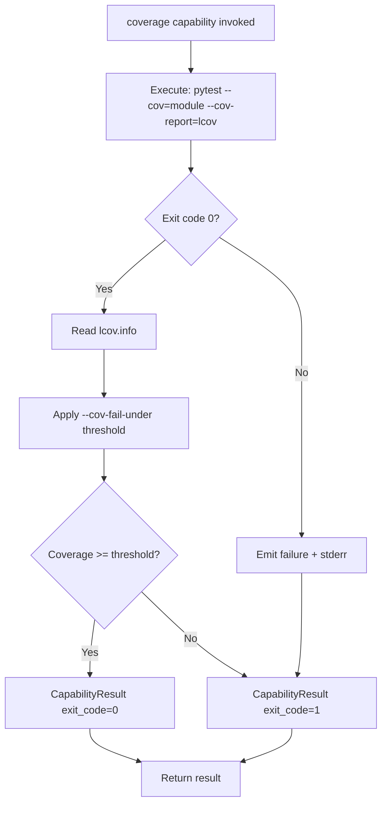
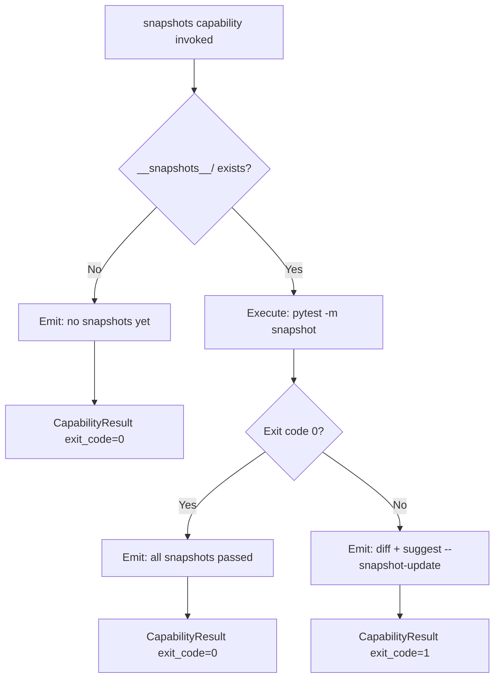
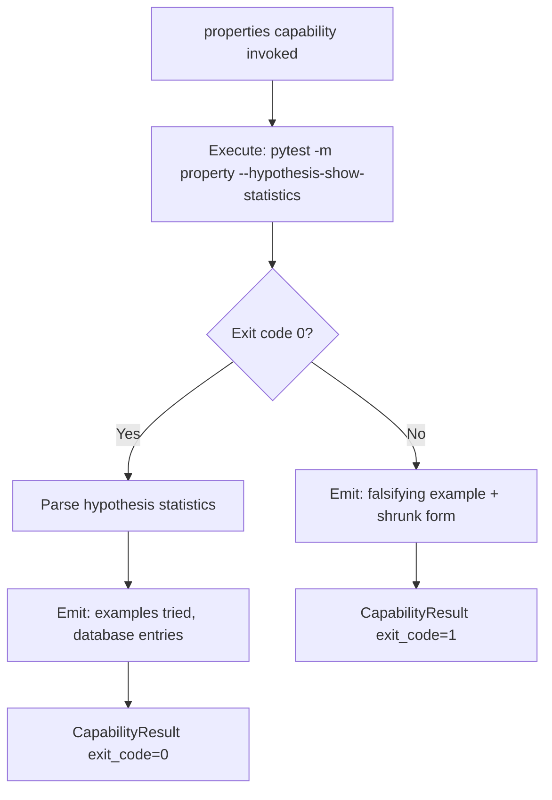
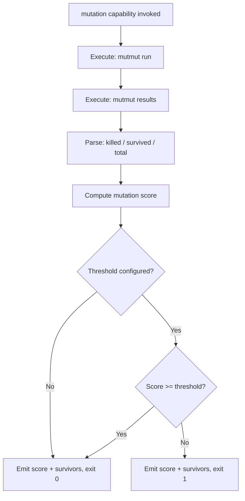

# Feature Spec: Driver Python — Built-in Test Orchestration Driver

- **Feature:** Driver Python
- **Branch:** feature/017-driver-python
- **Date:** 2026-05-06
- **Status:** Implemented
- **Priority:** P1
- **Scope:** M
- **Input:** Built-in Python driver implementing all 5 test orchestration capabilities for the driver system (Feature 016). Pilote implementation — validates the driver architecture end-to-end on the most accessible stack. Tools: pytest-cov (coverage), syrupy (snapshots), hypothesis (property-based), mutmut (mutation), pytest fixtures for migration tests.
- **Feature Number:** 017
- **Deps:** 016

---

## User Scenarios & Testing

### Story 1 — Developer runs coverage gate on Python project `P1`

A developer with a Python project (pyproject.toml) runs `/spec.test`. The Python driver is auto-detected, `pytest --cov` is executed with the configured threshold, a `lcov.info` report is produced, and the gate passes or fails based on the result.

**Priority reason:** Coverage gate is the most requested baseline test quality metric. First capability to validate.

**Independent test:** Run driver coverage capability on a Python fixture project; verify lcov.info is produced and gate threshold is applied.

```gherkin
Feature: Python coverage gate
  Scenario: Coverage above threshold — gate passes
    Given a Python project with pyproject.toml
    And the coverage threshold is set to 80%
    And pytest --cov reports 87% coverage
    When the Python driver executes the coverage capability
    Then CapabilityResult.exit_code is 0
    And lcov.info is written at the configured report_path
    And LiveSpec emits "Coverage gate passed: 87% >= 80%"

  Scenario: Coverage below threshold — gate fails
    Given a Python project with pyproject.toml
    And the coverage threshold is set to 80%
    And pytest --cov reports 72% coverage
    When the Python driver executes the coverage capability
    Then CapabilityResult.exit_code is non-zero
    And LiveSpec emits "Coverage gate failed: 72% < 80%"
    And lcov.info is still written (for patch coverage computation)

  Scenario: No tests found — capability fails clearly
    Given a Python project with pyproject.toml
    And the tests/ directory is empty
    When the Python driver executes the coverage capability
    Then CapabilityResult.exit_code is non-zero
    And LiveSpec emits "No tests collected by pytest"
```



---

### Story 2 — Developer runs snapshot tests on Python project `P1`

The snapshot capability runs `pytest -m snapshot` (or equivalent), comparing current CLI/function outputs to stored `.ambr` snapshots. Failures indicate output regressions.

**Priority reason:** Snapshot tests are the primary CLI regression guard for LiveSpec itself. Validates story before broader stack rollout.

**Independent test:** Run snapshot capability on fixture project with syrupy snapshots; verify pass on no change, fail on diff.

```gherkin
Feature: Python snapshot testing
  Scenario: Snapshots match — capability passes
    Given a Python project with syrupy installed
    And existing __snapshots__/*.ambr files
    And no code changes since last snapshot update
    When the Python driver executes the snapshots capability
    Then CapabilityResult.exit_code is 0
    And LiveSpec emits "Snapshots: all N passed"

  Scenario: Snapshot mismatch detected — capability fails
    Given a Python project with syrupy snapshots
    And a function output has changed since last --snapshot-update
    When the Python driver executes the snapshots capability
    Then CapabilityResult.exit_code is non-zero
    And LiveSpec emits the diff between expected and actual snapshot
    And LiveSpec suggests: "Run pytest --snapshot-update to accept changes"

  Scenario: No snapshots exist yet — first-run mode
    Given a Python project with syrupy configured
    And no __snapshots__/ directory exists
    When the Python driver executes the snapshots capability
    Then LiveSpec emits: "No snapshots found. Run pytest --snapshot-update to create baselines."
    And CapabilityResult.exit_code is 0 (not blocked on first run)
```



---

### Story 3 — Developer runs property-based tests on Python project `P2`

The properties capability runs `pytest -m property` which triggers hypothesis-based tests. Results are reported with statistics (examples tried, shrinkage).

**Priority reason:** Property-based tests on parsers catch edge cases invisible to hand-written tests.

**Independent test:** Run properties capability on fixture project with hypothesis tests; verify statistics are captured and reported.

```gherkin
Feature: Python property-based testing via hypothesis
  Scenario: All property tests pass
    Given a Python project with hypothesis installed
    And tests marked @given(...) exist
    When the Python driver executes the properties capability
    Then CapabilityResult.exit_code is 0
    And LiveSpec emits hypothesis statistics (examples tried, database entries)

  Scenario: Property test finds a falsifying example
    Given a Python project with a hypothesis test
    And the tested function has a bug triggered by edge input
    When the Python driver executes the properties capability
    Then CapabilityResult.exit_code is non-zero
    And LiveSpec emits the falsifying example and its shrunk form
```



---

### Story 4 — Developer runs mutation audit on Python project `P3`

The mutation capability runs `mutmut run` and reports the mutation score (% of mutants killed). This is an on-demand audit, not a per-PR gate.

**Priority reason:** Mutation testing is the deepest quality signal. P3 because it's slow and used as an audit tool, not a routine CI gate.

**Independent test:** Run mutation capability on small fixture project; verify mutation score is reported and surviving mutants are listed.

```gherkin
Feature: Python mutation testing via mutmut
  Scenario: Mutation audit completes — score reported
    Given a Python project with mutmut installed
    And source files and test files exist
    When the Python driver executes the mutation capability
    Then CapabilityResult.exit_code is 0
    And LiveSpec emits the mutation score (% killed)
    And LiveSpec emits the list of surviving mutants with file:line references

  Scenario: Mutation score below optional threshold
    Given the mutation capability has a threshold of 70%
    And mutmut reports 55% of mutants killed
    When the Python driver executes the mutation capability
    Then CapabilityResult.exit_code is non-zero
    And LiveSpec emits "Mutation score: 55% < 70% threshold"
```



---

## Acceptance Criteria

- **AC-001** — Driver file `livespec/drivers/python.yaml` exists and is loaded by the DriverRegistry when `pyproject.toml` or `setup.py` or `requirements.txt` is found at project root.
- **AC-002** — Coverage capability executes `pytest --cov={module} --cov-report=lcov:{report_path} --cov-fail-under={threshold}` and returns a `CapabilityResult` with the actual exit code.
- **AC-003** — Coverage capability writes `lcov.info` to the configured `report_path`. Absence of the file after execution = capability failure.
- **AC-004** — The Python `module` to measure is configurable in `python.yaml` (default: inferred from `pyproject.toml` `[tool.pytest.ini_options]` or package name).
- **AC-005** — Snapshots capability detects `syrupy` presence (`pip show syrupy`) and executes `pytest --snapshot-warn-unused` (pass) or `pytest` (standard run).
- **AC-006** — On snapshot mismatch, LiveSpec surfaces the snapshot diff in its output and suggests `pytest --snapshot-update`.
- **AC-007** — On first run (no `__snapshots__/` directory), snapshot capability exits 0 with an informational message, not a failure.
- **AC-008** — Properties capability executes `pytest -m property --hypothesis-show-statistics` and returns CapabilityResult. Missing `hypothesis` installation = warning, not hard failure.
- **AC-009** — Mutation capability executes `mutmut run` followed by `mutmut results --use-coverage` and parses the kill rate. Missing `mutmut` = warning with install instruction, not hard failure.
- **AC-010** — Each capability command is configurable via override keys in `python.yaml` (`coverage.command`, `snapshots.command`, etc.) to support non-standard project layouts.
- **AC-011** — The Python driver is validated against the `DriverSchema` (FR-001 of feature 016) and passes schema validation on load.
- **AC-012** — All 4 implemented capabilities (coverage, snapshots, properties, mutation) appear in `/spec.test` output summary with their status (pass / fail / not-implemented / skipped).

---

## Functional Requirements

- **FR-001** — Write `livespec/drivers/python.yaml` implementing all 4 active capabilities (coverage, snapshots, properties, mutation) with correct command templates and report paths.
- **FR-002** — Implement module auto-detection: read `pyproject.toml` → `[tool.pytest.ini_options].testpaths` or `[project].name`; fall back to `src/` or project root scan.
- **FR-003** — Implement syrupy detection: `pip show syrupy` — if not installed, emit "syrupy not installed" warning and skip snapshots capability (exit 0).
- **FR-004** — Implement first-run detection for snapshots: check if `**/__snapshots__/` glob returns any `.ambr` files — if none, emit informational and exit 0.
- **FR-005** — Implement mutmut result parsing: run `mutmut results --json` (if available) or parse text output to extract killed/survived/timeout counts and compute score.
- **FR-006** — Write integration tests in `tests/integration/test_driver_python.py` covering all 4 capabilities on fixture projects.
- **FR-007** — Write unit tests for module auto-detection logic and mutmut result parser.

---

## Key Entities

| Entity | Description |
|---|---|
| `python.yaml` | The Python built-in driver manifest. Lives in `livespec/drivers/python.yaml`. |
| `pytest-cov` | Python coverage tool. Produces lcov.info via `--cov-report=lcov`. |
| `syrupy` | Python snapshot library. Stores `.ambr` files in `__snapshots__/`. |
| `hypothesis` | Property-based testing library. Driven via `@given()` decorators. |
| `mutmut` | Python mutation testing tool. Produces kill/survived report. |

---

## Edge Cases

- **EC-001** — `pyproject.toml` exists but has no `[project].name`: fall back to directory name for module detection.
- **EC-002** — `pytest-cov` not installed: capability fails with "pytest-cov not installed — run: pip install pytest-cov".
- **EC-003** — `mutmut` reports 0 mutants (empty source): exit 0 with "No mutants generated — check source paths".
- **EC-004** — `hypothesis` not installed: properties capability exits 0 with warning (non-blocking — not all Python projects use hypothesis).
- **EC-005** — Project uses `setup.cfg` instead of `pyproject.toml`: driver still detects Python via `setup.cfg` or `requirements.txt` file patterns.

---

## Success Criteria

- **SC-001** — Coverage capability on a real Python project produces a valid `lcov.info` parseable by `compute_patch_coverage()`.
- **SC-002** — All 4 capabilities are exercised in CI on a fixture project without manual configuration.
- **SC-003** — Integration tests in `test_driver_python.py` cover happy path and failure path for all 4 capabilities.
- **SC-004** — The Python driver YAML passes schema validation (`livespec validate livespec/drivers/python.yaml`).

---

*LiveSpec Feature 017 — Draft — 2026-05-06*
