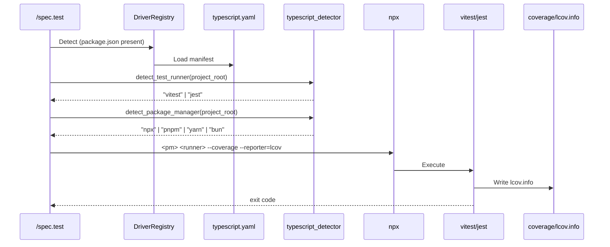
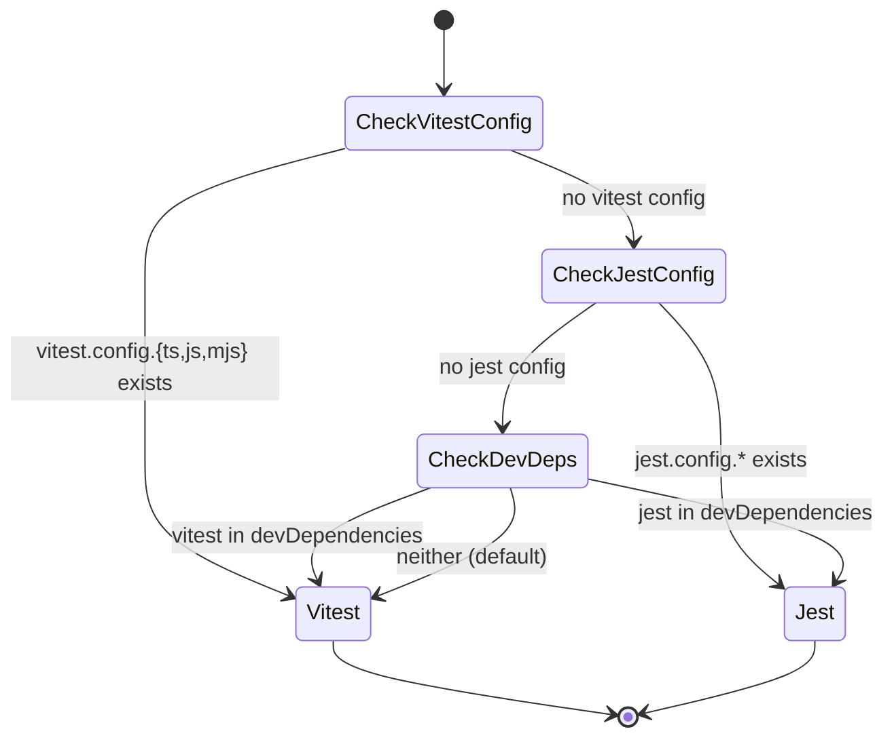
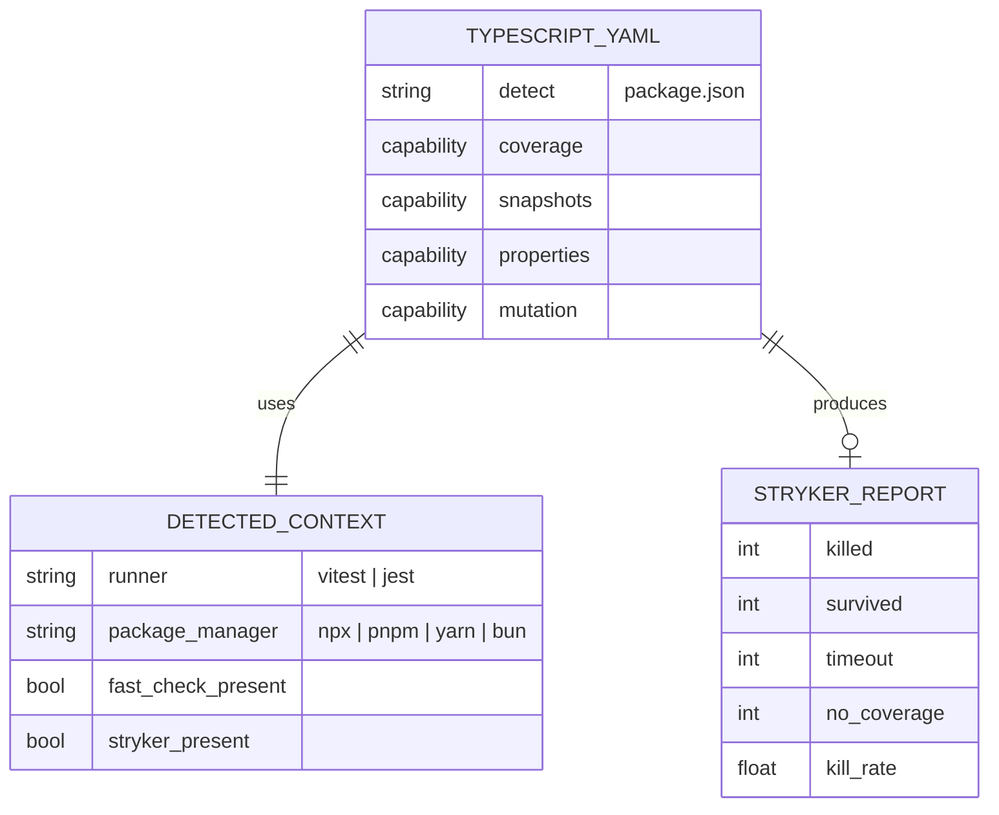

# Plan — Driver TypeScript/JavaScript — Built-in Test Orchestration Driver

## Summary

Implement a built-in TS/JS driver (`livespec/drivers/typescript.yaml`) covering 4 capabilities (coverage, snapshots, properties, mutation). Mirrors the Feature 017 (Python) shape, adapted to the JavaScript ecosystem: vitest/jest as runners, fast-check for properties, Stryker for mutation testing. Adds two helper modules: a runner detector (vitest vs jest, plus package-manager prefix) and a Stryker JSON report parser.

---

## Technical Context

| Aspect | Choice | Reason |
|---|---|---|
| Language | TypeScript / JavaScript | Most common LiveSpec user stack |
| Test Runner (primary) | vitest | Modern, fast, native V8 coverage, native snapshots |
| Test Runner (fallback) | jest | Mature, Istanbul coverage, native snapshots |
| Coverage Format | lcov.info | Native output of both runners; consumed by `compute_patch_coverage()` |
| Property Testing | fast-check | De-facto property testing lib for TS/JS, integrates with vitest/jest |
| Mutation Testing | Stryker (`@stryker-mutator/core`) | Reference mutation tool for TS/JS, JSON report |
| Package Manager | npx (default), npm/yarn/pnpm/bun (auto-detected) | Driven by lockfile presence |
| Driver Schema | YAML (pydantic) | Defined in Feature 016; reuses `DriverManifest` schema |

---

## Constitution Check

- **Simplicity:** YAML is declarative. Detection logic is pure functions over the filesystem. No new abstractions.
- **Separation:** Two focused modules (`typescript_detector.py`, `stryker_parser.py`) — same shape as 017's `python_detector.py` + `mutmut_parser.py`.
- **Testing:** Unit tests for detection + parser; integration tests for manifest schema, registry discovery, and capability metadata.
- **Naming:** Files follow conventions (`livespec/drivers/typescript.yaml`, `tests/unit/test_typescript_detector.py`, `tests/integration/test_driver_typescript.py`).
- **Infrastructure:** No external services. Driver invokes locally-installed npm packages.

---

## Mermaid Diagrams

### Sequence Diagram — Coverage Capability Execution



### State Diagram — Runner Detection



### ER Diagram — TS Driver Configuration



---

## Implementation Plan

### Step 1 — Write `livespec/drivers/typescript.yaml` with all 4 capabilities

**Files:**
- **Modify:** `livespec/drivers/typescript.yaml` (replace the stub from Feature 016)

**Schema constraints (Feature 016):** `DriverCapability` accepts only `command`, `script`, `report_path`, `threshold`, `patch_threshold` (extra fields forbidden). Per-runner / per-package-manager logic is performed in Python (`typescript_detector`), not in YAML.

**Manifest:**
```yaml
name: typescript
detect:
  files:
    - package.json
coverage:
  command: npx vitest run --coverage --coverage.reporter=lcov
  report_path: coverage/lcov.info
  threshold: 80
snapshots:
  command: npx vitest run
properties:
  command: npx vitest run
mutation:
  command: npx stryker run
  report_path: reports/mutation/mutation.json
  threshold: 60
```

**FR covered:** FR-001 — TS/JS driver YAML with 4 capabilities and detect rule.
**AC covered:** AC-001, AC-003, AC-005, AC-008, AC-009, AC-010, AC-011, AC-012.

---

### Step 2 — Implement detection helpers in `validator/drivers/typescript_detector.py`

**Files:**
- **Create:** `validator/drivers/typescript_detector.py`

**Functions:**
- `detect_test_runner(project_root: str) -> str` — returns `"vitest"` or `"jest"` per AC-002 / EC-005:
  1. `vitest.config.{ts,js,mjs,cjs}` exists → `"vitest"`
  2. `jest.config.{ts,js,mjs,cjs,json}` exists → `"jest"`
  3. `package.json devDependencies` includes `vitest` → `"vitest"`
  4. `package.json devDependencies` includes `jest` → `"jest"`
  5. default → `"vitest"`
- `detect_package_manager(project_root: str) -> str` — per FR-004:
  1. `bun.lockb` → `"bun"`
  2. `pnpm-lock.yaml` → `"pnpm"`
  3. `yarn.lock` → `"yarn"`
  4. `package-lock.json` → `"npm"`
  5. default → `"npx"`
- `has_dependency(project_root: str, name: str, *, dev_only: bool = False) -> bool` — reads package.json (defensive), checks `dependencies` and `devDependencies`. Used to detect `fast-check` (AC-008) and `@stryker-mutator/core` (AC-009).

**FR covered:** FR-002 (runner detection), FR-004 (package manager detection).
**AC covered:** AC-002, AC-008, AC-009, AC-012.
**EC covered:** EC-002, EC-005.

---

### Step 3 — Implement Stryker JSON report parser in `validator/drivers/stryker_parser.py`

**Files:**
- **Create:** `validator/drivers/stryker_parser.py`

**Functions:**
- `parse_stryker_report(json_text: str | None) -> StrykerParseResult` — accepts either Stryker's mutation-report-schema JSON or `None` (returns empty zero-valued result).
  - Sums per-file mutant statuses across `files.<path>.mutants[].status`:
    - `Killed` → killed
    - `Survived` → survived
    - `Timeout` → timeout
    - `NoCoverage` → no_coverage
  - Falls back to top-level `metrics` keys (`killed`, `survived`, `timeout`, `noCoverage`) when present (alternate report shape).
- `compute_kill_rate(killed: int, survived: int, timeout: int) -> float` — `(killed + timeout) / (killed + survived + timeout) * 100`. Returns `0.0` on empty totals.
- `load_stryker_report(report_path: Path) -> StrykerParseResult` — convenience wrapper that reads the file and delegates to `parse_stryker_report()`. Returns empty result if the file is missing or unreadable.

**FR covered:** FR-003 (Stryker JSON parsing).
**AC covered:** AC-010.

---

### Step 4 — Write unit tests for detector + parser

**Files:**
- **Create:** `tests/unit/test_typescript_detector.py`
- **Create:** `tests/unit/test_stryker_parser.py`

**Coverage (detector):**
- `test_detect_test_runner_prefers_vitest_config`
- `test_detect_test_runner_uses_jest_config_when_no_vitest`
- `test_detect_test_runner_devdependencies_vitest`
- `test_detect_test_runner_devdependencies_jest`
- `test_detect_test_runner_default_vitest_when_nothing`
- `test_detect_package_manager_bun_lockfile`
- `test_detect_package_manager_pnpm_lockfile`
- `test_detect_package_manager_yarn_lockfile`
- `test_detect_package_manager_npm_lockfile`
- `test_detect_package_manager_default_npx`
- `test_has_dependency_finds_in_dependencies`
- `test_has_dependency_finds_in_dev_dependencies`
- `test_has_dependency_returns_false_when_absent`
- `test_has_dependency_handles_missing_package_json`
- `test_has_dependency_handles_malformed_package_json`

**Coverage (parser):**
- `test_compute_kill_rate_basic`
- `test_compute_kill_rate_perfect`
- `test_compute_kill_rate_no_mutants`
- `test_compute_kill_rate_includes_timeout_as_killed`
- `test_parse_stryker_report_files_shape`
- `test_parse_stryker_report_metrics_shape`
- `test_parse_stryker_report_invalid_json`
- `test_parse_stryker_report_none_input`
- `test_load_stryker_report_missing_file`
- `test_load_stryker_report_reads_disk`

**FR covered:** FR-006 (unit tests).

---

### Step 5 — Write integration tests for the TS driver manifest

**Files:**
- **Create:** `tests/integration/test_driver_typescript.py`

**Test cases:**
- `test_registry_loads_typescript_driver` (AC-001) — `package.json` present → driver `typescript` is discovered.
- `test_typescript_driver_schema_validation` (AC-011) — manifest validates and exposes all 4 capabilities.
- `test_typescript_driver_capabilities_exist` (AC-012) — `implemented_capabilities()` lists all four.
- `test_coverage_capability_metadata` (AC-003, AC-004) — `report_path == "coverage/lcov.info"`, `threshold == 80`.
- `test_snapshots_capability_metadata` (AC-005, AC-006) — command runs the test runner.
- `test_mutation_capability_metadata` (AC-009, AC-010) — `report_path == "reports/mutation/mutation.json"`, `threshold` set.
- `test_typescript_driver_detects_package_json` — detect rule contains `package.json`.
- `test_runner_detection_in_fixture_vitest` — fixture project with `vitest.config.ts` → `detect_test_runner()` returns `"vitest"`.
- `test_runner_detection_in_fixture_jest` — fixture project with `jest.config.js` only → returns `"jest"`.
- `test_package_manager_detection_in_fixture_pnpm` — fixture with `pnpm-lock.yaml` → `"pnpm"`.

**FR covered:** FR-005 (integration tests).

---

### Step 6 — Update changelog and implementation map

**Files:**
- **Modify:** `.specs/features/018-driver-typescript-javascript/changelog.md`
- **Create:** `.specs/features/018-driver-typescript-javascript/implementation.md`
- **Create:** `.specs/features/018-driver-typescript-javascript/progress.md`

---

## Testing Strategy

| Test Type | What | File | AC |
|---|---|---|---|
| Unit | Runner detection (5 paths) | tests/unit/test_typescript_detector.py | AC-002 |
| Unit | Package manager detection (5 paths) | tests/unit/test_typescript_detector.py | AC-012, FR-004 |
| Unit | Dependency lookup | tests/unit/test_typescript_detector.py | AC-008, AC-009 |
| Unit | Stryker parser (files+metrics shapes) | tests/unit/test_stryker_parser.py | AC-010 |
| Unit | Kill rate computation | tests/unit/test_stryker_parser.py | AC-010 |
| Integration | Registry discovers typescript driver | tests/integration/test_driver_typescript.py | AC-001 |
| Integration | Schema validation + capability metadata | tests/integration/test_driver_typescript.py | AC-003, AC-005, AC-009, AC-011 |
| Integration | Runner / pm detection on fixtures | tests/integration/test_driver_typescript.py | AC-002, EC-005 |

---

## Risks & Considerations

1. **Schema flexibility:** `DriverCapability` is intentionally minimal (`command/script/report_path/threshold/patch_threshold`). Per-runner branching cannot be expressed in YAML; it lives in Python helpers. The driver YAML uses `npx` + `vitest` defaults; `/spec.test` callers can override commands by pointing at `.specs/drivers/typescript.yaml`.
2. **Stryker report shapes:** Stryker emits `mutation-report-schema` JSON with `files.<path>.mutants[]`. Some setups prefer the slimmer `metrics` block. Parser supports both.
3. **Fast-check / Stryker absence:** treated as graceful skip via `has_dependency()` — capabilities still ship in YAML; the calling layer decides to skip when the dep is absent (consistent with 017 syrupy/hypothesis policy).
4. **Bun:** `bun test` has its own coverage flags; default YAML uses npx vitest. Bun support flows through `detect_package_manager()` and is documented in EC-002.

---

## Success Criteria

- SC-001: `coverage/lcov.info` produced by vitest/jest is parseable by `compute_patch_coverage()` (covered by Feature 016).
- SC-002: Driver YAML passes `DriverManifest` validation (covered by `test_typescript_driver_schema_validation`).
- SC-003: Vitest and jest detection paths each have a dedicated unit + integration test.
- SC-004: All four package managers (npm/yarn/pnpm/bun) are detected from lockfile presence.

---

*LiveSpec Feature 018 Plan — Approved — 2026-05-07*
