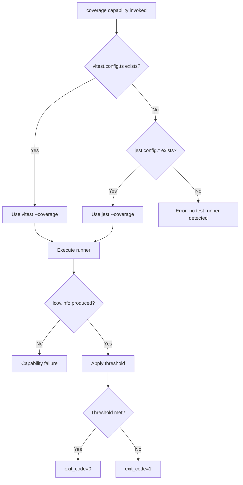
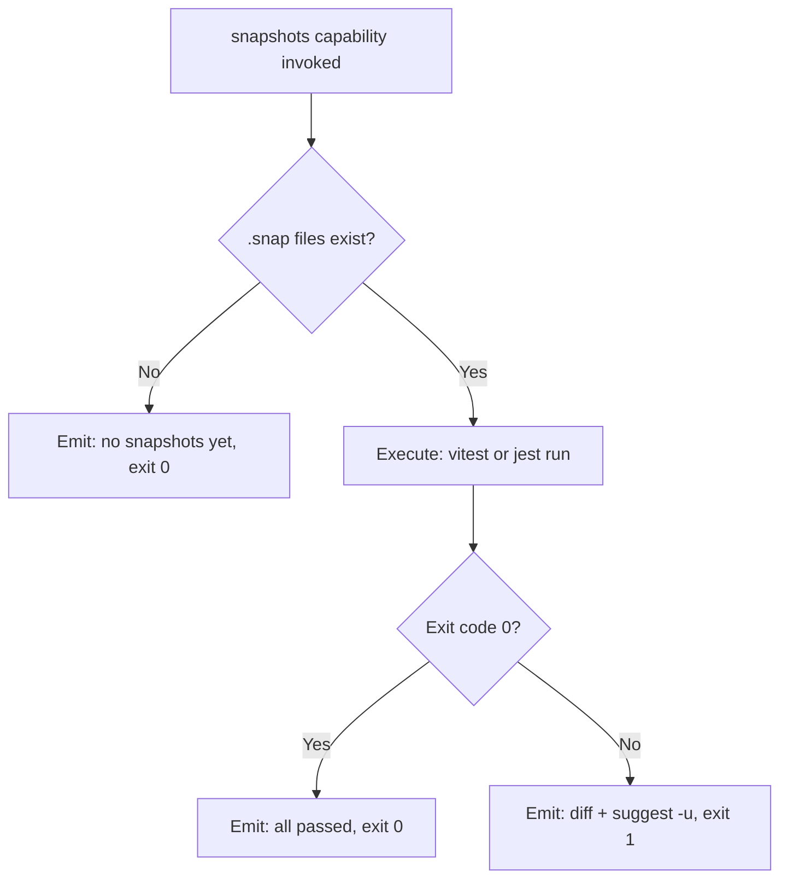
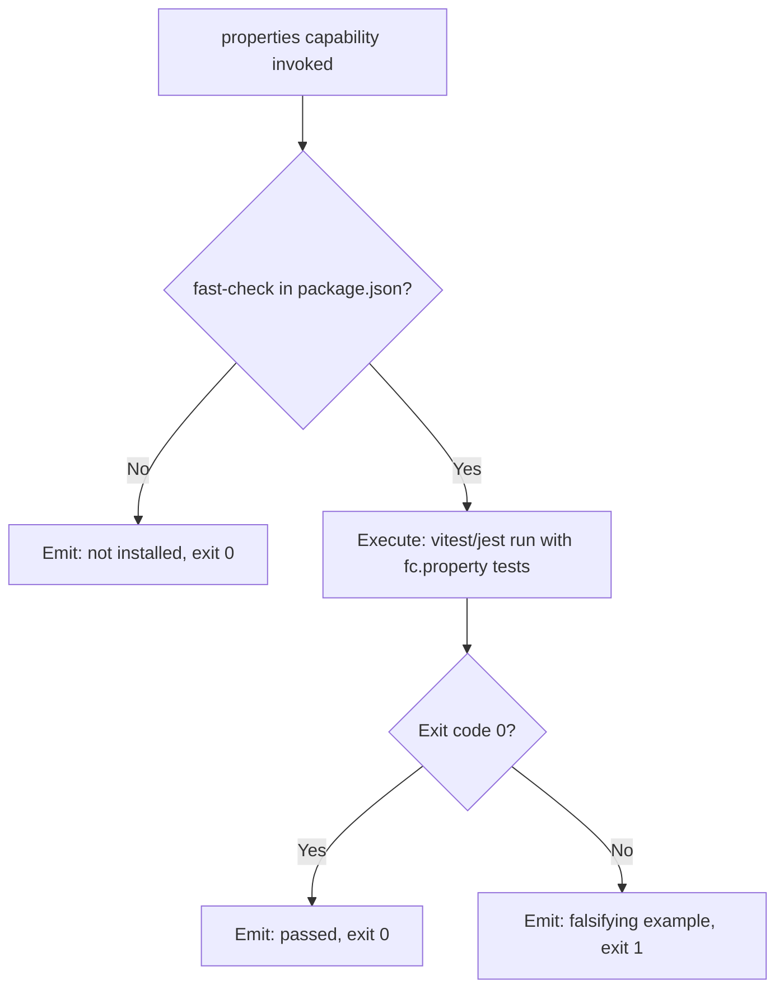
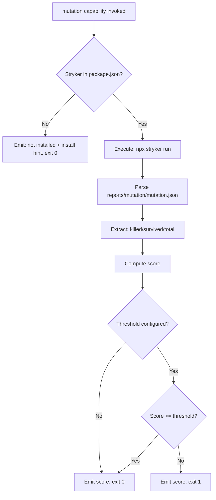

# Feature Spec: Driver TypeScript/JavaScript — Built-in Test Orchestration Driver

- **Feature:** Driver TypeScript/JavaScript
- **Branch:** feature/018-driver-typescript-javascript
- **Date:** 2026-05-06
- **Status:** Draft
- **Priority:** P1
- **Scope:** M
- **Input:** Built-in TS/JS driver implementing test orchestration capabilities for TypeScript and JavaScript projects. Tools: vitest or jest (coverage + snapshots), fast-check (property-based), Stryker (mutation). Coverage uses V8 native coverage or Istanbul via vitest/jest. lcov.info output is native to both runners.
- **Feature Number:** 018
- **Deps:** 016

---

## User Scenarios & Testing

### Story 1 — Developer runs coverage gate on TypeScript project `P1`

A developer with a TypeScript project (package.json + tsconfig.json or vitest.config.ts) runs `/spec.test`. The TS/JS driver auto-detects the stack and test runner (vitest or jest), executes coverage, produces lcov.info, and applies the configured threshold.

**Priority reason:** TS/JS is the most common LiveSpec user stack. Coverage gate is the highest-ROI first capability.

**Independent test:** Run coverage capability on a fixture TypeScript project using vitest; verify lcov.info is produced and gate threshold is applied.

```gherkin
Feature: TS/JS coverage gate
  Scenario: Vitest coverage above threshold — gate passes
    Given a TypeScript project with vitest.config.ts
    And coverage.thresholds.lines set to 80 in vitest config
    And vitest --coverage reports 88% line coverage
    When the TS/JS driver executes the coverage capability
    Then CapabilityResult.exit_code is 0
    And lcov.info is written to coverage/lcov.info
    And LiveSpec emits "Coverage gate passed: 88% >= 80%"

  Scenario: Jest used as fallback when vitest not detected
    Given a TypeScript project with jest.config.ts (no vitest config)
    When the TS/JS driver executes the coverage capability
    Then the driver uses jest --coverage instead of vitest
    And lcov.info is written to coverage/lcov.info

  Scenario: Coverage below threshold — gate fails
    Given a TypeScript project with coverage threshold at 80%
    And vitest --coverage reports 65%
    When the TS/JS driver executes the coverage capability
    Then CapabilityResult.exit_code is non-zero
    And LiveSpec emits "Coverage gate failed: 65% < 80%"
```



---

### Story 2 — Developer runs snapshot tests on TypeScript project `P1`

The snapshot capability runs the test suite which includes `.toMatchSnapshot()` or `.toMatchInlineSnapshot()` calls. Mismatches are reported; `-u` flag updates are suggested.

**Priority reason:** Vitest and Jest have native snapshot support — no extra lib needed. Low friction, high coverage value.

**Independent test:** Run snapshot capability on a fixture project with inline snapshots; verify pass on match, fail on diff.

```gherkin
Feature: TS/JS snapshot testing
  Scenario: All snapshots match — pass
    Given a TypeScript project with vitest and .snap files
    And no code change since last snapshot update
    When the TS/JS driver executes the snapshots capability
    Then CapabilityResult.exit_code is 0
    And LiveSpec emits "Snapshots: all N passed"

  Scenario: Snapshot mismatch — fail with hint
    Given a TypeScript project with a changed function output
    When the TS/JS driver executes the snapshots capability
    Then CapabilityResult.exit_code is non-zero
    And LiveSpec emits the diff
    And LiveSpec suggests: "Run vitest -u to update snapshots"

  Scenario: No .snap files — first run
    Given a TypeScript project with no __snapshots__/ directory
    When the TS/JS driver executes the snapshots capability
    Then LiveSpec emits: "No snapshots found. Run vitest -u to create baselines."
    And CapabilityResult.exit_code is 0
```



---

### Story 3 — Developer runs property-based tests via fast-check `P2`

The properties capability runs tests that use `fc.property()` from fast-check. These are detected by the presence of fast-check in `package.json` dependencies.

**Priority reason:** fast-check is the leading property-based testing lib for TS/JS. Mature, well-integrated with vitest/jest.

**Independent test:** Run properties capability on fixture project with fast-check tests; verify pass and failure cases.

```gherkin
Feature: TS/JS property-based testing via fast-check
  Scenario: Property tests pass
    Given a TypeScript project with fast-check in dependencies
    And tests using fc.property() exist
    When the TS/JS driver executes the properties capability
    Then CapabilityResult.exit_code is 0
    And LiveSpec emits fast-check run statistics

  Scenario: fast-check not installed — skip with warning
    Given a TypeScript project without fast-check in dependencies
    When the TS/JS driver executes the properties capability
    Then LiveSpec emits: "fast-check not installed — skipping property tests"
    And CapabilityResult.exit_code is 0
```



---

### Story 4 — Developer runs mutation audit via Stryker `P3`

The mutation capability runs Stryker, which is the reference mutation tool for TS/JS. Stryker has its own config file (`stryker.config.js`) and produces a detailed HTML + JSON report.

**Priority reason:** Stryker is the most mature mutation tool in the JS ecosystem. Excellent reports, widely used.

**Independent test:** Run mutation capability on fixture project; verify mutation score is extracted from Stryker JSON report and reported by LiveSpec.

```gherkin
Feature: TS/JS mutation testing via Stryker
  Scenario: Mutation audit completes — score reported
    Given a TypeScript project with Stryker installed
    And a stryker.config.js at root
    When the TS/JS driver executes the mutation capability
    Then Stryker runs and produces a JSON report
    And LiveSpec parses the mutation score from the report
    And LiveSpec emits the kill rate and surviving mutant count

  Scenario: Stryker not installed — skip with install hint
    Given a TypeScript project without Stryker in devDependencies
    When the TS/JS driver executes the mutation capability
    Then LiveSpec emits: "Stryker not installed. Install: npm install --save-dev @stryker-mutator/core"
    And CapabilityResult.exit_code is 0
```



---

## Acceptance Criteria

- **AC-001** — Driver file `livespec/drivers/typescript.yaml` is loaded when `package.json` is found at project root (regardless of whether JS or TS is used).
- **AC-002** — Test runner detection: vitest if `vitest.config.ts` or `vitest.config.js` exists; jest if `jest.config.*` exists; vitest as default if both absent but vitest in `devDependencies`.
- **AC-003** — Coverage capability configures the detected runner to output `lcov` format at `coverage/lcov.info` (or configurable path).
- **AC-004** — Coverage threshold is applied via native runner config (`coverage.thresholds` in vitest or `coverageThreshold` in jest) OR via `--coverage-thresholds` CLI flag override.
- **AC-005** — Snapshots capability runs the full test suite and relies on the runner's native snapshot detection (`.snap` files or inline snapshots).
- **AC-006** — On snapshot mismatch, LiveSpec surfaces the runner's diff output and suggests the correct update flag (`vitest -u` or `jest -u`).
- **AC-007** — On first run with no `.snap` files, snapshot capability exits 0 with informational message.
- **AC-008** — Properties capability checks for `fast-check` in `package.json` dependencies; if absent, skips with warning and exits 0.
- **AC-009** — Mutation capability checks for `@stryker-mutator/core` in `devDependencies`; if absent, emits install hint and exits 0.
- **AC-010** — Mutation capability parses `reports/mutation/mutation.json` (Stryker default output) to extract killed/survived counts.
- **AC-011** — The TS/JS driver YAML passes schema validation against `DriverSchema` (Feature 016).
- **AC-012** — All capabilities support an `npm` / `npx` / `bun` / `pnpm` prefix configurable in the YAML (default: `npx`).

---

## Functional Requirements

- **FR-001** — Write `livespec/drivers/typescript.yaml` with detect rule (`files: [package.json]`) and 4 capability blocks (coverage, snapshots, properties, mutation) using parameterized commands.
- **FR-002** — Implement runner detection logic: check for vitest config > jest config > devDependencies vitest > default to npx vitest.
- **FR-003** — Implement Stryker JSON report parser: read `reports/mutation/mutation.json`, extract `killed`, `survived`, `timeout`, `noCoverage` counts, compute kill rate.
- **FR-004** — Implement package manager detection: check for `bun.lockb` (bun), `pnpm-lock.yaml` (pnpm), `yarn.lock` (yarn), `package-lock.json` (npm); use detected manager as command prefix.
- **FR-005** — Write integration tests in `tests/integration/test_driver_typescript.py` covering coverage, snapshots, and mutation on a fixture TS project.
- **FR-006** — Write unit tests for runner detection and Stryker report parser.

---

## Key Entities

| Entity | Description |
|---|---|
| `typescript.yaml` | The TS/JS built-in driver manifest. Detects via `package.json`. |
| `vitest` | Primary test runner for TS/JS. Native coverage (V8) + snapshots + fast-check integration. |
| `jest` | Fallback test runner. Istanbul coverage + native snapshots. |
| `fast-check` | Property-based testing library for TS/JS. Uses `fc.property()` API. |
| `Stryker` | Mutation testing framework for TS/JS. JSON + HTML reports. |

---

## Edge Cases

- **EC-001** — Monorepo with multiple `package.json`: driver detects the root `package.json`. Per-workspace support is deferred.
- **EC-002** — Project uses Bun as runtime and test runner (`bun test`): supported via package manager detection; bun test has native coverage output.
- **EC-003** — Coverage output path differs between vitest and jest: driver normalizes to `coverage/lcov.info` or uses configurable `report_path` override.
- **EC-004** — Stryker config missing but Stryker is installed: emit "stryker.config.js not found — skipping mutation" and exit 0.
- **EC-005** — Both vitest and jest in devDependencies: vitest takes priority (more modern, faster).

---

## Success Criteria

- **SC-001** — Coverage capability on a real TypeScript project produces valid `lcov.info` parseable by `compute_patch_coverage()`.
- **SC-002** — Driver YAML passes schema validation.
- **SC-003** — Integration tests cover vitest and jest code paths separately.
- **SC-004** — Package manager detection correctly identifies npm, yarn, pnpm, and bun from lockfile presence.

---

*LiveSpec Feature 018 — Draft — 2026-05-06*
