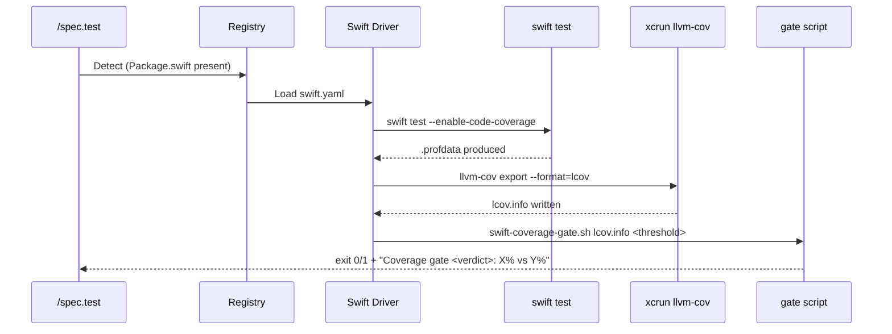
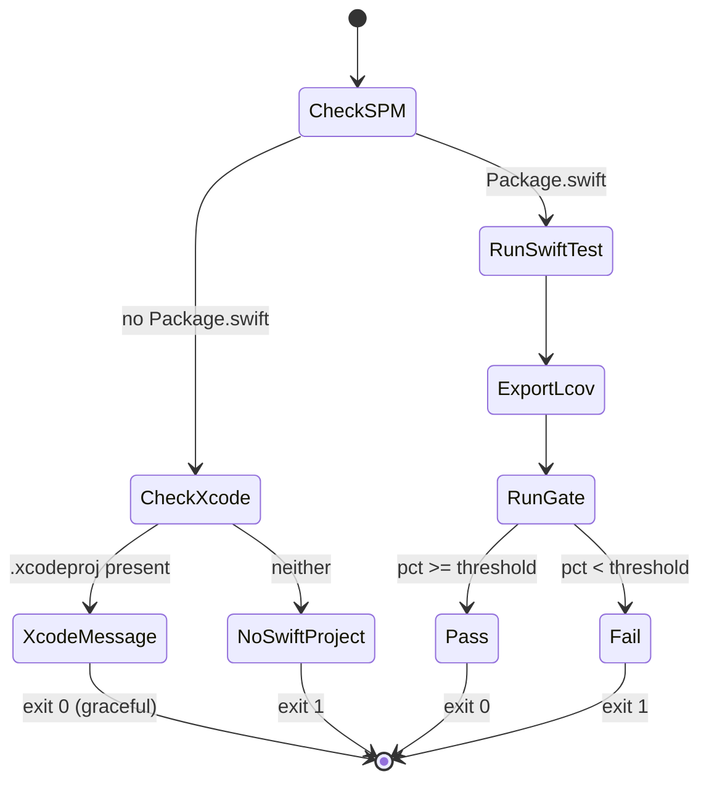
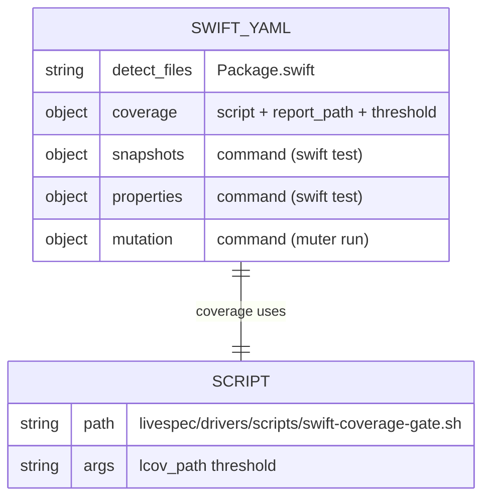

# Plan — Driver Swift — Built-in Test Orchestration Driver

## Summary

Implement the built-in Swift driver (`livespec/drivers/swift.yaml`) for test orchestration across 4 capabilities (coverage, snapshots, properties, mutation). Coverage uses `swift test --enable-code-coverage` + `xcrun llvm-cov export --format=lcov` and applies the threshold via an escape-hatch script (`livespec/drivers/scripts/swift-coverage-gate.sh`) since Swift has no `--fail-under` flag. Snapshots use `swift-snapshot-testing` (Point-Free), properties use `SwiftCheck`, and mutation uses `muter`. A small `swift_detector.py` parses `Package.swift` to detect declared dependencies and Xcode-only fallback.

---

## Technical Context

| Aspect | Choice | Reason |
|---|---|---|
| Language | Swift (SPM + Xcode) | Detect on `Package.swift` per spec FR-001 |
| Coverage | `swift test --enable-code-coverage` + `xcrun llvm-cov export --format=lcov` | Apple-native, produces lcov |
| Coverage gate | Shell script via `script:` escape hatch | Swift has no `--fail-under`; spec FR-002, AC-003, AC-008 |
| Snapshots | `swift-snapshot-testing` (Point-Free) | Standard Swift snapshot library |
| Properties | `SwiftCheck` | Swift port of QuickCheck |
| Mutation | `muter` (Homebrew) | Standard Swift mutation testing CLI |
| Detector | Pure-Python regex parse of `Package.swift` | No need for swift toolchain in tests |
| Driver Schema | `DriverManifest` (Feature 016, pydantic) | Existing |

---

## Constitution Check

- **Simplicity:** declarative YAML + tiny detector + shell gate script — no orchestration code. ✅
- **Separation:** YAML manifest holds commands; `swift_detector.py` isolates Package.swift parsing; gate script isolates threshold logic. ✅
- **Testing:** unit tests for `swift_detector` (Package.swift parsing + Xcode fallback); integration tests for manifest schema, registry detection, capability metadata; bash unit tests for the gate script. ✅
- **Naming:** `livespec/drivers/swift.yaml`, `livespec/drivers/scripts/swift-coverage-gate.sh`, `validator/drivers/swift_detector.py`, `tests/unit/test_swift_detector.py`, `tests/unit/test_swift_coverage_gate.py`, `tests/integration/test_driver_swift.py`. Mirrors 017/018. ✅
- **Infrastructure:** no new runtime deps; pyright-strict friendly (uses `cast()` per repo conventions). ✅

---

## Mermaid Diagrams

### Sequence — Coverage capability via gate script

### State — Coverage capability decision

### ER — Swift driver configuration

---

## Implementation Plan

### Step 1 — Replace `livespec/drivers/swift.yaml` stub with full manifest

- **Files:** modify `livespec/drivers/swift.yaml`
- **Content:** detect on `Package.swift`. Capabilities:
  - `coverage`: uses `script: scripts/swift-coverage-gate.sh`, `report_path: .build/coverage/lcov.info`, `threshold: 75`.
  - `snapshots`: `command: swift test`.
  - `properties`: `command: swift test --filter Property`.
  - `mutation`: `command: muter run`.
- **AC covered:** AC-001, AC-002, AC-003, AC-005, AC-006, AC-007, AC-008, AC-009.

### Step 2 — Create `livespec/drivers/scripts/swift-coverage-gate.sh`

- **Files:** create `livespec/drivers/scripts/swift-coverage-gate.sh` (chmod +x).
- **Behavior:**
  - Args: `$1 = lcov_path`, `$2 = threshold` (default 75).
  - If `Package.swift` missing and `*.xcodeproj` present → emit Xcode hint, `exit 0` (AC-004).
  - Otherwise:
    - Run `swift test --enable-code-coverage` (skipped when `LIVESPEC_SKIP_RUN=1` for unit tests / pre-existing data).
    - Locate `.profdata` under `.build`; on Linux skip `xcrun`, call `llvm-cov` directly (EC-005).
    - Export lcov via `xcrun llvm-cov export --format=lcov` (or `llvm-cov` on Linux); write to `lcov_path`.
    - Parse `DA:` lines: `total = count`, `hit = count(executed > 0)`. Compute `pct = 100 * hit / total`.
    - Compare to threshold; print verdict; `exit 0` or `exit 1`.
  - When `LIVESPEC_GATE_LCOV` is set, the script reads coverage from that file directly without running anything (used by both unit tests and integration callers that already have lcov data).
- **AC covered:** AC-002, AC-003, AC-004, AC-008. EC-001, EC-003, EC-005.

### Step 3 — Create `validator/drivers/swift_detector.py`

- **Files:** create `validator/drivers/swift_detector.py`.
- **Functions:**
  - `parse_package_dependencies(project_root: str) -> list[str]` — read `Package.swift`, extract package names from `.package(url: "https://.../<name>.git", ...)` and `.package(url: "https://.../<name>", ...)` and `.package(name: "X", ...)` forms. Returns lowercase deduped list.
  - `has_swift_dependency(project_root: str, name: str) -> bool` — case-insensitive membership check on the parsed list.
  - `is_xcode_only_project(project_root: str) -> bool` — `True` when `Package.swift` absent and at least one `*.xcodeproj` directory present.
  - `has_swift_package(project_root: str) -> bool` — convenience.
- **AC covered:** AC-005, AC-006, AC-010. FR-003, FR-004.

### Step 4 — Unit tests `tests/unit/test_swift_detector.py`

- Parsing of `swift-snapshot-testing`, `SwiftCheck`, `swift-snapshot-testing` plus other deps.
- Missing `Package.swift` returns `[]`.
- `has_swift_dependency` case-insensitive.
- `is_xcode_only_project`: true with .xcodeproj dir + no Package.swift; false otherwise.
- Malformed `Package.swift` does not raise.
- **AC covered:** AC-005, AC-006, AC-010, FR-003, FR-004.

### Step 5 — Unit tests `tests/unit/test_swift_coverage_gate.py`

- Exercises the gate script via `subprocess` using `LIVESPEC_GATE_LCOV` to feed deterministic lcov fixtures.
- Cases: above threshold → exit 0 + "PASS"; below threshold → exit 1 + "FAIL"; Xcode-only fallback → exit 0 with hint; empty lcov → exit 1 with "Coverage data not generated"; default threshold 75.
- **AC covered:** AC-003, AC-004, AC-008, FR-002, FR-006, EC-003.

### Step 6 — Integration tests `tests/integration/test_driver_swift.py`

- `test_registry_loads_swift_driver`: registry discovers swift when `Package.swift` exists.
- `test_swift_driver_schema_validation`: manifest validates and exposes the 4 capabilities.
- `test_swift_driver_capabilities_exist`: `implemented_capabilities()` returns all 4 in canonical order.
- `test_coverage_capability_uses_script`: coverage block uses `script:` escape hatch (not `command:`), points at `scripts/swift-coverage-gate.sh`, has `report_path` `.build/coverage/lcov.info` and threshold 75.
- `test_snapshots_capability_metadata`: command uses `swift test`.
- `test_properties_capability_metadata`: command uses `swift test`.
- `test_mutation_capability_metadata`: command uses `muter`.
- `test_swift_driver_detects_package_swift`: `Package.swift` listed in `detect.files`.
- `test_xcode_only_fallback_skipped`: with `*.xcodeproj` and no `Package.swift`, registry does not match swift driver (xcode-only graceful path is delegated to the gate script).
- `test_dependency_detection_in_fixture`: write `Package.swift` containing snapshot-testing + SwiftCheck → `parse_package_dependencies` returns both.
- **AC covered:** AC-001, AC-002, AC-005, AC-006, AC-007, AC-009.

### Step 7 — Implementation report + changelog

- Write `.specs/features/019-driver-swift/implementation.md` mirroring 018 structure.
- Append entry to `.specs/features/019-driver-swift/changelog.md`.

---

## Testing Strategy

| Test Type | What | File | AC |
|---|---|---|---|
| Unit | Package.swift parser + Xcode fallback | tests/unit/test_swift_detector.py | AC-005, AC-006, AC-010 |
| Unit | swift-coverage-gate.sh script | tests/unit/test_swift_coverage_gate.py | AC-003, AC-004, AC-008 |
| Integration | Registry + manifest + capability metadata | tests/integration/test_driver_swift.py | AC-001, AC-002, AC-005..AC-009 |
| Schema | DriverSchema validates swift.yaml | (asserted in integration tests) | AC-009 |

---

## Risks & Considerations

1. **xcrun unavailable on Linux** — gate script auto-uses `llvm-cov` directly (EC-005).
2. **No native `--fail-under`** — encapsulated in gate script via `script:` escape hatch (FR-001).
3. **Heavy toolchain in tests** — unit tests inject lcov via env var, never run `swift test`.
4. **muter only on Homebrew** — capability surfaces install hint via a future runner; manifest only declares `command: muter run`.

---

## Success Criteria

- SC-001..SC-004: covered by integration + unit tests; gate script validated end-to-end against fixture lcov data on macOS and Linux.

---

*LiveSpec Feature 019 Plan — Approved — 2026-05-07*
