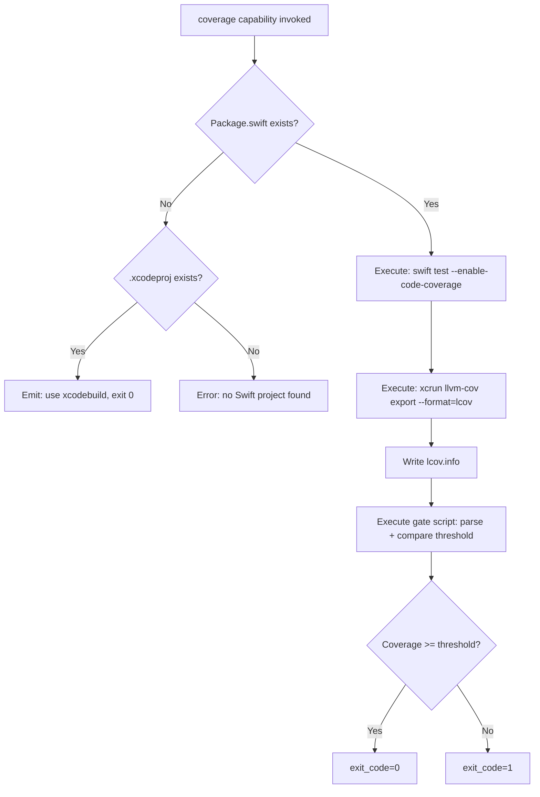
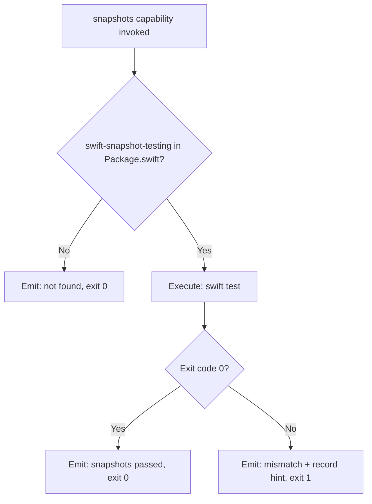
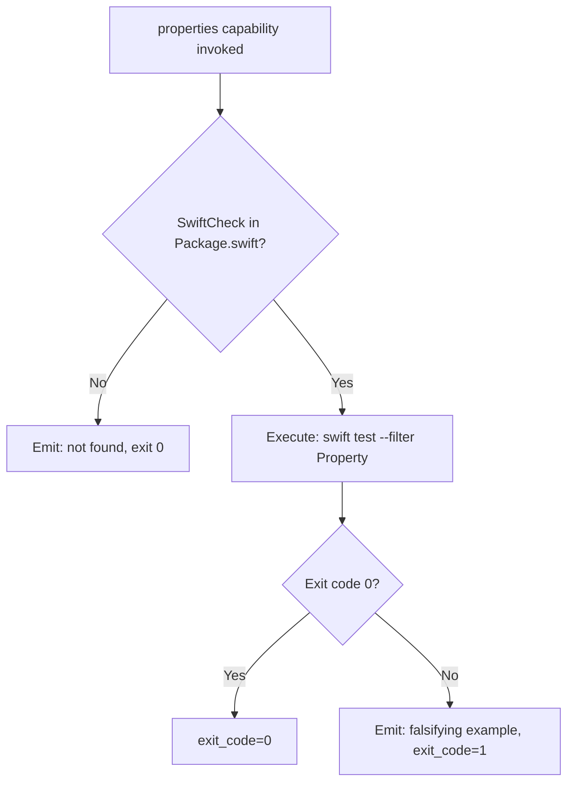
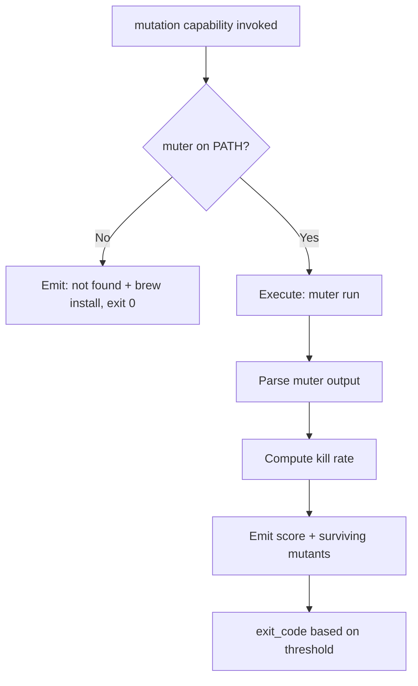

# Feature Spec: Driver Swift — Built-in Test Orchestration Driver

- **Feature:** Driver Swift
- **Branch:** feature/019-driver-swift
- **Date:** 2026-05-06
- **Status:** Draft
- **Priority:** P1
- **Scope:** M
- **Input:** Built-in Swift driver implementing test orchestration capabilities for Swift projects (SPM and Xcode). Coverage via swift test --enable-code-coverage + xcrun llvm-cov (no native gate — requires a script). Snapshots via swift-snapshot-testing (Point-Free). Property-based via SwiftCheck. Mutation via muter. Coverage gate implemented as escape hatch script since Swift has no --fail-under flag.
- **Feature Number:** 019
- **Deps:** 016

---

## User Scenarios & Testing

### Story 1 — Developer runs coverage gate on Swift project `P1`

A Swift developer with a Package.swift runs `/spec.test`. The Swift driver runs `swift test --enable-code-coverage`, extracts coverage via `xcrun llvm-cov`, computes total line coverage, and applies the threshold via a gate script (since no `--fail-under` flag exists in Swift tooling).

**Priority reason:** Swift (iOS/macOS) is a priority stack. Coverage gate is the most important first capability, even if it requires a script workaround.

**Independent test:** Run coverage capability on a Swift fixture project; verify lcov.info is produced and gate script correctly fails below threshold.

```gherkin
Feature: Swift coverage gate via script
  Scenario: Coverage above threshold — gate passes
    Given a Swift project with Package.swift
    And the coverage threshold is set to 75%
    And swift test --enable-code-coverage produces 82% line coverage
    When the Swift driver executes the coverage capability
    Then the gate script parses xcrun llvm-cov output
    And computes total line coverage as 82%
    And exits 0 because 82% >= 75%
    And lcov.info is written to .build/coverage/lcov.info

  Scenario: Coverage below threshold — gate fails
    Given a Swift project with 68% line coverage
    And threshold set to 75%
    When the Swift driver executes the coverage capability
    Then the gate script exits non-zero
    And LiveSpec emits "Coverage gate failed: 68% < 75%"

  Scenario: Xcode project detected instead of SPM
    Given a project with a .xcodeproj and no Package.swift
    When the Swift driver executes the coverage capability
    Then LiveSpec emits: "Xcode project detected. Use xcodebuild for coverage. See .specs/drivers/swift.yaml for configuration."
    And CapabilityResult.exit_code is 0 (graceful degradation)
```



---

### Story 2 — Developer runs snapshot tests on Swift project `P1`

The snapshot capability runs `swift test` on tests that use `swift-snapshot-testing` from Point-Free. Snapshot files are `.txt` or image files stored alongside tests. Mismatches fail the test run.

**Priority reason:** swift-snapshot-testing is the standard snapshot library for Swift, widely adopted.

**Independent test:** Run snapshot capability on a Swift fixture with swift-snapshot-testing; verify pass on match, fail on diff.

```gherkin
Feature: Swift snapshot testing via swift-snapshot-testing
  Scenario: Snapshots match — pass
    Given a Swift project with swift-snapshot-testing dependency in Package.swift
    And snapshot reference files exist in __Snapshots__/
    When the Swift driver executes the snapshots capability
    Then swift test passes
    And CapabilityResult.exit_code is 0

  Scenario: Snapshot mismatch — fail
    Given snapshot reference files exist
    And a view's output has changed
    When the Swift driver executes the snapshots capability
    Then swift test fails
    And LiveSpec emits: "Snapshot mismatch. Set record: true in your test to update."
    And CapabilityResult.exit_code is non-zero

  Scenario: swift-snapshot-testing not in Package.swift — skip
    Given Package.swift with no swift-snapshot-testing dependency
    When the Swift driver executes the snapshots capability
    Then LiveSpec emits: "swift-snapshot-testing not found in Package.swift — skipping"
    And CapabilityResult.exit_code is 0
```



---

### Story 3 — Developer runs property-based tests via SwiftCheck `P2`

The properties capability runs `swift test` on tests that import `SwiftCheck`. Detection is based on Package.swift dependency presence.

**Priority reason:** SwiftCheck is functional but less maintained than hypothesis/fast-check. Useful for parser and model testing.

**Independent test:** Run properties capability on Swift fixture with SwiftCheck; verify pass and failure detection.

```gherkin
Feature: Swift property-based testing via SwiftCheck
  Scenario: Property tests pass
    Given a Swift project with SwiftCheck in Package.swift
    When the Swift driver executes the properties capability
    Then swift test runs SwiftCheck-based tests
    And CapabilityResult.exit_code is 0

  Scenario: SwiftCheck not installed — skip with warning
    Given a Swift project without SwiftCheck
    When the Swift driver executes the properties capability
    Then LiveSpec emits: "SwiftCheck not found in Package.swift — skipping property tests"
    And CapabilityResult.exit_code is 0
```



---

### Story 4 — Developer runs mutation audit via muter `P3`

The mutation capability runs `muter` (Swift mutation testing CLI) and parses its report. muter is less mature than Stryker/mutmut but functional for Swift.

**Priority reason:** muter covers the Swift mutation gap. P3 because it is slower and less commonly used than coverage/snapshot.

**Independent test:** Run mutation capability on a small Swift fixture; verify muter executes and score is parsed.

```gherkin
Feature: Swift mutation testing via muter
  Scenario: Mutation audit completes
    Given a Swift project with muter installed (brew install muter)
    When the Swift driver executes the mutation capability
    Then muter runs and produces a report
    And LiveSpec parses the mutation score
    And LiveSpec emits killed/survived counts

  Scenario: muter not installed — skip with install hint
    Given muter is not on PATH
    When the Swift driver executes the mutation capability
    Then LiveSpec emits: "muter not found. Install: brew install muter"
    And CapabilityResult.exit_code is 0
```



---

## Acceptance Criteria

- **AC-001** — Driver file `livespec/drivers/swift.yaml` is loaded when `Package.swift` is found at project root.
- **AC-002** — Coverage capability runs `swift test --enable-code-coverage` followed by `xcrun llvm-cov export --format=lcov` to produce `lcov.info`.
- **AC-003** — A gate script (escape hatch via `script:` key) parses the lcov.info, computes line coverage percentage, compares to threshold, and exits with the correct code.
- **AC-004** — When an `.xcodeproj` is found without `Package.swift`, coverage capability exits 0 with a message directing the user to configure xcodebuild manually.
- **AC-005** — Snapshots capability checks for `swift-snapshot-testing` in `Package.swift` dependencies; if absent, skips with warning and exits 0.
- **AC-006** — Properties capability checks for `SwiftCheck` in `Package.swift`; if absent, skips with warning and exits 0.
- **AC-007** — Mutation capability checks for `muter` on PATH (`which muter`); if absent, emits brew install hint and exits 0.
- **AC-008** — The gate script is stored in `livespec/drivers/scripts/swift-coverage-gate.sh` and referenced via the `script:` escape hatch key.
- **AC-009** — The Swift driver YAML passes schema validation against `DriverSchema` (Feature 016).
- **AC-010** — All capabilities that require parsing `Package.swift` use a dedicated parser function (not shell grep) to extract dependency names reliably.

---

## Functional Requirements

- **FR-001** — Write `livespec/drivers/swift.yaml` with detect rule (`files: [Package.swift]`) and 4 capability blocks. Coverage block uses `script:` escape hatch (not `command:`).
- **FR-002** — Write `livespec/drivers/scripts/swift-coverage-gate.sh`: accepts lcov.info path and threshold as args, parses DA lines, computes %, exits 0/1.
- **FR-003** — Implement `Package.swift` dependency parser: extract `name:` values from `.package(url:, from:)` entries — used for swift-snapshot-testing and SwiftCheck detection.
- **FR-004** — Implement Xcode project detection fallback: check for `*.xcodeproj` when Package.swift absent.
- **FR-005** — Write integration tests in `tests/integration/test_driver_swift.py` for coverage (using a minimal Swift fixture).
- **FR-006** — Write unit tests for swift-coverage-gate.sh script (input/output validation).

---

## Key Entities

| Entity | Description |
|---|---|
| `swift.yaml` | Swift built-in driver manifest. Detects via `Package.swift`. |
| `swift-coverage-gate.sh` | Escape hatch script for coverage threshold — no native --fail-under in Swift. |
| `xcrun llvm-cov` | Apple's LLVM coverage tool. Extracts coverage from `.profdata` files. |
| `swift-snapshot-testing` | Point-Free library. Snapshot files stored as `__Snapshots__/*.txt` or images. |
| `SwiftCheck` | Swift port of QuickCheck for property-based testing. |
| `muter` | Swift mutation testing CLI. Available via Homebrew. |

---

## Edge Cases

- **EC-001** — `xcrun` not on PATH (non-macOS environment): coverage capability fails with "xcrun not found — Swift coverage requires macOS".
- **EC-002** — Multiple test targets in Package.swift: gate script aggregates coverage across all targets.
- **EC-003** — `.profdata` file not generated after `swift test` (e.g., test suite crash): lcov conversion step fails; capability reports "Coverage data not generated — check for test crashes".
- **EC-004** — muter produces no output (timeout on large project): muter capability exits with warning after 10-minute timeout.
- **EC-005** — Swift project on Linux (SPM, no Xcode): `swift test --enable-code-coverage` works but `xcrun` unavailable — gate script detects platform and uses `llvm-cov` directly.

---

## Success Criteria

- **SC-001** — Coverage gate works end-to-end on a macOS Swift fixture project: lcov.info produced, threshold applied, gate script exits correctly.
- **SC-002** — Driver YAML passes schema validation.
- **SC-003** — Gate script is tested independently with known lcov.info fixtures and threshold values.
- **SC-004** — Linux compatibility: coverage capability works on Linux (GitHub Actions ubuntu runner) using direct llvm-cov instead of xcrun.

---

*LiveSpec Feature 019 — Draft — 2026-05-06*
