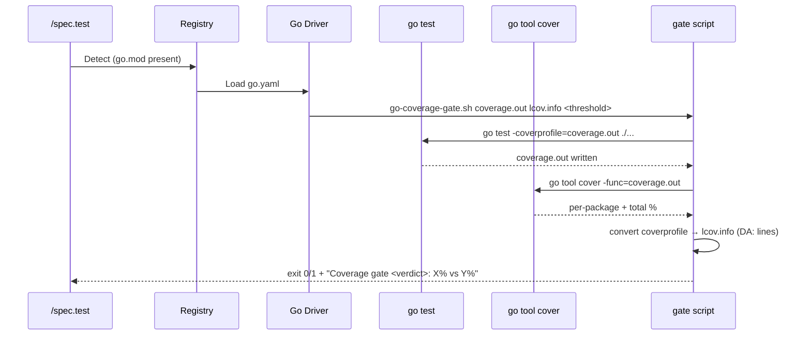
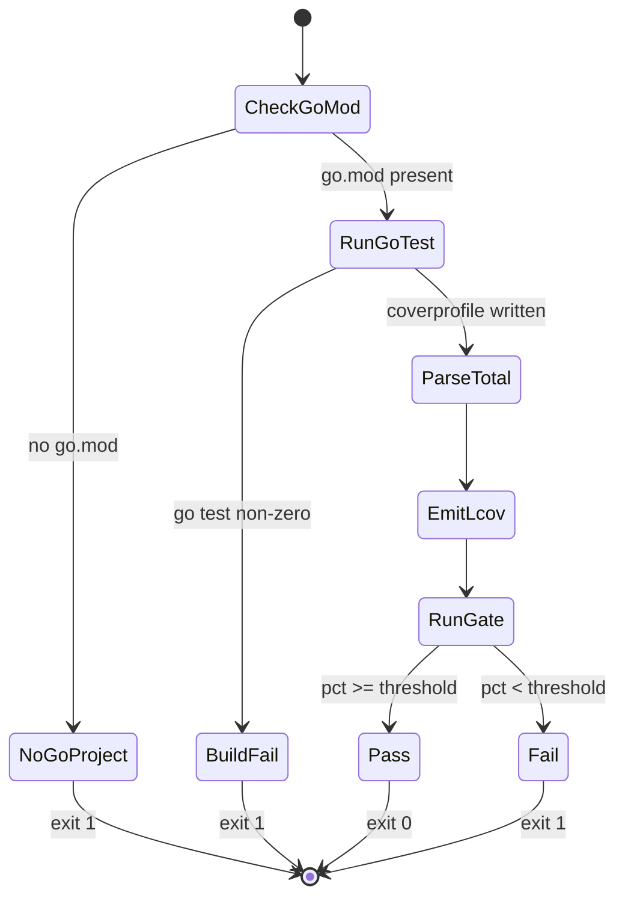
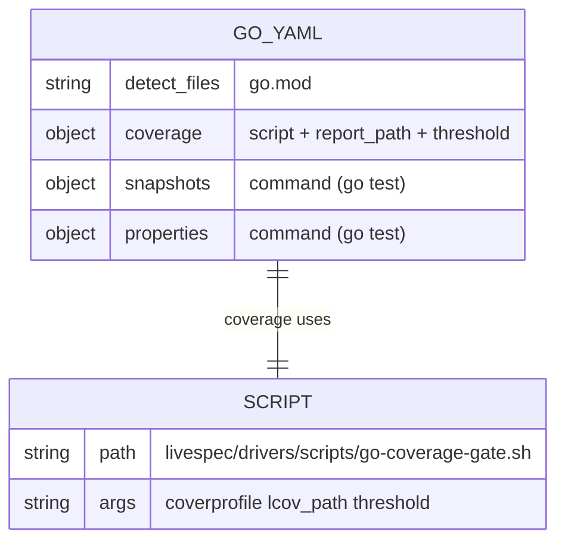

# Plan — Driver Go — Built-in Test Orchestration Driver

## Summary

Implement the built-in Go driver (`livespec/drivers/go.yaml`) for the test orchestration system across 3 capabilities (coverage, snapshots, properties). Mutation testing is intentionally **omitted** from the manifest — Go's only meaningful mutation tool (`go-mutesting`) is unmaintained, so the existing `CapabilityNotImplementedError` plumbing surfaces a clear "not implemented" message at runtime per spec Story 4. Coverage uses `go test -coverprofile=coverage.out ./...` and applies the threshold via an escape-hatch script (`livespec/drivers/scripts/go-coverage-gate.sh`) since `go test` has no `--fail-under` flag — same pattern as Feature 019 (Swift). Snapshots and properties run `go test ./...` and gate on `go.mod` dependency presence (`go-snaps` / `cupaloy` / `gopter`). A small `go_detector.py` parses `go.mod` to extract module name and `require` block entries.

---

## Technical Context

| Aspect | Choice | Reason |
|---|---|---|
| Language | Go (modules) | Detect on `go.mod` per spec FR-001, AC-001 |
| Coverage | `go test -coverprofile=coverage.out ./...` + `go tool cover -func` | Native Go toolchain, no extra deps |
| Coverage gate | Shell script via `script:` escape hatch | Go has no `--fail-under`; spec FR-002, AC-002, AC-003, AC-007 |
| lcov conversion | Inline conversion in gate script (DA: lines from coverprofile) | Avoids hard dep on `gocov` / `gcov2lcov`; falls back per EC-004 |
| Snapshots | `go-snaps` or `cupaloy` (detect via `go.mod`) | Both store `.snap` files; spec AC-004 |
| Properties | `gopter` (detect via `go.mod`) | Standard Go property-based testing lib; spec AC-005 |
| Mutation | **Omitted from manifest** | `go-mutesting` unmaintained; spec AC-006, Story 4 |
| Detector | Pure-Python parse of `go.mod` | No need for Go toolchain in unit tests; spec FR-003, AC-009 |
| Driver Schema | `DriverManifest` (Feature 016, pydantic) | Existing — `mutation: None` is valid |

---

## Constitution Check

- **Simplicity:** declarative YAML + tiny detector + shell gate script — mirrors 017/018/019. ✅
- **Separation:** YAML manifest holds commands; `go_detector.py` isolates `go.mod` parsing; gate script isolates threshold + coverprofile→lcov conversion. ✅
- **Testing:** unit tests for `go_detector` (module/require parsing); bash unit tests for the gate script (coverprofile parsing, threshold, lcov emission); integration tests for manifest schema, registry detection, capability metadata, mutation absence. ✅
- **Naming:** `livespec/drivers/go.yaml`, `livespec/drivers/scripts/go-coverage-gate.sh`, `validator/drivers/go_detector.py`, `tests/unit/test_go_detector.py`, `tests/unit/test_go_coverage_gate.py`, `tests/integration/test_driver_go.py`. Mirrors 017/018/019. ✅
- **Infrastructure:** no new runtime deps; pyright-strict friendly (uses `cast()` per repo conventions). ✅

---

## Mermaid Diagrams

### Sequence — Coverage capability via gate script

### State — Coverage capability decision

### ER — Go driver configuration

---

## Implementation Plan

### Step 1 — Replace `livespec/drivers/go.yaml` stub with full manifest

- **Files:** modify `livespec/drivers/go.yaml`.
- **Content:** detect on `go.mod`. Three capabilities:
  - `coverage`: uses `script: scripts/go-coverage-gate.sh`, `report_path: coverage/lcov.info`, `threshold: 70`.
  - `snapshots`: `command: go test ./...`.
  - `properties`: `command: go test ./... -run Property`.
  - `mutation`: **absent** — surfaces `CapabilityNotImplementedError` per spec AC-006, Story 4.
- **AC covered:** AC-001, AC-002, AC-006, AC-008.

### Step 2 — Create `livespec/drivers/scripts/go-coverage-gate.sh`

- **Files:** create `livespec/drivers/scripts/go-coverage-gate.sh` (chmod +x).
- **Behavior:**
  - Args: `$1 = coverprofile_path` (default `coverage.out`), `$2 = lcov_path` (default `coverage/lcov.info`), `$3 = threshold` (default 70).
  - If `go.mod` is missing → emit "no go.mod found" and `exit 1`.
  - Otherwise:
    - When `LIVESPEC_GATE_COVERPROFILE` is set, read coverage from that file (skips `go test`, used by unit tests).
    - When `LIVESPEC_SKIP_RUN=1`, skip `go test` invocation but still convert pre-existing coverprofile.
    - Default path runs `go test -coverprofile=$coverprofile ./...`. Exit 1 on non-zero.
    - Run `go tool cover -func=$coverprofile`; parse the `total:` line for the percentage. If unavailable, fall back to per-line parsing of the coverprofile (EC-004).
    - Convert coverprofile to lcov: each line `mode:`, then `<file>:<from>.<col>,<to>.<col> <num_stmts> <count>` becomes `DA:<from>,<count>` entries grouped per `SF:` block. Write to `lcov_path`.
    - Compare percentage to threshold; print verdict; `exit 0` or `exit 1`.
    - If coverprofile is empty or has only the `mode:` header → emit "No coverage data — add tests" and `exit 1` (EC-002).
- **AC covered:** AC-002, AC-003, AC-007, AC-008. EC-002, EC-004.

### Step 3 — Create `validator/drivers/go_detector.py`

- **Files:** create `validator/drivers/go_detector.py`.
- **Functions:**
  - `parse_go_module(project_root: str) -> str | None` — reads `go.mod`, returns the module path declared on the `module` line, or `None` if absent.
  - `parse_go_dependencies(project_root: str) -> list[str]` — extracts `require` block entries: both `require <path> <version>` and the multi-line `require ( ... )` block. Returns lowercased deduped module paths preserving first-seen order.
  - `has_go_dependency(project_root: str, name: str) -> bool` — case-insensitive substring or exact match against the parsed list (so `gopter` matches `github.com/leanovate/gopter`).
  - `has_go_module(project_root: str) -> bool` — convenience.
- **AC covered:** AC-004, AC-005, AC-009. FR-003.

### Step 4 — Unit tests `tests/unit/test_go_detector.py`

- Parsing of `module` line.
- Single-line `require` form.
- Multi-line `require ( ... )` block with comments and `// indirect` suffixes.
- `has_go_dependency` matches `gopter` against `github.com/leanovate/gopter` (case-insensitive).
- `has_go_dependency` matches `go-snaps` against `github.com/gkampitakis/go-snaps`.
- Missing `go.mod` returns `None` / `[]`.
- Malformed `go.mod` does not raise.
- **AC covered:** AC-004, AC-005, AC-009, FR-003.

### Step 5 — Unit tests `tests/unit/test_go_coverage_gate.py`

- Exercises the gate script via `subprocess` using `LIVESPEC_GATE_COVERPROFILE` to feed deterministic coverprofile fixtures.
- Cases:
  - Above threshold (78% with 70% threshold) → exit 0 + "PASS" + lcov.info written.
  - Below threshold (55% with 70% threshold) → exit 1 + "FAIL".
  - Default threshold is 70.
  - No `go.mod` → exit 1 with "no go.mod" message.
  - Empty coverprofile (only `mode:` line) → exit 1 with "No coverage data" hint.
  - lcov file is created with `DA:` lines matching the coverprofile.
- **AC covered:** AC-002, AC-003, AC-007, FR-002, FR-005, EC-002.

### Step 6 — Integration tests `tests/integration/test_driver_go.py`

- `test_registry_loads_go_driver`: registry discovers go when `go.mod` exists.
- `test_go_driver_schema_validation`: manifest validates and exposes 3 capabilities (coverage/snapshots/properties), `mutation is None`.
- `test_go_driver_capabilities_exist`: `implemented_capabilities()` returns exactly `["coverage", "snapshots", "properties"]` — no mutation.
- `test_go_driver_detects_go_mod`: `go.mod` listed in `detect.files`.
- `test_coverage_capability_uses_script_escape_hatch`: coverage uses `script:` (no `command`), points at `scripts/go-coverage-gate.sh`, has `report_path` and threshold 70.
- `test_coverage_gate_script_is_shipped_and_executable`.
- `test_snapshots_capability_metadata`: command uses `go test`.
- `test_properties_capability_metadata`: command uses `go test`.
- `test_mutation_capability_is_absent`: `manifest.mutation is None` — surfacing the spec Story 4 behavior.
- `test_dependency_detection_in_fixture_go_module`: write `go.mod` with `gopter` and `go-snaps` → `parse_go_dependencies` returns both; `has_go_dependency` is case-insensitive.
- **AC covered:** AC-001, AC-002, AC-004, AC-005, AC-006, AC-008, AC-009.

### Step 7 — Implementation report + changelog

- Write `.specs/features/020-driver-go/implementation.md` mirroring 019 structure (Requirement Mapping table, Files Created/Modified, AC Mapping, Test Results, Notes, Implementation Summary).
- Append entry to `.specs/features/020-driver-go/changelog.md`.

---

## Testing Strategy

| Test Type | What | File | AC |
|---|---|---|---|
| Unit | go.mod module + require parsing | tests/unit/test_go_detector.py | AC-004, AC-005, AC-009 |
| Unit | go-coverage-gate.sh script | tests/unit/test_go_coverage_gate.py | AC-002, AC-003, AC-007 |
| Integration | Registry + manifest + capability metadata + mutation absence | tests/integration/test_driver_go.py | AC-001, AC-002, AC-004..AC-006, AC-008, AC-009 |
| Schema | DriverSchema validates go.yaml | (asserted in integration tests) | AC-008 |

---

## Risks & Considerations

1. **Go toolchain absent at unit test time** — tests inject coverprofile via `LIVESPEC_GATE_COVERPROFILE`, never run `go test`.
2. **No native `--fail-under`** — encapsulated in gate script via `script:` escape hatch (FR-001).
3. **`go.work` workspaces** — out of MVP scope per EC-001; gate script runs at the directory containing `go.mod`.
4. **CGO** — left to the caller via env (`CGO_ENABLED=0` documented as default in the script comment, configurable via env, EC-003).
5. **`gocov-xml` unavailable** — gate script implements lcov conversion inline from coverprofile, no external tool required (EC-004 covered).
6. **Mutation gap** — explicit absence of the capability surfaces the existing `CapabilityNotImplementedError` with the canonical message "mutation: not implemented for go driver"; the explanation about `go-mutesting` lives in `go.yaml` as a comment so users discover it via the manifest.

---

## Success Criteria

- SC-001..SC-003: covered by integration + unit tests; gate script validated end-to-end against fixture coverprofile data.

---

*LiveSpec Feature 020 Plan — Approved — 2026-05-07*
