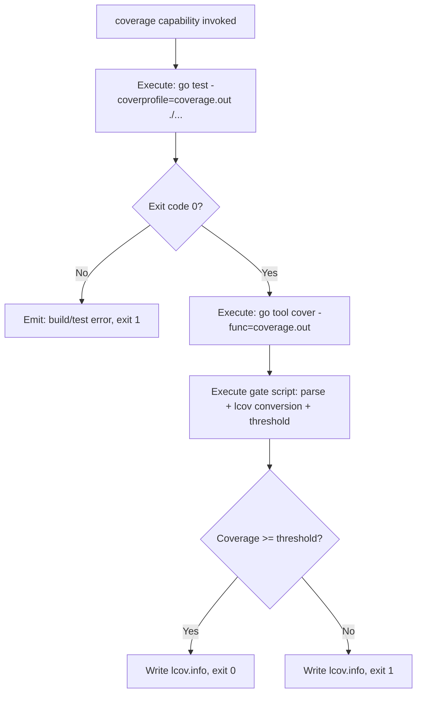
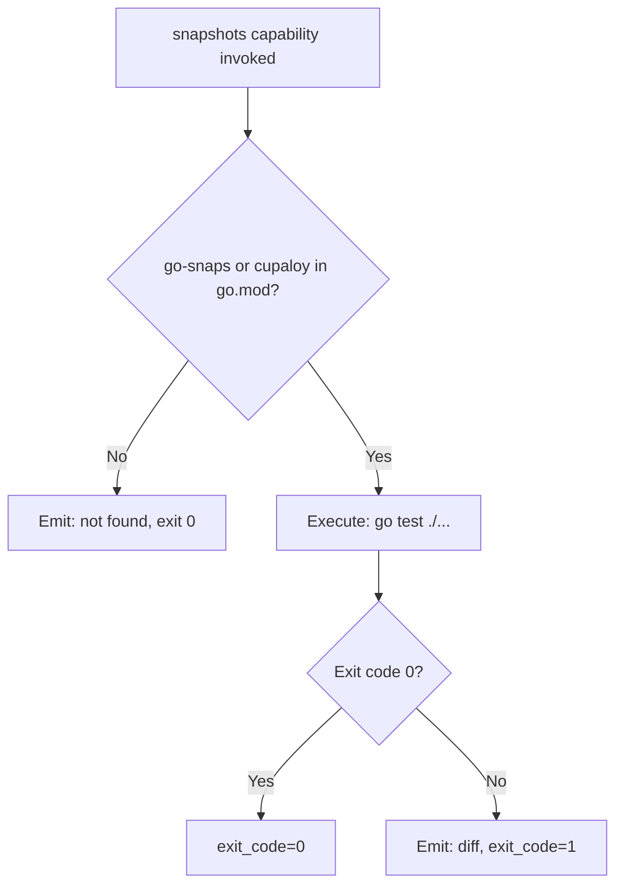
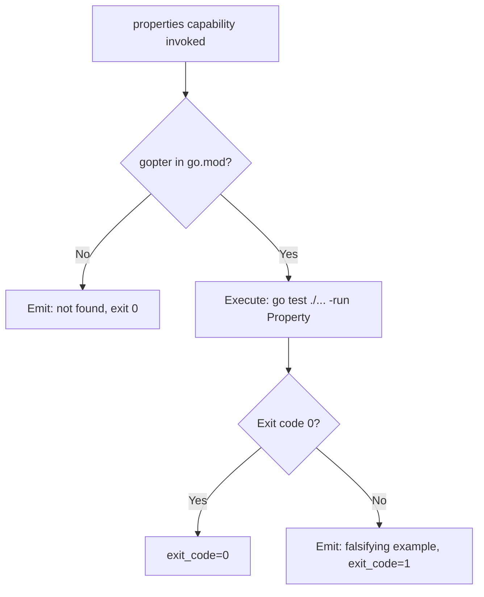
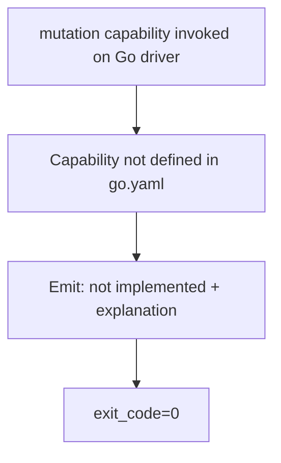

# Feature Spec: Driver Go — Built-in Test Orchestration Driver

- **Feature:** Driver Go
- **Branch:** feature/020-driver-go
- **Date:** 2026-05-06
- **Status:** Draft
- **Priority:** P2
- **Scope:** M
- **Input:** Built-in Go driver implementing test orchestration capabilities. Tools: go test -cover (coverage, native lcov output via -coverprofile + script conversion), go-snaps or cupaloy (snapshots), gopter (property-based). Mutation testing not supported (go-mutesting is unmaintained) — capability reported as not-implemented. Coverage gate implemented via script (no native --fail-under in go test).
- **Feature Number:** 020
- **Deps:** 016

---

## User Scenarios & Testing

### Story 1 — Developer runs coverage gate on Go project `P1`

A Go developer with a `go.mod` file runs `/spec.test`. The Go driver runs `go test -coverprofile=coverage.out ./...`, converts to lcov format via a script, computes the percentage, and applies the threshold.

**Priority reason:** Coverage is the most requested capability. Go has native coverage but no threshold flag — requires a script workaround similar to Swift.

**Independent test:** Run coverage capability on a Go fixture project; verify coverage.out and lcov.info are produced, gate script applies threshold.

```gherkin
Feature: Go coverage gate via script
  Scenario: Coverage above threshold — gate passes
    Given a Go project with go.mod
    And threshold set to 70%
    And go test reports 78% coverage
    When the Go driver executes the coverage capability
    Then CapabilityResult.exit_code is 0
    And lcov.info is written at the configured path
    And LiveSpec emits "Coverage gate passed: 78% >= 70%"

  Scenario: Coverage below threshold — gate fails
    Given a Go project with 55% coverage
    And threshold set to 70%
    When the Go driver executes the coverage capability
    Then CapabilityResult.exit_code is non-zero
    And LiveSpec emits "Coverage gate failed: 55% < 70%"

  Scenario: go test fails (compilation error)
    Given a Go project with a compilation error
    When the Go driver executes the coverage capability
    Then CapabilityResult.exit_code is non-zero
    And LiveSpec emits the go build error output
```



---

### Story 2 — Developer runs snapshot tests on Go project `P2`

The snapshot capability runs `go test ./...` on tests using `go-snaps` or `cupaloy`. These libraries store `.snap` files in `__snapshots__/` directories.

**Priority reason:** Snapshot testing in Go is less common but valuable for CLI output and JSON serialization tests.

**Independent test:** Run snapshot capability on a Go fixture with go-snaps; verify pass on match, fail on diff.

```gherkin
Feature: Go snapshot testing
  Scenario: Snapshots match — pass
    Given a Go project with go-snaps in go.mod
    And snapshot files exist
    When the Go driver executes the snapshots capability
    Then CapabilityResult.exit_code is 0

  Scenario: Snapshot library not detected — skip
    Given a Go project with no go-snaps or cupaloy in go.mod
    When the Go driver executes the snapshots capability
    Then LiveSpec emits: "No snapshot library detected in go.mod (go-snaps, cupaloy) — skipping"
    And CapabilityResult.exit_code is 0
```



---

### Story 3 — Developer runs property-based tests via gopter `P2`

The properties capability runs `go test ./...` on tests using `gopter`. Detection is based on `go.mod` dependency presence.

**Priority reason:** gopter is the main property-based testing lib for Go. Useful for protocol and parser testing.

**Independent test:** Run properties capability; verify gopter tests run and failure case is detected.

```gherkin
Feature: Go property-based testing via gopter
  Scenario: Property tests pass
    Given a Go project with gopter in go.mod
    When the Go driver executes the properties capability
    Then go test runs gopter-based tests
    And CapabilityResult.exit_code is 0

  Scenario: gopter not in go.mod — skip
    Given a Go project without gopter
    When the Go driver executes the properties capability
    Then LiveSpec emits: "gopter not found in go.mod — skipping property tests"
    And CapabilityResult.exit_code is 0
```



---

### Story 4 — Mutation testing is not supported — clear degradation message `P3`

Go has no maintained mutation testing tool. The mutation capability is explicitly marked as not-implemented in the Go driver, with a message explaining why and suggesting alternatives.

**Priority reason:** P3 — being explicit about the gap is better than silence. Users should know why mutation is unavailable.

**Independent test:** Run mutation capability on Go project; verify the not-implemented message is emitted and exit code is 0.

```gherkin
Feature: Go mutation — not implemented
  Scenario: Mutation capability not available for Go
    Given a Go project
    When the developer runs /spec.test --mutation
    Then LiveSpec emits: "mutation: not implemented for go driver"
    And LiveSpec adds: "go-mutesting is unmaintained. Consider using property-based testing (gopter) as an alternative."
    And CapabilityResult.exit_code is 0
```



---

## Acceptance Criteria

- **AC-001** — Driver file `livespec/drivers/go.yaml` is loaded when `go.mod` is found at project root.
- **AC-002** — Coverage capability runs `go test -coverprofile=coverage.out ./...` and converts `coverage.out` to `lcov.info` format via a gate script.
- **AC-003** — Gate script applies threshold and exits non-zero if coverage is below it.
- **AC-004** — Snapshot capability detects `go-snaps` or `cupaloy` in `go.mod`; if absent, skips with exit 0.
- **AC-005** — Properties capability detects `gopter` in `go.mod`; if absent, skips with exit 0.
- **AC-006** — Mutation capability is absent from `go.yaml` — reported as "not implemented" by the driver system with an explanatory message about go-mutesting being unmaintained.
- **AC-007** — The gate script `livespec/drivers/scripts/go-coverage-gate.sh` accepts `coverage.out` path and threshold, converts to `lcov.info`, computes %, exits 0/1.
- **AC-008** — The Go driver YAML passes schema validation against `DriverSchema`.
- **AC-009** — `go.mod` parsing uses a dedicated parser (not shell grep) to extract module names and dependencies.

---

## Functional Requirements

- **FR-001** — Write `livespec/drivers/go.yaml` with detect rule (`files: [go.mod]`) and 3 capability blocks (coverage, snapshots, properties). Mutation omitted.
- **FR-002** — Write `livespec/drivers/scripts/go-coverage-gate.sh`: run `go tool cover -func=coverage.out`, parse total line, compare to threshold, emit lcov.info via `gocov-xml` or direct conversion.
- **FR-003** — Implement `go.mod` dependency parser: extract `require` block entries for snapshot/property library detection.
- **FR-004** — Write integration tests for coverage capability on a Go fixture project.
- **FR-005** — Write unit tests for go.mod parser and go-coverage-gate.sh script.

---

## Key Entities

| Entity | Description |
|---|---|
| `go.yaml` | Go built-in driver manifest. Detects via `go.mod`. |
| `go-coverage-gate.sh` | Script converting `coverage.out` to lcov.info and applying threshold. |
| `go-snaps` | Go snapshot library storing `.snap` files. |
| `cupaloy` | Alternative Go snapshot library. |
| `gopter` | Go property-based testing library (Generalized Property-Based Testing). |

---

## Edge Cases

- **EC-001** — Go workspace (`go.work`): coverage command run at workspace root; driver detects `go.work` and adjusts.
- **EC-002** — `coverage.out` is empty (no test files): gate script exits with "No coverage data — add tests".
- **EC-003** — Go module with CGO: `go test` may require special flags; driver uses `CGO_ENABLED=0` by default (configurable).
- **EC-004** — lcov conversion tool not available: gate script falls back to parsing `go tool cover -func` text output directly.

---

## Success Criteria

- **SC-001** — Coverage gate works on a real Go fixture project: lcov.info produced and threshold applied.
- **SC-002** — Driver YAML passes schema validation.
- **SC-003** — Mutation not-implemented message is emitted with correct explanation (not a generic "not found" message).

---

*LiveSpec Feature 020 — Draft — 2026-05-06*
