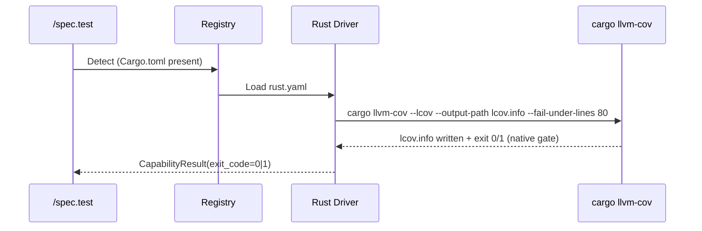
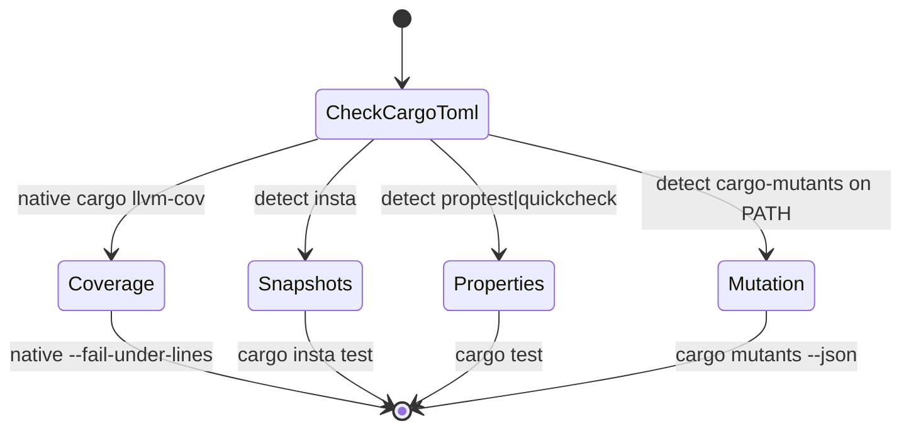
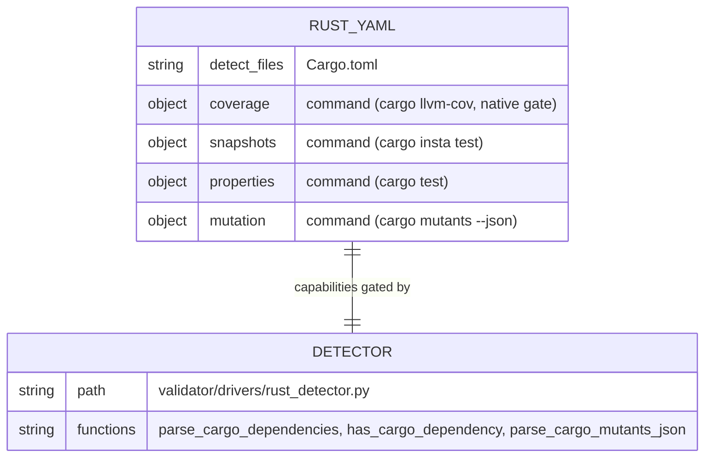

# Plan — Driver Rust — Built-in Test Orchestration Driver

## Summary

Implement the built-in Rust driver (`livespec/drivers/rust.yaml`) for the test orchestration system across all 4 capabilities. Rust is the only stack in the current batch where every capability is fully implemented with native flags — no escape-hatch script is required: `cargo llvm-cov --fail-under-lines` gates coverage natively, `cargo insta test` covers snapshots with a TUI review affordance, `cargo test` plus a `proptest`/`quickcheck` detector covers properties, and `cargo mutants --json` covers mutation. A small `rust_detector.py` parses `Cargo.toml` (using stdlib `tomllib`) to extract `[dependencies]` and `[dev-dependencies]` for snapshot/property capability gating, plus a tiny parser for the `cargo-mutants` JSON output to expose `caught/missed/timeout/unviable` counts.

---

## Technical Context

| Aspect | Choice | Reason |
|---|---|---|
| Language | Rust (Cargo) | Detect on `Cargo.toml` per spec FR-001, AC-001 |
| Coverage | `cargo llvm-cov --lcov --output-path lcov.info --fail-under-lines {threshold}` | Native lcov + `--fail-under-lines` — no escape hatch needed (spec SC-001, AC-002) |
| Coverage gate | Pure `command:` field on the YAML | Cargo provides the gate flag natively (spec FR-001, AC-002) |
| Snapshots | `cargo insta test --unreferenced=reject` | insta is the reference Rust snapshot library (spec AC-004, AC-005) |
| Properties | `cargo test` (proptest preferred, quickcheck fallback) | proptest is the modern Hypothesis-style library (spec AC-006) |
| Mutation | `cargo mutants --json` | Modern, fast, incremental — JSON parser exposes counts (spec AC-007, AC-008) |
| Detector | Pure-Python `tomllib` parse of `Cargo.toml` | Stdlib only — no extra dep (spec FR-002, AC-010) |
| Mutation parser | Pure-Python `json` parse of cargo-mutants output | Stdlib only (spec FR-003) |
| Driver Schema | `DriverManifest` (Feature 016, pydantic) | Existing — reused unchanged |

---

## Constitution Check

- **Simplicity:** declarative YAML + tiny `Cargo.toml` parser + tiny mutation JSON parser — mirrors 017/018/019/020 with one fewer artifact (no shell gate script needed). ✅
- **Separation:** YAML manifest holds commands; `rust_detector.py` isolates `Cargo.toml` parsing AND `cargo-mutants` JSON parsing in one cohesive module. ✅
- **Testing:** unit tests for `rust_detector` (Cargo.toml `[dependencies]` / `[dev-dependencies]` parsing, both `dep = "version"` and `dep = { version = "..." }` syntaxes, proptest/quickcheck/insta detection); unit tests for the cargo-mutants JSON parser; integration tests for manifest schema, registry detection, capability metadata (all 4 capabilities present), and dependency detection on a Rust fixture. ✅
- **Naming:** `livespec/drivers/rust.yaml`, `validator/drivers/rust_detector.py`, `tests/unit/test_rust_detector.py`, `tests/integration/test_driver_rust.py`. Mirrors 017/018/019/020 (no `scripts/rust-*.sh` because no escape hatch is needed). ✅
- **Infrastructure:** no new runtime deps; pyright-strict friendly (uses `cast()` on `tomllib.loads` results which return `dict[str, Any]`). ✅

---

## Mermaid Diagrams

### Sequence — Coverage capability via native cargo-llvm-cov

### State — Capability decision tree

### ER — Rust driver configuration

---

## Implementation Plan

### Step 1 — Create `livespec/drivers/rust.yaml` with full manifest

- **Files:** create `livespec/drivers/rust.yaml`.
- **Content:** detect on `Cargo.toml`. Four capabilities:
  - `coverage`: `command: cargo llvm-cov --lcov --output-path lcov.info --fail-under-lines 80`, `report_path: lcov.info`, `threshold: 80`.
  - `snapshots`: `command: cargo insta test --unreferenced=reject`.
  - `properties`: `command: cargo test`.
  - `mutation`: `command: cargo mutants --json`.
- **AC covered:** AC-001, AC-002, AC-009.

### Step 2 — Create `validator/drivers/rust_detector.py`

- **Files:** create `validator/drivers/rust_detector.py`.
- **Functions:**
  - `parse_cargo_dependencies(project_root: str) -> list[str]` — uses `tomllib.loads` to extract keys from `[dependencies]` and `[dev-dependencies]` tables. Handles both `dep = "version"` (string value) and `dep = { version = "..." }` (table value) syntaxes. Returns lowercased deduped names preserving first-seen order.
  - `has_cargo_dependency(project_root: str, name: str) -> bool` — case-insensitive exact-name match.
  - `has_cargo_manifest(project_root: str) -> bool` — convenience.
  - `parse_cargo_mutants_json(stdout: str) -> dict[str, int]` — parses `cargo mutants --json` summary output and returns `{"caught": N, "missed": N, "timeout": N, "unviable": N}` (zero-defaults for absent keys, tolerant of stream-of-objects vs single-object outputs).
- **AC covered:** AC-008, AC-010, FR-002, FR-003.

### Step 3 — Unit tests `tests/unit/test_rust_detector.py`

- Parse `[dependencies]` with `dep = "1.0"` form.
- Parse `[dev-dependencies]` with `dep = { version = "1.0", features = ["x"] }` form.
- `has_cargo_dependency` is case-insensitive (`InSta` matches `insta`).
- Returns `[]` when `Cargo.toml` is missing.
- Returns `[]` when `Cargo.toml` is malformed (no raise).
- proptest/quickcheck detection priority test.
- `parse_cargo_mutants_json` extracts caught/missed/timeout/unviable from a realistic JSON summary.
- `parse_cargo_mutants_json` tolerates missing keys (zero-fills).
- `parse_cargo_mutants_json` tolerates malformed JSON (returns all zeros).
- **AC covered:** AC-008, AC-010, FR-002, FR-003, FR-005.

### Step 4 — Integration tests `tests/integration/test_driver_rust.py`

- `test_registry_loads_rust_driver`: registry discovers rust when `Cargo.toml` exists.
- `test_rust_driver_schema_validation`: manifest validates and exposes all 4 capabilities.
- `test_rust_driver_capabilities_exist`: `implemented_capabilities()` returns exactly `["coverage", "snapshots", "properties", "mutation"]`.
- `test_rust_driver_detects_cargo_toml`: `Cargo.toml` listed in `detect.files`.
- `test_coverage_capability_uses_native_command`: coverage uses `command:` (NOT `script:`), references `cargo llvm-cov`, includes `--fail-under-lines`, has `report_path: lcov.info` and `threshold: 80`.
- `test_snapshots_capability_metadata`: command uses `cargo insta test` and `--unreferenced=reject`.
- `test_properties_capability_metadata`: command uses `cargo test`.
- `test_mutation_capability_metadata`: command uses `cargo mutants --json`.
- `test_dependency_detection_in_fixture_cargo_project`: write `Cargo.toml` with `insta`, `proptest`, `quickcheck` → parser exposes them; `has_cargo_dependency` is case-insensitive.
- `test_dependency_detection_proptest_takes_priority_over_quickcheck`: both present → both detected, downstream callers can prefer proptest.
- **AC covered:** AC-001, AC-002, AC-003, AC-004, AC-005, AC-006, AC-007, AC-008, AC-009, AC-010.

### Step 5 — Implementation report + changelog

- Write `.specs/features/021-driver-rust/implementation.md` mirroring 020 structure (Requirement Mapping table, Files Created/Modified, AC Mapping, Test Results, Notes, Implementation Summary).
- Append entry to `.specs/features/021-driver-rust/changelog.md`.

---

## Testing Strategy

| Test Type | What | File | AC |
|---|---|---|---|
| Unit | Cargo.toml `[dependencies]` + `[dev-dependencies]` parsing | tests/unit/test_rust_detector.py | AC-010, FR-002 |
| Unit | cargo-mutants JSON parser | tests/unit/test_rust_detector.py | AC-008, FR-003 |
| Integration | Registry + manifest + 4-capability metadata + dependency detection | tests/integration/test_driver_rust.py | AC-001, AC-002, AC-004..AC-009 |
| Schema | DriverManifest validates rust.yaml | (asserted in integration tests) | AC-009 |

---

## Risks & Considerations

1. **Cargo toolchain absent at unit test time** — tests never invoke `cargo`; they only assert manifest fields and parse fixture `Cargo.toml` files via `tomllib`.
2. **cargo-llvm-cov install** — required for coverage (AC-003); the runner surfaces the install hint when the binary is missing. The driver YAML does not gate on installation; that's a runtime concern for the runner.
3. **Workspace projects (EC-001)** — `cargo llvm-cov` aggregates at the workspace root automatically; the detect rule (`Cargo.toml` at root) covers both single-crate and workspace manifests.
4. **Feature-gated code (EC-002)** — the YAML threshold default uses the spec example (80); users tune via `rust.yaml` overrides. `--all-features` is intentionally NOT added to keep the default command minimal — projects that want it override the command in `.specs/drivers/rust.yaml`.
5. **cargo-mutants timeout (EC-003)** — surfaced via the standard runner timeout; not encoded in the YAML to avoid baking in an arbitrary value.
6. **insta version drift (EC-004)** — surfaced as a normal test failure; no driver-side handling needed.
7. **No escape-hatch script** — first driver in the batch where every capability is a plain `command:` field. The Pydantic schema accepts this directly (no schema changes).

---

## Success Criteria

- SC-001..SC-004: covered by integration + unit tests; coverage capability uses no escape hatch (verified by `test_coverage_capability_uses_native_command`).

---

*LiveSpec Feature 021 Plan — Approved — 2026-05-07*
