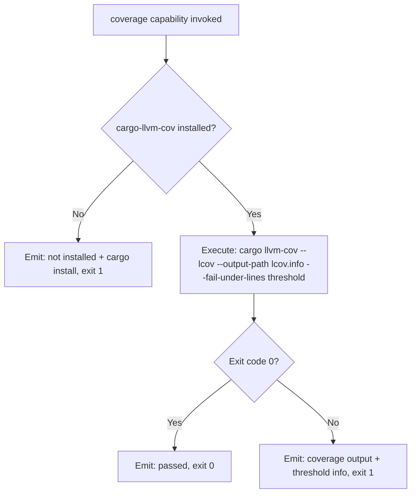
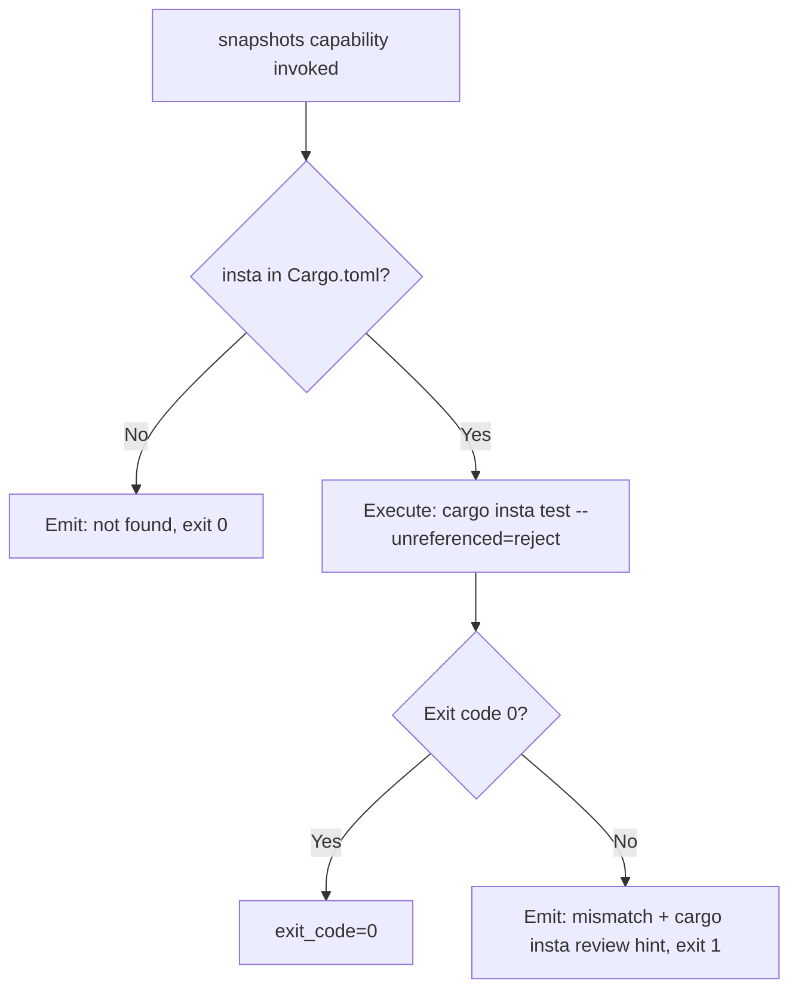
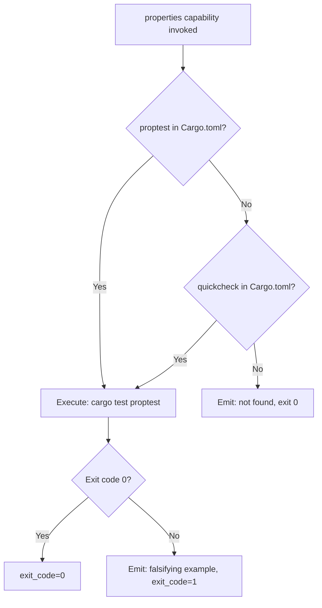
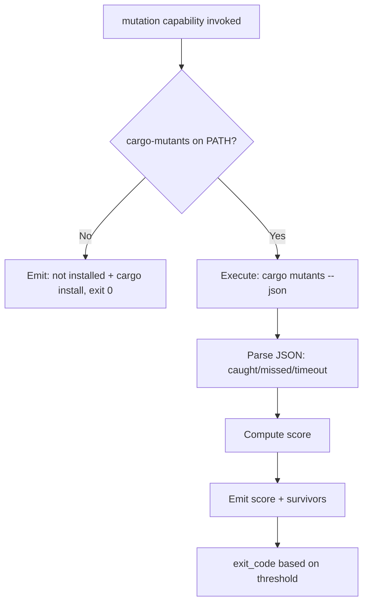

# Feature Spec: Driver Rust — Built-in Test Orchestration Driver

- **Feature:** Driver Rust
- **Branch:** feature/021-driver-rust
- **Date:** 2026-05-06
- **Status:** Draft
- **Priority:** P2
- **Scope:** M
- **Input:** Built-in Rust driver implementing all 5 test orchestration capabilities. Rust has the best tooling maturity among the stacks. Tools: cargo-llvm-cov (coverage with native --fail-under and lcov output), insta (snapshots — reference tool in Rust ecosystem), proptest or quickcheck (property-based), cargo-mutants (mutation — modern, fast, incremental). All capabilities are fully implemented with native flags — no escape hatch scripts needed.
- **Feature Number:** 021
- **Deps:** 016

---

## User Scenarios & Testing

### Story 1 — Developer runs coverage gate on Rust project `P1`

A Rust developer with a `Cargo.toml` runs `/spec.test`. The Rust driver uses `cargo llvm-cov --lcov --output-path lcov.info --fail-under-lines {threshold}`, which natively produces lcov.info and applies the threshold. No script needed.

**Priority reason:** Rust has the cleanest coverage tooling. cargo-llvm-cov is feature-complete and production-ready.

**Independent test:** Run coverage capability on a Rust fixture project; verify lcov.info is produced and native threshold flag is applied.

```gherkin
Feature: Rust coverage gate via cargo-llvm-cov
  Scenario: Coverage above threshold — gate passes
    Given a Rust project with Cargo.toml
    And cargo-llvm-cov installed
    And threshold set to 80%
    And cargo llvm-cov reports 91% line coverage
    When the Rust driver executes the coverage capability
    Then CapabilityResult.exit_code is 0
    And lcov.info is written to lcov.info at project root
    And LiveSpec emits "Coverage gate passed: 91% >= 80%"

  Scenario: cargo-llvm-cov not installed — clear install instruction
    Given a Rust project without cargo-llvm-cov
    When the Rust driver executes the coverage capability
    Then LiveSpec emits: "cargo-llvm-cov not installed. Install: cargo install cargo-llvm-cov"
    And CapabilityResult.exit_code is non-zero (required tool missing)

  Scenario: Coverage below threshold — native gate fails
    Given threshold set to 80% and coverage is 63%
    When the Rust driver executes the coverage capability
    Then cargo llvm-cov exits non-zero (native --fail-under-lines)
    And CapabilityResult.exit_code is non-zero
```



---

### Story 2 — Developer runs snapshot tests via insta `P1`

The snapshot capability runs `cargo insta test` or `cargo test` (insta integrates automatically). insta stores snapshots in `snapshots/` directories and has a TUI review CLI (`cargo insta review`).

**Priority reason:** insta is the reference snapshot library for Rust — used across the Rust ecosystem including Sentry, tokio, etc.

**Independent test:** Run snapshot capability on a Rust fixture with insta; verify pass on match, fail on diff with review hint.

```gherkin
Feature: Rust snapshot testing via insta
  Scenario: All snapshots match — pass
    Given a Rust project with insta in Cargo.toml
    And snapshots/ directories with .snap files
    When the Rust driver executes the snapshots capability
    Then cargo insta test passes
    And CapabilityResult.exit_code is 0

  Scenario: Snapshot mismatch — fail with review hint
    Given a snapshot has changed
    When the Rust driver executes the snapshots capability
    Then cargo insta test fails
    And LiveSpec emits: "Snapshot mismatch. Run 'cargo insta review' to review and accept changes."
    And CapabilityResult.exit_code is non-zero

  Scenario: insta not in Cargo.toml — skip
    Given Cargo.toml without insta dependency
    When the Rust driver executes the snapshots capability
    Then LiveSpec emits: "insta not found in Cargo.toml — skipping snapshot tests"
    And CapabilityResult.exit_code is 0
```



---

### Story 3 — Developer runs property-based tests via proptest or quickcheck `P2`

The properties capability detects which library is in `Cargo.toml` (proptest takes priority over quickcheck) and runs `cargo test`.

**Priority reason:** Both proptest and quickcheck are mature. proptest (inspired by Hypothesis) is preferred for modern Rust projects.

**Independent test:** Run properties capability on fixture projects with proptest and quickcheck separately.

```gherkin
Feature: Rust property-based testing
  Scenario: proptest tests pass
    Given a Rust project with proptest in Cargo.toml
    When the Rust driver executes the properties capability
    Then cargo test runs proptest-based tests
    And CapabilityResult.exit_code is 0

  Scenario: quickcheck used as fallback
    Given a Rust project with quickcheck but no proptest in Cargo.toml
    When the Rust driver executes the properties capability
    Then cargo test runs quickcheck-based tests
    And CapabilityResult.exit_code is 0

  Scenario: Neither library found — skip
    Given a Rust project without proptest or quickcheck
    When the Rust driver executes the properties capability
    Then LiveSpec emits: "No property testing library found in Cargo.toml (proptest, quickcheck) — skipping"
    And CapabilityResult.exit_code is 0
```



---

### Story 4 — Developer runs mutation audit via cargo-mutants `P2`

The mutation capability runs `cargo mutants` which produces a JSON report. cargo-mutants is incremental, only testing changed code — fast enough for on-demand use.

**Priority reason:** cargo-mutants is modern and well-maintained. Better than alternatives. P2 (not P3) because it's fast enough to be practical.

**Independent test:** Run mutation capability on a small Rust fixture; verify score is extracted from cargo-mutants output.

```gherkin
Feature: Rust mutation testing via cargo-mutants
  Scenario: Mutation audit completes — score reported
    Given a Rust project with cargo-mutants installed
    When the Rust driver executes the mutation capability
    Then cargo mutants runs and produces output
    And LiveSpec parses killed/survived/timeout counts
    And LiveSpec emits the mutation score

  Scenario: cargo-mutants not installed — install hint
    Given cargo-mutants not on PATH
    When the Rust driver executes the mutation capability
    Then LiveSpec emits: "cargo-mutants not installed. Install: cargo install cargo-mutants"
    And CapabilityResult.exit_code is 0
```



---

## Acceptance Criteria

- **AC-001** — Driver file `livespec/drivers/rust.yaml` is loaded when `Cargo.toml` is found at project root.
- **AC-002** — Coverage capability uses `cargo llvm-cov --lcov --output-path lcov.info --fail-under-lines {threshold}` (native flag, no script).
- **AC-003** — If `cargo-llvm-cov` is not installed, capability exits non-zero with install instruction (required tool — not optional like snapshot libs).
- **AC-004** — Snapshot capability detects `insta` in `Cargo.toml`; if absent, skips with exit 0. If present, runs `cargo insta test --unreferenced=reject`.
- **AC-005** — On insta mismatch, LiveSpec surfaces the test failure and suggests `cargo insta review`.
- **AC-006** — Properties capability detects `proptest` first, then `quickcheck` as fallback. If neither found, skips with exit 0.
- **AC-007** — Mutation capability checks for `cargo-mutants` on PATH; if absent, emits install hint and exits 0.
- **AC-008** — Mutation capability invokes `cargo mutants --json` and parses the structured output (caught/missed/timeout/unviable).
- **AC-009** — The Rust driver YAML passes schema validation against `DriverSchema`.
- **AC-010** — `Cargo.toml` parsing uses a dedicated parser (not shell grep) to detect `[dependencies]` and `[dev-dependencies]` entries.

---

## Functional Requirements

- **FR-001** — Write `livespec/drivers/rust.yaml` with detect rule (`files: [Cargo.toml]`) and all 4 capability blocks. Coverage uses native `command:` (no script escape hatch needed).
- **FR-002** — Implement `Cargo.toml` dependency parser: extract `[dependencies]` and `[dev-dependencies]` section entries (using `tomllib` for correctness).
- **FR-003** — Implement `cargo mutants --json` output parser: extract `caught`, `missed`, `timeout`, `unviable` counts from JSON report.
- **FR-004** — Write integration tests for all 4 capabilities on Rust fixture projects.
- **FR-005** — Write unit tests for Cargo.toml parser and cargo-mutants JSON parser.

---

## Key Entities

| Entity | Description |
|---|---|
| `rust.yaml` | Rust built-in driver manifest. Detects via `Cargo.toml`. |
| `cargo-llvm-cov` | Rust coverage tool. Native lcov output + --fail-under-lines flag. |
| `insta` | Reference snapshot library for Rust. Includes `cargo insta review` TUI. |
| `proptest` | Hypothesis-inspired property-based testing for Rust. |
| `quickcheck` | Classic QuickCheck port for Rust. Fallback if proptest absent. |
| `cargo-mutants` | Modern Rust mutation testing tool. Incremental, JSON output. |

---

## Edge Cases

- **EC-001** — Workspace with multiple crates: `cargo llvm-cov` runs at workspace root and aggregates; driver detects `Cargo.toml` at root (workspace manifest).
- **EC-002** — Feature-gated code: `cargo-llvm-cov` supports `--all-features`; driver enables it by default (configurable).
- **EC-003** — `cargo mutants` timeout on large workspace: `--timeout` flag configurable in `rust.yaml`.
- **EC-004** — `insta` version mismatch (snap format changes between versions): detected by test failure, not by driver — surfaced normally.

---

## Success Criteria

- **SC-001** — Coverage gate uses no escape hatch script — pure `cargo llvm-cov` command with native flags.
- **SC-002** — All 4 capabilities implemented (Rust is the only stack where mutation is P2, not P3).
- **SC-003** — Driver YAML passes schema validation.
- **SC-004** — Cargo.toml parser handles both `dep = "version"` and `dep = { version = "..." }` syntaxes.

---

*LiveSpec Feature 021 — Draft — 2026-05-06*
