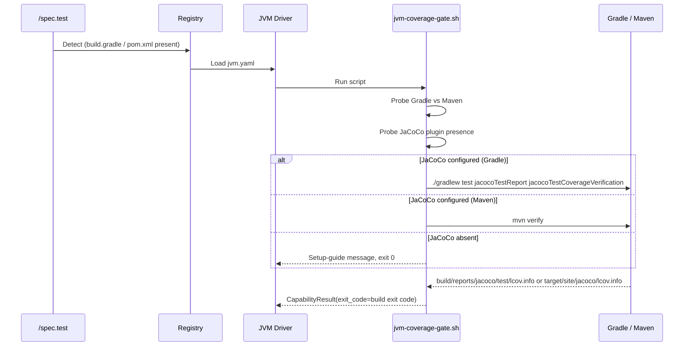
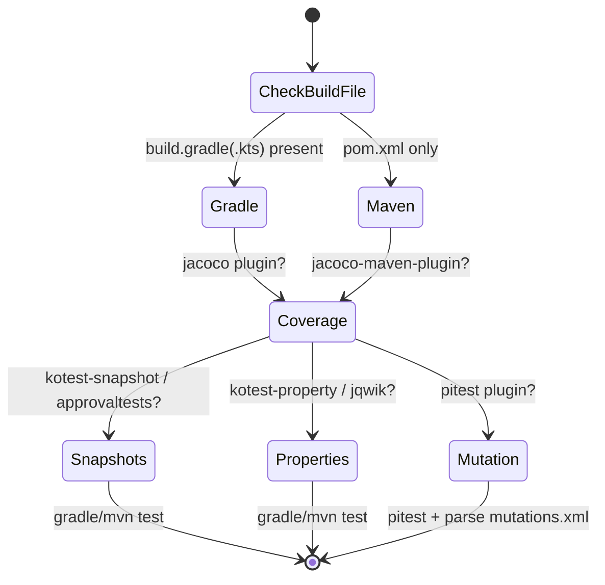
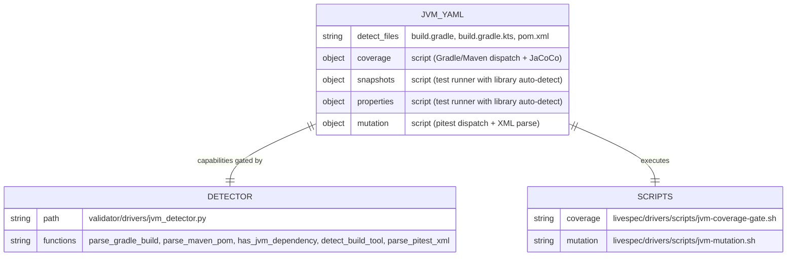

# Plan — Driver JVM (Java + Kotlin) — Built-in Test Orchestration Driver

## Summary

Implement the built-in JVM driver (`livespec/drivers/jvm.yaml`) covering both Java and Kotlin via a single manifest. Detection: `build.gradle`, `build.gradle.kts`, or `pom.xml`. Coverage uses a `script:` escape hatch that auto-detects Gradle vs Maven and dispatches the appropriate JaCoCo invocation; the script is the gate. Snapshots and properties run plain `gradle`/`mvn` test commands, but only after library detection confirms the capability is configured; otherwise the scripts emit the documented skip message and exit 0. Mutation runs pitest via Gradle/Maven (`script:` escape hatch — pitest invocation differs between build tools; the script picks the right one and parses `mutations.xml`). A Python `jvm_detector.py` parses Gradle (.gradle / .gradle.kts via regex — Gradle DSL is not a stable parseable format) and Maven (`pom.xml` via shallow `<artifactId>` regex) build files for plugin/dependency presence and exposes a `parse_pitest_xml` helper implemented with regex for the same portability reason.

---

## Technical Context

| Aspect | Choice | Reason |
|---|---|---|
| Languages | Java + Kotlin (single driver) | Spec FR-001, AC-011 — same build tools, same test infrastructure |
| Detection | `build.gradle`, `build.gradle.kts`, `pom.xml` | Spec AC-001, AC-010 — file presence; Gradle priority over Maven (AC-010) |
| Coverage | `script:` (escape hatch) → JaCoCo | Spec AC-002, AC-003, AC-004 — Gradle/Maven dispatch + setup-guide path |
| Coverage gate | Gradle `jacocoTestCoverageVerification` / Maven `jacoco-maven-plugin check` | Spec FR-001, Story 1 — native gate inside build tool |
| Snapshots | `script:` → `./gradlew test` or `mvn test` | Spec AC-005 — auto-detect kotest-snapshot or approvaltests; skip with exit 0 if absent |
| Properties | `script:` → same | Spec AC-006 — auto-detect kotest-property or jqwik; skip with exit 0 if absent |
| Mutation | `script:` → `./gradlew pitest` or `mvn pitest:mutationCoverage` | Spec AC-007, AC-008 — XML parsed by `parse_pitest_xml` |
| Detector | Pure-Python (regex for Gradle DSL and Maven) | Spec FR-002, FR-003 — stdlib only |
| pitest XML parser | Regex over `<mutation status="...">` | Spec FR-004, AC-008 — avoids broken stdlib XML backends |
| Driver Schema | `DriverManifest` (Feature 016, pydantic) | Existing — reused unchanged |

---

## Constitution Check

- **Simplicity:** declarative YAML + Gradle/Maven dispatch shell scripts + Python parser — mirrors the Go/Swift script-escape-hatch pattern. ✅
- **Separation:** YAML manifest holds capability metadata; `jvm_detector.py` isolates Gradle DSL and Maven XML parsing AND the pitest XML parser in one cohesive module; shell scripts isolate Gradle/Maven dispatch. ✅
- **Testing:** unit tests for the Gradle/Maven parser (plugin + dependency detection across `build.gradle`, `build.gradle.kts`, `pom.xml`); unit tests for the pitest XML parser (KILLED/SURVIVED/TIMED_OUT counts, missing fields, malformed XML); integration tests for manifest schema, registry detection on each of the three build files, capability metadata, and dependency detection on Gradle Groovy / Gradle Kotlin / Maven fixtures. ✅
- **Naming:** `livespec/drivers/jvm.yaml`, `validator/drivers/jvm_detector.py`, `livespec/drivers/scripts/jvm-coverage-gate.sh`, `livespec/drivers/scripts/jvm-mutation.sh`, `tests/unit/test_jvm_detector.py`, `tests/integration/test_driver_jvm.py`. Mirrors 020 (Go) and 019 (Swift) for the script-escape-hatch pattern. ✅
- **Infrastructure:** no new runtime deps; shell scripts are POSIX `bash` matching the Go/Swift pattern. ✅

---

## Mermaid Diagrams

### Sequence — Coverage capability via Gradle/Maven dispatch

### State — Capability decision tree

### ER — JVM driver configuration

---

## Implementation Plan

### Step 1 — Create `livespec/drivers/jvm.yaml` with full manifest

- **Files:** create `livespec/drivers/jvm.yaml`.
- **Content:** detect on `build.gradle`, `build.gradle.kts`, `pom.xml`. Four capabilities all using `script:` escape hatch; coverage script writes lcov.info (Gradle path or Maven path).
- **AC covered:** AC-001, AC-002, AC-009, AC-010, AC-011.

### Step 2 — Create coverage gate script `livespec/drivers/scripts/jvm-coverage-gate.sh`

- Detects build tool: `build.gradle.kts` → Gradle Kotlin; `build.gradle` → Gradle Groovy; `pom.xml` → Maven. Both Gradle and Maven present → Gradle takes priority (AC-010).
- Probes for JaCoCo: regex on `build.gradle*` for `jacoco`, or regex on `pom.xml` for `jacoco-maven-plugin`. If absent → emit setup-guide line ("JaCoCo not configured in build.gradle/pom.xml — see docs for setup"), exit 0.
- Gradle path: `./gradlew test jacocoTestReport jacocoTestCoverageVerification`. Locate lcov.info at `build/reports/jacoco/test/lcov.info`.
- Maven path: `mvn verify`. Locate lcov.info at `target/site/jacoco/lcov.info`.
- **AC covered:** AC-002, AC-003, AC-004, AC-010.

### Step 3 — Create mutation script `livespec/drivers/scripts/jvm-mutation.sh`

- Detects build tool same as Step 2.
- Probes for pitest in build file. If absent → emit setup-hint ("pitest not configured. Add pitest-gradle-plugin or pitest-maven-plugin to enable."), exit 0.
- Gradle path: `./gradlew pitest`; report at `build/reports/pitest/mutations.xml`.
- Maven path: `mvn org.pitest:pitest-maven:mutationCoverage`; report at `target/pit-reports/*/mutations.xml` (glob — last directory in alphabetical order).
- **AC covered:** AC-007, AC-008.

### Step 4 — Create `validator/drivers/jvm_detector.py`

- **Functions:**
  - `detect_build_tool(project_root: str) -> str | None` — returns `"gradle"` (when `build.gradle` or `build.gradle.kts` present), `"maven"` (only `pom.xml`), or `None`. Gradle priority when both (AC-010).
  - `parse_gradle_build(project_root: str) -> list[str]` — regex over `build.gradle` and `build.gradle.kts` to extract plugin/dependency tokens. Strips comments. Lowercases.
  - `parse_maven_pom(project_root: str) -> list[str]` — shallow regex over `<artifactId>...</artifactId>` nodes (plugins + dependencies), lowercased.
  - `parse_jvm_dependencies(project_root: str) -> list[str]` — returns the deduplicated union of Gradle tokens and Maven artifact ids so mixed migration trees are still detectable.
  - `has_jvm_dependency(project_root: str, name: str) -> bool` — substring case-insensitive (Maven uses dotted artifact ids, Gradle uses dotted strings; substring is the right granularity).
  - `parse_pitest_xml(xml_text: str) -> dict[str, int]` — parses pitest `<mutation status="...">` elements via regex, returns `{"killed": N, "survived": N, "timed_out": N, "no_coverage": N, "memory_error": N, "run_error": N}` (zero-defaults for absent statuses; tolerant of malformed XML — returns all zeros without raising).
- **AC covered:** AC-008, AC-010, AC-011, FR-002, FR-003, FR-004.

### Step 5 — Unit tests `tests/unit/test_jvm_detector.py`

- `detect_build_tool` returns `"gradle"` for `build.gradle`, `build.gradle.kts`, both Gradle + Maven present.
- `detect_build_tool` returns `"maven"` for only `pom.xml`.
- `detect_build_tool` returns `None` for empty directory.
- `parse_gradle_build` extracts `jacoco`, `pitest`, `kotest-snapshot`, `kotest-property`, `jqwik` from a Groovy DSL fixture.
- `parse_gradle_build` extracts the same from a Kotlin DSL fixture.
- `parse_maven_pom` extracts plugin and dependency artifact ids from a POM fixture.
- `has_jvm_dependency` is case-insensitive substring.
- `has_jvm_dependency` returns False for absent/empty/whitespace name.
- Missing build file → empty list, no raise.
- Malformed `pom.xml` (truncated XML) → empty list, no raise.
- `parse_pitest_xml` extracts KILLED/SURVIVED/TIMED_OUT counts from a realistic pitest XML.
- `parse_pitest_xml` zero-fills missing statuses.
- `parse_pitest_xml` returns all zeros on malformed XML (no raise).
- `parse_pitest_xml` recognises lowercase `killed`/`survived` AND uppercase `KILLED`/`SURVIVED` (pitest is uppercase in practice; we normalise).
- **AC covered:** AC-008, AC-010, AC-011, FR-002, FR-003, FR-004, FR-006.

### Step 6 — Unit tests for shell scripts `tests/unit/test_jvm_coverage_gate.py` and `tests/unit/test_jvm_mutation_script.py`

- Coverage gate: JaCoCo absent on Gradle → setup-guide printed, exit 0.
- Coverage gate: JaCoCo absent on Maven → setup-guide printed, exit 0.
- Coverage gate: no build file → error, exit 1.
- Coverage gate: Gradle priority when both present.
- Mutation: pitest absent on Gradle → setup-hint printed, exit 0.
- Mutation: pitest absent on Maven → setup-hint printed, exit 0.
- Tests intercept `gradlew`/`mvn` via PATH stubs (the gate scripts must not actually invoke a real build).
- **AC covered:** AC-004, AC-007.

### Step 7 — Integration tests `tests/integration/test_driver_jvm.py`

- `test_registry_loads_jvm_driver_on_gradle`: registry discovers jvm when `build.gradle` exists.
- `test_registry_loads_jvm_driver_on_gradle_kts`: ditto for `build.gradle.kts`.
- `test_registry_loads_jvm_driver_on_maven`: ditto for `pom.xml`.
- `test_jvm_driver_schema_validation`: manifest validates and exposes all 4 capabilities.
- `test_jvm_driver_capabilities_exist`: `implemented_capabilities()` returns exactly `["coverage", "snapshots", "properties", "mutation"]`.
- `test_jvm_driver_detect_files`: all three build files in `detect.files`.
- `test_coverage_capability_uses_script_escape_hatch`: coverage uses `script:` (NOT `command:`), references the gate script.
- `test_mutation_capability_uses_script_escape_hatch`: mutation uses `script:`, references the mutation script.
- `test_snapshots_capability_metadata`: present, has `command` or `script`.
- `test_properties_capability_metadata`: present.
- `test_dependency_detection_in_gradle_groovy_fixture`: write `build.gradle` with jacoco + pitest + kotest-snapshot → parser exposes them.
- `test_dependency_detection_in_gradle_kotlin_fixture`: same with `build.gradle.kts`.
- `test_dependency_detection_in_maven_fixture`: write `pom.xml` with same plugins/deps → parser exposes them.
- `test_gradle_priority_over_maven`: when both `build.gradle` and `pom.xml` present, `detect_build_tool` returns `"gradle"`.
- `test_coverage_gate_script_is_shipped_and_executable`: the script exists on disk and is executable.
- `test_mutation_script_is_shipped_and_executable`: ditto.
- **AC covered:** AC-001, AC-002, AC-003, AC-005, AC-006, AC-007, AC-008, AC-009, AC-010, AC-011.

### Step 8 — Implementation report + changelog

- Write `.specs/features/022-driver-jvm/implementation.md` mirroring 021 structure.
- Append entry to `.specs/features/022-driver-jvm/changelog.md`.

---

## Testing Strategy

| Test Type | What | File | AC |
|---|---|---|---|
| Unit | Gradle DSL + Maven POM parser | tests/unit/test_jvm_detector.py | AC-010, AC-011, FR-002, FR-003 |
| Unit | pitest XML parser | tests/unit/test_jvm_detector.py | AC-008, FR-004 |
| Unit | Coverage gate shell script | tests/unit/test_jvm_coverage_gate.py | AC-002, AC-004 |
| Unit | Mutation + snapshots + properties shell scripts | tests/unit/test_jvm_mutation_script.py | AC-005, AC-006, AC-007 |
| Integration | Registry + manifest + 4-capability metadata + dependency detection on three build files | tests/integration/test_driver_jvm.py | AC-001, AC-005, AC-006, AC-009, AC-010, AC-011 |
| Schema | DriverManifest validates jvm.yaml | (asserted in integration tests) | AC-009 |

---

## Risks & Considerations

1. **Gradle DSL is not a stable parseable format** — we use regex matching for plugin/dependency tokens instead of a full Groovy/Kotlin parser. This is consultative (the driver does not gate hard on detection — Gradle/Maven themselves do via build failures), so regex is acceptable here.
2. **JaCoCo lcov export requires explicit configuration** — the standard JaCoCo plugin emits `jacocoTestReport.xml` and HTML by default; lcov export requires a small Gradle task. Spec AC-003 acknowledges this and supports a configurable override path. Our coverage gate script looks for the lcov file but does not synthesise it.
3. **pitest XML report path varies** — Gradle: `build/reports/pitest/mutations.xml`. Maven: `target/pit-reports/<timestamp>/mutations.xml`. The mutation script handles both via globbing (EC-004).
4. **Multi-module Gradle projects (EC-001)** — addressed at the build-tool level (JaCoCo aggregation task in build.gradle). The driver runs at the project root and inherits the build tool's aggregation behaviour.
5. **Kotlin Multiplatform (EC-002)** — driver does not special-case KMP; the README references the spec note that KMP requires manual driver configuration. No code path in this feature.
6. **Python XML backend portability** — the local Python 3.14 environment exposed a broken `pyexpat` backend, so shallow regex parsing was chosen for Maven `artifactId` extraction and pitest status counting. The data shape is constrained enough that this remains robust without adding dependencies.
7. **No auto-installation of build tools** — `gradle`/`mvn` absence is surfaced by the runner as the standard install hint; the gate script does not attempt to install build tools.

---

## Success Criteria

- SC-001..SC-004: covered by integration + unit tests; pitest XML parser handles KILLED + SURVIVED (test_parse_pitest_xml_extracts_counts), single driver handles all three build files (test_registry_loads_jvm_driver_on_*).

---

*LiveSpec Feature 022 Plan — Approved — 2026-05-07*
