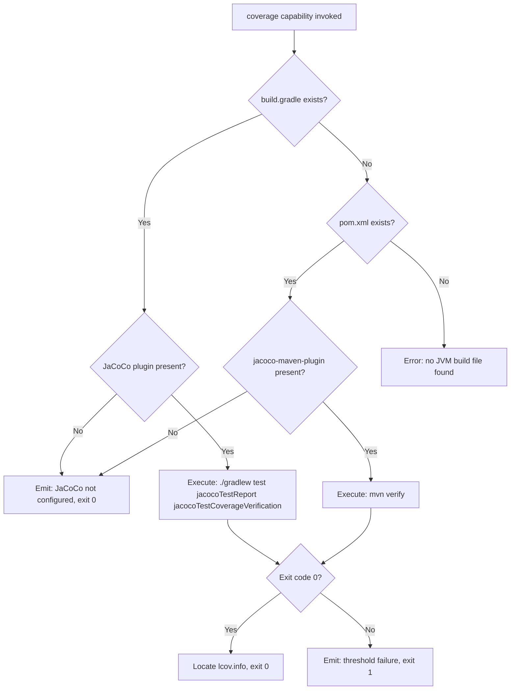
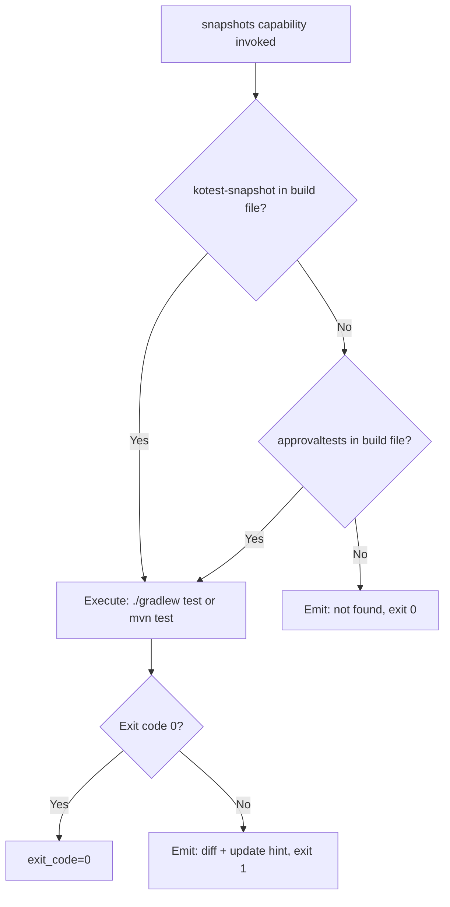
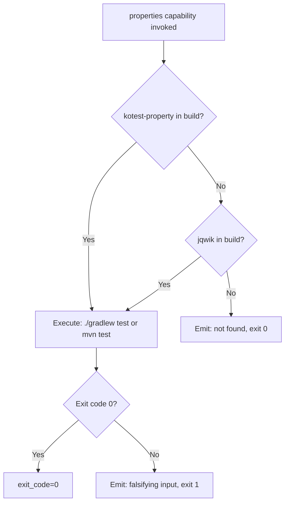
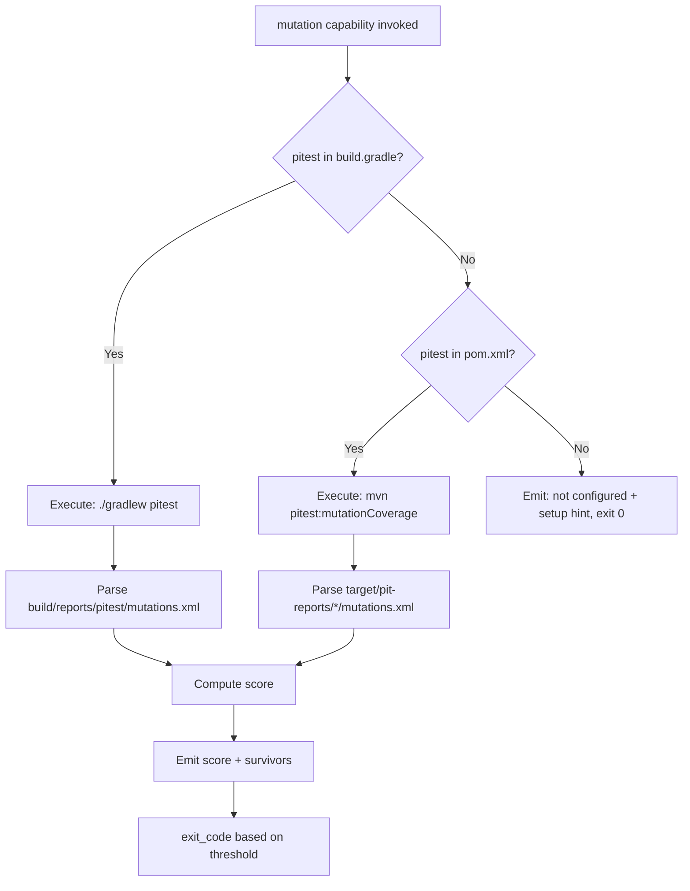

# Feature Spec: Driver JVM (Java + Kotlin) — Built-in Test Orchestration Driver

- **Feature:** Driver JVM (Java + Kotlin)
- **Branch:** feature/022-driver-jvm
- **Date:** 2026-05-06
- **Status:** Draft
- **Priority:** P2
- **Scope:** M
- **Input:** Built-in JVM driver covering both Java and Kotlin projects via a single driver. Same build tools, same test infrastructure. Tools: JaCoCo (coverage via Gradle or Maven), approvaltests-java or kotest-snapshot (snapshots — kotest for Kotlin-first, approvaltests for Java-first), jqwik or kotest-property (property-based), pitest (mutation — the reference for JVM). Coverage gate implemented via Gradle/Maven build failure on JaCoCo threshold.
- **Feature Number:** 022
- **Deps:** 016

---

## User Scenarios & Testing

### Story 1 — Developer runs coverage gate on JVM project `P1`

A developer with a Gradle or Maven project runs `/spec.test`. The JVM driver detects the build tool, runs tests with JaCoCo coverage, generates lcov.info via a Gradle task or Maven plugin, and applies the threshold configured in the build file.

**Priority reason:** JaCoCo + Gradle is the standard Java/Kotlin CI setup. Coverage gate is the most requested capability.

**Independent test:** Run coverage capability on a Gradle fixture project; verify lcov.info is produced and JaCoCo threshold fails below the configured value.

```gherkin
Feature: JVM coverage gate via JaCoCo
  Scenario: Gradle project — coverage above threshold passes
    Given a Gradle project with JaCoCo configured
    And jacocoTestCoverageVerification threshold set to 0.80
    And tests produce 85% line coverage
    When the JVM driver executes the coverage capability
    Then ./gradlew test jacocoTestCoverageVerification exits 0
    And lcov.info is generated at build/reports/jacoco/test/lcov.info
    And LiveSpec emits "Coverage gate passed"

  Scenario: Maven project — coverage below threshold fails
    Given a Maven project with jacoco-maven-plugin
    And minimum coverage set to 0.80
    And tests produce 60% coverage
    When the JVM driver executes the coverage capability
    Then mvn verify exits non-zero (JaCoCo rule failure)
    And CapabilityResult.exit_code is non-zero

  Scenario: JaCoCo not configured — emit setup guide
    Given a Gradle project without JaCoCo plugin
    When the JVM driver executes the coverage capability
    Then LiveSpec emits: "JaCoCo not configured in build.gradle/pom.xml — see docs for setup"
    And CapabilityResult.exit_code is 0
```



---

### Story 2 — Developer runs snapshot tests on JVM project `P2`

The snapshot capability auto-detects the test library: kotest-snapshot for Kotlin-first projects, approvaltests-java for Java-first projects. Detection based on build file dependency.

**Priority reason:** Snapshot testing in JVM is less standard but growing (especially with Kotest's adoption in Kotlin).

**Independent test:** Run snapshot capability on Kotlin fixture with kotest; verify pass/fail behavior.

```gherkin
Feature: JVM snapshot testing
  Scenario: Kotlin project — kotest snapshots pass
    Given a Kotlin project with kotest-snapshot in build.gradle.kts
    And snapshot files exist in src/test/snapshots/
    When the JVM driver executes the snapshots capability
    Then ./gradlew test passes snapshot assertions
    And CapabilityResult.exit_code is 0

  Scenario: Java project — approvaltests snapshots
    Given a Java project with approvaltests in pom.xml
    And .approved.txt files exist
    When the JVM driver executes the snapshots capability
    Then mvn test passes
    And CapabilityResult.exit_code is 0

  Scenario: No snapshot library detected — skip
    Given no kotest-snapshot or approvaltests in build file
    When the JVM driver executes the snapshots capability
    Then LiveSpec emits: "No snapshot library detected — skipping (supported: kotest-snapshot, approvaltests)"
    And CapabilityResult.exit_code is 0
```



---

### Story 3 — Developer runs property-based tests via jqwik or kotest-property `P2`

The properties capability detects jqwik (Java-first) or kotest-property (Kotlin-first). jqwik integrates with JUnit 5; kotest-property integrates with the kotest runner.

**Priority reason:** jqwik is excellent for Java — mature, JUnit 5 native. kotest-property is the natural choice for Kotlin.

**Independent test:** Run properties capability on Java fixture with jqwik; verify property test failure reports the falsifying input.

```gherkin
Feature: JVM property-based testing
  Scenario: jqwik tests pass (Java)
    Given a Java project with jqwik in pom.xml
    When the JVM driver executes the properties capability
    Then mvn test runs @Property tests
    And CapabilityResult.exit_code is 0

  Scenario: kotest-property tests fail with falsifying example (Kotlin)
    Given a Kotlin project with kotest-property
    And a property test that finds a failing case
    When the JVM driver executes the properties capability
    Then the test runner reports the falsifying input
    And CapabilityResult.exit_code is non-zero

  Scenario: Neither library found — skip
    Given no jqwik or kotest-property in build file
    When the JVM driver executes the properties capability
    Then LiveSpec emits: "No property testing library found — skipping (supported: jqwik, kotest-property)"
    And CapabilityResult.exit_code is 0
```



---

### Story 4 — Developer runs mutation audit via pitest `P2`

The mutation capability runs pitest via Gradle or Maven plugin. pitest is the reference mutation tool for Java/Kotlin — battle-tested, widely used. Produces XML + HTML reports.

**Priority reason:** pitest is mature and reliable. P2 because it's slower than other tools but the JVM ecosystem expects it.

**Independent test:** Run mutation capability on Java fixture; verify pitest produces XML report and LiveSpec parses the mutation score.

```gherkin
Feature: JVM mutation testing via pitest
  Scenario: pitest Gradle — mutation score reported
    Given a Java project with pitest Gradle plugin configured
    When the JVM driver executes the mutation capability
    Then ./gradlew pitest runs
    And LiveSpec parses build/reports/pitest/mutations.xml
    And LiveSpec emits mutation score (killed/total)

  Scenario: pitest Maven — mutation score reported
    Given a Maven project with pitest-maven-plugin
    When the JVM driver executes the mutation capability
    Then mvn org.pitest:pitest-maven:mutationCoverage runs
    And LiveSpec parses target/pit-reports/*/mutations.xml

  Scenario: pitest not configured — skip with hint
    Given no pitest in build file
    When the JVM driver executes the mutation capability
    Then LiveSpec emits: "pitest not configured. Add pitest-gradle-plugin or pitest-maven-plugin to enable."
    And CapabilityResult.exit_code is 0
```



---

## Acceptance Criteria

- **AC-001** — Driver file `livespec/drivers/jvm.yaml` is loaded when `build.gradle`, `build.gradle.kts`, or `pom.xml` is found at project root.
- **AC-002** — Coverage capability auto-detects Gradle vs Maven and runs the appropriate command.
- **AC-003** — Coverage capability locates the JaCoCo lcov.info at the standard path (`build/reports/jacoco/test/lcov.info` for Gradle, `target/site/jacoco/lcov.info` for Maven) or uses a configurable override.
- **AC-004** — When JaCoCo is not configured in the build file, capability exits 0 with a setup guide message.
- **AC-005** — Snapshot capability detects kotest-snapshot (Kotlin) or approvaltests-java (Java) from build file; if absent, skips with exit 0.
- **AC-006** — Properties capability detects kotest-property or jqwik from build file; kotest-property takes priority for Kotlin-first projects.
- **AC-007** — Mutation capability detects pitest Gradle plugin or Maven plugin; if absent, emits setup hint and exits 0.
- **AC-008** — Mutation capability parses pitest XML report (`mutations.xml`) to extract KILLED/SURVIVED/TIMED_OUT counts.
- **AC-009** — The JVM driver YAML passes schema validation against `DriverSchema`.
- **AC-010** — Build file detection (Gradle vs Maven) is done by file presence: `build.gradle(.kts)` → Gradle; `pom.xml` → Maven; both → Gradle takes priority.
- **AC-011** — The driver handles Kotlin-first projects (`build.gradle.kts`, kotest-snapshot, kotest-property) and Java-first projects (XML Maven, approvaltests, jqwik) transparently from a single `jvm.yaml`.

---

## Functional Requirements

- **FR-001** — Write `livespec/drivers/jvm.yaml` with detect rule (`files: [build.gradle, build.gradle.kts, pom.xml]`) and 4 capability blocks with Gradle/Maven conditional commands.
- **FR-002** — Implement build tool detection: prefer Gradle when both present; detect Kotlin DSL (`build.gradle.kts`) for library naming preference.
- **FR-003** — Implement `build.gradle` / `pom.xml` parser to detect plugin and dependency presence (JaCoCo, pitest, kotest-snapshot, approvaltests, jqwik, kotest-property).
- **FR-004** — Implement pitest XML parser: read `mutations.xml`, extract `<mutation status="KILLED|SURVIVED|TIMED_OUT">` elements, compute score.
- **FR-005** — Write integration tests for coverage capability on Gradle and Maven fixture projects.
- **FR-006** — Write unit tests for build file parser and pitest XML parser.

---

## Key Entities

| Entity | Description |
|---|---|
| `jvm.yaml` | JVM built-in driver manifest. Covers Java + Kotlin. Detects via Gradle/Maven build files. |
| `JaCoCo` | Java code coverage library. Supports lcov export. Standard in Gradle/Maven. |
| `pitest` | Reference JVM mutation testing framework. XML + HTML reports. |
| `kotest-snapshot` | Kotlin-first snapshot library (Kotest framework). |
| `approvaltests-java` | Java snapshot library (approval testing pattern). |
| `jqwik` | JUnit 5 property-based testing engine for Java. |
| `kotest-property` | Property-based testing module in the Kotest framework (Kotlin). |

---

## Edge Cases

- **EC-001** — Multi-module Gradle project: coverage and mutation run at root with `./gradlew` and aggregate across subprojects. JaCoCo aggregation task required in build.gradle.
- **EC-002** — Kotlin Multiplatform (KMP): driver detects KMP via `kotlin("multiplatform")` in `build.gradle.kts` and emits "KMP projects require manual driver configuration — see docs".
- **EC-003** — Java 8 compatibility: pitest supports Java 8; coverage gate uses JaCoCo minimum 0.8.x (detects version from Gradle lockfile).
- **EC-004** — pitest XML report split across multiple directories (per-test-suite): driver aggregates by scanning `build/reports/pitest/*/mutations.xml` glob.

---

## Success Criteria

- **SC-001** — Coverage gate works on a Gradle fixture project: lcov.info produced and JaCoCo threshold applied natively.
- **SC-002** — Single driver handles Java-first and Kotlin-first projects without configuration change.
- **SC-003** — Driver YAML passes schema validation.
- **SC-004** — pitest XML parser handles both KILLED and SURVIVED statuses correctly.

---

*LiveSpec Feature 022 — Draft — 2026-05-06*
