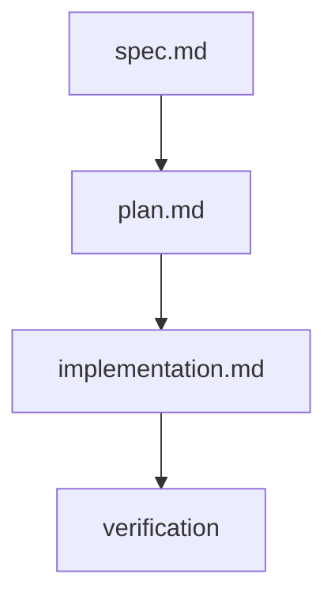

# Plan — 023 Driver Custom Scaffolding & Graceful Degradation

- **Feature:** 023-driver-custom-scaffolding
- **Date:** 2026-05-07
- **Status:** Approved
- **Scope:** S
- **Deps:** 016 (driver architecture)

## Context

Feature 016 already shipped baseline scaffolding (`validator/drivers/scaffold.py`), CLI subcommand (`validator/drivers/cli.py` mounted as `livespec spec-driver`), and degradation message (`validator/drivers/degradation.py`). Feature 023 closes the gaps surfaced by the spec:

1. CLI naming aligned to `spec.driver` (per FR-001 / Story 1).
2. YAML template promoted to embedded resource (`livespec/drivers/templates/custom-driver-template.yaml`) per FR-002.
3. Pre-filled `detect.files` based on stack heuristics (AC-005, EC-003).
4. Inline documentation: each capability section gets explanatory comments — `command` vs `script:`, `report_path`, template variables (Story 3 / SC-001).
5. Filename sanitization for hyphens/dots and non-existent `.specs/` (EC-001, EC-002, EC-004).
6. Degradation message reformatted to start with `⚠ Stack not supported`, include `No driver registered for this stack`, link to `.specs/spec-system.md` (AC-006).
7. Final scaffold output prints path + reminder + integration command (AC-010).
8. Runner partial-driver path verified: skip non-implemented capabilities and report `not implemented` without exit nonzero (AC-009, FR-005).

## Architecture

```
validator/drivers/
├── scaffold.py                        # MODIFIED — load template from livespec/drivers/templates, pre-fill detect.files, sanitize stack
├── degradation.py                     # MODIFIED — new format with ⚠ prefix and explicit "No driver registered"
├── cli.py                             # MODIFIED — typer name "spec.driver", richer next-steps output
└── runner.py                          # MODIFIED — add partial-driver helper

validator/cli.py                       # MODIFIED — mount under "spec.driver" name
```

Tests added in `tests/test_drivers.py`:
- Template parses through `load_manifest` and validates schema (AC-002).
- `detect.files` pre-filled for elixir / ruby / php (AC-005, SC-004).
- Hyphenated stack name yields valid filename (EC-001).
- Scaffold creates `.specs/drivers/` even when absent (EC-002).
- Degradation message contains `⚠ Stack not supported`, signals, scaffold cmd, integration link (AC-006).
- CLI subcommand registered as `spec.driver` (smoke via `CliRunner`).
- Partial driver: only `snapshots` defined → coverage/properties/mutation reported as not-implemented; runner does not exit non-zero on those (AC-009).

## Implementation Steps

1. Create `livespec/drivers/templates/custom-driver-template.yaml` with documented sections.
2. Update `scaffold.py` to load the embedded template from `livespec/drivers/templates`, support stack→detect-files map, sanitize names, ensure parent dir.
3. Update `degradation.py` for new structured format.
4. Update CLI: `driver_app = typer.Typer(name="spec.driver")`; print next-steps including `livespec spec.driver --help` and integration doc path. Update `validator/cli.py` mounting accordingly.
5. Update tests; add new ones for AC-002, AC-005, AC-006, EC-001, EC-002, AC-009 path.
6. Run `pytest`, `pyright`, `ruff` until green.

## Risk

- Other features may import the old scaffold `TEMPLATE` constant or call `livespec spec-driver`. Search and update references.

## Acceptance traceability

AC-001 → step 1 + 2 (sections present). AC-002 → tests. AC-003/004 → existing logic preserved. AC-005 → step 2. AC-006 → step 3. AC-007 → covered by Engine call site (out of scope here, but degradation already exits 0). AC-008 → existing inference table. AC-009 → tests on runner. AC-010 → step 4.

---

*LiveSpec Plan — 2026-05-07*

## Summary

Technical plan for Driver Custom Scaffolding.

## Testing Strategy

- Run focused tests for the mapped implementation.
- Run full project validation before completion.

## Risks & Considerations

- Keep this compatibility plan aligned with the living spec and implementation map.

## Traceability Flow


