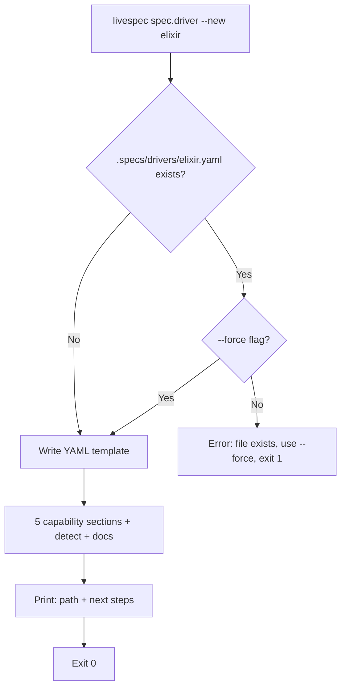
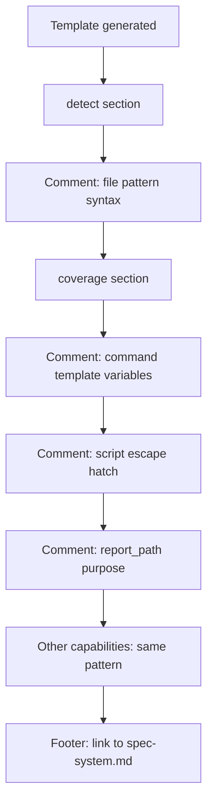

# Feature Spec: Driver Custom Scaffolding & Graceful Degradation

- **Feature:** Driver Custom Scaffolding & Graceful Degradation
- **Branch:** feature/023-driver-custom-scaffolding
- **Date:** 2026-05-06
- **Status:** Draft
- **Priority:** P1
- **Scope:** S
- **Input:** Two related UX features for the driver system: (1) livespec spec.driver --new <stack> scaffold command that generates a documented YAML template for a custom driver; (2) structured graceful degradation message when no driver matches a project's stack. Both make it easy for users on unsupported stacks to write their own driver and connect it to LiveSpec.
- **Feature Number:** 023
- **Deps:** 016

---

## User Scenarios & Testing

### Story 1 — Developer scaffolds a custom driver for an unsupported stack `P1`

A developer on an Elixir (or any unsupported) project runs `livespec spec.driver --new elixir`. LiveSpec creates `.specs/drivers/elixir.yaml` with all 5 capability sections documented inline, a `detect` section pre-filled with common Elixir file patterns, and a note linking to `spec-system.md` for integration instructions.

**Priority reason:** The scaffold lowers the barrier to custom driver adoption from "I need to know the YAML schema" to "run one command and fill in the blanks".

**Independent test:** Run `livespec spec.driver --new elixir` on a clean project; verify the YAML is created with correct structure and all 5 sections.

```gherkin
Feature: Custom driver scaffolding
  Scenario: Scaffold new driver for unsupported stack
    Given no .specs/drivers/elixir.yaml exists
    When the developer runs: livespec spec.driver --new elixir
    Then LiveSpec creates .specs/drivers/elixir.yaml
    And the file contains a detect section with file pattern examples
    And the file contains all 5 capability sections: detect, coverage, snapshots, properties, mutation
    And each section is commented with inline documentation
    And the file includes a note pointing to .specs/spec-system.md for integration
    And LiveSpec prints the path of the created file and next steps

  Scenario: Scaffold fails if driver file already exists (without --force)
    Given .specs/drivers/elixir.yaml already exists
    When the developer runs: livespec spec.driver --new elixir
    Then LiveSpec emits: "Driver .specs/drivers/elixir.yaml already exists. Use --force to overwrite."
    And exits non-zero
    And the existing file is not modified

  Scenario: Scaffold overwrites with --force flag
    Given .specs/drivers/elixir.yaml already exists
    When the developer runs: livespec spec.driver --new elixir --force
    Then LiveSpec overwrites .specs/drivers/elixir.yaml with the fresh template
    And exits 0
```



---

### Story 2 — Developer sees actionable message when stack is not supported `P1`

A developer on a project with only `.ex` / `mix.exs` files runs `/spec.test`. No driver matches. LiveSpec emits a structured, actionable degradation message — not a cryptic error — and exits 0.

**Priority reason:** Silent failure or opaque error messages kill adoption. The degradation message is the primary UX for unsupported stacks.

**Independent test:** Run `/spec.test` on an Elixir fixture; verify the degradation message contains all required elements.

```gherkin
Feature: Graceful degradation for unsupported stack
  Scenario: No driver matches — full degradation message
    Given a project with only mix.exs and .ex files
    And no matching driver in built-in or custom registry
    When the developer runs /spec.test
    Then LiveSpec emits a structured warning starting with: "⚠ Stack not supported"
    And the message includes the detected file signals (mix.exs, .ex)
    And the message includes: "No driver registered for this stack"
    And the message includes the custom driver path: .specs/drivers/<detected-name>.yaml
    And the message includes the scaffold command: livespec spec.driver --new <detected-name>
    And the message includes which file to update for integration: .specs/spec-system.md or driver registry
    And /spec.test exits with code 0

  Scenario: Partial driver match — capabilities degraded
    Given a custom .specs/drivers/elixir.yaml with only snapshots implemented
    When the developer runs /spec.test
    Then LiveSpec runs the snapshots capability
    And emits "coverage: not implemented for elixir driver"
    And emits "properties: not implemented for elixir driver"
    And emits "mutation: not implemented for elixir driver"
    And exits based on snapshot result
```

```mermaid
flowchart TD
    A[/spec.test] --> B[Run DriverRegistry.detect]
    B --> C{Any driver matches?}
    C -- Yes --> D[Run implemented capabilities only]
    C -- No --> E[Infer stack name from file signals]
    E --> F[Emit structured degradation warning]
    F --> G[Show: detected signals]
    G --> H[Show: custom driver path]
    H --> I[Show: scaffold command]
    I --> J[Show: integration doc link]
    J --> K[Exit 0]
    D --> L[For each capability]
    L --> M{Implemented?}
    M -- Yes --> N[Run + report]
    M -- No --> O[Report: not implemented, skip]
    N --> P{More?}
    O --> P
    P -- Yes --> L
    P -- No --> Q[Exit based on results]
```

---

### Story 3 — Developer reads inline documentation in the YAML template `P2`

The generated YAML template includes enough inline comments that a developer can understand what each field does, what format the `command` should take, and how to use the `script:` escape hatch — without reading external documentation.

**Priority reason:** Good documentation reduces friction and support load. The YAML template is the primary user-facing API for custom drivers.

**Independent test:** Read the generated YAML; verify each capability section has at minimum: one comment explaining the purpose, one comment explaining `command` vs `script:`, and the `report_path` field documented.

```gherkin
Feature: YAML template inline documentation quality
  Scenario: Template contains sufficient inline docs
    Given the developer runs: livespec spec.driver --new ruby
    When the file .specs/drivers/ruby.yaml is read
    Then the detect section has a comment explaining file pattern syntax
    And the coverage section has a comment explaining the command template variables
    And the coverage section has a comment about the script: escape hatch
    And the report_path field has a comment explaining its purpose
    And the file ends with a link to the driver documentation in spec-system.md
```



---

## Acceptance Criteria

- **AC-001** — `livespec spec.driver --new <stack>` creates `.specs/drivers/<stack>.yaml` with all 5 sections: `detect`, `coverage`, `snapshots`, `properties`, `mutation`.
- **AC-002** — The generated YAML passes schema validation (`DriverSchema`) with no errors.
- **AC-003** — If the file already exists and `--force` is not provided, the command exits non-zero with a clear message and does NOT modify the existing file.
- **AC-004** — With `--force`, the command overwrites the existing file.
- **AC-005** — The `detect.files` section in the template is pre-filled with commented examples relevant to the stack name if recognizable (e.g., `elixir` → `mix.exs`), or generic examples otherwise.
- **AC-006** — Graceful degradation message includes: ⚠ prefix, detected file signals, "No driver registered" statement, custom driver path (`.specs/drivers/<name>.yaml`), scaffold command, link to integration documentation.
- **AC-007** — Graceful degradation exits 0 (not blocked — spec.test continues without test orchestration).
- **AC-008** — Stack name inference for the degradation message uses a heuristic based on detected file patterns (e.g., `mix.exs` → `elixir`, `Gemfile` → `ruby`) with a fallback to `unknown`.
- **AC-009** — Partial driver (only some capabilities implemented) runs available capabilities and reports "not implemented" for the rest without exiting non-zero on those.
- **AC-010** — After scaffold, LiveSpec prints: the created file path, a reminder to fill in the capability commands, and the integration command to register the driver.

---

## Functional Requirements

- **FR-001** — Implement `livespec spec.driver --new <stack>` subcommand under the `livespec` CLI (Typer).
- **FR-002** — Write the YAML template as an embedded resource in the LiveSpec package (`livespec/drivers/templates/custom-driver-template.yaml`); `spec.driver --new` reads the template and writes it to `.specs/drivers/<stack>.yaml`.
- **FR-003** — Implement stack name inference: map known file patterns to stack names (`mix.exs` → elixir, `Gemfile` → ruby, `*.ex` → elixir, etc.) for the degradation message.
- **FR-004** — Implement degradation message renderer: structured output with ⚠ prefix, sections for signals/path/command/docs.
- **FR-005** — Implement partial-driver capability loop: for each requested capability, check if implemented in driver manifest; emit "not implemented" and skip if absent.
- **FR-006** — Write unit tests for scaffold command (file creation, --force behavior) and degradation message renderer.

---

## Key Entities

| Entity | Description |
|---|---|
| `custom-driver-template.yaml` | Embedded template resource used by `spec.driver --new`. |
| Stack name inference table | Maps file patterns to common stack names for degradation messages. |
| Degradation message | Structured warning emitted when no driver matches. |

---

## Edge Cases

- **EC-001** — Stack name contains hyphens or dots (e.g., `ruby-on-rails`): sanitized to valid filename (`ruby-on-rails.yaml`).
- **EC-002** — `.specs/drivers/` directory does not exist: created automatically by `spec.driver --new`.
- **EC-003** — Multiple unrecognized file patterns: degradation message lists all detected signals, uses "unknown" as inferred name.
- **EC-004** — `spec.driver --new` run outside a LiveSpec project (no `.specs/` directory): command creates `.specs/drivers/` if needed, emits a note that the project may not be initialized with LiveSpec.

---

## Success Criteria

- **SC-001** — Generated YAML is valid and self-documenting — a developer unfamiliar with LiveSpec drivers can complete a custom driver for their stack without reading external docs.
- **SC-002** — Degradation message on an Elixir fixture is emitted in < 0.5 seconds (no heavy computation).
- **SC-003** — `spec.driver --new` is tested for 3 scenarios: new file, existing file (no --force), existing file (--force).
- **SC-004** — Stack name inference correctly identifies elixir, ruby, and PHP from their characteristic files (unit tested).

---

*LiveSpec Feature 023 — Draft — 2026-05-06*
