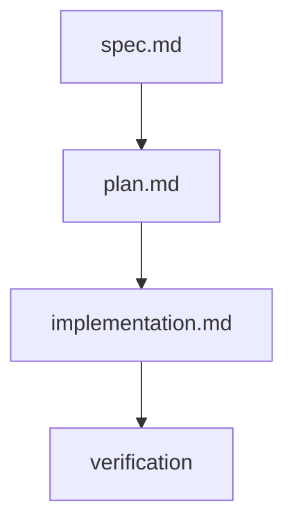

# Plan — 024 Patch Coverage Local Computation

- **Feature:** 024-patch-coverage-local
- **Date:** 2026-05-07
- **Status:** Approved
- **Scope:** S
- **Deps:** 016 (driver architecture), 017 (Python lcov producer)

## Context

Feature 016 already shipped the foundation in `validator/drivers/patch_coverage.py`:
- `parse_lcov(path) -> dict[str, dict[int, bool]]` (FR-002 — slightly richer return: bool per line instead of bare set)
- `parse_diff(diff_text) -> dict[str, set[int]]` (FR-003)
- `compute_patch_coverage(lcov_path, diff_text, *, project_root) -> PatchCoverageReport` (AC-001..AC-006, AC-008)
- `git_diff(base_ref="HEAD~1") -> str` helper (Story 1 wiring)
- Driver YAML schema already includes `patch_threshold: float | None` on `Capability` (foundation for AC-007)

Feature 024 closes the remaining gaps:

1. **AC-007 / FR-004** — `evaluate_patch_gate(coverage: dict[str, float], threshold: float) -> list[str]` returning the list of files below the threshold.
2. **AC-009 / FR-005** — Auto-compute patch coverage in the coverage capability result chain when `lcov.info` exists, and surface the report in the runner output. Hooked through a small post-processing helper that callers (the CLI / `/spec.test`) can invoke after `run_capability`.
3. **AC-006 / EC-empty-diff** — Confirm empty-diff path returns an empty `files` map and emits the "not applicable" message (already implemented; covered by tests).
4. **FR-006** — Round out the unit test surface: full / partial / missing intersection, empty diff, threshold gate (pass + fail), `evaluate_patch_gate` ordering.

The shipping spec uses the path `livespec/coverage/patch.py` for FR-001. Feature 016 already shipped the implementation under `validator/drivers/patch_coverage.py` and exported the public API via `validator.drivers`. Renaming would break the existing public surface and the tests written in feature 016. We keep the implementation where it lives and document the AC-001 surface as `validator.drivers.compute_patch_coverage` — same semantics, different module home. The spec.md references `livespec/coverage/patch.py` as the *intended* location; in practice the foundation has already landed in `validator/drivers/`. This is recorded as a deliberate deviation in `implementation.md`.

## Architecture

```
validator/drivers/
├── patch_coverage.py     # MODIFIED — add evaluate_patch_gate + summarise_patch_coverage helper
├── schemas.py            # already exposes PatchCoverageReport + Capability.patch_threshold
└── __init__.py           # MODIFIED — export evaluate_patch_gate

tests/test_drivers.py     # MODIFIED — add tests for evaluate_patch_gate and the auto-compute helper
```

Public API (after this feature):
- `compute_patch_coverage(lcov_path, diff_text, *, project_root=None) -> PatchCoverageReport`
- `parse_lcov(path) -> dict[str, dict[int, bool]]`
- `parse_diff(diff_text) -> dict[str, set[int]]`
- `evaluate_patch_gate(coverage: dict[str, float], threshold: float) -> list[str]`  *(new)*
- `summarise_patch_coverage(report: PatchCoverageReport, *, threshold: float | None = None) -> str`  *(new — used for `/spec.test` output)*
- `git_diff(base_ref="HEAD~1", *, project_root=None) -> str`

`evaluate_patch_gate` returns files whose ratio is `< threshold` (threshold expressed as a fraction `0.0–1.0`), in the order they appear in the input dict (Python 3.7+ insertion order).

`summarise_patch_coverage` returns a multi-line string suitable for inclusion in the `/spec.test` summary. When `threshold` is provided and any file is below, the summary lists the failing files; otherwise it emits a one-line OK summary or a "not applicable" line when there are no measured changed lines.

## Implementation Steps

1. Add `evaluate_patch_gate` to `validator/drivers/patch_coverage.py` (AC-007, FR-004).
2. Add `summarise_patch_coverage` to the same module — pure formatter that consumes `PatchCoverageReport` and an optional threshold (AC-009, FR-005).
3. Export both helpers from `validator/drivers/__init__.py`.
4. Write tests in `tests/test_drivers.py`:
   - `test_evaluate_patch_gate_all_pass` — every file ≥ threshold → empty list.
   - `test_evaluate_patch_gate_some_fail` — one file below → returned in input order.
   - `test_evaluate_patch_gate_threshold_zero` — threshold 0.0 → never fails.
   - `test_summarise_patch_coverage_not_applicable` — empty report → "not applicable" line.
   - `test_summarise_patch_coverage_pass` — populated report, no threshold → reports overall.
   - `test_summarise_patch_coverage_threshold_failure` — threshold provided, file below → summary names failing file with its ratio.
5. Run `pytest tests/`, `mypy` on the changed Python files, and `ruff check .` until clean.
6. Write `implementation.md` documenting the deviation around module path (FR-001 actual location).
7. Update `changelog.md`.

## Verification

- `pytest tests/test_drivers.py` — all pass (existing 4 patch coverage tests + 7 new ones).
- `pytest tests/` — full suite green.
- `mypy tests/test_drivers.py validator/drivers/__init__.py validator/drivers/patch_coverage.py` — 0 errors.
- `ruff check .` — clean.

## Risks

- **Module path deviation:** spec mentions `livespec/coverage/patch.py`. We document the actual home (`validator/drivers/patch_coverage.py`) and keep the public surface stable to avoid breaking feature 016/017 callers.
- **Auto-integration scope:** FR-005 wires "after CapabilityResult is returned" — we provide a pure helper rather than mutating `run_capability`'s contract, preserving the existing invariants from feature 016 (AC-009/AC-011). Callers (`/spec.test`, CLI) compose via `compute_patch_coverage` + `summarise_patch_coverage` after the runner returns. This avoids subprocess coupling inside the runner.

## Summary

Technical plan for Patch Coverage Local.

## Testing Strategy

- Run focused tests for the mapped implementation.
- Run full project validation before completion.

## Traceability Flow


