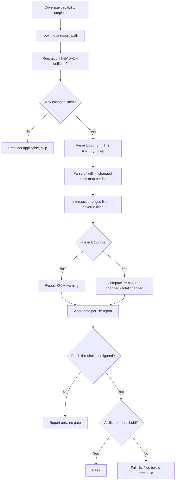
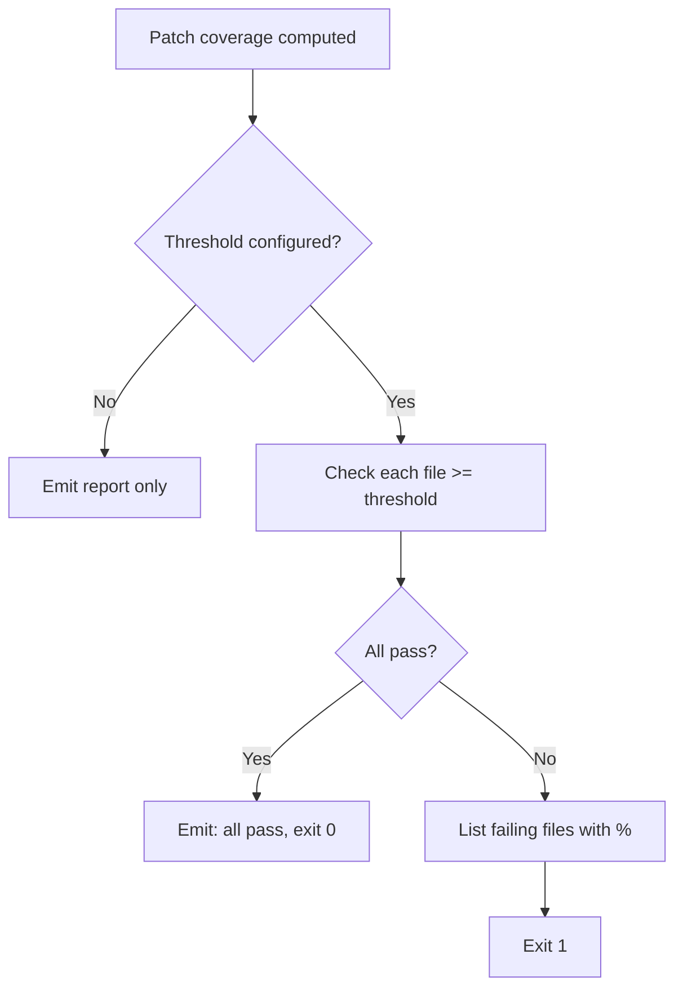

# Feature Spec: Patch Coverage — Local Computation

- **Feature:** Patch Coverage Local Computation
- **Branch:** feature/024-patch-coverage-local
- **Date:** 2026-05-06
- **Status:** Draft
- **Priority:** P2
- **Scope:** S
- **Input:** Compute patch coverage (coverage of only the lines changed in the current PR/branch) locally using lcov.info + git diff intersection — no Codecov, Coveralls, or external service required. Integrates with the coverage capability output from any driver. Patch coverage is more actionable than total coverage for PR quality gates.
- **Feature Number:** 024
- **Deps:** 016, 017

---

## User Scenarios & Testing

### Story 1 — Developer sees patch coverage after running coverage gate `P1`

After the coverage capability runs and produces `lcov.info`, LiveSpec automatically computes patch coverage by intersecting the lcov.info data with `git diff HEAD~1`. The per-file patch coverage is reported alongside total coverage.

**Priority reason:** Patch coverage is the most actionable metric for PRs — it tells the author specifically which new lines they forgot to test.

**Independent test:** Provide a fixture lcov.info and git diff; verify patch coverage computation returns correct per-file percentages.

```gherkin
Feature: Patch coverage computation
  Scenario: Patch coverage computed correctly
    Given a lcov.info reporting coverage for src/foo.py
    And git diff shows 20 lines changed in src/foo.py
    And 15 of those 20 lines are marked as covered in lcov.info
    When LiveSpec computes patch coverage
    Then patch coverage for src/foo.py is 75%
    And the result is returned without any external service call

  Scenario: Changed file has no lcov entry — reported as 0%
    Given git diff shows changes to src/new_module.py
    And src/new_module.py has no DA lines in lcov.info
    When LiveSpec computes patch coverage
    Then src/new_module.py is reported with 0% patch coverage
    And a warning is emitted: "No coverage data for src/new_module.py"

  Scenario: No changed lines on branch — patch coverage skipped
    Given git diff HEAD~1 returns empty (no changes)
    When LiveSpec computes patch coverage
    Then LiveSpec emits: "No changed lines — patch coverage not applicable"
    And does not emit a failure
```



---

### Story 2 — Developer configures a patch coverage threshold `P2`

The developer configures a `patch_coverage_threshold` in the driver YAML or in a LiveSpec config. When patch coverage falls below it for any changed file, `/spec.test` exits non-zero.

**Priority reason:** Optional gate — not all teams want to block on patch coverage, but those who do need an explicit threshold.

**Independent test:** Configure threshold at 90%; run on fixture where one file has 70% patch coverage; verify non-zero exit and correct file named in report.

```gherkin
Feature: Patch coverage threshold gate
  Scenario: Patch coverage above threshold for all files — pass
    Given patch_coverage_threshold set to 85%
    And all changed files have >= 85% patch coverage
    When LiveSpec evaluates the patch coverage gate
    Then /spec.test exits 0
    And LiveSpec emits "Patch coverage: all files pass (85% threshold)"

  Scenario: One file below patch threshold — gate fails
    Given patch_coverage_threshold set to 85%
    And src/new_feature.py has 72% patch coverage
    When LiveSpec evaluates the patch coverage gate
    Then /spec.test exits non-zero
    And LiveSpec emits: "Patch coverage gate failed: src/new_feature.py: 72% < 85%"
```



---

## Acceptance Criteria

- **AC-001** — `compute_patch_coverage(lcov_path, diff_output)` function accepts a path to lcov.info and a git diff string, returns `dict[str, float]` mapping file paths to patch coverage ratios.
- **AC-002** — lcov.info parsing reads `DA:<line>,<hit_count>` lines per `SF:<path>` section; lines with hit_count > 0 are covered.
- **AC-003** — git diff parsing reads unified diff hunk headers (`@@ -a,b +c,d @@`) to extract added/modified line numbers per file.
- **AC-004** — Intersection: only lines that are both in the diff (added/modified) AND in the lcov DA entries are considered.
- **AC-005** — Files in git diff with no lcov entry are reported as 0% with a warning — not as errors.
- **AC-006** — Empty git diff → `compute_patch_coverage` returns empty dict; LiveSpec emits "not applicable" and skips the gate.
- **AC-007** — `patch_coverage_threshold` is optional in the driver YAML coverage block; when absent, patch coverage is computed and reported but no gate is applied.
- **AC-008** — The function has no external network calls; all computation is local file I/O + string parsing.
- **AC-009** — Results are included in the `/spec.test` summary output alongside total coverage.

---

## Functional Requirements

- **FR-001** — Implement `compute_patch_coverage(lcov_path: Path, diff_output: str) -> dict[str, float]` in `livespec/coverage/patch.py`.
- **FR-002** — Implement `parse_lcov(lcov_path: Path) -> dict[str, set[int]]` — returns per-file set of covered line numbers.
- **FR-003** — Implement `parse_diff_lines(diff_output: str) -> dict[str, set[int]]` — returns per-file set of added/modified line numbers from unified diff.
- **FR-004** — Implement `evaluate_patch_gate(coverage: dict[str, float], threshold: float) -> list[str]` — returns list of files below threshold.
- **FR-005** — Integrate patch coverage computation into the coverage capability result chain: after CapabilityResult is returned, run patch coverage automatically if lcov.info is present.
- **FR-006** — Write unit tests covering: correct intersection, 0% for missing files, empty diff, and threshold gate logic.

---

## Key Entities

| Entity | Description |
|---|---|
| `PatchCoverageReport` | `dict[str, float]` mapping file path → patch coverage ratio. |
| `parse_lcov()` | Parses DA lines from lcov.info into per-file covered line sets. |
| `parse_diff_lines()` | Parses unified diff hunks into per-file added/modified line sets. |

---

## Edge Cases

- **EC-001** — Line renumbering (file moved): lcov.info references old line numbers, diff references new. Current implementation treats as separate files (no rename tracking). Noted as known limitation.
- **EC-002** — Binary files in diff: `parse_diff_lines` skips files with `Binary files ... differ` marker.
- **EC-003** — Deleted lines in diff: only added/modified lines (`+` prefix in diff) count toward patch coverage. Deleted lines are ignored.
- **EC-004** — lcov.info with `BRF`/`BRH` (branch data): parsed but not used in patch coverage computation (line coverage only).

---

## Success Criteria

- **SC-001** — `compute_patch_coverage` unit tests cover all 4 edge cases with reference fixtures.
- **SC-002** — Function produces correct results on a real Python project's lcov.info + git diff (integration test).
- **SC-003** — Patch coverage report is included in `/spec.test` output within 0.5 seconds of coverage capability completion (pure parsing — no subprocess).

---

*LiveSpec Feature 024 — Draft — 2026-05-06*
