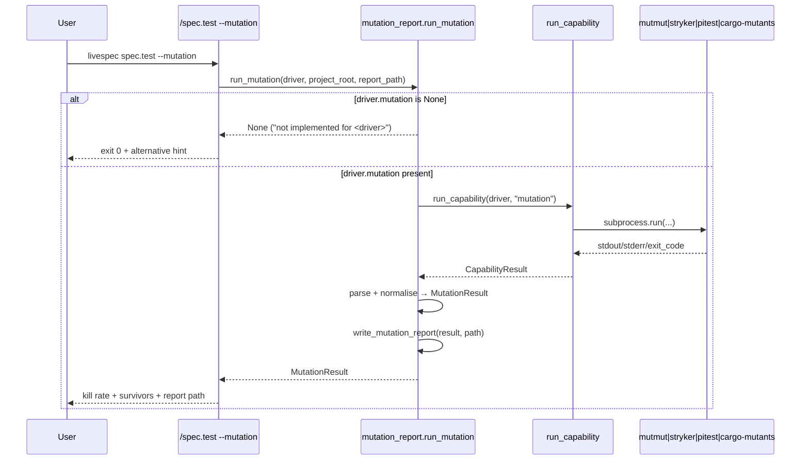

# Plan — 025 Mutation Testing On-Demand

- **Feature:** 025-mutation-testing-on-demand
- **Date:** 2026-05-07
- **Status:** Approved
- **Scope:** S
- **Deps:** 016 (driver architecture), 017 (mutmut), 018 (Stryker), 021 (cargo-mutants), 022 (pitest)

## Context

The driver YAML manifests already expose a `mutation` capability for every stack
that has a maintained mutation tool: Python (mutmut), TS/JS (Stryker), JVM (pitest),
Rust (cargo-mutants), Swift (muter). Go has no `mutation` block — its driver YAML
documents the absence and recommends gopter for property-based safety. Per-stack
parsers already exist:

- `validator/drivers/mutmut_parser.py` → `parse_mutmut_results` returns
  `{killed, survived, timeout, score, survivors}`.
- `validator/drivers/stryker_parser.py` → `parse_stryker_report` returns
  `{killed, survived, timeout, no_coverage, kill_rate}`.
- `validator/drivers/jvm_detector.parse_pitest_xml` returns counts per pitest status.
- `validator/drivers/rust_detector.parse_cargo_mutants_json` returns
  `{caught, missed, timeout, unviable}`.

The `run_capability(driver, "mutation", ...)` runner from feature 016 wires the
subprocess invocation. Feature 025 stays small: it adds a *report writer* that
normalises the per-driver parser outputs into a `MutationResult`, prepends a
human-readable Markdown entry to `.specs/testing/mutation-report.md`, and
provides an orchestration entry point invoked by `/spec.test --mutation`.

Per-PR CI is **not** modified — mutation runs only when the user passes
`--mutation` explicitly to `/spec.test`.

## Architecture

```
validator/
├── drivers/
│   └── mutation_report.py      # NEW — MutationResult, SurvivorRef, run_mutation,
│                               #       write_mutation_report, normalise_*
└── __init__.py                 # untouched

tests/
└── test_mutation_report.py     # NEW — unit tests for normalise/write/append

commands/
└── test.md                     # MODIFIED — document --mutation flag
```

### Public API (new module `validator.drivers.mutation_report`)

```python
@dataclass(frozen=True)
class SurvivorRef:
    file: str
    line: int
    description: str = ""   # original/mutant context when the parser exposes it

@dataclass(frozen=True)
class MutationResult:
    date: str               # ISO 8601 (YYYY-MM-DD)
    driver: str             # python, typescript, jvm, rust, swift, ...
    kill_rate: float        # percent in [0, 100]
    killed: int
    survived: int
    timeout: int
    no_coverage: int = 0
    survivors: list[SurvivorRef] = ()
    note: str = ""          # e.g. "TIMEOUT" for EC-001

def normalise_mutmut(parsed: MutmutParseResult, *, driver: str = "python",
                    today: str | None = None) -> MutationResult: ...
def normalise_stryker(parsed: StrykerParseResult, *, driver: str = "typescript",
                     today: str | None = None) -> MutationResult: ...
def normalise_pitest(counts: dict[str, int], *, driver: str = "jvm",
                    survivors: list[SurvivorRef] | None = None,
                    today: str | None = None) -> MutationResult: ...
def normalise_cargo_mutants(counts: dict[str, int], *, driver: str = "rust",
                           survivors: list[SurvivorRef] | None = None,
                           today: str | None = None) -> MutationResult: ...

def render_report_entry(result: MutationResult, *,
                       max_survivors: int = 20) -> str: ...
def write_mutation_report(result: MutationResult, report_path: Path) -> None: ...

def run_mutation(driver: DriverManifest, *, project_root: Path,
                report_path: Path | None = None,
                timeout: float | None = None) -> MutationResult | None:
    """Returns None when the active driver does not declare a mutation
    capability (Story 1, Scenario 2). Otherwise returns a MutationResult and
    writes the report when report_path is provided."""
```

`run_mutation` calls `run_capability(driver, "mutation")` and dispatches to the
matching parser based on `driver.name` (the canonical names from the YAML
manifests). When the runner returns exit-code 127 ("command not found"), the
function returns the result with a `note` containing the install hint and
`kill_rate=0` — consistent with AC-007.

### Driver dispatch table

| `driver.name` | Source            | Parser                                                |
|---------------|-------------------|-------------------------------------------------------|
| `python`      | mutmut stdout     | `parse_mutmut_results(stdout) → normalise_mutmut`     |
| `typescript`  | report file JSON  | `load_stryker_report(path) → normalise_stryker`       |
| `jvm`         | pitest mutations.xml | `parse_pitest_xml(text) → normalise_pitest`        |
| `rust`        | cargo-mutants JSON| `parse_cargo_mutants_json(stdout) → normalise_cargo_mutants` |
| `swift`       | muter stdout      | best-effort numeric parse (regex) → MutationResult    |
| `go`          | n/a               | capability absent → returns None                      |

For `swift`, no upstream parser exists yet — we extract `killed/survived/timeout`
counts from muter's stdout via regex and return a result with empty `survivors`
(richer parsing can be added later without breaking the surface).

### Report file format

```markdown
# Mutation Report — <project root name>

<!-- Auto-generated by /spec.test --mutation. Newest entry first. -->

## 2026-05-07 — python

- Driver: python
- Kill rate: 92.3 %
- Killed: 120
- Survived: 8
- Timeout: 2
- Survivors (showing top 8 of 8):
  - `validator/foo.py:42` — survived
  - `validator/foo.py:51` — survived
  ...

---

## 2026-05-06 — python

...
```

`write_mutation_report` reads the existing file (if present), splits on the
top-level `## ` heading marker, prepends the new entry, and rewrites the file.
When the survivor count exceeds 20, the rendered list is truncated and a
"N more survivors — run tool directly for full list" line is appended (EC-002).
The parent directory is created when missing (EC-003).

## Implementation Steps

1. **Create `validator/drivers/mutation_report.py`** with the dataclasses,
   normalisers, render/write helpers, and `run_mutation` orchestration.
2. **Export the public API** through `validator/drivers/__init__.py` so tests
   and the slash-command can import via `from validator.drivers import ...`.
3. **Add tests in `tests/test_mutation_report.py`** covering:
   - `normalise_mutmut` round-trip from a typical mutmut JSON payload (FR-005).
   - `normalise_stryker` from both `files.<path>.mutants[]` and `metrics`.
   - `normalise_pitest` counts mapping (`killed`, `survived`, `timed_out`).
   - `normalise_cargo_mutants` outcomes (`caught` → killed, `missed` → survived).
   - `write_mutation_report` creates the file with header when absent (AC-003).
   - `write_mutation_report` prepends without erasing previous entries (AC-004).
   - `render_report_entry` truncates to 20 survivors (EC-002).
   - `write_mutation_report` creates `.specs/testing/` when missing (EC-003).
   - `run_mutation` returns `None` when the driver has no mutation block
     (AC-002, Story 1 Scenario 2).
   - `run_mutation` surfaces install hint when exit code is 127 (AC-007).
4. **Update `commands/spec-test.md`** to document the `--mutation` flag (Story 1):
   add a section explaining the on-demand semantics, the report path, and the
   "not implemented for X driver" exit-0 behaviour.
5. **Verify** with `pytest tests/`, `pyright validator/`, `ruff check validator/`.

## State / ER

No persistent state beyond the human-readable Markdown report. The dataclasses
are transient (in-memory only). No database changes.

## Sequence



## Risks / Trade-offs

- **Survivor extraction depth varies by tool.** mutmut and Stryker expose rich
  per-mutant info; cargo-mutants exposes structured outcomes; pitest XML lists
  `<mutation>` elements but the existing `parse_pitest_xml` only counts statuses.
  Per-mutant survivor location for jvm/rust is left as a follow-up — the report
  records aggregate counts only when survivor refs are unavailable.
- **Threshold gating** (AC-005) is implemented by reading the `threshold` field
  from the matched `DriverCapability` and comparing it to `kill_rate`. Returned
  via a `gate_failed` boolean on the result for the CLI to translate into an
  exit code.
- **No CI integration.** The feature explicitly excludes per-PR runs (SC-001).

*LiveSpec Plan 025 — Approved — 2026-05-07*
