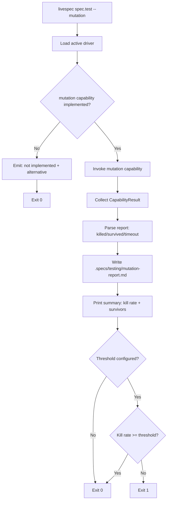
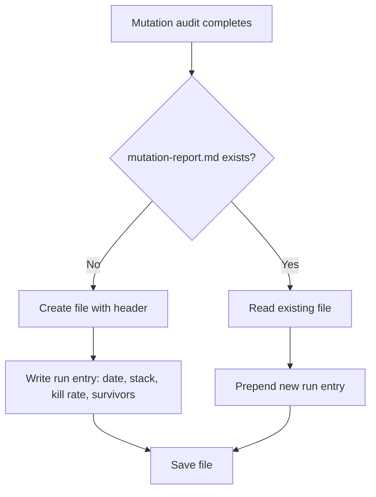

# Feature Spec: Mutation Testing On-Demand

- **Feature:** Mutation Testing On-Demand
- **Branch:** feature/025-mutation-testing-on-demand
- **Date:** 2026-05-06
- **Status:** Draft
- **Priority:** P3
- **Scope:** S
- **Input:** Mutation testing is too slow for per-PR CI gates. This feature exposes it as an on-demand audit command (livespec spec.test --mutation or a dedicated cron schedule). The mutation capability from the active driver is invoked, results are parsed, surviving mutants are listed with file:line references, and a report is saved to .specs/testing/mutation-report.md for historical tracking.
- **Feature Number:** 025
- **Deps:** 016, 017

---

## User Scenarios & Testing

### Story 1 — Developer runs mutation audit on demand `P2`

A developer runs `livespec spec.test --mutation` explicitly. LiveSpec invokes the mutation capability from the active driver, collects results, and saves a report to `.specs/testing/mutation-report.md`.

**Priority reason:** Mutation testing should be opt-in (slow), not automatic. The on-demand flag makes it explicit and intentional.

**Independent test:** Run `livespec spec.test --mutation` on a Python fixture; verify the mutation report is created with correct kill rate and survivors listed.

```gherkin
Feature: Mutation testing on demand
  Scenario: Mutation audit runs and produces report
    Given a Python project with mutmut installed
    And the Python driver has a mutation capability configured
    When the developer runs: livespec spec.test --mutation
    Then LiveSpec invokes the mutation capability
    And collects killed/survived/timeout counts
    And writes .specs/testing/mutation-report.md with the results
    And prints a summary: kill rate, survivor count, link to report

  Scenario: Mutation capability not implemented for stack — clear message
    Given a Go project (mutation not in go.yaml)
    When the developer runs: livespec spec.test --mutation
    Then LiveSpec emits: "mutation: not implemented for go driver"
    And suggests: "Consider using property-based testing (gopter) as a richer alternative"
    And exits 0

  Scenario: Standard /spec.test run — mutation NOT invoked
    Given any project
    When the developer runs: livespec spec.test (no --mutation flag)
    Then mutation capability is NOT invoked
    And the test run completes without mutation (coverage + snapshots only)
```



---

### Story 2 — Report is saved and versioned for historical tracking `P3`

Each mutation run appends a dated entry to `.specs/testing/mutation-report.md`. Over time, this file shows the trend of mutation score across the project's history.

**Priority reason:** Mutation score trends are more valuable than single-run snapshots. A report file persisted in the repo gives teams visibility into quality trends.

**Independent test:** Run mutation audit twice; verify both runs are appended to the report file with correct timestamps.

```gherkin
Feature: Mutation report historical tracking
  Scenario: First run creates report
    Given no .specs/testing/mutation-report.md exists
    When mutation audit completes
    Then .specs/testing/mutation-report.md is created
    And contains date, stack, driver, kill rate, survivors list

  Scenario: Subsequent run appends to report
    Given .specs/testing/mutation-report.md already has a previous run
    When mutation audit completes again
    Then the new run is prepended to the report (newest first)
    And previous runs are preserved
```



---

## Acceptance Criteria

- **AC-001** — `livespec spec.test --mutation` flag invokes the mutation capability from the active driver; without the flag, mutation is never invoked.
- **AC-002** — When mutation capability is not implemented for the active driver, LiveSpec emits a "not implemented" message with a relevant alternative suggestion and exits 0.
- **AC-003** — After a successful mutation run, `.specs/testing/mutation-report.md` is created or updated with a dated entry containing: date, stack/driver name, kill rate (%), killed count, survived count, timeout count, and list of surviving mutants with file:line.
- **AC-004** — Mutation report entries are prepended (newest first); previous entries are preserved.
- **AC-005** — An optional `mutation_threshold` in the driver YAML triggers a gate: if kill rate < threshold, exit non-zero. Without threshold, always exit 0 after reporting.
- **AC-006** — The command output includes a link to the full report: `Full report: .specs/testing/mutation-report.md`.
- **AC-007** — Running mutation on a stack where the tool (mutmut/Stryker/cargo-mutants) is not installed emits an install hint and exits 0 (consistent with standard capability degradation).

---

## Functional Requirements

- **FR-001** — Add `--mutation` flag to `livespec spec.test` subcommand.
- **FR-002** — Implement `write_mutation_report(result: MutationResult, report_path: Path)` — creates or prepends entry to `.specs/testing/mutation-report.md`.
- **FR-003** — Define `MutationResult` dataclass: `date`, `driver`, `kill_rate`, `killed`, `survived`, `timeout`, `survivors: list[SurvivorRef]`.
- **FR-004** — Define `SurvivorRef` dataclass: `file`, `line`, `original`, `mutant` (if available from driver output).
- **FR-005** — Write unit tests for `write_mutation_report` (create + append behavior).
- **FR-006** — Write integration test: run `spec.test --mutation` on Python fixture, verify report file created.

---

## Key Entities

| Entity | Description |
|---|---|
| `MutationResult` | Structured result of a mutation run: kill rate, counts, survivors. |
| `SurvivorRef` | A surviving mutant: file path, line number, mutation description. |
| `mutation-report.md` | Historical log of mutation runs in `.specs/testing/`. |

---

## Edge Cases

- **EC-001** — Mutation tool times out (very large project): CapabilityResult.exit_code reflects timeout; report entry notes "TIMEOUT" for affected mutants.
- **EC-002** — Survivor list exceeds 100 items: report truncates to top 20 survivors and notes "N more survivors — run tool directly for full list".
- **EC-003** — `.specs/testing/` directory doesn't exist: created automatically before writing the report.

---

## Success Criteria

- **SC-001** — `--mutation` flag is explicit opt-in: confirmed by test that standard `/spec.test` does not invoke mutation.
- **SC-002** — Report file format is human-readable Markdown with dated entries.
- **SC-003** — Historical entries are preserved across multiple runs.

---

*LiveSpec Feature 025 — Draft — 2026-05-06*
