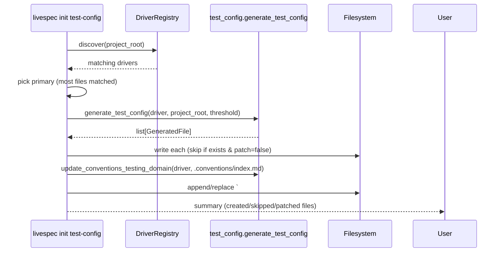
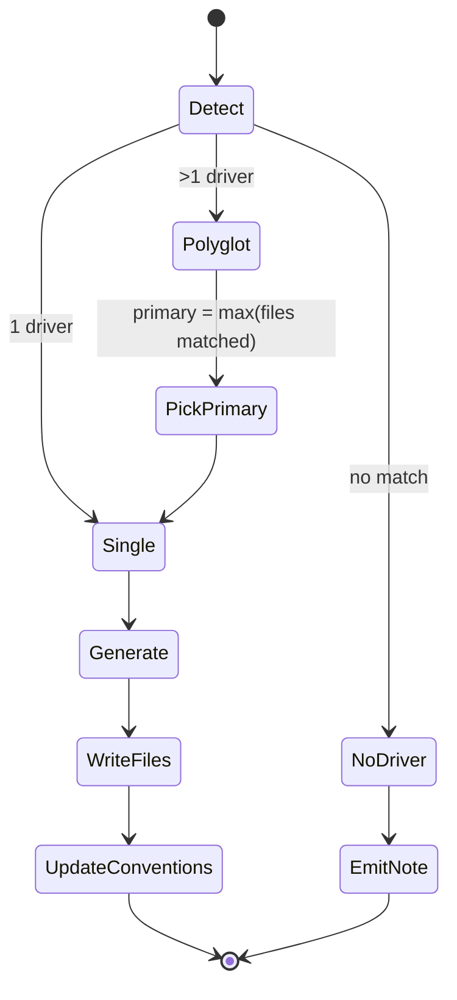

# Plan: Conventions Propagation by Stack

- **Feature:** 026-conventions-propagation-by-stack
- **Status:** Approved
- **Date:** 2026-05-07

---

## Overview

Add a `validator.drivers.test_config` module that, given a detected `DriverManifest`, produces:

1. A list of `GeneratedFile` entries (path + content + write strategy: `create` / `patch` / `skip-if-exists`) for the per-stack coverage gate config (FR-001, FR-002).
2. A `.github/workflows/test.yml` that runs `livespec spec.test` after installing LiveSpec (FR-003, AC-003).
3. An updated `testing` domain entry for `.conventions/index.md` (FR-004, AC-005).

A new CLI subcommand `livespec init test-config` materializes those files. It is the surface that `/spec.init` Phase C invokes (FR-005). The markdown change is documented but the orchestration logic lives in Python (testable, deterministic).

The conventions update path is also reused by `/spec.refresh-conventions` (AC-006).

---

## Sequence



---

## State Diagram



---

## Files to Create / Modify

| File | Action | Purpose |
|------|--------|---------|
| `validator/drivers/test_config.py` | Create | `GeneratedFile`, `generate_test_config`, per-stack generators, `generate_ci_workflow`, `update_conventions_testing_domain`. |
| `validator/drivers/test_config_cli.py` | Create | Typer subcommand `livespec init test-config`. |
| `validator/cli.py` | Modify | Register the new `init` Typer app. |
| `tests/drivers/test_test_config.py` | Create | Unit tests for each generator + CI workflow + conventions update. |
| `tests/drivers/test_test_config_cli.py` | Create | CLI integration test on TS, Python, unsupported fixtures. |
| `commands/spec-init.md` | Modify | Reference the new `livespec init test-config` step in Phase C. |

---

## Implementation Steps

### Step 1 — Schema and core module

- Add `GeneratedFile` dataclass to `validator/drivers/test_config.py`:
  - `path: Path` (relative to project root)
  - `content: str`
  - `mode: Literal["create", "patch_section", "skip_if_exists"]`
  - `section_marker: str | None` (for `patch_section` — anchor like `[tool.coverage.report]`)
- Implement `generate_test_config(driver: DriverManifest, project_root: Path, threshold: float = 70.0) -> list[GeneratedFile]`:
  - Dispatch on `driver.name` to per-stack generator.
  - Always include the CI workflow `GeneratedFile`.

### Step 2 — Per-stack config generators

Each function returns the coverage config snippet for the stack:

- `python_config(threshold) -> GeneratedFile` — `pyproject.toml` patch (`[tool.coverage.report]` section, `fail_under = threshold`). Mode: `patch_section`.
- `typescript_config(threshold) -> GeneratedFile` — `vitest.config.ts` snippet with `coverage.thresholds.lines = threshold`, mode: `patch_section` (anchor: `coverage:`).
- `swift_config(threshold) -> GeneratedFile` — `.swift-coverage.yml` (simple file, mode: `skip_if_exists`).
- `go_config(threshold) -> GeneratedFile` — `.coveragerc.go` placeholder + a Makefile target snippet (mode: `skip_if_exists`).
- `rust_config(threshold) -> GeneratedFile` — `tarpaulin.toml` with `fail_under = threshold` (mode: `skip_if_exists`).
- `jvm_config(threshold) -> GeneratedFile` — `jacoco.gradle` snippet doc (mode: `skip_if_exists`).

EC-001: For TS and Python, use `patch_section` so existing config files are preserved.

### Step 3 — CI workflow generator

- `generate_ci_workflow(driver: DriverManifest) -> GeneratedFile` returns a `.github/workflows/test.yml` (mode: `skip_if_exists` — EC-002):

```yaml
name: tests
on: [push, pull_request]
jobs:
  test:
    runs-on: ubuntu-latest
    steps:
      - uses: actions/checkout@v4
      - uses: actions/setup-python@v5
        with: { python-version: "3.11" }
      - run: pip install livespec-validator
      - run: livespec spec.test
```

(AC-003: uses `livespec spec.test`, not the raw runner; includes install step.)

### Step 4 — Conventions update

- `update_conventions_testing_domain(driver, index_path)`:
  - If `index_path` does not exist → no-op (warn).
  - Otherwise, look for the `## testing` section.
  - If present → replace its body.
  - If absent → append.
  - Body format:
    ```
    ## testing [test, coverage, snapshot, ci]
    Stack: <driver.name>
    Runner: <derived from driver.coverage.command — e.g. pytest, vitest>
    Coverage threshold: <threshold>%
    Snapshot library: <derived or "none">
    ```

### Step 5 — CLI

- New file `validator/drivers/test_config_cli.py`:
  - `init_app = typer.Typer(name="init")`
  - Subcommand `test-config`:
    - Flags: `--threshold` (default 70), `--force` (overwrite existing).
    - Discover drivers; pick primary (most matched files); if none → print note (AC-002), exit 0.
    - Call `generate_test_config`, write files honoring mode + force.
    - Update conventions `index.md` if it exists.
    - Print summary: `Created N files, patched M files, skipped K files`.
- Wire into `validator/cli.py` via `app.add_typer(init_app, name="init")`.

### Step 6 — Tests

- `tests/drivers/test_test_config.py`:
  - One test per stack generator validating the snippet content + threshold.
  - `test_generate_ci_workflow_uses_livespec_spec_test` — asserts `livespec spec.test` is in the YAML and `pytest --cov` is not.
  - `test_generate_ci_workflow_includes_install_step` — asserts `pip install livespec-validator` precedes `livespec spec.test`.
  - `test_update_conventions_testing_domain_creates_section` and `_replaces_existing_section`.
- `tests/drivers/test_test_config_cli.py`:
  - TS fixture (creates `package.json`) → `livespec init test-config` → asserts files created + summary.
  - Python fixture → asserts `pyproject.toml` patched.
  - Unsupported fixture → asserts the note message + exit 0 + no files written.
  - Existing `vitest.config.ts` → patches without overwriting.
  - Existing `.github/workflows/test.yml` → skipped with a warning.

---

## Risk / Edge Cases

| Risk | Mitigation |
|------|------------|
| Polyglot project | Pick primary by `max(matched files count)`; AC covered by EC-003. |
| Existing config files | `patch_section` mode preserves user content (EC-001). |
| Existing CI workflow | `skip_if_exists` + warning (EC-002). |
| No `.github/` dir | Create it on write (EC-004). |
| Missing `.conventions/index.md` | Skip silently with a warning (graceful). |

---

## Acceptance Criteria Coverage

| AC | Plan Step |
|----|-----------|
| AC-001 | Step 2 |
| AC-002 | Step 5 (no-driver branch) |
| AC-003 | Step 3 |
| AC-004 | Step 5 (`--threshold` default 70) |
| AC-005 | Step 4 |
| AC-006 | Step 4 (reused by `/spec.refresh-conventions`) |
| AC-007 | Step 5 (summary print) |
| AC-008 | Steps 2 + 3 (modes guarantee no overwrite) |

---

*LiveSpec Plan 026 — 2026-05-07*
