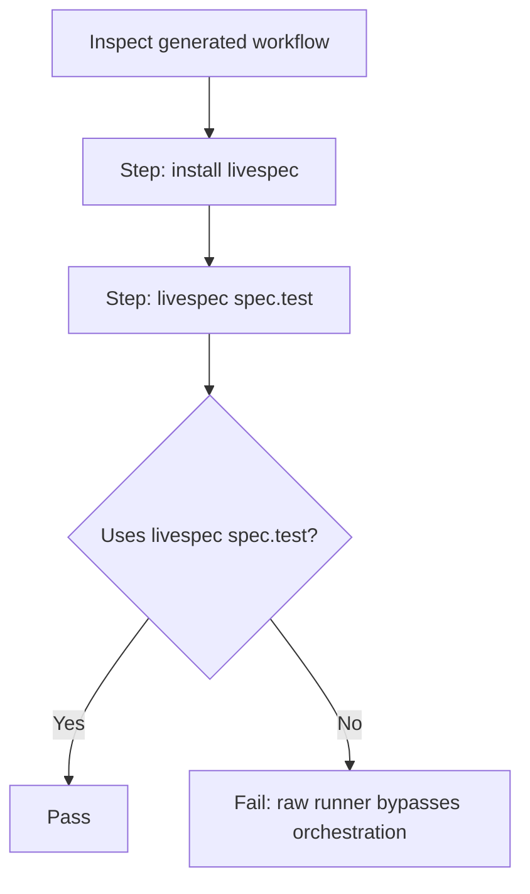

# Feature Spec: Conventions Propagation by Stack

- **Feature:** Conventions Propagation by Stack
- **Branch:** feature/026-conventions-propagation-by-stack
- **Date:** 2026-05-06
- **Status:** Draft
- **Priority:** P3
- **Scope:** M
- **Input:** When a user runs /spec.init on a new project, LiveSpec should automatically generate the test tooling configuration files (coverage gate config, snapshot library setup, CI workflow with test orchestration) appropriate for the detected stack. This propagates the driver system's knowledge into the project's actual configuration, not just the LiveSpec orchestration layer.
- **Feature Number:** 026
- **Deps:** 016, 017, 018, 019, 020, 021, 022

---

## User Scenarios & Testing

### Story 1 — /spec.init generates test config files for a TypeScript project `P2`

When a developer runs `/spec.init` on a TypeScript project, LiveSpec detects the TS/JS stack, generates a `vitest.config.ts` snippet with coverage thresholds configured, creates a `.github/workflows/test.yml` with coverage and snapshot steps, and documents the setup in the conventions.

**Priority reason:** Zero-config test setup is the ideal onboarding experience. The driver system knows what to configure — /spec.init should write it out.

**Independent test:** Run `/spec.init` on a clean TypeScript project; verify vitest coverage config and CI workflow are created.

```gherkin
Feature: Test config propagation at /spec.init
  Scenario: TypeScript project — vitest coverage config generated
    Given a TypeScript project with package.json
    And /spec.init is run
    When the TS/JS driver is detected
    Then LiveSpec generates vitest.config.ts coverage section with thresholds
    And generates .github/workflows/test.yml with coverage + snapshot steps
    And the generated config is documented in .conventions/

  Scenario: Python project — pytest-cov config generated
    Given a Python project with pyproject.toml
    And /spec.init is run
    When the Python driver is detected
    Then LiveSpec adds [tool.coverage.report] section to pyproject.toml (or generates pytest.ini)
    And generates .github/workflows/test.yml with pytest coverage step
    And suggests: "Run /spec.test to validate the generated config"

  Scenario: Unsupported stack — no config generated
    Given a project with an unsupported stack
    And /spec.init is run
    When no driver matches
    Then LiveSpec emits: "Test config not generated — stack not supported. Use livespec spec.driver --new <stack> to add a custom driver."
    And /spec.init completes normally
```

```mermaid
flowchart TD
    A[/spec.init] --> B[Detect stack via DriverRegistry]
    B --> C{Driver found?}
    C -- No --> D[Emit: no test config, suggest spec.driver --new]
    D --> E[Continue /spec.init normally]
    C -- Yes --> F[Load driver capabilities]
    F --> G[Generate coverage config for stack]
    G --> H[Generate CI workflow template]
    H --> I[Update .conventions/ with test strategy]
    I --> J[Print: generated files + /spec.test next step]
    J --> E
```

---

### Story 2 — Generated CI workflow runs LiveSpec test orchestration `P2`

The generated `.github/workflows/test.yml` calls `livespec spec.test` (not the raw test runner directly). This ensures the full driver orchestration runs in CI, including coverage gate and snapshot verification.

**Priority reason:** If the CI runs `pytest` directly, the LiveSpec driver layer is bypassed. The workflow must use `livespec spec.test` to get the full orchestration.

**Independent test:** Inspect generated CI workflow; verify it calls `livespec spec.test` not the raw runner command.

```gherkin
Feature: Generated CI calls livespec spec.test
  Scenario: Generated workflow uses livespec spec.test
    Given a Python project after /spec.init
    And a .github/workflows/test.yml has been generated
    When the workflow file is inspected
    Then it contains: run: livespec spec.test
    And not: run: pytest --cov

  Scenario: CI workflow installs LiveSpec before running
    Given the generated CI workflow
    When it is read
    Then it contains a step to install LiveSpec: pip install livespec-validator
    And the step runs before livespec spec.test
```



---

### Story 3 — Conventions document the test strategy for the stack `P3`

After `/spec.init`, the `.conventions/index.md` includes a `testing` domain that documents which tools are configured, what thresholds are set, and how to run tests locally.

**Priority reason:** Conventions are the documentation layer that AI tools (Claude Code) read before coding. Documenting the test strategy there ensures future `/spec.implement` runs are aware of the configured tools.

**Independent test:** Read `.conventions/index.md` after `/spec.init` on a TypeScript project; verify a `testing` domain is present with tool references.

```gherkin
Feature: Conventions reflect test strategy
  Scenario: testing domain added to conventions
    Given a TypeScript project after /spec.init
    When .conventions/index.md is read
    Then a testing domain entry exists
    And it references vitest (or detected runner)
    And it references the coverage threshold configured

  Scenario: conventions updated when driver changes
    Given a project with a Python driver
    When the developer adds a custom driver and runs /spec.refresh-conventions
    Then the testing domain in conventions is updated to reflect the new driver
```

```mermaid
flowchart TD
    A[/spec.init completes] --> B[Driver detected]
    B --> C[Load driver capabilities]
    C --> D[Generate testing domain entry for conventions]
    D --> E[Write to .conventions/index.md]
    E --> F[Entry: tools, thresholds, run commands]
```

---

## Acceptance Criteria

- **AC-001** — When `/spec.init` detects a supported stack, it generates a test configuration file appropriate for that stack (coverage gate config in the runner's config file).
- **AC-002** — When `/spec.init` detects an unsupported stack, it emits a one-line note and skips test config generation without blocking `/spec.init`.
- **AC-003** — Generated `.github/workflows/test.yml` calls `livespec spec.test` (not the raw runner) and includes a LiveSpec install step.
- **AC-004** — Generated coverage config sets a conservative default threshold: 70% for all new projects (configurable via `/spec.init` prompt or flag).
- **AC-005** — After `/spec.init`, a `testing` entry is added to `.conventions/index.md` documenting the detected tools and configured thresholds.
- **AC-006** — `/spec.refresh-conventions` updates the `testing` domain in conventions when the driver changes.
- **AC-007** — Generated files are listed in the `/spec.init` completion summary so the developer knows what was created.
- **AC-008** — The generated coverage config and CI workflow are minimal and valid — they must not break an existing project's configuration.

---

## Functional Requirements

- **FR-001** — Implement `generate_test_config(driver: DriverManifest, project_root: Path) -> list[GeneratedFile]` — returns list of files to create/patch per stack.
- **FR-002** — Implement per-stack config generators: `python_config_generator`, `typescript_config_generator`, `swift_config_generator`, etc. Each returns a minimal config snippet.
- **FR-003** — Implement `generate_ci_workflow(driver: DriverManifest) -> str` — returns a `.github/workflows/test.yml` content string with `livespec spec.test` as the test step.
- **FR-004** — Implement `update_conventions_testing_domain(driver, conventions_path)` — adds or updates the `testing` section in `.conventions/index.md`.
- **FR-005** — Integrate `generate_test_config` and `generate_ci_workflow` into the `/spec.init` pipeline (after stack detection, before completion summary).
- **FR-006** — Write unit tests for each config generator (snapshot the generated content per stack).
- **FR-007** — Write integration test: run `/spec.init` on a TypeScript fixture; verify vitest config and CI workflow are generated and valid.

---

## Key Entities

| Entity | Description |
|---|---|
| `GeneratedFile` | A file path + content to write during `/spec.init`. |
| Per-stack config generator | Function that returns the stack-specific coverage config snippet. |
| CI workflow template | GitHub Actions workflow calling `livespec spec.test`. |
| Testing conventions domain | Entry in `.conventions/index.md` for testing tools and thresholds. |

---

## Edge Cases

- **EC-001** — `vitest.config.ts` already exists: generator patches only the `coverage` section, does not overwrite the whole file.
- **EC-002** — `.github/workflows/test.yml` already exists: generator warns "CI workflow exists — skipping auto-generation. Add 'livespec spec.test' step manually." and does not overwrite.
- **EC-003** — Multiple stacks detected (polyglot): generate config for the primary stack only (the one with the most matched files).
- **EC-004** — Project has no `.github/` directory: generator creates it with the workflow file.

---

## Success Criteria

- **SC-001** — After `/spec.init` on a TypeScript fixture, `vitest.config.ts` has a valid coverage section and `.github/workflows/test.yml` exists.
- **SC-002** — Generated CI workflow is syntactically valid YAML.
- **SC-003** — The `testing` domain in conventions is readable by future AI tools without ambiguity about which test runner is configured.
- **SC-004** — Existing `vitest.config.ts` is patched (not overwritten) when `/spec.init` is run on a project that already has one.

---

*LiveSpec Feature 026 — Draft — 2026-05-06*
