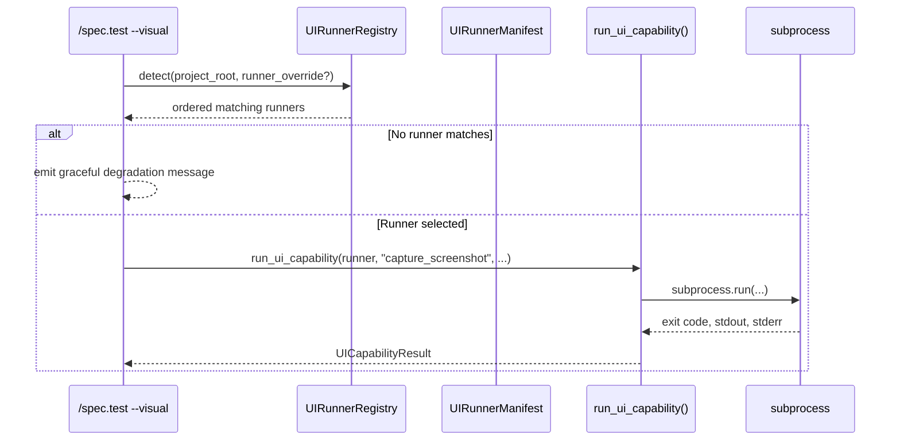

# Plan: UI Runner Architecture

- **Feature:** 027-ui-runner-architecture
- **Status:** Approved
- **Date:** 2026-05-07

---

## Summary

Add a manifest-driven UI runner layer so LiveSpec can detect a project surface, select the best matching runner, and execute visual-testing capabilities through one Python API.

The plan deliberately keeps runner definitions in YAML and keeps orchestration in Python:

1. `UIRunnerManifest` validates runner manifests.
2. `UIRunnerRegistry` loads built-in and project-local manifests and returns a deterministic match order.
3. `run_ui_capability()` executes one declared capability and normalizes the result shape for CLI callers.
4. `/spec.test --visual` uses the registry and executor instead of embedding runner-specific logic.

This feature is architecture-first. It should land the registry, executor, CLI wiring, and one built-in web runner without claiming support for future runners before their own feature work is complete.

---

## Technical Context

| Aspect | Choice | Reason |
|---|---|---|
| Language | Python | Validator core language |
| Manifest format | YAML + Pydantic | Human-editable config with strict validation |
| Execution model | `subprocess.run()` | Standard-library process control with timeouts |
| CLI framework | Typer | Existing command surface |
| Tests | pytest | Existing test runner |
| Runner locations | `livespec/ui-runners/` and `.specs/ui-runners/` | Built-in and project-local override points |

---

## Architecture

### Responsibilities

| Component | Responsibility |
|---|---|
| `UIRunnerManifest` | Validate one runner manifest and its capabilities |
| `UIRunnerRegistry` | Discover manifests, skip invalid entries with warnings, and sort matching runners |
| `run_ui_capability()` | Execute one capability and return a normalized result |
| `/spec.test --visual` | Resolve the active runner, run visual capabilities, and print a user-facing summary |

### Dispatch Flow

### Sorting Rules

`UIRunnerRegistry.detect()` should return matches ordered by:

1. Higher `priority` first.
2. Custom runners before built-in runners when priorities tie.
3. Alphabetical `name` ordering as the final stable tie-breaker.

---

## Implementation Files

| File | Action | Purpose |
|---|---|---|
| `validator/runners/schema.py` | Create | Pydantic models for the manifest schema |
| `validator/runners/registry.py` | Create | Manifest discovery and runner selection |
| `validator/runners/executor.py` | Create | Capability execution and result normalization |
| `validator/cli.py` | Modify | Register CLI surface changes if needed |
| `validator/commands/test.py` | Modify | Route `/spec.test --visual` through the runner layer |
| `livespec/ui-runners/web.yaml` | Create | First built-in reference runner for web projects |
| `tests/test_runner_schema.py` | Create | Schema validation tests |
| `tests/test_registry.py` | Create | Discovery, warning, and ordering tests |
| `tests/test_executor.py` | Create | Capability execution tests |
| `tests/integration/test_cli_visual.py` | Create | End-to-end CLI behavior tests |
| `.specs/spec-system.md` | Modify | Document the custom runner pattern |

---

## Implementation Steps

### Step 1 — Define the manifest schema

Create `UIRunnerManifest` and supporting models.

- Required fields: `name`, `detect.files`, `capabilities`
- Optional fields: `version`, `priority`, `infrastructure_requirements`
- Each capability must declare exactly one of `command` or `script`
- Invalid manifests are rejected during validation so the registry can warn and skip them

Acceptance covered: AC-001, AC-002, AC-009, AC-011

### Step 2 — Build the registry

Implement `UIRunnerRegistry` to load manifests from built-in and custom locations.

- Scan `livespec/ui-runners/*.yaml`
- Scan `.specs/ui-runners/*.yaml`
- Parse and validate each manifest
- Log a warning and skip malformed files instead of aborting registry initialization
- Expose `detect(project_root, runner_override=None)`

Acceptance covered: AC-003, AC-004, AC-008, AC-010

### Step 3 — Build the executor

Implement `run_ui_capability()` and `UICapabilityResult`.

- Return `not_implemented` when a capability is missing
- Execute declared commands with a timeout
- Resolve script paths without relying on `shell=True`
- Capture `stdout`, `stderr`, `exit_code`, and optional `output_path`

Acceptance covered: AC-005

### Step 4 — Wire the CLI

Update `/spec.test --visual` to use the registry and executor.

- Add `--runner=<name>` override
- Emit a graceful degradation message when no runner matches
- Keep YAML parsing out of CLI command code

Acceptance covered: AC-006, AC-007, AC-010

### Step 5 — Add the reference web runner

Create `livespec/ui-runners/web.yaml` as the first built-in implementation target.

- Detect Node + Playwright projects
- Declare visual capabilities needed by `/spec.test --visual`
- Keep any helper scripts under the built-in runner area rather than under `.specs/`, which is reserved for project-local custom runners

Acceptance covered: AC-003, AC-011, AC-012

### Step 6 — Document the pattern

Extend `.specs/spec-system.md` with:

- manifest field descriptions
- runner discovery and ordering rules
- graceful degradation behavior
- custom runner authoring guidance

Acceptance covered: AC-012

---

## Risks and Edge Cases

| Risk | Mitigation |
|---|---|
| Multiple runners match the same project | Deterministic ordering plus explicit `--runner` override |
| Malformed YAML blocks the whole registry | Warn and skip invalid manifests |
| Built-in runner needs helper scripts | Keep helper artifacts in built-in code paths, not project-local custom-runner paths |
| Unsupported project surface | Graceful degradation message with next steps and exit code 0 |
| Long-running subprocess hangs | Per-capability timeout with a failure result |

---

## Planned Verification Commands

| Action | Command | Status |
|---|---|---|
| Schema tests | `pytest tests/test_runner_schema.py -v` | Pending |
| Registry tests | `pytest tests/test_registry.py -v` | Pending |
| Executor tests | `pytest tests/test_executor.py -v` | Pending |
| CLI integration | `pytest tests/integration/test_cli_visual.py -v -m level_3a` | Pending |
| Full test sweep | `pytest tests/ -v` | Pending |

---

## Acceptance Criteria Coverage

| AC | Planned Step |
|---|---|
| AC-001 | Step 1 |
| AC-002 | Step 1 |
| AC-003 | Steps 2 and 5 |
| AC-004 | Step 2 |
| AC-005 | Step 3 |
| AC-006 | Step 4 |
| AC-007 | Step 4 |
| AC-008 | Step 2 |
| AC-009 | Step 1 |
| AC-010 | Steps 2 and 4 |
| AC-011 | Steps 1 and 5 |
| AC-012 | Steps 5 and 6 |

---

## Exit Criteria

This feature is ready to move from planning to implementation when:

- the registry, executor, and CLI surfaces are implemented in code
- the web runner manifest is present and valid
- the listed pytest commands pass
- the feature docs no longer claim completion before the code and tests exist

---

*LiveSpec Plan 027 — 2026-05-07*
