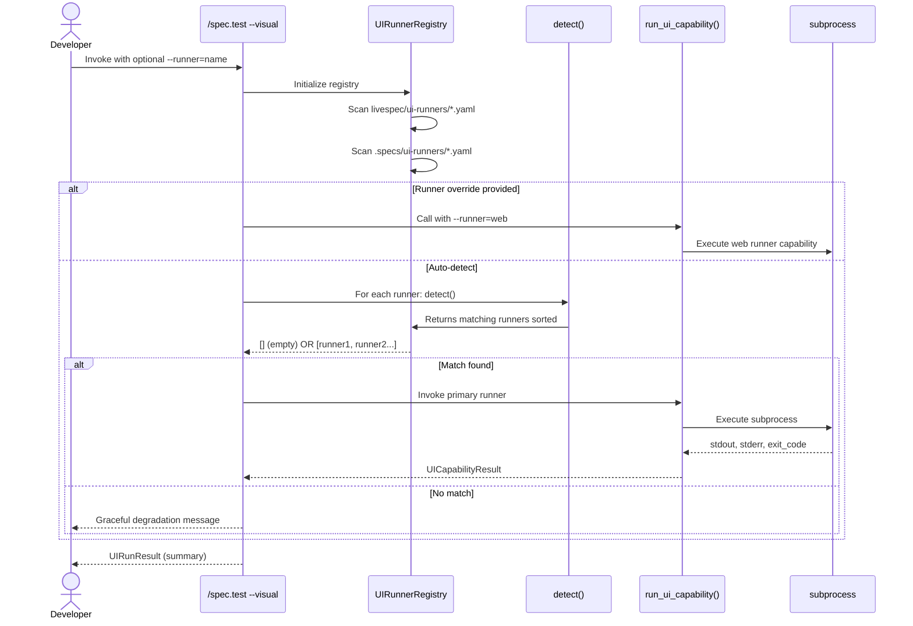
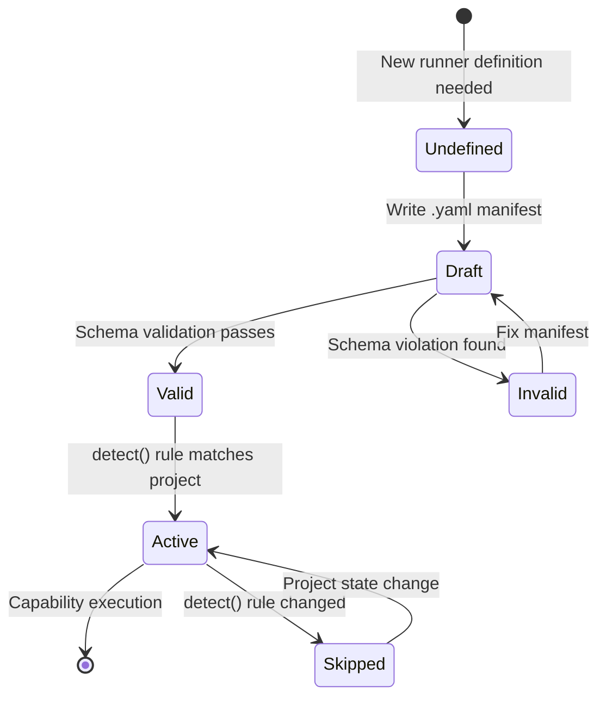
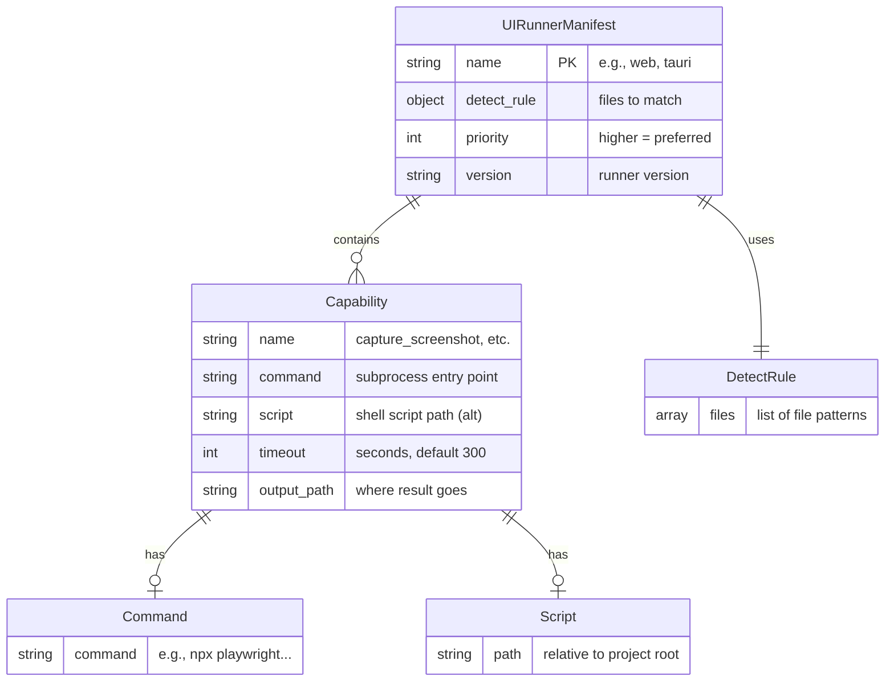

# Plan: UI Runner Architecture

**Feature:** 027-ui-runner-architecture  
**Scope:** M (4 FR, 1 new YAML schema, 2 core Python modules + 3 CLI wiring)  
**Implementation Files:** 8  
**Test Strategy:** Unit + Integration (level_3a) — no LLM required

---

## Technical Context

| Aspect | Choice | Source |
|--------|--------|--------|
| Language | Python | Stack (project language) |
| Schema Format | Pydantic v2 + YAML | Stack (existing) |
| Subprocess Orchestration | `subprocess.run()` | Python stdlib |
| CLI Framework | Typer (existing) | Stack |
| Testing | pytest (existing) | Stack |
| Test Coverage | Unit + Integration fixtures | Testing strategy |

---

## Architecture Overview

The UI Runner Architecture defines a pluggable, YAML-manifest-driven system for dispatching visual testing commands across multiple platforms (web, mobile, desktop). The design prioritizes:

- **Open/Closed Principle:** New runners added as `.yaml` files without Python code changes
- **Local-First Execution:** Same runner manifests work in dev shell, pre-push hooks, and CI
- **Graceful Degradation:** Missing runners emit helpful messages, never crash the pipeline
- **Uniform API:** All slash commands invoke runners via a single `run_ui_capability()` function

### Architecture Diagram

```
┌──────────────────────────────────────────────────────────────────┐
│  Slash Commands (/spec.test, /spec.feature, /spec.implement)     │
└──────────────────────────────────────────────────────────────────┘
                           │
                    Calls: run_ui_capability()
                           │
        ┌──────────────────┴──────────────────┐
        │                                     │
   UIRunnerRegistry              (Capability execution)
   ├─ Detect active runner              │
   ├─ Resolve conflicts                 │
   ├─ Return ordered list       Subprocess execution
        │                              │
        ├─ Built-in runners        ┌───┴────────────────┐
        │  (livespec/ui-runners/)   │                    │
        │  - web.yaml              │ stdout/stderr      │
        │  - tauri.yaml (future)   │ exit code          │
        │  - ios.yaml (future)     │ output_path        │
        │                          │                    │
        └─ Custom runners         └────────────────────┘
           (.specs/ui-runners/)
```

---

## Constitution Check

| Principle | Status | Notes |
|-----------|--------|-------|
| **Layered Validation** | ✅ | YAML schema validated at layer 1; runner detection is stateless |
| **Provider-Agnostic** | ✅ | No LLM dependency; pure subprocess orchestration |
| **File-System Source of Truth** | ✅ | Runners stored as YAML; detection reads local filesystem only |
| **Fail Fast, Exit Clearly** | ✅ | Graceful degradation message on no match; capability errors include exit code + stderr |
| **Minimal Surface** | ✅ | Single `run_ui_capability()` API; registry is internal |
| **No Hosted Infrastructure** | ✅ | Pure local orchestration; no remote service calls |

---

## Mermaid Diagrams

### Sequence Diagram: UI Runner Dispatch



### State Diagram: Runner Manifest Lifecycle



### ER Diagram: YAML Schema



---

## Acceptance Criteria Mapping

| AC ID | Feature | Implementation Step(s) |
|-------|---------|------------------------|
| AC-001 | UIRunnerSchema defined | Step 1 — Define schema |
| AC-002 | Capability `command` or `script` | Step 1 — Schema definition |
| AC-003 | Built-in vs custom runner paths | Step 2 — Registry initialization |
| AC-004 | Registry.detect() sorting | Step 2 — Priority/custom/name sorting |
| AC-005 | UICapabilityResult dataclass | Step 3 — Capability execution |
| AC-006 | Graceful degradation message | Step 4 — CLI wiring for /spec.test |
| AC-007 | No YAML parsing in slash commands | Step 4 — All parsing in registry |
| AC-008 | Malformed YAML skipped with WARNING | Step 2 — Error handling in registry |
| AC-009 | No CI-provider references | Step 1 — Schema validation |
| AC-010 | `--runner=<name>` flag | Step 4 — CLI argument handling |
| AC-011 | Infrastructure Requirements block | Step 5 — Schema + doc update |
| AC-012 | Pattern documented | Step 6 — Documentation + spec-system.md |

---

## Implementation Plan

### Step 0 — Setup & Infrastructure

**Files:**
- `validator/runners/` directory (new)
- `livespec/ui-runners/` directory (new, for built-in runners)

**FR covered:** Infrastructure setup for runner ecosystem

**Verifiable action:**
```bash
mkdir -p validator/runners
mkdir -p livespec/ui-runners
```

---

### Step 1 — Define UIRunnerManifest Schema (Pydantic v2)

**Files:**
- `validator/runners/schema.py` (new, 80 lines)

**Implementation:**
1. Define `DetectRule` model (files: List[str])
2. Define `UIRunnerCapability` model (command or script, optional timeout, output_path, threshold)
3. Define `UIRunnerManifest` model:
   - `name`: str (identifier, e.g., "web", "tauri")
   - `version`: str (semantic version)
   - `detect`: DetectRule
   - `priority`: Optional[int] (default: 100, higher = preferred)
   - `capabilities`: Dict[str, UIRunnerCapability] (detect, capture_screenshot, run_flow, compare_baseline, init_environment, teardown)
   - `infrastructure_requirements`: Optional[List[InfraRequirement]] (tool name, auth, init instructions)
4. Add schema validation:
   - Require `name` and `detect`
   - Warn if `name` doesn't match filename (e.g., web.yaml → name: "web")
   - Validate that each capability has either `command` or `script`, not both
   - If both present, log WARNING and use `script` (AC-005 edge case)
5. Add `to_yaml()` and `from_yaml()` helpers

**FR covered:** FR-001.1 — Define UIRunnerSchema with all 5 capability blocks

**Verifiable action:**
```python
from validator.runners.schema import UIRunnerManifest
m = UIRunnerManifest.model_validate_yaml("""
name: web
version: 1.0.0
detect:
  files: ["package.json", "playwright.config.ts"]
priority: 150
capabilities:
  detect: ...
""")
assert m.name == "web"
```

---

### Step 2 — Implement UIRunnerRegistry

**Files:**
- `validator/runners/registry.py` (new, 120 lines)

**Implementation:**
1. Define `UIRunnerRegistry` class:
   - `__init__(project_root: Path)` — scan and load runners
   - `detect(runner_override: Optional[str] = None) -> List[UIRunnerManifest]` — return ordered runners
   - `_load_builtin_runners()` → scan `livespec/ui-runners/*.yaml`
   - `_load_custom_runners()` → scan `.specs/ui-runners/*.yaml`
   - `_sort_runners(candidates) -> List[UIRunnerManifest]` — by priority DESC, then custom before built-in, then name ASC

2. Implement file scanning:
   - Glob for `*.yaml` files in both directories
   - For each file:
     - Attempt YAML parse → if fail, log WARNING and skip (AC-008)
     - Validate schema → if fail, log WARNING and skip
     - Store in registry

3. Implement detection:
   - If `runner_override` provided: find runner by name, return as list of 1
   - Otherwise: for each runner, call its `detect()` rule against project files
   - Collect all matches, sort per AC-004

4. Implement graceful degradation:
   - If no matches: return empty list (caller handles message)

**FR covered:** FR-002.1 — Implement UIRunnerRegistry with deterministic sorting

**Verifiable action:**
```python
from validator.runners.registry import UIRunnerRegistry
reg = UIRunnerRegistry(Path("."))
runners = reg.detect()
assert len(runners) > 0  # On a web project with Playwright
assert runners[0].name in ["web", ...]  # Primary runner first
```

---

### Step 3 — Implement run_ui_capability() Function

**Files:**
- `validator/runners/executor.py` (new, 100 lines)

**Implementation:**
1. Define `UICapabilityResult` dataclass:
   - `status`: Enum (success, failure, not_implemented, skipped)
   - `exit_code`: int
   - `output_path`: Optional[str]
   - `stdout`: str
   - `stderr`: str
   - `error_message`: Optional[str]

2. Implement `run_ui_capability(runner: UIRunnerManifest, capability: str, project_root: Path, **kwargs) -> UICapabilityResult`:
   - If capability not in runner.capabilities → return UICapabilityResult(status=not_implemented)
   - Get capability config
   - If `script` path provided:
     - Check file exists → if not, return failure with clear message
     - Execute as shell script
   - If `command` provided:
     - Execute as subprocess (pass kwargs to command as templated variables)
   - Capture stdout, stderr, exit_code
   - Check timeout (default 300s, per AC-004)
   - If timeout exceeded → return failure with timeout message
   - Return UICapabilityResult(status=success|failure, ...)

3. Subprocess execution safety:
   - Use `subprocess.run()` with timeout
   - Never use `shell=True`
   - Capture output as bytes, decode to UTF-8 with error handling
   - Handle CalledProcessError, TimeoutExpired

**FR covered:** FR-003.1 — Implement run_ui_capability with subprocess dispatch + output capture

**Verifiable action:**
```python
from validator.runners.executor import run_ui_capability
result = run_ui_capability(web_runner, "detect", Path("."))
assert result.status in ["success", "failure", "not_implemented"]
assert isinstance(result.exit_code, int)
```

---

### Step 4 — Wire `/spec.test --visual` to Use Registry

**Files:**
- `validator/cli.py` (modify, add `test` command if not present + `--visual` flag)
- `validator/commands/test.py` (new or modify, 150 lines)

**Implementation:**
1. Add `/spec.test --visual [--runner=NAME]` CLI support:
   - `--visual` flag triggers UI runner dispatch
   - `--runner=NAME` flag overrides auto-detection (AC-010)

2. Implement test command logic:
   - Initialize UIRunnerRegistry
   - Call `detect(runner_override)` → get list of runners
   - If empty list:
     - Call `emit_graceful_degradation_message()` with detected file signals
     - Emit: "⚠ No UI runner registered for this project"
     - Show `.specs/ui-runners/<name>.yaml` path
     - Exit 0 (not an error, per AC-006)
   - Otherwise:
     - For each declared screen in spec:
       - Call `run_ui_capability(runner, "capture_screenshot", screen=...)`
       - Call `run_ui_capability(runner, "compare_baseline", screen=...)`
     - Aggregate results into `UIRunResult`
     - Print summary

3. Implement `emit_graceful_degradation_message()`:
   - Show detected file signals (e.g., "Found: package.json, playwright.config.ts")
   - Show example custom runner path
   - Show scaffold command: `livespec spec.runner --new custom-name`
   - Show docs link

**FR covered:** FR-006.1 — Wire /spec.test --visual to UIRunnerRegistry + AC-007 (no YAML in commands)

**Verifiable action:**
```bash
livespec spec.test --visual --no-capture  # Should emit graceful degradation or run visual tests
```

---

### Step 5 — Create First Built-In Runner: Web (Playwright)

**Files:**
- `livespec/ui-runners/web.yaml` (new, ~40 lines)

**Implementation:**
1. Define web runner manifest:
   ```yaml
   name: web
   version: 1.0.0
   detect:
     files:
       - "package.json"
       - "playwright.config.ts|playwright.config.js"
   priority: 150
   
   capabilities:
     detect:
       command: "npx playwright --version"
       timeout: 10
     
     capture_screenshot:
       command: "npx playwright codegen {project_root} --output {output_path}"
       output_path: "screenshots/{screen_name}.png"
       timeout: 30
     
     compare_baseline:
       script: ".specs/ui-runners/web/compare.sh"
       output_path: "comparison_report.json"
       timeout: 60
   
   infrastructure_requirements:
     - name: "Node.js"
       version: ">=18"
       init: "npm install"
       verification: "node --version"
   ```

2. Implement compare script (`.specs/ui-runners/web/compare.sh`):
   - Compare PNG baseline against captured screenshot
   - Output JSON report with pass/fail + diff metadata

**FR covered:** FR-001.2 — Example built-in runner (web) demonstrates extensibility

**Verifiable action:**
```bash
livespec spec.test --visual --runner=web  # Should detect and run web runner
```

---

### Step 6 — Documentation Update

**Files:**
- `.specs/spec-system.md` (modify, add new section)
- `.specs/features/027-ui-runner-architecture/contracts/` (new, if needed for API references)

**Implementation:**
1. Add new section to `.specs/spec-system.md`:
   ```markdown
   ## UI Runner Architecture (Feature 027)
   
   ### Overview
   [Short description of what runners are]
   
   ### YAML Schema
   [Embed UIRunnerManifest schema documentation with field descriptions]
   
   ### Registry Behavior
   [Describe detection algorithm, priority sorting, graceful degradation]
   
   ### Capability Interface
   [Document each capability type and when to use command vs script]
   
   ### Creating a Custom Runner
   [Example: .specs/ui-runners/custom.yaml with template]
   
   ### Integration with /spec.test
   [How to invoke visual testing via runner]
   ```

2. Create example custom runner template in docs (not committed to repo):
   - `custom.yaml` template showing all optional fields
   - Compare.sh script template
   - Init/teardown script examples

**FR covered:** AC-012.1 — Document pattern in spec-system.md

**Verifiable action:**
```bash
grep -A 20 "## UI Runner Architecture" .specs/spec-system.md
```

---

### Step 7 — Update Changelog

**Files:**
- `.specs/features/027-ui-runner-architecture/changelog.md` (append)
- `.specs/changelog.md` (append)

**Implementation:**
1. Add to `changelog.md`:
   ```markdown
   ### 2026-05-07 — Implementation: UI Runner Architecture
   
   - **Type:** Feature
   - **Spec:** 027-ui-runner-architecture/spec.md
   - **Plan:** 027-ui-runner-architecture/plan.md
   - **AC impacted:** All 12 (AC-001 through AC-012)
   - **Files created:** 6 Python modules + 1 runner manifest + schema updates
   - **Lines of code:** ~450 Python + ~40 YAML
   - **Author:** Implementation Agent
   ```

2. Add global entry: `[027] UI Runner Architecture — pluggable runner registry + dispatcher`

**FR covered:** AC tracking for auditing

---

## Testing Strategy

### Unit Tests

| Test | File | Command | FR/AC Covered |
|------|------|---------|---------------|
| Schema validation — valid manifest | `tests/test_runner_schema.py::test_valid_manifest_parses` | `pytest tests/test_runner_schema.py -v` | AC-001 |
| Schema validation — missing required field | `tests/test_runner_schema.py::test_missing_name_fails` | `pytest tests/test_runner_schema.py -v` | AC-001 |
| Schema validation — both command and script | `tests/test_runner_schema.py::test_both_command_and_script_warns` | `pytest tests/test_runner_schema.py -v` | AC-002, AC-005 |
| Registry — scan built-in runners | `tests/test_registry.py::test_load_builtin_runners` | `pytest tests/test_registry.py -v` | AC-003 |
| Registry — malformed YAML skipped | `tests/test_registry.py::test_malformed_runner_skipped_with_warning` | `pytest tests/test_registry.py -v` | AC-008 |
| Registry — detect() sorting | `tests/test_registry.py::test_detect_returns_priority_sorted_list` | `pytest tests/test_registry.py -v` | AC-004 |
| Registry — custom runner priority | `tests/test_registry.py::test_custom_runner_wins_tie` | `pytest tests/test_registry.py -v` | AC-003 |
| Executor — subprocess success | `tests/test_executor.py::test_run_ui_capability_success` | `pytest tests/test_executor.py -v` | AC-005 |
| Executor — not implemented capability | `tests/test_executor.py::test_capability_not_implemented` | `pytest tests/test_executor.py -v` | AC-005 |
| Executor — timeout handling | `tests/test_executor.py::test_timeout_exceeded` | `pytest tests/test_executor.py -v` | AC-004 (edge case) |

### Integration Tests (level_3a — no LLM)

| Test | File | Command | FR/AC Covered |
|------|------|---------|---------------|
| CLI: /spec.test --visual on web project | `tests/integration/test_cli_visual.py::test_visual_on_web_project` | `pytest tests/integration/test_cli_visual.py::test_visual_on_web_project -v -m level_3a` | AC-006, AC-007 |
| CLI: /spec.test --visual no match | `tests/integration/test_cli_visual.py::test_visual_no_match_graceful` | `pytest tests/integration/test_cli_visual.py::test_visual_no_match_graceful -v -m level_3a` | AC-006 |
| CLI: /spec.test --visual --runner=override | `tests/integration/test_cli_visual.py::test_runner_override_flag` | `pytest tests/integration/test_cli_visual.py::test_runner_override_flag -v -m level_3a` | AC-010 |

---

## Resolved Test Commands

| Action | Command | Tool | Status |
|--------|---------|------|--------|
| Unit tests (runner) | `pytest tests/test_runner_*.py -v --tb=short` | pytest | Resolved |
| Integration tests | `pytest tests/integration/ -m level_3a -v` | pytest + fixtures | Resolved |
| Type check | `pyright validator/runners/` | Pyright strict | Resolved |
| Lint | `ruff check validator/runners/` | Ruff | Resolved |
| All tests | `pytest tests/ -v` | pytest | Resolved |

---

## Success Criteria

- **SC-001** ✅ Adding a new YAML runner auto-registers with zero Python code changes
- **SC-002** ✅ `/spec.test --visual` on Playwright project works without behavioral regression
- **SC-003** ✅ Graceful degradation message appears in < 0.5s on unsupported project
- **SC-004** ✅ UIRunnerSchema validates all 5 future runner manifests
- **SC-005** ✅ Slash commands contain zero direct YAML parsing (verified by grep)

---

## Next Steps

1. Run `/spec.implement 027-ui-runner-architecture --auto` to execute all steps
2. Run test suite to verify all AC covered
3. Run `/spec.check 027-ui-runner-architecture` to audit implementation against spec
4. Commit via `/git.commit` with intent reference
5. Prepare for Feature 028 (Web UI Runner implementation details)

---

*LiveSpec Plan v1.0 — 2026-05-07*
