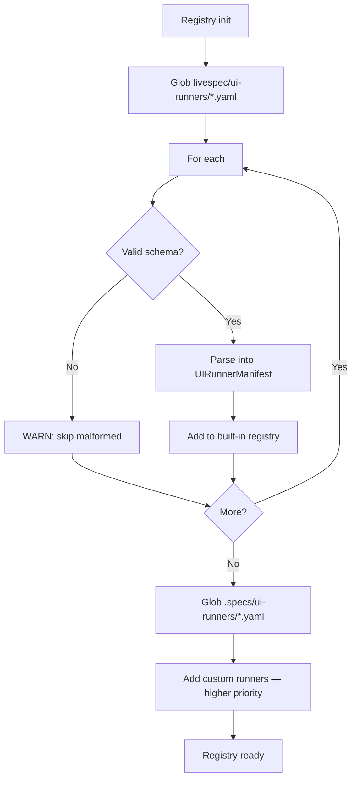
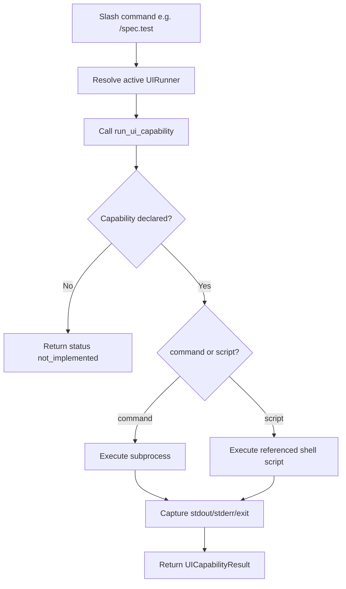
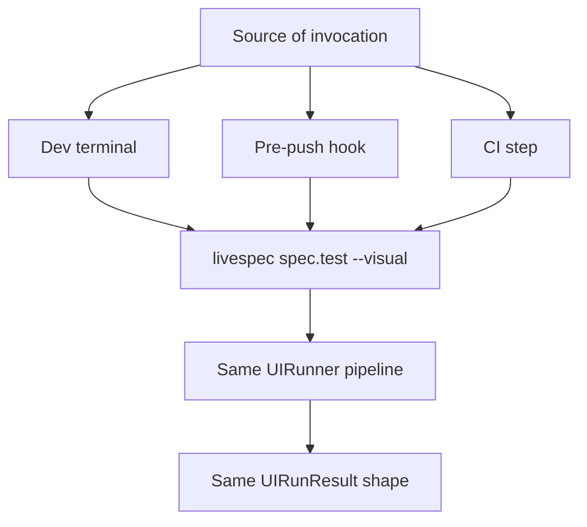

# Feature Spec: UI Runner Architecture

- **Feature:** UI Runner Architecture
- **Branch:** feature/027-ui-runner-architecture
- **Date:** 2026-05-06
- **Status:** Draft
- **Priority:** P1
- **Scope:** M
- **Input:** Cross-platform visual UI testing system, parallel to the driver system (Feature 016) but distinct from it. Defines a YAML manifest format for UI runners (one per platform/surface), exposing capabilities: detect, capture_screenshot, run_flow, compare_baseline. Local-first design — runs identically in dev shell and CI. Builds on the existing Feature 010 (Visual Testing Complete) which becomes the first runner of this pattern (web/Playwright). Extensible: Tauri (029), iOS/watchOS (030), Android (031), and future platforms register through the same interface.
- **Feature Number:** 027
- **Deps:** 010

---

## User Scenarios & Testing

### Story 1 — Developer runs visual tests on a project with a configured UI runner `P1`

A developer with a project that has a UI runner configured (web, mobile, desktop) runs `/spec.test --visual`. LiveSpec detects the platform via the runner's `detect` rule, executes capture/flow/baseline-compare capabilities, and reports a structured summary.

**Priority reason:** Core orchestration. Without this layer, every UI runner would reinvent its own dispatch logic.

**Independent test:** Run `/spec.test --visual` on a fixture project with the web UI runner installed; verify capture and baseline compare execute and produce a structured report.

```gherkin
Feature: UI runner dispatch
  Scenario: Web runner detected and visual tests run
    Given a project with a package.json and Playwright config
    And the built-in web UI runner is registered
    When the developer runs /spec.test --visual
    Then LiveSpec detects the web runner via its detect rule
    And executes capture_screenshot for each declared screen
    And executes compare_baseline against .specs/design/screens
    And returns a UIRunResult with passed/failed/missing per screen

  Scenario: No UI runner matches — graceful degradation
    Given a project where no built-in UI runner detects a match
    And no custom UI runner exists in .specs/ui-runners/
    When the developer runs /spec.test --visual
    Then LiveSpec emits "⚠ No UI runner registered for this project"
    And lists the detected file signals
    And shows the path .specs/ui-runners/<name>.yaml for custom runners
    And exits with code 0 (degraded, not blocked)

  Scenario: Multiple UI runners detected — primary picked
    Given a polyglot project with both web (Playwright) and Tauri runners detected
    When the developer runs /spec.test --visual
    Then LiveSpec uses the runner with the highest priority match
    And reports the chosen runner name
    And the developer can override via --runner=<name>
```

```mermaid
flowchart TD
    A[/spec.test --visual] --> B[Initialize UIRunnerRegistry]
    B --> C[Scan livespec/ui-runners/*.yaml]
    C --> D[Scan .specs/ui-runners/*.yaml]
    D --> E[For each runner: detect()]
    E --> F{Match?}
    F -- No --> G[Skip]
    F -- Yes --> H[Add to candidates]
    G --> I{More?}
    H --> I
    I -- Yes --> E
    I -- No --> J{Any candidates?}
    J -- No --> K[Emit graceful degradation]
    J -- Yes --> L[Pick primary runner]
    L --> M[Execute capabilities: capture, run_flow, compare_baseline]
    M --> N[Aggregate UIRunResult]
    N --> O[Print summary]
    K --> P[Exit 0]
    O --> P
```

---

### Story 2 — LiveSpec maintainer adds a new built-in UI runner `P1`

A contributor adds a new built-in UI runner (e.g., Flutter) by writing `livespec/ui-runners/flutter.yaml`. No core Python changes required — the runner is auto-discovered.

**Priority reason:** Open/closed extensibility. The architecture must support adding platforms without modifying core dispatch code.

**Independent test:** Add a minimal `flutter.yaml` to `livespec/ui-runners/`; verify it appears in the registry and its detect rule is evaluated.

```gherkin
Feature: UI runner extensibility — add built-in without core changes
  Scenario: New YAML runner auto-discovered
    Given a file livespec/ui-runners/flutter.yaml exists with valid schema
    When the UIRunnerRegistry initializes
    Then the Flutter runner appears in the registry
    And detect() returns True for a project with pubspec.yaml + flutter dep

  Scenario: Invalid runner YAML is skipped — registry continues
    Given a malformed YAML at livespec/ui-runners/broken.yaml
    When the registry initializes
    Then a WARNING is logged: "Skipping malformed UI runner: broken.yaml"
    And other valid runners load normally
```



---

### Story 3 — Capabilities expose a uniform interface to slash commands `P1`

`/spec.test`, `/spec.feature`, `/spec.implement`, and `/spec.fix` all invoke the active UI runner via a single Python API: `run_ui_capability(runner, capability, **kwargs)`. No slash command parses the YAML directly.

**Priority reason:** Central orchestration prevents YAML parsing duplication and keeps the API stable as the runner format evolves.

**Independent test:** Call `run_ui_capability()` from a unit test with a fixture runner; verify the correct subprocess is dispatched and a `UICapabilityResult` is returned.

```gherkin
Feature: Uniform capability interface
  Scenario: Slash commands invoke runners through one API
    Given any runner is active and any slash command needs visual orchestration
    When the slash command calls run_ui_capability(runner, "capture_screenshot", screen="dashboard")
    Then the runner's capture_screenshot command is executed as a subprocess
    And the result is returned as UICapabilityResult(exit_code, output_path, stdout, stderr)
    And no YAML is parsed inside the slash command

  Scenario: Capability not implemented — clean error
    Given a runner that does not declare a run_flow capability
    When run_ui_capability(runner, "run_flow") is called
    Then it returns a UICapabilityResult with status="not_implemented"
    And does not raise
```



---

### Story 4 — Local-first execution with no CI dependency `P2`

The same runner manifest works identically in `livespec spec.test --visual` invoked from the dev terminal, from a pre-push hook (Feature 032), or from a CI workflow. No CI-specific configuration in the runner manifest itself.

**Priority reason:** Local-first is a core LiveSpec value. The architecture must avoid coupling to GitHub Actions or any specific CI provider.

**Independent test:** Execute the same runner command in three contexts (dev shell, pre-push hook simulation, CI runner) and verify identical behavior.

```gherkin
Feature: Local-first runner execution
  Scenario: Same runner works in dev shell
    Given a developer runs /spec.test --visual from their terminal
    When the runner executes
    Then capabilities run on the local machine
    And no GitHub Actions config is referenced

  Scenario: Same runner works in pre-push hook
    Given a pre-push hook runs livespec spec.test --visual
    When the runner executes
    Then it behaves identically to the dev shell invocation
    And no environment-specific branching is needed

  Scenario: Runner does not reference CI providers
    Given any UI runner manifest YAML
    When inspected
    Then it contains no references to github actions, gitlab ci, or any specific provider
```



---

## Acceptance Criteria

- **AC-001** — A `UIRunnerSchema` (Pydantic) defines the YAML manifest with fields: `name`, `detect.files`, optional capabilities `capture_screenshot`, `run_flow`, `compare_baseline`, `init_environment`, `teardown`.
- **AC-002** — Each capability accepts either `command:` (subprocess) or `script:` (path to a shell script — escape hatch).
- **AC-003** — Built-in runners live in `livespec/ui-runners/*.yaml`. Custom runners live in `.specs/ui-runners/*.yaml`. Custom runners take priority on detect match.
- **AC-004** — `UIRunnerRegistry.detect(project_root)` returns an ordered list of matching runners (custom first, then alphabetical). Empty list = graceful degradation message.
- **AC-005** — `run_ui_capability(runner, capability, **kwargs)` returns a `UICapabilityResult` dataclass with `status` (`success` | `failure` | `not_implemented` | `skipped`), `exit_code`, `output_path`, `stdout`, `stderr`.
- **AC-006** — Graceful degradation message format mirrors Feature 016 driver degradation: detected file signals, custom runner path (`.specs/ui-runners/<name>.yaml`), scaffold command (`livespec spec.runner --new <name>`), link to docs.
- **AC-007** — Slash commands (`/spec.test`, `/spec.feature`, `/spec.implement`, `/spec.fix`) invoke runners exclusively through `run_ui_capability` — no YAML parsing in command files.
- **AC-008** — Malformed runner YAML is skipped with a WARNING; the rest of the registry loads normally (no hard failure).
- **AC-009** — The runner manifest contains no CI-provider references. CI workflows reference `livespec spec.test --visual` as the entry point, never the manifest directly.
- **AC-010** — A `--runner=<name>` flag on `/spec.test --visual` overrides automatic detection and forces a specific runner.
- **AC-011** — Each runner manifest declares an "Infrastructure Requirements" block listing required tools/auth/init for `/spec.preflight` integration.
- **AC-012** — The pattern is documented in `.specs/spec-system.md` (or a dedicated reference) including: schema, capability semantics, registry lookup, scaffold command.

---

## Functional Requirements

- **FR-001** — Define `UIRunnerSchema` Pydantic model with all 5 capability blocks and detect rule.
- **FR-002** — Implement `UIRunnerRegistry`: scan `livespec/ui-runners/` then `.specs/ui-runners/`, validate YAML, return ordered registry.
- **FR-003** — Implement `run_ui_capability(runner: UIRunnerManifest, capability: str, **kwargs) -> UICapabilityResult`: subprocess execution, output capture, structured result.
- **FR-004** — Implement graceful degradation handler when registry returns empty for a project.
- **FR-005** — Implement `UICapabilityResult` dataclass with status enum, exit_code, paths, stdout/stderr.
- **FR-006** — Wire `/spec.test --visual` to call `UIRunnerRegistry.detect()` and dispatch each declared screen/flow through `run_ui_capability`.
- **FR-007** — Implement `--runner=<name>` flag to override auto-detection.
- **FR-008** — Document the pattern in `.specs/spec-system.md` with schema reference, examples, and integration notes.

---

## Key Entities

| Entity | Description |
|---|---|
| `UIRunnerManifest` | Parsed YAML manifest defining a platform's visual testing capabilities. |
| `UIRunnerCapability` | Single capability block with `command:` or `script:`, optional `output_path`, optional `threshold`. |
| `UICapabilityResult` | Result of executing one capability: status, exit_code, output_path, stdout, stderr. |
| `UIRunnerRegistry` | Ordered list of UIRunnerManifest, custom + built-in. |
| `UIRunResult` | Aggregated results of a full `/spec.test --visual` run across all capabilities. |

---

## Infrastructure Requirements

This feature itself has no external tooling requirement — it is the dispatcher. Each concrete UI runner (028-031) declares its own preflight tooling.

| Resource | Type | Provider | Environment | When |
|---|---|---|---|---|
| (none — pure orchestration) | — | — | — | — |

---

## Edge Cases

- **EC-001** — Project has both a built-in and custom runner with the same `name`: custom wins, no error.
- **EC-002** — Multiple matching runners (e.g., Tauri detects via Cargo.toml + Web detects via package.json): primary chosen by `priority` field if present, otherwise first match in the custom > built-in order.
- **EC-003** — `script:` path points to a non-existent file: capability fails with status `failure` and a clear message; does not crash the runner.
- **EC-004** — Capability subprocess takes too long: timeout is configurable per capability (default: 5 minutes); exceeded → status `failure` with timeout reason.
- **EC-005** — Runner YAML uses both `command:` and `script:` in the same capability block: `script:` takes priority, WARNING logged.

---

## Success Criteria

- **SC-001** — Adding a new YAML to `livespec/ui-runners/` auto-registers the runner with zero Python code changes.
- **SC-002** — `/spec.test --visual` on a Playwright project (existing Feature 010) works through the new architecture without behavioral regression.
- **SC-003** — Graceful degradation message appears in < 0.5s on an unsupported project.
- **SC-004** — UIRunnerSchema validates correctly all 5 future runner manifests (web, Tauri, iOS, Android, plus a custom test fixture).
- **SC-005** — Slash commands contain zero direct YAML parsing of runner manifests (verified by codebase scan).

---

*LiveSpec Feature 027 — Draft — 2026-05-06*
