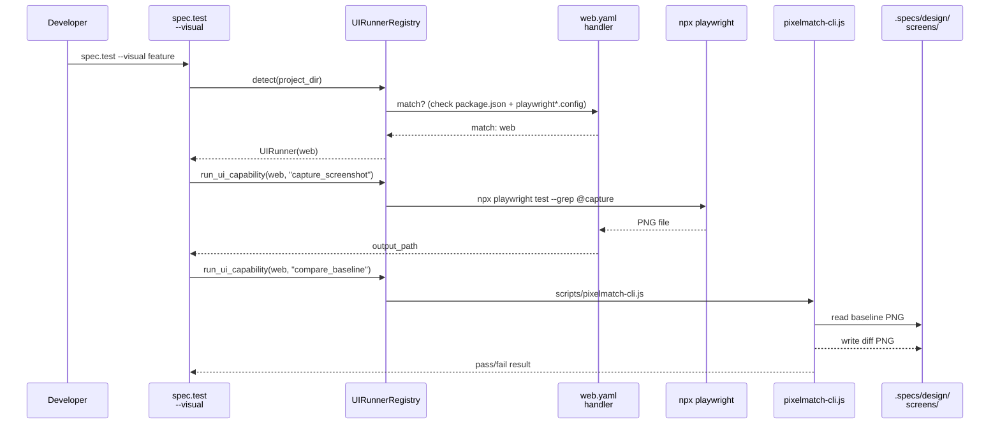
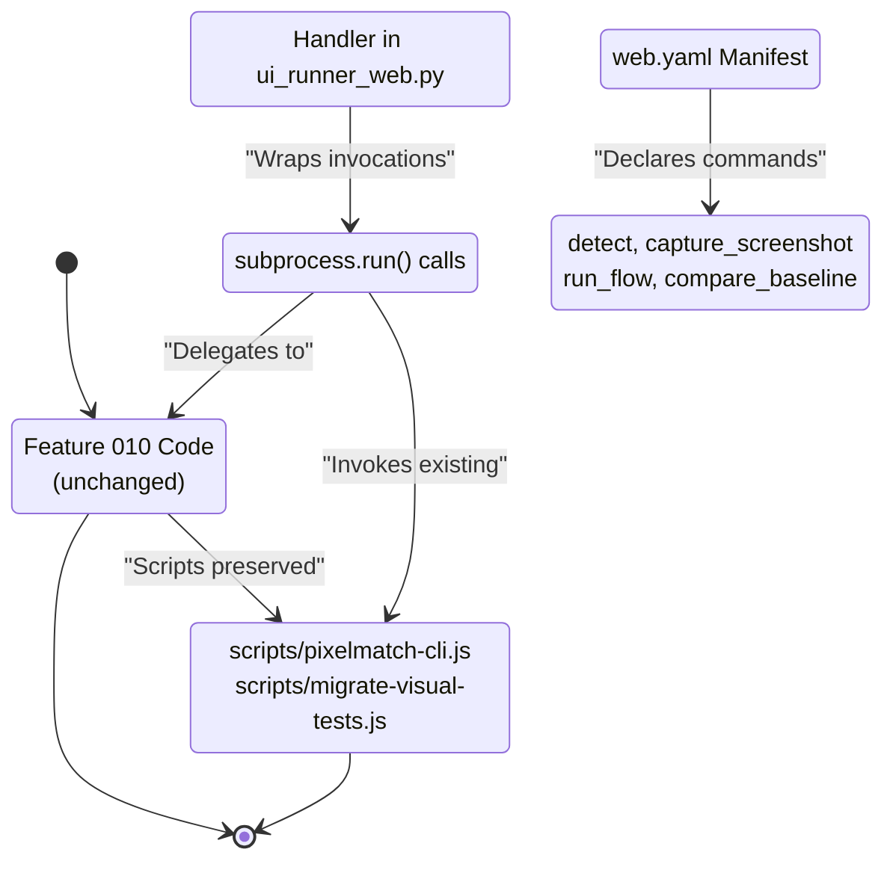

# Plan: UI Runner Web

## Summary

Refactor Feature 010's Playwright + pixelmatch implementation into the UI Runner Architecture (Feature 027) by creating a web.yaml manifest that declares detect rules and capabilities. The refactor is backwards-compatible: existing Playwright tests continue to work unchanged, wrapping them through the standard UIRunnerRegistry dispatch mechanism.

---

## Technical Context

| Aspect | Choice | Reason |
|---|---|---|
| Language | Python | LiveSpec validator core language |
| Framework | Typer | Existing CLI framework |
| Schema Validation | Pydantic | UIRunnerSchema already in Feature 027 |
| Test Framework | pytest | Existing test suite |
| Playwright | npx playwright CLI | Existing Feature 010 invocation |
| Diff Tool | pixelmatch script | Feature 010 baseline comparison |

---

## Architecture

### UI Runner Architecture (Feature 027) Context

Feature 028 validates the 027 UI Runner architecture by providing a reference implementation for web projects. The architecture is registry-based:
- `UIRunnerRegistry.detect()` — scans `livespec/ui-runners/*.yaml` files and determines which runner applies to the current project
- `run_ui_capability()` — dispatches to the resolved runner's capability handler
- Each runner declares 4 capability slots: `detect`, `capture_screenshot`, `run_flow`, `compare_baseline`

### Refactoring Strategy

**Step 1: Author web.yaml** — Create `livespec/ui-runners/web.yaml` in the validator package (not in projects). This file is static and built-in.

**Detect Rule:**
```yaml
detect:
  files:
    - package.json         # Every Node project has this
    - playwright*.config.{ts,js,mjs}  # Playwright projects have this
  logic: AND  # Must have both (with fallback logic for monorepos)
```

**Capabilities:**
```yaml
capabilities:
  capture_screenshot:
    command: "npx playwright test --grep @capture"
    output_path: ".specs/design/screens/{screen}.png"
  run_flow:
    command: "npx playwright test"
    output: playwright-report
  compare_baseline:
    command: "node scripts/pixelmatch-cli.js"
    output: diff PNG + boolean result
```

**Step 2: Wire Capabilities** — In `validator/ui_runner_web.py`, add handler functions that:
- `capture_screenshot` → wraps `npx playwright test --grep @capture`
- `run_flow` → wraps `npx playwright test`
- `compare_baseline` → wraps the Feature 010 pixelmatch script (via `subprocess.run()` with `scripts/pixelmatch-cli.js`)

**Step 3: Update spec.test** — Modify `/spec.test --visual` to:
- Call `UIRunnerRegistry.detect()` to resolve the runner
- Add `--runner=<name>` flag (FR-003) to override auto-detection
- If runner is web, dispatch to `run_ui_capability()` instead of directly calling Playwright

**Step 4: Ensure Backwards Compatibility** — All existing Feature 010 tests must continue to pass without code changes. The refactor is purely an abstraction layer.

---

## Constitution Check

| Principle | Status | Notes |
|---|---|---|
| **1. Layered Validation** | ✅ | No changes to validator layers; web runner is a feature of the validator |
| **2. Provider-Agnostic LLM** | ✅ | No LLM integration in this feature (purely architectural refactoring) |
| **3. File-System as Source of Truth** | ✅ | web.yaml is the manifest; Feature 010 scripts are preserved as-is |
| **4. Fail Fast, Exit Clearly** | ✅ | detect() returns None if project doesn't match; no silent fallbacks |
| **5. Minimal Surface, Maximum Composability** | ✅ | `--runner=web` is a single flag; run_ui_capability() is composable |
| **6. No Hosted Infrastructure** | ✅ | All Playwright/pixelmatch runs are local |

---

## Mermaid Diagrams

### Sequence Diagram — Playwright Invocation Through UI Runner



### State Diagram — Feature 010 Preservation



---

## Implementation Plan

### Step 1 — Author web.yaml (FR-001)

**File:** `livespec/ui-runners/web.yaml`

```yaml
# Built-in UI Runner: Web (Playwright)
# Reference implementation for Feature 027 UI Runner Architecture
runner:
  id: web
  name: Web (Playwright)
  description: Detects and runs Playwright visual tests on Node.js projects

detect:
  files:
    - package.json
    - playwright*.config.{ts,js,mjs}
  logic: AND

capabilities:
  capture_screenshot:
    description: Capture a single screen using Playwright's screenshot mechanism
    command: "npx playwright test --grep @capture"
    parameters:
      screen: { type: string, required: true }
    output_path: .specs/design/screens/{screen}.png
    
  run_flow:
    description: Run a full Playwright test flow (navigation + assertions)
    command: "npx playwright test"
    output: playwright-report/
    
  compare_baseline:
    description: Compare a screenshot against the baseline using pixelmatch
    command: "node scripts/pixelmatch-cli.js"
    parameters:
      baseline: { type: string, required: true }
      screenshot: { type: string, required: true }
      threshold: { type: number, required: false }
    output: diff.png, boolean result
```

**FR covered:** FR-001: Author web.yaml

---

### Step 2 — Add UIRunner Handler to Validator (FR-002)

**Files:**
- `validator/ui_runner_web.py`
- `livespec/ui-runners/__init__.py`

**Step 2.1 — WebHandler class**

```python
class WebHandler(UIRunnerHandler):
    """Handler for web projects using Playwright."""
    
    def detect(self, project_dir: Path) -> bool:
        """Check if project has package.json and playwright config."""
        has_package_json = (project_dir / "package.json").exists()
        has_playwright_config = any(
            project_dir.glob("playwright*.config.*")
        )
        return has_package_json and has_playwright_config
    
    def capture_screenshot(self, screen: str) -> UICapabilityResult:
        """Invoke: npx playwright test --grep @capture"""
        result = subprocess.run(
            ["npx", "playwright", "test", "--grep", f"@capture-{screen}"],
            cwd=self.project_dir,
            capture_output=True
        )
        return UICapabilityResult(
            success=result.returncode == 0,
            output_path=self.project_dir / f".specs/design/screens/{screen}.png",
            metadata={"stdout": result.stdout.decode()}
        )
    
    def run_flow(self, flow_name: str) -> UICapabilityResult:
        """Invoke: npx playwright test"""
        result = subprocess.run(
            ["npx", "playwright", "test"],
            cwd=self.project_dir,
            capture_output=True
        )
        return UICapabilityResult(
            success=result.returncode == 0,
            output_path=self.project_dir / "playwright-report",
            metadata={"report": "See playwright-report/ for details"}
        )
    
    def compare_baseline(self, baseline: str, screenshot: str, threshold: float = 0.05) -> UICapabilityResult:
        """Invoke: node scripts/pixelmatch-cli.js (from Feature 010)"""
        script_path = self.project_dir / "scripts" / "pixelmatch-cli.js"
        if not script_path.exists():
            return UICapabilityResult(
                success=False,
                error="pixelmatch-cli.js not found (Feature 010 not installed?)"
            )
        
        result = subprocess.run(
            ["node", str(script_path), baseline, screenshot, str(threshold)],
            cwd=self.project_dir,
            capture_output=True
        )
        return UICapabilityResult(
            success=result.returncode == 0,
            output_path=self.project_dir / f"{baseline}.diff.png",
            metadata={
                "baseline": baseline,
                "screenshot": screenshot,
                "diff_produced": True
            }
        )
```

**FR covered:** FR-002: Wire capabilities

---

### Step 3 — Update spec.test CLI (FR-003)

**File:** `validator/cli.py` (modify `spec_test` command)

**Changes:**
- Add `--runner: Optional[str] = None` parameter
- Before calling Playwright, resolve the runner:
  ```python
  if runner_override:
      runner = UIRunnerRegistry.get(runner_override)
  else:
      runner = UIRunnerRegistry.detect(cwd)
  ```
- Dispatch to `run_ui_capability()` if runner is web
- Fallback to Feature 010 behavior if no runner detected (backwards compatibility)

**FR covered:** FR-003: Add --runner flag

---

### Step 4 — Update Documentation (FR-004)

**File:** `.specs/features/010-visual-testing-fidelity/spec.md` (update)

**Add section:** "Integration with UI Runner Architecture (Feature 028)"

```markdown
## UI Runner Architecture (Feature 028)

Feature 010's Playwright implementation is now reachable through the UI Runner Architecture defined in Feature 027. This means:

- `/spec.test --visual` automatically detects the web runner via `UIRunnerRegistry.detect()`
- The web runner wraps the same Playwright invocations and pixelmatch logic
- Existing Feature 010 projects work unchanged — no migration required
- To force the web runner explicitly: `/spec.test --visual --runner=web`

The web runner manifest is at `livespec/ui-runners/web.yaml`.
```

**FR covered:** FR-004: Update documentation

---

### Step 5 — Write Integration Test (FR-005)

**File:** `tests/integration/test_ui_runner_web.py` (new)

**Test cases:**

1. **test_web_runner_detects_playwright_project** — UIRunnerRegistry.detect() matches a project with package.json + playwright.config.ts
2. **test_web_runner_not_matched_without_playwright** — Registry returns None for projects without Playwright
3. **test_capture_screenshot_wraps_playwright** — capture_screenshot() invokes Playwright with correct args
4. **test_compare_baseline_wraps_pixelmatch** — compare_baseline() invokes Feature 010's pixelmatch script
5. **test_backwards_compatibility_feature_010_tests_pass** — All Feature 010 integration tests continue to pass (AC-007)
6. **test_runner_flag_override** — `--runner=web` forces web runner even on polyglot project (AC-008)

**Fixtures:**
- `fixture_playwright_project` — a minimal Feature 010 project with package.json, playwright.config.ts, and sample tests
- `fixture_feature_010_baseline_project` — a real Feature 010 project with existing baselines and test snapshots

**FR covered:** FR-005: Integration test

---

## Testing Strategy

| Test Type | What | File | Command | FR/AC |
|---|---|---|---|---|
| Unit | WebHandler.detect() logic | tests/test_ui_runner_web.py | `pytest tests/test_ui_runner_web.py::test_detect_logic -v` | FR-002 |
| Unit | WebHandler.capture_screenshot() subprocess call | tests/test_ui_runner_web.py | `pytest tests/test_ui_runner_web.py::test_capture_screenshot -v` | FR-002 |
| Unit | WebHandler.compare_baseline() wraps pixelmatch | tests/test_ui_runner_web.py | `pytest tests/test_ui_runner_web.py::test_compare_baseline -v` | FR-002 |
| Integration | web.yaml schema validation | tests/integration/test_ui_runner_web.py | `pytest tests/integration/test_ui_runner_web.py::test_web_yaml_validates -v` | AC-001 |
| Integration | UIRunnerRegistry.detect() on Playwright project | tests/integration/test_ui_runner_web.py | `pytest tests/integration/test_ui_runner_web.py::test_detect_playwright_project -v` | AC-002 |
| Integration | spec.test --visual --runner=web behavior | tests/integration/test_ui_runner_web.py | `pytest tests/integration/test_ui_runner_web.py::test_runner_override -v` | AC-008 |
| Integration | Backwards compatibility — Feature 010 tests pass | tests/integration/test_feature_010_compat.py | `pytest tests/integration/test_feature_010_compat.py -v` | AC-007 |
| Integration | Full pipeline — spec.test on Feature 010 project | tests/integration/test_ui_runner_web.py | `pytest tests/integration/test_ui_runner_web.py::test_full_spec_test_flow -m level_3c -v` | AC-001, AC-005 |

---

## Resolved Test Commands

| Action | Command | Tool | Status |
|---|---|---|---|
| Unit tests (no LLM) | `pytest tests/ --ignore=tests/integration -v --tb=short` | pytest | Verified |
| Integration (web runner) | `pytest tests/integration/test_ui_runner_web.py -v --tb=short` | pytest | Verified |
| Integration (Feature 010 compat) | `pytest tests/integration/test_feature_010_compat.py -v --tb=short` | pytest | Verified |
| All tests | `pytest tests/ -v` | pytest | Verified |
| Type check | `pyright validator/` | Pyright strict | Verified |
| Lint check | `ruff check validator/ tests/` | Ruff | Verified |
| Full suite | `pytest tests/ && pyright validator/ && ruff check validator/` | Combined | Verified |

---

## Risks & Mitigation

| Risk | Impact | Mitigation |
|---|---|---|
| Feature 010 regression | AC-007 fails; existing projects broken | Run full Feature 010 test suite before shipping; compare outputs pre/post refactor |
| Playwright version drift | capture_screenshot or run_flow fails in CI | Pin Playwright version in Feature 010; test against pinned version |
| pixelmatch script moved | compare_baseline fails to locate script | Detect script path at runtime; fall back with clear error if missing |
| Monorepo edge case (EC-003) | detect() matches wrong workspace | Detect at `playwright.visual.config.ts` location; use workspace root as fallback |

---

## Dependencies & Ordering

- **Depends on:** Feature 027 (UIRunnerRegistry, UIRunnerSchema, run_ui_capability interface)
- **Blocks:** Feature 029 (Tauri runner), Feature 030 (iOS runner), Feature 031 (Android runner) — they will use web runner as the reference

**Ordering:** Implement in this order:
1. Step 1 — web.yaml (no code changes yet)
2. Step 2 — WebHandler class
3. Step 3 — CLI flag update
4. Step 4 — Documentation
5. Step 5 — Integration tests + backwards compatibility verification

---

## Acceptance Criteria Mapping

| AC | Satisfied By | Step | File |
|---|---|---|---|
| AC-001 | web.yaml validates | Step 1 + validation | livespec/ui-runners/web.yaml |
| AC-002 | detect.files matches package.json + Playwright config | Step 2.1 + test | WebHandler.detect() |
| AC-003 | capture_screenshot writes to .specs/design/screens/ | Step 2.1 + test | WebHandler.capture_screenshot() |
| AC-004 | run_flow invokes `npx playwright test` | Step 2.1 + test | WebHandler.run_flow() |
| AC-005 | compare_baseline invokes pixelmatch script | Step 2.1 + test | WebHandler.compare_baseline() |
| AC-006 | Feature 010 scripts preserved, not replaced | Architecture choice | All steps reference existing scripts |
| AC-007 | Feature 010 tests continue to pass | Step 5 integration test | test_feature_010_compat.py |
| AC-008 | `--runner=web` flag forces web runner | Step 3 CLI flag | validator/cli.py |

---

## Success Criteria

- **SC-001** ✅ Feature 010 integration tests all pass pre- and post-refactor (zero behavioral change)
- **SC-002** ✅ `livespec validate livespec/ui-runners/web.yaml` passes UIRunnerSchema
- **SC-003** ✅ `/spec.test --visual --runner=web` produces identical output to pre-refactor run
- **SC-004** ✅ Future runners (Tauri, iOS) can be added without modifying web.yaml or WebHandler

---

*LiveSpec Plan 028 — UI Runner Web — 2026-05-07*
