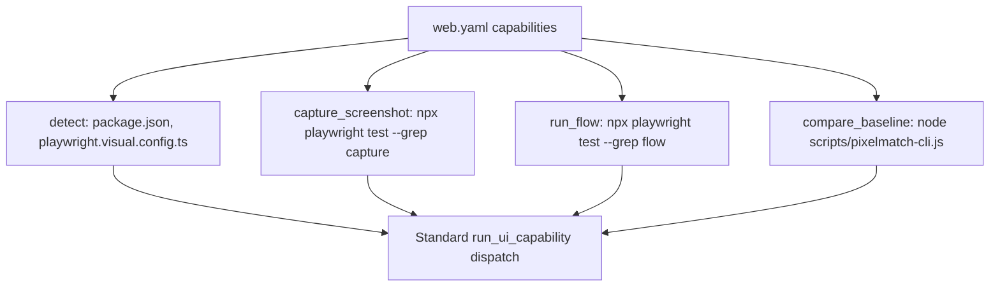

# Feature Spec: UI Runner Web (Playwright Refactor)

- **Feature:** UI Runner Web
- **Branch:** feature/028-ui-runner-web
- **Date:** 2026-05-06
- **Status:** Draft
- **Priority:** P2
- **Scope:** S
- **Input:** Refactor the existing Feature 010 (Visual Testing Complete) implementation to fit into the UI Runner Architecture pattern (Feature 027). Backwards-compatible: all existing Playwright tests continue to work. The web visual testing logic gets a YAML manifest at livespec/ui-runners/web.yaml that declares Playwright capabilities and invokes the existing scripts. This validates the 027 architecture on a known, working case before tackling Tauri/iOS/Android.
- **Feature Number:** 028
- **Deps:** 010, 027

---

## User Scenarios & Testing

### Story 1 — Existing Playwright projects keep working without changes `P1`

A project that already uses Feature 010 (Playwright + pixelmatch + mockup baselines) sees no behavioral change. `/spec.test --visual` still runs the same Playwright tests, against the same baselines, with the same diff threshold.

**Priority reason:** Backwards compatibility is non-negotiable. Existing users must not be broken.

**Independent test:** Run `/spec.test --visual` on an existing Feature-010 project before and after the refactor; verify identical outputs and exit codes.

```gherkin
Feature: Backwards compatibility with Feature 010
  Scenario: Existing Playwright project unchanged
    Given a project with Playwright tests generated by Feature 010
    And baselines stored in .specs/design/screens/
    When the developer runs /spec.test --visual
    Then the web UI runner is detected
    And the same Playwright tests execute
    And the same baselines are compared
    And the result matches the pre-refactor behavior

  Scenario: Existing playwright.visual.config.ts honored
    Given a project with playwright.visual.config.ts present
    When /spec.test --visual runs
    Then the runner uses the project's existing config
    And does not overwrite or modify it
```

```mermaid
flowchart TD
    A[/spec.test --visual] --> B[UIRunnerRegistry.detect]
    B --> C[web.yaml matches package.json + playwright.visual.config.ts]
    C --> D[run_ui_capability: capture_screenshot]
    D --> E[Wraps existing Playwright invocation]
    E --> F[run_ui_capability: compare_baseline]
    F --> G[Wraps existing pixelmatch logic]
    G --> H[UIRunResult identical to pre-refactor]
```

---

### Story 2 — Web runner exposes capabilities through the standard API `P2`

The web UI runner declares 4 capabilities in YAML: `detect`, `capture_screenshot`, `run_flow`, `compare_baseline`. Each invokes the appropriate Playwright command or existing Feature 010 script.

**Priority reason:** Validates the 027 architecture on a known stack and provides a reference implementation other runners can mirror.

**Independent test:** Inspect `livespec/ui-runners/web.yaml`; verify all 4 capabilities are declared with valid commands and that schema validation passes.

```gherkin
Feature: Web runner declares standard capabilities
  Scenario: Manifest declares all 4 capabilities
    Given livespec/ui-runners/web.yaml exists
    When the schema is validated
    Then it has detect.files referencing package.json or playwright config
    And capture_screenshot wraps Playwright screenshot mode
    And run_flow wraps a Playwright test invocation
    And compare_baseline wraps the existing pixelmatch script

  Scenario: Capabilities invoked through run_ui_capability
    Given the web runner is active
    When run_ui_capability(runner, "capture_screenshot", screen="dashboard") is called
    Then the matching Playwright command runs
    And the result includes the captured PNG path in output_path
```



---

## Acceptance Criteria

- **AC-001** — `livespec/ui-runners/web.yaml` exists and validates against `UIRunnerSchema` (Feature 027).
- **AC-002** — `detect.files` matches projects with `package.json` AND (`playwright.config.ts` OR `playwright.visual.config.ts` OR `vitest.config.ts` with Playwright integration).
- **AC-003** — `capture_screenshot` capability invokes Playwright's screenshot mechanism on a single screen, writing the PNG to `.specs/design/screens/<screen>.png` (or configurable path).
- **AC-004** — `run_flow` capability invokes a full Playwright test (with assertions and navigation), producing a Playwright report.
- **AC-005** — `compare_baseline` capability invokes the existing pixelmatch comparison logic from Feature 010, producing a diff PNG and a pass/fail boolean.
- **AC-006** — Existing Feature 010 scripts (`scripts/migrate-visual-tests.js`, generated test templates) are preserved untouched. The runner manifest references them, does not replace them.
- **AC-007** — All Feature 010 acceptance criteria continue to pass after the refactor (no regression).
- **AC-008** — A `--runner=web` flag forces the web runner even on a polyglot project.

---

## Functional Requirements

- **FR-001** — Author `livespec/ui-runners/web.yaml` declaring detect rule and 3 active capabilities (capture_screenshot, run_flow, compare_baseline).
- **FR-002** — Wire each capability to existing Feature 010 implementations (Playwright commands + pixelmatch script).
- **FR-003** — Add a `--runner=<name>` override to `/spec.test --visual` (ties into Feature 027 FR-007).
- **FR-004** — Update Feature 010 documentation to mention it is now reachable through the UI Runner architecture.
- **FR-005** — Write integration test that runs the web runner end-to-end on a Feature 010 fixture and compares output to a snapshot of the pre-refactor behavior.

---

## Key Entities

| Entity | Description |
|---|---|
| `web.yaml` | Built-in UI runner manifest for web projects using Playwright. |
| Existing Feature 010 scripts | `scripts/migrate-visual-tests.js`, generated test templates, pixelmatch comparison — preserved as-is, invoked by the manifest. |

---

## Infrastructure Requirements

| Resource | Type | Provider | Environment | When |
|---|---|---|---|---|
| Node.js 18+ | Tooling | npm registry | dev + CI | Required to run Playwright |
| Playwright | Tooling | `npx playwright install` | dev + CI | Required for capture_screenshot and run_flow |
| Playwright browsers | Tooling | Playwright CLI | dev + CI | Chromium / Firefox / WebKit binaries |

---

## Edge Cases

- **EC-001** — Project has Playwright config at non-standard path: detect uses glob fallback for `playwright*.config.{ts,js,mjs}`.
- **EC-002** — Project has only `vitest.config.ts` (no Playwright explicitly): runner does not match — Vitest snapshots are handled by the TypeScript driver (Feature 018), not the web UI runner.
- **EC-003** — Multiple package.json (monorepo): the web runner detects at the location of `playwright.visual.config.ts` or the closest workspace root.

---

## Success Criteria

- **SC-001** — Refactor produces zero behavioral change measured by Feature 010 integration tests (all existing tests pass).
- **SC-002** — `livespec validate` on the web runner manifest passes Feature 027's UIRunnerSchema.
- **SC-003** — `/spec.test --visual` with `--runner=web` produces identical output to the pre-refactor `/spec.test --visual`.
- **SC-004** — Adding a new built-in runner (e.g., a future Electron runner) does not require changes to web runner code.

---

*LiveSpec Feature 028 — Draft — 2026-05-06*
