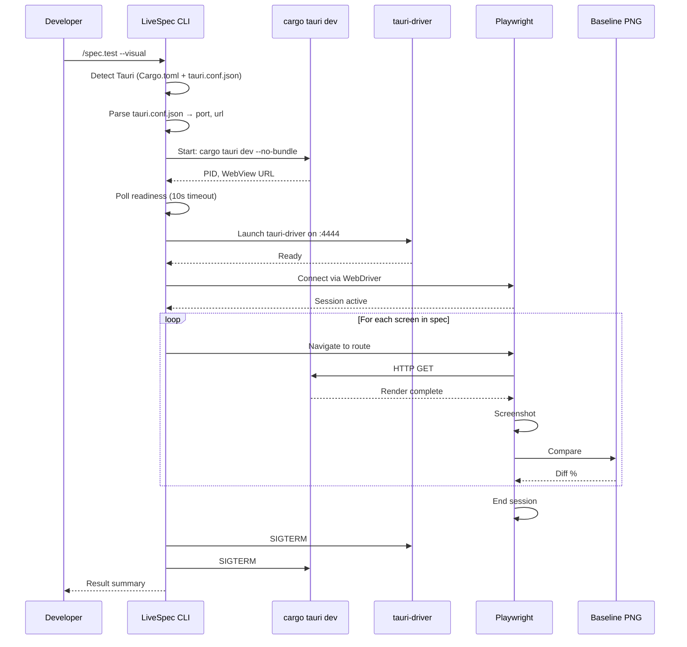
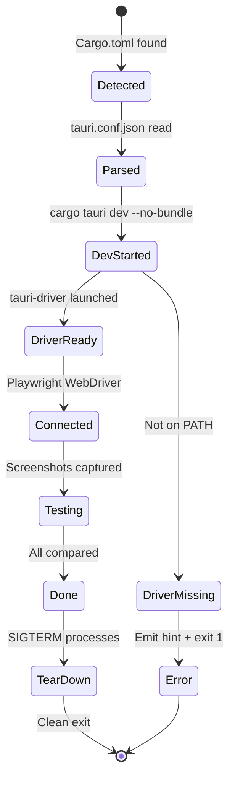
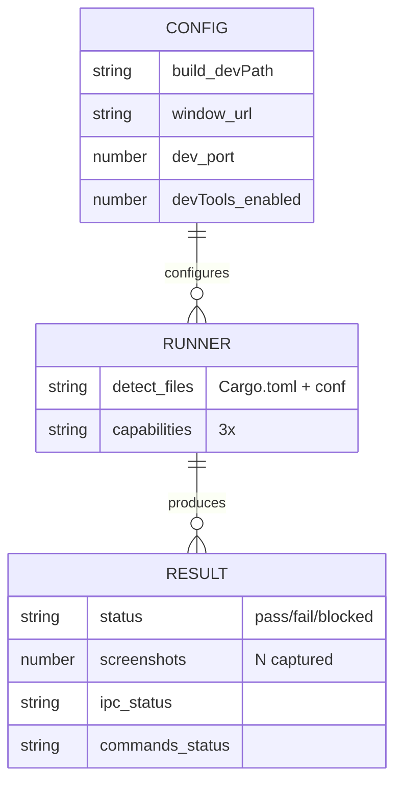

# Plan: UI Runner Tauri (029)

## Summary

Implement a built-in Tauri UI runner (`livespec/ui-runners/tauri.yaml`) extending Feature 027's runner architecture. The runner detects Tauri projects (Cargo.toml + tauri.conf.json) and orchestrates three test surfaces: WebView visual testing via tauri-driver/Playwright, Tauri command testing via `tauri::test::mock_app()`, and IPC integration testing via full app launch with `invoke()` assertions.

---

## Technical Context

| Aspect | Choice | Rationale |
|---|---|---|
| Language | Python (CLI) + YAML (manifest) | Extends livespec validator infrastructure |
| Manifest location | `livespec/ui-runners/tauri.yaml` | Built-in runner, no external package |
| Detection | `Cargo.toml` + `src-tauri/tauri.conf.json` | Tauri project canonical structure |
| WebView automation | tauri-driver (WebDriver) + Playwright | Standard Tauri testing tooling |
| Command testing | `tauri::test::mock_app()` + `cargo test` | Rust integration test convention |
| IPC testing | Full app launch + Playwright `invoke()` | End-to-end validation |
| Configuration | `tauri.conf.json` fields | Extract dev paths, port, URL |

---

## Scope Sizing

**Size: M (medium)**
- 7 FR, 12 AC, no new database tables, no API routes
- 4 new Python files: orchestrator, config parser, error handler, capabilities
- 1 YAML manifest + 3 Python capability modules
- Multiple integration test files (fixture Tauri projects)
- No LLM calls required

**Output budget:** 1 state diagram + 1 sequence diagram + 1 ER-style diagram. No additional diagrams.

---

## Constitution Check

| Principle | Status | Note |
|---|---|---|
| Simplicity | ✅ | Three focused capabilities; CLI dispatch via manifest |
| Separation | ✅ | Config parsing, orchestration, error handling isolated |
| Testing | ✅ | Fixture Tauri projects for all surfaces; deterministic outcomes |
| Naming | ✅ | `snake_case` modules, `TauriHandler` class, `capture_screenshot` capability |
| Infrastructure | ✅ | Tauri CLI, Rust toolchain provisioned externally |
| File length | ✅ | Estimated ~150 lines per module, ~50 lines manifest |
| Error handling | ✅ | Clear install hints (tauri-driver missing), timeout messages, IPC error rewrites |
| Source of truth | ✅ | tauri.conf.json is authoritative for config |

---

## API Interactions & Gherkin Scenarios

```gherkin
Feature: Tauri runner detection and dispatch
  Scenario: Runner detects Tauri project
    Given a directory with Cargo.toml and src-tauri/tauri.conf.json
    When LiveSpec scans for UI runners
    Then tauri.yaml runner is selected with priority 110
    And detect rule AND matches both files

  Scenario: WebView visual testing pipeline
    Given a Tauri v2 app with tauri.conf.json (devTools: 1)
    And tauri-driver installed (cargo install tauri-driver)
    And Playwright available
    When /spec.test --visual [tauri-project] runs
    Then cargo tauri dev --no-bundle starts in background
    And tauri-driver connects on extracted port
    And Playwright attaches via WebDriver protocol
    And screenshots captured for each declared screen
    And compared to baselines in .specs/design/screens/
    And both app and driver tear down gracefully

  Scenario: tauri-driver not installed
    Given a Tauri project
    And tauri-driver not on PATH
    When /spec.test --visual runs
    Then error message: "tauri-driver not found. Install: cargo install tauri-driver"
    And exit code 1 (hard requirement)

  Scenario: Tauri commands tested via mock_app
    Given integration tests in src-tauri/tests/*.rs using tauri::test::mock_app()
    When tauri_commands capability invokes
    Then cargo test --test pattern runs
    And mock_app tests execute against simulated AppHandle
    And UICapabilityResult reflects pass/fail

  Scenario: IPC roundtrip verified end-to-end
    Given a Playwright test calling window.__TAURI__.invoke('greet', {})
    When ipc_integration capability runs
    Then full app boots via cargo build
    And test executes invoke() call
    And backend handler responds
    And assertion on result passes
    And status is success or failure based on test outcome
```

---

## Mermaid Diagrams

### Sequence: WebView Visual Testing



### State Diagram: Tauri App Lifecycle



### ER-Style Data Model



---

## Implementation Plan

### Step 1 — Create `tauri.yaml` Manifest

**File:** `livespec/ui-runners/tauri.yaml`

**Content:**
- Detect rule: `detect.files = ["Cargo.toml", "src-tauri/tauri.conf.json"]` (AND)
- Priority: 110 (higher than Rust driver 100)
- Capabilities:
  - `capture_screenshot`: Launch app + tauri-driver + Playwright
  - `run_flow`: Execute test in Playwright session
  - `compare_baseline`: Delegate to web runner pixelmatch logic
  - `tauri_commands`: Invoke cargo test on integration tests
  - `ipc_integration`: Launch full app + run invoke() tests

**FR covered:** FR-001: Manifest authoring

---

### Step 2 — Implement TauriHandler Orchestrator

**Files:**
- `livespec/ui-runner-impl/tauri_handler.py` — main class
- `livespec/ui-runner-impl/tauri_config.py` — config parsing

**Logic:**
1. Parse `tauri.conf.json` → extract build.devPath, window URL, port
2. Launch `cargo tauri dev --no-bundle` in background
3. Poll WebView HTTP readiness (max 10s)
4. Launch tauri-driver on extracted port
5. Attach Playwright WebDriver
6. Provide connection details to screenshot/flow capabilities
7. Implement context manager for safe teardown

**FR covered:** FR-002 (app launch + tauri-driver orchestration), FR-005 (config parsing)

---

### Step 3 — Implement Teardown & Process Management

**Files:**
- `livespec/ui-runner-impl/tauri_handler.py` (add cleanup)
- `livespec/ui-runner-impl/process_guard.py` (generic guard)

**Logic:**
1. Track all spawned processes (app, driver, Playwright)
2. Context manager pattern (`__enter__`, `__exit__`)
3. On exception/normal exit: SIGTERM processes in reverse order
4. Verify no orphaned processes (wait 2s, SIGKILL if needed)
5. Log each cleanup step

**FR covered:** FR-003 (teardown logic even on exception)

---

### Step 4 — Implement IPC Error Pattern Matching

**Files:**
- `livespec/ui-runner-impl/ipc_errors.py` — pattern detection

**Patterns:**
1. "command not registered" → Actionable hint with handler registration docs
2. "Tauri command failed" → Exception message with Rust logs reference
3. "timeout waiting for response" → Performance hint

**Logic:**
1. Regex match on Playwright stderr
2. Rewrite into actionable hint
3. Include relevant context (file paths, error codes)

**FR covered:** FR-004 (IPC error pattern matching + actionable hints)

---

### Step 5 — Implement Tauri Commands Capability

**Files:**
- `livespec/ui-runner-impl/tauri_commands.py`

**Logic:**
1. Glob `src-tauri/tests/**/*.rs` for integration tests
2. Filter for `tauri::test::mock_app` references
3. Run `cargo test --test pattern` on matches
4. Parse output for pass/fail counts
5. Map test names to AC if available

**FR covered:** FR-007 (tauri_commands capability)

---

### Step 6 — Implement IPC Integration Capability

**Files:**
- `livespec/ui-runner-impl/ipc_integration.py`

**Logic:**
1. Build full app: `cargo build --release`
2. Launch app binary from `target/release/`
3. Wait for WebView ready
4. Trigger dedicated IPC test suite (Playwright with `invoke()`)
5. Parse results for roundtrip verification

**FR covered:** FR-008 (ipc_integration capability)

---

### Step 7 — Create Integration Tests & Fixtures

**Files:**
- `tests/fixtures/tauri-v2-minimal/` (Tauri v2 app with tests)
- `tests/integration/test_tauri_runner.py` (test suite)

**Fixtures:**
1. Minimal Tauri v2 app with:
   - `greet(name: String) -> String` command
   - WebView screen with simple form
   - Integration test using `mock_app()`
   - Playwright test calling `invoke('greet')`

**Tests (8 scenarios):**
1. Detect Tauri project
2. App launches + tauri-driver connects
3. WebView screenshot captured + compared
4. Tauri command tested via mock_app()
5. IPC roundtrip via invoke()
6. tauri-driver missing → install hint
7. App build failure → error report
8. Teardown removes orphaned processes

**FR covered:** FR-006 (integration tests on fixtures)

---

### Step 8 — Document Features & Common Errors

**Content:**
1. Wire devtools in tauri.conf.json (`"build": { "devTools": true }`)
2. Port configuration (default 4444, override via `TAURI_DRIVER_PORT`)
3. Common errors + recovery:
   - `cargo install tauri-driver`
   - "WebView ready timeout" → enable devTools
   - "Cargo build fails" → check Rust version ≥1.70

**FR covered:** FR-009 (feature documentation)

---

## Testing Strategy

| Test Type | What | File | Command | FR/AC |
|---|---|---|---|---|
| Unit | Manifest schema | `tests/unit/test_tauri_manifest.py` | `pytest tests/unit/` | AC-001 |
| Unit | Config parsing | `tests/unit/test_tauri_config.py` | `pytest tests/unit/` | AC-010 |
| Unit | Error patterns | `tests/unit/test_ipc_errors.py` | `pytest tests/unit/` | AC-012 |
| Integration | App launch | `tests/integration/test_tauri_runner.py::test_launch` | `pytest tests/integration/` | AC-004, AC-009 |
| Integration | WebView screenshot | `tests/integration/test_tauri_runner.py::test_screenshot` | `pytest tests/integration/` | AC-004, AC-005, AC-006 |
| Integration | Tauri commands | `tests/integration/test_tauri_runner.py::test_commands` | `pytest tests/integration/` | AC-007 |
| Integration | IPC roundtrip | `tests/integration/test_tauri_runner.py::test_ipc` | `pytest tests/integration/` | AC-008 |
| Integration | Teardown safety | `tests/integration/test_tauri_runner.py::test_cleanup` | `pytest tests/integration/` | AC-011 |

---

## Risks & Mitigation

| Risk | Mitigation |
|---|---|
| Port conflicts | Check availability; support `--port` override |
| Platform-specific paths | Detect OS; use correct target binary location |
| WebView ready timeout | Clear error + tauri.conf.json check instructions |
| mock_app() panic | Capture stack trace; surface with context |
| Playwright session crash | Retry up to 2 times before fail |
| Serialization errors in IPC | Pattern match JSON errors; suggest type checking |

---

## Success Criteria

- [ ] SC-001: Tauri runner orchestrates all three surfaces in one `/spec.test --visual` call
- [ ] SC-002: Teardown robust — intentional failure; no orphaned processes
- [ ] SC-003: IPC error patterns produce actionable hints for 3+ error types
- [ ] SC-004: Manifest validates against UIRunnerSchema
- [ ] SC-005: Tauri 1.x and 2.x projects supported (fixtures for both)

---

*LiveSpec Feature 029 Plan — Approved 2026-05-07*
