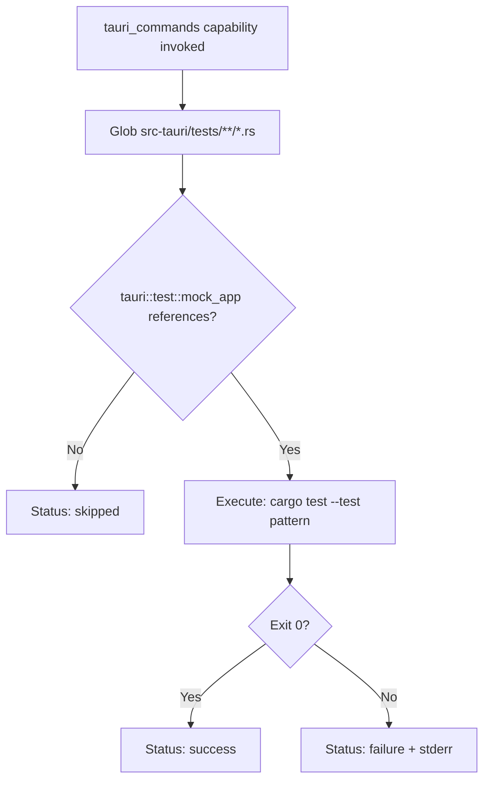
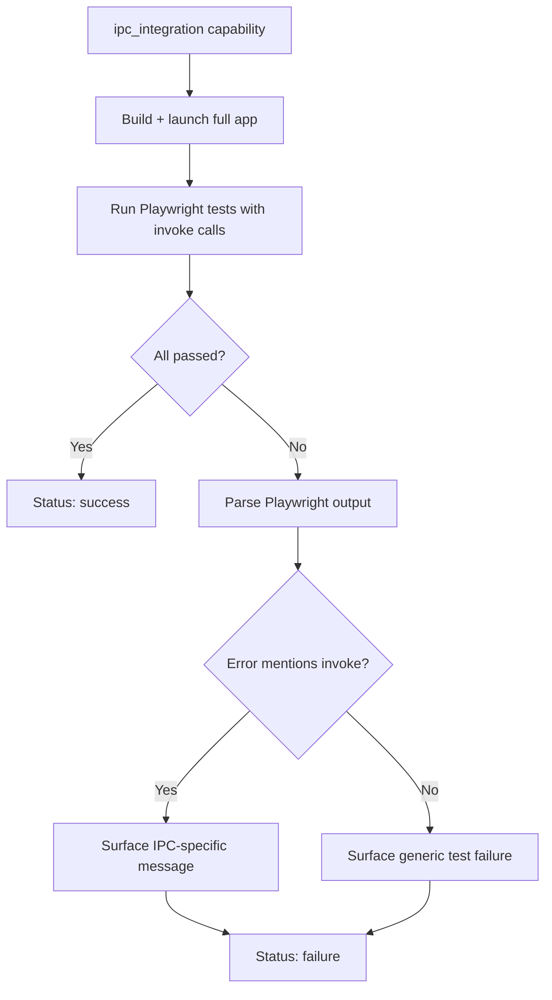

# Feature Spec: UI Runner Tauri

- **Feature:** UI Runner Tauri
- **Branch:** feature/029-ui-runner-tauri
- **Date:** 2026-05-06
- **Status:** Draft
- **Priority:** P1
- **Scope:** M
- **Input:** Built-in UI runner for Tauri projects (Rust backend + WebView frontend). Three test surfaces orchestrated together: (1) WebView frontend tested via Playwright connected through tauri-driver / WebDriver; (2) Tauri commands (#[tauri::command]) tested via tauri::test::mock_app() — escape hatch from the Rust driver (021); (3) IPC bridge integration tested by launching the full app and verifying invoke() roundtrips. The runner manifest orchestrates all three under one detect rule (Cargo.toml + tauri.conf.json).
- **Feature Number:** 029
- **Deps:** 027, 021

---

## User Scenarios & Testing

### Story 1 — Developer runs visual tests on a Tauri project's WebView `P1`

A developer with a Tauri project (Cargo.toml + tauri.conf.json + frontend) runs `/spec.test --visual`. The Tauri runner builds the app in dev mode with WebDriver enabled, attaches Playwright via tauri-driver, runs the configured visual flows, captures screenshots of the WebView, and compares to baselines.

**Priority reason:** Most of a Tauri app's visible UI is in the WebView — the visual testing entry point matters most.

**Independent test:** Run on a fixture Tauri project; verify WebView screenshot is captured and compared.

```gherkin
Feature: Tauri WebView visual testing
  Scenario: WebView screenshots captured via tauri-driver + Playwright
    Given a Tauri project with tauri.conf.json (devtools enabled)
    And tauri-driver is installed
    When the developer runs /spec.test --visual
    Then LiveSpec starts the app via tauri build --debug --no-bundle
    And tauri-driver is launched on the configured port
    And Playwright connects via WebDriver
    And screenshots of declared screens are captured
    And compared to baselines in .specs/design/screens/

  Scenario: tauri-driver not installed — clear install hint
    Given a Tauri project without tauri-driver on PATH
    When /spec.test --visual runs
    Then LiveSpec emits: "tauri-driver not found. Install: cargo install tauri-driver"
    And exits 1 (tauri-driver is required, unlike optional capabilities)
```

```mermaid
flowchart TD
    A[/spec.test --visual] --> B[Tauri runner detected: Cargo.toml + tauri.conf.json]
    B --> C{tauri-driver on PATH?}
    C -- No --> D[Emit install hint, exit 1]
    C -- Yes --> E[Start: cargo tauri dev --no-bundle]
    E --> F[Launch tauri-driver on configured port]
    F --> G[Playwright connects via WebDriver]
    G --> H[For each declared screen]
    H --> I[Navigate WebView]
    I --> J[Capture screenshot]
    J --> K[Compare to baseline]
    K --> L{More screens?}
    L -- Yes --> H
    L -- No --> M[Tear down driver + app]
    M --> N[Return UIRunResult]
```

---

### Story 2 — Developer tests Tauri commands via mock_app `P1`

The Tauri runner exposes a `tauri_commands` capability that runs `cargo test` on Rust integration tests using `tauri::test::mock_app()`. This is invoked in addition to the standard Rust driver coverage.

**Priority reason:** Tauri commands are the bridge between front and back — testing them in isolation prevents the most common Tauri bugs (serialization issues, async handler errors).

**Independent test:** Run the `tauri_commands` capability on a fixture with mock_app tests; verify the tests execute and pass/fail correctly.

```gherkin
Feature: Tauri commands testing via mock_app
  Scenario: Mock_app integration tests run
    Given a Tauri project with #[tauri::command] functions
    And integration tests using tauri::test::mock_app() exist in src-tauri/tests/
    When the tauri_commands capability is invoked
    Then cargo test --test '*tauri*' runs
    And the mock_app tests execute against the simulated AppHandle
    And UICapabilityResult reflects pass/fail

  Scenario: No mock_app tests found — capability skipped gracefully
    Given a Tauri project with no integration tests using mock_app
    When the tauri_commands capability is invoked
    Then LiveSpec emits "no mock_app tests detected — skipping"
    And status is "skipped"
```



---

### Story 3 — Developer tests IPC bridge end-to-end `P2`

The runner exposes an `ipc_integration` capability that launches the full app and runs Playwright tests that exercise `invoke()` calls from the frontend to verify roundtrips. This catches real IPC issues (missing command registration, payload serialization mismatches).

**Priority reason:** IPC is Tauri's most fragile surface. Unit tests on each side don't catch contract drift between front and back.

**Independent test:** Run a fixture with an `invoke('greet')` call; verify the Playwright test asserts the response correctly.

```gherkin
Feature: IPC bridge integration testing
  Scenario: invoke roundtrip verified end-to-end
    Given a Tauri app exposing greet command
    And a Playwright test calling window.__TAURI__.invoke('greet', {name: 'world'})
    When ipc_integration capability runs
    Then the app boots fully
    And Playwright executes the test
    And the assertion on invoke result passes
    And status is "success"

  Scenario: Command not registered — descriptive failure
    Given a Playwright test calling invoke('missing_command')
    When ipc_integration runs
    Then the test fails
    And LiveSpec surfaces: "Command 'missing_command' not registered in tauri::generate_handler"
    And status is "failure"
```



---

## Acceptance Criteria

- **AC-001** — `livespec/ui-runners/tauri.yaml` exists and validates against `UIRunnerSchema`.
- **AC-002** — `detect.files` matches projects with `Cargo.toml` AND `src-tauri/tauri.conf.json` (or `tauri.conf.json` at root for legacy layouts).
- **AC-003** — Tauri runner takes priority over a plain Rust driver match in detection (more specific = higher priority).
- **AC-004** — `capture_screenshot` capability launches the app via `cargo tauri dev --no-bundle`, attaches via tauri-driver, captures screenshots through Playwright WebDriver session.
- **AC-005** — `run_flow` capability runs a Playwright test inside the tauri-driver session.
- **AC-006** — `compare_baseline` capability uses the same pixelmatch comparison as the web runner (Feature 028).
- **AC-007** — `tauri_commands` capability invokes `cargo test` filtered to integration tests using `tauri::test::mock_app()`.
- **AC-008** — `ipc_integration` capability launches the full app and runs a dedicated Playwright suite that exercises `invoke()` calls.
- **AC-009** — If `tauri-driver` is not installed, the runner emits a clear install hint (`cargo install tauri-driver`) and exits non-zero — required tool, not optional.
- **AC-010** — `tauri.conf.json` is read to extract the dev port for tauri-driver connection.
- **AC-011** — The runner correctly tears down the app and tauri-driver process even on test failure (no orphaned processes).
- **AC-012** — IPC error messages are parsed for "command not registered" patterns and surfaced as actionable hints.

---

## Functional Requirements

- **FR-001** — Author `livespec/ui-runners/tauri.yaml` with detect rule and 5 capabilities (capture_screenshot, run_flow, compare_baseline, tauri_commands, ipc_integration).
- **FR-002** — Implement Tauri app launch + tauri-driver orchestration: `cargo tauri dev --no-bundle` in background, wait for WebDriver port readiness, attach Playwright.
- **FR-003** — Implement teardown logic: graceful kill on dev process, tauri-driver process, and Playwright session — even on test exception.
- **FR-004** — Implement IPC error pattern matching: detect "command not registered" / "Tauri command failed" patterns in Playwright stderr and rewrite into actionable hints.
- **FR-005** — Parse `tauri.conf.json` to extract `build.devPath` and `tauri.windows[0].url` for navigation defaults.
- **FR-006** — Write integration tests on a minimal fixture Tauri project: app launches, screenshot captured, command tested, IPC verified.
- **FR-007** — Document the workflow in feature docs: how to wire devtools, port configuration, common errors.

---

## Key Entities

| Entity | Description |
|---|---|
| `tauri.yaml` | Built-in Tauri UI runner manifest. |
| `tauri-driver` | External tool (cargo install) — WebDriver wrapper for Tauri. Required dependency. |
| `tauri.conf.json` | Tauri config file; read for port and URL. |
| Tauri integration test convention | `src-tauri/tests/*.rs` files using `tauri::test::mock_app()`. |

---

## Infrastructure Requirements

| Resource | Type | Provider | Environment | When |
|---|---|---|---|---|
| Rust toolchain (rustup, cargo) | Tooling | `rustup` | dev + CI | Required for cargo tauri dev |
| tauri-cli | Tooling | `cargo install tauri-cli` | dev + CI | Required to run `cargo tauri` |
| **tauri-driver** | Tooling | `cargo install tauri-driver` | dev + CI | Required for WebView automation |
| Node.js + Playwright | Tooling | npm + `npx playwright install` | dev + CI | Required for WebDriver client |
| Platform build tools | Tooling | Xcode CLT (macOS) / GTK + libsoup (Linux) / MSVC (Windows) | dev + CI | Required by Tauri to build app |

---

## Edge Cases

- **EC-001** — `cargo tauri dev` fails to start (compile error in Rust): runner reports "Tauri build failed" with full cargo output, exits 1.
- **EC-002** — tauri-driver port already in use: runner detects and emits a clear message; suggests `--port` override.
- **EC-003** — App launches but WebView never reaches ready state (10s timeout): runner emits "WebView ready timeout — check devtools or --no-bundle flag".
- **EC-004** — `mock_app` test panics: cargo test surfaces it; runner reports as `failure` with the panic message.
- **EC-005** — Project uses Tauri 1.x vs 2.x: detection adds a `tauri_version` field; runner adapts commands accordingly.

---

## Success Criteria

- **SC-001** — Tauri runner orchestrates all three surfaces (WebView visual, mock_app commands, IPC integration) under one `/spec.test --visual` invocation.
- **SC-002** — Teardown is robust: integration test deliberately fails and verifies no orphaned processes remain.
- **SC-003** — IPC error pattern detection produces actionable hints for at least 3 common error types (unregistered command, payload mismatch, async handler error).
- **SC-004** — Runner manifest passes UIRunnerSchema validation.
- **SC-005** — Tauri 1.x and Tauri 2.x projects are both supported (verified by integration fixtures for each).

---

*LiveSpec Feature 029 — Draft — 2026-05-06*
