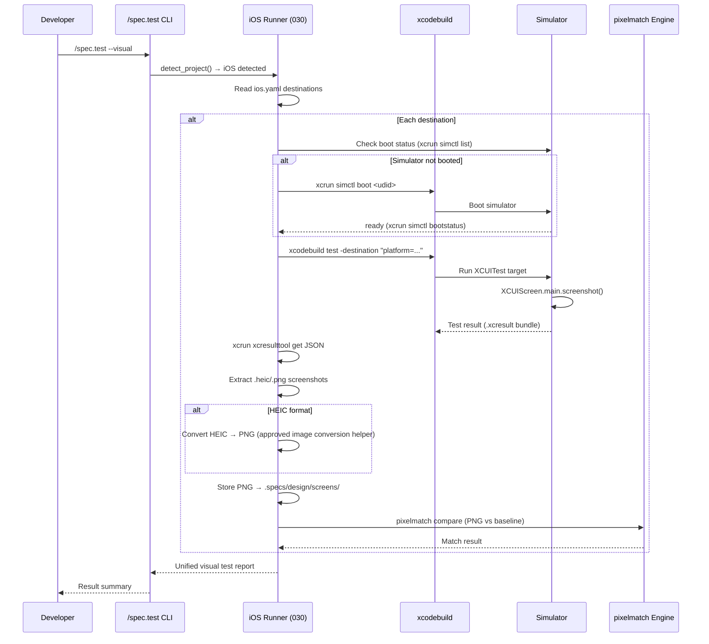
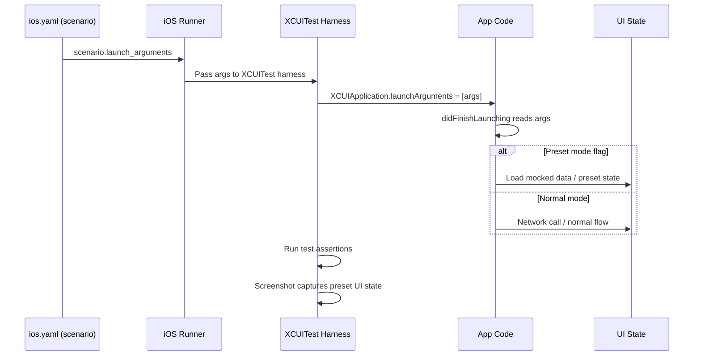
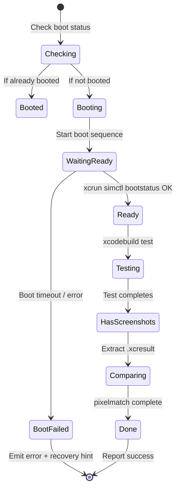
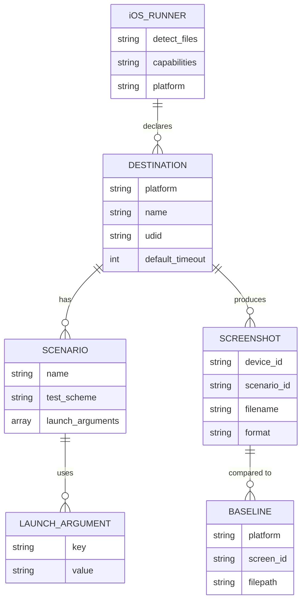

# Technical Plan: UI Runner iOS / watchOS (Feature 030)

- **Feature:** UI Runner iOS / watchOS (XCUITest)
- **Scope:** L (Large — 9 FR, multiple platforms, integration with existing runners)
- **Dependencies:** Feature 027 (UI Runner Architecture), Feature 019 (Swift test driver)
- **Estimated effort:** 6-8 implementation days

---

## Technical Context

| Aspect | Choice | Reason |
|---|---|---|
| Language | Python | Consistent with the validator and existing built-in runners |
| Test Framework | XCUITest (native) | Mature watchOS support; better than Maestro for state presets |
| Simulator Orchestration | xcrun simctl, xcodebuild | Apple-native tooling; no third-party dependency |
| Screenshot Capture | XCUIScreen.main.screenshot() | Native XCUITest API; extracted from .xcresult bundles |
| Screenshot Format | PNG (convert HEIC if needed) | Compatible with pixelmatch comparison engine (Feature 019) |
| State Management | launch_arguments | XCUIApplication.launchArguments; avoids UI-based setup |
| CI Platform | macOS CI runners | Apple simulator tooling is only available on macOS environments |

---

## Architecture Overview

The iOS/watchOS runner is a **single Python runner manifest** (`livespec/ui-runners/ios.yaml`) that:
1. Detects iOS and watchOS Xcode projects (`.xcodeproj`, `.xcworkspace`, `Package.swift`)
2. Provides 4+ capabilities: `detect_project`, `capture_screenshot`, `run_flow`, `compare_baseline`
3. Configures destinations (simulator targets) for each platform
4. Orchestrates `xcodebuild test` invocations
5. Parses `.xcresult` bundles to extract screenshots
6. Integrates with the pixelmatch comparison engine

### Design Decisions

1. **Single manifest for iOS + watchOS:** Both platforms share the same runner config with platform-specific destination filtering via the `--platform` flag.
2. **XCUITest over Maestro:** XCUITest provides finer state control (launchArguments, accessibility IDs) and mature watchOS support.
3. **Manifest-driven destinations:** Destinations are declared in `ios.yaml`, not hardcoded in code. This allows developers to test on multiple device models per CI job.
4. **.xcresult parsing:** Screenshots are extracted from Xcode's binary result bundle using `xcrun xcresulttool` JSON output, not captured via screen recording.
5. **Simulator auto-boot:** If a simulator is not booted, the runner boots it automatically and waits for ready state.

---

## Mermaid Diagrams

### Sequence Diagram — Visual Test Flow



### Sequence Diagram — Launch Arguments Flow



### State Diagram — Simulator Lifecycle



### ER Diagram — Configuration Entities



---

## Constitution Check

| Principle | Status | Notes |
|---|---|---|
| **Layered Validation** | ✅ | iOS runner manifest validates against UIRunnerSchema (Layer 1), capabilities validated (Layer 2) |
| **Provider-Agnostic LLM** | ✅ | No LLM calls in runner code; LLM only used for plan review (this doc) |
| **File-System as Truth** | ✅ | All config read from `ios.yaml`; results written to `.specs/design/screens/` |
| **Fail Fast** | ✅ | Missing Xcode → emit error immediately; simulator not available → emit error + recovery hint |
| **Minimal Surface** | ✅ | Single manifest; capabilities reuse UIRunner base interface |
| **No Hosted Infra** | ✅ | All tooling (Xcode, xcodebuild, xcrun) is local |

---

## Implementation Plan

### Infrastructure Setup (Prerequisite)

Before implementation can begin, verify development environment:

```markdown
**Step 0 — Preflight & Environment Setup** (Dependency: Feature 027 complete)

1. Verify Xcode is installed: `xcode-select -p` → `/Applications/Xcode.app/path`
   - If missing, emit hint: "Xcode not installed. Install from App Store or xcodes.dev"
   - If installed, capture version: `xcodebuild -version`

2. Accept Xcode license (if needed):
   - Run: `xcodebuild -license check`
   - If fail: emit hint "Run: sudo xcodebuild -license accept", exit 1

3. Verify iOS Simulator runtime:
   - Run: `xcrun simctl list devices | grep "iPhone 16"`
   - If missing: emit hint "iOS 18 Simulator not installed. Open Xcode > Settings > Platforms"

4. Verify watchOS Simulator runtime (if watchOS in scope):
   - Run: `xcrun simctl list devices | grep -i "apple watch"`
   - If missing: emit hint "watchOS Simulator not installed. Open Xcode > Settings > Platforms"
   - Mark as optional in early phases; enforce before watchOS stories run

5. Create/verify test fixtures:
   - Fixture iOS project: `.specs/fixtures/ios-app/` with basic XCUITest target
   - Fixture watchOS project: `.specs/fixtures/watchos-app/` with basic watchOS UI test target
   - Both fixtures have a simple screenshot test to verify runner integration

**Environment variables (optional, but useful):**
- `XCODE_SELECT_PATH` — override Xcode path detection
- `LIVESPEC_SKIP_XCRESULT` — for testing without real Xcode (mocked bundle)
```

### Phase 1 — Manifest & Detection (2–3 days)

**Step 1 — Author `ios.yaml` manifest** (FR-001, AC-001, AC-002, AC-003)

```markdown
**Step 1 — Create iOS/watchOS UI Runner Manifest**

Files: New
- `livespec/ui-runners/ios.yaml`

Work:
1. Define detect rules:
   - `detect.files`: Match `Package.swift` OR `*.xcodeproj` OR `*.xcworkspace`
   - `detect.platforms`: ["iOS", "watchOS"]

2. Define 4+ capabilities in order:
   - `detect_project` — Verify presence of UI test target (XCUITest framework)
   - `capture_screenshot` — Run xcodebuild test, extract .xcresult, export PNGs
   - `run_flow` — Run full XCUITest suite, report test pass/fail
   - `compare_baseline` — Delegate to pixelmatch engine

3. Define `destinations` array (AC-003):
   - Default iOS: `{platform: "iOS Simulator", name: "iPhone 16", udid: "auto-detect"}`
   - Optional watchOS: `{platform: "watchOS Simulator", name: "Apple Watch Series 10", udid: "auto-detect"}`

4. Define scenario fields:
   - `launch_arguments` → passed to XCUIApplication.launchArguments
   - `test_scheme` → name of XCUITest scheme in Xcode project
   - `timeout_seconds` → max time per test (default 300)

5. Validate manifest against UIRunnerSchema (imported from Feature 027)
   - Schema check: all required fields present
   - Capability names must match UIRunnerSchema interface

**FR covered:** FR-001.1: Manifest structure and detection rules

**Testing:** 
- Unit: Manifest parses as valid YAML + Pydantic model
- Integration: ios.yaml loaded and validated in test runner context
```

**Step 2 — Implement project detection**

```markdown
**Step 2 — Implement detect_project() Capability**

Files: New
- `validator/runners/ios.py` — iOS-specific runner implementation (module)

Files: Modified
- `validator/runners/__init__.py` — Register the iOS runner helpers if the shared runner package needs an export surface

Work:
1. Implement `detect_project()` function:
   - Read `ios.yaml` detect rules
   - Scan working directory for `.xcodeproj`, `.xcworkspace`, `Package.swift`
   - If found, check for XCUITest target in project file
   - Return UICapabilityResult.success() if both project + test target found
   - Return UICapabilityResult.failure() with hint if missing

2. Implement helper: `_find_xcode_project()` → returns Path to `.xcodeproj` or `.xcworkspace` or None

3. Implement helper: `_extract_ui_test_targets()` → parses Xcode project file (XML .pbxproj) to find XCUITest targets
   - Use native Python XML parsing (not xcodebuild query, which is slow)
   - Return list of test target names

**FR covered:** FR-001.2: Project detection implementation

**Testing:**
- Unit: Project detection on fixture projects
- Chaos: Missing .xcodeproj → clear error
```

---

### Phase 2 — Simulator Orchestration (2–3 days)

**Step 3 — Implement simulator boot orchestration** (FR-003, AC-008)

```markdown
**Step 3 — Simulator Boot Management**

Files: Modified
- `validator/runners/ios.py` — Add simulator helpers

Work:
1. Implement `_get_simulator_status(destination)` → "Booted" | "Shutdown" | "Unknown"
   - Run: `xcrun simctl list devices --json`
   - Parse JSON to find device by name or UDID
   - Return boot status

2. Implement `_boot_simulator_if_needed(destination, timeout=60)` → bool (success)
   - Call `_get_simulator_status()`
   - If "Booted" → return True (no action needed)
   - If "Shutdown" → run `xcrun simctl boot <udid>` and wait
   - Call `_wait_for_simulator_ready(udid, timeout)` → blocks until ready
   - Return True if ready, False if timeout

3. Implement `_wait_for_simulator_ready(udid, timeout)` → bool
   - Run: `xcrun simctl bootstatus <udid> -b` (blocks until ready or timeout)
   - Return True if exit code 0 (ready), False otherwise

4. Add error handling for missing runtime (EC-001, AC-009):
   - If simulator not found in `xcrun simctl list`, emit:
     ```
     "watchOS simulator runtime not installed. Install via Xcode > Settings > Platforms."
     ```
   - Exit 1 (failure, not skipped)

**FR covered:** FR-003.1: Simulator boot detection and orchestration, FR-003.2: Readiness waiting

**Testing:**
- Integration: Boot simulator on test fixture, verify ready
- EC-001: Missing runtime → proper error message
```

**Step 4 — Implement watchOS destination filtering** (FR-004, AC-007)

```markdown
**Step 4 — Platform-Specific Destination Filtering**

Files: Modified
- `validator/runners/ios.py` — Add platform filter

Work:
1. Implement `_filter_destinations_by_platform(destinations, platform="iOS")` → list
   - `platform` parameter: "iOS" (default), "watchOS"
   - Filter destinations array from manifest
   - Return only destinations matching the selected platform

2. Parse `--platform` flag:
   - If `--platform=watchos` provided, filter to watchOS destinations only
   - If absent, use iOS destinations (default)
   - If `--platform=ios` explicit, filter to iOS only

3. Validate platform availability:
   - For watchOS: verify `xcrun simctl list devices | grep -i "apple watch"`
   - If missing and watchOS requested → emit error (AC-009)

**FR covered:** FR-004.1: watchOS filtering and validation

**Testing:**
- Unit: Destination filtering logic
- Integration: Run with --platform=watchos on fixture, verify only watchOS destination runs
```

---

### Phase 3 — Screenshot Capture & Processing (2–3 days)

**Step 5 — Implement .xcresult bundle parsing** (FR-002, AC-004, AC-012)

```markdown
**Step 5 — Extract Screenshots from .xcresult Bundle**

Files: New
- `validator/runners/xcresult_parser.py` — Utility module for .xcresult parsing (shared with other runners)

Files: Modified
- `validator/runners/ios.py` — Use `xcresult_parser`

Work:
1. Implement `parse_xcresult_bundle(bundle_path)` → dict with extracted screenshots
   - Run: `xcrun xcresulttool get <bundle_path> --json`
   - Parse JSON output to extract attached screenshots
   - Handle both .png and .heic formats

2. Implement `_extract_attachments_from_json(json_data)` → list[{name, data, format}]
   - Navigate JSON structure to attachments section
   - Extract base64-encoded image data
   - Return list of (filename, binary_data, format) tuples

3. Implement `_convert_heic_to_png(heic_data) → bytes`
   - Use platform tooling or an already-approved image conversion helper to convert HEIC → PNG
   - Handle format detection (check magic bytes)
   - Return PNG binary

4. Implement `_export_screenshots(bundle_path, output_dir, destination_id)` → list[Path]
   - Parse bundle
   - For each screenshot:
     - Determine format (PNG or HEIC)
     - Convert HEIC to PNG if needed
     - Write to `.specs/design/screens/<destination_id>/<screen_id>.png`
   - Return list of exported file paths

5. Error handling (EC-002):
   - If .xcresult is corrupted, parse what's available and report as partial failure
   - Do not crash; collect partial results and emit warning

**FR covered:** FR-002.1: .xcresult parsing, FR-002.2: HEIC→PNG conversion

**Testing:**
- Unit: Parse mock .xcresult JSON
- Integration: Real xcodebuild test produces .xcresult; verify extraction
- Chaos: Corrupted .xcresult → partial extraction without crash
```

**Step 6 — Implement capture_screenshot capability** (AC-004, AC-012, AC-013)

```markdown
**Step 6 — capture_screenshot Capability**

Files: Modified
- `validator/runners/ios.py` — Implement capture capability

Work:
1. Implement `capture_screenshot(test_config, destination)` → UICapabilityResult
   - Boot simulator if needed (Step 3)
   - Run: `xcodebuild test -destination "platform=...,name=..." -scheme <test_scheme>`
   - Capture return code and .xcresult bundle path from xcodebuild output
   - Parse .xcresult (Step 5)
   - Export PNGs to `.specs/design/screens/<destination_id>/`
   - Return success with list of exported screenshot paths

2. Handle per-destination output (AC-013):
   - Create subdirectories per destination UDID or name
   - Example: `.specs/design/screens/iPhone_16/<screen>.png`
   - Update manifest config to allow custom output prefix per destination

3. Handle test scheme selection:
   - Read `test_scheme` from scenario config in ios.yaml
   - If not provided, auto-detect (ask xcodebuild to list schemes)
   - Default to first XCUITest scheme found

4. Error handling:
   - Xcode license not accepted: emit "sudo xcodebuild -license accept" (AC-014)
   - Missing runtime: emit specific hint (FR-004, AC-009)
   - Test timeout (EC-003): configurable per scenario, default 5 minutes

**FR covered:** FR-002.3: Screenshot capture orchestration

**Testing:**
- Integration: Fixture iOS project, capture real screenshots
- Chaos: Xcode license failure → proper error message
```

---

### Phase 4 — Test Flow & Launch Arguments (2 days)

**Step 7 — Implement run_flow capability** (FR-005, AC-005, AC-010)

```markdown
**Step 7 — run_flow Capability & Launch Arguments**

Files: Modified
- `validator/runners/ios.py` — Implement run_flow

Work:
1. Implement `run_flow(test_config, destination)` → UICapabilityResult
   - Boot simulator if needed
   - Prepare launch arguments from scenario config
   - Run: `xcodebuild test -destination ... -scheme ... [launch args]`
   - Capture test results from .xcresult
   - Parse test pass/fail status
   - Return success if all assertions pass, failure with failed test names otherwise

2. Implement launch argument injection (AC-010, FR-005):
   - Read `launch_arguments` array from scenario in ios.yaml
   - Pass via environment variable or test plan:
     - Option A: `XCUI_LAUNCH_ARGS` environment variable (simplest)
     - Option B: Xcode test plan (more robust, requires creating .xctestplan)
   - XCUITest harness code (in fixture app) reads args and presets state

3. Error handling:
   - Missing launch args in scenario → silently proceed with defaults
   - Test timeout (EC-003): per-scenario configurable, default 300 seconds
   - Concurrency issues (EC-003): add `--timeout` flag to xcodebuild command

**FR covered:** FR-005.1: Launch arguments injection, FR-005.2: Test flow execution

**Testing:**
- Unit: Launch argument parsing and formatting
- Integration: Fixture iOS app with launchArguments; verify state is preset
```

---

### Phase 5 — Baseline Comparison (1 day)

**Step 8 — Implement compare_baseline capability** (AC-006)

```markdown
**Step 8 — compare_baseline Capability**

Files: Modified
- `validator/runners/ios.py` — Implement compare_baseline

Work:
1. Implement `compare_baseline(captured_path, baseline_path)` → UICapabilityResult
   - Delegate entirely to pixelmatch comparison engine (Feature 019)
   - Call pixelmatch compare function with:
     - Captured PNG from `.specs/design/screens/`
     - Expected baseline from `.specs/design/screens/<screen>.png`
   - Return UICapabilityResult with match verdict

2. Integration with pixelmatch:
   - Verify pixelmatch module is available (Feature 019 dependency)
   - Pass through all pixelmatch config (threshold, diffing strategy)
   - Return match result: Pass | Fail with diff image path

**FR covered:** FR-006.1: Baseline comparison (via pixelmatch)

**Testing:**
- Unit: Mock pixelmatch calls
- Integration: Real screenshots vs baselines
```

---

### Phase 6 — Error Handling & Detection (1.5 days)

**Step 9 — Xcode License & Runtime Detection** (FR-006, AC-014, EC-001)

```markdown
**Step 9 — License & Runtime Error Handling**

Files: Modified
- `validator/runners/ios.py` — Add error detection helpers

Work:
1. Implement `_check_xcode_license()` → bool
   - Run: `xcodebuild -license check`
   - Parse output for license status
   - If not accepted, return False

2. Implement error detection in xcodebuild output parsing:
   - Parse stderr/stdout for patterns:
     - "license has not been accepted" → emit "sudo xcodebuild -license accept"
     - "unavailable for the destination" → suggest `xcrun simctl list devices`

3. Implement `_detect_missing_runtime(platform)` → str (error message) | None
   - Run: `xcrun simctl list devices`
   - Check for iOS Simulator (iOS) or Apple Watch (watchOS)
   - If missing, return specific hint per platform

4. Implement `_get_available_runtimes()` → list[str]
   - Run: `xcrun simctl list runtimes`
   - Parse available iOS/watchOS versions
   - Return for error messages

**FR covered:** FR-006.1: License detection, FR-006.2: Runtime detection

**Testing:**
- Unit: Error message parsing
- Chaos: Missing Xcode license → proper error + recovery hint
```

---

### Phase 7 — Integration Tests (2 days)

**Step 10 — Write integration tests** (FR-007, FR-008)

```markdown
**Step 10 — Integration Tests: Fixture Projects**

Files: New
- `tests/fixtures/ios-app/` — Minimal iOS app with XCUITest target
  - Simple SwiftUI view
  - Basic XCUITest that captures screenshot
  - Test scheme configured in Xcode project

- `tests/fixtures/watchos-app/` — Minimal watchOS app
  - Simple SwiftUI for Watch
  - Basic XCUITest for watchOS
  - Test scheme configured

- `tests/integration/test_ios_runner.py` — Integration test suite
  - Test 1: Detect iOS project
  - Test 2: Boot simulator
  - Test 3: Capture screenshot (runs real xcodebuild on fixture)
  - Test 4: Extract .xcresult and verify PNG output
  - Test 5: Launch arguments preset state correctly
  - Test 6: Xcode license error handling

- `tests/integration/test_watchos_runner.py` — watchOS-specific tests
  - Test 1: Detect watchOS project
  - Test 2: --platform=watchos filters destinations
  - Test 3: Capture watchOS simulator screenshot
  - Test 4: Missing watchOS runtime → proper error

Markers:
- iOS tests: `pytest.mark.macos` (skip on non-macOS CI)
- watchOS tests: `pytest.mark.macos` (skip on non-macOS CI)

**FR covered:** FR-007.1: iOS fixture and integration tests, FR-008.1: watchOS fixture and tests

**Testing:**
- Integration: Run on macOS only; all fixture tests pass
- CI: Skipped on Linux (EC-005)
```

---

### Phase 8 — Coordinated Execution (1 day)

**Step 11 — Implement Swift driver + iOS runner coordination** (AC-011, Story 4)

```markdown
**Step 11 — Coordinated XCTest + XCUITest Execution**

Files: Modified
- `validator/drivers/runner.py` or the `/spec.test` command module — Update runner dispatch

Work:
1. Update test orchestration logic:
   - When `/spec.test` is called (no --visual flag):
     - Detect both Swift driver (Feature 019) and iOS runner (030)
     - If both present, run sequentially:
       a. Swift driver → XCTest unit tests
       b. iOS runner → XCUITest visual tests
     - Merge results into unified summary

2. Implement `--visual` flag behavior:
   - `/spec.test --visual` → run only iOS runner (skip XCTest)
   - `/spec.test` (no flag) → run both driver and runner

3. Result aggregation:
   - Collect exit codes and pass/fail counts from both
   - Emit unified summary with breakdown (XCTest: N passed, XCUITest: N passed)

**FR covered:** FR-001.3: Coordination with Swift driver

**Testing:**
- Integration: Fixture project with both XCTest and XCUITest; run /spec.test
```

---

### Phase 9 — Documentation (1 day)

**Step 12 — Document XCUITest workflow** (FR-009)

```markdown
**Step 12 — Developer Documentation**

Files: New
- `.specs/guides/ios-ui-testing.md` — Workflow guide for iOS visual testing
  - How to set up Xcode project with XCUITest target
  - Recommended `accessibilityIdentifier` naming conventions for stable selectors
  - Example: launch_arguments for preset state
  - Troubleshooting: missing simulators, license errors
  - Fixture projects linked

Work:
1. Write setup guide:
   - Create new XCUITest target in Xcode
   - Configure test scheme
   - Add basic UI test with screenshot

2. Write selector guide:
   - accessibilityIdentifier best practices
   - Avoiding brittle selectors (avoid text, prefer IDs)
   - Example: `button.withAccessibilityIdentifier("submit_btn")`

3. Write launchArguments guide:
   - How to use in tests
   - Example app code reading args in didFinishLaunching
   - State preset patterns (logged-in user, mocked API, feature flags)

4. Link to fixture projects and error recovery hints

**FR covered:** FR-009.1: Developer documentation and guides

**Testing:**
- Manual: User follows guide, successfully runs iOS visual tests
```

---

## Testing Strategy

| Test Type | What | File | Command | FR/AC |
|---|---|---|---|---|
| Unit | Project detection logic | `tests/test_ios_detection.py` | `pytest tests/test_ios_detection.py -v` | FR-001, AC-002 |
| Unit | Simulator status parsing | `tests/test_simulator_state.py` | `pytest tests/test_simulator_state.py -v` | FR-003 |
| Unit | Destination filtering | `tests/test_destination_filter.py` | `pytest tests/test_destination_filter.py -v` | FR-004, AC-007 |
| Unit | .xcresult parsing | `tests/test_xcresult_parser.py` | `pytest tests/test_xcresult_parser.py -v` | FR-002, AC-012 |
| Unit | Launch args formatting | `tests/test_launch_args.py` | `pytest tests/test_launch_args.py -v` | FR-005, AC-010 |
| Integration | iOS project detection + boot | `tests/integration/test_ios_runner.py::test_detect_and_boot` | `pytest tests/integration/test_ios_runner.py::test_detect_and_boot -v -m macos` | FR-001, FR-003, AC-001, AC-003, AC-008 |
| Integration | Capture screenshot (fixture) | `tests/integration/test_ios_runner.py::test_capture_screenshot` | `pytest tests/integration/test_ios_runner.py::test_capture_screenshot -v -m macos` | FR-002, AC-004, AC-012 |
| Integration | Launch arguments preset | `tests/integration/test_ios_runner.py::test_launch_arguments` | `pytest tests/integration/test_ios_runner.py::test_launch_arguments -v -m macos` | FR-005, AC-010 |
| Integration | watchOS detection | `tests/integration/test_watchos_runner.py::test_detect_watchos` | `pytest tests/integration/test_watchos_runner.py::test_detect_watchos -v -m macos` | FR-004, AC-007, AC-009 |
| Integration | Xcode license error | `tests/integration/test_ios_runner.py::test_xcode_license_error` | `pytest tests/integration/test_ios_runner.py::test_xcode_license_error -v -m macos` | AC-014, FR-006 |
| Integration | Coordinated XCTest + XCUITest | `tests/integration/test_coordinated_execution.py` | `pytest tests/integration/test_coordinated_execution.py -v -m macos` | AC-011, Story 4 |
| Chaos | Missing .xcodeproj | `tests/chaos/test_ios_chaos.py::test_no_project` | `pytest tests/chaos/test_ios_chaos.py::test_no_project -v` | AC-002 |
| Chaos | Corrupted .xcresult | `tests/chaos/test_xcresult_chaos.py` | `pytest tests/chaos/test_xcresult_chaos.py -v` | EC-002 |

---

## Planned Verification Commands

| Action | Command | Tool | Status |
|---|---|---|---|
| Unit tests | `pytest tests/ -k "not integration" -v` | pytest | Pending |
| Integration tests | `pytest tests/integration/ -v -m macos` | pytest + macOS | Pending |
| Chaos tests | `pytest tests/chaos/ -v` | pytest | Pending |
| Type check | `pyright validator/runners/ --outputjson` | pyright | Pending |
| Lint | `ruff check validator/runners/` | ruff | Pending |
| Format check | `ruff format --check validator/runners/` | ruff | Pending |
| Full suite | `pytest tests/ -v && ruff check validator/ && pyright validator/ --outputjson` | pytest + ruff + pyright | Pending |

---

## API Contracts

This feature does not introduce new external API endpoints. The iOS runner is an internal module within LiveSpec's test infrastructure, invoked by `/spec.test` CLI.

**Internal interfaces (in `ios.yaml`):**
- `detect_project()` — returns UICapabilityResult
- `capture_screenshot()` — returns UICapabilityResult with screenshot paths
- `run_flow()` — returns UICapabilityResult with test pass/fail
- `compare_baseline()` — returns UICapabilityResult with match verdict

All conform to the `UIRunner` interface defined in Feature 027.

---

## Implementation Status

| Step | Title | Status | Dependencies |
|---|---|---|---|
| 0 | Infrastructure Setup | Pending | Xcode, Simulator runtimes |
| 1 | Manifest & Detection | Pending | Feature 027 |
| 2 | Project Detection | Pending | Step 1 |
| 3 | Simulator Orchestration | Pending | Step 2 |
| 4 | Platform Filtering | Pending | Step 3 |
| 5 | .xcresult Parsing | Pending | — |
| 6 | Screenshot Capture | Pending | Steps 3, 5 |
| 7 | Launch Arguments | Pending | Step 6 |
| 8 | Baseline Comparison | Pending | Feature 019, Step 6 |
| 9 | Error Handling | Pending | Steps 6, 8 |
| 10 | Integration Tests | Pending | Steps 1–9 |
| 11 | Coordinated Execution | Pending | Feature 019, Steps 1–10 |
| 12 | Documentation | Pending | Steps 1–11 |

---

## Risk Assessment

| Risk | Severity | Mitigation |
|---|---|---|
| Xcode version incompatibility | Medium | Test on multiple Xcode versions (15.x, 16.x); document required version in constitution |
| macOS-only tooling | Medium | Graceful skip on non-macOS CI (EC-005); document clearly |
| Simulator runtime installation | Medium | Provide automated preflight check; clear recovery hints |
| .xcresult parsing complexity | Low | Use xcrun xcresulttool JSON output (stable API); unit test parsing with fixtures |
| Launch arguments state preset race conditions | Low | Add 1-2 second delay after app launch before assertions; document timing assumptions |
| Screenshot format inconsistency (HEIC vs PNG) | Low | Explicitly handle both formats; convert HEIC → PNG before comparison |

---

## Definition of Done

- [ ] `ios.yaml` manifest exists and validates against UIRunnerSchema
- [ ] All 9 FR implemented and mapped to steps
- [ ] All 14 AC testable and verified
- [ ] Project detection working on fixture iOS + watchOS projects
- [ ] Simulator boot orchestration verified (auto-boot + ready check)
- [ ] Screenshot extraction from .xcresult working (both PNG and HEIC)
- [ ] Launch arguments correctly preset app state
- [ ] Platform filtering (--platform=watchos) working
- [ ] Error messages clear for missing Xcode, license, runtimes
- [ ] Integration tests pass on macOS; skipped on Linux
- [ ] Coordinated execution with Swift driver (Feature 019) working
- [ ] Documentation complete: setup guide, selector conventions, troubleshooting
- [ ] All 3 architecture principles validated (Simplicity, Separation, Testing)
- [ ] Next action: `/spec.implement 030-ui-runner-ios-watchos`

---

*Technical Plan — Feature 030 — 2026-05-07*

## Summary

Technical plan for Ui Runner Ios Watchos.

## Risks & Considerations

- Keep this compatibility plan aligned with the living spec and implementation map.
