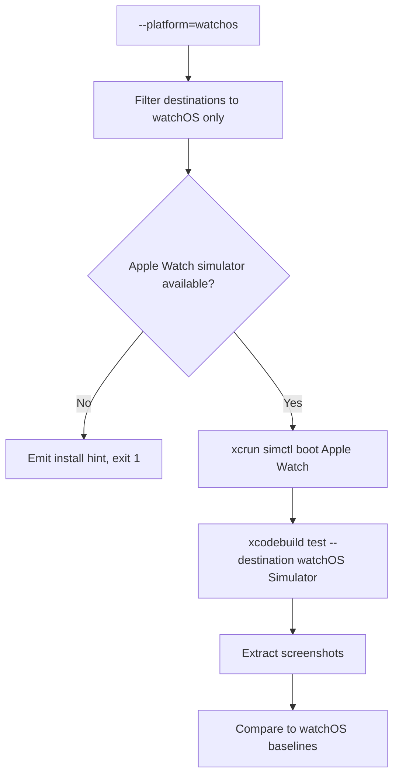
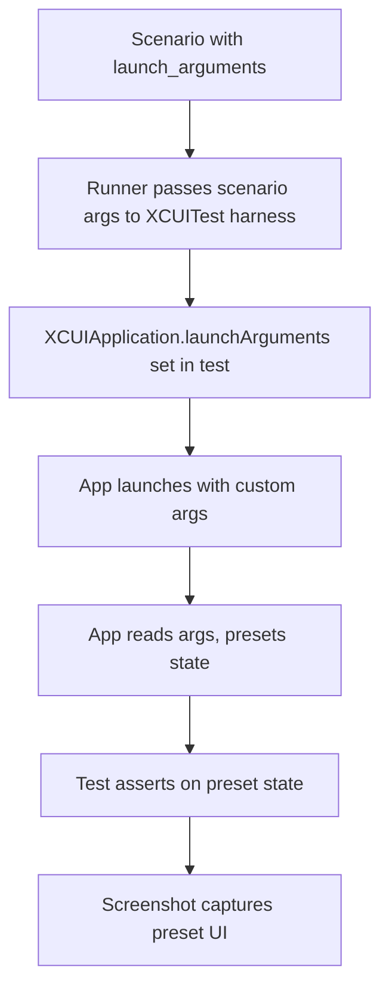

# Feature Spec: UI Runner iOS / watchOS (XCUITest)

- **Feature:** UI Runner iOS / watchOS
- **Branch:** feature/030-ui-runner-ios-watchos
- **Date:** 2026-05-06
- **Status:** Draft
- **Priority:** P1
- **Scope:** L
- **Input:** Built-in UI runner for iOS and watchOS native apps, using XCUITest (Apple's native UI testing framework) — chosen over Maestro because watchOS support in Maestro is experimental, and XCUITest provides finer matching, better stability, and access to launchArguments / state preconditions. The runner orchestrates xcodebuild test invocations against simulator destinations, captures XCUIScreen.main.screenshot() outputs as PNG baselines, and integrates with the existing pixelmatch comparison logic. Single runner covers both iOS and watchOS through configurable destination scheme.
- **Feature Number:** 030
- **Deps:** 027, 019

---

## User Scenarios & Testing

### Story 1 — Developer runs visual tests on iOS simulator `P1`

A developer with an iOS project (Xcode workspace + UI test target) runs `/spec.test --visual`. The iOS runner invokes `xcodebuild test` against an iOS Simulator destination, runs XCUITest tests that capture screenshots via `XCUIScreen.main.screenshot()`, exports the PNGs, and compares them to `.specs/design/screens/<screen>.png` baselines.

**Priority reason:** iOS is the priority Apple platform with mature tooling. Visual testing is the primary user-facing surface.

**Independent test:** Run on a fixture iOS project with a basic XCUITest test; verify screenshot is captured, exported, and compared.

```gherkin
Feature: iOS visual testing via XCUITest
  Scenario: Default iPhone simulator destination
    Given an iOS project with an Xcode workspace and UI test target
    And no destination override configured
    When the developer runs /spec.test --visual
    Then the iOS runner uses destination "platform=iOS Simulator,name=iPhone 16"
    And xcodebuild test runs the UI test scheme
    And screenshots are extracted from the .xcresult bundle
    And compared to .specs/design/screens/

  Scenario: Multiple simulators configured
    Given the runner manifest declares destinations for iPhone 16 and iPhone 16 Pro
    When /spec.test --visual runs
    Then xcodebuild test runs once per declared destination
    And screenshots are stored under per-destination subdirectories

  Scenario: Specific simulator not booted — auto-boot
    Given destination "iPhone 16" is not booted
    When the runner needs to capture
    Then xcrun simctl boot "iPhone 16" runs first
    And the runner waits until the simulator is ready
    And then proceeds with xcodebuild test
```

```mermaid
flowchart TD
    A[/spec.test --visual] --> B[iOS runner detected: Package.swift or .xcodeproj]
    B --> C[Read destinations from manifest]
    C --> D[For each destination]
    D --> E{Simulator booted?}
    E -- No --> F[xcrun simctl boot]
    E -- Yes --> G[xcodebuild test]
    F --> G
    G --> H[Test produces .xcresult bundle]
    H --> I[Extract attached screenshots]
    I --> J[Convert HEIC to PNG if needed]
    J --> K[Compare to baselines]
    K --> L{More destinations?}
    L -- Yes --> D
    L -- No --> M[Aggregate results]
```

---

### Story 2 — Developer runs visual tests on watchOS simulator `P1`

The runner supports watchOS targets. With a `--platform=watchos` flag (or matching destination in the manifest), `xcodebuild test` runs against an Apple Watch Simulator.

**Priority reason:** watchOS is in v1 scope per the user's existing usage. Native XCUITest is the only mature option.

**Independent test:** Run on a fixture watchOS project; verify screenshot is captured from Apple Watch simulator.

```gherkin
Feature: watchOS visual testing via XCUITest
  Scenario: Apple Watch simulator destination
    Given a watchOS project with a watchOS UI test target
    And the manifest declares destination "platform=watchOS Simulator,name=Apple Watch Series 10"
    When /spec.test --visual --platform=watchos runs
    Then xcodebuild test runs against the Apple Watch destination
    And screenshots reflect the smaller watch viewport
    And compared to baselines specifically tagged for watchOS

  Scenario: watchOS simulator runtime missing
    Given the watchOS simulator runtime is not installed
    When the runner attempts to use it
    Then the runner emits: "watchOS simulator runtime not installed. Install via Xcode > Settings > Platforms."
    And exits 1
```



---

### Story 3 — Test scenarios use launchArguments to preset state `P2`

XCUITest supports launching the app with a custom argument list. The runner manifest exposes a `launch_arguments` field per scenario so tests can preset state (logged-in user, mocked server, feature flags) without UI navigation.

**Priority reason:** This is the primary advantage of XCUITest over Maestro. It allows fast, deterministic state setup that would be slow or impossible to reproduce via UI clicks.

**Independent test:** Run a scenario with `launch_arguments: ["--ui-test-mode", "--mock-data=./fixtures/dashboard.json"]` and verify the app starts in the expected state.

```gherkin
Feature: launchArguments for state presets
  Scenario: Test launches app with custom arguments
    Given a manifest scenario with launch_arguments
    When the test runs
    Then the XCUITest harness sets XCUIApplication.launchArguments before launch
    And the app reads them in didFinishLaunching
    And the test sees the preset state

  Scenario: Multiple scenarios with different argument sets
    Given two scenarios "logged_in" and "logged_out" with different launch_arguments
    When the runner executes them
    Then each launches the app with its own argument set
    And screenshots reflect each state independently
```



---

### Story 4 — Developer runs both unit tests (XCTest) and UI tests in same flow `P2`

The Swift driver (Feature 019) handles XCTest unit tests. The iOS UI runner (this feature) handles XCUITest UI tests. Both can run in the same `/spec.test` invocation if the project has both targets.

**Priority reason:** Avoid forcing developers to invoke two separate commands. Coverage + visual is the natural workflow.

**Independent test:** Run `/spec.test` (no flags) on a project with both XCTest and XCUITest targets; verify both execute.

```gherkin
Feature: Coordinated XCTest + XCUITest execution
  Scenario: Both test types run from one command
    Given an iOS project with XCTest unit target and XCUITest UI target
    When /spec.test runs (no flags)
    Then the Swift driver (019) runs XCTest unit tests
    And the iOS UI runner (030) runs XCUITest UI tests
    And both report into the unified /spec.test summary

  Scenario: Visual-only invocation
    Given the same project
    When /spec.test --visual runs
    Then only the iOS UI runner executes
    And XCTest unit tests are skipped
```

```mermaid
flowchart TD
    A[/spec.test] --> B[Active driver: Swift driver 019]
    A --> C[Active UI runner: iOS runner 030]
    B --> D[Run XCTest unit tests]
    C --> E[Run XCUITest UI tests]
    D --> F[Driver result]
    E --> G[UI runner result]
    F --> H[Unified summary]
    G --> H
```

---

## Acceptance Criteria

- **AC-001** — `livespec/ui-runners/ios.yaml` exists and validates against `UIRunnerSchema`. (Both iOS and watchOS share this single manifest.)
- **AC-002** — `detect.files` matches projects with `Package.swift` AND/OR `*.xcodeproj` / `*.xcworkspace`.
- **AC-003** — The manifest declares a `destinations` array with at least one default iOS Simulator destination; watchOS destinations added when relevant target is detected.
- **AC-004** — `capture_screenshot` capability runs `xcodebuild test` against the configured destination, parses the `.xcresult` bundle to extract attached screenshots, exports PNGs.
- **AC-005** — `run_flow` capability runs the full XCUITest scheme (assertions + navigation), surfaces test failures as `UICapabilityResult.failure` with the failed test names.
- **AC-006** — `compare_baseline` capability re-uses the pixelmatch comparison logic introduced for the web runner (Feature 028) — single comparison engine across all UI runners.
- **AC-007** — `--platform=watchos` flag filters destinations to watchOS only; without it, only iOS destinations run.
- **AC-008** — Simulator auto-boot: if the target destination simulator is not booted, the runner runs `xcrun simctl boot <udid>` and waits for ready before running tests.
- **AC-009** — Missing watchOS simulator runtime → clear error message pointing to Xcode > Settings > Platforms (not generic "destination not found").
- **AC-010** — `launch_arguments` field per scenario is made available to the XCUITest harness, which sets `XCUIApplication.launchArguments` before app launch.
- **AC-011** — Coordinated execution: `/spec.test` (no flags) runs both Swift driver (019) XCTest unit tests AND this UI runner's XCUITest UI tests; `/spec.test --visual` runs only the UI runner.
- **AC-012** — Screenshots are extracted from `.xcresult` (binary format) and converted to PNG; HEIC intermediate is handled correctly.
- **AC-013** — Per-destination output: when multiple destinations are declared, screenshots are stored under `.specs/design/screens/<destination_id>/<screen>.png` (or similar).
- **AC-014** — License acceptance: if `xcodebuild` reports the Xcode license is not accepted, the runner emits `sudo xcodebuild -license accept` as the recovery command.

---

## Functional Requirements

- **FR-001** — Author `livespec/ui-runners/ios.yaml` with detect rule, 4+ capabilities, and a `destinations` array.
- **FR-002** — Implement `.xcresult` bundle parsing: extract attached screenshots using `xcrun xcresulttool get` JSON output and convert HEIC → PNG.
- **FR-003** — Implement simulator boot orchestration: detect boot state via `xcrun simctl list devices`, boot if needed, wait for ready (`xcrun simctl bootstatus`).
- **FR-004** — Implement watchOS-specific filtering: parse target schemes from project, filter destinations matching watchOS criteria.
- **FR-005** — Implement launch_arguments injection: pass scenario values into the XCUITest harness (for example via a test plan or environment payload) so the test code sets `XCUIApplication.launchArguments` before launch.
- **FR-006** — Implement license acceptance detection: parse xcodebuild stderr for license-not-accepted patterns, emit recovery hint.
- **FR-007** — Write integration tests on a minimal iOS fixture project on macOS (skipped on non-macOS CI).
- **FR-008** — Write a separate integration test for watchOS using a minimal watchOS fixture.
- **FR-009** — Document the workflow: how to set up XCUITest target, recommended `accessibilityIdentifier` conventions for stable selectors.

---

## Key Entities

| Entity | Description |
|---|---|
| `ios.yaml` | Built-in iOS/watchOS UI runner manifest. |
| Xcode destination | `platform=iOS Simulator,name=iPhone 16` or `platform=watchOS Simulator,name=Apple Watch Series 10`. |
| `.xcresult` bundle | Xcode test result bundle containing logs, screenshots, performance metrics. |
| `XCUIApplication.launchArguments` | Array of strings passed to the app at launch — used for state preset. |

---

## Infrastructure Requirements

| Resource | Type | Provider | Environment | When |
|---|---|---|---|---|
| **Xcode** | Tooling | App Store / xcodes CLI | dev only (macOS) | Required — provides xcodebuild, xcrun, simctl |
| Xcode license accepted | Init | `sudo xcodebuild -license accept` | dev only | Required to run xcodebuild |
| **iOS Simulator runtime** | Tooling | Xcode > Settings > Platforms | dev only | Required — iOS 18.x by default |
| **watchOS Simulator runtime** | Tooling | Xcode > Settings > Platforms | dev only | Required when watchOS in scope |
| iPhone Simulator device | Init | `xcrun simctl create "iPhone 16" iPhone16` | dev only | Created automatically by /spec.preflight --fix |
| Apple Watch Simulator device | Init | `xcrun simctl create "Apple Watch Series 10" ...` | dev only | Created when watchOS in scope |
| Apple Developer team (read-only sufficient) | Auth | developer.apple.com | dev only | Optional — needed only if app uses entitlements |

---

## Edge Cases

- **EC-001** — Simulator runtime version mismatch (e.g., manifest expects iOS 18 but only iOS 17 installed): runner emits clear message listing available runtimes and suggested install command.
- **EC-002** — `.xcresult` bundle is corrupted or partial (test killed mid-run): runner reports as `failure` with the partial test names recovered.
- **EC-003** — Test target uses Swift Concurrency (async/await) that hangs: configurable timeout per scenario; default 5 minutes.
- **EC-004** — Multiple Xcode versions installed: runner uses `xcode-select -p` to determine active; `xcodes select` integration optional.
- **EC-005** — CI runs on Linux (no macOS): runner detects platform and emits "iOS UI runner requires macOS — skipped on non-macOS hosts" — exit 0 (skipped, not failure).
- **EC-006** — App requires code signing for simulator (rare but possible with entitlements): runner provides hint about disabling via `CODE_SIGN_IDENTITY=""` for simulator builds.

---

## Success Criteria

- **SC-001** — Visual test on a fixture iOS project produces a PNG screenshot extracted from `.xcresult` and compared to baseline.
- **SC-002** — Visual test on a fixture watchOS project produces a watchOS-sized PNG screenshot.
- **SC-003** — `--platform=watchos` correctly filters to watchOS destinations only.
- **SC-004** — Simulator auto-boot adds < 30s overhead on cold start.
- **SC-005** — `launchArguments` correctly preset state in a fixture app verified by visual diff.
- **SC-006** — Coordinated `/spec.test` runs both XCTest (driver 019) and XCUITest (this runner) without conflict.

---

*LiveSpec Feature 030 — Draft — 2026-05-06*
