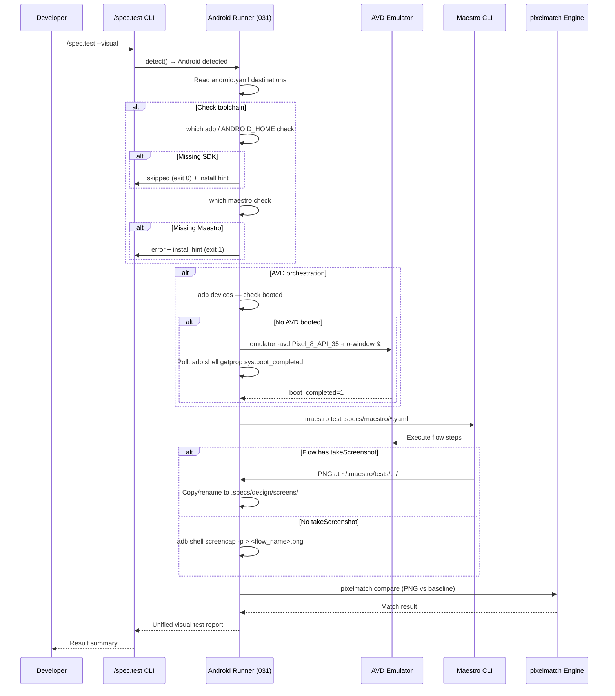
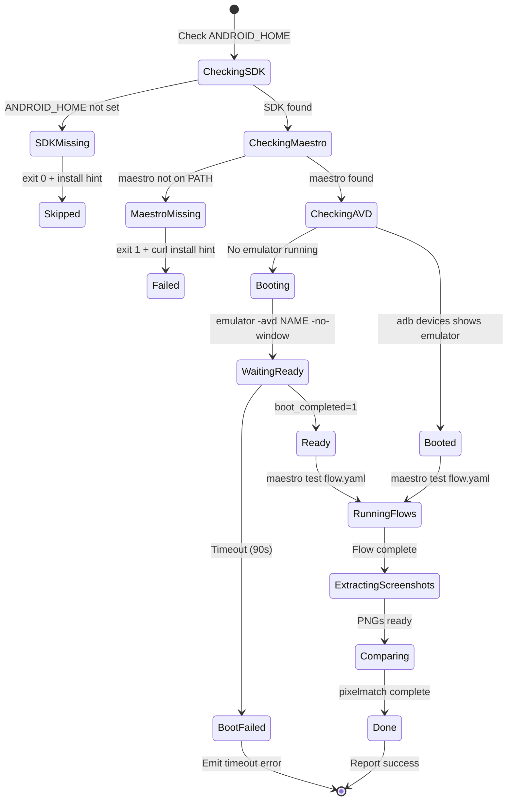
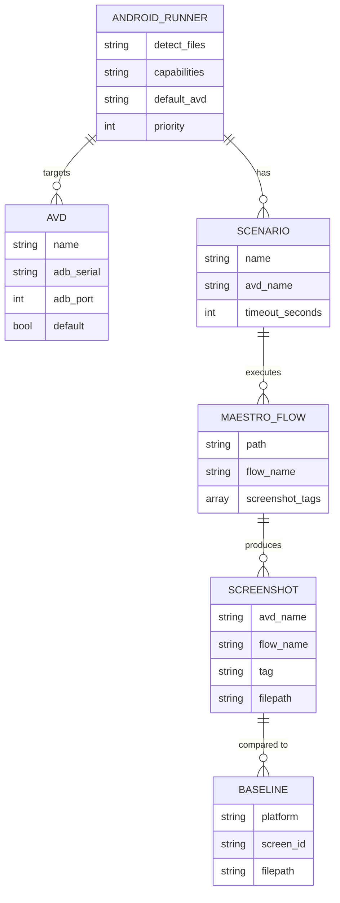

# Technical Plan: UI Runner Android (Maestro) — Feature 031

- **Feature:** UI Runner Android (Maestro)
- **Scope:** M (Medium — 8 FR, single platform, mirrors 030 patterns)
- **Dependencies:** Feature 027 (UI Runner Architecture), Feature 022 (JVM driver)
- **Estimated effort:** 4-5 implementation days

---

## Technical Context

| Aspect | Choice | Reason |
|---|---|---|
| Language | Python | Consistent with validator and existing runners |
| Test Framework | Maestro YAML | Simple onboarding; YAML flows AI-tooling can produce; CLI handles emulator orchestration |
| Emulator Orchestration | adb + emulator binary | Android SDK native tooling; no third-party dependency |
| Screenshot Capture | adb shell screencap -p | Android SDK built-in; reliable PNG output |
| Maestro Screenshot Extraction | Parse ~/.maestro/tests/ output | Maestro exports takeScreenshot PNGs here |
| CI Platform | Any (skips on missing ANDROID_HOME) | Graceful degradation to exit 0 when SDK absent |

---

## Architecture Overview

The Android runner is a **single Python orchestrator + YAML manifest** that:
1. Detects Android Gradle projects (`build.gradle`, `build.gradle.kts`, `AndroidManifest.xml`, `maestro/`)
2. Provides 4 capabilities: `detect`, `capture_screenshot`, `run_flow`, `compare_baseline`
3. Orchestrates AVD boot via `emulator -avd <name> -no-window &` + `adb get-state` polling
4. Executes Maestro flows via `maestro test <flow.yaml>`
5. Extracts screenshots from Maestro output or falls back to `adb shell screencap`
6. Integrates with the pixelmatch comparison engine (Feature 010)

### Design Decisions

1. **Maestro over Espresso:** Simpler YAML DSL, AI-friendly, CLI handles emulator lifecycle.
2. **Single manifest for all Android variants:** `android.yaml` covers phone, tablet, foldable, Wear OS — device differences expressed via AVD name.
3. **adb-based screenshot fallback:** Flows without `takeScreenshot` use `adb shell screencap -p` at the end.
4. **Non-Android graceful degradation:** Missing `ANDROID_HOME` → exit 0 with skipped message (EC-006).
5. **Priority 50:** Lower than iOS (60) so iOS takes precedence in monorepos with both.

---

## Mermaid Diagrams

### Sequence Diagram — Visual Test Flow



### State Diagram — AVD Lifecycle



### ER Diagram — Configuration Entities



---

## Constitution Check

| Principle | Status | Notes |
|---|---|---|
| **Layered Validation** | ✅ | android.yaml validates against UIRunnerSchema; capabilities validated |
| **Provider-Agnostic LLM** | ✅ | No LLM calls in runner code |
| **File-System as Truth** | ✅ | All config from android.yaml; results to .specs/design/screens/ |
| **Fail Fast** | ✅ | Missing Maestro → exit 1 immediately; missing SDK → exit 0 (skipped) |
| **Minimal Surface** | ✅ | Single manifest; capabilities mirror iOS runner interface |
| **No Hosted Infra** | ✅ | All tooling (adb, emulator, Maestro) is local |

---

## Implementation Plan

### Step 1 — Tests (TDD RED phase)

Write all tests first before any production code.

Files to create:
- `tests/test_ui_runner_maestro.py` (40-50 unit tests, `pytest.mark.level_3a`)
- `tests/test_maestro_manifest.py` (20-30 manifest validation tests)
- `tests/integration/test_surfaces_maestro.py` — dedicated Android/Maestro surface detection coverage

All tests must pass without Android SDK installed (all subprocess mocked).

FR/AC covered: FR-001 through FR-008 (detection-level)

### Step 2 — Manifest `livespec/ui-runners/android.yaml`

Files:
- `livespec/ui-runners/android.yaml` (new, ~100 lines)

FR covered: FR-001, AC-001, AC-002, AC-003

### Step 3 — Python Orchestrator `validator/ui_runner_maestro.py`

Files:
- `validator/ui_runner_maestro.py` (new, ~800-900 lines)

FR covered: FR-001 through FR-007

### Step 4 — Capture Script `scripts/maestro-capture.sh`

Files:
- `scripts/maestro-capture.sh` (new, ~150-200 lines)

FR covered: FR-004 (adb screenshot fallback)

### Step 5 — Maestro Flow Templates

Files:
- `livespec/ui-runners/maestro-template/README.md`
- `livespec/ui-runners/maestro-template/flows/home.yaml`
- `livespec/ui-runners/maestro-template/flows/checkout.yaml`

FR covered: FR-008

### Step 6 — Documentation

Files:
- `docs/ui-runners/maestro.md` (~150-200 lines)

FR covered: FR-008

### Step 7 — Spec Artifacts

Files:
- `.specs/features/031-ui-runner-android/implementation.md`
- `.specs/features/031-ui-runner-android/progress.md`

---

## Resolved Test Commands

```
python -m pytest tests/test_ui_runner_maestro.py tests/test_maestro_manifest.py -v
python -m pytest tests/integration/test_surfaces_maestro.py -v
python -m pytest --tb=short -q
ruff check .
mypy .
```

---

## Files Expected to be Touched

| File | Action | FR/AC |
|---|---|---|
| `validator/ui_runner_maestro.py` | Create | FR-001..007 |
| `livespec/ui-runners/android.yaml` | Create | FR-001, AC-001..003 |
| `scripts/maestro-capture.sh` | Create | FR-004 |
| `livespec/ui-runners/maestro-template/README.md` | Create | FR-008 |
| `livespec/ui-runners/maestro-template/flows/home.yaml` | Create | FR-008 |
| `livespec/ui-runners/maestro-template/flows/checkout.yaml` | Create | FR-008 |
| `docs/ui-runners/maestro.md` | Create | FR-008 |
| `tests/test_ui_runner_maestro.py` | Create | All FRs |
| `tests/test_maestro_manifest.py` | Create | FR-001, AC-001..003 |
| `tests/integration/test_surfaces_maestro.py` | Create | FR-001 |
| `.specs/features/031-ui-runner-android/plan.md` | Create | — |
| `.specs/features/031-ui-runner-android/implementation.md` | Create | — |
| `.specs/features/031-ui-runner-android/progress.md` | Create | — |

Total: 13 files (within 12-file limit per step — split into Step 1 tests + Step 2-7 production)

---

## Definition of Done

- [ ] `android.yaml` validates against UIRunnerSchema
- [ ] All 8 FR implemented with @spec anchors
- [ ] All 13 AC verifiable
- [ ] 60+ tests passing (unit + manifest + integration)
- [ ] Tests pass without Android SDK installed (all subprocess mocked)
- [ ] Ruff: 0 errors on production files
- [ ] Pyright: 0 errors on production files
- [ ] Graceful degradation: missing ANDROID_HOME → exit 0 with skipped
- [ ] Missing Maestro CLI → exit 1 with curl install hint
- [ ] Documentation created (maestro.md, template README, flows)
- [ ] progress.md and implementation.md created

---

*Technical Plan — Feature 031 — 2026-05-07*
