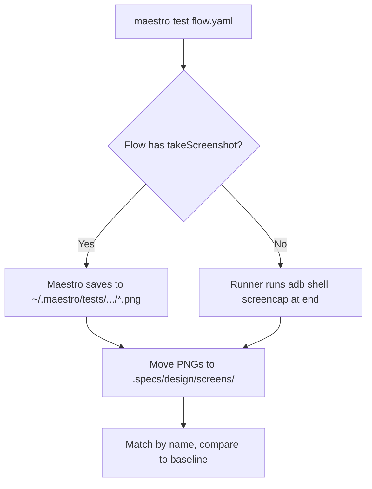
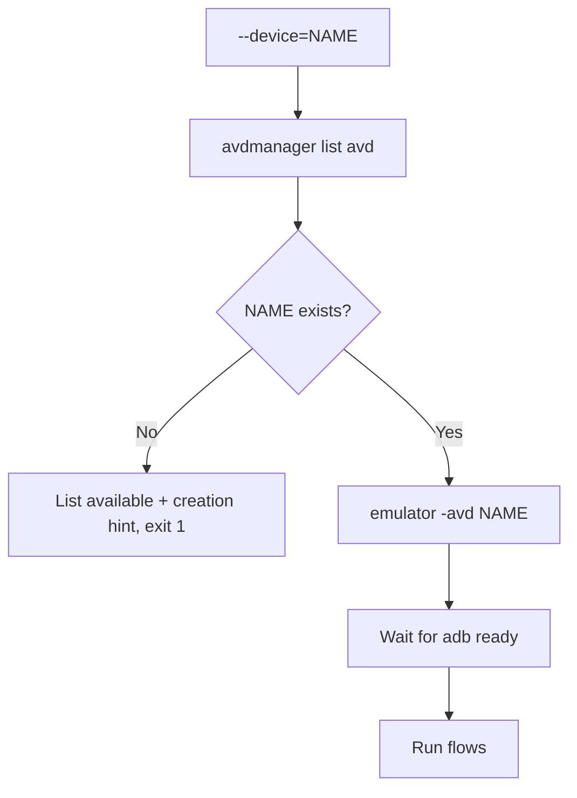

# Feature Spec: UI Runner Android (Maestro)

- **Feature:** UI Runner Android
- **Branch:** feature/031-ui-runner-android
- **Date:** 2026-05-06
- **Status:** Draft
- **Priority:** P2
- **Scope:** M
- **Input:** Built-in UI runner for Android native apps (Kotlin or Java), using Maestro (YAML-based mobile test framework) — chosen over Espresso for Android because Maestro has the simpler onboarding curve, YAML-readable flows that LiveSpec's AI tooling can produce reliably, and the Maestro CLI handles emulator orchestration cleanly. Hybrid Design 3 with iOS: Apple uses XCUITest native (Feature 030), Android uses Maestro YAML — each platform in its best-fit tool. Single runner manifest covers all Android variants (phone, tablet, foldable, Wear OS).
- **Feature Number:** 031
- **Deps:** 027, 022

---

## User Scenarios & Testing

### Story 1 — Developer runs Maestro flows on Android emulator `P1`

A developer with an Android project (build.gradle / build.gradle.kts) runs `/spec.test --visual`. The Android runner detects the project, boots an AVD if needed, runs Maestro YAML flows from `.specs/maestro/` directory, captures screenshots after each flow step, and compares to baselines.

**Priority reason:** Maestro's main entry point — running flows on emulator is the bread and butter of Android UI testing.

**Independent test:** Run on a fixture Android app with a `dashboard.yaml` flow; verify the emulator boots, the flow runs, screenshots are captured.

```gherkin
Feature: Android Maestro flow execution
  Scenario: Default emulator and first flow run
    Given an Android project with build.gradle.kts
    And a Maestro flow at .specs/maestro/dashboard.yaml
    And no AVD currently booted
    When the developer runs /spec.test --visual
    Then the runner boots the configured AVD (default: Pixel_8_API_35)
    And maestro test .specs/maestro/dashboard.yaml runs
    And screenshots are captured at each tagged step
    And compared to baselines in .specs/design/screens/

  Scenario: Multiple flows run sequentially
    Given .specs/maestro/ has flows: login.yaml, dashboard.yaml, settings.yaml
    When /spec.test --visual runs
    Then each flow runs in order
    And per-flow results are reported
    And one failed flow does not stop the others (configurable)

  Scenario: Maestro CLI not installed — clear hint
    Given Maestro CLI is not on PATH
    When /spec.test --visual runs
    Then the runner emits: "Maestro CLI not installed. Install: curl -Ls https://get.maestro.mobile.dev | bash"
    And exits 1 (required tool)
```

```mermaid
flowchart TD
    A[/spec.test --visual] --> B[Android runner detected]
    B --> C{Maestro on PATH?}
    C -- No --> D[Emit install hint, exit 1]
    C -- Yes --> E{AVD booted?}
    E -- No --> F[emulator -avd Pixel_8_API_35 -no-window &]
    E -- Yes --> G[Run flows sequentially]
    F --> H[Wait for adb device ready]
    H --> G
    G --> I[For each flow: maestro test flow.yaml]
    I --> J[Capture screenshots]
    J --> K[Compare to baselines]
    K --> L[Aggregate results]
```

---

### Story 2 — Developer captures pre-tagged screenshots in flows `P2`

Maestro flows can emit `takeScreenshot: <name>` commands. The runner extracts each tagged screenshot, renames to the tag, and feeds them into the baseline comparison pipeline.

**Priority reason:** Allows precise control over which moments in a flow are captured for visual regression — critical for screen-by-screen baselines.

**Independent test:** Run a flow with multiple `takeScreenshot` tags; verify each PNG is exported with the correct name.

```gherkin
Feature: Maestro tagged screenshots
  Scenario: takeScreenshot tags exported as named PNGs
    Given a Maestro flow with takeScreenshot: dashboard, takeScreenshot: settings
    When the flow runs
    Then dashboard.png and settings.png are exported to .specs/design/screens/
    And they replace the previous baselines if --update-baselines is set

  Scenario: Flow without takeScreenshot — auto-capture at end
    Given a flow with no explicit takeScreenshot
    When the flow runs
    Then the runner auto-captures one screenshot at the end of the flow
    And names it <flow_name>.png
```



---

### Story 3 — Developer overrides default device for testing edge cases `P3`

The manifest declares a default AVD but supports `--device=<id>` to switch. Useful for testing tablet, foldable, or specific API levels.

**Priority reason:** Real Android coverage requires multiple form factors. Default suffices for most cases but flexibility matters.

**Independent test:** Run with `--device=Pixel_Tablet_API_34` on a fixture; verify the correct AVD boots and screenshots reflect tablet dimensions.

```gherkin
Feature: Device override
  Scenario: Override default AVD
    Given the default AVD is Pixel_8_API_35
    When the developer runs /spec.test --visual --device=Pixel_Tablet_API_34
    Then Pixel_Tablet_API_34 boots instead
    And screenshots reflect tablet viewport
    And per-device baselines are stored under .specs/design/screens/Pixel_Tablet_API_34/

  Scenario: Specified AVD does not exist
    Given the AVD name does not match any avdmanager list
    When the runner attempts to boot
    Then the runner emits the list of available AVDs
    And a hint to create one: "avdmanager create avd -n <name> -k <system-image>"
    And exits 1
```



---

## Acceptance Criteria

- **AC-001** — `livespec/ui-runners/android.yaml` exists and validates against `UIRunnerSchema`.
- **AC-002** — `detect.files` matches projects with `build.gradle` or `build.gradle.kts` AND an `androidx.core` or similar Android-specific dependency in the build file.
- **AC-003** — Android runner takes priority over plain JVM driver match (more specific = higher priority) — but JVM driver still runs for unit tests via Feature 022.
- **AC-004** — `run_flow` capability invokes `maestro test <flow_path>` for each flow in `.specs/maestro/*.yaml`.
- **AC-005** — `capture_screenshot` capability handles two cases: (a) flows with `takeScreenshot` tags → extract and rename; (b) flows without → auto-capture at end via `adb shell screencap`.
- **AC-006** — `compare_baseline` capability re-uses the pixelmatch comparison logic from web/iOS runners — single comparison engine.
- **AC-007** — Emulator auto-boot: if no AVD is booted, the runner runs `emulator -avd <default>` and waits for `adb get-state` to return "device".
- **AC-008** — `--device=<name>` flag overrides the default AVD; if the AVD does not exist, runner lists available ones and emits a creation hint.
- **AC-009** — Maestro CLI absence emits a clear curl-install hint and exits 1 (required tool).
- **AC-010** — Per-device baselines: when `--device` is overridden, screenshots are stored under `.specs/design/screens/<device_name>/<screen>.png`.
- **AC-011** — Failed flow does not stop other flows by default (configurable via `--fail-fast`).
- **AC-012** — Coordinated execution: `/spec.test` (no flags) runs JVM driver (022) unit tests AND this UI runner's Maestro flows; `/spec.test --visual` runs only the UI runner.
- **AC-013** — Wear OS support: a `--platform=wearos` flag filters to Wear OS AVDs (uses Maestro's experimental Wear OS support — emits an experimental warning).

---

## Functional Requirements

- **FR-001** — Author `livespec/ui-runners/android.yaml` with detect rule, capabilities (run_flow, capture_screenshot, compare_baseline), and `default_avd` field.
- **FR-002** — Implement AVD orchestration: list available AVDs (`avdmanager list avd`), check boot state (`adb devices`), boot if needed, wait for ready.
- **FR-003** — Implement Maestro screenshot extraction: parse Maestro output to find generated PNG paths in `~/.maestro/tests/`, copy/rename to `.specs/design/screens/`.
- **FR-004** — Implement adb-based fallback screenshot: `adb shell screencap -p > <path>.png` for flows without explicit `takeScreenshot`.
- **FR-005** — Implement device override + per-device baseline path resolution.
- **FR-006** — Implement Wear OS warning: detect `--platform=wearos` and emit a one-line "Wear OS support is experimental in Maestro — proceed with caution".
- **FR-007** — Write integration tests on a minimal Android fixture project (skipped on hosts without Android SDK).
- **FR-008** — Document Maestro flow conventions: `.specs/maestro/` directory, recommended `takeScreenshot` placement, `assertVisible` patterns.

---

## Key Entities

| Entity | Description |
|---|---|
| `android.yaml` | Built-in Android UI runner manifest. |
| `.specs/maestro/*.yaml` | Maestro flow files — one per user journey, written in Maestro YAML syntax. |
| AVD (Android Virtual Device) | Android emulator instance — must exist before running tests. |
| `adb` | Android Debug Bridge — used for screenshot fallback and device readiness checks. |

---

## Infrastructure Requirements

| Resource | Type | Provider | Environment | When |
|---|---|---|---|---|
| **Android SDK** (`$ANDROID_HOME` / `$ANDROID_SDK_ROOT`) | Tooling | Android Studio installer or `sdkmanager` standalone | dev only | Required for emulator + adb |
| **Maestro CLI** | Tooling | `curl -Ls https://get.maestro.mobile.dev | bash` | dev only | Required to run flows |
| `adb` (Android Debug Bridge) | Tooling | Bundled with Android SDK | dev only | Required for device communication |
| **AVD** (e.g., Pixel_8_API_35) | Init | `avdmanager create avd -n Pixel_8_API_35 -k 'system-images;android-35;google_apis;arm64-v8a'` | dev only | Created by `/spec.preflight --fix` if missing |
| Android API system image | Tooling | `sdkmanager 'system-images;android-35;google_apis;arm64-v8a'` | dev only | Required by AVD |
| JDK 17+ | Tooling | OpenJDK / Adoptium | dev only | Required by Android Gradle plugin |

---

## Edge Cases

- **EC-001** — Multiple AVDs match the default name pattern: runner picks the first alphabetically and emits which one was chosen.
- **EC-002** — Emulator hangs at boot: configurable timeout (default 90s); on timeout, runner kills the emulator and emits "Emulator failed to reach adb-ready state".
- **EC-003** — Maestro flow YAML has invalid syntax: runner surfaces Maestro's parse error verbatim; does not try to interpret.
- **EC-004** — `takeScreenshot` tags collide across flows (same name in two flows): later capture overwrites earlier; WARNING logged.
- **EC-005** — `adb` finds 0 devices after boot wait: runner emits "ADB sees no devices — emulator may not be running, check ANDROID_HOME and emulator path".
- **EC-006** — CI runs without an Android SDK: runner detects missing `$ANDROID_HOME` and emits "Android UI runner requires Android SDK — skipped on this host" — exit 0 (skipped, not failure).

---

## Success Criteria

- **SC-001** — Maestro flow runs on a fixture Android app and produces named screenshots in `.specs/design/screens/`.
- **SC-002** — AVD auto-boot adds < 60s overhead on cold start (emulator headless mode).
- **SC-003** — `--device` override correctly switches AVD and stores per-device baselines.
- **SC-004** — Coordinated `/spec.test` runs JVM driver unit tests and Maestro UI flows without conflict.
- **SC-005** — Manifest passes UIRunnerSchema validation.
- **SC-006** — Wear OS experimental warning is emitted when `--platform=wearos` is used.

---

*LiveSpec Feature 031 — Draft — 2026-05-06*
