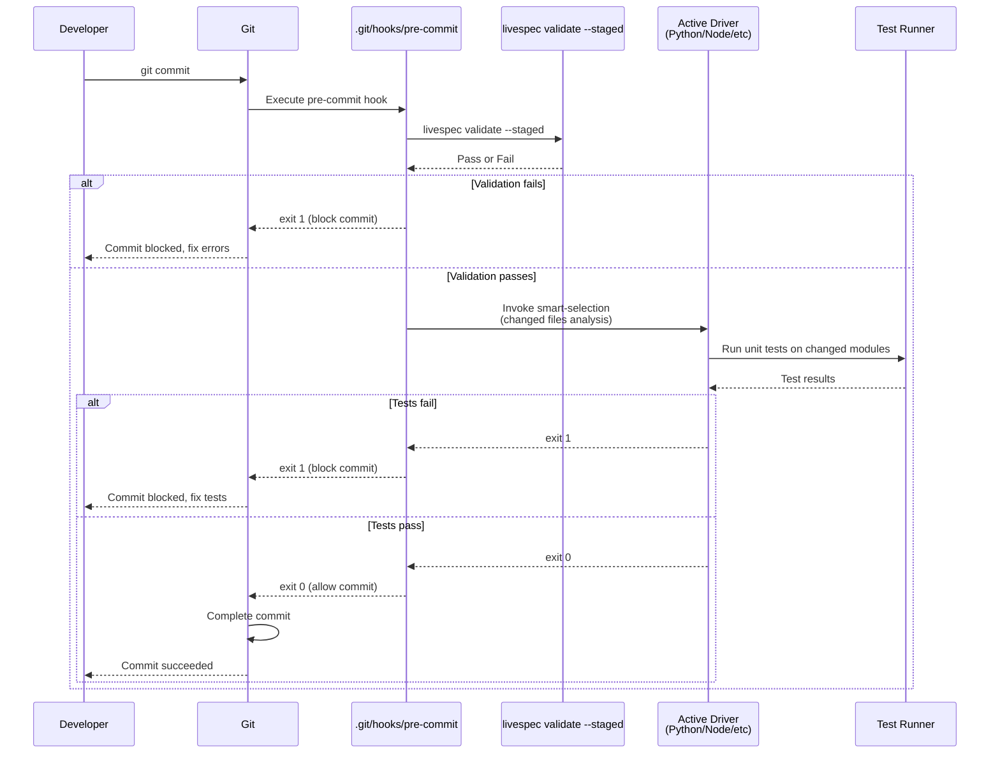
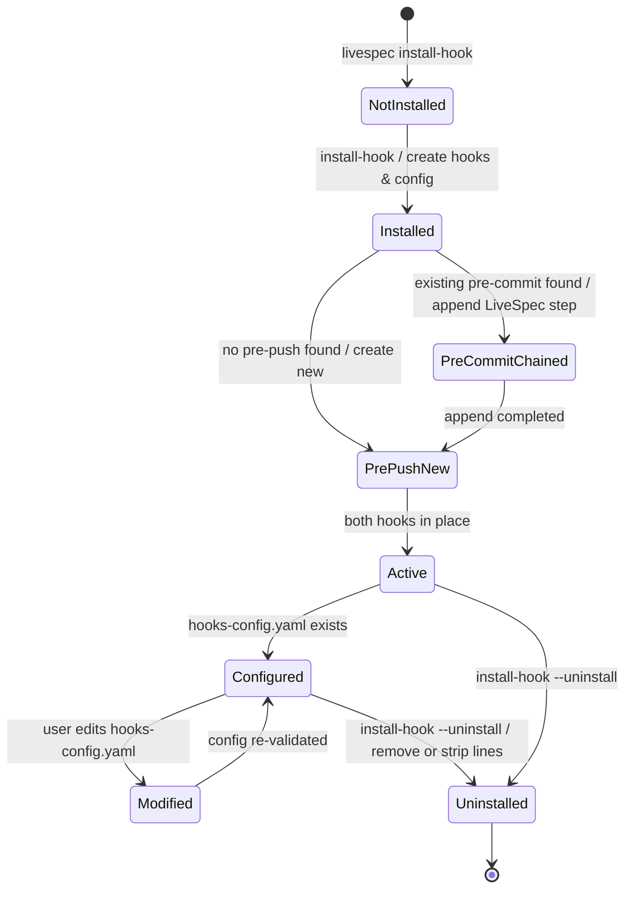
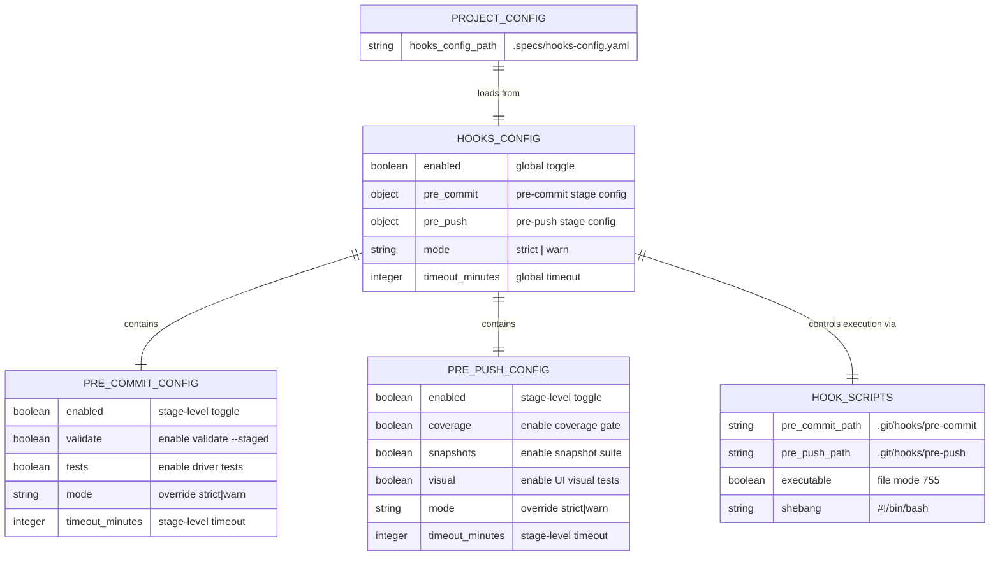

# Plan: Pre-commit / Pre-push Test Hooks

**Feature:** 032-test-hooks-pre-commit-pre-push
**Scope:** M (medium)
**Date:** 2026-05-07

---

## Summary

Extend the existing `livespec install-hook` command to install and manage both pre-commit and pre-push hooks in `.git/hooks/`. Pre-commit runs fast structural validation + smart-selected unit tests (< 5s). Pre-push runs full coverage gate + snapshots + visual tests (< 5min). Configurable via `.specs/hooks-config.yaml` with strict/warn modes and per-step timeouts. Includes migration support for existing projects and uninstall path.

---

## Technical Context

| Aspect | Choice | Reason |
|---|---|---|
| Language | Python | Primary LiveSpec language |
| CLI Framework | Typer | Type-safe subcommands with auto-help |
| Hook Scripting | POSIX shell + Python invocation | Cross-platform (macOS, Linux, WSL) |
| Configuration | YAML + Pydantic | Schema validation, sensible defaults |
| Hook Management | Direct `.git/hooks/` writes + shell chaining | Minimal dependencies, standard Git behavior |
| Testing | pytest + integration fixtures | Verify hook execution, state, config parsing |
| Dependencies | Features 016–026 (test drivers), 027–031 (UI runners) | Orchestration delegation |

---

## Constitution Check

- ✅ **Layered Validation:** CLI layer (install-hook) validates config via Pydantic schema before hook invocation
- ✅ **Provider-Agnostic:** Hooks invoke `livespec` CLI (agnostic to test framework); test framework selection is per-project
- ✅ **File-System as Source of Truth:** Hook config in `.specs/hooks-config.yaml`; no remote state
- ✅ **Fail Fast, Exit Clearly:** Invalid config → clear error + defaults; hook failures print escape hatch command
- ✅ **Minimal Surface:** One command extended (`install-hook --uninstall --purge`); flags control behavior
- ✅ **No Hosted Infrastructure:** All hooks run locally; no SaaS required

---

## Sequence Diagrams (Git Hook Orchestration)

### Pre-commit Hook Flow

```gherkin
Feature: Pre-commit hook orchestration
  Scenario: Successful pre-commit execution
    Given a developer has staged files in the repo
    When git commit is triggered
    Then pre-commit hook fires
    And livespec validate --staged runs first
    And the active driver's smart-selection runs targeted unit tests
    And both succeed within < 5 seconds
    And git finalizes the commit

  Scenario: Pre-commit validation failure
    Given staged files contain a spec.md with missing AC numbers
    When git commit is triggered
    Then pre-commit hook fires
    And livespec validate --staged fails with clear error
    And git aborts the commit (exit code != 0)
    And developer can fix and retry or git commit --no-verify to bypass
```



### Pre-push Hook Flow

```gherkin
Feature: Pre-push hook orchestration
  Scenario: Successful pre-push execution
    Given a developer has unpushed commits on a local branch
    When git push is triggered
    Then pre-push hook fires
    And livespec runs full coverage gate
    And full snapshot suite runs
    And visual tests run (if configured)
    And all pass
    And git pushes to remote

  Scenario: Coverage gate failure
    Given the branch has insufficient test coverage
    When git push is triggered
    Then pre-push hook runs coverage gate
    And gate fails with threshold report
    And git blocks push (exit code != 0)
    And message shows recovery steps and --no-verify escape hatch
```

```mermaid
sequenceDiagram
    participant Dev as Developer
    participant Git as Git
    participant PrePush as .git/hooks/pre-push
    participant Coverage as Coverage Gate
    participant Snapshots as Snapshot Suite
    participant Visual as UI Runner<br/>(if configured)

    Dev->>Git: git push
    Git->>PrePush: Execute pre-push hook
    PrePush->>Coverage: Run full coverage gate
    Coverage-->>PrePush: Pass or Fail
    alt Coverage fails
        PrePush-->>Git: exit 1 (block push)
        Git-->>Dev: Push blocked, add tests
    else Coverage passes
        PrePush->>Snapshots: Run snapshot suite
        Snapshots-->>PrePush: Pass or Fail
        alt Snapshots fail
            PrePush-->>Git: exit 1
            Git-->>Dev: Push blocked, regenerate snapshots
        else Snapshots pass
            PrePush->>Visual: Visual configured?
            alt Yes
                Visual-->>PrePush: Run UI tests
                alt Visual fails
                    PrePush-->>Git: exit 1
                    Git-->>Dev: Push blocked, fix UI
                else Visual passes
                    PrePush-->>Git: exit 0
                end
            else No
                PrePush-->>Git: exit 0
            end
        end
    end
    opt Git blocked push
        Git-->>Dev: (nothing happens)
    else Git allowed push
        Git->>Git: Push to remote
        Git-->>Dev: Push succeeded
    end
```

---

## State Diagram (Hook Lifecycle)

```gherkin
Feature: Hook installation and state transitions
  Scenario: Fresh install
    Given livespec install-hook on a project with no hooks
    When the command runs
    Then both pre-commit and pre-push hooks are created
    And hooks-config.yaml is written
    And status transitions to Installed

  Scenario: Migration adds pre-push to existing project
    Given a project with legacy pre-commit only
    When spec.migrate runs (Feature 032 migration)
    Then pre-push hook is added
    And hooks-config.yaml is created
    And pre-commit is updated with smart-test step

  Scenario: Uninstall removes hooks
    Given hooks are installed
    When livespec install-hook --uninstall runs
    Then hooks are removed or LiveSpec lines stripped
    And status transitions to Uninstalled
```



---

## ER Diagram (Configuration Model)



---

## Implementation Plan

### Infrastructure Setup

**Step 0 — Verify Dependencies**
- Verify Features 016–026 (test drivers) are installed and accessible via `livespec spec.test --list-drivers`
- Verify Features 027–031 (UI runners) are available: `livespec spec.test --list-runners`
- If any driver/runner missing, emit WARNING but continue (features may be added later)

**FR covered:** FR-001.0: Dependency verification

---

### Database / Configuration Layer

**Step 1 — Define HooksConfigSchema (Pydantic)**
- Create `validator/schemas/hooks_config.py`
- Schema fields:
  - `enabled: bool = True` (global toggle)
  - `pre_commit: PreCommitConfig` (nested)
  - `pre_push: PrePushConfig` (nested)
  - `mode: Literal["strict", "warn"] = "strict"`
  - `timeout_minutes: int = 10`
- Nested schemas:
  - `PreCommitConfig`: `enabled`, `validate`, `tests`, `mode`, `timeout_minutes`
  - `PrePushConfig`: `enabled`, `coverage`, `snapshots`, `visual`, `mode`, `timeout_minutes`
- Include validation: mode in ["strict", "warn"], timeout > 0, etc.
- Pydantic serialization to YAML via `pyyaml.safe_dump()`

**Files:** `validator/schemas/hooks_config.py` (new)

**FR covered:** FR-005.1: HooksConfigSchema definition + Pydantic validation

---

### Hook Scripts

**Step 2 — Author Pre-commit Hook Script**
- Create `scripts/pre-commit.sh` (POSIX-compliant Bash)
- Script flow:
  1. Find `.specs/` by walking parent directories
  2. Load `.specs/hooks-config.yaml` via Python subprocess: `python -c "import yaml; ..."`
  3. If config missing or malformed, log WARNING and use safe defaults (validate + no tests)
  4. Run `livespec validate --staged` with timeout
  5. If validation fails: print error + bypass command, exit 1
  6. If validation passes: check `pre_commit.tests: true` in config
  7. If tests enabled: invoke `livespec spec.test --pre-commit-mode` (Feature 033 delegation)
  8. If tests disabled: skip
  9. Return combined exit code (0 only if both pass)
- Output: colored summary on success ("✅ Pre-commit passed in Xs") or detailed errors on failure
- Escape hatch: show `git commit --no-verify` when blocking

**Files:** `scripts/pre-commit.sh` (new)

**FR covered:** FR-002.1: Pre-commit hook script implementation

---

**Step 3 — Author Pre-push Hook Script**
- Create `scripts/pre-push.sh` (POSIX-compliant Bash)
- Script flow:
  1. Find `.specs/` by parent walking
  2. Load `hooks-config.yaml` with same error handling as pre-commit
  3. If `pre_push.coverage: true`: run full coverage gate via driver (target threshold from .specs/testing/strategy.md)
  4. If coverage fails: print threshold report + recovery steps, exit 1
  5. If `pre_push.snapshots: true`: run snapshot suite via driver
  6. If snapshots fail: print mismatch count + regenerate command, exit 1
  7. If `pre_push.visual: true` (and configured in project): run UI visual tests via runner
  8. If visual fails: print failure count + baseline path, exit 1
  9. Return combined exit code
- Output: colored summary on success ("✅ Pre-push passed in Xm Ys") or detailed failures
- Escape hatch: show `git push --no-verify` when blocking
- Timeout: apply per-stage timeout from config or global timeout

**Files:** `scripts/pre-push.sh` (new)

**FR covered:** FR-003.1: Pre-push hook script implementation

---

### CLI Layer (Extension)

**Step 4 — Extend install-hook Command**
- File: `validator/cli.py` command `install_hook()`
- New flags:
  - `--uninstall`: Remove hooks (or strip LiveSpec lines if chained)
  - `--purge`: Also remove `.specs/hooks-config.yaml` when uninstalling
- Flow:
  1. Verify `.specs/` exists
  2. Check if `.git/hooks/pre-commit` exists
     - If yes: read file, check for "livespec" marker
     - If found: skip (already installed)
     - If not found: append LiveSpec invocation with shell function chaining
     - If no: create new with LiveSpec as sole command
  3. Same for `.git/hooks/pre-push`
  4. Create `.specs/hooks-config.yaml` if not present (default: all enabled)
  5. Make both scripts executable (chmod 755)
  6. Print summary: "Installed: pre-commit, pre-push, hooks-config.yaml" or "Already up to date"
  7. On `--uninstall`: remove `.git/hooks/pre-{commit,push}` or strip LiveSpec lines if chained
  8. On `--purge`: also `rm .specs/hooks-config.yaml`
- Preserve existing hooks: use shell function syntax to chain:
  ```bash
  # Existing content
  existing_hook() {
    # ... existing logic ...
  }
  # LiveSpec step
  livespec_hook() {
    python -c "..."
  }
  existing_hook && livespec_hook
  ```

**Files:** `validator/cli.py` (modified, extend `install_hook()`)

**FR covered:** FR-001.1: Extend install-hook with uninstall, preserve existing hooks

---

**Step 5 — Implement --pre-commit-mode and --pre-push-mode Flags on spec.test**
- File: `validator/cli.py` command `spec_test()` (existing, extend)
- New flags:
  - `--pre-commit-mode`: Configure test execution for pre-commit stage
    - Load `hooks-config.yaml`
    - Run only unit tests on changed files (smart-selection via Feature 033 if available, else all)
    - Apply `pre_commit.timeout_minutes` timeout
    - Exit 0 on pass, 1 on fail
    - Print short summary (< 1 line on success)
  - `--pre-push-mode`: Configure for pre-push stage
    - Load `hooks-config.yaml`
    - Run coverage gate + snapshots + visual (as configured)
    - Apply `pre_push.timeout_minutes` timeout
    - Exit codes and summary output same as pre-commit
- Both modes: read `.specs/hooks-config.yaml` via HooksConfigSchema; emit WARNING if malformed, use defaults
- Timeout enforcement: use `signal.alarm()` (Unix) or subprocess timeout (cross-platform)

**Files:** `validator/cli.py` (modified, extend `spec_test()`)

**FR covered:** FR-004.1: --pre-commit-mode and --pre-push-mode flags + config loading

---

### Configuration

**Step 6 — Define Default hooks-config.yaml Template**
- Create `scripts/hooks-config-default.yaml`
- Content:
  ```yaml
  enabled: true
  mode: strict
  timeout_minutes: 10
  pre_commit:
    enabled: true
    validate: true
    tests: true
    mode: null  # inherit from global
    timeout_minutes: 5
  pre_push:
    enabled: true
    coverage: true
    snapshots: true
    visual: false  # opt-in per project
    mode: null
    timeout_minutes: 300  # 5 minutes
  ```
- Validate with Pydantic on install
- Save to `.specs/hooks-config.yaml` on `install-hook`

**Files:** `scripts/hooks-config-default.yaml` (new)

**FR covered:** FR-005.2: Default hooks-config.yaml template

---

### Hook Failure Guidance

**Step 7 — Implement Failure Guidance Output**
- Create `validator/hook_guidance.py`
- Function: `format_hook_failure_message(hook_name, error_detail, bypass_command)`
- Output format:
  ```
  ❌ Pre-commit hook failed

  Error: [detailed error from validator or driver]

  Recovery:
  1. Fix the issue (e.g., add missing AC numbers to spec.md)
  2. Re-run: git commit

  Bypass (skip this check):
    git commit --no-verify
  ```
- Guidance message: "Git skips all hooks when --no-verify is used. LiveSpec does not log bypasses (unobservable)."
- Called by both pre-commit.sh and pre-push.sh on failure

**Files:** `validator/hook_guidance.py` (new)

**FR covered:** FR-006.1: Hook failure guidance implementation

---

### Migration

**Step 8 — Implement Migration Script**
- Create `scripts/migrate-test-hooks.py` (or .js if Node.js preferred, but Python for consistency)
- Called by `livespec migrate --step test-hooks-032` (integrated into `/spec.migrate` pipeline)
- Flow:
  1. Check if `.specs/` exists
  2. Check if `.git/` exists
  3. Check if pre-push hook already installed (grep for "pre-push" in `.git/hooks/pre-push`)
  4. If pre-push exists: report "Already migrated" and exit 0
  5. If not: run `livespec install-hook` (call directly or subprocess)
  6. Verify both hooks and config created
  7. If pre-commit hook is legacy (no smart-test step), append smart-test step
  8. Update `.specs/livespec-version` to reflect new version
  9. Print summary: "Migration completed: pre-push installed, hooks-config.yaml created"

**Files:** `scripts/migrate-test-hooks.py` (new)

**FR covered:** FR-007.1: Migration script for existing projects

---

### CLI Extensions

**Step 9 — Add --uninstall and --purge Flags**
- Already covered in Step 4 (`install_hook()` extension)
- Test both flags in integration tests

**FR covered:** FR-008.1: Uninstall and purge flags

---

### Testing

**Step 10 — Unit Tests for HooksConfigSchema**
- File: `tests/test_hooks_config.py`
- Tests:
  - Valid config parses correctly
  - Invalid mode raises validation error
  - Timeout < 0 raises validation error
  - Missing `pre_commit` or `pre_push` uses defaults
  - YAML round-trip (parse → dump → parse) is idempotent

**Files:** `tests/test_hooks_config.py` (new)

**FR covered:** FR-009.1: Unit tests for config schema

---

**Step 11 — Integration Tests for Hook Installation**
- File: `tests/integration/test_hook_installation.py`
- Fixtures: Create a temp project with `.specs/` initialized
- Tests:
  - Fresh install: both hooks created, config created, executable
  - Existing pre-commit: script preserved, LiveSpec appended
  - Idempotent: running install twice doesn't duplicate
  - Uninstall: hooks removed or LiveSpec lines stripped
  - Purge: hooks and config removed
  - Migration: pre-push added to project with legacy pre-commit only

**Files:** `tests/integration/test_hook_installation.py` (new)

**FR covered:** FR-009.2: Integration tests for hook installation

---

**Step 12 — Integration Tests for Hook Execution**
- File: `tests/integration/test_hook_execution.py`
- Fixtures: Temp repo with hooks installed, test fixtures with passing/failing validates/tests
- Tests:
  - Pre-commit passes when validate + tests pass
  - Pre-commit blocks when validate fails
  - Pre-commit blocks when tests fail
  - Pre-push passes when all gates pass
  - Pre-push blocks on coverage failure
  - Pre-push blocks on snapshot failure
  - Pre-push blocks on visual failure (if enabled)
  - Timeout enforcement: hook exits with timeout message
  - Config malformed: hook uses defaults + WARNING
  - Disabled steps (config): hook skips disabled steps

**Files:** `tests/integration/test_hook_execution.py` (new)

**FR covered:** FR-009.3: Integration tests for hook execution

---

**Step 13 — Chaos Tests for Malformed Input**
- File: `tests/test_hooks_chaos.py`
- Tests:
  - Malformed YAML in hooks-config.yaml → hook reports error + uses defaults
  - Missing `.specs/` → hook reports error
  - Pre-commit hook as symlink → works (standard behavior)
  - Git worktrees: hooks installed per worktree

**Files:** `tests/test_hooks_chaos.py` (new)

**FR covered:** FR-009.4: Chaos tests for edge cases

---

### Documentation

**Step 14 — Update spec-system.md with Hooks Section**
- File: `.specs/spec-system.md` (append section after "Lifecycle Hooks")
- Content:
  - Hook installation via `livespec install-hook`
  - Pre-commit behavior (fast checks, < 5s)
  - Pre-push behavior (full suite, < 5min)
  - Configuration via `.specs/hooks-config.yaml`
  - Uninstall path
  - Bypass via `--no-verify`
  - Migration support
  - Example config with explanations

**Files:** `.specs/spec-system.md` (modified)

**FR covered:** FR-010.1: Documentation update

---

## Resolved Test Commands

| Action | Command | Tool | Status |
|---|---|---|---|
| Unit tests (config schema) | `pytest tests/test_hooks_config.py -v --tb=short` | pytest 8.x | Resolved |
| Integration tests (install) | `pytest tests/integration/test_hook_installation.py -m level_3a -v --tb=short` | pytest | Resolved |
| Integration tests (execution) | `pytest tests/integration/test_hook_execution.py -m level_3a -v --tb=short` | pytest | Resolved |
| Chaos tests | `pytest tests/test_hooks_chaos.py -m chaos -v --tb=short` | pytest | Resolved |
| Type check (hooks module) | `pyright validator/hooks_config.py validator/hook_guidance.py` | Pyright strict | Resolved |
| Lint/format | `ruff check validator/ tests/ && ruff format --check validator/ tests/` | Ruff | Resolved |
| Full hook test suite | `pytest tests/ -k hooks -v --tb=short` | pytest | Resolved |

---

## AC to Implementation Mapping

| AC | Implementation Step(s) | Files |
|---|---|---|
| AC-001 — install-hook installs both hooks | Step 4, Step 10, Step 11 | `validator/cli.py`, `scripts/pre-commit.sh`, `scripts/pre-push.sh`, `tests/integration/test_hook_installation.py` |
| AC-002 — hooks-config.yaml created | Step 6, Step 11 | `scripts/hooks-config-default.yaml`, `tests/integration/test_hook_installation.py` |
| AC-003 — preserve existing hooks | Step 4, Step 11 | `validator/cli.py`, `tests/integration/test_hook_installation.py` |
| AC-004 — pre-commit runs fast checks | Step 2, Step 5, Step 12 | `scripts/pre-commit.sh`, `validator/cli.py`, `tests/integration/test_hook_execution.py` |
| AC-005 — pre-push runs full suite | Step 3, Step 5, Step 12 | `scripts/pre-push.sh`, `validator/cli.py`, `tests/integration/test_hook_execution.py` |
| AC-006 — hook failure shows escape hatch | Step 7, Step 2, Step 3, Step 12 | `validator/hook_guidance.py`, hook scripts, tests |
| AC-007 — config supports toggles + timeout | Step 1, Step 5, Step 6, Step 10 | `validator/schemas/hooks_config.py`, `scripts/hooks-config-default.yaml`, tests |
| AC-008 — migration is idempotent | Step 8, Step 11 | `scripts/migrate-test-hooks.py`, `tests/integration/test_hook_installation.py` |
| AC-009 — uninstall removes hooks | Step 4, Step 11 | `validator/cli.py`, `tests/integration/test_hook_installation.py` |
| AC-010 — POSIX-compliant scripts | Step 2, Step 3 | `scripts/pre-commit.sh`, `scripts/pre-push.sh` |
| AC-011 — smart selection delegation | Step 2, Step 5, Step 12 | `scripts/pre-commit.sh`, `validator/cli.py`, tests |
| AC-012 — colored output + summaries | Step 2, Step 3, Step 7 | Hook scripts, `validator/hook_guidance.py` |
| AC-013 — config validation via Pydantic | Step 1, Step 5, Step 10 | `validator/schemas/hooks_config.py`, tests |

---

## Risks & Considerations

| Risk | Mitigation |
|---|---|
| **Performance:** Pre-commit timeout too tight for large monorepos | Config allows per-project timeout override; default 5min pre-commit is conservative |
| **Hook chaining:** Appending LiveSpec to existing hook without proper shell syntax fails | Use standard shell function chaining pattern; test with real existing hooks (Husky, pre-commit framework) |
| **Cross-platform:** Bash scripts don't work in PowerShell or cmd.exe | Document Windows users: use Git Bash or WSL; test via CI |
| **Feature ordering:** Feature 033 (smart selection) not yet implemented | Fallback to running all unit tests for changed modules (AC-011) |
| **Escape hatch misunderstanding:** User thinks `--no-verify` logs bypass | Explicit guidance message clarifies that Git skips hooks entirely |
| **Migration collision:** Existing projects have custom pre-commit logic | Preserve via shell chaining (Step 4); test with real-world fixtures |

---

## Success Criteria Mapping

| SC | Implementation Verification |
|---|---|
| SC-001 — Install < 1s | Measure time in `test_hook_installation.py`; target < 1s on clean project |
| SC-002 — Pre-commit < 5s | Timeout default in config; measure in `test_hook_execution.py` with fixture |
| SC-003 — Pre-push < 5min | Timeout default in config; pre-push.timeout_minutes = 300; measure in tests |
| SC-004 — Failure output clear | Check `hook_guidance.py` output format; verify escape hatch shown in tests |
| SC-005 — Migration idempotent | `test_hook_installation.py` runs migration twice; assert no changes on second run |
| SC-006 — Existing hooks preserved | `test_hook_installation.py` appends to existing hooks; verify content before/after |

---

## Next Steps

1. **Review plan** — ensure technical approach aligns with constitution + testing strategy
2. **Approve plan** — sign-off on file structure and step ordering
3. **Implement** — `/spec.implement 032-test-hooks-pre-commit-pre-push`
4. **Test** — run full test suite; verify pre-commit/pre-push on real project
5. **Migration** — integrate `migrate-test-hooks.py` into `/spec.migrate` pipeline
6. **Release** — version bump + changelog

---

*LiveSpec Plan v1.0 — Feature 032 — 2026-05-07*
