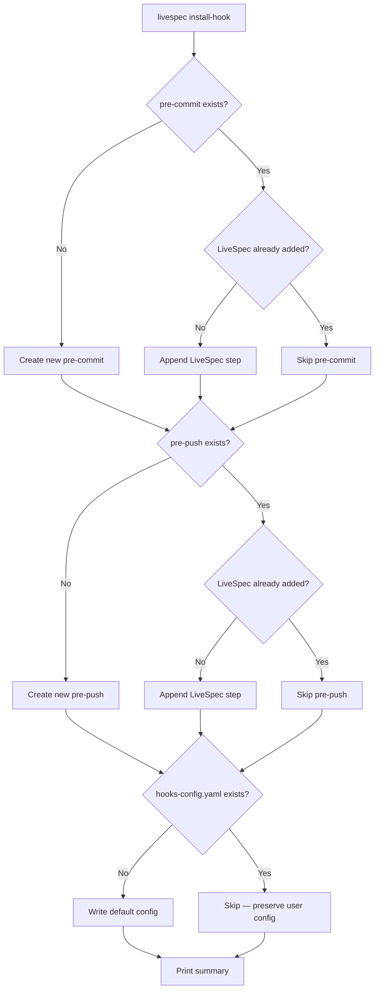
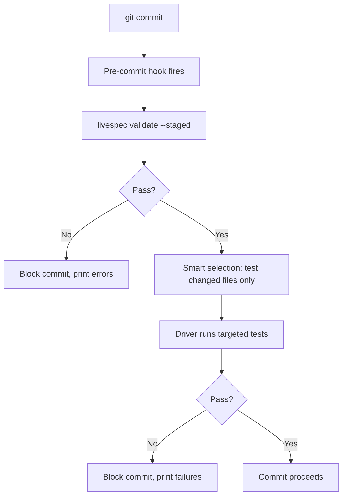
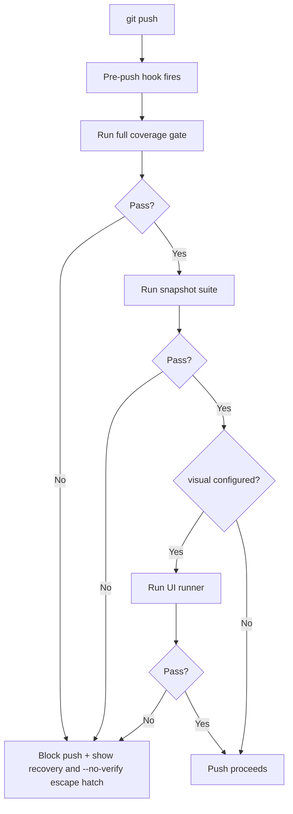
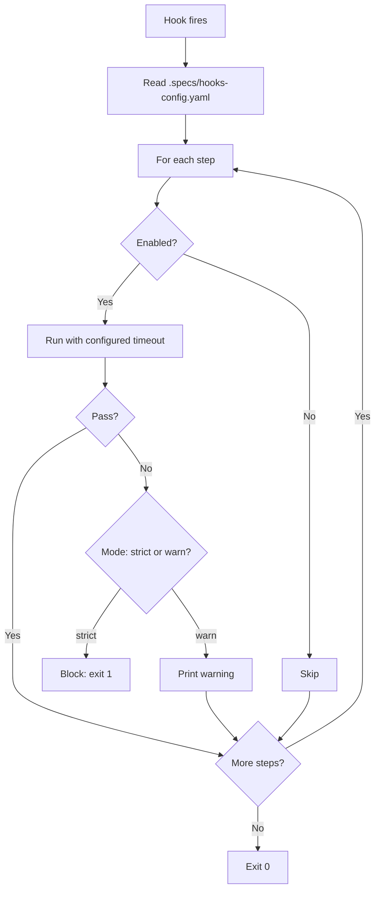

# Feature Spec: LiveSpec Pre-commit / Pre-push Test Hooks

- **Feature:** Pre-commit / Pre-push Test Hooks
- **Branch:** feature/032-test-hooks-pre-commit-pre-push
- **Date:** 2026-05-06
- **Status:** Draft
- **Priority:** P1
- **Scope:** M
- **Input:** Extend the existing `livespec install-hook` command (currently installs a pre-commit hook running validate Layer 1+2) to also support pre-push hooks that orchestrate driver capabilities (016-026) and UI runners (027-031). Local-first alternative to GitHub Actions: pre-commit runs fast checks (validate + smart-selected unit tests), pre-push runs the full test suite (coverage + snapshots + visual). Configurable per project via .specs/hooks-config.yaml. **Includes a migration** to install the new hooks in downstream projects' .git/hooks/ and create the config file.
- **Feature Number:** 032
- **Deps:** 016, 027

---

## User Scenarios & Testing

### Story 1 — Developer installs the LiveSpec hooks `P1`

A developer runs `livespec install-hook` (existing command, now extended). The command installs both pre-commit and pre-push hooks in `.git/hooks/`, creates a default `.specs/hooks-config.yaml`, and reports what was installed.

**Priority reason:** Onboarding step. Without easy install, hooks are not adopted.

**Independent test:** Run `livespec install-hook` on a fresh project; verify both hook scripts are in `.git/hooks/` and the config file exists.

```gherkin
Feature: Hook installation
  Scenario: Fresh project — install both hooks
    Given a project with .specs/ initialized but no .git/hooks/pre-* present
    When the developer runs livespec install-hook
    Then .git/hooks/pre-commit is created and executable
    And .git/hooks/pre-push is created and executable
    And .specs/hooks-config.yaml is created with default settings
    And the command reports: "Installed: pre-commit, pre-push, hooks-config.yaml"

  Scenario: Existing pre-commit — preserve and extend
    Given a project that already has .git/hooks/pre-commit
    When livespec install-hook runs
    Then the existing pre-commit is preserved
    And LiveSpec adds itself as a step in the existing hook (chained)
    And reports: "Existing pre-commit preserved; LiveSpec step appended"

  Scenario: Uninstall path
    Given hooks installed by LiveSpec
    When the developer runs livespec install-hook --uninstall
    Then both hooks are removed (or LiveSpec lines removed if chained)
    And hooks-config.yaml is preserved (or removed with --purge)
```



---

### Story 2 — Pre-commit hook runs fast checks before each commit `P1`

When the developer runs `git commit`, the pre-commit hook executes: (a) `livespec validate --staged` (existing), (b) smart-selected unit tests on changed files (delegating to the active driver). Total time target: < 5 seconds.

**Priority reason:** Catches obvious errors before the commit lands. Must be fast or developers will bypass.

**Independent test:** Modify a file, run `git commit`; verify the hook executes both steps and either passes (commit completes) or blocks (commit aborts) on failure.

```gherkin
Feature: Pre-commit fast checks
  Scenario: All checks pass — commit proceeds
    Given the developer has staged files including a Python module
    When git commit is invoked
    Then livespec validate --staged runs and passes
    And the active driver (Python) runs unit tests on the changed module
    And both succeed in < 5 seconds
    And the commit is finalized

  Scenario: Validation fails — commit blocked
    Given a staged spec.md with missing AC numbers
    When git commit is invoked
    Then livespec validate --staged fails with a clear error
    And the commit is blocked (exit code != 0)
    And the developer can fix and retry, or bypass with --no-verify

  Scenario: Smart selection — only changed files tested
    Given the developer modifies one Python file
    When the pre-commit hook runs
    Then only tests targeting that file's module are executed
    And other tests are skipped
    And total time stays < 5 seconds
```



---

### Story 3 — Pre-push hook runs full test suite before pushing `P1`

When the developer runs `git push`, the pre-push hook executes: (a) full coverage gate, (b) full snapshot suite, (c) visual UI tests if configured. Target: < 5 minutes for the typical project; user can bypass with `--no-verify`.

**Priority reason:** This is the local-first alternative to CI. Must run reliably to catch what pre-commit missed.

**Independent test:** Push a branch with a regression introduced; verify the pre-push hook detects it and blocks the push.

```gherkin
Feature: Pre-push full suite
  Scenario: All tests pass — push proceeds
    Given the local branch has commits not yet pushed
    When git push is invoked
    Then the pre-push hook runs
    And the active driver runs the full coverage gate (passes threshold)
    And snapshots match
    And UI runner visual tests pass (if configured)
    And the push proceeds

  Scenario: Coverage gate fails — push blocked
    Given the developer's branch has insufficient test coverage
    When git push is invoked
    Then the coverage gate reports below threshold
    And the push is blocked
    And the developer can either add tests or bypass with git push --no-verify

  Scenario: Bypass remains an explicit escape hatch
    Given the developer decides to bypass the pre-push hook
    When they re-run git push with --no-verify
    Then Git skips the pre-push hook entirely
    And LiveSpec does not claim to log a bypass it cannot observe
    And the failing hook output has already shown the exact bypass command
```



---

### Story 4 — Developer customizes hook behavior via config `P2`

`.specs/hooks-config.yaml` lets the developer toggle which checks run at each stage, set timeouts, exclude specific test types, and choose between strict and warn-only modes.

**Priority reason:** Different teams have different tolerances. Forced-strict-everywhere drives users to disable hooks entirely.

**Independent test:** Edit the config to disable visual on pre-push; verify the pre-push hook skips the visual step.

```gherkin
Feature: Hook configuration
  Scenario: Disable visual on pre-push
    Given .specs/hooks-config.yaml has pre_push.visual: false
    When git push runs
    Then the visual step is skipped
    And other steps run normally

  Scenario: Warn-only mode
    Given pre_commit.mode: warn
    When validation fails on commit
    Then the hook prints a WARN message
    And exits 0 (commit proceeds anyway)
    And the summary indicates warn-only mode was applied

  Scenario: Per-stage timeout
    Given pre_push.timeout_minutes: 3
    When the hook runs longer than 3 minutes
    Then the hook is killed gracefully
    And reports "Pre-push hook exceeded 3-minute timeout"
```



---

### Story 5 — Migration installs hooks on existing LiveSpec projects `P2`

A migration runs as part of `/spec.migrate` to install the new pre-push hook, update the existing pre-commit hook, and create `.specs/hooks-config.yaml` with sensible defaults.

**Priority reason:** Existing LiveSpec users should benefit from this without manually re-running install.

**Independent test:** Run migration on a project that has only the legacy pre-commit hook; verify the new pre-push hook is installed and the config file is created.

```gherkin
Feature: Migration adds pre-push and config
  Scenario: Migration on existing project
    Given a project with the legacy pre-commit hook only
    When /spec.migrate runs (or migrate-test-hooks.js is invoked)
    Then .git/hooks/pre-push is added
    And .specs/hooks-config.yaml is created with project-appropriate defaults
    And the legacy pre-commit is updated to include the smart-selected test step
    And .specs/livespec-version reflects the new version

  Scenario: Migration is idempotent
    Given a project already migrated
    When /spec.migrate runs again
    Then no files are modified
    And the migration reports "Already up to date"
```

```mermaid
flowchart TD
    A[/spec.migrate] --> B{pre-push hook exists?}
    B -- No --> C[Install pre-push]
    B -- Yes --> D[Skip — already installed]
    C --> E{hooks-config.yaml exists?}
    D --> E
    E -- No --> F[Write defaults]
    E -- Yes --> G[Preserve user config]
    F --> H{Legacy pre-commit?}
    G --> H
    H -- Yes --> I[Append smart-test step]
    H -- No --> J[Done]
    I --> J
```

---

## Acceptance Criteria

- **AC-001** — `livespec install-hook` (existing command, extended) installs both pre-commit and pre-push hooks in `.git/hooks/`.
- **AC-002** — `.specs/hooks-config.yaml` is created on install with a default schema covering pre-commit and pre-push stages.
- **AC-003** — Existing user-provided hook scripts are preserved; LiveSpec adds itself as a chained step (not overwrite).
- **AC-004** — Pre-commit hook runs `livespec validate --staged` then smart-selected unit tests on changed files. Target: < 5 seconds.
- **AC-005** — Pre-push hook runs full coverage gate, full snapshot suite, and visual tests (if configured). Target: < 5 minutes typical.
- **AC-006** — Hook failure output explicitly shows the supported escape hatch (`git commit --no-verify` or `git push --no-verify`) and LiveSpec does not claim to log bypasses it cannot observe.
- **AC-007** — `hooks-config.yaml` supports per-stage toggles (`enabled: true/false`), per-step toggles (`coverage: true/false`, `visual: true/false`, etc.), `mode: strict|warn`, and `timeout_minutes`.
- **AC-008** — Migration adds pre-push to projects that only had pre-commit; migration is idempotent.
- **AC-009** — `livespec install-hook --uninstall` removes both hooks (or removes LiveSpec lines if chained); `--purge` also removes `hooks-config.yaml`.
- **AC-010** — Hook scripts are POSIX-compliant shell + Python invocation — work on macOS, Linux, and Windows (via Git Bash / WSL).
- **AC-011** — Smart selection in pre-commit delegates to Feature 033 logic when available; falls back to running all unit tests for changed modules if 033 not yet implemented.
- **AC-012** — Hook output uses color-coded summaries (when terminal supports it) and a single-line success message on pass.
- **AC-013** — Configuration validation: `hooks-config.yaml` is parsed with a Pydantic schema; malformed config emits a clear error and falls back to defaults.

---

## Functional Requirements

- **FR-001** — Extend `livespec install-hook` to install pre-push in addition to pre-commit. Detect existing hooks and chain rather than overwrite.
- **FR-002** — Author the pre-commit hook script: invokes `livespec validate --staged && livespec spec.test --pre-commit-mode`.
- **FR-003** — Author the pre-push hook script: invokes `livespec spec.test --pre-push-mode`.
- **FR-004** — Implement `--pre-commit-mode` and `--pre-push-mode` flags on `livespec spec.test`: configure which capabilities run, apply timeouts, read `hooks-config.yaml`.
- **FR-005** — Define `HooksConfigSchema` Pydantic model and YAML serialization.
- **FR-006** — Implement hook failure guidance: when a hook blocks, print the exact bypass command and explain that Git bypasses skip hook execution entirely.
- **FR-007** — Implement the migration script: `migrate-test-hooks.{js|py}` that installs pre-push and config on existing projects. Hooked into `/spec.migrate` pipeline.
- **FR-008** — Add `--uninstall` and `--purge` flags to `livespec install-hook`.
- **FR-009** — Write integration tests: install hooks on a fixture, simulate commit/push, verify behavior.
- **FR-010** — Update LiveSpec docs (`spec-system.md`) with hooks section.

---

## Key Entities

| Entity | Description |
|---|---|
| Pre-commit hook script | Bash script in `.git/hooks/pre-commit` invoking LiveSpec. |
| Pre-push hook script | Bash script in `.git/hooks/pre-push` invoking LiveSpec. |
| `hooks-config.yaml` | Project-level configuration for hook behavior, in `.specs/`. |
| Bypass guidance | Explicit `--no-verify` recovery instructions shown when a hook blocks. |
| `HooksConfigSchema` | Pydantic model for parsing/validating the config. |
| Smart selection (delegated to 033) | Logic to pick which tests are relevant to changed files. |

---

## Infrastructure Requirements

| Resource | Type | Provider | Environment | When |
|---|---|---|---|---|
| git | Tooling | OS / package manager | dev only | Always present in a Git repo |
| Bash / POSIX shell | Tooling | OS | dev only | Required for hook scripts |
| LiveSpec CLI installed | Tooling | pip / package manager | dev only | Required for hook execution |

---

## Edge Cases

- **EC-001** — User has a pre-commit framework like `pre-commit` (Python tool): LiveSpec install-hook detects `.pre-commit-config.yaml` and offers to register as a hook within that framework instead of writing directly to `.git/hooks/`.
- **EC-002** — Hook timeout exceeded: hook process is killed, exit non-zero, message "timeout exceeded — increase in hooks-config.yaml or skip via --no-verify".
- **EC-003** — `hooks-config.yaml` malformed: hook falls back to safe defaults (validate + minimum tests) and emits WARNING.
- **EC-004** — Multiple Git workdirs / worktrees on same repo: hooks are installed per worktree (Git's default); LiveSpec detects and informs.
- **EC-005** — User runs `git commit` from inside a sub-directory of the repo: hook still finds `.specs/` via parent walking.

---

## Success Criteria

- **SC-001** — Installation completes in < 1 second on a clean project.
- **SC-002** — Pre-commit on a typical project runs in < 5 seconds (depending on project size, with smart selection).
- **SC-003** — Pre-push on a typical project runs in < 5 minutes (full suite without UI mobile, which is opt-in).
- **SC-004** — Hook failure output consistently shows the relevant bypass command and recovery steps.
- **SC-005** — Migration is idempotent (run twice without changes).
- **SC-006** — Existing user hooks are preserved (no destructive overwrite ever).

---

*LiveSpec Feature 032 — Draft — 2026-05-06*
