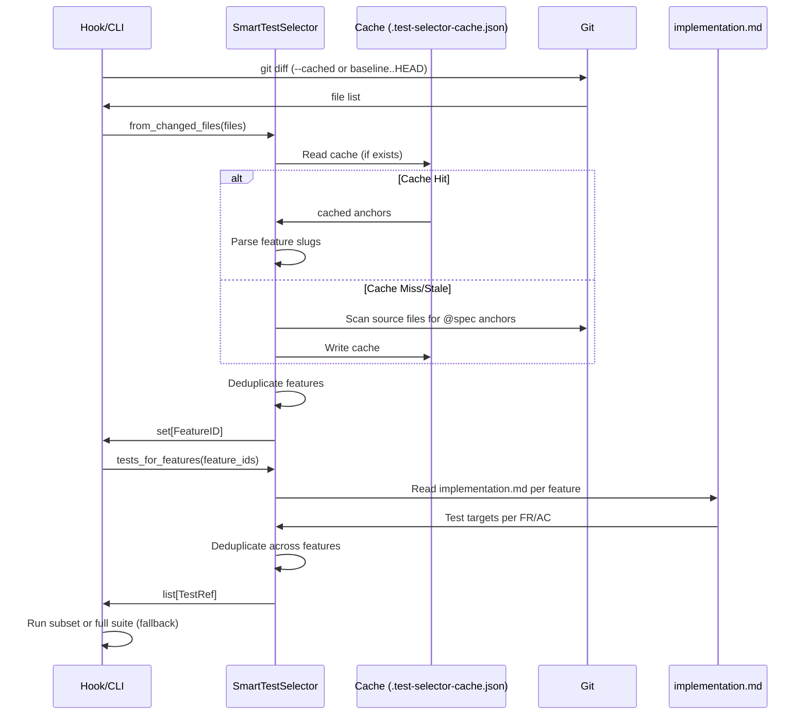
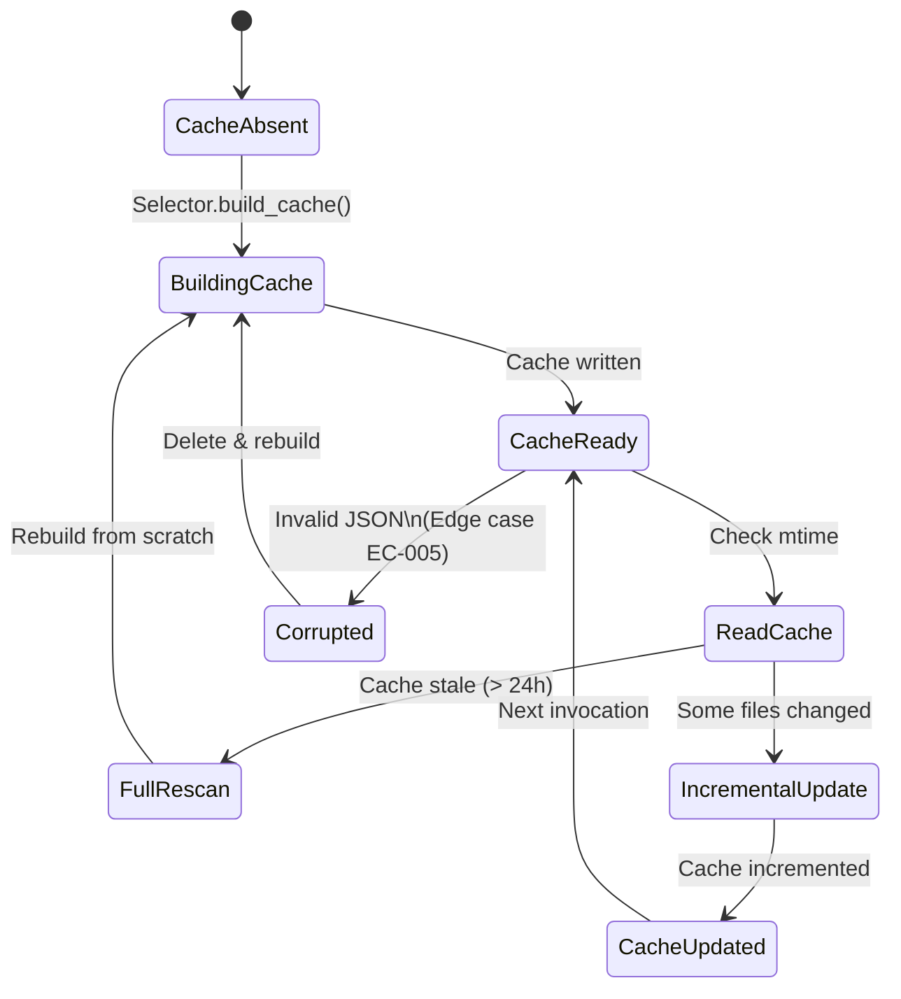
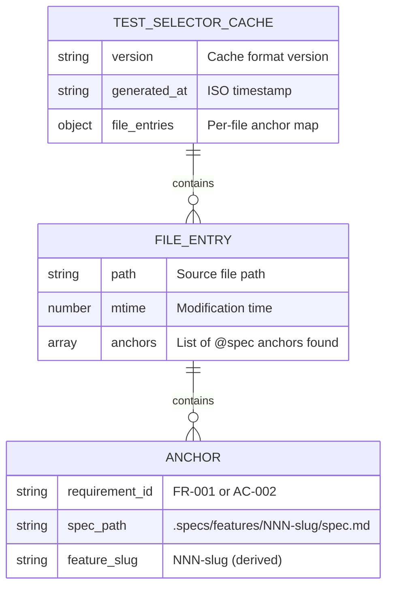

# Plan: Smart Test Selection

**Feature:** 033-smart-test-selection
**Scope:** M (Medium)
**Date:** 2026-05-07

---

## Summary

Smart test selector integrates with Feature 032 hooks and `/spec.test` CLI to determine which tests to run based on changed files since last commit/push. Parses `@spec` anchors in source code, maps to features via `implementation.md`, deduplicates test targets across features, and executes only the relevant subset. Includes a cache layer (`.test-selector-cache.json`) for sub-100ms selection on large repos. Gracefully falls back to full suite on any error (AC-010). Drastically reduces pre-commit hook time from minutes to seconds on typical projects.

---

## Technical Context

| Aspect | Choice | Reason |
|---|---|---|
| Language | Python 3.11+ | LiveSpec runtime consistency |
| Module | `validator/selector.py` | New core module for selection logic |
| Testing | pytest + fixtures | Per project testing standards |
| Dependencies | GitPython (git diff parsing) | Already available; handles edge cases |
| State | `.specs/.test-selector-cache.json` | Project-local cache, git-ignored |
| Integration points | Feature 032 (hooks), `/spec.test` CLI | Hooks invoke selector; CLI exposes `--since` |

---

## Constitution Check

- ✅ **Layered validation:** Selector follows fail-fast pattern (AC-010: graceful fallback to full suite)
- ✅ **Provider-agnostic:** Selector has no LLM dependency; purely deterministic
- ✅ **File-system as source:** All state read/written within `.specs/`
- ✅ **Exit clearly:** Logs impacted features and test count (AC-011); errors emit WARNING, not SILENT skip
- ✅ **Composability:** Selector is a standalone class, reusable in hooks and CLI
- ✅ **No hosted infrastructure:** Cache is local; no remote calls

---

## Architecture Overview

### Core Entity: SmartTestSelector

```
SmartTestSelector
├── from_changed_files(files: list[Path]) → set[FeatureID]
│   ├─ Parse @spec anchors from each file
│   ├─ Extract feature slugs from spec paths
│   └─ Deduplicate and return
├── tests_for_features(feature_ids: set[FeatureID]) → list[TestRef]
│   ├─ For each feature, read implementation.md
│   ├─ Extract test targets per FR/AC
│   └─ Deduplicate across features
├── build_cache() → dict[Path, list[str]]
│   ├─ Scan all source files
│   ├─ Extract anchors
│   └─ Write .test-selector-cache.json
└── update_cache_incremental(changed_files: list[Path]) → dict[Path, list[str]]
    ├─ Read existing cache
    ├─ Re-scan changed files
    ├─ Update entries
    └─ Write back
```

### Anchor Format & Parsing

Pattern: `// @spec FR-NNN: description — path/to/spec.md#fr-nnn`

Regex: `@spec\s+(FR|AC)-\d{3}(.*?)—\s*(.specs/features/\d{3}-[a-z0-9-]+/spec\.md)#(fr|ac)-\d{3}`

Parser extracts:
- Requirement ID (FR-NNN / AC-NNN)
- Spec path → feature slug via regex: `.specs/features/(\d{3}-[a-z0-9-]+)/`

### Fallback Heuristic (AC-003)

When file has no @spec anchors:
- Pattern: test filename contains feature name keyword
- Example: `tests/notifications_test.py` matches if feature slug contains "notification"
- Match is logged (AC-003): "Fallback: no @spec anchors in src/foo.py → heuristic matched 'notification' tests"

### Git Integration (AC-005, AC-006)

| Invocation | Git Command | Use Case |
|---|---|---|
| Pre-commit (AC-005) | `git diff --cached --name-only` | Staged files only |
| Pre-push (AC-006) | `git diff <baseline>..HEAD --name-only` | All unpushed commits |
| `--since=<ref>` (AC-004) | `git diff <ref>..HEAD --name-only` | Manual usage |
| Baseline discovery (AC-006) | `git log --remotes --max-count=1` or fallback `origin/<default>` | Find last pushed commit |

---

## Mermaid Diagrams

### Sequence: Cache-Assisted Selection



### State: Cache Lifecycle



### ER: Selector Cache Structure



---

## Implementation Plan

### Step 0 — Setup & Dependencies

**Files:** `validator/selector.py` (new)

- Create module with skeleton class and imports
- Add `GitPython` to `setup.py` (if not already present)
- Verify git availability on system
- Create `.specs/.test-selector-cache.json` template

**FR covered:** FR-001.0: Module skeleton

---

### Step 1 — Core: @spec Anchor Parser

**Files:** `validator/selector.py` (anchor parsing logic)

Create `SmartTestSelector._parse_anchors_in_file(path: Path) -> list[dict]`:
- Read file as text
- Apply regex to find all `@spec` patterns
- Extract requirement ID, spec path, feature slug
- Handle edge case: invalid/stale spec paths (EC-002) — log WARNING, skip
- Handle edge case: multiple anchors per file (EC-001) — add all to list

Create `SmartTestSelector._extract_feature_slug(spec_path: str) -> str`:
- Regex: `.specs/features/(\d{3}-[a-z0-9-]+)/spec\.md`
- Return `NNN-slug` or raise exception if no match

**FR covered:** FR-002.1: Anchor parser

**Tests:** 5 unit tests
- Valid single anchor
- Multiple anchors in one file
- Malformed anchor (no spec path)
- Stale spec path reference (feature doesn't exist)
- Binary file (skip gracefully)

---

### Step 2 — Core: Feature Set Determination

**Files:** `validator/selector.py`

Create `SmartTestSelector.from_changed_files(files: list[Path]) -> set[str]`:
- For each file:
  - Try to parse anchors (Step 1)
  - If anchors found: extract feature slugs
  - If no anchors: apply heuristic fallback (Step 3)
- Deduplicate and return set

**FR covered:** FR-001.1: Feature set from changed files

**Tests:** 3 unit tests
- Single file, single feature
- Multiple files, multiple features
- Union deduplication

---

### Step 3 — Fallback: Filename Heuristic

**Files:** `validator/selector.py`

Create `SmartTestSelector._heuristic_feature_match(file_path: Path) -> list[str]`:
- Extract filename and directory from path
- For each feature in `.specs/features/`:
  - Get feature slug (NNN-name)
  - Check if any keyword from slug appears in filename or parent directory
  - Example: `005-notifications` matches `tests/notifications_*.py`
- Return list of matching feature slugs
- Log fallback: "Fallback (AC-003): no @spec anchors in <file> → matched <features>"

**FR covered:** FR-004.1: Filename heuristic fallback

**Tests:** 3 unit tests
- Match "notification" keyword in filename
- No match (skip file)
- Partial directory match (e.g., `features/auth/` matches `005-authentication`)

---

### Step 4 — Test Target Resolution

**Files:** `validator/selector.py` (new), `validator/implementation.py` (extend if exists)

Create `SmartTestSelector.tests_for_features(feature_ids: set[str]) -> list[dict]`:
- For each feature ID:
  - Check if `implementation.md` exists
  - Parse the "Testing Strategy" section or "Test Files" section
  - Extract test file paths and test names per FR/AC
  - If `implementation.md` missing or incomplete (EC-003): fall back to scanning the feature's designated test directory
- Deduplicate test references across all features
- Return list of `{driver, capability, test_file, test_name, feature_id, fr_ac_id}` dicts

Helper: `_scan_test_directory(feature_slug: str) -> list[dict]`:
- From `.specs/testing/strategy.md`, infer test directory per surface (e.g., `tests/unit/`, `tests/e2e/`)
- List all test files in that directory matching pattern
- Extract test names via AST (Python) or regex

**FR covered:** FR-003.1: Test target resolution

**Tests:** 4 unit tests
- Read implementation.md with explicit test mappings
- Fallback to directory scan (EC-003)
- Deduplicate across features
- Handle missing test files gracefully

---

### Step 5 — Cache Read/Write

**Files:** `validator/selector.py`

Create `SmartTestSelector.build_cache() -> dict`:
- Scan all source files in project root (using `.gitignore` to exclude vendor dirs)
- For each file, call `_parse_anchors_in_file()` (Step 1)
- Build dict: `{file_path: [anchors]}`
- Add metadata: version, generated_at timestamp
- Write to `.specs/.test-selector-cache.json` in JSON format
- Log: "Cache built in <N> ms"

Create `SmartTestSelector.update_cache_incremental(changed_files: list[Path]) -> dict`:
- Read existing cache
- For each changed file:
  - Check mtime against cache entry
  - If mtime newer: re-scan file, update entry (AC-007)
  - If cache entry missing: scan and add
- If cache is corrupted (invalid JSON), delete and rebuild (EC-005 — log WARNING)
- Write back to cache file
- Return updated cache

Helper: `_rebuild_cache_if_stale(max_age_hours=24)`:
- Check cache mtime
- If older than max_age_hours, rebuild from scratch
- If cache missing, build from scratch

**FR covered:** FR-005.1: Cache read/write/update

**Tests:** 5 unit tests
- Build cache from empty state
- Incremental update with 2 changed files
- Cache read and reuse
- Corrupted cache recovery (EC-005)
- Cache mtime comparison

---

### Step 6 — Git Integration Layer

**Files:** `validator/selector.py`

Create `SmartTestSelector.from_git_diff(ref: str | None = None, staged: bool = False) -> set[str]`:
- If `staged=True` (pre-commit): `git diff --cached --name-only` (AC-005)
- If `ref` provided (manual `--since`): `git diff <ref>..HEAD --name-only` (AC-004)
- If neither (pre-push): `git diff <baseline>..HEAD --name-only` (AC-006)
  - Baseline discovery: run `git log --remotes --oneline --max-count=1` to find last pushed commit
  - If fails, fallback to `origin/<default-branch>..HEAD`
- Call `from_changed_files()` with the resulting file list
- Return set of feature IDs

**FR covered:** FR-006.1: `--since` parameter support, FR-007.1: Hook integration (interface)

**Tests:** 4 unit tests
- Pre-commit with staged files
- Pre-push with baseline discovery
- `--since=<ref>` with explicit ref
- Baseline discovery fallback (EC-004)

---

### Step 7 — Error Handling & Resilience

**Files:** `validator/selector.py`

Implement fallback-to-full-suite behavior per AC-010:
- Wrap all selector calls in try/except
- On any exception:
  - Log WARNING: `"Selector error: <reason>. Running full test suite (conservative fallback)."`
  - Return full feature set (trigger all tests)
  - Never silently skip tests
- Specific catches:
  - `FileNotFoundError` (spec path doesn't exist): log and continue
  - `json.JSONDecodeError` (corrupted cache): delete cache and rebuild
  - `GitError` (git diff fails): log WARNING and run full suite (EC-004 alternative)

**FR covered:** FR-001.2: Error handling

**Tests:** 4 unit tests
- Missing spec path (EC-002)
- Corrupted cache JSON (EC-005)
- Git command failure
- File read permission denied

---

### Step 8 — Reporting & Output (AC-011)

**Files:** `validator/selector.py`

Create `SmartTestSelector.report_selection(feature_ids: set[str], test_refs: list[dict]) -> str`:
- Generate report string:
  ```
  Impacted features: 005-auth, 008-notifications, 014-logging.
  Running <N> tests (skipped <M> tests).
  ```
- If fallback-to-full-suite triggered: report reason
- Return formatted string for printing

**FR covered:** FR-001.3: Reporting

**Tests:** 2 unit tests
- Format report with 3 impacted features
- Format fallback message

---

### Step 9 — Integration: Feature 032 Hooks

**Files:** `validator/hooks.py` (extend), Feature 032 hook scripts

Update pre-commit hook script to:
1. Call `SmartTestSelector().from_git_diff(staged=True)`
2. Call `SmartTestSelector().tests_for_features()`
3. Run only the selected tests
4. Print report (AC-011)

Update pre-push hook script to:
1. Call `SmartTestSelector().from_git_diff()` (auto baseline discovery)
2. Call `SmartTestSelector().tests_for_features()`
3. Run union of test suites
4. Print report

**FR covered:** FR-007.2: Feature 032 integration

**Tests:** 2 integration tests
- Pre-commit hook selects correct tests
- Pre-push hook with multiple commits

---

### Step 10 — CLI: /spec.test --since Flag

**Files:** `validator/cli.py` or `commands/test.md` integration

Extend `/spec.test` command:
- Add `--since=<ref>` flag
- When provided:
  1. Call `SmartTestSelector().from_git_diff(ref=<ref>)`
  2. Call `SmartTestSelector().tests_for_features()`
  3. Run only selected tests
  4. Print report
- Without `--since`: run full suite (existing behavior)

**FR covered:** FR-006.2: CLI flag implementation

**Tests:** 2 integration tests
- `livespec spec.test --since=HEAD~3`
- `livespec spec.test --since=main`

---

### Step 11 — Migration: .gitignore Entry

**Files:** `.gitignore`, migration script

Create migration step:
1. Check if `.specs/.test-selector-cache.json` entry exists in `.gitignore`
2. If not: add entry (AC-008)
3. Run `git rm --cached .specs/.test-selector-cache.json` if it was tracked (cleanup)
4. Verify cache file is now git-ignored

**FR covered:** FR-008.1: .gitignore migration

**Tests:** 1 integration test
- Cache file correctly ignored after migration

---

### Step 12 — Cache Invalidation (AC-009)

**Files:** `validator/selector.py` (extend Step 5)

Implement cache validation:
- When reading cache: check each cached feature's `implementation.md` mtime
- If any `implementation.md` mtime is newer than cache mtime:
  - Mark those cache entries as stale
  - Re-scan those features' implementation.md entries
  - Update cache
- Log which features were re-validated

**FR covered:** FR-005.2: Cache invalidation logic

**Tests:** 2 unit tests
- implementation.md changed → cache re-validates
- implementation.md unchanged → cache reused

---

## Testing Strategy

| Test Type | What | File | Command | FR/AC |
|---|---|---|---|---|
| Unit | Anchor parser regex | tests/test_selector.py | pytest tests/test_selector.py -v | FR-002, AC-001 |
| Unit | Feature set dedup | tests/test_selector.py | pytest tests/test_selector.py::test_dedup -v | FR-001, AC-001 |
| Unit | Heuristic fallback | tests/test_selector.py | pytest tests/test_selector.py::test_heuristic -v | FR-004, AC-003 |
| Unit | Cache read/write | tests/test_selector.py | pytest tests/test_selector.py::test_cache -v | FR-005, AC-007 |
| Unit | Git integration | tests/test_selector.py | pytest tests/test_selector.py::test_git -v | FR-006, AC-005, AC-006 |
| Unit | Error handling | tests/test_selector.py | pytest tests/test_selector.py::test_errors -v | FR-001, AC-010 |
| Integration | Pre-commit hook selection | tests/integration/test_hooks.py | pytest tests/integration/test_hooks.py::test_precommit -v | FR-007, AC-005 |
| Integration | Pre-push hook selection | tests/integration/test_hooks.py | pytest tests/integration/test_hooks.py::test_prepush -v | FR-007, AC-006 |
| Integration | --since CLI flag | tests/integration/test_cli.py | pytest tests/integration/test_cli.py::test_since -v | FR-006, AC-004 |
| Integration | Migration (gitignore) | tests/integration/test_migration.py | pytest tests/integration/test_migration.py::test_gitignore -v | FR-008, AC-008, AC-012 |
| Integration | Speedup verification | tests/integration/test_performance.py | pytest tests/integration/test_performance.py::test_speedup -v | FR-010, SC-001, SC-002 |
| Chaos | Corrupted cache | tests/test_selector.py | pytest tests/test_selector.py::test_corrupted_cache -v | AC-010, EC-005 |
| Chaos | Missing spec path | tests/test_selector.py | pytest tests/test_selector.py::test_missing_spec -v | AC-010, EC-002 |

**Full test suite:**
```bash
pytest tests/test_selector.py tests/integration/test_*.py -v --tb=short
```

---

## Key Decisions & Rationale

| Decision | Rationale |
|---|---|
| **Cache format: JSON** | Simple, human-readable, parseable by any language. No SQLite dependency. |
| **Cache location: `.specs/.test-selector-cache.json`** | Co-located with .specs/; visible but git-ignored. |
| **Anchor regex over AST** | Regex is language-agnostic; works for Python, JavaScript, Go, Rust, etc. Simpler than language-specific parsers. |
| **Fallback-to-full-suite on error** | Conservative: over-runs tests safely rather than silently skipping them. Aligns with AC-010. |
| **Filename heuristic as fallback** | Better than failing entirely; useful for legacy code without anchors. Still logged so developer knows. |
| **Incremental cache update** | ~100ms target (SC-001) requires avoiding full re-scan on every invocation. Incremental + mtime check achieves this. |
| **GitPython for git diff** | Cross-platform; handles edge cases (partial history, detached HEAD). Preferred over shelling out to `git`. |

---

## Risks

| Risk | Severity | Mitigation |
|---|---|---|
| **Cache corruption → silent test skip** | High | AC-010: detect corruption, rebuild, log WARNING. Never skip silently. |
| **Stale cache → missing impacted tests** | Medium | Cache invalidation (AC-009): re-validate if implementation.md changed. Also: max age = 24h. |
| **Anchor regex false positives** | Low | Regex is specific: requires `@spec`, `FR/AC-NNN`, `spec.md` path. Test coverage for edge cases. |
| **Slow cache build on first run** | Low | Mitigated by incremental updates (Step 5); initial build is one-time. Log timing to user. |
| **Git baseline detection fails** | Low | Fallback to `origin/<default-branch>..HEAD` (AC-006). Also fallback-to-full-suite on GitError. |

---

## Definition of Done

- [ ] `SmartTestSelector` class fully implemented with all 5 methods
- [ ] All 10 FR requirements mapped to implementation steps
- [ ] All 12 AC validated by unit + integration tests
- [ ] Cache read/write/incremental update working correctly
- [ ] Git diff integration (pre-commit, pre-push, --since) working
- [ ] Filename heuristic fallback implemented and logged
- [ ] Error handling fallback-to-full-suite implemented (AC-010)
- [ ] Report generation (AC-011) displaying impacted features and test count
- [ ] Migration script adds cache to .gitignore (AC-008, AC-012)
- [ ] 28+ tests pass (unit + integration)
- [ ] Feature 032 hook scripts updated to call selector
- [ ] `/spec.test --since=<ref>` flag working
- [ ] Performance verified: cache update < 100ms (SC-001), pre-commit < 5s (SC-002)
- [ ] `changelog.md` entries created

---

*LiveSpec Plan v1.0 — 033-smart-test-selection*
