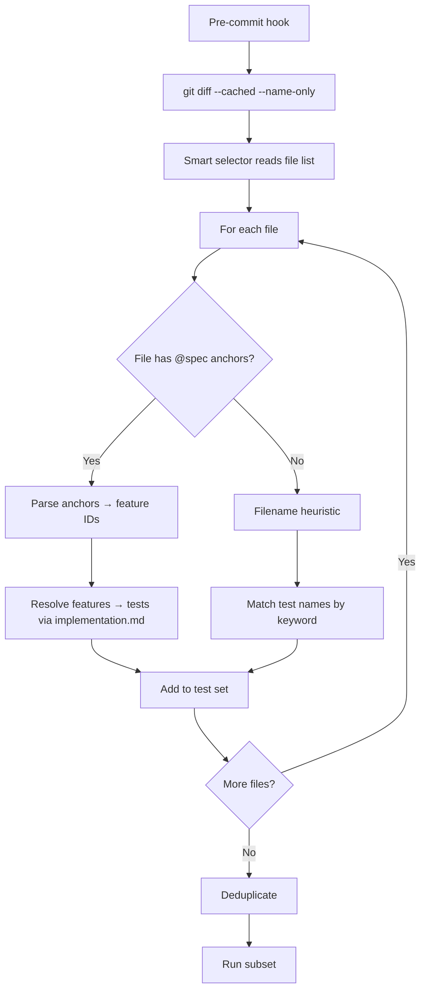
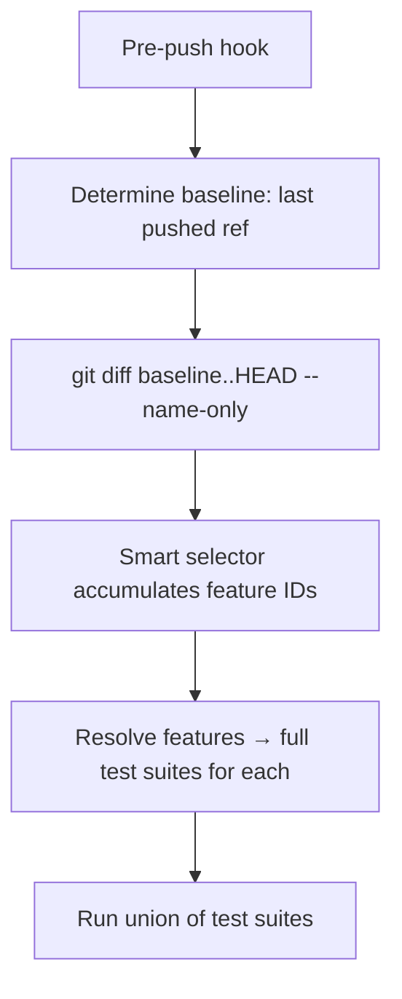
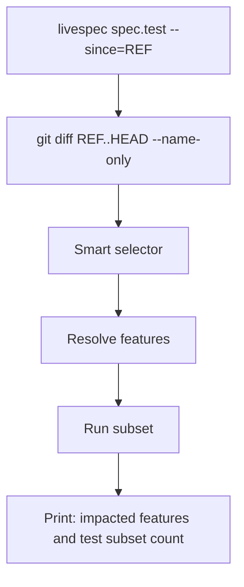
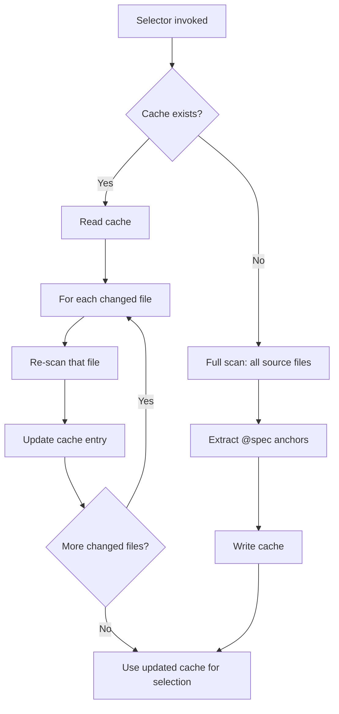

# Feature Spec: Smart Test Selection

- **Feature:** Smart Test Selection
- **Branch:** feature/033-smart-test-selection
- **Date:** 2026-05-06
- **Status:** Draft
- **Priority:** P2
- **Scope:** M
- **Input:** Determine which tests to run based on the files changed since the last commit / push, instead of running the full suite. Uses the @spec anchor reverse map and implementation.md per feature to map changed code files to impacted features and capabilities. Drastically reduces hook execution time (Feature 032) by running only the relevant subset. Also exposed via livespec spec.test --since=<ref> for manual usage. **Includes a migration** if it adds state files to downstream .specs/ (e.g., a precomputed reverse map cache).
- **Feature Number:** 033
- **Deps:** 032

---

## User Scenarios & Testing

### Story 1 — Pre-commit hook tests only changed modules `P1`

When the pre-commit hook runs, it invokes the smart selector with `git diff --cached --name-only`. The selector identifies which features are impacted (via `@spec` anchors in changed files), determines which tests target those features, and runs only that subset.

**Priority reason:** Pre-commit must be fast. Running the full suite at every commit is the #1 reason developers disable hooks.

**Independent test:** Modify one file with `@spec FR-003` anchors; verify the selector identifies feature N and queues only tests covering FR-003.

```gherkin
Feature: Smart selection from staged changes
  Scenario: Single file changed — only its tests run
    Given a Python file src/foo.py has @spec FR-001, FR-002 anchors
    And the developer stages only foo.py
    When the smart selector runs in pre-commit mode
    Then it parses anchors in foo.py
    And resolves them to feature 005-some-feature
    And queues tests in tests/ tagged for FR-001 and FR-002
    And tests for unrelated features are skipped

  Scenario: Multiple files changed — union of test sets
    Given foo.py changed (feature 005) and bar.py changed (feature 008)
    When the smart selector runs
    Then it queues tests for both features
    And deduplicates if a test covers both

  Scenario: File without @spec anchor — fall back to file-name heuristic
    Given a file scripts/build.sh changed but it has no @spec anchors
    When the smart selector runs
    Then it falls back to: run tests whose names contain "build" or live in tests/build_*
    And the heuristic match is logged (not silent)
```



---

### Story 2 — Pre-push hook tests changes since last successful push `P1`

The pre-push hook invokes the selector with `git diff <last-pushed-ref>..HEAD`. The selector accumulates all impacted features across the unpushed commits and runs the full test suite for those features (more thorough than pre-commit).

**Priority reason:** Pre-push needs broader coverage than pre-commit but should still skip clearly-unrelated tests for speed.

**Independent test:** Push a branch with 3 commits affecting features 005, 008, 014; verify the selector queues all three feature suites and skips others.

```gherkin
Feature: Smart selection across unpushed commits
  Scenario: Multiple commits — union of impacted features
    Given local branch has 3 commits affecting features 005, 008, 014
    When pre-push selector runs
    Then it accumulates all 3 features
    And queues all tests for those features
    And skips tests for unrelated features (001, 002, 003 etc.)

  Scenario: Last push was on main — full diff against origin/main
    Given the local branch was branched from origin/main with 5 commits
    When pre-push runs
    Then the selector uses git diff origin/main..HEAD as scope
```



---

### Story 3 — Manual usage via /spec.test --since `P2`

A developer running `livespec spec.test --since=HEAD~3` gets the same smart selection logic for ad-hoc usage. Useful when iterating on a feature and wanting to test only the affected scope.

**Priority reason:** Reuse of the same logic outside hooks. Power-user feature.

**Independent test:** Run `livespec spec.test --since=HEAD~5`; verify only impacted tests are queued.

```gherkin
Feature: Manual --since invocation
  Scenario: Test changes since 5 commits ago
    Given the developer wants to verify the last 5 commits
    When they run livespec spec.test --since=HEAD~5
    Then the selector resolves the feature scope
    And runs the test subset
    And reports which features were impacted

  Scenario: --since=<branch>
    Given the developer is on feature/foo
    When they run livespec spec.test --since=main
    Then the selector compares feature/foo to main
    And queues tests for the diff
```



---

### Story 4 — Reverse map cache for performance `P3`

The selector maintains a precomputed reverse map of `file → @spec anchors → feature` cached at `.specs/.test-selector-cache.json`. Updated incrementally; rebuilt fully when stale beyond a threshold.

**Priority reason:** Scanning all source files for @spec anchors at every hook invocation is too slow on large repos. Cache makes selection fast.

**Independent test:** Run the selector twice; verify the second run uses the cache and is significantly faster.

```gherkin
Feature: Reverse map caching
  Scenario: First run builds cache
    Given no cache exists at .specs/.test-selector-cache.json
    When the selector runs
    Then it scans all source files for @spec anchors
    And writes the cache with file → feature mappings
    And reports "Cache built in <N> ms"

  Scenario: Subsequent run uses cache
    Given the cache exists
    When the selector runs and only 2 files have changed since cache mtime
    Then the selector updates only those 2 entries in the cache
    And the rest is reused
    And total time is < 100ms

  Scenario: Cache is git-ignored
    Given the cache file
    When git status runs
    Then the cache is not tracked (in .gitignore)
```



---

## Acceptance Criteria

- **AC-001** — `SmartTestSelector.from_changed_files(files: list[Path]) -> set[FeatureID]` returns the set of impacted features by parsing `@spec` anchors.
- **AC-002** — `SmartTestSelector.tests_for_features(feature_ids: set[FeatureID]) -> list[TestRef]` returns the list of test targets across all configured drivers/runners using each feature's `implementation.md`.
- **AC-003** — File without `@spec` anchors → fall back to filename heuristic; log the fallback.
- **AC-004** — `livespec spec.test --since=<ref>` uses git diff against `<ref>` and runs the smart subset.
- **AC-005** — Pre-commit invocation uses `git diff --cached --name-only` (staged files).
- **AC-006** — Pre-push invocation uses `git diff <last-pushed-ref>..HEAD --name-only`; if last-pushed-ref unknown, falls back to `origin/<default-branch>..HEAD`.
- **AC-007** — Reverse map cache stored at `.specs/.test-selector-cache.json`; format includes file path, mtime, anchors. Rebuild incrementally.
- **AC-008** — Cache file is added to project `.gitignore` automatically by the migration.
- **AC-009** — Cache invalidation: if a feature's `implementation.md` changes, all cache entries pointing to that feature are re-validated.
- **AC-010** — Selector always falls back to "run everything" if anything goes wrong (corrupted cache, unparseable diff): emit WARNING, do not silently skip tests.
- **AC-011** — Output reports impacted features and test count: "Impacted features: 005, 008, 014. Running 47 tests (skipped 230)."
- **AC-012** — Migration adds `.specs/.test-selector-cache.json` to `.gitignore`.

---

## Functional Requirements

- **FR-001** — Implement `SmartTestSelector` class with methods `from_changed_files`, `tests_for_features`, `build_cache`, `update_cache_incremental`.
- **FR-002** — Implement `@spec` anchor parser: scan files for `@spec FR-NNN`, `@spec AC-NNN` patterns, extract feature paths.
- **FR-003** — Implement test target resolution: parse `implementation.md` per feature to find test files for each FR/AC.
- **FR-004** — Implement filename heuristic fallback: keyword matching against test file names.
- **FR-005** — Implement cache read/write/incremental update at `.specs/.test-selector-cache.json`.
- **FR-006** — Implement `--since=<ref>` flag on `livespec spec.test`.
- **FR-007** — Implement integration with Feature 032 hooks: pre-commit and pre-push call `SmartTestSelector` to scope their runs.
- **FR-008** — Implement `.gitignore` migration step.
- **FR-009** — Write unit tests for selector logic.
- **FR-010** — Write integration test demonstrating speedup vs full-suite invocation.

---

## Key Entities

| Entity | Description |
|---|---|
| `SmartTestSelector` | Class encapsulating selection logic. |
| `@spec` anchor | Comment in source code linking to a spec FR/AC. |
| `.test-selector-cache.json` | Precomputed reverse map for performance. |
| `TestRef` | A reference to a specific test target (driver, capability, test name). |
| `FeatureID` | The NNN-name slug of a feature. |

---

## Infrastructure Requirements

| Resource | Type | Provider | Environment | When |
|---|---|---|---|---|
| git | Tooling | OS | dev only | Required for `git diff` |
| Python (LiveSpec runtime) | Tooling | pip | dev only | Provides the selector |

---

## Edge Cases

- **EC-001** — File has multiple `@spec` anchors pointing to different features: all features are added to the set.
- **EC-002** — `@spec` anchor references a non-existent feature (typo or stale): WARN log, skip the anchor; do not crash.
- **EC-003** — `implementation.md` for an impacted feature does not list explicit test files: fall back to running all tests in the corresponding feature's test directory.
- **EC-004** — Initial commit (no prior ref): selector returns "all features" (effectively full suite).
- **EC-005** — Cache is corrupted (invalid JSON): selector deletes the cache and rebuilds from scratch with a WARN log.
- **EC-006** — User has many @spec anchors per file (>50): cache scan still completes in < 200ms via streaming parser.

---

## Success Criteria

- **SC-001** — On a typical project (50 features, 1000 source files), incremental cache update completes in < 100ms.
- **SC-002** — Pre-commit hook with smart selection runs in < 5 seconds for changes affecting 1-2 features.
- **SC-003** — Falls back gracefully on any error: full suite runs (over-conservative is safer than silent skip).
- **SC-004** — Output clearly explains which features were impacted and how many tests were skipped.
- **SC-005** — Cache file is correctly git-ignored after migration.

---

*LiveSpec Feature 033 — Draft — 2026-05-06*
