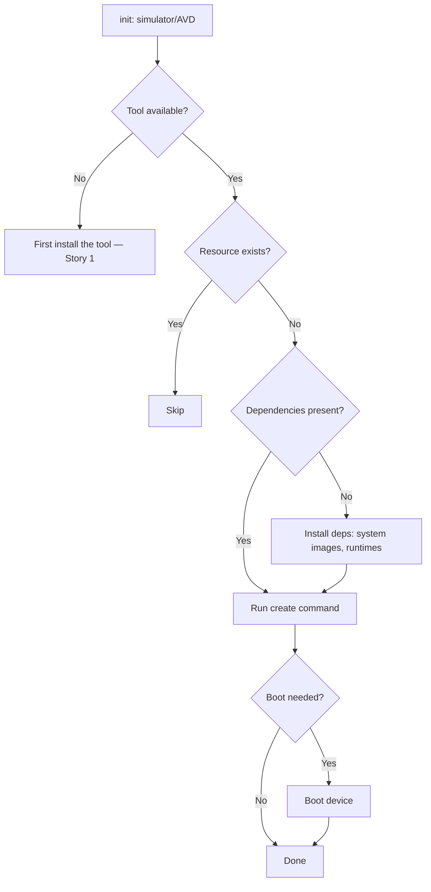
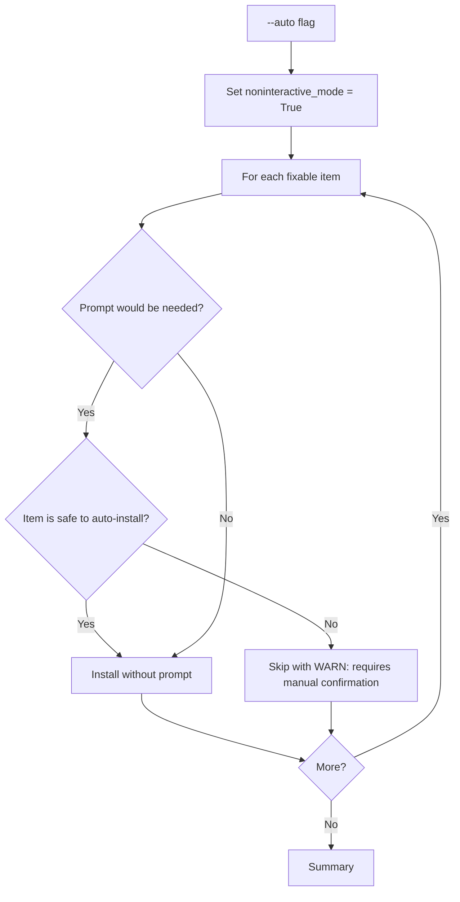

# Feature Spec: Preflight Auto-Install & Init via /spec.preflight --fix

- **Feature:** Preflight Auto-Install & Init
- **Branch:** feature/034-preflight-autofix
- **Date:** 2026-05-06
- **Status:** Draft
- **Priority:** P1
- **Scope:** M
- **Input:** Extend the existing /spec.preflight command (currently verifies tooling, auth, tokens — read-only) with a --fix flag that auto-installs missing tools where safe (brew, cargo install, npm install -g, pip install) and auto-initializes resources (create iOS/watchOS simulators, Android AVDs, accept Xcode license). Smart scoping: by default, --fix examines git diff HEAD~1..HEAD and only checks/installs dependencies for drivers and UI runners impacted by the recent commit. --full overrides this for a complete check. For non-auto-installable resources (Xcode itself, Apple Developer auth), generates an actionable step-by-step guide. **Includes a migration** to enrich preflight.md in downstream projects with entries from features 016-033.
- **Feature Number:** 034
- **Deps:** 016, 027

---

## User Scenarios & Testing

### Story 1 — Developer auto-installs missing tools after pulling a feature `P1`

A developer pulls a branch that adds the iOS UI runner. Running `/spec.preflight --fix` detects that Xcode CLI tools and the iOS Simulator runtime are missing, installs them where possible (Xcode CLI), and emits guides for what can't be auto-installed (App Store Xcode install).

**Priority reason:** Single command that resolves environment drift after pulling new code. Critical UX for adoption.

**Independent test:** On a fresh machine without Xcode CLI, run `/spec.preflight --fix`; verify Xcode CLI tools are installed via `xcode-select --install` and the runtime guide is emitted.

```gherkin
Feature: Auto-install missing tools
  Scenario: Tool installable via Homebrew
    Given Maestro CLI is not on PATH
    And the project has the Android UI runner enabled
    When the developer runs /spec.preflight --fix
    Then the runner emits: "Installing Maestro via curl..."
    And executes the Maestro install command
    And verifies the install succeeded
    And reports: "Installed: maestro 1.x.x"

  Scenario: Tool installable via cargo install
    Given tauri-driver is not on PATH
    And the project has the Tauri UI runner enabled
    When /spec.preflight --fix runs
    Then the runner emits: "Installing tauri-driver via cargo..."
    And executes cargo install tauri-driver
    And verifies the binary is on PATH after install

  Scenario: Tool requires manual install — guide emitted
    Given Xcode is not installed (only CLI tools)
    When /spec.preflight --fix runs (and the project needs the iOS UI runner)
    Then the runner emits a step-by-step guide:
      - "1. Open the App Store"
      - "2. Search for Xcode and install (15 GB download)"
      - "3. Open Xcode once, accept license, install platform support"
      - "4. Re-run /spec.preflight --fix to continue"
    And does not attempt automatic install
    And exits with a clear non-zero code marking "manual action required"
```

```mermaid
flowchart TD
    A[/spec.preflight --fix] --> B[Read preflight manifest]
    B --> C[Smart scope: filter to impacted drivers/runners]
    C --> D[For each required tool/resource]
    D --> E{Already installed/initialized?}
    E -- Yes --> F[Skip — OK]
    E -- No --> G{Auto-installable?}
    G -- Yes --> H[Run install command]
    G -- No --> I[Emit step-by-step guide]
    H --> J{Install succeeded?}
    J -- Yes --> K[Mark OK]
    J -- No --> L[Report failure with stderr]
    I --> M[Mark: manual action required]
    F --> N{More items?}
    K --> N
    L --> N
    M --> N
    N -- Yes --> D
    N -- No --> O[Print summary]
```

---

### Story 2 — Developer auto-initializes simulators and emulators `P1`

`/spec.preflight --fix` detects that the configured iPhone simulator (e.g., "iPhone 16") doesn't exist, runs `xcrun simctl create` to create it, and boots it. Same for Android AVDs.

**Priority reason:** Simulator/AVD creation is fiddly and version-sensitive. Auto-init removes that pain.

**Independent test:** On a Mac without "iPhone 16" simulator, run `/spec.preflight --fix`; verify the simulator is created and booted.

```gherkin
Feature: Auto-init simulators and AVDs
  Scenario: Create missing iOS simulator
    Given the project's iOS runner manifest declares "iPhone 16" simulator
    And no such simulator exists in xcrun simctl list
    When /spec.preflight --fix runs
    Then the runner identifies the latest iPhone 16 device type
    And the latest iOS runtime
    And executes xcrun simctl create "iPhone 16" iPhone16 com.apple.CoreSimulator.SimRuntime.iOS-18-x
    And reports: "Created simulator: iPhone 16 (iOS 18.x)"

  Scenario: Create missing Android AVD
    Given the project's Android runner manifest declares "Pixel_8_API_35"
    And no such AVD exists
    When /spec.preflight --fix runs
    Then the runner installs the system image if missing (sdkmanager)
    And executes avdmanager create avd
    And reports: "Created AVD: Pixel_8_API_35 (Android 35)"

  Scenario: System image not available — install first
    Given the AVD requires Android 36 system image
    And the system image is not installed
    When /spec.preflight --fix runs
    Then sdkmanager 'system-images;android-36;google_apis;arm64-v8a' is invoked
    And waits for completion
    And then proceeds to create the AVD
```



---

### Story 3 — Smart scoping limits checks to impacted components `P2`

By default, `/spec.preflight --fix` examines `git diff HEAD~1..HEAD --stat` to determine which drivers/runners are impacted by the recent commit, and only verifies/installs dependencies for those.

**Priority reason:** A commit touching only Python code shouldn't trigger Xcode license check. Smart scoping makes the command fast and contextually relevant.

**Independent test:** Make a commit modifying only Python files; run `/spec.preflight --fix`; verify only the Python driver's dependencies are checked.

```gherkin
Feature: Smart scoping based on last commit
  Scenario: Python-only commit — only Python tooling checked
    Given the last commit only modified .py files
    When /spec.preflight --fix runs (without --full)
    Then only the Python driver's dependencies are verified
    And iOS, Android, Tauri checks are skipped
    And the report mentions: "Smart scope active. Skipped: ios, android, tauri."

  Scenario: --full overrides smart scoping
    Given a Python-only commit
    When /spec.preflight --fix --full runs
    Then all drivers and UI runners are verified
    And nothing is skipped

  Scenario: Multi-platform commit
    Given the last commit modified both Swift and Kotlin files
    When /spec.preflight --fix runs
    Then iOS and Android checks both run
    And Python, Rust, etc. are skipped
```

```mermaid
flowchart TD
    A[/spec.preflight --fix] --> B{--full flag?}
    B -- Yes --> C[Verify all]
    B -- No --> D[git diff HEAD~1..HEAD --stat]
    D --> E[Map changed files to drivers/runners]
    E --> F[Filter manifest to impacted ones]
    F --> G[Verify subset]
    C --> H[Print results]
    G --> H
```

---

### Story 4 — --auto flag for non-interactive mode `P2`

`/spec.preflight --fix --auto` answers "yes" to all prompts (e.g., "Install Maestro? [y/n]") and proceeds without user interaction. Useful in scripts and CI.

**Priority reason:** Non-interactive mode is required for use in `/spec.feature` autopilot pipelines and CI invocations.

**Independent test:** Run with `--auto`; verify no prompts appear and all auto-installable items are installed.

```gherkin
Feature: Non-interactive --auto mode
  Scenario: Auto-yes to install prompts
    Given Maestro is not installed
    When the developer runs /spec.preflight --fix --auto
    Then no interactive prompt appears
    And Maestro is installed automatically
    And the report still emits the same summary

  Scenario: --auto does not bypass safety
    Given a tool requires sudo for install (e.g., system-wide pip)
    When --auto is used
    Then the runner asks for sudo password (sudo's prompt is OS-controlled)
    And the runner respects sudo's behavior
    Or refuses to run that step with a clear message
```



---

### Story 5 — Migration enriches preflight.md with new entries `P3`

A migration runs as part of `/spec.migrate` to scan the project for active drivers/runners (from features 016-033) and append the corresponding preflight entries to `.specs/preflight.md`.

**Priority reason:** Existing LiveSpec users on a project that just adopted features 016-033 should not have to manually rewrite their preflight manifest.

**Independent test:** Run migration on a project with `python.yaml` driver active but no Python entries in preflight.md; verify entries are appended.

```gherkin
Feature: Migration enriches preflight.md
  Scenario: Driver active but missing from preflight
    Given .specs/drivers/python.yaml exists (or built-in detected)
    And .specs/preflight.md does not contain the Python driver entries
    When /spec.migrate runs
    Then the migration appends the Python driver's Infrastructure Requirements to preflight.md
    And the migration is reported in the migration summary

  Scenario: All entries already present — no-op
    Given preflight.md already contains all required entries
    When /spec.migrate runs
    Then no changes are made
    And the migration reports "preflight.md already up to date"

  Scenario: User has custom preflight content — preserved
    Given preflight.md has custom user-added sections (e.g., custom tooling)
    When the migration runs
    Then user content is preserved
    And only LiveSpec-managed sections (between markers) are updated
```

```mermaid
flowchart TD
    A[/spec.migrate] --> B[Detect active drivers/runners]
    B --> C[For each]
    C --> D[Read its Infrastructure Requirements]
    D --> E[Check preflight.md for matching entries]
    E --> F{Already present?}
    F -- No --> G[Append between LiveSpec markers]
    F -- Yes --> H[Skip]
    G --> I{More?}
    H --> I
    I -- Yes --> C
    I -- No --> J[Done]
```

---

## Acceptance Criteria

- **AC-001** — `livespec spec.preflight` (no flag) preserves current read-only verification behavior.
- **AC-002** — `livespec spec.preflight --fix` triggers auto-install/init mode.
- **AC-003** — Auto-install supports: brew (macOS), cargo install (Rust crates), npm install -g (Node packages), pip install (Python packages), curl-piped installers for known tools (Maestro, etc.).
- **AC-004** — Auto-init supports: iOS Simulator creation via `xcrun simctl create`, Android AVD creation via `avdmanager create avd`, Xcode license acceptance via `sudo xcodebuild -license accept`.
- **AC-005** — Non-auto-installable resources (Xcode app, Apple Developer auth) emit a numbered step-by-step guide; the command exits with a marker code (e.g., 2) indicating "manual action required".
- **AC-006** — Smart scoping (default): examines `git diff HEAD~1..HEAD --stat`, maps changed files to driver/UI runner manifests, filters checks to impacted ones.
- **AC-007** — `--full` flag disables smart scoping and verifies all drivers/runners.
- **AC-008** — `--auto` flag disables interactive prompts; auto-yes to safe installs; refuses unsafe installs (e.g., destructive operations).
- **AC-009** — Each install reports: command attempted, exit code, stdout/stderr, and final verification (binary on PATH, version reported).
- **AC-010** — Failed installs are reported with stderr and a manual command to retry; the rest of the items continue (no early abort).
- **AC-011** — Migration adds preflight entries for all features 016-033 to `.specs/preflight.md` between LiveSpec section markers; user content is preserved.
- **AC-012** — `--dry-run` flag previews what would be installed without executing.
- **AC-013** — All install commands use the project's existing package managers when available (e.g., uses pnpm if pnpm is present, otherwise npm).
- **AC-014** — A summary table at the end shows: "Tools verified: N", "Installed: M", "Manual action required: K", "Failed: F".

---

## Functional Requirements

- **FR-001** — Add `--fix`, `--full`, `--auto`, `--dry-run` flags to `livespec spec.preflight`.
- **FR-002** — Implement install dispatchers: `brew install`, `cargo install`, `npm install -g`, `pip install`, `curl install` (with allowlist of trusted curl-pipe URLs).
- **FR-003** — Implement init dispatchers: `xcrun simctl create`, `avdmanager create avd`, `sdkmanager` for system images, `sudo xcodebuild -license accept`.
- **FR-004** — Implement guide renderer: numbered steps for manual actions with copy-pasteable commands.
- **FR-005** — Implement smart scoping: parse `git diff --stat`, build mapping `file_pattern → driver/runner ID`, filter manifest entries.
- **FR-006** — Implement file pattern → driver/runner mapping using each manifest's detect rules and conventions (e.g., `*.swift` → swift driver + ios runner).
- **FR-007** — Implement migration: scan project for active drivers/runners, build expected preflight entries, merge with existing `preflight.md` between LiveSpec markers.
- **FR-008** — Implement summary table renderer.
- **FR-009** — Write integration tests for each install dispatcher (mocked subprocess calls).
- **FR-010** — Write integration test for the full --fix flow on a fixture project missing several tools.
- **FR-011** — Document the command in `.specs/spec-system.md` and the preflight reference.

---

## Key Entities

| Entity | Description |
|---|---|
| Install dispatcher | Per-package-manager function that runs the appropriate install command. |
| Init dispatcher | Per-resource-type function that creates simulators, AVDs, etc. |
| Guide step | A single line in a numbered manual-action guide. |
| Smart scope filter | Logic mapping `git diff` output to impacted drivers/runners. |
| Preflight entry | A row in `preflight.md` with type (TOOLING / AUTH / TOKEN / INIT), name, verify, install. |

---

## Infrastructure Requirements

| Resource | Type | Provider | Environment | When |
|---|---|---|---|---|
| git | Tooling | OS | dev only | Required for smart scoping |
| Internet access | Network | varies | dev only | Required for install commands |
| Package managers (one of: brew, apt, etc.) | Tooling | OS | dev only | At least one must be available for auto-install |

---

## Edge Cases

- **EC-001** — Network unreachable: install fails immediately; message indicates network issue, suggests offline retry.
- **EC-002** — Disk full during install: surface the OS error, suggest cleanup.
- **EC-003** — Install command requires sudo but user is not in sudoers: report and suggest manual install.
- **EC-004** — Tool installs but is not on PATH (e.g., installed to ~/.cargo/bin not in PATH): emit "installed to <path> but not on PATH; add to your shell profile".
- **EC-005** — Smart scoping detects no changes (clean working tree): runner reports "No changes since HEAD~1 — running full verification" and proceeds as `--full`.
- **EC-006** — Multiple package managers available (brew + apt on Linux): runner picks via priority order documented in the manifest.
- **EC-007** — Curl-pipe install URL not in allowlist: runner refuses and emits "Untrusted install URL — manual install required" with the documented URL.

---

## Success Criteria

- **SC-001** — On a fresh Mac without Xcode CLI tools, `--fix` triggers `xcode-select --install` and reports correctly.
- **SC-002** — On a Mac without "iPhone 16" simulator, `--fix` creates the simulator successfully.
- **SC-003** — `--auto --dry-run` produces a complete preview of what would be installed without making changes.
- **SC-004** — Smart scoping correctly skips iOS checks on a Python-only commit (verified by integration test).
- **SC-005** — Migration adds preflight entries idempotently (running twice produces no changes after the first run).
- **SC-006** — Summary table accurately reflects all action outcomes.

---

*LiveSpec Feature 034 — Draft — 2026-05-06*
