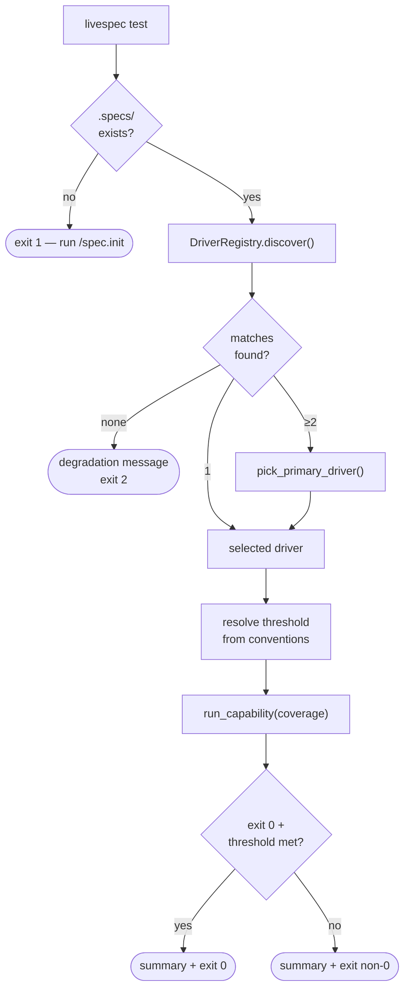
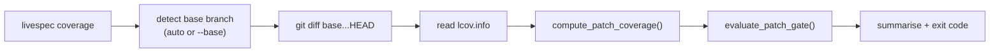

# Feature Spec: Unified CLI Surface

- **Feature:** Unified CLI Surface
- **Branch:** feature/035-unified-cli-surface
- **Date:** 2026-05-07
- **Status:** Draft
- **Priority:** P1
- **Scope:** M
- **Input:** Features 016-034 added powerful Python modules under `validator/drivers/` and `validator/preflight/` but only exposed minimal CLI surface (`livespec spec.driver --new`, `livespec init test-config`). Users currently must invoke slash commands inside Claude Code or write Python scripts to run drivers, compute patch coverage, run mutation testing, or trigger preflight autofix. This feature exposes a coherent CLI with sensible auto-detection of all parameters (stack, threshold, base branch, current feature) so users can run `livespec test`, `livespec coverage`, `livespec drivers`, `livespec preflight --fix` directly from any project root.
- **Feature Number:** 035
- **Deps:** 016, 017, 018, 019, 020, 021, 022, 023, 024, 025, 026, 034

---

## User Scenarios & Testing

### Story 1 — Run all tests with zero parameters `P1`

A developer in any LiveSpec-initialized project types `livespec test` from the project root. The CLI auto-detects the stack via the driver registry, picks the matching built-in driver (or falls back to a custom one), executes the `coverage` capability, parses lcov, prints a summary, and exits with code 0 if the suite passed and threshold met.

**Priority reason:** This is THE main entry point for the whole framework. Without it, drivers/coverage/mutation are invisible from the shell.

**Independent test:** On a Python project with `pyproject.toml` and `pytest-cov` installed, run `livespec test`; verify it auto-detects Python, runs `pytest --cov=...`, produces `lcov.info`, and prints a coverage summary.

```gherkin
Feature: Run tests with auto-detection
  Scenario: Single-stack project, defaults applied
    Given a project with pyproject.toml and pytest-cov installed
    And no flags are passed
    When the developer runs `livespec test`
    Then the CLI detects the python driver from livespec/drivers/python.yaml
    And reads the coverage threshold from .conventions/index.md (or 70 default)
    And executes the coverage capability
    And prints a summary: "Driver: python · Tests: 42 passed · Coverage: 87% (threshold 70%) · ✓"
    And exits with code 0

  Scenario: Multi-stack project resolves primary driver
    Given a project with both pyproject.toml and package.json
    When the developer runs `livespec test`
    Then the CLI uses pick_primary_driver (feature 026) to resolve the dominant stack
    And prints which driver was selected with a one-line rationale
    And executes its coverage capability

  Scenario: No driver matches
    Given a project with no recognized stack markers
    When the developer runs `livespec test`
    Then the CLI emits the structured degradation message (feature 023)
    And lists currently supported stacks
    And exits with code 2
```



### Story 2 — Compute patch coverage vs main `P1`

Before opening a PR, a developer runs `livespec coverage` from a feature branch. The CLI auto-detects the base branch (`origin/main` or `origin/master` or first match in [`develop`, `dev`, `main`, `master`]), reads `lcov.info` from the driver's default report path, intersects with `git diff <base>...HEAD`, and prints which changed files have insufficient coverage.

**Priority reason:** Patch coverage is the most actionable feedback before review. Without CLI exposure, feature 024 is dormant.

**Independent test:** On a feature branch with a recent change in `src/foo.py` and an existing `lcov.info`, run `livespec coverage`; verify it prints per-file coverage rates intersected with the diff and a global verdict.

```gherkin
Feature: Patch coverage vs base branch
  Scenario: Default base detection
    Given the developer is on feature/xyz
    And origin/main exists
    And lcov.info exists at the driver's default path
    When the developer runs `livespec coverage`
    Then the CLI uses origin/main as the base
    And computes patch coverage on changed files only
    And prints: "Patch coverage: 8/10 lines (80%) · 2 files below threshold: src/foo.py (60%), src/bar.py (50%)"
    And exits with code 0 if all files >= threshold, else 3

  Scenario: Explicit base branch override
    Given the developer wants to compare against develop instead
    When the developer runs `livespec coverage --base=develop`
    Then the CLI uses develop as the base
    And ignores auto-detection
```



### Story 3 — Inspect drivers `P2`

A developer wants to know which drivers LiveSpec sees in the project. They run `livespec drivers` and get a table of all detected built-in + custom drivers with their match status.

**Independent test:** Run `livespec drivers` in a TS/JS project; verify it lists `typescript` (built-in, matched) and any custom drivers with their match results.

```gherkin
Feature: List discoverable drivers
  Scenario: Mixed built-in and custom drivers
    Given a project with package.json (TS/JS)
    And a custom driver at .specs/drivers/playwright-only.yaml
    When the developer runs `livespec drivers`
    Then the CLI prints a table: "Driver | Source | Match | Capabilities"
    And both drivers appear with their match status
    And the primary driver (selected by pick_primary_driver) is marked

  Scenario: --json output for tooling
    When the developer runs `livespec drivers --json`
    Then the output is a JSON array consumable by other tools
```

### Story 4 — Run mutation testing on demand `P2`

A developer runs `livespec mutation` to launch mutation testing using the detected driver's mutation capability. Output goes to `.specs/reports/mutation-YYYY-MM-DD.md` (feature 025 historical reports).

**Independent test:** On a Python project with mutmut installed, run `livespec mutation`; verify it produces a Markdown report and exits 0 if mutation score ≥ threshold.

```gherkin
Feature: Run mutation testing
  Scenario: Driver supports mutation
    Given a Python project with mutmut configured
    When the developer runs `livespec mutation`
    Then the CLI invokes the mutation capability
    And writes a historical report to .specs/reports/mutation-2026-05-07.md
    And prints a summary: "Mutation score: 78% (threshold 70%) · ✓"

  Scenario: Driver does not support mutation
    Given a Go project (no mutation tool in feature 020)
    When the developer runs `livespec mutation`
    Then the CLI emits a structured "not supported by go driver" message
    And exits with code 4
```

### Story 5 — Run preflight checks (read or fix) `P1`

`livespec preflight` runs the read-only check (Pass 1+2+3 from feature 034 minus the install). `livespec preflight --fix` triggers auto-install of missing tools per the manifest.

**Independent test:** With mutmut not installed, run `livespec preflight --fix`; verify it installs mutmut and re-verifies success.

```gherkin
Feature: Preflight from CLI
  Scenario: Read-only check
    Given preflight.md declares pytest-cov, syrupy, mutmut
    And only pytest-cov is installed
    When the developer runs `livespec preflight`
    Then the CLI prints a summary table with status per tool
    And exits with code 5 if any critical tool is missing

  Scenario: Auto-install missing tools
    When the developer runs `livespec preflight --fix`
    Then the CLI invokes feature 034 logic
    And installs missing auto-installable tools
    And re-verifies after install
    And exits with code 0 on full success
```

---

## Acceptance Criteria

- **AC-001:** `livespec test` runs with zero arguments in a project that has a recognized driver and produces a coverage summary line in under 60 seconds for a small project.
- **AC-002:** `livespec test --feature NNN` resolves to the feature directory under `.specs/features/NNN-*/` and limits test execution to anchored tests (using `@spec FR-XXX` anchors from feature 016 + smart selection from feature 033).
- **AC-003:** `livespec test --mutation` runs the mutation capability and prints the score, separate from the coverage summary.
- **AC-004:** `livespec coverage` auto-detects the base branch by trying `origin/main`, `origin/master`, then falling back to local `main`/`master`/`develop` in that order.
- **AC-005:** `livespec coverage --base BRANCH` overrides auto-detection and uses the explicit branch.
- **AC-006:** `livespec drivers` prints a table with columns: Driver, Source (built-in/custom), Match (yes/no), Capabilities (comma-separated).
- **AC-007:** `livespec drivers --json` outputs a JSON array suitable for piping to `jq`.
- **AC-008:** `livespec mutation` writes a historical Markdown report at `.specs/reports/mutation-YYYY-MM-DD.md` (creating `.specs/reports/` if absent).
- **AC-009:** `livespec preflight` runs read-only verification and prints a per-tool status table.
- **AC-010:** `livespec preflight --fix` invokes feature 034 logic and re-verifies after install.
- **AC-011:** All commands exit with documented codes: 0 success, 1 missing `.specs/`, 2 no driver match, 3 coverage threshold failed, 4 capability not supported, 5 preflight critical failure.
- **AC-012:** Each command emits a structured one-line summary suitable for CI logs (in addition to verbose human output).
- **AC-013:** `--help` on each command produces user-facing help text generated from Typer (no developer-only jargon, includes one example per command).
- **AC-014:** Errors (missing tool, no driver, lcov absent) print a single actionable message — no Python stacktrace unless `--debug` is set.
- **AC-015:** A canonical CLI reference document at `docs/cli-reference.md` is created and lists every command, every flag, every exit code, and one example per command. The doc is the authoritative source — no need to read code.
- **AC-016:** A Claude Code slash command at `.claude/commands/cli.md` provides an interactive way to discover and run the CLI from inside Claude Code, mirroring the documentation.

---

## Functional Requirements

- **FR-001:** Add Typer subcommand `test` to `validator/cli.py` with optional `--feature NNN`, `--mutation`, `--no-coverage`, `--debug` flags.
- **FR-002:** Add Typer subcommand `coverage` with optional `--base BRANCH`, `--threshold N`, `--report-path PATH`, `--debug` flags.
- **FR-003:** Add Typer subcommand `drivers` with optional `--json`, `--debug` flags.
- **FR-004:** Add Typer subcommand `mutation` with optional `--threshold N`, `--report-path PATH`, `--debug` flags.
- **FR-005:** Add Typer subcommand `preflight` with optional `--fix`, `--full`, `--debug` flags. (Note: existing `livespec spec.preflight` remains for backward compatibility with the slash command; this new `preflight` is the canonical short form.)
- **FR-006:** Implement a shared resolver module `validator/cli_resolvers.py` for: `detect_specs_root()`, `detect_base_branch()`, `detect_current_feature()`, `read_threshold_from_conventions()`. All four are pure functions, fully unit-tested.
- **FR-007:** Implement structured exit codes per AC-011. Exit codes are constants in `validator/cli_exit_codes.py`.
- **FR-008:** Each command catches generic exceptions and surfaces a single-line actionable error unless `--debug` is set (then prints stacktrace).
- **FR-009:** Each command appends a one-line CI summary to stdout (after verbose output) of the form `LIVESPEC <subcommand> · <status> · <key=value> ...`.
- **FR-010:** Generate `docs/cli-reference.md` exhaustively listing all commands, flags, exit codes, environment variables (if any), and one example per command. Manual maintenance acceptable; the doc is committed alongside code.
- **FR-011:** Generate `.claude/commands/cli.md` slash command that loads the CLI reference and provides interactive selection (matches the Claude Code skill pattern used by `/spec.*` commands).
- **FR-012:** Create `tests/test_cli_unified.py` with end-to-end tests using `typer.testing.CliRunner` covering: `test`, `coverage`, `drivers`, `mutation`, `preflight` — at least one happy-path scenario per command.

---

## Key Entities

- **CliResolver** — shared utility module with pure functions for auto-detection (no I/O side effects beyond reading files).
- **CommandResult** — internal dataclass returned by each subcommand's logic before exit-code emission. Fields: `exit_code`, `summary_line`, `verbose_lines`, `error_message`.

---

## Edge Cases

- **EC-001:** `livespec test` on a project without `.specs/` exits 1 with a message pointing to `/spec.init`.
- **EC-002:** `livespec coverage` on a branch with no diff vs base (already merged) exits 0 with summary "no changes since base".
- **EC-003:** `livespec drivers --json` emits empty array `[]` when no drivers match (instead of failing).
- **EC-004:** `livespec mutation` on a Go project (capability absent) exits 4 with a message pointing to feature 020 limitations.
- **EC-005:** `livespec preflight --fix` partial success: some tools install, others fail; exits 5 (critical), prints which succeeded vs failed.
- **EC-006:** Concurrent invocation of two `livespec test` runs (e.g., from a watcher): both proceed independently — no global lock added by this feature.
- **EC-007:** `livespec test` invoked outside a git repo: exits 1 with "not in a git repository" message.

---

## Success Criteria

- **SC-001:** New developer in a fresh checkout can validate the framework by running `livespec test` and getting meaningful output within 5 minutes (no docs deep-dive needed).
- **SC-002:** `docs/cli-reference.md` is read in full by a CI/automation engineer and they can wire `livespec test`, `livespec coverage`, `livespec preflight --fix` into a GitHub Action without reading any source code.
- **SC-003:** All 5 new commands have working `--help` output verified by a smoke test.
- **SC-004:** All 916 pre-existing tests still pass; at least 25 new tests added covering each command's happy path + 1-2 edge cases.

---

## Out of Scope

- Watch mode / continuous test runner (could be a future feature 036).
- IDE integration / LSP — separate roadmap item.
- Network-based reporting (Codecov, Slack notifications) — feature 024 explicitly local-only.
- TUI / interactive picker — `--feature` and `--driver` flags are fine; no `inquirer`-style prompts.
