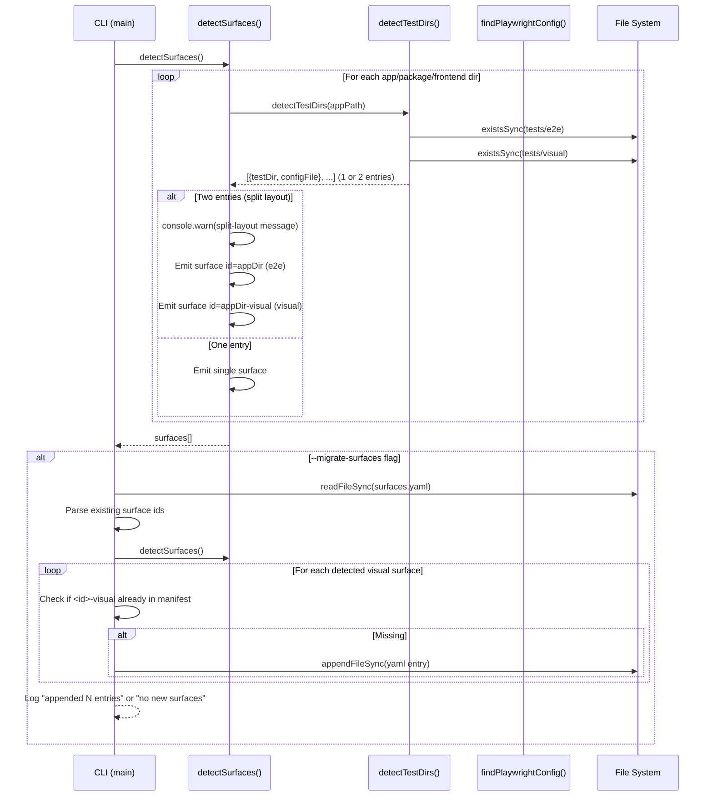
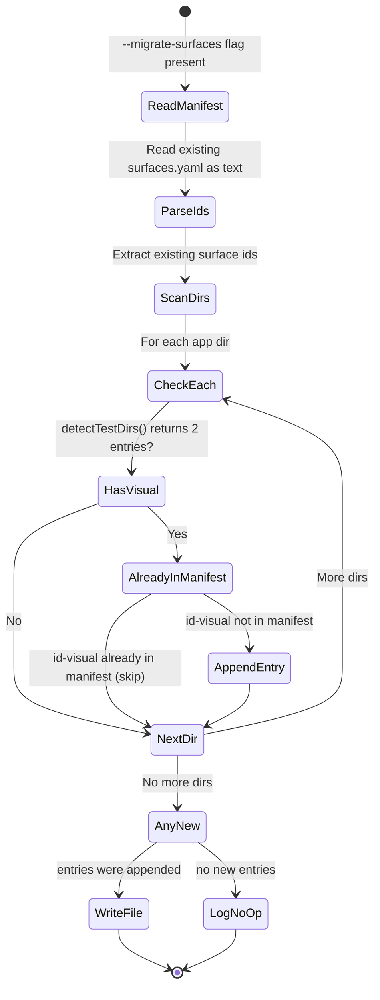

# Plan: Multi-Surface Detection and Migration

- **Feature:** 036-multi-surface-detection-and-migration
- **Spec:** [spec.md](spec.md)
- **Scope:** M (8 FR, single file primary, test file)
- **Priority:** P1

---

## Technical Context

| Aspect | Choice | Reason |
|---|---|---|
| Language | JavaScript (Node.js ESM) | `scripts/generate-surfaces.js` is an existing JS script |
| Runtime | Node.js ≥18 | Uses `fs`, `path` native modules; ESM import syntax |
| Testing | Bun test runner | Project uses Bun; test file follows existing `tests/test_generate_surfaces.js` naming |
| Linting | None (script files not in ruff scope) | JS scripts are not covered by the Python linting pipeline |
| Type Check | JSDoc annotations (no TS) | Script is plain JS; no TypeScript compilation step |

---

## Constitution Check

| Principle | Status | Notes |
|---|---|---|
| Simplicity | ✅ | Replacing `detectTestDir()` with `detectTestDirs()` returning an array is the minimal change |
| Separation | ✅ | Detection logic stays in helpers; `main()` handles only CLI flag dispatch |
| Testing | ✅ | Pure detection functions are unit-testable with directory fixture mocks |
| Naming | ✅ | `detectTestDirs`, `TestDirEntry`, `migrateSurfaces` follow JS camelCase conventions |
| Infrastructure | ✅ | No infrastructure dependencies — local file system only |
| No God files | ⚠️ Deviation documented | `generate-surfaces.js` is currently 315 lines and will grow to ~380 lines. **Deviation rationale:** this is a self-contained migration script (not a validator module) with no shared imports; splitting would create an artificial two-file split for a single-purpose CLI tool. Mitigation: `--migrate-surfaces` logic is extracted as a named function `runMigrateSurfaces()`, keeping each function under 50 lines per the constitution's function-length rule. |

---

## Sequence Diagram — Multi-Surface Detection Flow

---

## State Diagram — --migrate-surfaces Execution

---

## Implementation Steps

### Step 0 — Create test file skeleton and fixture directories (prerequisite)

**Files:** `tests/test_generate_surfaces.js` (new), `tests/fixtures/surfaces/` (new directory)

**FR covered:** (test infrastructure — enables TDD for Steps 1-3)

**What to implement:**

Create the test infrastructure before any production code changes, enabling strict RED→GREEN TDD:

1. Create fixture directories in `tests/fixtures/surfaces/`:
   - `split-layout/apps/web/tests/e2e/` + `playwright.config.ts` (minimal stub)
   - `split-layout/apps/web/tests/visual/` + `playwright.visual.config.ts` (minimal stub)
   - `single-surface/apps/web/tests/e2e/` + `playwright.config.ts` (no visual dir)
   - `monorepo-split/apps/web/tests/e2e/` + `playwright.config.ts`
   - `monorepo-split/apps/web/tests/visual/` + `playwright.visual.config.ts`
   - `monorepo-split/apps/dashboard/tests/e2e/` + `playwright.config.ts`
   - `monorepo-split/apps/dashboard/tests/visual/` + `playwright.visual.config.ts`
   - `legacy-manifest/apps/web/tests/e2e/` + `playwright.config.ts`
   - `legacy-manifest/apps/web/tests/visual/` + `playwright.visual.config.ts`
   - `legacy-manifest/.specs/surfaces.yaml` (pre-written: only `web` entry)
2. Create `tests/test_generate_surfaces.js` skeleton with `describe` blocks and `test` stubs (all failing) for all tests required by Steps 1-3.
3. Verify `bun test tests/test_generate_surfaces.js` runs (all tests fail/skip — expected RED state).

---

### Step 1 — Refactor `detectTestDir()` → `detectTestDirs()` and extend `findPlaywrightConfig()`

**Files:** `scripts/generate-surfaces.js` (modified)

**FR covered:** FR-001.1: Rename and return array of TestDirEntry, FR-008.1: Match playwright.visual.config.ts

**Prerequisite:** Step 0 must be complete (test file and fixtures exist).

**What to implement:**

1. Remove the existing `detectTestDir(dir)` function.
2. Add a `detectTestDirs(dir)` function that returns an array of `{testDir, configFile}` objects:
   - Check `tests/e2e` exists → if yes, push `{testDir: join(dir, "tests/e2e"), configFile: findPlaywrightConfig(join(dir, "tests/e2e")) ?? findPlaywrightConfig(dir)}`
   - Check `tests/visual` exists → if yes, push `{testDir: join(dir, "tests/visual"), configFile: findVisualPlaywrightConfig(join(dir, "tests/visual")) ?? findVisualPlaywrightConfig(dir)}`
   - If neither exists → return `[{testDir: join(dir, "tests/e2e"), configFile: findPlaywrightConfig(dir)}]` (default, same as today)
3. Add `findVisualPlaywrightConfig(dir)` that checks for `playwright.visual.config.ts` then `playwright.visual.config.js` in that directory.
4. Extend `findPlaywrightConfig(dir)` to remain unchanged (only matches `playwright.config.ts` / `playwright.config.js`).
5. Add JSDoc comment on `detectTestDirs()` documenting the `TestDirEntry` shape and id-derivation rule.
6. Export `detectTestDirs` and `findVisualPlaywrightConfig` as named ESM exports (required for Step 0's test file to import them).

**Business logic inline comment required:** The fallback default (tests/e2e when no test dir exists) — explain why this default was chosen (backward compat for projects that haven't created test dirs yet).

**Tests to pass (from Step 0 skeleton — turn RED → GREEN):**

- `detectTestDirs()` with both `tests/e2e` and `tests/visual` → returns 2 entries
- `detectTestDirs()` with only `tests/e2e` → returns 1 entry (e2e)
- `detectTestDirs()` with only `tests/visual` → returns 1 entry (visual)
- `detectTestDirs()` with neither → returns 1 entry with default path
- `findVisualPlaywrightConfig` finds `playwright.visual.config.ts` inside testDir (prefer inner), falls back to app root

---

### Step 2 — Update `detectSurfaces()` to emit one surface per `TestDirEntry` (all branches)

**Files:** `scripts/generate-surfaces.js` (modified)

**FR covered:** FR-002.1: Emit surface per tuple, FR-003.1: Emit split-layout warning, FR-007.1: Id derivation + collision check, FR-005.1: Schema unchanged

**What to implement:**

1. In the `apps/*` branch: replace the single `detectTestDir(appPath)` call with `detectTestDirs(appPath)`. For each entry:
   - First entry (e2e or sole): emit surface with `id: appDir`
   - Second entry (visual, if present): emit surface with `id: appDir-visual` (after collision check)
   - After emitting both (when two entries), call `console.warn()` with: `[WARNING] Split test layout detected in ${appPath}: both tests/e2e and tests/visual found. Consider running migrate-visual-tests.js to consolidate.`
2. Add collision detection: before assigning `id: appDir-visual`, check if `appDir-visual` already exists as a directory name in the current `apps/` scan result. If collision → use `appDir-visual-v2` and emit an additional warning.
3. In the `packages/*` branch: same change — replace `detectTestDir` with `detectTestDirs` and emit surfaces per entry.
4. In the `frontend/` branch: same change — replace `detectTestDir` with `detectTestDirs` and emit surfaces per entry.
5. In the root-level fallback branch (lines 231-246): update to handle split layout using `detectTestDirs(".")`. If two entries detected → emit two surfaces (`default` and `default-visual`).
6. Add JSDoc comment on `detectSurfaces()` documenting the id derivation rule and ordering guarantee (app-interleaved: `web`, `web-visual`, `dashboard`, `dashboard-visual`).

**Tests to write first (TDD — RED before GREEN):**

- `tests/test_generate_surfaces.js` (continued):
  - Monorepo with 2 apps each having split layout → 4 surfaces, interleaved order
  - Mixed monorepo: one app split, one consolidated → 3 surfaces
  - `packages/` branch: package with split layout → 2 surfaces
  - `frontend/` branch: split layout → 2 surfaces
  - Root fallback: split layout → 2 surfaces (`default`, `default-visual`)
  - Collision detection: `apps/web` + `apps/web-visual` both present → visual surface of `web` becomes `web-visual-v2`
  - Single-surface regression: only `tests/e2e` → exactly 1 surface (no `-visual` suffix)
  - Split layout warning: `console.warn` is called when 2 entries detected

---

### Step 3 — Implement `--migrate-surfaces` flag in `main()`

**Files:** `scripts/generate-surfaces.js` (modified)

**FR covered:** FR-004.1: Read manifest, detect missing, append; FR-004.2: Idempotent run; FR-006.1: --dry-run + --migrate-surfaces compatible; FR-006.2: --force takes precedence

**What to implement:**

1. In `main()`, detect `--migrate-surfaces` flag: `const migrateSurfaces = args.includes("--migrate-surfaces");`
2. Add the `migrateSurfaces()` function (or inline in `main()` as a named inner block):
   - Read `surfaces.yaml` as a UTF-8 string (text-level, do NOT parse+reserialize YAML — use `readFileSync` as text).
   - Parse existing surface ids by scanning lines for the pattern `/^  - id: (.+)$/` (regex on raw text — handles user comments and custom fields without disturbing them).
   - Run `detectSurfaces()` to get all surfaces the generator would emit.
   - For each surface in detected list: if `surface.id` ends with `-visual` AND `surface.id` is not in the existing ids set → it is a missing visual surface.
   - Build the YAML text to append: use `toYaml([surface])` but strip the header lines (only the surface entry block).
   - If `dryRun`: print what would be appended, exit 0.
   - If nothing to append: log `"No new surfaces detected"`, exit 0.
   - Append to existing file: `appendToYaml(existingText, newEntries)` — concatenates new surface block lines at end of file.
   - Write updated text back. Log: `"Appended N new surface(s) to ${SURFACES_CONFIG}"`.
3. Interaction with `--force`: `--force` takes precedence. If both flags present: run full regeneration (existing behavior), ignore `--migrate-surfaces`. Add a note in log: `"--force takes precedence over --migrate-surfaces — regenerating from scratch"`.
4. Update the CLI usage comment at the top of the file.

**AC-005 byte-for-byte preservation:** The text-level append strategy MUST be used. Never parse the YAML and reserialize — only append new lines to the end. An inline comment is required explaining this invariant.

**Tests to write first (TDD — RED before GREEN):**

- `tests/test_generate_surfaces.js` (continued):
  - `--migrate-surfaces`: manifest with `web` entry + app has visual dir → `web-visual` appended, `web` entry unchanged byte-for-byte
  - `--migrate-surfaces`: manifest already has `web-visual` → no-op, exits 0, no file written
  - `--migrate-surfaces` + `--dry-run`: prints what would be appended, no file written
  - `--migrate-surfaces` + `--force`: full overwrite (not append), existing entries replaced
  - User-edited `name` field preserved after `--migrate-surfaces`
  - Manifest with comments → comments preserved after migration

---

### Step 4 — Final integration: export `detectSurfaces` and run full test suite

**Files:** `scripts/generate-surfaces.js` (modified — add export), `tests/test_generate_surfaces.js` (modified — fill in remaining stubs)

**FR covered:** SC-001, SC-002, SC-003 (full test suite pass)

**What to implement:**

1. Export `detectSurfaces` as a named ESM export from `scripts/generate-surfaces.js` (to enable integration-style tests that call the full detection pipeline).
2. Fill in any remaining test stubs in `tests/test_generate_surfaces.js` that require the complete implementation (integration-level tests that call `detectSurfaces()` end-to-end with the fixture directories).
3. Run `bun test tests/test_generate_surfaces.js` — all tests must pass (GREEN state).
4. Verify `node scripts/generate-surfaces.js --dry-run` still works as a CLI (ESM exports do not break script execution).

**Note on exports:** Adding ESM `export` to the functions does not break the CLI usage because `main()` is called at the bottom of the file without any conditional guard changes needed (the file remains a runnable script).

---

### Step 5 — Update `commands/test.md` surface resolution documentation

**Files:** `commands/test.md` (modified)

**FR covered:** FR-001.2: Document multi-surface detection, FR-002.2: Document id convention

**What to implement:**

1. Locate the §522 surface resolution section in `commands/test.md`.
2. Add a paragraph (after the single-surface description) explaining the multi-surface case:
   - When a project has both `tests/e2e/` and `tests/visual/`, the generator emits two surfaces per app: `<appdir>` (e2e) and `<appdir>-visual` (visual).
   - `--migrate-surfaces` flag can add missing visual surface entries to an existing manifest without disturbing existing entries.
   - The `--dry-run` flag previews what would be emitted/appended.
3. No other files need updating (`surfaces.yaml` schema is unchanged per FR-005 and AC-009).

---

## Resolved Test Commands

| Action | Command | Tool | Status |
|---|---|---|---|
| Unit tests (generate-surfaces) | `bun test tests/test_generate_surfaces.js` | Bun test runner | Verified (Bun is the project's JS runtime) |
| All tests (Python) | `pytest tests/ --ignore=tests/integration -v --tb=short` | pytest 8.x | Verified |
| Integration 3a | `pytest tests/integration/ -m level_3a -v --tb=short` | pytest + fixtures | Verified |
| Lint (Python) | `ruff check validator/ tests/ && ruff format --check validator/ tests/` | Ruff | Verified |
| Type check (Python) | `pyright validator/` | Pyright strict | Verified |

> Note: `scripts/generate-surfaces.js` is a Node.js ESM script — it is not covered by `ruff` or `pyright`. The JS test file (`tests/test_generate_surfaces.js`) is run via `bun test`.

---

## Testing Strategy

| Test Type | What | File | Command | FR/AC |
|---|---|---|---|---|
| Unit | detectTestDirs() — split layout | tests/test_generate_surfaces.js | `bun test tests/test_generate_surfaces.js` | FR-001, AC-001, AC-003, AC-004 |
| Unit | detectTestDirs() — default fallback | tests/test_generate_surfaces.js | `bun test tests/test_generate_surfaces.js` | FR-001, AC-003 |
| Unit | findVisualPlaywrightConfig() — prefer inner, fallback root | tests/test_generate_surfaces.js | `bun test tests/test_generate_surfaces.js` | FR-008 |
| Unit | detectSurfaces() — monorepo split, 4 surfaces in order | tests/test_generate_surfaces.js | `bun test tests/test_generate_surfaces.js` | FR-002, AC-008 |
| Unit | detectSurfaces() — all branches (apps, packages, frontend, root) | tests/test_generate_surfaces.js | `bun test tests/test_generate_surfaces.js` | FR-002, AC-008 |
| Unit | console.warn emitted for split layout | tests/test_generate_surfaces.js | `bun test tests/test_generate_surfaces.js` | FR-003, AC-002 |
| Unit | Collision detection: appdir-visual-v2 | tests/test_generate_surfaces.js | `bun test tests/test_generate_surfaces.js` | FR-007, AC-012 |
| Unit | No regression: single surface for consolidated layout | tests/test_generate_surfaces.js | `bun test tests/test_generate_surfaces.js` | FR-001, AC-003, AC-010 |
| Unit | --migrate-surfaces: appends missing visual entry | tests/test_generate_surfaces.js | `bun test tests/test_generate_surfaces.js` | FR-004, AC-005 |
| Unit | --migrate-surfaces: idempotent no-op | tests/test_generate_surfaces.js | `bun test tests/test_generate_surfaces.js` | FR-004, AC-006 |
| Unit | --migrate-surfaces: preserves byte-for-byte existing entries | tests/test_generate_surfaces.js | `bun test tests/test_generate_surfaces.js` | FR-004, AC-005, AC-007 |
| Unit | --migrate-surfaces + --dry-run: no file written | tests/test_generate_surfaces.js | `bun test tests/test_generate_surfaces.js` | FR-006, AC-011 |
| Unit | --migrate-surfaces + --force: full overwrite | tests/test_generate_surfaces.js | `bun test tests/test_generate_surfaces.js` | FR-006 |
| Unit | --dry-run: shows multi-surface output | tests/test_generate_surfaces.js | `bun test tests/test_generate_surfaces.js` | FR-006, AC-011 |

---

## Edge Cases Addressed in Implementation

| Edge Case | Handling |
|---|---|
| No `playwright.visual.config.ts` but `tests/visual/` exists | `configFile: null` — visual dir is the signal, not the config |
| Both config at app root AND inside `tests/visual/` | Prefer inner (`tests/visual/playwright.visual.config.ts`), fallback to root |
| `apps/web-visual` and `apps/web` both exist (id collision) | Use `web-visual-v2` for visual surface of `web`, emit warning |
| `--migrate-surfaces` + `--dry-run` combined | Print what would be appended, no file write |
| `--migrate-surfaces` + `--force` combined | `--force` wins — full overwrite, no append logic |
| Empty `apps/` dir | No surfaces emitted (same as today) |
| `tests/visual/` with no test files | Still emit the surface (generator is a layout detector) |
| `packages/` fallback with split layout | Same `detectTestDirs()` logic applies — both branches updated |

---

## Files Summary

| File | Action | Step | FR/AC |
|---|---|---|---|
| `tests/fixtures/surfaces/` | New (fixture dir) | 0 | SC-001–SC-003 |
| `tests/test_generate_surfaces.js` | New (skeleton) | 0, 4 | SC-001, SC-002, SC-003 |
| `scripts/generate-surfaces.js` | Modified | 1, 2, 3, 4 | FR-001 through FR-008 |
| `commands/test.md` | Modified | 5 | FR-001, FR-002 (doc) |

Total files: 4 (well within the 12-file Change Scope Guard).

---

## Risks and Considerations

| Risk | Likelihood | Impact | Mitigation |
|---|---|---|---|
| Existing `surfaces.yaml` files with unusual formatting break the id-parsing regex | Low | Medium | Regex `/^  - id: (.+)$/` is conservative; test against known manifest formats in fixtures; fallback: user can always use `--force` to regenerate |
| ESM exports added to `generate-surfaces.js` break direct execution | Low | High | ESM named exports on pure functions do not affect the `main()` call at the bottom; verified pattern in Node.js ESM |
| Bun test runner not available in CI | Low | Medium | The project already uses Bun (evidence: `bun` commands in scripts); if unavailable, tests can fall back to `node --experimental-test-runner` |
| `apps/web-visual` collision edge case untested in production projects | Low | Low | Collision detection is explicitly implemented and tested; rare in practice |
| `frontend/` branch not updated (spec INFO item #2) | None — mitigated by plan | High | Step 2 explicitly covers all branches including `frontend/` and root fallback |

## No Infrastructure Setup

This feature is a pure script modification — no databases, no external services, no credentials required.

---

*Generated by spec.plan — LiveSpec v3 — 2026-05-07*
