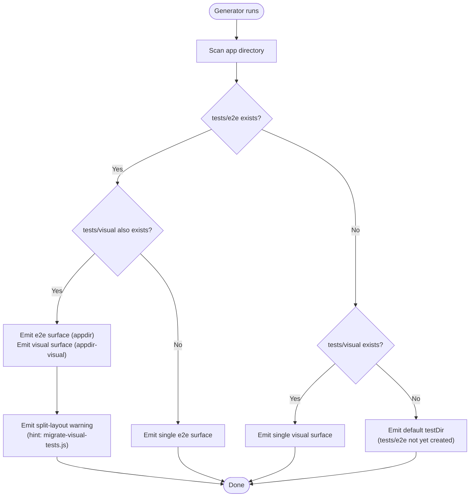
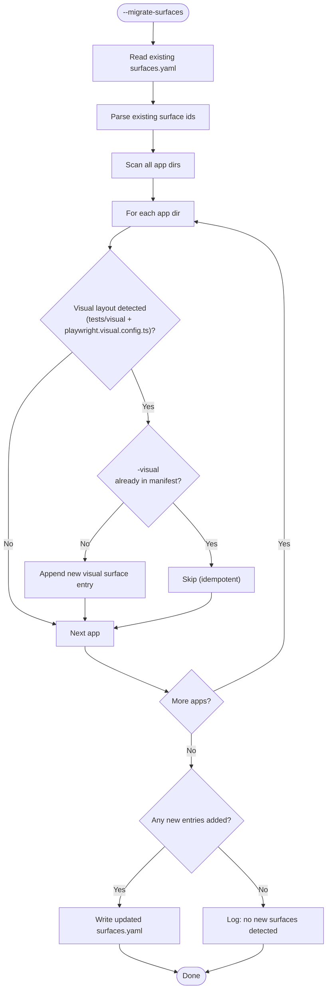
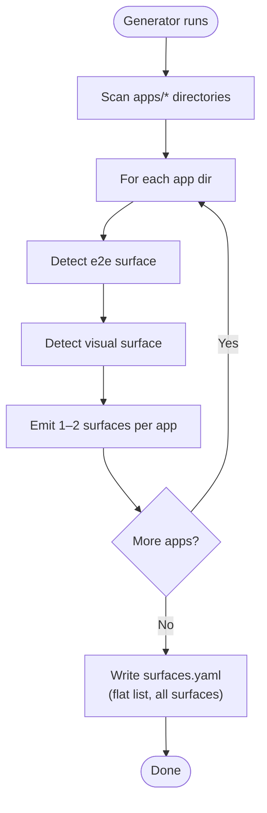
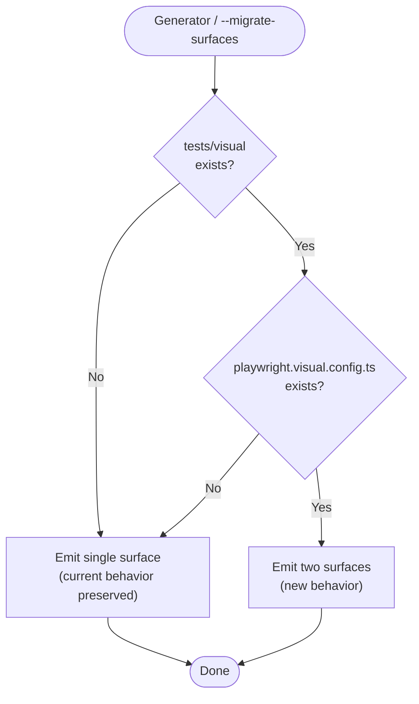

# Feature Spec: Multi-Surface Detection and Migration

- **Feature:** Multi-Surface Detection and Migration
- **Branch:** feature/036-multi-surface-detection-and-migration
- **Date:** 2026-05-07
- **Status:** Draft
- **Priority:** P1
- **Scope:** M
- **Input:** Support detection of multiple Playwright surfaces (e2e + visual) in `.specs/surfaces.yaml`. For new projects, the surface generator (`scripts/generate-surfaces.js`) must auto-detect when both `tests/e2e/` and `tests/visual/` coexist (each with their own `playwright.config.ts` / `playwright.visual.config.ts`) and emit one `surfaces.yaml` entry per detected surface. For legacy projects already initialized with a single-surface manifest, provide a migration path to add and manage the missing visual surface(s). Must not break projects already on the canonical post-`migrate-visual-tests.js` layout (single unified surface).
- **Feature Number:** 036
- **Deps:** 011 (Visual Migrate Integration), 035 (Unified CLI Surface)

---

## User Scenarios & Testing

### Story 1 — Developer initializes a new project with split e2e + visual layouts `P1`

A developer running `node scripts/generate-surfaces.js` on a project that has both `apps/web/tests/e2e/` (with `playwright.config.ts`) and `apps/web/tests/visual/` (with `playwright.visual.config.ts`) gets a `surfaces.yaml` with two entries: one for the e2e surface (`id: web`) and one for the visual surface (`id: web-visual`). Each entry correctly points to its own `testDir` and `runnerConfig`. A warning message hints that `migrate-visual-tests.js` can consolidate into a single surface if preferred.

**Priority reason:** This is the core gap — the generator silently drops the visual surface when both layouts coexist.

**Independent test:** Run the generator against a fixture project with both layouts and verify two surfaces appear in output.

```gherkin
Feature: Multi-surface generation for split layout
  Scenario: Both e2e and visual test dirs detected
    Given a project app directory has both "tests/e2e" and "tests/visual" subdirectories
    And "tests/e2e" contains a "playwright.config.ts" file
    And "tests/visual" contains a "playwright.visual.config.ts" file
    When the generator runs against that app directory
    Then surfaces.yaml contains two entries for that app
    And the first entry has id matching the app dir name and testDir pointing to "tests/e2e"
    And the first entry has runnerConfig pointing to "playwright.config.ts"
    And the second entry has id matching "<appdir>-visual" and testDir pointing to "tests/visual"
    And the second entry has runnerConfig pointing to "playwright.visual.config.ts"
    And the generator emits a warning suggesting migrate-visual-tests.js as an alternative

  Scenario: Only e2e test dir exists — single surface emitted (no regression)
    Given a project app directory has only "tests/e2e" with a "playwright.config.ts"
    And no "tests/visual" directory exists
    When the generator runs against that app directory
    Then surfaces.yaml contains exactly one entry for that app
    And that entry has id matching the app dir name and testDir pointing to "tests/e2e"
    And no warning about split layout is emitted

  Scenario: Only visual test dir exists — single surface emitted
    Given a project app directory has only "tests/visual" with a "playwright.visual.config.ts"
    And no "tests/e2e" directory exists
    When the generator runs against that app directory
    Then surfaces.yaml contains exactly one entry for that app
    And that entry has id matching the app dir name and testDir pointing to "tests/visual"
```



---

### Story 2 — Developer migrates a legacy project with an existing single-surface manifest `P2`

A developer on a legacy project that already has a `surfaces.yaml` with one entry per app (generated before this feature) runs `node scripts/generate-surfaces.js --migrate-surfaces`. The tool detects which apps have a visual layout not yet declared in the manifest, appends new visual surface entries, and leaves existing entries untouched. Running it a second time is a no-op (idempotent).

**Priority reason:** Existing projects cannot regenerate from scratch — they may have manual edits in `surfaces.yaml`.

**Independent test:** Run `--migrate-surfaces` on a fixture with an existing manifest missing a visual entry and verify the entry is appended without touching existing lines.

```gherkin
Feature: Legacy manifest migration for missing visual surfaces
  Scenario: Legacy manifest missing visual surface — appended non-destructively
    Given a surfaces.yaml exists with one entry for app "web" pointing to "tests/e2e"
    And the app directory also has "tests/visual" with "playwright.visual.config.ts"
    When the generator runs with "--migrate-surfaces"
    Then surfaces.yaml still contains the original "web" entry unchanged
    And a new "web-visual" entry has been appended to surfaces.yaml
    And the "web-visual" entry points to "tests/visual" and "playwright.visual.config.ts"

  Scenario: Migration is idempotent
    Given a surfaces.yaml already contains both "web" and "web-visual" entries
    When the generator runs with "--migrate-surfaces" again
    Then surfaces.yaml is byte-for-byte identical to before the run
    And the generator exits 0 with a "no new surfaces detected" message

  Scenario: Manifest has manual edits — user edits preserved
    Given a surfaces.yaml has a custom "name" field manually edited to "Main Web App"
    When the generator runs with "--migrate-surfaces"
    Then the "name" field retains its custom value "Main Web App"
    And no other fields in the existing entry are modified
```



---

### Story 3 — Developer works in a monorepo with multiple apps each having split layouts `P2`

A developer's monorepo has `apps/web` and `apps/dashboard`, each with both `tests/e2e/` and `tests/visual/`. Running the generator produces four surfaces: `web`, `web-visual`, `dashboard`, `dashboard-visual`. The `surfaces.yaml` schema is unchanged (flat list) and each entry correctly identifies its own testDir and runnerConfig.

**Priority reason:** Monorepos multiply the surface count; the bug is worse at scale.

**Independent test:** Run the generator against a two-app monorepo fixture both having split layouts; verify four surfaces in output in the expected order.

```gherkin
Feature: Monorepo multi-app multi-surface detection
  Scenario: Two apps each with split e2e + visual layout
    Given a monorepo has apps/web with both "tests/e2e" and "tests/visual"
    And apps/web/tests/e2e has "playwright.config.ts"
    And apps/web/tests/visual has "playwright.visual.config.ts"
    And apps/dashboard with both "tests/e2e" and "tests/visual"
    And apps/dashboard/tests/e2e has "playwright.config.ts"
    And apps/dashboard/tests/visual has "playwright.visual.config.ts"
    When the generator runs
    Then surfaces.yaml contains exactly four entries
    And entries appear in order: web, web-visual, dashboard, dashboard-visual
    And each entry points to its correct testDir and runnerConfig

  Scenario: Mixed monorepo — one app split, one consolidated
    Given apps/web has both "tests/e2e" and "tests/visual" with distinct playwright configs
    And apps/mobile has only "tests/e2e" with "playwright.config.ts"
    When the generator runs
    Then surfaces.yaml contains three entries: web, web-visual, mobile
    And the mobile entry has only one surface (no -visual variant)
```



---

### Story 4 — Developer using the consolidated single-surface layout is unaffected `P1`

A developer whose project uses `migrate-visual-tests.js` to consolidate e2e + visual into a single `tests/e2e/` directory (the canonical post-migration layout) runs the generator and gets exactly one surface — the same as today. No regression, no spurious visual surface appended.

**Priority reason:** Non-regression is critical; existing users must not be broken.

**Independent test:** Run the generator on a fixture with only `tests/e2e/` and `playwright.config.ts` (no separate visual dir); verify exactly one surface.

```gherkin
Feature: No regression for consolidated single-surface layout
  Scenario: Consolidated layout produces exactly one surface
    Given an app directory has only "tests/e2e" with "playwright.config.ts"
    And no "tests/visual" directory exists
    And no "playwright.visual.config.ts" file exists at the app root
    When the generator runs
    Then surfaces.yaml contains exactly one entry for that app
    And no "-visual" suffixed entry is created
    And no split-layout warning is emitted

  Scenario: --migrate-surfaces is a no-op on consolidated layout
    Given surfaces.yaml already correctly describes the single consolidated surface
    And the app directory has only "tests/e2e" (no tests/visual)
    When the generator runs with "--migrate-surfaces"
    Then surfaces.yaml is unchanged
    And the generator exits 0
```



---

## Acceptance Criteria

- **AC-001** (Story 1): When `tests/e2e/` AND `tests/visual/` both exist under an app dir, the generator emits two surfaces: one with `id: <appdir>` (testDir = tests/e2e, runnerConfig = playwright.config.ts) and one with `id: <appdir>-visual` (testDir = tests/visual, runnerConfig = playwright.visual.config.ts).

- **AC-002** (Story 1): The generator emits a `[WARNING]` line to stdout when a split layout is detected, mentioning `migrate-visual-tests.js` as an alternative consolidation path.

- **AC-003** (Story 1): When only `tests/e2e/` exists (no `tests/visual/`), exactly one surface is emitted — identical to today's output (no regression).

- **AC-004** (Story 1): When only `tests/visual/` exists (no `tests/e2e/`), exactly one surface is emitted with `testDir = tests/visual` and `runnerConfig` pointing to `playwright.visual.config.ts` if present.

- **AC-005** (Story 2): The `--migrate-surfaces` flag reads an existing `surfaces.yaml`, detects missing visual surfaces, and appends them. Existing entries are byte-for-byte identical after migration.

- **AC-006** (Story 2): Running `--migrate-surfaces` on a manifest that already contains all visual surfaces is a no-op (exits 0, no file written, message: "No new surfaces detected").

- **AC-007** (Story 2): The `--migrate-surfaces` flag does not require `--force` and works even when `surfaces.yaml` exists (it is explicitly an additive-only operation, never a full overwrite).

- **AC-008** (Story 3): In a monorepo with N apps each having split layouts, the generator emits 2N surfaces in the order: `<app1>`, `<app1>-visual`, `<app2>`, `<app2>-visual`, ... (app-interleaved ordering).

- **AC-009** (Story 3): The `surfaces.yaml` schema remains a flat `surfaces:` list — no nested structure or new top-level keys are introduced.

- **AC-010** (Story 4): Projects using the consolidated single-surface layout (only `tests/e2e/`, no `tests/visual/`) are unaffected — the generator emits exactly one surface as before.

- **AC-011** (Story 4): The `--dry-run` flag works correctly for the new multi-surface case — it prints all surfaces that would be emitted without writing the file.

- **AC-012** (Stories 1–3): The `id` derivation rule is: `<appdir>` for the e2e surface, `<appdir>-visual` for the visual surface. If `<appdir>-visual` already exists as an app directory name (collision), append `-v2` to the visual surface id and emit a warning.

---

## Functional Requirements

- **FR-001** (AC-001, AC-003, AC-004): The `detectTestDir()` function is replaced by a `detectTestDirs()` function that returns a list of `{testDir, configFile}` tuples — one per detected test directory + config file pair under an app dir. The list contains at most two entries: one for `tests/e2e` (with `playwright.config.ts`) and one for `tests/visual` (with `playwright.visual.config.ts`).

- **FR-002** (AC-001, AC-008): The `detectSurfaces()` function emits one surface object per `{testDir, configFile}` tuple from `detectTestDirs()`. For each app dir, if two tuples are returned, two surfaces are emitted with ids `<appdir>` and `<appdir>-visual` respectively.

- **FR-003** (AC-002): When `detectTestDirs()` returns two tuples for an app dir, the generator must call `console.warn()` with a message that includes the app dir name and the text `migrate-visual-tests.js` to suggest consolidation.

- **FR-004** (AC-005, AC-006, AC-007): A `--migrate-surfaces` flag is added to the script. When present, the script reads the existing `surfaces.yaml`, computes which visual surfaces are missing (by running `detectTestDirs()` on all app dirs and comparing against existing ids), appends the missing entries preserving all existing content, and writes the updated file. If nothing to add, exits 0 with a log message.

- **FR-005** (AC-009): The `toYaml()` function and the surfaces.yaml output schema are unchanged. Surfaces remain a flat list. The visual surface entry uses the same fields as any other surface (`id`, `name`, `path`, `testDir`, `runner`, `runnerConfig`).

- **FR-006** (AC-010, AC-011): The existing `--dry-run` and `--force` flags continue to work as today. `--dry-run` prints all surfaces (including new visual ones) without writing. `--force` regenerates the full file from scratch (no partial migration logic needed when `--force` is active).

- **FR-007** (AC-012): The id derivation rule is documented in a JSDoc comment on `detectSurfaces()`. Collision detection checks whether `<appdir>-visual` already exists as an app directory name in the same `apps/` scan; if so, the visual surface id becomes `<appdir>-visual-v2` and a warning is emitted.

- **FR-008** (AC-001, AC-004): `findPlaywrightConfig()` is extended to also match `playwright.visual.config.ts` and `playwright.visual.config.js`. This function is called once per candidate test dir, not once per app dir.

---

## Key Entities

| Entity | Description |
|--------|-------------|
| `Surface` | A single test surface: `{id, name, path, testDir, runner, runnerConfig}` |
| `TestDirEntry` | Internal tuple: `{testDir: string, configFile: string \| null}` returned by `detectTestDirs()` |
| `surfaces.yaml` | The output manifest — flat list of Surface entries |
| `--migrate-surfaces` | CLI flag that triggers additive-only migration mode |
| Split layout | A project structure where `tests/e2e/` and `tests/visual/` coexist as sibling directories |
| Consolidated layout | Post-`migrate-visual-tests.js` layout where only `tests/e2e/` exists |

---

## Edge Cases

1. **App dir named `<appdir>-visual`**: If `apps/web-visual` and `apps/web` both exist, the visual surface for `apps/web` would collide with the e2e surface for `apps/web-visual`. The collision detection rule (FR-007) handles this by using `<appdir>-visual-v2`.

2. **No `playwright.visual.config.ts` but `tests/visual/` exists**: Emit the visual surface with `runnerConfig: null` (same behavior as e2e when no config found). The visual dir is the signal, not the config file.

3. **Both `playwright.visual.config.ts` at app root AND inside `tests/visual/`**: Prefer the one inside the testDir (closer to the tests); fall back to app-root config.

4. **`--migrate-surfaces` with `--dry-run`**: Print what would be appended without writing. Both flags can be combined.

5. **`--migrate-surfaces` with `--force`**: `--force` takes precedence — regenerate from scratch (full overwrite, not append). Document this interaction in the `--help` output.

6. **Empty `apps/` directory**: No app dirs found — no surfaces emitted (same as today).

7. **`tests/visual/` exists but contains no test files**: Still emit the visual surface. The generator is a layout detector, not a test-file validator.

8. **`packages/` fallback (no `apps/` dir)**: The same split-layout detection logic applies in the `packages/` scan path.

---

## Success Criteria

- **SC-001**: Running the generator on a project with both `tests/e2e/` and `tests/visual/` produces two surfaces with correct ids, testDirs, and runnerConfigs. Verified by `tests/test_generate_surfaces.js` (or equivalent Node.js test file).

- **SC-002**: Running `--migrate-surfaces` on a legacy 1-surface manifest for a project that has a visual dir appends exactly one new entry and leaves all other content unchanged.

- **SC-003**: All existing generator tests continue to pass (no regression). The single-surface case is explicitly covered as a test.

- **SC-004**: The `surfaces.yaml` schema validator (if any) accepts manifests with visual surface entries without modifications.

- **SC-005**: The `--dry-run` output for a split-layout project shows two surfaces per app instead of one.

---

## Behavioral AC

<!-- No UI signals detected in this feature — CLI/scripting feature only. No Behavioral AC section generated. -->

---

*LiveSpec v3 — Feature 036*
