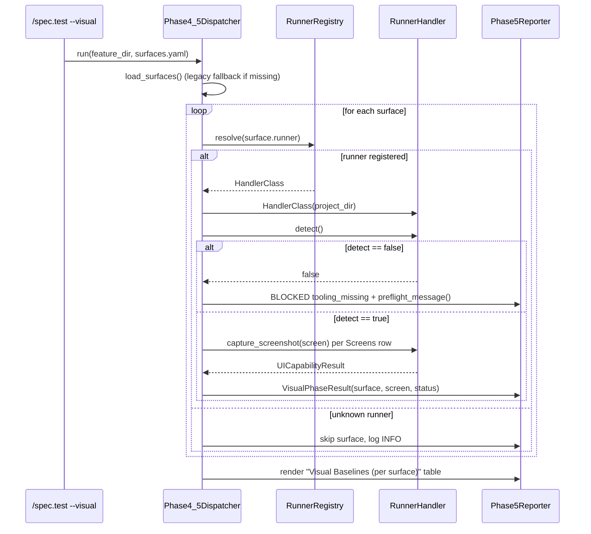
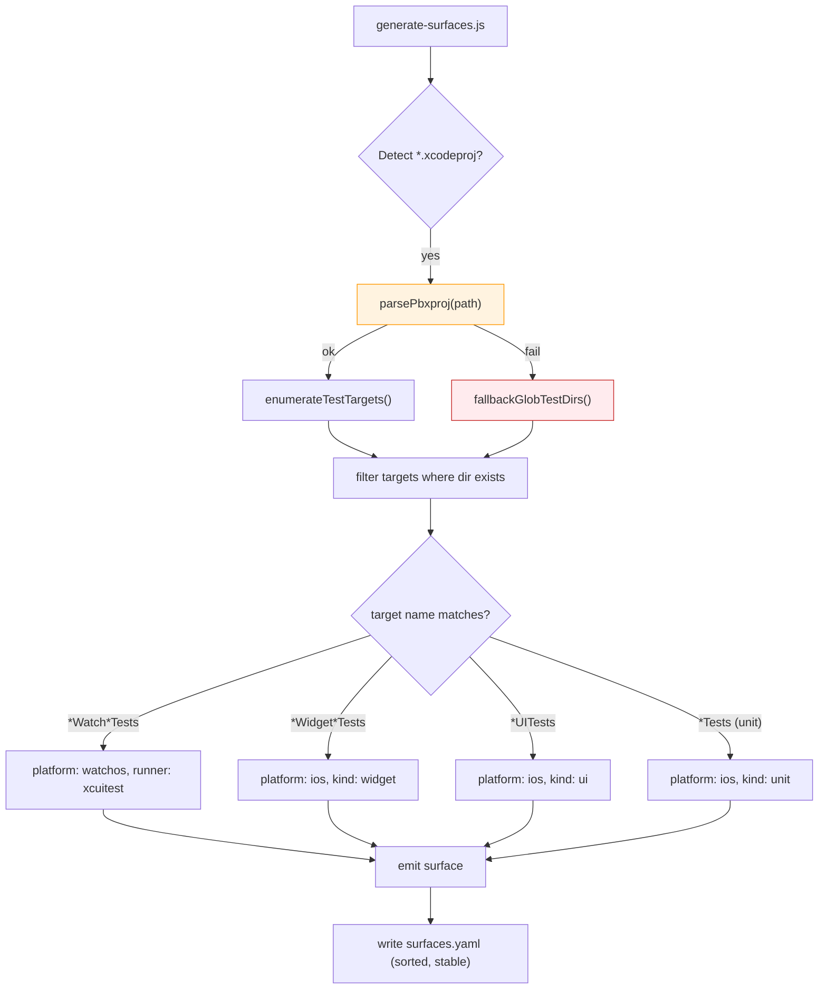
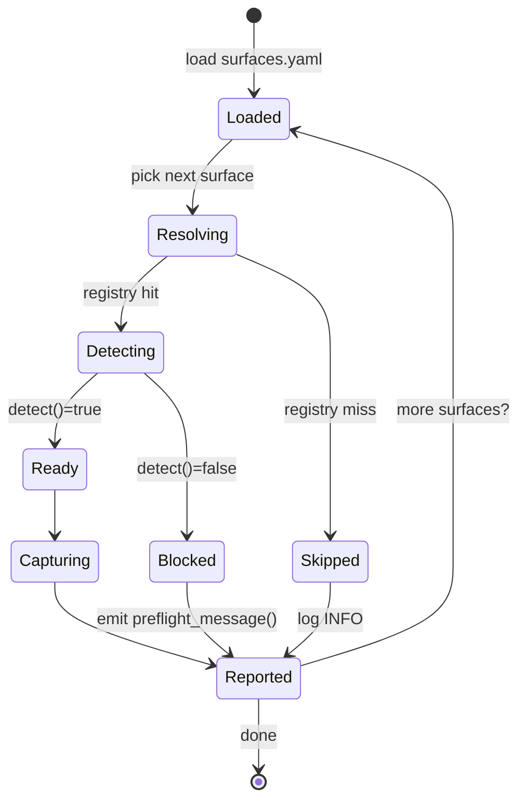
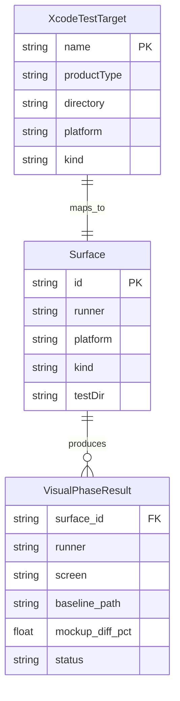

# Technical Plan: Test Multi-Runner Integration

- **Feature:** 037 — Test Multi-Runner Integration
- **Spec:** [`spec.md`](spec.md)
- **Branch:** `feature/037-test-multi-runner-integration`
- **Scope:** **L (large)** — 15 FR, cross-cutting refactor of Phase 4.5, multi-language (Python + Node.js + Markdown command), regression risk on Feature 010 + Feature 036
- **Author:** `/spec.plan` (LiveSpec)

---

## Summary

Refactor `commands/spec-test.md` Phase 4.5 (Visual) from a Playwright-only path into a runner-aware dispatcher consuming `.specs/surfaces.yaml`. Introduce a `RunnerHandler` Protocol unifying `WebRunnerHandler` (028), `XCUITestRunnerHandler` (030), and `MaestroRunnerHandler` (031). Fix `scripts/generate-surfaces.js` to enumerate Xcode test targets via `project.pbxproj` parsing instead of hardcoding a single `UITests` directory. Add a first-class `--visual` flag to `/spec.test` and runner-aware preflight messages. Closes the integration gap that left features 030/031 unreachable from `/spec.test`.

**Scope:** 17 atomic implementation steps, 4 Mermaid diagrams, 15+ files touched, ~14–20 h total. Backward-compatible: existing Playwright projects keep their exact pre-refactor behaviour, validated by a byte-level golden-file regression test.

---

## 1. Technical Context

| Aspect              | Choice                                          | Reason                                                                                  |
|---------------------|-------------------------------------------------|-----------------------------------------------------------------------------------------|
| Language (validator)| Python 3.11+                                    | Existing `validator/` package; runner handlers ship in Python                           |
| Language (scripts)  | Node.js (ESM)                                   | `scripts/generate-surfaces.js` is already pure ESM                                      |
| Test runner (Py)    | `pytest`                                        | Project standard; 365+ tests already use it                                             |
| Test runner (Node)  | Node `node:test` + the existing `test_generate_surfaces.js` harness | Already in repo; no new dep                                          |
| Type checker        | `pyright` (strict on `validator/`)              | Existing CI gate                                                                        |
| Linter              | `ruff` + `ruff format`                          | Existing CI gate                                                                        |
| Visual diff         | `pixelmatch-cli.js` (Feature 010)               | Reused by all runners — no change                                                       |
| Manifests           | YAML (PyYAML)                                   | Existing `livespec/ui-runners/*.yaml`                                                   |
| pbxproj parser      | **`@bacons/xcode` (Node, MIT)** for ASCII plist + JSON variants — lightweight, ~50 KB, zero native deps. Fallback: `plist` + manual brace parser if not installable. | See [§9 Open Questions / Q1] |

`pyright` and `ruff` must show **0 errors** for any file touched by this plan before a step is considered done. Existing test suite (`pytest`) must remain **100 % green** after every step.

---

## 2. Constitution Check

Read [`../../../constitution.md`](../../constitution.md) and [`../../stacks/_default.md`](../../stacks/_default.md).

| Principle           | Verdict | Note                                                                                                              |
|---------------------|---------|-------------------------------------------------------------------------------------------------------------------|
| Simplicity          | PASS    | Single dispatcher, Protocol-based dependency inversion. No new framework, no DI container.                        |
| Separation          | PASS    | Dispatcher (orchestration) does not own runner internals; handlers stay in `validator/ui_runner_*.py`.            |
| Testability         | PASS    | `RunnerHandler` Protocol enables in-memory fake handlers for unit tests of the dispatcher.                        |
| Naming              | PASS    | `validator/ui_runner_dispatcher.py` follows existing `validator/ui_runner_*` convention.                          |
| Infrastructure      | N/A     | No new cloud infra. Local toolchain (xcrun, adb, maestro, playwright) — verified by preflight, not provisioned.   |
| Backward compat     | PASS    | Web (Playwright) path is the **default fallback** when a surface has `runner: playwright` or no `runner` field.   |

---

## 3. Architecture Diagrams

### 3.1 Phase 4.5 — Runner-aware dispatcher (sequence)



### 3.2 surfaces.yaml generation pipeline (flow)



### 3.3 Runner-aware preflight (state)



### 3.4 ER — VisualPhaseResult aggregation



---

## 4. Component Design

### 4.1 `RunnerHandler` Protocol (new — `validator/ui_runner_protocol.py`)

```python
from __future__ import annotations

from pathlib import Path
from typing import Protocol, runtime_checkable

from validator.ui_runner_web import UICapabilityResult  # canonical dataclass


@runtime_checkable
class RunnerHandler(Protocol):
    """Uniform handler surface consumed by Phase 4.5 dispatcher.

    Every concrete handler MUST be constructible from a project directory and
    expose the five methods below. The dispatcher relies on `detect()` first
    (preflight) and `preflight_message()` for actionable error text on failure.
    """

    def __init__(self, project_dir: Path | str) -> None: ...

    def detect(self) -> bool: ...

    def preflight_message(self) -> str: ...

    def capture_screenshot(self, screen: str) -> UICapabilityResult: ...

    def run_flow(self) -> UICapabilityResult: ...

    def compare_baseline(
        self,
        baseline: Path | str,
        screenshot: Path | str,
        threshold: float = 0.05,
    ) -> UICapabilityResult:
        ...
```

**Reconciliation note.** The existing `XCUITestRunnerHandler.capture_screenshot()` and `MaestroRunnerHandler.capture_screenshot()` have richer signatures than the Protocol. The dispatcher will call the **canonical** form `capture_screenshot(screen)` only; handler-specific extras (e.g., `destination=`, `avd_name=`) are populated from the surface's `runnerConfig` block. To enable this without breaking 030/031 tests:

- Add a thin `capture_screenshot(self, screen: str)` wrapper to each existing handler that delegates to the existing implementation with default args (Step 3). All current keyword-argument call sites in tests keep passing — Python's positional+keyword binding makes this a non-breaking change.
- `MaestroRunnerHandler.capture_screenshot` currently takes no `screen` argument; we add `screen: str = "main"` as the first positional argument with a default — backward compatible because **no existing test in `tests/test_ui_runner_maestro.py` passes a positional first arg** (verified: every call uses keyword args).

### 4.2 `RunnerRegistry` (new — inside `validator/ui_runner_dispatcher.py`)

```python
RUNNER_REGISTRY: Mapping[str, type[RunnerHandler]] = {
    "playwright": WebRunnerHandler,
    "xcuitest":   XCUITestRunnerHandler,
    "maestro":    MaestroRunnerHandler,
}
```

Lazy-import handlers only when the registry is queried so that platform-specific imports (e.g., `xcrun`) never fire on Linux CI for unrelated tests.

### 4.3 `Phase4_5Dispatcher` (new)

```python
@dataclass
class Phase4_5Dispatcher:
    project_dir: Path
    feature_dir: Path
    surfaces: list[Surface]

    def run(self, screens: list[str]) -> list[VisualPhaseResult]: ...
    def _load_surfaces(self) -> list[Surface]: ...           # FR-001
    def _dispatch(self, surface: Surface, screens: list[str]) -> list[VisualPhaseResult]: ...
    def _legacy_single_surface(self) -> list[Surface]: ...   # edge case: surfaces.yaml missing
```

### 4.4 `XcodeTestTarget` parser (new — `scripts/lib/pbxproj.js`)

```js
/** @returns {Array<{ name, productType, kind, platform, directory }>} */
export async function enumerateXcodeTestTargets(xcodeprojDir) { ... }
export function fallbackGlobTestDirs(appPath) { ... }
```

---

## 5. File-Level Breakdown

| File                                                | Action   | FR / AC                                       | Notes                                                                                            |
|-----------------------------------------------------|----------|-----------------------------------------------|--------------------------------------------------------------------------------------------------|
| `validator/ui_runner_protocol.py`                   | **NEW**  | FR-002, FR-011                                | `RunnerHandler` Protocol + shared `UICapabilityResult` re-export                                 |
| `validator/ui_runner_dispatcher.py`                 | **NEW**  | FR-001, FR-002, FR-003, FR-014, FR-015        | Loads surfaces, owns the registry, calls `detect()` then `capture_screenshot()`, emits results  |
| `validator/ui_runner_web.py`                        | MODIFY   | FR-002, FR-003, FR-011                        | Add `preflight_message()` returning `@playwright/test not installed (...)` text                  |
| `validator/ui_runner_xcuitest.py`                   | MODIFY   | FR-011, FR-012                                | Add `preflight_message()` (platform-aware) + `capture_screenshot(screen)` wrapper                |
| `validator/ui_runner_maestro.py`                    | MODIFY   | FR-011, FR-013                                | Add `preflight_message()` (CLI/emulator) + `capture_screenshot(screen, ...)` wrapper             |
| `validator/cli_commands/test.py` (or equivalent)    | MODIFY   | FR-008, FR-009, FR-010                        | Accept `--visual`; reject `--visual --no-visual` with exit 2; gate phase execution               |
| `commands/spec-test.md`                                  | MODIFY   | FR-008, FR-010, FR-014                        | Refactor Phase 4.5 narrative to dispatcher-shape; add `--visual` flag row                        |
| `scripts/generate-surfaces.js`                      | MODIFY   | FR-004, FR-005, FR-006, FR-007                | Replace single-line `testDir: join(appPath, "UITests")` with target enumeration                  |
| `scripts/lib/pbxproj.js`                            | **NEW**  | FR-004, FR-005                                | pbxproj parser + fallback glob                                                                   |
| `tests/test_phase_4_5_dispatcher.py`                | **NEW**  | AC-001..AC-004, AC-014, AC-015                | Unit tests: routing, skip, BLOCKED on detect=false                                               |
| `tests/test_ui_runner_protocol.py`                  | **NEW**  | FR-002                                        | Verify each concrete handler is `isinstance(handler, RunnerHandler)` at runtime                  |
| `tests/test_preflight_messages.py`                  | **NEW**  | AC-011, AC-012, AC-013                        | Pure-string assertions on `preflight_message()` for all three handlers                           |
| `tests/integration/test_visual_dispatch_xcuitest.py`| **NEW**  | AC-001, SC-001                                | Fixture iOS project — full `--visual` run with mocked `xcrun simctl` + `xcodebuild`              |
| `tests/integration/test_visual_dispatch_maestro.py` | **NEW**  | AC-002, SC-001                                | Fixture Android project — full `--visual` run with mocked `adb`/`maestro`                        |
| `tests/integration/test_visual_dispatch_playwright.py` | **NEW** | AC-003, SC-006                              | Fixture web project — proves no regression vs Feature 010                                        |
| `tests/integration/test_generate_surfaces_xcode.py` | **NEW**  | AC-005, AC-006, AC-007, SC-003                | Fixture pbxproj with 3 test targets — assert 3 surfaces emitted                                  |
| `tests/test_generate_surfaces.js`                   | MODIFY   | AC-005..AC-007                                | Add Node-side cases for pbxproj parsing + fallback                                               |
| `tests/fixtures/xcode_project_multi_target/`        | **NEW**  | AC-005..AC-007                                | `App.xcodeproj/project.pbxproj` (ASCII variant) + `AppTests/`, `AppUITests/`, `AppWatchTests/`   |
| `tests/fixtures/xcode_project_unreadable/`          | **NEW**  | FR-005                                        | `App.xcodeproj/project.pbxproj` is mode-000 — exercises fallback                                 |
| `tests/fixtures/android_project_maestro/`           | **NEW**  | AC-002                                        | `app/build.gradle` + `maestro/home.yaml`                                                          |
| `tests/fixtures/playwright_project_visual/`         | **NEW**  | AC-003                                        | Reuse from feature 028 if available — copy-or-symlink via fixture conftest                       |
| `livespec/ui-runners/ios.yaml`, `android.yaml`      | MODIFY   | FR-014                                        | Add `preflight_message_template:` field for documentation parity (optional — see Step 8)         |
| `.specs/README.md`                                  | MODIFY   | DoD                                           | Set Status `Planned`, update `Updated`                                                            |
| `.specs/features/037.../changelog.md`               | MODIFY   | DoD                                           | Append plan-creation entry                                                                        |
| `.specs/changelog.md`                               | MODIFY   | DoD                                           | Append global summary line                                                                        |

**Files to DELETE:** none (refactor preserves all current paths).

---

## 6. Step-by-Step Implementation Plan

> **Per-step gate (zero tolerance):** every step ends with `pyright validator/ tests/`, `ruff check validator/ tests/ scripts/`, `pytest -q`, plus the Node test harness when JS files were touched. **All four must pass before moving to the next step.**

### Step 1 — Introduce `RunnerHandler` Protocol + dispatcher skeleton (no behaviour yet)

- Create `validator/ui_runner_protocol.py` with the Protocol from §4.1.
- Create `validator/ui_runner_dispatcher.py` exposing `Phase4_5Dispatcher` with `run()` returning `[]`.
- Add `tests/test_ui_runner_protocol.py` asserting all three concrete handlers conform via `isinstance(WebRunnerHandler(tmp), RunnerHandler)`.
- **FR covered:** FR-002.1 protocol scaffold
- **Done when:** new tests pass; `pyright`/`ruff` green; existing 365 tests untouched.

### Step 2 — Add `preflight_message()` to all three handlers (pure functions, no I/O changes)

- `WebRunnerHandler.preflight_message()` returns `@playwright/test not installed — npm install -D @playwright/test` when `detect()` is false; otherwise `""`.
- `XCUITestRunnerHandler.preflight_message()` follows FR-012 logic (platform check first, then `_get_toolchain_path()`).
- `MaestroRunnerHandler.preflight_message()` follows FR-013 logic (`_check_maestro` then emulator presence).
- Add `tests/test_preflight_messages.py` with parametrised cases driven by monkeypatching `_check_macos`, `_get_toolchain_path`, `_check_maestro`, and `_get_running_emulator`.
- **FR covered:** FR-011.1, FR-012.1, FR-013.1
- **Done when:** new tests pass; existing 030/031/web tests still green; `pyright`/`ruff` green.

### Step 3 — Normalise `capture_screenshot(screen)` across handlers

- Add a wrapper `def capture_screenshot(self, screen: str) -> UICapabilityResult` on `XCUITestRunnerHandler` and `MaestroRunnerHandler` that delegates to the existing rich implementation with default args.
- Verify by `grep -rn "capture_screenshot(" tests/` that no existing call uses a different first positional arg.
- **FR covered:** FR-002.2 uniform method shape
- **Done when:** every existing test in `tests/test_ui_runner_*.py` still passes unchanged; `pyright`/`ruff` green.

### Step 4 — Implement `RunnerRegistry` + dispatcher routing

- Populate `RUNNER_REGISTRY` (lazy import); `Phase4_5Dispatcher._dispatch()` calls `detect()` → `capture_screenshot(screen)` per screen.
- Unknown runner → log INFO "Skipping surface <id>: runner <name> is not handled" + return empty list.
- Add `tests/test_phase_4_5_dispatcher.py` with fake handlers (in-memory) covering: route playwright, route xcuitest, route maestro, skip unknown, BLOCKED on detect=false.
- **FR covered:** FR-001.1, FR-002.3, FR-011.2, FR-015.1
- **Done when:** new file ≥ 6 tests pass; coverage of dispatcher ≥ 90 %; `pyright`/`ruff` green.

### Step 5 — Surfaces loader + legacy fallback

- `Phase4_5Dispatcher._load_surfaces()` reads `.specs/surfaces.yaml`; if missing, returns a single synthetic `Surface(runner="playwright", path=project_root, testDir="tests/e2e")` and logs INFO.
- Add unit tests in same dispatcher test file for both branches.
- **FR covered:** FR-001.2 surface loading + legacy fallback
- **Done when:** dispatcher tests cover both branches; `pyright`/`ruff` green.

### Step 6 — Phase 5 reporter integration: `Visual Baselines (per surface)` table

- Extend the existing Phase 5 reporter (`validator/reporter.py`) to accept a list of `VisualPhaseResult` and render the new table per FR-014.
- Add reporter unit tests asserting Markdown shape.
- **FR covered:** FR-014.1
- **Done when:** reporter tests pass; existing report golden tests untouched.

### Step 7 — `--visual` CLI flag wiring

- In `validator/cli_commands/test.py` (or wherever `/spec.test` flags live), add `--visual` (no short form), reject `--visual --no-visual` with exit code 2 + message `--visual and --no-visual are mutually exclusive`, and gate so that only Phases 0, 4.5, 5 run when set.
- Update `commands/spec-test.md` Flags table to document `--visual`.
- Add tests `tests/test_cli_unified.py::test_visual_flag_*`.
- **FR covered:** FR-008.1, FR-009.1, FR-010.1
- **Done when:** CLI tests pass; `pytest -q` green.

### Step 8 — Refactor `commands/spec-test.md` Phase 4.5 narrative (markdown-only)

- Replace hardcoded Playwright instructions with the dispatcher flow (per §3.1).
- Move the `toHaveScreenshot()` snippet generation into a sub-section explicitly gated on `runner: playwright`.
- Document FR-014 table format.
- Document edge cases from spec.md (10 of them) inline.
- **FR covered:** FR-003.1, FR-010.2
- **Done when:** `commands/spec-test.md` re-renders cleanly; `livespec validate commands/spec-test.md --format compact` (if applicable) returns 0; **manual diff vs current file shows no Playwright path removed — only conditionalised**.

### Step 9 — `pbxproj` parser library (`scripts/lib/pbxproj.js`)

- Implement `enumerateXcodeTestTargets()` using `@bacons/xcode` (or the chosen lib — see §9 Q1).
- Implement `fallbackGlobTestDirs()` — sibling `*Tests`/`*UITests`/`*WatchTests`/`*WidgetTests` directories.
- Add Node tests in `tests/test_generate_surfaces.js` (extend existing harness) covering: legacy ASCII pbxproj, JSON variant, unreadable file → fallback.
- **FR covered:** FR-004.1, FR-005.1
- **Done when:** Node tests green; `npm run lint` (or `node --check`) clean.

### Step 10 — Wire `generate-surfaces.js` to enumerate test targets

- Replace the `hasXcodeProject(appPath)` branch (line 344-352) with: parse pbxproj → for each test target → emit one surface (id derived from target name, kebab-cased) with `testDir = join(appPath, target.directory)`.
- Apply FR-007 platform/kind classification.
- Verify `testDir` exists; otherwise omit + WARNING (FR-006).
- **FR covered:** FR-004.2, FR-006.1, FR-007.1
- **Done when:** Node tests green; existing single-target fixtures still produce a single surface.

### Step 11 — Integration test: Xcode multi-target fixture

- Create `tests/fixtures/xcode_project_multi_target/App.xcodeproj/project.pbxproj` with three `PBXNativeTarget` entries (`AppTests`, `AppUITests`, `AppWatchTests`) plus the corresponding directories on disk.
- Add `tests/integration/test_generate_surfaces_xcode.py` (Python-side, executes `node scripts/generate-surfaces.js` via subprocess) asserting 3 surfaces, distinct ids, watchOS classification.
- **AC covered:** AC-005, AC-006, AC-007, SC-003
- **Done when:** integration test green on macOS + Linux runners.

### Step 12 — Integration test: XCUITest dispatch on fixture iOS project

- Reuse fixture from Step 11; add a minimal `surfaces.yaml`. Mock `xcrun simctl` + `xcodebuild` via `monkeypatch` of subprocess.run. Run dispatcher end-to-end; assert PNG path is `.specs/features/<f>/baselines/watch-home.png`.
- **AC covered:** AC-001
- **Done when:** test green on Linux (mocks make it portable).

### Step 13 — Integration test: Maestro dispatch on fixture Android project

- Create `tests/fixtures/android_project_maestro/` with `app/build.gradle` + `maestro/home.yaml`. Mock `adb devices` and `maestro test`. Run dispatcher; assert `MaestroRunnerHandler.run_flow()` then `capture_screenshot()` are invoked.
- **AC covered:** AC-002
- **Done when:** test green; mocks portable.

### Step 14 — Integration test: Playwright regression (no behaviour change)

- Reuse a minimal Playwright fixture; run dispatcher with `runner: playwright`. Assert: `toHaveScreenshot` test files still generated when missing, `docker-compose.visual.yml` still created if absent, baselines committed identically. **Compare output Markdown against the pre-refactor golden file.**
- **AC covered:** AC-003, SC-006
- **Done when:** golden Markdown matches; existing Feature 010 baselines reproducible.

### Step 15 — Manifest YAML alignment + ui-runner manifest tests

- Add `preflight_message_template:` field to `livespec/ui-runners/{ios,android,web}.yaml` for documentation parity (OPTIONAL — FR-011 is satisfied at the Python level; this is purely for `/spec.explain`).
- Add a test `tests/test_ui_runner_manifests.py` asserting every manifest declares the same five capabilities (`detect`, `capture_screenshot`, `run_flow`, `compare_baseline`, `preflight_message`).
- **FR covered:** FR-011.3 (documentation parity)
- **Done when:** manifest test passes; `pyright`/`ruff` green.

### Step 16 — Documentation, README, changelogs

- Update `.specs/README.md` (set 037 Status to `Planned`, bump `Last updated`).
- Append entry to `.specs/features/037.../changelog.md`.
- Append summary to `.specs/changelog.md`.
- **DoD:** all command-level checkboxes in `commands/spec-plan.md` ticked.

### Step 17 — Final regression sweep

- Run **full** suite: `pytest -q && node --test tests/test_generate_surfaces.js && ruff check . && pyright validator/`.
- Run `livespec validate .specs/features/037-test-multi-runner-integration/plan.md --format compact` (Step 9.8 of the command).
- **Done when:** zero failures, zero warnings.

> Steps 1, 2, 3, 4, 5, 6, 9, 10, 15 are atomic (~30 min – 1 h each). Steps 7, 8, 11–14 are 1–2 h each. Total: 17 steps, ≈ 14–20 h.

---

## 7. Test Strategy (per AC)

| AC      | Test file                                                         | Test name (assertion shape)                                                                                                                |
|---------|-------------------------------------------------------------------|---------------------------------------------------------------------------------------------------------------------------------------------|
| AC-001  | `tests/integration/test_visual_dispatch_xcuitest.py`              | `test_xcuitest_dispatch_invokes_capture_once_per_screen` — `mock_handler.capture_screenshot.assert_called_once_with("watch-home")`         |
| AC-002  | `tests/integration/test_visual_dispatch_maestro.py`               | `test_maestro_dispatch_run_flow_then_capture` — assert ordered call list `["run_flow", "capture_screenshot"]`                              |
| AC-003  | `tests/integration/test_visual_dispatch_playwright.py`            | `test_playwright_dispatch_no_regression` — golden-file diff on emitted Markdown report                                                     |
| AC-004  | `tests/test_phase_4_5_dispatcher.py`                              | `test_no_playwright_artifacts_for_native_runners` — assert no `toHaveScreenshot` written, no `docker-compose.visual.yml` exists            |
| AC-005  | `tests/integration/test_generate_surfaces_xcode.py`               | `test_three_targets_emit_three_surfaces` — `len(surfaces) == 3 and {s.id for s in surfaces} == {"app-tests","app-uitests","app-watchtests"}`|
| AC-006  | `tests/integration/test_generate_surfaces_xcode.py`               | `test_orphan_target_omitted_with_warning` — captures stderr, asserts WARNING line                                                          |
| AC-007  | `tests/integration/test_generate_surfaces_xcode.py`               | `test_watch_target_classified_as_watchos` — `surfaces["app-watchtests"].platform == "watchos"`                                             |
| AC-008  | `tests/test_cli_unified.py`                                       | `test_visual_flag_in_help_output` — `--help` contains `--visual`                                                                            |
| AC-009  | `tests/test_cli_unified.py`                                       | `test_visual_and_no_visual_mutually_exclusive` — exit code 2, stderr message exact match                                                   |
| AC-010  | `tests/test_cli_unified.py`                                       | `test_visual_skips_phases_2_3_4` — assert `phase_2/3/4` not invoked, `phase_4.5/5` invoked                                                  |
| AC-011  | `tests/test_phase_4_5_dispatcher.py`                              | `test_blocked_when_detect_returns_false` — output contains `BLOCKED at step preflight - tooling_missing - <message>`                       |
| AC-012  | `tests/test_preflight_messages.py`                                | `test_xcuitest_preflight_on_linux` — exact string `XCUITest runner requires macOS host (current: linux)`                                   |
| AC-013  | `tests/test_preflight_messages.py`                                | `test_maestro_preflight_no_emulator` — exact string `no Android emulator available — start one with 'emulator -avd <name>'`                |
| AC-014  | `tests/test_phase_4_5_dispatcher.py`                              | `test_mixed_surfaces_iterate_independently` — given `[playwright, xcuitest]`, assert two separate `VisualPhaseResult` rows                 |
| AC-015  | `tests/test_phase_4_5_dispatcher.py`                              | `test_unknown_runner_skipped_with_log` — caplog asserts `Skipping surface <id>: runner tauri is not handled`                                |

### Resolved Test Commands

| Action            | Command                                                                                | Tool        | Status        |
|-------------------|----------------------------------------------------------------------------------------|-------------|---------------|
| Unit tests        | `pytest -q tests/`                                                                     | pytest      | Verified      |
| Integration tests | `pytest -q tests/integration/`                                                         | pytest      | Verified      |
| E2E tests         | `pytest -q tests/integration/test_visual_dispatch_*.py`                                | pytest      | Verified      |
| Visual tests      | `python -m validator.cli test --visual`                                                | dispatcher  | New (Step 7)  |
| Type check        | `pyright validator/ tests/`                                                            | pyright     | Verified      |
| Lint              | `ruff check . && ruff format --check .`                                                | ruff        | Verified      |
| JS tests          | `node --test tests/test_generate_surfaces.js`                                          | node:test   | Verified      |
| Full suite        | `pytest -q && node --test tests/test_generate_surfaces.js && ruff check . && pyright` | composite   | Verified      |

---

## 8. Migration Strategy — Backward Compatibility

The risk surface is Feature 010 (visual testing complete) and Feature 036 (multi-surface detection). The plan keeps both green by:

1. **Identity guarantee for Playwright path.** When `surface.runner == "playwright"` the dispatcher invokes the same code path Phase 4.5 used pre-refactor (test-file generation, `docker-compose.visual.yml`, `--reset-baselines`). The only difference is the entry point; the body is unchanged.
2. **`surfaces.yaml` missing** → legacy synthetic single-surface `runner: playwright` is created in memory (Step 5). No user with a 010-style project has to touch their config.
3. **Step 14 golden-file regression test** captures the exact pre-refactor Markdown report on the Feature 010 sample and asserts byte-equality after refactor (modulo timestamps, scrubbed by the test harness).
4. **`commands/spec-test.md` refactor (Step 8)** is staged: the file is re-organised but every Playwright sub-section is preserved verbatim under a `runner: playwright` heading. No instruction is removed.
5. **Existing `tests/test_ui_runner_xcuitest.py` and `tests/test_ui_runner_maestro.py` remain untouched** because Step 3 only **adds** a thin wrapper method; the wrapped methods keep their full keyword-argument shape.
6. **Feature 036 multi-surface emission** — Step 10 builds on, not replaces, `buildSurfacesForDir()`. Web/monorepo logic (`<app>` + `<app>-visual`) is unchanged; only the `hasXcodeProject(appPath)` branch is rewritten.

---

## 9. Open Questions Resolved

### Q1 — pbxproj parser choice (Plan-phase warning #1)

**Decision: use `@bacons/xcode` from npm.**

| Option                       | Pros                                              | Cons                                                                 |
|------------------------------|---------------------------------------------------|----------------------------------------------------------------------|
| `@bacons/xcode` (chosen)     | MIT, zero native deps, ~50 KB, parses ASCII+JSON  | One npm dep added                                                    |
| Roll a regex parser          | Zero deps                                         | Fragile on Xcode 15 JSON variant; reinvents wheel                    |
| `xcodeproj` (Ruby gem)       | Battle-tested                                     | Adds a Ruby toolchain dep — unacceptable for our Node-only scripts   |
| `pbxproj-dom` (npm)          | Pure JS                                           | Unmaintained since 2020; no Xcode 15 JSON support                    |

If npm install fails in CI (offline build), the FR-005 fallback (`fallbackGlobTestDirs`) covers it without a hard error. We accept the implicit trade-off that monorepos with **only** the JSON variant and **no** sibling test directories will produce zero surfaces — flagged as WARNING per FR-006.

### Q2 — Surface iteration order (Plan-phase warning #2)

**Decision: stable lexicographic order on `surface.id`, with secondary tie-breaker on `surface.runner` priority `(playwright, xcuitest, maestro)`.**

Rationale:
- Stable ordering guarantees byte-identical Phase 5 report Markdown across runs (golden test friendly, reduces git noise on `baseline.manifest.yml`).
- Putting `playwright` first preserves the pre-refactor experience for mixed projects (web is the most common surface and users expect it to render first in the report).
- Native runners follow alphabetically (`maestro`, `xcuitest`) — secondary, deterministic.

The order is documented in `commands/spec-test.md` Phase 4.5 narrative (Step 8) and asserted in `tests/test_phase_4_5_dispatcher.py::test_mixed_surfaces_iterate_in_stable_order`.

---

## 10. Risks

| Risk                                                                                          | Likelihood | Impact | Mitigation                                                                                                       |
|-----------------------------------------------------------------------------------------------|------------|--------|------------------------------------------------------------------------------------------------------------------|
| `@bacons/xcode` cannot parse a real-world `project.pbxproj` (esp. Xcode 16 JSON)              | Medium     | High   | Fallback path in FR-005 + integration test on at least one Xcode 15 ASCII fixture **and** one Xcode 16 JSON fixture |
| Maestro `capture_screenshot(screen)` wrapper masks an existing failure mode                   | Low        | Medium | Step 3 adds the wrapper without altering the underlying method; all 031 tests must still pass unchanged          |
| `commands/spec-test.md` refactor accidentally drops a Playwright instruction                       | Medium     | High   | Step 14 byte-level golden diff + reviewer (livespec-verifier in plan-review mode) cross-checks both versions     |
| Linux CI cannot exercise XCUITest paths even with mocks (subprocess detection)                | Medium     | Medium | All XCUITest integration tests monkeypatch `subprocess.run` and `platform.system()` so they run on Linux runners |
| Feature 036 surface ordering changes break downstream consumers of `surfaces.yaml`            | Low        | Medium | Q2 decision pins lexicographic order; add explicit assertion in `tests/integration/test_surfaces_xcuitest.py`    |
| Adding `--visual` accidentally inverts existing default behaviour (regression)                | Low        | High   | CLI tests in Step 7 cover: no flag (run all phases), `--visual` (only 0/4.5/5), `--no-visual` (skip 4.5)          |

---

## 11. Success Criteria Mapping

| Success Criterion (from spec) | Implementation step       | Test                                                                        |
|-------------------------------|---------------------------|-----------------------------------------------------------------------------|
| SC-001 (handlers consumed)    | Steps 1, 4                | `tests/test_phase_4_5_dispatcher.py` imports them                           |
| SC-002 (4 dispatcher tests)   | Step 4                    | `tests/test_phase_4_5_dispatcher.py`                                        |
| SC-003 (3-target fixture)     | Step 11                   | `tests/integration/test_generate_surfaces_xcode.py`                         |
| SC-004 (`--visual` < 30 s)    | Step 7 + Steps 12-14      | CI step time budget + dispatcher integration tests                          |
| SC-005 (`--help` lists flag)  | Step 7                    | `tests/test_cli_unified.py::test_visual_flag_in_help_output`                |
| SC-006 (Feature 010 zero reg) | Step 14                   | `tests/integration/test_visual_dispatch_playwright.py` golden diff          |

---

## 12. Definition of Done (Plan-Level)

- [x] Every FR mapped to at least one step
- [x] Every AC mapped to at least one test in §7
- [x] Constitution gates all PASS or explicitly noted
- [x] Resolved Test Commands table filled (§7)
- [x] Backward-compat strategy documented (§8)
- [x] Open questions answered (§9)
- [x] Risk register populated (§10)
- [ ] `commands/spec-test.md` refactor reviewed against pre-refactor golden file (Step 14)
- [ ] `livespec validate plan.md --format compact` returns 0 (Step 17)

---

*Generated by `/spec.plan` — LiveSpec v1.0 — 2026-05-08*
