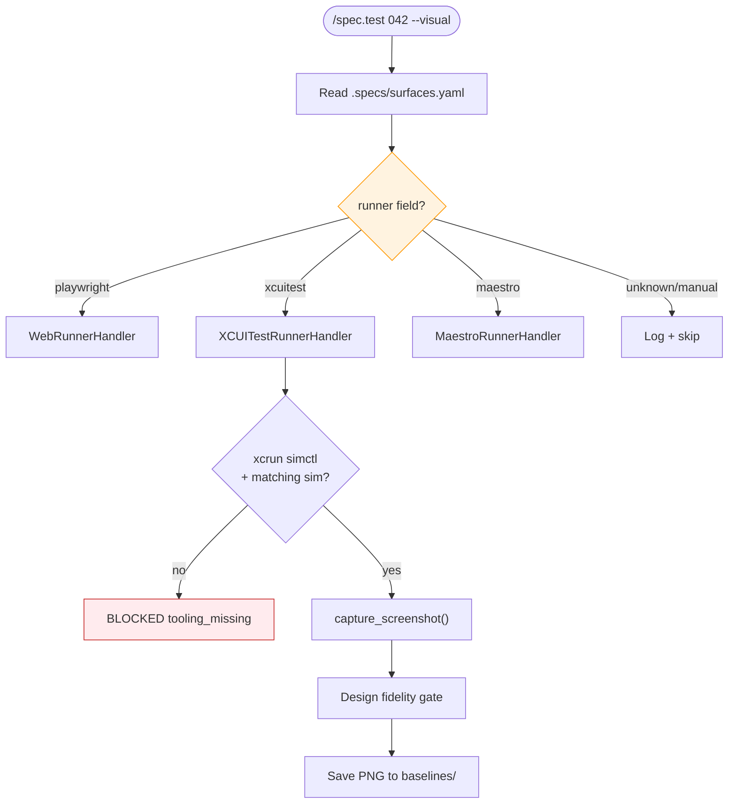
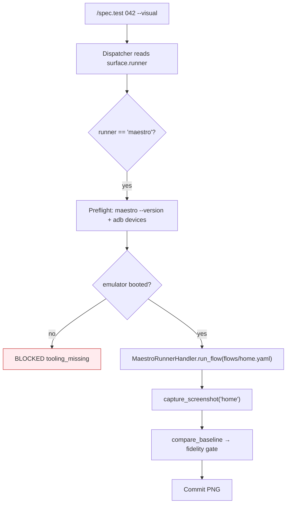
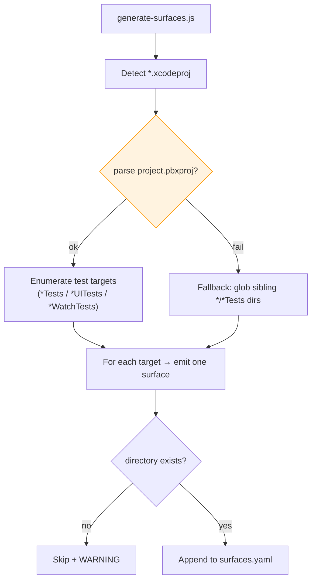
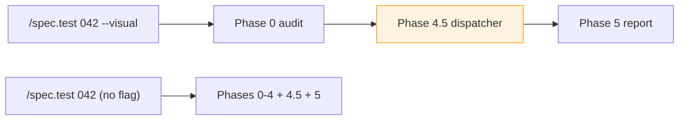
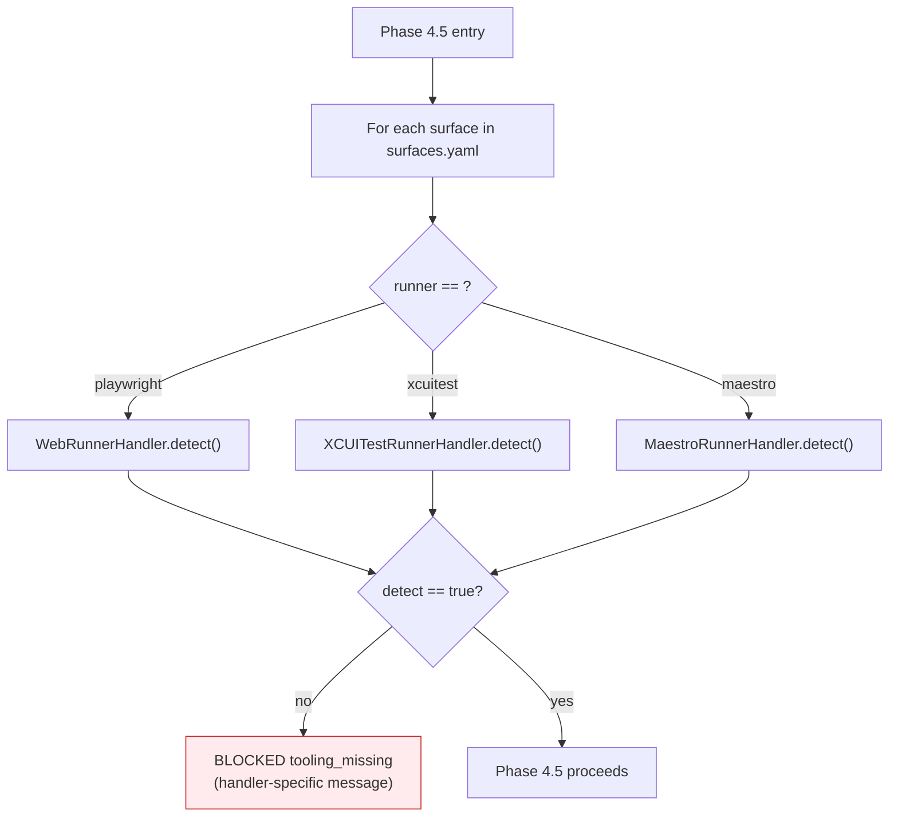

# Feature Spec: Test Multi-Runner Integration

- **Feature:** Test Multi-Runner Integration
- **Branch:** `feature/037-test-multi-runner-integration`
- **Date:** 2026-05-08
- **Status:** Implemented
- **Priority:** P1
- **Input:** Intégration multi-runner pour /spec.test : refactor de Phase 4.5 (Visual) en dispatcher runner-aware capable de router playwright/xcuitest/maestro vers leur handler dédié, correction de la génération surfaces.yaml pour projets natifs (cibles Xcode multiples : *Tests, *UITests, *WatchTests), ajout du flag --visual, préflight runner-aware (xcrun simctl pour iOS/watchOS, adb + maestro --version pour Android). Les runners livrés par features 030/031 sont aujourd'hui du code mort : ils ne sont importés/appelés nulle part. Cette feature les rend effectivement consommables depuis /spec.test.
- **Feature Number:** 037

---

## Context — The Integration Gap

Features 030 (`validator/ui_runner_xcuitest.py`) and 031 (`validator/ui_runner_maestro.py`) shipped fully functional UI runner handlers with a uniform API:

| Method                | Web (028)               | XCUITest (030)         | Maestro (031)        |
|-----------------------|-------------------------|------------------------|----------------------|
| `__init__(project)`   | ✓                       | ✓                      | ✓                    |
| `detect()`            | ✓                       | ✓                      | ✓                    |
| `capture_screenshot()`| ✓                       | ✓                      | ✓                    |
| `run_flow()`          | ✓                       | ✓                      | ✓                    |
| `compare_baseline()`  | ✓                       | ✓                      | ✓                    |

These handlers are **not imported anywhere** outside their own test files. `commands/test.md` Phase 4.5 ("Visual") is hardcoded for Playwright: it generates `toHaveScreenshot()` snippets, parses `playwright --version`, writes `docker-compose.visual.yml`, and assumes a web frontend. When a user runs `/spec.test --visual` on an iOS/watchOS or Android project, **none of the work shipped in 030/031 executes** — the dispatcher does not exist.

In addition, the surface generator (`scripts/generate-surfaces.js`, line 349) hardcodes `testDir: join(appPath, "UITests")` for any directory containing an `.xcodeproj`. Real Xcode projects often have **multiple test targets** (`AppTests`, `AppUITests`, `AppWatchTests`, `AppWidgetTests`). The current single-`UITests` heuristic produces a `surfaces.yaml` pointing at a non-existent directory, breaking discovery downstream.

Finally, `--visual` is referenced in conversation but never declared as a `/spec.test` flag (only `--no-visual` exists), and preflight does not validate runner-specific tooling (`xcrun simctl`, simulator availability, `adb`, `maestro --version`).

This feature closes all four gaps so that 030/031 stop being dead code.

---

## User Scenarios & Testing

### Story 1 — iOS developer runs visual baseline capture on Apple Watch app `P1`

**As a** native iOS developer with a SwiftUI watchOS companion app, **I want to** run `/spec.test --visual` and have LiveSpec drive the watchOS simulator via XCUITest, **so that** the visual fidelity gate catches design regressions on Apple Watch screens just like it does on web.

**Priority reason:** Without this, every native-only feature that ships through `/spec.feature --auto` blocks on a Phase 4.5 step that errors with "Playwright not installed" or silently produces no baselines. The runners shipped by feature 030 are currently unreachable, which means the spec-test pipeline *cannot* protect native UI from drift today.

**Independent test:** Clone a sample iOS+watchOS project with a populated `surfaces.yaml` declaring `runner: xcuitest`. Run `/spec.test 042 --visual`. Verify (a) `XCUITestRunnerHandler.capture_screenshot()` is invoked, (b) PNGs land in `.specs/features/042/baselines/`, (c) no `toHaveScreenshot()` source is generated, (d) no `docker-compose.visual.yml` is written.

#### Acceptance Scenarios (Gherkin — source of truth for tests)

```gherkin
Feature: /spec.test --visual dispatches to XCUITest runner for iOS/watchOS surfaces
  Scenario: Project has a single xcuitest surface and watchOS screen
    Given a project with .specs/surfaces.yaml containing one surface with runner "xcuitest" and platform "watchos"
    And a feature 042 with a Screens table referencing one screen "watch-home"
    And no existing baseline for "watch-home"
    When the developer runs "/spec.test 042 --visual"
    Then the dispatcher loads XCUITestRunnerHandler from validator.ui_runner_xcuitest
    And XCUITestRunnerHandler.capture_screenshot("watch-home") is invoked exactly once
    And no Playwright spec file is generated
    And no docker-compose.visual.yml is written
    And the captured PNG is saved to ".specs/features/042/baselines/watch-home.png"

  Scenario: xcrun simctl is missing or no matching simulator installed
    Given a macOS host without Xcode command-line tools installed
    And a project with runner "xcuitest" in surfaces.yaml
    When the developer runs "/spec.test 042 --visual"
    Then the preflight emits "BLOCKED at step preflight - tooling_missing - xcrun simctl not found"
    And XCUITestRunnerHandler.capture_screenshot is NOT invoked
    And exit code is non-zero
```

#### User Flow



---

### Story 2 — Android developer captures Maestro flow baselines `P1`

**As an** Android developer using Maestro for end-to-end flows, **I want to** `/spec.test --visual` to run my Maestro flows and capture screenshots via `adb shell screencap`, **so that** my native Android UI is covered by the same fidelity threshold (5 %) as web baselines.

**Priority reason:** Same as Story 1 — without dispatching, feature 031's `MaestroRunnerHandler` is unreachable. Android-only projects cannot use `/spec.feature --auto` end-to-end today.

**Independent test:** On a project with `runner: maestro`, an Android emulator running, and one Maestro flow `flows/home.yaml` that drives the home screen, run `/spec.test 042 --visual`. Verify the dispatcher invokes `MaestroRunnerHandler.run_flow()` followed by `capture_screenshot()`, and that the resulting PNG is correctly placed.

#### Acceptance Scenarios (Gherkin — source of truth for tests)

```gherkin
Feature: /spec.test --visual dispatches to Maestro runner for Android surfaces
  Scenario: Maestro is installed and an emulator is booted
    Given a project with surfaces.yaml declaring runner "maestro" and platform "android"
    And maestro is on PATH and "maestro --version" exits 0
    And "adb devices" lists at least one running emulator
    When the developer runs "/spec.test 042 --visual"
    Then the dispatcher loads MaestroRunnerHandler from validator.ui_runner_maestro
    And MaestroRunnerHandler.detect() returns true
    And MaestroRunnerHandler.capture_screenshot("home") writes a PNG to baselines/
    And no Playwright artefacts are generated

  Scenario: No emulator running and no AVD configured
    Given maestro is installed but "adb devices" lists no emulator
    And no AVD is defined in $ANDROID_HOME/avd
    When the developer runs "/spec.test 042 --visual"
    Then preflight emits "BLOCKED at step preflight - tooling_missing - no Android emulator available"
    And exit code is non-zero
```

#### User Flow



---

### Story 3 — Surface generator detects all Xcode test targets, not just `UITests` `P1`

**As a** LiveSpec maintainer onboarding a new native project, **I want** `scripts/generate-surfaces.js` to enumerate the actual test targets defined in the `.xcodeproj` (e.g. `STRAPTTests`, `STRAPTUITests`, `STRAPTWatchTests`, `STRAPTWidgetExtensionTests`), **so that** the generated `surfaces.yaml` points at directories that exist and emits one surface per native test target instead of a single bogus `UITests` entry.

**Priority reason:** P1 because the bug is silent: `surfaces.yaml` is generated, looks plausible, but every downstream consumer (test runner, preflight, /spec.test --visual, /spec.check) gets a `testDir` pointing at a non-existent folder. Users only discover the failure deep into Phase 4 with confusing "no tests found" errors.

**Independent test:** On a fixture project containing `App/App.xcodeproj` with three test targets (`AppTests`, `AppUITests`, `AppWatchTests`), run `node scripts/generate-surfaces.js`. The resulting `surfaces.yaml` MUST list exactly three surfaces with distinct `id` and `testDir` values, each pointing at an existing directory on disk.

#### Acceptance Scenarios (Gherkin — source of truth for tests)

```gherkin
Feature: generate-surfaces.js enumerates Xcode test targets
  Scenario: Xcode project with multiple test targets
    Given a directory containing "App/App.xcodeproj"
    And the project.pbxproj declares three test targets: "AppTests", "AppUITests", "AppWatchTests"
    And the directories "App/AppTests", "App/AppUITests", "App/AppWatchTests" all exist on disk
    When "node scripts/generate-surfaces.js --force" is run
    Then surfaces.yaml contains exactly three surfaces with id "app-tests", "app-uitests", "app-watchtests"
    And each surface's testDir points at an existing directory
    And surface "app-watchtests" has platform "watchos" and runner "xcuitest"
    And surface "app-uitests" has platform "ios" and runner "xcuitest"
    And surface "app-tests" has platform "ios" and runner "xcuitest" with kind "unit"

  Scenario: Xcode project where the parser cannot read project.pbxproj
    Given a directory containing "App/App.xcodeproj" but project.pbxproj is unreadable
    When "node scripts/generate-surfaces.js --force" is run
    Then surfaces.yaml falls back to scanning sibling directories matching "*Tests"
    And a WARNING is logged: "Could not parse App.xcodeproj — falling back to directory heuristics"
    And every emitted testDir points at an existing directory on disk
```

#### User Flow



---

### Story 4 — `--visual` is a first-class /spec.test flag with explicit semantics `P2`

**As a** developer reading `/spec.test --help`, **I want** `--visual` documented as the explicit opt-in for Phase 4.5, **so that** I can run *only* the visual phase without re-executing Phases 0–4. This mirrors how `--audit-only` opts into Phases 0–1 only.

**Priority reason:** P2 because the missing flag is a UX cliff (users believe `--visual` exists, run it, and it silently no-ops). It is not a correctness bug per se, but it is a documented promise the README/changelog implies.

**Independent test:** Run `/spec.test --visual --audit-only` on any feature: the command MUST refuse with a clear error that the two flags are mutually exclusive. Run `/spec.test 042 --visual` on a UI feature: the command MUST run ONLY Phase 0 (audit) + Phase 4.5 (Visual) and skip Phases 2/3/4.

#### Acceptance Scenarios (Gherkin — source of truth for tests)

```gherkin
Feature: --visual flag scope
  Scenario: --visual runs only Phase 4.5 + Phase 5 report
    Given a UI feature 042 with two screens and existing AC tests
    When the developer runs "/spec.test 042 --visual"
    Then Phase 0 (audit) executes
    And Phase 2 (test plan), Phase 3 (test generation), Phase 4 (suite execution) are SKIPPED
    And Phase 4.5 (visual) executes
    And Phase 5 (report) emits a report with sections "AC Coverage: skipped (--visual)" and "Visual Baselines: <table>"

  Scenario: --visual and --no-visual are mutually exclusive
    When the developer runs "/spec.test 042 --visual --no-visual"
    Then the command exits with "ERROR: --visual and --no-visual are mutually exclusive"
    And exit code is 2
```

#### User Flow



---

### Story 5 — Preflight checks runner-specific tooling before Phase 4.5 starts `P2`

**As a** developer running `/spec.test --visual` on a fresh machine, **I want** the preflight phase to verify the runner's tooling chain *before* any subprocess is spawned, **so that** I get a single actionable error ("install Xcode 15+ from the App Store") instead of a cryptic stack trace deep in `XCUITestRunnerHandler._boot_simulator()`.

**Priority reason:** P2 because the absence of preflight does not corrupt data — but it produces a very poor first-run experience (multi-line tracebacks for missing CLI tools).

**Independent test:** On a Linux host, run `/spec.test 042 --visual` against a project with `runner: xcuitest`. Preflight must emit `BLOCKED at step preflight - tooling_missing - XCUITest runner requires macOS host (current: linux)` and exit non-zero before invoking the handler.

#### Acceptance Scenarios (Gherkin — source of truth for tests)

```gherkin
Feature: Runner-aware preflight before Phase 4.5
  Scenario: XCUITest preflight on Linux
    Given the host OS is Linux
    And surfaces.yaml declares runner "xcuitest"
    When the developer runs "/spec.test 042 --visual"
    Then preflight calls XCUITestRunnerHandler.detect()
    And detect() returns false because _check_macos() fails
    And preflight emits "BLOCKED at step preflight - tooling_missing - XCUITest runner requires macOS host"
    And exit code is non-zero

  Scenario: Maestro preflight succeeds with running emulator
    Given the host has maestro installed and one emulator running
    And surfaces.yaml declares runner "maestro"
    When the developer runs "/spec.test 042 --visual"
    Then MaestroRunnerHandler.detect() returns true
    And preflight passes
    And Phase 4.5 proceeds

  Scenario: Web preflight on a project without Playwright dependency
    Given package.json has no "@playwright/test" dependency
    And surfaces.yaml declares runner "playwright"
    When the developer runs "/spec.test 042 --visual"
    Then preflight emits "BLOCKED at step preflight - tooling_missing - @playwright/test not installed (npm install -D @playwright/test)"
    And exit code is non-zero
```

#### User Flow



---

## Acceptance Criteria

| ID     | Criterion                                                                                                                                | Priority | Story    |
|--------|------------------------------------------------------------------------------------------------------------------------------------------|----------|----------|
| AC-001 | `/spec.test --visual` on a surface with `runner: xcuitest` invokes `XCUITestRunnerHandler.capture_screenshot()` exactly once per screen  | P1       | Story 1  |
| AC-002 | `/spec.test --visual` on a surface with `runner: maestro` invokes `MaestroRunnerHandler.run_flow()` then `capture_screenshot()`          | P1       | Story 2  |
| AC-003 | `/spec.test --visual` on a surface with `runner: playwright` retains current behaviour (no regression)                                   | P1       | Stories 1–4 |
| AC-004 | When `runner` is `xcuitest` or `maestro`, no `toHaveScreenshot()` source code is generated and no `docker-compose.visual.yml` is written | P1       | Stories 1, 2 |
| AC-005 | `generate-surfaces.js` emits one surface per Xcode test target detected in `*.xcodeproj/project.pbxproj`                                 | P1       | Story 3  |
| AC-006 | Every emitted surface in `surfaces.yaml` has a `testDir` that exists on disk; if the directory does not exist the surface is omitted with a WARNING | P1 | Story 3 |
| AC-007 | watchOS-suffixed test targets (`*WatchTests`, `*WatchUITests`) emit surfaces with `platform: watchos`                                    | P1       | Story 3  |
| AC-008 | `/spec.test --visual` is documented in the Flags table of `commands/test.md` and accepted by the CLI                                     | P2       | Story 4  |
| AC-009 | `/spec.test --visual --no-visual` exits with code 2 and message "--visual and --no-visual are mutually exclusive"                         | P2       | Story 4  |
| AC-010 | `/spec.test --visual` skips Phases 2, 3, 4 and runs only Phases 0, 4.5, 5                                                                | P2       | Story 4  |
| AC-011 | Phase 4.5 calls `<Handler>.detect()` first; on `false` it emits `BLOCKED at step preflight - tooling_missing - <handler-specific message>` and exits non-zero | P2 | Story 5 |
| AC-012 | XCUITest preflight on a non-macOS host produces the message "XCUITest runner requires macOS host (current: <platform>)"                  | P2       | Story 5  |
| AC-013 | Maestro preflight failure when no emulator is running produces the message "no Android emulator available — start one with 'emulator -avd <name>'" | P2 | Story 5 |
| AC-014 | Phase 4.5 for a project mixing surfaces (`runner: playwright` + `runner: xcuitest`) iterates each surface independently and aggregates results in the report | P1 | Story 1 + Story 2 |
| AC-015 | When the dispatcher encounters an `unknown` or `manual` runner it logs `"Skipping surface <id>: runner <name> is not handled"` and continues | P2 | Stories 1, 2 |

---

## Functional Requirements

| ID     | Requirement                                                                                                                                                  | AC References             |
|--------|--------------------------------------------------------------------------------------------------------------------------------------------------------------|---------------------------|
| FR-001 | The system must read `.specs/surfaces.yaml` at the start of Phase 4.5 and iterate each surface, dispatching to a runner handler keyed by the `runner` field   | AC-001, AC-002, AC-003, AC-014 |
| FR-002 | The system must implement a runner registry mapping `playwright → WebRunnerHandler`, `xcuitest → XCUITestRunnerHandler`, `maestro → MaestroRunnerHandler` and call `<Handler>(project_dir).capture_screenshot(screen)` for each screen in the feature's `## Screens` table | AC-001, AC-002, AC-003 |
| FR-003 | The system must NOT generate Playwright source code (`toHaveScreenshot()`), `docker-compose.visual.yml`, or `playwright.config.ts` for surfaces whose `runner` is not `playwright` | AC-004 |
| FR-004 | `scripts/generate-surfaces.js` must enumerate Xcode test targets by parsing `*.xcodeproj/project.pbxproj` (target type `com.apple.product-type.bundle.unit-test` and `.bundle.ui-testing`) and emit one surface per target | AC-005, AC-007 |
| FR-005 | When parsing `project.pbxproj` fails or the file is unreadable, the system must fall back to scanning sibling `*Tests`, `*UITests`, `*WatchTests`, `*WatchUITests` directories and log a WARNING | AC-006 |
| FR-006 | Every surface emitted by `generate-surfaces.js` must have a `testDir` whose path resolves to an existing directory on disk; surfaces failing this check must be omitted and reported as a WARNING | AC-006 |
| FR-007 | Test targets whose name matches the regex `(?i)watch.*tests?$` must emit `platform: watchos`; targets matching `(?i)widget.*tests?$` must emit `platform: ios` and `kind: widget`; otherwise default to `platform: ios` and infer `kind` from the `ui-testing` vs `unit-test` product type | AC-007 |
| FR-008 | `/spec.test` must accept the `--visual` flag (no short form) with semantics: run only Phases 0, 4.5, 5 | AC-008, AC-010 |
| FR-009 | `/spec.test` must reject the combination `--visual --no-visual` with exit code 2 and message "--visual and --no-visual are mutually exclusive" | AC-009 |
| FR-010 | `commands/test.md` must list `--visual` in the Flags table with description "Opt-in: run only Phase 4.5 (visual) skipping suite execution. Mutually exclusive with --no-visual." | AC-008 |
| FR-011 | Before invoking any handler method other than `detect()`, the dispatcher must call `<Handler>(project_dir).detect()` and on `false` emit `BLOCKED at step preflight - tooling_missing - <message>` with the handler-specific message exposed via a new `Handler.preflight_message()` method | AC-011, AC-012, AC-013 |
| FR-012 | `XCUITestRunnerHandler.preflight_message()` must return platform-aware text: `"XCUITest runner requires macOS host (current: linux)"` on non-macOS, `"xcrun simctl not found — install Xcode CLI tools"` if `_check_macos()` passed but `xcrun` is missing | AC-012 |
| FR-013 | `MaestroRunnerHandler.preflight_message()` must return: `"maestro CLI not on PATH — install: curl -Ls 'https://get.maestro.mobile.dev' \| bash"` when `_check_maestro()` fails, or `"no Android emulator available — start one with 'emulator -avd <name>'"` when `adb devices` lists none | AC-013 |
| FR-014 | The dispatcher must aggregate per-surface results into Phase 5's report under a new `### Visual Baselines (per surface)` table with columns `Surface, Runner, Screen, Baseline, Mockup diff, Status` | AC-014 |
| FR-015 | The dispatcher must skip and log surfaces whose `runner` value is `manual`, `unsupported`, or any value not present in the runner registry, with the message `"Skipping surface <id>: runner <name> is not handled"` | AC-015 |

### FR-001
**Requirement:** The system must read `.specs/surfaces.yaml` at the start of Phase 4.5 and iterate each surface, dispatching to a runner handler keyed by the `runner` field
**AC References:** [AC-001](#ac-001), [AC-002](#ac-002), [AC-003](#ac-003), [AC-014](#ac-014)

### FR-002
**Requirement:** The system must implement a runner registry mapping `playwright → WebRunnerHandler`, `xcuitest → XCUITestRunnerHandler`, `maestro → MaestroRunnerHandler` and call `<Handler>(project_dir).capture_screenshot(screen)` for each screen in the feature's `## Screens` table
**AC References:** [AC-001](#ac-001), [AC-002](#ac-002), [AC-003](#ac-003)

### FR-003
**Requirement:** The system must NOT generate Playwright source code (`toHaveScreenshot()`), `docker-compose.visual.yml`, or `playwright.config.ts` for surfaces whose `runner` is not `playwright`
**AC References:** [AC-004](#ac-004)

### FR-004
**Requirement:** `scripts/generate-surfaces.js` must enumerate Xcode test targets by parsing `*.xcodeproj/project.pbxproj` and emit one surface per target
**AC References:** [AC-005](#ac-005), [AC-007](#ac-007)

### FR-005
**Requirement:** When parsing `project.pbxproj` fails the system must fall back to scanning sibling `*Tests` directories with a WARNING
**AC References:** [AC-006](#ac-006)

### FR-006
**Requirement:** Every emitted surface must have a `testDir` resolving to an existing directory; otherwise omit + WARNING
**AC References:** [AC-006](#ac-006)

### FR-007
**Requirement:** Watch-suffixed targets emit `platform: watchos`; widget-suffixed targets emit `kind: widget`; otherwise default to ios + inferred kind
**AC References:** [AC-007](#ac-007)

### FR-008
**Requirement:** `/spec.test` accepts `--visual` with semantics "Phases 0, 4.5, 5 only"
**AC References:** [AC-008](#ac-008), [AC-010](#ac-010)

### FR-009
**Requirement:** `/spec.test` rejects `--visual --no-visual` with exit code 2
**AC References:** [AC-009](#ac-009)

### FR-010
**Requirement:** `commands/test.md` lists `--visual` in its Flags table
**AC References:** [AC-008](#ac-008)

### FR-011
**Requirement:** Dispatcher calls `Handler.detect()` first and routes failure to `BLOCKED tooling_missing` via `Handler.preflight_message()`
**AC References:** [AC-011](#ac-011), [AC-012](#ac-012), [AC-013](#ac-013)

### FR-012
**Requirement:** `XCUITestRunnerHandler.preflight_message()` returns platform-aware diagnostics
**AC References:** [AC-012](#ac-012)

### FR-013
**Requirement:** `MaestroRunnerHandler.preflight_message()` returns CLI/emulator diagnostics
**AC References:** [AC-013](#ac-013)

### FR-014
**Requirement:** Phase 5 aggregates per-surface visual results into a "Visual Baselines (per surface)" table
**AC References:** [AC-014](#ac-014)

### FR-015
**Requirement:** Unknown/manual runners are skipped with a log line, never raising
**AC References:** [AC-015](#ac-015)

---

## Key Entities

| Entity              | Description                                                                                                  | Key Fields                                              |
|---------------------|--------------------------------------------------------------------------------------------------------------|---------------------------------------------------------|
| Surface             | One row in `.specs/surfaces.yaml` describing a testable boundary                                             | id, name, runner, platform, kind, path, testDir, runnerConfig |
| RunnerHandler       | Abstract uniform API exposed by the three handlers (Web, XCUITest, Maestro)                                  | detect(), preflight_message(), capture_screenshot(), run_flow(), compare_baseline() |
| RunnerRegistry      | Mapping `runner string → handler class` consumed by Phase 4.5 dispatcher                                     | playwright, xcuitest, maestro                           |
| XcodeTestTarget     | A test target enumerated from `project.pbxproj`                                                              | name, productType, kind (unit \| ui), platform (ios \| watchos), directory |
| VisualPhaseResult   | Per-surface aggregation entry for the Phase 5 report                                                         | surface_id, runner, screen, baseline_path, mockup_diff_pct, status |

---

## Edge Cases

- **Project with both web and native surfaces (monorepo):** The dispatcher iterates each surface independently. A failure in the iOS surface's preflight does NOT block the playwright surface from running its visual phase — each surface emits its own `BLOCKED` line and the overall command exits non-zero only if at least one surface failed.
- **`surfaces.yaml` declares `runner: xcuitest` but no `platform` field:** Default to `platform: ios`, log INFO. Do not block.
- **Xcode project with zero test targets:** `generate-surfaces.js` emits no surface for that app and logs `WARNING: <app> has .xcodeproj but no test targets — skipping`.
- **Xcode project with a test target whose source directory was deleted on disk (orphan target):** Emit a WARNING `"Test target <name> declared in project.pbxproj but directory <path> not found — skipping"`. Do not write the surface.
- **`project.pbxproj` is the modern XML/JSON variant and not the legacy ASCII plist:** The parser must auto-detect format and parse both. If the format is unknown → fall back to directory globbing (FR-005).
- **`--visual` on a feature with no `## Screens` section:** Emit `WARNING: feature has no UI screens — Phase 4.5 skipped` and exit 0 (Phase 5 still emits a report stating "no screens to capture").
- **`--visual` on a project where `surfaces.yaml` does not exist:** Fall back to legacy single-surface inference (current behaviour, all `runner: playwright`); emit a `INFO: surfaces.yaml missing — using legacy single playwright surface` line.
- **Handler raises an unexpected exception during `capture_screenshot`:** Catch it at the dispatcher boundary and emit `BLOCKED at step phase_4.5 - runtime_error - <handler>: <exception message>`. Do NOT delete previously captured baselines.
- **Two simulators/emulators match the screen requirements:** Defer to the handler's existing selection logic (`_select_avd`, `_find_simulator_udid`). The dispatcher does not override.
- **`runner: tauri` (feature 029) in `surfaces.yaml`:** Today no `TauriRunnerHandler` exists in scope of this feature. The dispatcher logs `"Skipping surface <id>: runner tauri is not handled (track via feature 029)"` and continues (AC-015).
- **Mixed test target and UITest target sharing the same parent dir name (`AppTests` vs `AppUITests`):** Both are emitted as distinct surfaces. The `kind` field disambiguates: `unit` vs `ui`.

---

## Success Criteria

| ID      | Criterion                                                                                                       | How to Measure                                                                                              |
|---------|-----------------------------------------------------------------------------------------------------------------|-------------------------------------------------------------------------------------------------------------|
| SC-001  | `validator/ui_runner_xcuitest.py` and `validator/ui_runner_maestro.py` are imported by at least one production code path (not just their own tests) | `rg "from validator.ui_runner_xcuitest" --type py -g '!validator/ui_runner_xcuitest.py' -g '!tests/**'` returns ≥ 1 hit; same for maestro |
| SC-002  | All Phase 4.5 unit tests cover the dispatcher: `test_dispatcher_routes_playwright`, `test_dispatcher_routes_xcuitest`, `test_dispatcher_routes_maestro`, `test_dispatcher_skips_unknown_runner` | Tests exist in `tests/test_phase_4_5_dispatcher.py` and pass in CI |
| SC-003  | Integration test on a fixture project with three Xcode test targets produces a `surfaces.yaml` with three surfaces, all `testDir` directories resolve | `tests/integration/test_generate_surfaces_xcode.py` green |
| SC-004  | `/spec.test --visual` on the LiveSpec self-test fixture exits 0 within 30 seconds and produces a report containing the per-surface table | E2E test in CI with mocked simulators (xcrun simctl mocked, maestro mocked) |
| SC-005  | The `--visual` flag is listed in the output of `/spec.test --help` | grep on rendered help output |
| SC-006  | Zero regression in feature 010 (visual testing complete) AC tests | All 010 baselines still pass after refactor |

---

## Dependencies

- **Feature 028** (UI Runner Web): provides `WebRunnerHandler` — consumed by the dispatcher.
- **Feature 030** (UI Runner iOS/watchOS): provides `XCUITestRunnerHandler` — *consumed for the first time by this feature*.
- **Feature 031** (UI Runner Android): provides `MaestroRunnerHandler` — *consumed for the first time by this feature*.
- **Feature 027** (UI Runner Architecture): defines the abstract handler API contract.
- **Feature 036** (Multi-Surface Detection and Migration): provides the multi-surface emission pattern (`<app>` + `<app>-visual`) extended here for native test targets.
- **Feature 010** (Visual Testing Complete): defines the existing Phase 4.5 contract; this feature refactors it without regression.

---

*Generated by `/spec.specify` — LiveSpec v1.0*
