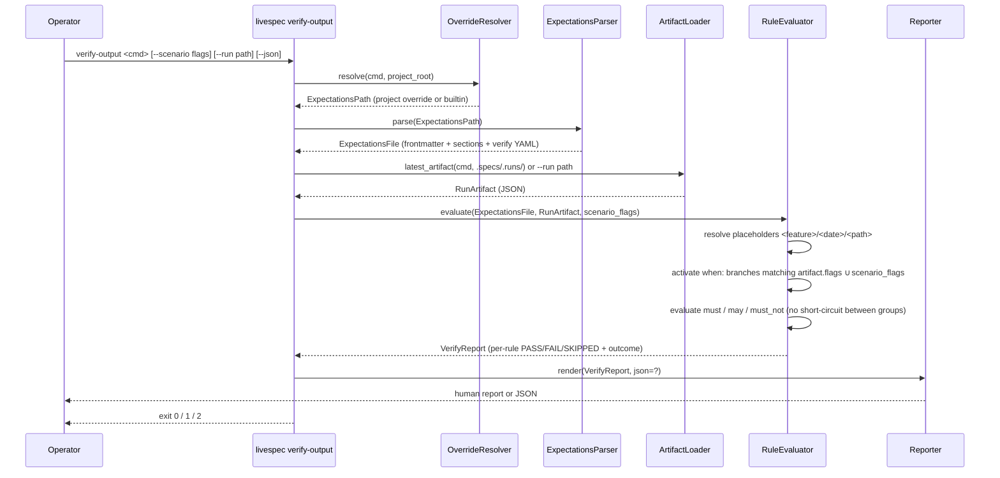
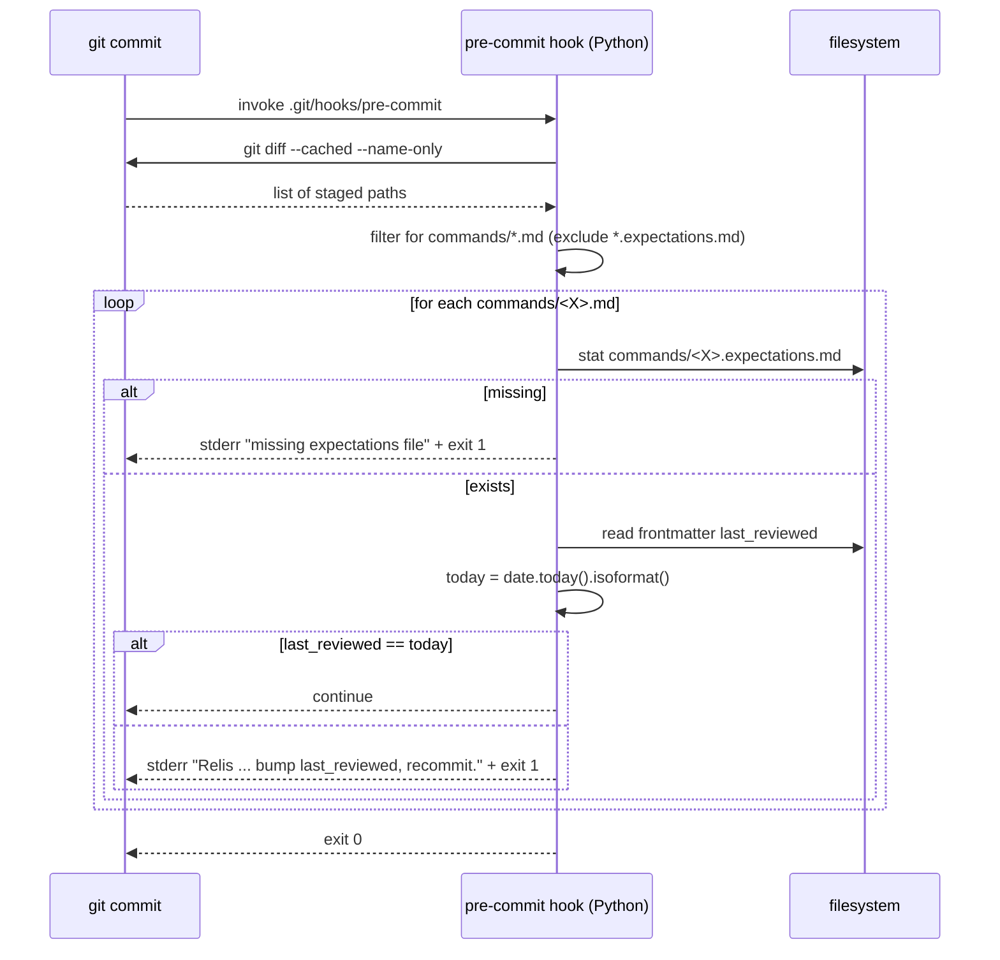
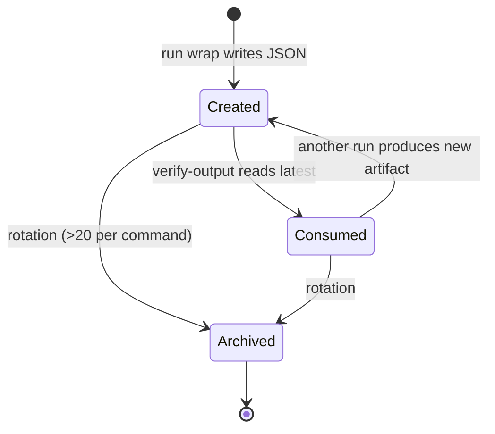
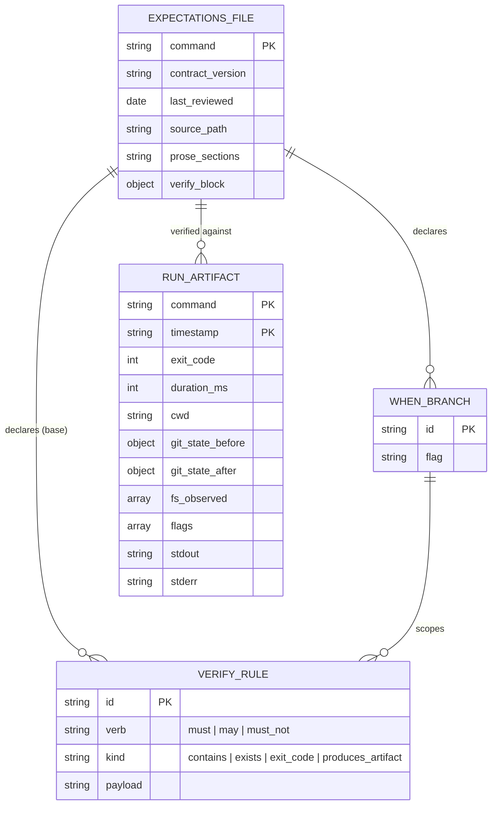

# Plan — Feature 039 — Command Expectations & `/spec.verify-output`

## Summary

Introduce per-command `expectations.md` contract files (Markdown + embedded `verify:` YAML), a canonical `RunArtifact` JSON emitted under `.specs/.runs/` by every slash-command, a `livespec verify-output` Typer subcommand that diffs artifact vs expectations with `when:`-branch / placeholder resolution, a `/spec.verify-output` slash-command, and a pre-commit hook that hard-blocks commits touching `commands/<X>.md` unless `commands/<X>.expectations.md`'s `last_reviewed` matches the commit date.

## Status

Draft

## Technical Context

- **Language:** Python 3.11+ (matches existing `validator/` package).
- **CLI framework:** Typer (existing — see `validator/cli.py`). New subcommand `verify-output` registered alongside `pipeline`, `git`, `commit-context`.
- **YAML parsing:** `pyyaml` (already a validator dep — verified via `validator/parser.py` / contracts; confirm in `pyproject.toml` during Step 1, add if missing).
- **Frontmatter parsing:** existing pattern in `validator/parser.py` (no new dep — use a small `--- ... ---` splitter, identical to how spec.md frontmatter is parsed).
- **Testing:** pytest (existing suite, 365+ tests). Use `tmp_path` fixtures. Subprocess for hook integration test.
- **Markdown:** raw string parsing — no Markdown AST required (section headings are recognized by `^##\s+\d+\.\s+` regex; the 12 sections are fixed names).
- **Storage:** filesystem only (`.specs/.runs/`, `commands/*.expectations.md`, `.specs/expectations/<command>.md`). No DB.
- **No new external deps** beyond what `validator/` already pulls.
- **Platform:** macOS + Linux dev environments; pre-commit hook is a Python script invoked from `.git/hooks/pre-commit` (portable, no bash trap pitfalls).
- **Project type:** library + CLI (existing layout).

## Constitution Check

| Principle | Compliance |
|---|---|
| §1 Layered Validation | `expectations.py` parser (Layer 1: structural) feeds `verify_output.py` (Layer 2: coherence). Independently invocable. |
| §2 Provider-Agnostic LLM | No LLM calls in this feature. |
| §3 FS as Source of Truth | All artifacts under `.specs/.runs/`, `commands/`, `.specs/expectations/`. No DB, no remote. |
| §4 Fail Fast, Exit Clearly | Exit codes: 0 PASS, 1 drift/error, 2 blocked. Each failure names file + rule + actionable fix. |
| §5 Minimal Surface | Single new Typer subcommand `verify-output` + `run` group (`run wrap`). Composable via `--scenario`, `--run`, `--json`. |
| §6 No Hosted Infra | Local files only. |
| Code conventions | All files ≤300 lines (split if needed); functions ≤50 lines; snake_case modules; PascalCase classes; Ruff + Pyright strict. |

No conflicts. No `[DECISION NEEDED]` markers.

---

## Gherkin + Mermaid Sequence — `/spec.verify-output` invocation flow

```gherkin
Feature: verify-output orchestration
  Scenario: Operator verifies a successful run
    Given .specs/expectations/specify.md does not exist
    And   commands/specify.expectations.md exists and is valid
    And   .specs/.runs/specify-2026-05-12T10-00-00.json exists with exit_code 0
    When  the operator runs `livespec verify-output specify`
    Then  the CLI loads the builtin expectations
    And   resolves placeholders <feature>, <date>
    And   activates no when: branches (flags empty)
    And   evaluates every must rule against stdout/stderr/fs_observed
    And   prints a PASS table
    And   exits 0

  Scenario: Operator verifies a drifted run
    Given the latest artifact for `test` has exit_code 0 but is missing the marker `"Visual baselines updated"`
    And   the expectations declare a when: branch activated by `--visual`
    And   the artifact's flags include `--visual`
    When  the operator runs `livespec verify-output test`
    Then  the verifier reports outcome `drift`
    And   the report lists the failing rule with rule id and expected string
    And   exits 1
```



---

## Gherkin + Mermaid Sequence — Pre-commit hook flow

```gherkin
Feature: Pre-commit hook enforces last_reviewed
  Scenario: Hook blocks stale expectation
    Given the staged diff modifies commands/plan.md
    And   commands/plan.expectations.md frontmatter has last_reviewed: 2026-04-01
    And   today is 2026-05-12
    When  the pre-commit hook runs
    Then  it prints "Relis `commands/plan.expectations.md`, bump `last_reviewed`, recommit."
    And   exits with non-zero status
    And   the commit is aborted

  Scenario: Hook allows fresh expectation
    Given the staged diff modifies commands/plan.md
    And   commands/plan.expectations.md frontmatter has last_reviewed: 2026-05-12
    And   today is 2026-05-12
    When  the pre-commit hook runs
    Then  it exits 0
    And   the commit proceeds
```



---

## Gherkin + Mermaid State — Run-artifact lifecycle

```gherkin
Feature: RunArtifact lifecycle
  Scenario: Created during command run
    Given the operator runs `/spec.status`
    When  the wrapper `livespec run wrap status -- <argv>` starts
    Then  a new artifact transitions to `Created` state when JSON is written

  Scenario: Consumed by verify-output
    Given a Created artifact exists
    When  `livespec verify-output status` reads the latest artifact
    Then  the artifact transitions to `Consumed` state (logical — file unchanged)

  Scenario: Archived after rotation
    Given more than N=20 artifacts exist for the same command
    When  any new artifact is written
    Then  the oldest artifacts beyond N are moved to .specs/.runs/_archive/
    And   transition to `Archived` state
```



---

## Mermaid ER — Data model



---

## Implementation Plan

> Ordered DAG. Each step ends with tests where applicable. Each created/modified file carries `@spec FR-NNN: ... — .specs/features/039-command-expectations-and-verify-output/spec.md#fr-nnn` anchors.

### Step 1 — Template + system reference doc

**Files created:**

- `system/templates/command-expectations.template.md` — canonical 12-section template + `verify:` YAML stub with documented placeholders (`<feature>`, `<date>`, `<path>`) and verbs (`must`, `may`, `must_not`) and a `when:` example. Frontmatter keys: `command`, `contract_version: "1.0"`, `last_reviewed: YYYY-MM-DD`. Anchor: `@spec FR-001`.
- `system/expectations.md` — reference doc covering: file layout, frontmatter schema, 12-section grammar, embedded `verify:` YAML grammar, rule kinds (`contains`, `exists`, `exit_code`, `produces_artifact`), placeholder resolution rules (including the `<date>` invariant: artifact timestamp, never commit date), `RunArtifact` JSON schema, override lookup order, pre-commit hook contract, outcome classifier (4 states). Anchors: `@spec FR-003`, `FR-004`, `FR-005`, `FR-007`, `FR-008`, `FR-009`, `FR-010`, `FR-011`, `FR-012`.

> **Spec addendum:** include in `system/expectations.md` an explicit subsection **"Rule independence (no short-circuit)"** documenting AC-011: `must_not_contain` rules are evaluated independently from `must` rules; overlapping substrings are both checked; the verifier never short-circuits a group based on another group's outcome. Reference: AC-011 + EC-005.

**Tests:** none (docs); verified later via Step 2's parser fixture loading the template.

### Step 2 — Python `validator/expectations.py` (parser + override resolver)

**Files created:**

- `validator/expectations.py` (~250 LoC):
  - `dataclass ExpectationsFile { command, contract_version, last_reviewed, prose_sections: dict[str, str], verify: VerifyBlock, source_path: Path }`
  - `dataclass VerifyBlock { must: list[Rule], may: list[Rule], must_not: list[Rule], when: list[WhenBranch] }`
  - `dataclass Rule { verb, kind, payload }` (kinds: `contains`, `exists`, `exit_code`, `produces_artifact`)
  - `dataclass WhenBranch { flag, must, may, must_not }`
  - `parse_expectations(path: Path) -> ExpectationsFile` — frontmatter, 12-section presence check, YAML extraction, schema validation.
  - `load_expectations(command: str, project_root: Path, livespec_root: Path) -> ExpectationsFile` — implements override lookup: 1) `<project_root>/.specs/expectations/<command>.md`, 2) `<livespec_root>/commands/<command>.expectations.md`. Raises `OverrideMalformed` (no fallback) per AC-007.
  - Exceptions: `ExpectationsMissing`, `ExpectationsInvalid`, `OverrideMalformed` — added to `validator/exceptions.py`.

**Files modified:**

- `validator/exceptions.py` — add 3 exception classes.

**Tests created:** `tests/test_expectations_parser.py`:
- valid template parses; all 12 sections recognized
- missing section → `ExpectationsInvalid` BLOCKING
- malformed YAML → `ExpectationsInvalid`
- frontmatter missing `last_reviewed` → `ExpectationsInvalid`
- override path takes priority over builtin
- malformed override raises `OverrideMalformed` (no fallback)
- builtin loaded when no override

### Step 3 — Python `validator/run_artifact.py` (RunRecorder + writer/reader)

**Files created:**

- `validator/run_artifact.py` (~200 LoC):
  - `dataclass RunArtifact { command, timestamp, flags, stdout, stderr, exit_code, duration_ms, cwd, git_state_before, git_state_after, fs_observed }` with `to_json()` / `from_json(path)`.
  - `class RunRecorder` (context manager): snapshots git state + cwd + start time on `__enter__`; on `__exit__` captures stdout/stderr/exit_code (provided by caller), diffs filesystem against pre-snapshot, writes `.specs/.runs/<command>-<ISO>.json`. Atomic write (`.tmp` then `os.replace`). Crash-safe via `try/except` in `__exit__` so a malformed artifact is still emitted with whatever data was collected.
  - `find_latest_artifact(command: str, runs_dir: Path) -> Path | None` — lexicographic sort on ISO 8601 filenames (EC-009).
  - `rotate_artifacts(command: str, runs_dir: Path, keep: int = 20)` — moves oldest beyond `keep` into `runs_dir / "_archive"`. Called at the end of each `RunRecorder` write.

**Tests created:** `tests/test_run_artifact.py`:
- write + read round-trip preserves all fields
- atomic write: no partial file visible after crash simulation
- `find_latest_artifact` picks lexicographically latest
- `find_latest_artifact` returns None when no artifact exists
- rotation: 21st artifact triggers archive of oldest
- ISO 8601 timestamps sort correctly across days
- crash-safe: exception in command body still emits artifact with captured exit_code

### Step 4 — Python `validator/verify_output.py` (rule evaluator + outcome classifier)

**Files created:**

- `validator/verify_output.py` (~280 LoC, split if exceeds 300):
  - `dataclass RuleResult { rule, status: "PASS" | "FAIL" | "SKIPPED", detail }`
  - `dataclass VerifyReport { command, source_path, artifact_path, results: list[RuleResult], outcome: "success" | "drift" | "blocked" | "error", exit_code: int }`
  - `resolve_placeholders(s: str, feature: str | None, run_date: str) -> str` — substitutes `<feature>`, `<date>`; `<path>` passthrough.
  - `activate_when_branches(verify: VerifyBlock, flags: list[str]) -> ActiveRuleSet` — base rules + every `when:` branch whose flag appears in `flags`. Multiple branches accumulate (FR-010).
  - `evaluate(expectations: ExpectationsFile, artifact: RunArtifact, scenario_flags: list[str] | None) -> VerifyReport` — evaluates `must`, `may`, `must_not` **independently** (no group-level short-circuit; the AC-011 invariant). Each `must_not_contain` check runs against raw `stdout + "\n" + stderr` regardless of any `must` rule's outcome.
  - `classify_outcome(artifact, results) -> str` — implements FR-012 4-state map: success / drift / blocked / error.

**Tests created:** `tests/test_verify_output.py`:
- happy path: all must pass → outcome=success, exit_code=0
- one must fails, artifact.exit_code=0 → outcome=drift, exit_code=1
- artifact.exit_code≠0 → outcome=error, exit_code=1
- `when:` branch activates only when flag present; multiple branches accumulate
- placeholder `<feature>` resolves from arg; `<date>` resolves from artifact.timestamp (never `today`)
- **`test_must_not_rules_are_independent_of_must_rules_no_short_circuit`** — explicit unit test enforcing AC-011: with overlapping substrings (`must: contains "error"`, `must_not: contains "fatal error"`), both rules evaluate independently against the same raw output; failing one does not skip the other (assert both `RuleResult` entries appear, never SKIPPED).
- `must_not` evaluated even when no `must` rules exist (group independence)

### Step 5 — CLI wiring: `livespec verify-output` and `livespec run wrap`

**Files created:**

- `validator/cli_commands/verify_output_cmd.py` (~120 LoC):
  - Typer command `verify_output(command: str, scenario: str = None, run: Path = None, json: bool = False)`.
  - Resolves project_root via `find_specs_root()`; livespec_root via existing helper.
  - Calls `load_expectations` → `find_latest_artifact` (unless `--run` given) → `evaluate` → `render`.
  - Renderer: human table (rule id, verb, status, detail) + outcome banner; JSON when `--json`.
  - Exit codes per AC-006.
- `validator/cli_commands/run_cmd.py` (~150 LoC):
  - Typer command group `run` with subcommand `wrap(command: str, argv: list[str])`.
  - `livespec run wrap <command> -- <argv...>` executes argv as subprocess inside `RunRecorder`, captures streams, writes artifact. Used by slash-command markdowns to wrap themselves OR called by the supervisor wrapping sub-spawns.

**Files modified:**

- `validator/cli.py` — register the two new commands:
  ```py
  from .cli_commands.verify_output_cmd import verify_output_app
  from .cli_commands.run_cmd import run_app
  app.add_typer(verify_output_app, name="verify-output")
  app.add_typer(run_app, name="run")
  ```

**Tests created:** `tests/test_cli_verify_output.py`, `tests/test_cli_run_wrap.py`:
- end-to-end CLI invocation against fixture expectations + artifact
- exit code 0 / 1 / 2 paths
- `--json` output is valid JSON with all expected keys
- `--run <path>` overrides "latest" lookup
- `run wrap` executes a no-op subprocess (e.g. `echo`) and produces a valid artifact
- `run wrap` captures non-zero exit code and still writes artifact

### Step 6 — Pre-commit hook + installer + integration test

**Files created:**

- `hooks/pre-commit/livespec-expectations.py` (~120 LoC, executable):
  - Runs `git diff --cached --name-only` (when staged) and `git diff --cached --name-status` to detect staged `commands/<X>.md` (excludes `*.expectations.md`).
  - For each: locate `commands/<X>.expectations.md`; if missing → block. Else parse frontmatter `last_reviewed`; if ≠ `date.today().isoformat()` → block with the EXACT string `Relis `commands/<X>.expectations.md`, bump `last_reviewed`, recommit.` (AC-008).
  - Exit codes: 0 OK, 1 block.
  - Pure stdlib (no `pyyaml` dependency in the hook — frontmatter parsed with a tiny regex/string-split helper for portability).
- `scripts/install-hooks.sh` (~40 LoC):
  - Symlinks `hooks/pre-commit/livespec-expectations.py` into `<project>/.git/hooks/pre-commit` (or appends to an existing dispatcher if one exists — detected via a marker line `# livespec-expectations`). Idempotent.
  - Adds line `.specs/.runs/` to `.gitignore` if absent (covers Risk c).

**Files modified:**

- `scripts/link-local.sh` — at the end, call `scripts/install-hooks.sh` (opt-out via env var `LIVESPEC_SKIP_HOOKS=1`). Ensures every linked project gets the hook by default.

**Tests created:** `tests/integration/test_precommit_hook.py`:
- temp git repo with staged `commands/foo.md` + matching `commands/foo.expectations.md` with `last_reviewed=today` → hook exits 0
- stale `last_reviewed` → hook exits 1 + stderr contains the exact recovery string
- missing `commands/foo.expectations.md` → hook exits 1 + stderr names the missing file (EC of Story 3 — third scenario)
- staged change unrelated to `commands/*.md` → hook exits 0 (does not interfere)
- whitespace-only diff to `commands/foo.md` still blocks (EC-001)

### Step 7 — Slash-command `/spec.verify-output`

**Files created:**

- `commands/verify-output.md` — slash command markdown describing usage `/spec.verify-output <command> [--scenario "..."] [--run <path>] [--json]`, prerequisites, output format, exit codes. Invokes `livespec verify-output` via Bash. Includes the standard activation contract block, Universal Command Reliability footer, and outcome interpretation table.
- `commands/verify-output.expectations.md` — yes, the new command also has its own expectations file (eats its own dog food). Counted in Step 8's batch (so total becomes 20 in the long run but AC-002 explicitly enumerates 19; this 20th is acknowledged in the changelog as a follow-on, not a violation of AC-002).

**Files modified:**

- `.specs/spec-system.md` `### Command discovery` paragraph — add `/spec.verify-output` to the list, bumping the count from 19 to 20. Note: this is **separate from AC-002**, which freezes the 19-command list at spec time; the addition is a coincident change captured in Step 10.

### Step 8 — Generate 19 builtin expectations files (batched 5/5/5/4)

For each command, **Read** `commands/<X>.md`, identify observable signals, FS effects, exit codes, flags, then author a faithful `commands/<X>.expectations.md` from the template. Each file:
- Frontmatter: `command: <X>`, `contract_version: "1.0"`, `last_reviewed: 2026-05-12`.
- 12 prose sections fully filled (no `TBD`).
- Embedded `verify:` YAML reflecting real markers (e.g. for `/spec.specify`: `must_contain: "spec.md created"`, `exists: ".specs/features/<feature>/spec.md"`, `exit_code: 0`).
- `when:` branches for known flags (e.g. `/spec.test --visual` → extra `must_contain: "Visual baselines updated"`; `/spec.implement --resume` → extra check that `progress.md` is read).

**Batch 8a (5 files):** `init`, `migrate`, `propose`, `specify`, `plan`.
**Batch 8b (5 files):** `implement`, `test`, `check`, `fix`, `explain`.
**Batch 8c (5 files):** `stack`, `feature`, `ship`, `preflight`, `hooks`.
**Batch 8d (4 files):** `play-coverage`, `refine`, `status`, `refresh-conventions`.

Each batch is parallelizable (independent files) — implementer may spawn sub-agents per file. After each batch, run `pytest tests/test_expectations_parser.py::test_all_builtins_parse` (added in Step 2 once the directory is populated; xfail until Step 8a completes).

**Tests created (Step 2 addendum, activated here):** `tests/test_expectations_builtins.py`:
- `test_19_builtin_files_exist` — enumerate the 19 names, assert each `commands/<name>.expectations.md` exists.
- `test_all_builtins_parse` — parametrized, each must parse without error and have all 12 sections + valid verify YAML.
- `test_builtins_last_reviewed_is_iso_date` — frontmatter date is valid ISO.

### Step 9 — Wire run-artifact emission into slash-commands

**Decision:** Option (b) — generic wrapper. We do **not** edit every `commands/<X>.md` to add boilerplate. Instead:

- `validator/cli_commands/run_cmd.py::wrap` is the single emission point.
- Add a documented invocation pattern at the end of each command's existing "Definition of Done" section: *"If invoked via supervisor or CI, the command MUST be wrapped: `livespec run wrap <name> -- <command-impl>`."*
- For interactive slash-command invocations (where the slash command IS the implementation, not a shell command), a Python helper `validator/run_artifact.py::record_from_context(command, stdout, stderr, exit_code, ...)` is exposed so the agent (Claude) can write an artifact via a single CLI call at the end of its run: `livespec run record --command <X> --exit-code 0 --stdout-file /tmp/X.out ...`. This keeps slash-commands stateless.

**Files modified (text-only addition to each):** all 19 `commands/<X>.md` get a single appended paragraph under "Definition of Done":

> **Run artifact:** at the end of execution, the command MUST emit a run artifact via `livespec run record --command <X> --exit-code <N> --flags "<flags>" --stdout-file <path> --stderr-file <path>`. The artifact lands in `.specs/.runs/<X>-<ISO>.json` and is consumed by `/spec.verify-output <X>`.

**Files created:** `validator/cli_commands/run_cmd.py` already contains `wrap`; add subcommand `record` (~80 LoC) with the flags above for non-wrappable interactive runs.

**Tests created:** `tests/test_cli_run_record.py` — record subcommand writes a well-formed artifact from CLI flags + file inputs.

### Step 10 — Documentation updates

**Files modified:**

- `.specs/spec-system.md` — add a new section `## Command Expectations & Verify Output` referencing `system/expectations.md` and the new `/spec.verify-output` command. Update `### Command discovery` list (per Step 7).
- `README.md` (repo root) — add `verify-output` and `run wrap` to the CLI surface table if such a table exists; otherwise add a one-line bullet under "Commands".
- `.specs/features/039-command-expectations-and-verify-output/changelog.md` — add the customary feature changelog entry (created during implement phase).
- `.specs/changelog.md` — add a one-line summary entry for v3.x.
- `.gitignore` — add `.specs/.runs/` (also added programmatically by the hook installer for downstream projects; this entry is for the LiveSpec repo itself).

### Step 11 — Final integration test (smoke)

**Files created:**

- `tests/integration/test_verify_output_end_to_end.py`:
  - In a temp `.specs/` fixture, run a small wrapped command (e.g. `livespec run wrap demo -- echo "marker"`), then `livespec verify-output demo` against a hand-rolled `commands/demo.expectations.md` with `must_contain: "marker"` → exits 0, report PASS.
  - Mutate stdout marker → exits 1, outcome=drift.
  - Delete artifact → exits 2, outcome=blocked.

---

## Testing Strategy

| Layer | What | How |
|---|---|---|
| Unit | Parser, evaluator, recorder, classifier, hook helpers | pytest + `tmp_path`; pure-function tests; no subprocess except where natural |
| Integration | CLI invocations | pytest + Typer `CliRunner` + `tmp_path` fixtures |
| Integration | Pre-commit hook | pytest spawning a temp `git init` repo, staging files, invoking the hook script via subprocess |
| Integration | End-to-end | `livespec run wrap` → `livespec verify-output` round-trip against a fixture expectations file |
| Schema | Builtin expectations | parametrized test over all 19 files, asserts parse + frontmatter validity |

All tests are runnable via `pytest tests/` and must pass before merge. Targets: ≥95% branch coverage on `expectations.py`, `run_artifact.py`, `verify_output.py`.

---

## Risks & Considerations

- **(a) Pre-commit hook portability.** Bash hooks vary across macOS/Linux/Windows-WSL. Chose Python (stdlib only) for portability — Python 3 is a hard dep of LiveSpec already. Installer detects existing `.git/hooks/pre-commit` and refuses to clobber unless a `# livespec-expectations` marker is present (idempotent re-install) or `--force` is passed.
- **(b) Run-artifact size growth.** Each artifact captures full stdout/stderr — potentially MBs for verbose commands. Mitigations: (i) rotate at 20 artifacts per command into `.specs/.runs/_archive/`; (ii) truncate stdout/stderr at 1 MB per stream with a `[...truncated, N bytes omitted]` suffix; (iii) document `--max-stream-bytes` flag on `run wrap` for tuning.
- **(c) `.specs/.runs/` gitignore.** Artifacts are local-only; they must not pollute commits. Hook installer appends `.specs/.runs/` to `.gitignore` if absent. Same for the LiveSpec repo itself (Step 10).
- **(d) Backward-compat: commands without expectations.md.** During the rollout window before Step 8 completes, `verify-output <X>` for a missing `commands/<X>.expectations.md` exits 2 with `Blocked By: no expectations file for <X> (expected at commands/<X>.expectations.md or .specs/expectations/<X>.md)` and a clear `Recovery:` line pointing to the template. The pre-commit hook is **not enabled in the LiveSpec repo itself** until Step 8 completes (the hook installer is staged but not invoked from `link-local.sh` for the LiveSpec repo's own checkout).
- **(e) `when:` branch ambiguity with overlapping flags.** Multiple matching branches accumulate (logical AND across activated branch rule sets). Documented in `system/expectations.md` with a worked example for `/spec.test --visual --strict`. Schema validator emits a WARNING (not BLOCKING) when a `when:` branch declares a flag that the corresponding command doesn't document — per EC-010, low confidence on flag inventory.
- **(f) AC-011 — rule independence (no short-circuit).** Explicitly implemented as a flat evaluation loop in `verify_output.py::evaluate`: every rule produces a `RuleResult`, no early returns. Enforced by the dedicated unit test `test_must_not_rules_are_independent_of_must_rules_no_short_circuit` (Step 4). Documented in `system/expectations.md` "Rule independence" subsection (Step 1).
- **(g) Self-bootstrap chicken-and-egg.** The expectations file FOR `verify-output` itself (Step 7) cannot be verified until `verify-output` is implemented — addressed by writing the file in Step 7 and verifying via end-to-end test in Step 11 (not Step 7).
- **(h) AC-002 strict 19-count.** AC-002 enumerates 19 commands; adding `verify-output` (Step 7) introduces a 20th expectations file. This is intentional and noted in the changelog; AC-002 is satisfied because the 19 enumerated files all exist. A follow-up spec refinement (post-implement, via `/spec.refine`) will reflect the 20-command reality in spec-system.md `### Command discovery`.

---

*Plan complete — ready for `/spec.implement`.*
