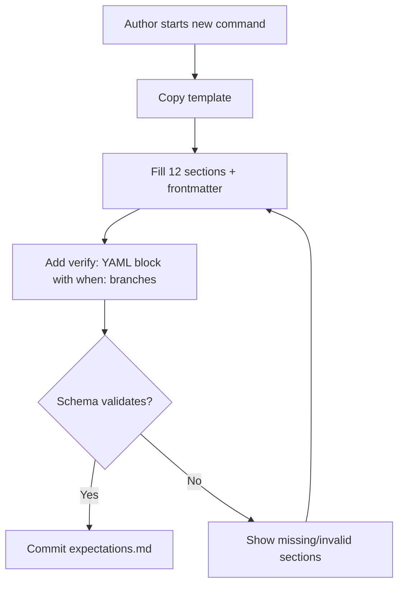
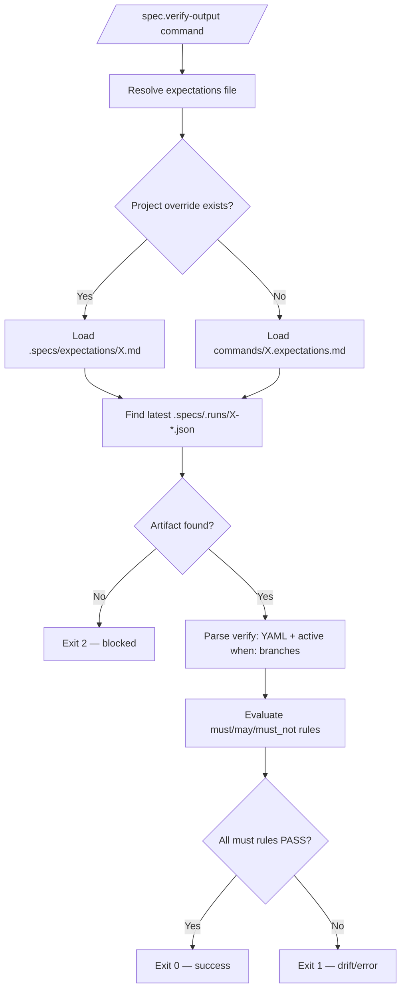
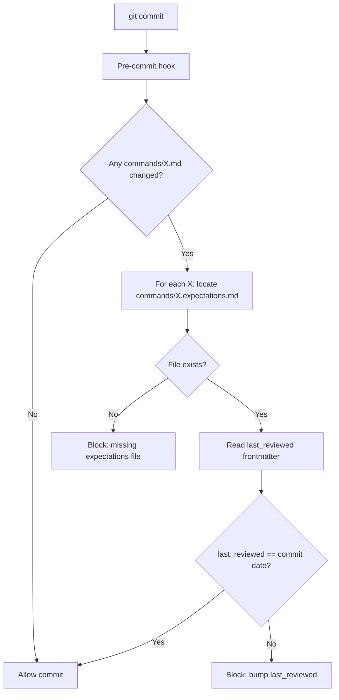
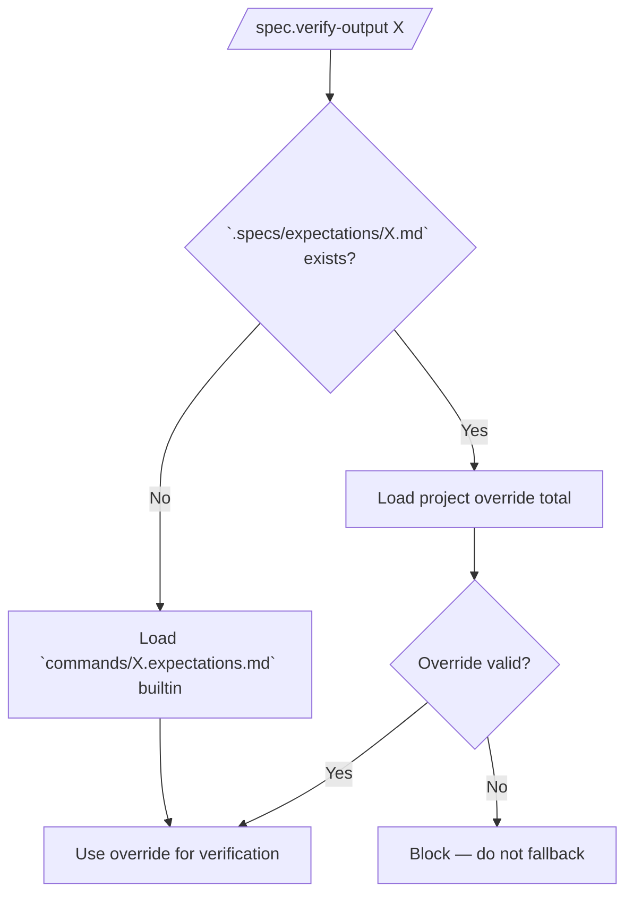
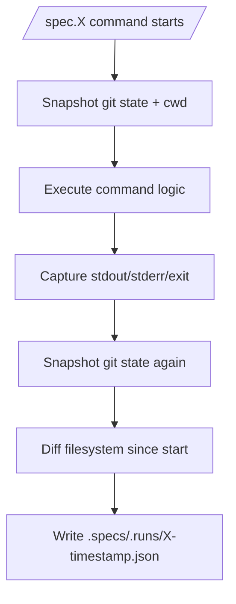

# Feature 039 — Command Expectations & Verify Output

- **Feature Name:** Command Expectations & `/spec.verify-output`
- **Branch:** `feature/039-command-expectations-and-verify-output`
- **Date:** 2026-05-12
- **Status:** Draft

## Input

Per-command `expectations.md` contract files for every LiveSpec slash-command (the 19 commands listed in spec-system.md `### Command discovery`). Each expectations file combines:

1. **Human-readable Markdown prose** — what the user sees when running the command, in 12 fixed sections:
   1. Metadata (frontmatter: command, contract_version, last_reviewed date)
   2. Purpose — one sentence
   3. Preconditions — required files/state
   4. Observable Signals — stdout markers `must_contain` / `must_not_contain` / stderr markers
   5. Filesystem Effects — files `create` / `update` / `optional` / `forbidden`
   6. Git Effects — expected dirty paths, forbidden changes, commit expectations
   7. Produced Artifacts — chemins + must_contain_sections
   8. Exit Codes — table (code → meaning → operator action)
   9. Outcome Matrix — 4 cases: success / drift / blocked / error
   10. Runtime Profile — fourchette + facteurs (jamais une valeur seche)
   11. Post-run Checks — quick human checks
   12. Troubleshooting — symptomes → cause → fix

2. **Machine-readable embedded `verify:` YAML block** (fenced ```yaml verify: ...) consumed by a new `/spec.verify-output` command. Supports placeholders `<feature>`, `<date>`, `<path>`. Verbs `must` / `may` / `must_not`. Conditional branches per flag via a `when:` array (e.g. `- flag: "--visual"` adds requirements). Single file per command — NOT one file per flag combination (explicitly rejected to avoid explosion combinatoire).

3. **Run artifact contract:** each LiveSpec command writes a canonical JSON to `.specs/.runs/<command>-<timestamp>.json` containing: stdout, stderr, exit_code, duration_ms, cwd, git_state_before, git_state_after, fs_observed (list of paths created/modified). This is the source `/spec.verify-output` reads to compare against the expectations file. No "guess the last output" magic.

4. **New command `/spec.verify-output <command> [--scenario flags]`** that:
   - resolves the expectations file (project override `.specs/expectations/<command>.md` → builtin `commands/<command>.expectations.md`)
   - reads the latest run artifact for that command from `.specs/.runs/`
   - applies the YAML `verify:` rules (with active `when:` branches resolved from observed flags)
   - emits a diff report: which assertions PASS / FAIL / SKIPPED-descriptive
   - exit 0 if all `must` assertions pass, exit 1 otherwise

5. **Pre-commit hook (hard block):** when a commit touches `commands/<X>.md`, the corresponding `commands/<X>.expectations.md` MUST have its frontmatter `last_reviewed` field equal to the commit date. Block the commit with a clear message: *"Relis `commands/X.expectations.md`, bump `last_reviewed`, recommit."* Rationale: even if the modif doesn't change observable behavior, the certification by date proves the contract was re-read.

6. **Project override mechanism:** project may write `.specs/expectations/<command>.md` to override the builtin total (no merge of prose; YAML is also fully replaced). Lookup order: `.specs/expectations/<command>.md` → `commands/<command>.expectations.md`. Project-side `last_reviewed` is the responsibility of the project's own pre-commit hook.

7. **Template canonical** lives at `.specs/spec-system/templates/command-expectations.template.md` (a new templates directory under the LiveSpec system).

8. **Coverage:** the 19 builtin expectations files must be created — one per command (`init`, `migrate`, `propose`, `specify`, `plan`, `implement`, `test`, `check`, `fix`, `explain`, `stack`, `feature`, `ship`, `preflight`, `hooks`, `play-coverage`, `refine`, `status`, `refresh-conventions`).

9. **Codex-validated design rationale** (do not re-litigate, just encode):
   - One file per command with `when:` branches (NOT per-scenario files)
   - YAML verify block embedded (not separate file)
   - Override total (not merge)
   - Hard block + `last_reviewed` (not soft warn)
   - Run artifact mandatory (not implicit "last output guess")
   - 4-state outcome matrix (success/drift/blocked/error) — drift ≠ error

---

## User Scenarios & Testing

### Story 1 (P1) — Command author writes an expectations.md

**Description:** A LiveSpec maintainer authoring a new slash-command needs a canonical template with all 12 sections (prose + embedded `verify:` YAML) so the command's observable behavior, run artifact, filesystem effects, and exit-code semantics are contractually documented.

**Priority reason:** Without the template, the other 8 acceptance criteria cannot be satisfied — every other story depends on at least one valid expectations.md existing.

**Independent test:** Copy `.specs/spec-system/templates/command-expectations.template.md` into `commands/<name>.expectations.md`, fill the 12 sections, run schema validation; the file must parse to a valid `ExpectationsFile` entity with `last_reviewed` set to today.

```gherkin
Feature: Author command expectations
  Scenario: Happy path — author copies template and fills it
    Given the file `.specs/spec-system/templates/command-expectations.template.md` exists
    When  the author copies it to `commands/foo.expectations.md` and fills metadata + 12 sections
    Then  the schema validator parses the file as a valid ExpectationsFile
    And   the embedded `verify:` YAML block is extracted without error
    And   `last_reviewed` equals today (YYYY-MM-DD)

  Scenario: Edge case — section missing
    Given a draft `commands/foo.expectations.md` missing the "Outcome Matrix" section
    When  the schema validator runs
    Then  it reports `BLOCKING: missing required section "Outcome Matrix"`
    And   exit code is 1
```



---

### Story 2 (P1) — Operator runs `/spec.verify-output` to check a run

**Description:** After running any `/spec.*` command, an operator (or CI) invokes `/spec.verify-output <command>` to confirm the run honored its contract: observable signals matched, files created/modified as declared, exit code as expected. The command resolves the latest run artifact JSON, applies the YAML rules including active `when:` branches, and produces a PASS/FAIL/SKIPPED report.

**Priority reason:** This is the user-facing payoff — expectations files are useless if no command consumes them.

**Independent test:** Run `/spec.specify` end-to-end, then run `/spec.verify-output specify`; report must show all `must` rules PASS and exit 0. Delete the run artifact and re-run; the command must exit 2 with `Blocked By: no run artifact found`.

```gherkin
Feature: Verify command output against expectations
  Scenario: Happy path — conforming run passes
    Given `commands/spec-specify.expectations.md` exists with valid verify YAML
    And   a run artifact `.specs/.runs/specify-2026-05-12T10-00-00.json` exists
    And   the run stdout contains every declared `must_contain` marker
    And   no `must_not_contain` marker appears
    And   all declared filesystem effects are observed in `fs_observed`
    When  the operator runs `/spec.verify-output specify`
    Then  the report lists every assertion with PASS
    And   exit code is 0

  Scenario: Edge case — missing run artifact
    Given no JSON file under `.specs/.runs/specify-*.json`
    When  the operator runs `/spec.verify-output specify`
    Then  the command emits `Blocked By: no run artifact found for "specify"`
    And   exit code is 2

  Scenario: Edge case — flag-scoped when: branch active
    Given `commands/spec-test.expectations.md` declares a `when: [{ flag: "--visual" }]` branch with extra `must_contain: "Visual baselines updated"`
    And   the latest `.specs/.runs/test-*.json` records flags `["--visual"]`
    When  the operator runs `/spec.verify-output test`
    Then  the verifier evaluates the base rules plus the `--visual` branch
    And   reports PASS only if the extra marker is present

  Scenario: Edge case — drift outcome (assertions fail without runtime error)
    Given the run exited 0 but stdout is missing one `must_contain` marker
    When  the operator runs `/spec.verify-output`
    Then  the report classifies the run as `drift` (not `error`)
    And   exit code is 1
```



---

### Story 3 (P1) — Committer touches `commands/X.md` and is blocked by the date hook

**Description:** When a committer modifies `commands/<X>.md` without updating `commands/<X>.expectations.md`'s `last_reviewed` frontmatter to the commit date, the pre-commit hook hard-blocks the commit with an explicit recovery message. This certifies that whoever changed the command also re-read its contract.

**Priority reason:** Without enforcement, expectations files rot silently — every commit on a command without re-reading the contract erodes trust in the whole system.

**Independent test:** Modify `commands/spec-plan.md` (whitespace only), stage it, attempt to commit; hook must fail with exit ≠ 0 and the exact message. Bump `last_reviewed` in `commands/spec-plan.expectations.md` to today, recommit; commit must succeed.

```gherkin
Feature: Pre-commit hook enforces last_reviewed bump
  Scenario: Happy path — bump matches commit date
    Given the committer modified `commands/spec-plan.md`
    And   `commands/spec-plan.expectations.md` frontmatter `last_reviewed: 2026-05-12`
    And   the commit is created on 2026-05-12
    When  the pre-commit hook runs
    Then  it allows the commit (exit 0)

  Scenario: Edge case — stale last_reviewed blocks commit
    Given the committer modified `commands/spec-plan.md`
    And   `commands/spec-plan.expectations.md` frontmatter `last_reviewed: 2026-04-01`
    And   the commit is created on 2026-05-12
    When  the pre-commit hook runs
    Then  the commit is blocked (exit ≠ 0)
    And   stderr contains "Relis `commands/spec-plan.expectations.md`, bump `last_reviewed`, recommit."

  Scenario: Edge case — expectations file missing entirely
    Given the committer modified `commands/newcmd.md`
    And   no `commands/newcmd.expectations.md` exists
    When  the pre-commit hook runs
    Then  the commit is blocked
    And   stderr names the missing expectations file
```



---

### Story 4 (P2) — Project maintainer writes a project-level override

**Description:** A project using LiveSpec needs to override the builtin expectations for one command (e.g. their `/spec.implement` writes additional artifacts). They drop `.specs/expectations/implement.md` and `/spec.verify-output implement` picks it up totally (no merge with the builtin).

**Priority reason:** P2 because override is an escape hatch — most projects use builtins. Still mandatory because LiveSpec's portability principle requires per-project customization without forking the repo.

**Independent test:** Create `.specs/expectations/implement.md` with a single `must_contain: "Custom marker"`. Run `/spec.implement`. Then `/spec.verify-output implement` must evaluate ONLY the override (not merge with builtin) and PASS iff the custom marker is in stdout.

```gherkin
Feature: Project override supersedes builtin total
  Scenario: Happy path — project override loaded
    Given `.specs/expectations/implement.md` exists in the project
    And   `commands/spec-implement.expectations.md` exists in LiveSpec
    When  `/spec.verify-output implement` runs
    Then  it loads ONLY the project file
    And   the report mentions `source: .specs/expectations/implement.md`

  Scenario: Edge case — override missing required section
    Given `.specs/expectations/implement.md` lacks the `verify:` YAML block
    When  `/spec.verify-output implement` runs
    Then  it emits `Blocked By: override missing verify: block`
    And   exit code is 2
    And   it does NOT silently fall back to the builtin
```



---

### Story 5 (P3) — CI consumes run artifacts produced by every command

**Description:** Every `/spec.*` command must emit a canonical JSON run artifact at `.specs/.runs/<command>-<timestamp>.json`. CI pipelines can scan that directory to audit history without parsing terminal output.

**Priority reason:** P3 because the immediate consumer is `/spec.verify-output` (Story 2). CI integration is a downstream benefit but not required for the contract to be useful.

**Independent test:** Run `/spec.status`; a fresh JSON appears in `.specs/.runs/`. Schema-validate it against the `RunArtifact` schema; all required fields present.

```gherkin
Feature: Run artifact emission
  Scenario: Happy path — command writes canonical artifact
    Given the operator runs `/spec.status` at 2026-05-12T10:00:00Z
    When  the command completes
    Then  a file `.specs/.runs/status-2026-05-12T10-00-00.json` exists
    And   it contains keys: stdout, stderr, exit_code, duration_ms, cwd, git_state_before, git_state_after, fs_observed, flags

  Scenario: Edge case — command crashes before completion
    Given the command crashes mid-run
    When  the wrapper finalizes the artifact
    Then  exit_code reflects the crash signal
    And   stderr is captured
    And   fs_observed lists whatever changes happened pre-crash
```



---

## Acceptance Criteria

- **AC-001** — The template file `.specs/spec-system/templates/command-expectations.template.md` exists, contains all 12 fixed sections in order, includes a stub `verify:` YAML block with documented placeholders (`<feature>`, `<date>`, `<path>`) and verbs (`must`, `may`, `must_not`).
- **AC-002** — Exactly 19 builtin expectations files exist, one per command: `commands/<name>.expectations.md` for each of `init`, `migrate`, `propose`, `specify`, `plan`, `implement`, `test`, `check`, `fix`, `explain`, `stack`, `feature`, `ship`, `preflight`, `hooks`, `play-coverage`, `refine`, `status`, `refresh-conventions`.
- **AC-003** — Each of the 19 expectations files passes schema validation: frontmatter parses, all 12 sections present and non-empty, embedded `verify:` YAML block is valid YAML with grammar `must|may|must_not` at top level and optional `when:` array of `{flag: "<flag>"}` branches.
- **AC-004** — Every `/spec.*` command (the 19 commands) writes a JSON run artifact to `.specs/.runs/<command>-<ISO-timestamp>.json` containing required keys: `stdout`, `stderr`, `exit_code`, `duration_ms`, `cwd`, `git_state_before`, `git_state_after`, `fs_observed`, `flags`. Schema-validated.
- **AC-005** — `/spec.verify-output <command>` exits 0 when the latest run artifact satisfies every `must` assertion (base + active `when:` branches) and contains none of the `must_not` markers.
- **AC-006** — `/spec.verify-output <command>` exits 1 when at least one `must` assertion fails (drift) and exits 2 when blocked (no artifact, invalid override). Drift and error are distinguished in the report and outcome matrix.
- **AC-007** — When `.specs/expectations/<command>.md` exists, `/spec.verify-output <command>` loads it TOTAL (no merge of prose, no merge of YAML). If the override is malformed, the command blocks (exit 2) — it does NOT fall back to the builtin.
- **AC-008** — The pre-commit hook blocks a commit that touches any `commands/<X>.md` when the corresponding `commands/<X>.expectations.md` has `last_reviewed` ≠ commit date OR the expectations file is missing. Error message contains the exact string `Relis \`commands/<X>.expectations.md\`, bump \`last_reviewed\`, recommit.`
- **AC-009** — `when:` branches in the YAML verify block are activated only when the run artifact's `flags` field contains the declared flag. Multiple matching `when:` branches accumulate (logical AND of all activated branches plus the base rules).
- **AC-010** — Placeholders `<feature>`, `<date>`, `<path>` are resolved at verification time: `<feature>` from the active feature directory name, `<date>` from the run artifact timestamp (run date, NOT commit date), `<path>` left as-is for path templates (e.g. `<path>/spec.md`).
- **AC-011** — `must_not_contain` substring rules are evaluated against the raw stdout/stderr captured in the artifact. Overlapping substrings (e.g. `must_contain: "error"` + `must_not_contain: "fatal error"`) are both evaluated independently — the verifier does not short-circuit.

---

## Functional Requirements

- **FR-001** — Create the template file at `.specs/spec-system/templates/command-expectations.template.md` covering all 12 sections plus a documented `verify:` YAML stub. → AC-001
- **FR-002** — Generate one expectations file per command at `commands/<name>.expectations.md` for the 19 commands listed in spec-system.md `### Command discovery`. → AC-002
- **FR-003** — Define and document an `ExpectationsFile` schema validator (frontmatter required keys `command`, `contract_version`, `last_reviewed`; 12 prose sections required in order; embedded ```yaml verify: …``` block parseable). → AC-003
- **FR-004** — Define the `verify:` YAML grammar: top-level keys `must`, `may`, `must_not` accept lists of rule objects (`{contains: "<str>"}`, `{exists: "<path>"}`, `{exit_code: <int>}`, `{produces_artifact: "<path>", contains_sections: ["..."]}`). Optional `when:` array of `{flag: "<flag>", must?: [], may?: [], must_not?: []}`. → AC-003, AC-009
- **FR-005** — Specify the `RunArtifact` JSON schema (required keys: `command`, `flags` (array), `stdout`, `stderr`, `exit_code`, `duration_ms`, `cwd`, `git_state_before` (object: `{branch, head_sha, dirty: [paths]}`), `git_state_after` (same shape), `fs_observed` (array of `{path, change: "create|modify|delete"}`), `timestamp` (ISO 8601)). → AC-004
- **FR-006** — Wire a run-artifact emitter into the `/spec.*` command runtime so every command writes its artifact under `.specs/.runs/`. Crash-safe: emit a best-effort artifact even on failure. → AC-004
- **FR-007** — Implement `/spec.verify-output <command> [--scenario flags]` reading: (a) override at `.specs/expectations/<command>.md` else builtin at `commands/<command>.expectations.md`; (b) latest matching run artifact at `.specs/.runs/<command>-*.json`. Apply rules; emit human-readable report with PASS / FAIL / SKIPPED-descriptive per rule + summary table; emit machine-readable JSON to stdout when `--json` flag is set. → AC-005, AC-006
- **FR-008** — Override resolution: project file totally replaces builtin (no prose merge, no YAML merge). Malformed override blocks (exit 2) — no silent fallback. → AC-007
- **FR-009** — Pre-commit hook script (executable, language: bash or python — implementer choice): for each staged `commands/<X>.md`, find `commands/<X>.expectations.md`, parse frontmatter `last_reviewed`, compare to `date +%Y-%m-%d`. Block on mismatch or missing file with the exact recovery message. → AC-008
- **FR-010** — `when:` branch evaluator: read `flags` array from artifact; for each `when:` branch whose `flag` appears in the array, include its `must` / `may` / `must_not` rules in the active rule set, ANDed with the base. Multiple active branches accumulate. → AC-009
- **FR-011** — Placeholder resolver: substitute `<feature>` (from inferred feature dir in cwd), `<date>` (from artifact timestamp), `<path>` (passthrough) in any rule string before evaluation. → AC-010
- **FR-012** — Outcome classifier: map the final result to one of four states — `success` (all must pass, exit 0), `drift` (some must fail but command exited 0, verify exit 1), `blocked` (precondition missing, verify exit 2), `error` (command itself crashed: artifact exit_code ≠ 0). Report displays the state explicitly. → AC-006

---

## Key Entities

- **ExpectationsFile** — Markdown file with YAML frontmatter (`command`, `contract_version`, `last_reviewed`), 12 ordered prose sections, and one embedded ```yaml verify: …``` fenced block.
- **RunArtifact** — JSON at `.specs/.runs/<command>-<ISO-timestamp>.json` capturing the runtime evidence for a single command invocation.
- **VerifyRule** — A single assertion: one of `{contains}`, `{exists}`, `{exit_code}`, `{produces_artifact, contains_sections}`. Carries verb (`must` / `may` / `must_not`) inherited from parent key.
- **WhenBranch** — Conditional block `{flag: "<flag>", must?: [], may?: [], must_not?: []}` that activates only when the run artifact's `flags` includes the declared flag.
- **OverrideResolver** — Lookup logic: returns project file at `.specs/expectations/<command>.md` if present and valid, else builtin at `commands/<command>.expectations.md`. Blocks (does not fallback) when project file is malformed.

---

## Edge Cases

- **EC-001** — Committer modifies `commands/X.md` whitespace-only without bumping `last_reviewed`: hook still blocks (no content-aware diffing — the certification is the value, not the diff).
- **EC-002** — Project override exists but lacks `verify:` block: `/spec.verify-output` exits 2 with `Blocked By: override missing verify: block`. No fallback to builtin.
- **EC-003** — No run artifact present for the target command: exit 2, blocked. Operator must run the command at least once.
- **EC-004** — Multiple flags active triggering multiple `when:` branches (e.g. `--visual --strict`): all matching branches activate and their rules accumulate; base + branchA + branchB rules all evaluated.
- **EC-005** — `must_contain` substring overlap with `must_not_contain` substring (e.g. must contain `"updated"`, must not contain `"not updated"`): both evaluated independently against the raw output. Verifier does not short-circuit.
- **EC-006** — Placeholder `<date>` ambiguity: ALWAYS resolved from the run artifact's `timestamp` field (run date), NEVER from the commit date. The pre-commit hook is the only consumer of commit date.
- **EC-007** — Run artifact JSON is partially corrupted (crash mid-write): `/spec.verify-output` exits 2 with `Blocked By: malformed artifact at <path>`. Operator deletes the file and re-runs the command.
- **EC-008** — A command renamed in spec-system.md `### Command discovery` (e.g. `play-coverage` → `coverage`): the 19-file invariant (AC-002) is enforced against the current list; renames require renaming the expectations file in the same commit.
- **EC-009** — Two run artifacts for the same command exist (e.g. operator ran command twice): `/spec.verify-output` picks the lexicographically latest filename (timestamps are sortable ISO 8601), discarding earlier ones from the report.
- **EC-010** — `when:` branch references a flag the command never accepts (typo): branch never activates, no error raised. The schema validator MAY warn but does not block (low confidence on flag inventory).

---

## Success Criteria

- **SC-001** — 19 builtin expectations files exist and pass schema validation in CI (0 errors).
- **SC-002** — A round-trip test (`/spec.specify <feature>` → `/spec.verify-output specify`) on a clean repo passes with exit 0 and a PASS report covering every base rule.
- **SC-003** — A deliberate breaking change to a command (e.g. removing a `must_contain` marker from stdout) is caught by `/spec.verify-output` with exit 1 and an explicit `FAIL` line naming the missing marker.
- **SC-004** — Modifying `commands/spec-plan.md` without bumping `commands/spec-plan.expectations.md`'s `last_reviewed` blocks the commit in 100% of attempts. Bumping the date unblocks in 100% of attempts.
- **SC-005** — A project override at `.specs/expectations/implement.md` is loaded in 100% of `/spec.verify-output implement` runs; no merge with the builtin is ever observed.
- **SC-006** — The `RunArtifact` schema is honored by 19/19 commands (verified by running each command and validating the emitted JSON against the schema).
- **SC-007** — Drift (assertions fail, command exit 0) is distinguished from error (command exit ≠ 0) in 100% of `/spec.verify-output` reports — observed in the printed outcome state and the JSON output when `--json` is set.
