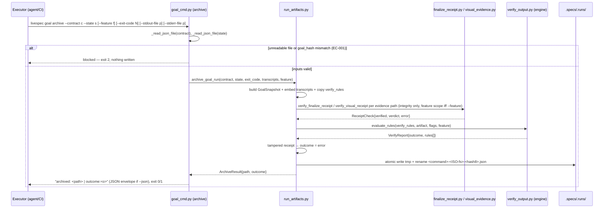
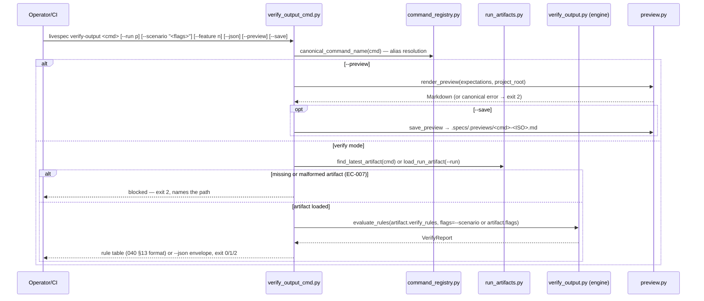
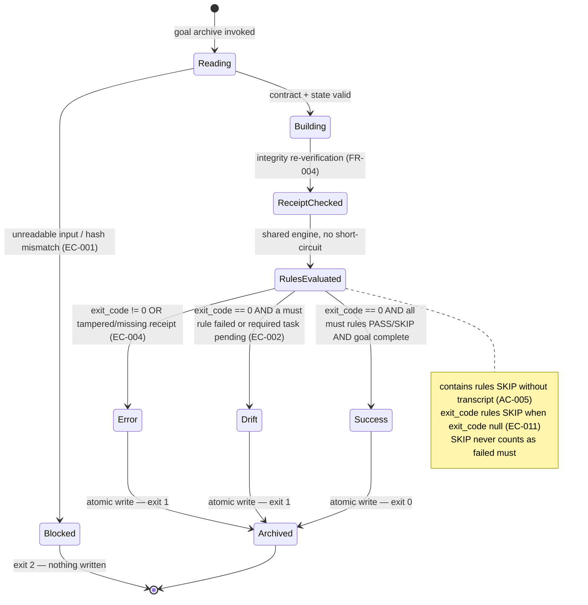
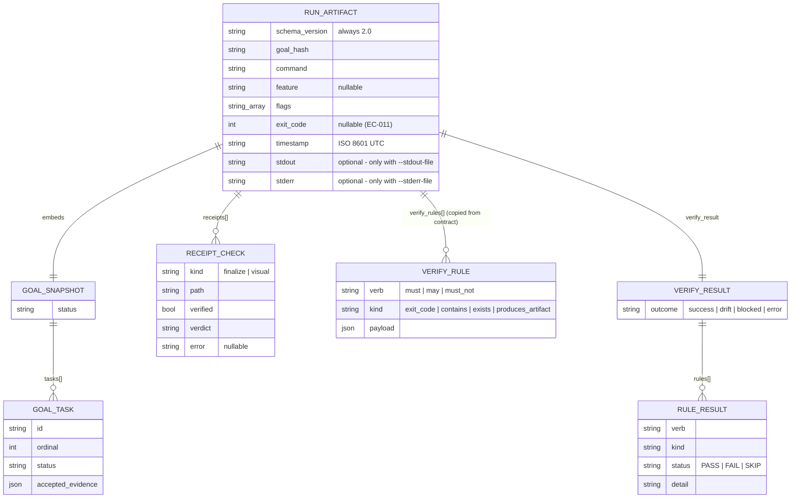

# Plan — Feature 039.1 — Goal Archive & Run Artifacts v2

**Status:** Approved
**Spec:** [spec.md](spec.md) (13 AC, 11 FR, 11 EC — reviewed PASS 100/100)
**Size:** L (11 FR, 6 entities, cross-cutting validator/ + .agent-sync/ + system/ + .specs/ scope) → full diagram set + phased delivery + explicit Risks.

## Summary

Implement the durable run-record contract promised by 039/040: a `livespec goal archive` subcommand that snapshots the `$TMPDIR` goal contract+state into a self-contained RunArtifact v2 under `.specs/.runs/`, a shared 4-state rule engine (`validator/verify_output.py`) consumed by both `goal archive` and a new `livespec verify-output` command, a real `validator/preview.py` (4 project sources + `.specs/.previews/` save), and the documentation truth-fixes that re-anchor 039/040 `implementation.md`, `system/expectations.md`, and the spec-feature/spec-verify-output skill files to reality.

## Technical Context

| Aspect | Choice | Reason |
|---|---|---|
| Language | Python ≥3.11 | From project stack (`pyproject.toml`) |
| CLI Framework | Typer ≥0.12 | Existing `livespec` surface (`validator/cli.py`); `goal_app` already exists |
| Schema Validation | Hand-rolled dict validation + dataclasses | Matches `goal_contracts.py` / `expectations.py` pattern; artifact is write-mostly JSON |
| YAML | pyyaml ≥6.0 | `.conventions/manifest.yaml` parsing in preview |
| Testing | pytest 8.x (+ CliRunner from typer.testing) | From testing strategy; tests on every commit |
| Lint/Format | ruff (E,F,I,UP,RUF,B,SIM) | Constitution — zero violations committed |
| Type Check | pyright strict | Constitution — all types explicit |
| Storage | File system only — `.specs/.runs/`, `.specs/.previews/` (both gitignored, lines 192/196) | Constitution P3 — FS as source of truth |
| Project type | Local CLI, non-UI | No Penflow, no screens, no visual baselines, no OpenAPI contracts |

## Constitution Check

| Principle | Verdict | Note |
|---|---|---|
| 1. Layered Validation | ✅ PASS | New modules are standalone; no validation layer skipped or reordered. `verify-output` failures always name file + reason. |
| 2. Provider-Agnostic LLM | ✅ PASS | No LLM call anywhere in this feature. |
| 3. File-System as Source of Truth | ✅ PASS | All writes scoped to `.specs/.runs/` and `.specs/.previews/` (gitignored); `$TMPDIR` inputs are read-only (AC-001 byte-identical guarantee). |
| 4. Fail Fast, Exit Clearly | ✅ PASS | Exit mapping success=0 / drift\|error=1 / blocked=2 (reuses `OUTCOME_EXIT_CODES`); 3 canonical preview error strings (AC-011); malformed artifact names the offending path (EC-007). |
| 5. Minimal Surface, Maximum Composability | ✅ PASS (note) | Adds one sub-command on the existing `goal` app + one new `verify-output` command — both mandated by 039/040 specs; behaviors composed via flags (`--run`, `--scenario`, `--json`, `--preview`, `--save`), stateless between invocations. |
| 6. No Hosted Infrastructure | ✅ PASS | Local files only. |
| Code conventions (≤300 lines/file, ≤50 lines/function, snake_case, docstrings) | ✅ PASS | run_artifacts ~200 LOC, verify_output ~250 LOC, preview ~150 LOC, CLI wrappers thin. |

No deviation requires an ADR. No Infrastructure Requirements section exists in the spec → no Infrastructure Setup section needed.

## Sequence Diagram — CLI archive flow

```gherkin
Feature: Archive a goal-locked run as a durable artifact
  Scenario: Completed goal archived as success
    Given a contract file and a matching state file exist in $TMPDIR/livespec-goals/
    And   every required task in the state is complete
    When  the executor runs `livespec goal archive --contract <c> --state <s> --exit-code 0`
    Then  receipts referenced by accepted evidence are re-verified for integrity
    And   the verify_rules copied from the contract are evaluated by the shared engine
    And   a RunArtifact v2 is atomically written to .specs/.runs/
    And   stdout prints `archived: <path> | outcome:success` and the exit code is 0

  Scenario: Hash mismatch between contract and state blocks
    Given the state file's goal_hash differs from the contract's goal_hash
    When  the executor runs `livespec goal archive --contract <c> --state <s>`
    Then  nothing is written under .specs/.runs/
    And   the outcome is blocked and the exit code is 2

  Scenario: Tampered receipt forces error
    Given accepted evidence references a finalize receipt modified after emission
    When  the executor runs `livespec goal archive --contract <c> --state <s> --exit-code 0`
    Then  the artifact is written with receipts[].verified == false
    And   verify_result.outcome is error and the exit code is 1
```



```gherkin
Feature: Verify an archived run against its expectations
  Scenario: Latest artifact verified with cumulative when-branches
    Given two artifacts exist for command specify under .specs/.runs/
    And   the latest artifact records flags ["--visual", "--strict"]
    When  the operator runs `livespec verify-output specify`
    Then  the lexicographically greatest artifact is selected
    And   base rules plus BOTH matching when-branch rule sets are evaluated
    And   every rule is evaluated without short-circuit

  Scenario: Preview mode renders project-aware Markdown
    Given the cwd is a LiveSpec project
    When  the operator runs `livespec verify-output specify --preview --save`
    Then  render_preview substitutes Section 13 placeholders from 4 sources
    And   the Markdown is written to .specs/.previews/specify-<ISO>.md
```



## State Diagram — RunArtifact outcome lifecycle

```gherkin
Feature: RunArtifact outcome classification
  Scenario: Inputs unreadable
    Given the contract or state file is missing, malformed, or hash-mismatched
    When  archive runs
    Then  the run is Blocked and no artifact file is created

  Scenario: Wrapped command failed
    Given readable inputs and --exit-code 3
    When  the engine classifies the outcome
    Then  the artifact outcome is error and the archive exits 1

  Scenario: Goal incomplete but command exited 0
    Given a pending required task and --exit-code 0
    When  the engine classifies the outcome
    Then  the artifact outcome is drift and the archive exits 1

  Scenario: Tampered receipt overrides classification
    Given a receipt integrity check failed
    When  the outcome is finalized
    Then  the outcome is forced to error regardless of rule results

  Scenario: Clean run
    Given exit code 0, all required tasks complete, all must rules PASS or SKIP
    When  the engine classifies the outcome
    Then  the outcome is success and the archive exits 0
```



## ER Diagram — RunArtifact entities

No database — entities are the JSON shape of one artifact file (Mermaid only, no Gherkin).



## Implementation Plan

Verified against current code: `_atomic_write_json_text` at `validator/cli_commands/goal_cmd.py:139`, `_read_json_file`:145, `_project_root`:162; `verify_finalize_receipt` at `validator/finalize_receipt.py:179`; `verify_visual_receipt` at `validator/visual_evidence.py:235`; `canonical_command_name`/`short_command_name` at `validator/command_registry.py:140-161`; `Rule`/`WhenBranch`/`VerifyBlock` dataclasses at `validator/expectations.py:75-110`; `classify`/`exit_code_for` in `validator/outcome.py`; `resolve`/`run_date_from_timestamp` in `validator/placeholders.py`; `validator/preview.py` does NOT exist yet (040 FR-006/008 rows are dead pointers); `## Run Artifact Emission` at `.agent-sync/skills/spec-feature/SKILL.md:1015` still says `livespec run record`; `.specs/.runs/` and `.specs/.previews/` already gitignored.

### Step 1 — `validator/run_artifacts.py` (NEW, ~200 LOC)

Data layer: RunArtifact v2 schema, builder, atomic writer, loader.

- `RUN_ARTIFACT_SCHEMA_VERSION = "2.0"`.
- `archive_goal_run(contract, state, *, project_root, feature, exit_code, stdout_text, stderr_text, now=None) -> ArchiveResult` — pipeline: (a) `goal_hash` match contract vs state else blocked (EC-001); (b) build `GoalSnapshot` from state tasks (`id, ordinal, status, accepted_evidence`); (c) embed transcripts only when provided (AC-004/AC-005); (d) re-verify every `finalize_receipt_path` / `visual_evidence_receipt_path` found in accepted evidence via `verify_finalize_receipt` / `verify_visual_receipt` — integrity only, `expected_command=None` always, `expected_feature_slug=feature` iff given (AC-006, EC-008); missing receipt file → `verified: false` (EC-004); (e) copy `verify_rules` verbatim from contract (self-contained artifact); (f) evaluate rules via `verify_output.evaluate_rules` (Step 2); (g) classify via `outcome.classify`; tampered receipt forces `error`; pending required task with exit 0 → `drift` (EC-002); (h) atomic write — reuse the tmp+rename pattern of `goal_cmd._atomic_write_json_text` — to `.specs/.runs/<command>-<ISO-fs>-<hash8>.json` (UTC timestamp, colons→dashes, hash8 = goal_hash[:8]; no lock, AC-003/EC-003/EC-010).
- `find_latest_artifact(command, runs_dir) -> Path | None` — lexicographic max over `<command>-*.json` (timestamp leads the name).
- `load_run_artifact(path) -> dict` — raises a domain error naming the path on malformed JSON (EC-007).
- None of v1's `git_state_before/after`, `fs_observed`, `duration_ms` fields exist anywhere (AC-004, SC-003 — 039 FR-005 superseded).
- `$TMPDIR` files are never written — read-only inputs (AC-001).

**FR covered:** FR-002.1: v2 schema + atomic timestamp-led writer, FR-003.1: optional transcript embedding, FR-004.1: receipt integrity re-verification, FR-005.1: latest/load artifact helpers

### Step 2 — `validator/verify_output.py` (NEW, ~250 LOC)

Single shared rule engine consumed by BOTH `goal archive` and `verify-output` (no duplication).

- `RuleResult` (`verb, kind, status PASS|FAIL|SKIP, detail`) and `VerifyReport` (`outcome, rules[]`) dataclasses.
- `evaluate_rules(verify_rules, *, artifact, active_flags, feature, project_root) -> VerifyReport`:
  - when-branches activate cumulatively for every flag present in `active_flags` (039 AC-009); active branch rules are ANDed with base rules;
  - every rule evaluated, no short-circuit (039 AC-011); `may` rules informative only;
  - kinds: `exit_code` (SKIP when artifact `exit_code` is null, EC-011), `contains` (against embedded stdout/stderr; SKIP with descriptive detail when no transcript, AC-005), `exists` (path under project_root), `produces_artifact` (path + optional `contains_sections`);
  - placeholders via `placeholders.resolve` with `run_date_from_timestamp(artifact["timestamp"])` — never wall clock (AC-009, 040 EC-006);
  - outcome via `outcome.classify` (`any_must_failed` counts FAIL only, never SKIP).
- `render_report(report, ...) -> str` — table format per 040 §13 demo (`verb / kind / status / detail` + `outcome` + `exit_code` footer).
- `to_json_envelope(report, ...) -> dict` — machine output for `--json`.

**FR covered:** FR-006.1: shared engine 4 kinds + cumulative when, FR-007.1: outcome + placeholder wiring, FR-003.2: contains SKIP semantics, FR-005.2: report table + JSON envelope

### Step 3 — `livespec goal archive` subcommand (MODIFIED: `validator/cli_commands/goal_cmd.py`)

Thin CLI wiring on the existing `goal_app` (reuse `_read_json_file`, `_project_root`, option-constant style).

- `@goal_app.command("archive")` with `--contract`, `--state`, `--feature`, `--exit-code`, `--stdout-file`, `--stderr-file`, `--json`.
- Reads transcript files when given; delegates everything to `archive_goal_run`.
- stdout `archived: <path> | outcome:<o>` (JSON envelope with the same fields under `--json`, AC-001).
- Exit mapping via `outcome.exit_code_for`: success=0, drift|error=1, blocked=2; blocked writes nothing (AC-002).

**FR covered:** FR-001.1: archive CLI surface + exit mapping

### Step 4 — `validator/cli_commands/verify_output_cmd.py` (NEW) + registration (MODIFIED: `validator/cli_commands/__init__.py`)

040 FR-005 names exactly this file; registered in `register_unified_commands`.

- `livespec verify-output <command> [--run <path>] [--scenario "<flags>"] [--feature <n>] [--json] [--preview] [--save]` — exact SKILL Usage surface (AC-007).
- Alias resolution via `command_registry.canonical_command_name` / `short_command_name` (`specify` ≡ `spec-specify` ≡ `/spec.specify`).
- Default artifact = `find_latest_artifact`; missing or malformed → blocked exit 2 naming the path (EC-007).
- `--scenario "<flags>"` replaces artifact `flags` as when-branch activation source; `--feature` overrides the `<feature>` placeholder + enables receipt feature scoping at verify time (AC-007).
- `--preview [--save]` routes to Step 5 before any artifact resolution.

**FR covered:** FR-005.3: verify-output CLI + alias + blocked handling

### Step 5 — `validator/preview.py` (NEW, ~150 LOC)

Real implementation replacing the dead 040 FR-006/FR-008 pointers.

- `render_preview(expectations, project_root) -> str` — substitutes Section 13 placeholders from 4 sources: `.specs/stacks/_default.md` (stack name), `.specs/features/` scan (feature slugs), `.specs/design/screens/` scan (screen names), `.conventions/manifest.yaml` (sub-domains); each missing/empty source annotates `[not configured]` while others resolve (AC-010, EC-009).
- `save_preview(markdown, command, project_root) -> Path` — writes `.specs/.previews/<command>-<ISO>.md`, creating the directory.
- 3 canonical FR-009 error paths, exit 2, exact substrings from 040 AC-008/009/010: `section 13 missing in`, `section 13 sub-section '<name>' is empty`, `preview requires a LiveSpec project (no .specs/ found)` (AC-011). Section 13 parsing reuses `expectations.DemoSession` / `SECTION13_SUBSECTIONS`.

**FR covered:** FR-008.1: render_preview 4 sources + fallback, FR-008.2: save_preview, FR-009.1: 3 canonical errors exit 2

### Step 6 — SKILL/docs cleanup (MODIFIED: `.agent-sync/skills/spec-feature/SKILL.md`, `.agent-sync/skills/spec-verify-output/expectations.md`)

- Rewrite `spec-feature/SKILL.md` §Run Artifact Emission (line 1015-1031) from `livespec run record ...` to `livespec goal archive --contract <contract-file> --state <state-file> --feature <slug> [--exit-code N] [--stdout-file p] [--stderr-file p]`; artifact path becomes `.specs/.runs/<command>-<ISO-fs>-<hash8>.json`.
- `spec-verify-output/expectations.md`: resolve §4 (forbidden: `.specs/`) vs §13 (`--preview --save` writes `.specs/.previews/`) — §4 carves out `.specs/.previews/` as an allowed optional effect under `--preview --save`; replace the §13 Post-run mention of `livespec run wrap` with `livespec goal archive`.
- Bump `last_reviewed` frontmatter to commit date in every touched expectations file — the pre-commit hook `hooks/livespec-last-reviewed.py` hard-blocks otherwise. (`spec-feature/expectations.md` must also be bumped since its SKILL.md changes.)
- KEEP untouched: `.gitignore` entries, spec-init mentions, `test_migration_v13` assertions.

**FR covered:** FR-010.1: SKILL §Run Artifact Emission rewrite, FR-010.2: §4/§13 contradiction fix + last_reviewed bumps

### Step 7 — Truth-fixes (MODIFIED: 039/040 `implementation.md`, `system/expectations.md`)

- `.specs/features/039-command-expectations-and-verify-output/implementation.md`: FR-005 → `validator/run_artifacts.py` with explicit "v1 superseded by v2 (039.1)" note; FR-006 → `validator/run_artifacts.py` + `validator/cli_commands/goal_cmd.py`; FR-007 → `validator/verify_output.py` + `validator/cli_commands/verify_output_cmd.py`; EC-009 row cites `tests/test_run_artifact.py` → that file is created for real in Step 8.
- `.specs/features/040-expectations-rich-and-verify-preview/implementation.md`: FR-005..FR-009 rows remapped to the real files (`verify_output_cmd.py`, `preview.py`); FR-011 cites `tests/test_preview.py` → created for real in Step 8.
- `system/expectations.md`: add "RunArtifact v2 (goal archive)" section — v2 field set, filename grammar, SKIP semantics (contains without transcript, exit_code null), superseding of 039 FR-005's unobservable fields — repairing the dangling spec-system.md §"Command Expectations & Verify Output" pointer.
- Feature + global changelogs updated through `livespec finalize apply` at implement time.

**FR covered:** FR-010.3: 039/040 implementation.md remaps, FR-010.4: system/expectations.md RunArtifact v2 section

### Step 8 — Tests (NEW, ~35 cases, TDD — written before/with each module)

- `tests/test_run_artifact.py` — happy path; incomplete goal → drift (EC-002); explicit non-zero exit-code → error; contract/state hash mismatch → blocked, nothing written (EC-001); tampered receipt → error (SC-006); missing receipt file → error (EC-004); feature scoping on/off (EC-008); latest-artifact lexicographic selection (EC-003); atomic write (no `.tmp` residue); v1 fields absent (SC-003); `$TMPDIR` inputs byte-identical (AC-001); exit_code null → exit_code rules SKIP (EC-011).
- `tests/test_verify_output.py` — 4-state outcome matrix; cumulative when-branches (039 AC-009); no short-circuit (039 AC-011); `<date>` from artifact timestamp not wall clock (040 EC-006); contains SKIP/PASS/FAIL; all-contains-no-transcript may still be success (EC-005); `may` never affects outcome; malformed artifact → blocked (EC-007).
- `tests/test_verify_output_cli.py` — CliRunner: latest selection, `--run`, `--scenario`, `--json` envelope, missing artifact → exit 2, alias resolution.
- `tests/test_preview.py` — 4-source substitution, partial source `[not configured]` (EC-009), `--save` file content == stdout, 3 canonical errors exit 2 (AC-011).
- `tests/test_goal_archive_cli.py` — end-to-end in tmp project: real `goal render` → `goal prove` → `goal archive` → `verify-output` round-trip (SC-001).

**FR covered:** FR-001.2: archive CLI tests, FR-002.2: schema/writer tests, FR-003.3: transcript SKIP tests, FR-004.2: receipt tamper tests, FR-005.4: verify-output CLI tests, FR-006.2: engine matrix tests, FR-007.2: placeholder/date tests, FR-008.3: preview render/save tests, FR-009.2: canonical error tests, FR-010.5: truth-fix test files exist and pass

### Step 9 — Protected-scope verification (no file changes)

- Assert `git diff --name-only` contains neither `validator/journeys/runner.py` nor `tests/test_journey_v2_runner.py` (protected WIP) and no edits to roadmap MVP entries 041/042/043.
- Assert no lock primitive (`.specs/.LOCK`, `validator/locks.py` usage) was introduced for `.specs/.runs/` writes — unique filenames suffice (AC-003/AC-013).

**FR covered:** FR-011.1: protected scope enforcement check

## Resolved Test Commands

From `.specs/testing/strategy.md` (already resolved and verified for this repo):

| Action | Command | Tool | Status |
|---|---|---|---|
| Unit tests | `pytest tests/ --ignore=tests/integration -v --tb=short` | pytest 8.x | Verified |
| Feature-scoped tests | `pytest tests/test_run_artifact.py tests/test_verify_output.py tests/test_verify_output_cli.py tests/test_preview.py tests/test_goal_archive_cli.py -v` | pytest 8.x | Verified (files created in Step 8) |
| Integration tests | `pytest tests/integration/ -m level_3a -v --tb=short` | pytest + fixtures | Verified |
| E2E tests | `pytest tests/integration/ -m level_3c -v --tb=short` | pytest-asyncio | Verified / Not run locally (LLM budget) |
| Visual tests | N/A — no UI | — | Not applicable |
| Type check | `pyright validator/` | Pyright strict | Verified |
| Lint | `ruff check validator/ tests/ && ruff format --check validator/ tests/` | Ruff | Verified |
| Full suite | `pytest tests/ --ignore=tests/integration -v` | pytest | Verified |

## Testing Strategy

| Test Type | What | File | Command | FR/AC |
|---|---|---|---|---|
| Unit | archive_goal_run pipeline (hash gate, snapshot, receipts, outcome, atomic write) | tests/test_run_artifact.py | `pytest tests/test_run_artifact.py -v` | FR-001..004, AC-001..006, EC-001/002/004/008/010/011, SC-003/006 |
| Unit | evaluate_rules 4-state matrix, when-branches, placeholders, SKIP semantics | tests/test_verify_output.py | `pytest tests/test_verify_output.py -v` | FR-006/007, AC-005/008/009, EC-005/006/007 |
| Integration (CLI) | verify-output command surface (latest, --run, --scenario, --json, alias, blocked) | tests/test_verify_output_cli.py | `pytest tests/test_verify_output_cli.py -v` | FR-005, AC-007, EC-003/007 |
| Unit + CLI | render_preview 4 sources, save_preview, 3 canonical errors | tests/test_preview.py | `pytest tests/test_preview.py -v` | FR-008/009, AC-010/011, EC-009, SC-004 |
| E2E (local, no LLM) | render → prove → archive → verify-output round-trip in tmp project | tests/test_goal_archive_cli.py | `pytest tests/test_goal_archive_cli.py -v` | AC-001/002/003, SC-001 |
| Static | truth-fix integrity (no dead FR pointers, sections present) | grep assertions inside tests/test_run_artifact.py + spec-check at ship time | `pytest -k truth` / `/spec-check 039` | FR-010/011, AC-012/013, SC-002/005 |

## Risks & Considerations

| Risk | Impact | Mitigation |
|---|---|---|
| Timestamp collisions / ordering across timezones | Wrong "latest" artifact picked | Always UTC ISO timestamps; hash8 suffix guarantees uniqueness (EC-003); lexicographic order == chronological order by construction |
| Receipt verifier coupling (`verify_finalize_receipt` raises on `command_mismatch`) | Child-command receipts wrongly rejected | Archive always passes `expected_command=None`; covered by a dedicated test (AC-006) |
| `goal_contracts.py` state/contract format drift in future features | Archive misreads snapshots | Archive validates `schema_version` + `goal_hash` match before building; blocked on mismatch (EC-001) |
| Pre-commit `last_reviewed` hook blocks the docs commit | Pipeline stalls at ship | Step 6 bumps every touched `expectations.md` frontmatter to commit date explicitly |
| 040 implementation.md claims already marked ✅ for non-existent files | spec-check noise during transition | Step 7 remaps in the same change-set as the code, keeping the repo consistent at every commit |
| Constitution 300-line file cap vs engine scope | Lint/review friction | verify_output ~250 LOC budgeted; report rendering split out if it grows |
| Protected WIP files in working tree (`journeys/runner.py`) | Accidental clobbering | Step 9 asserts protected paths untouched before finalization |

**Phased delivery (size L):** Phase A = Steps 1-3 + their tests (archive path usable standalone); Phase B = Steps 4-5 + tests (verify/preview consumer); Phase C = Steps 6-7 + Step 9 (docs truth-fixes + scope check). Each phase leaves the repo green.

## Next Action

Run `/spec-implement 039.1-goal-archive-run-artifacts` to execute this plan.
