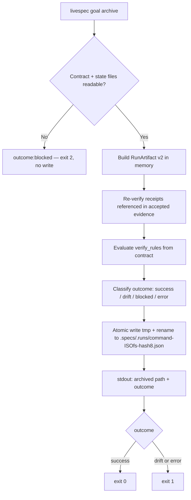
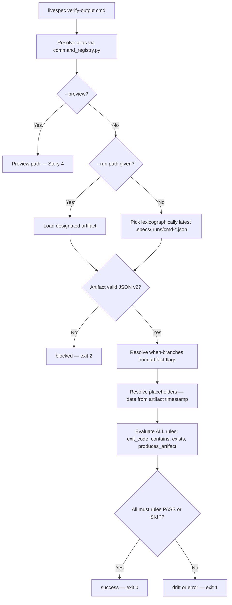
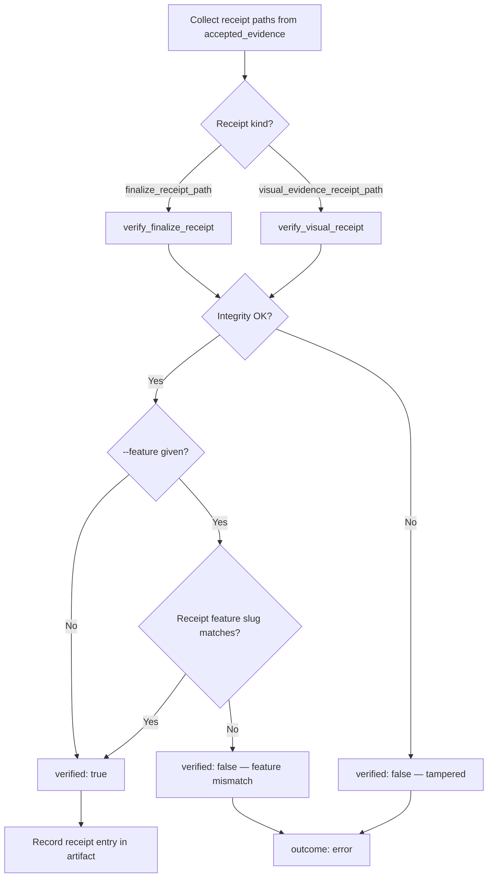
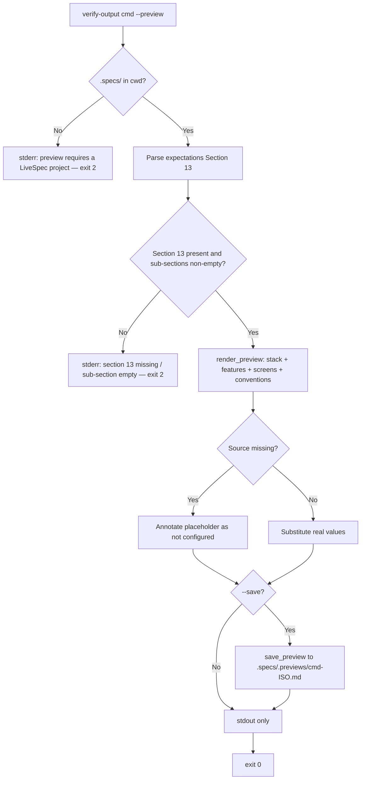
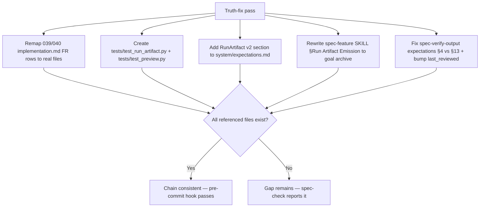

# Feature 039.1 — Goal Archive & Run Artifacts v2

- **Feature:** Goal Archive & Run Artifacts v2 (run-record consolidation)
- **Branch:** `feature/039.1-goal-archive-run-artifacts`
- **Date:** 2026-06-10
- **Status:** Implemented
- **Feature Number:** 039.1 (consolidation of 039 + 040; sub-feature precedent: 005.1, 005.2)
- **Priority:** P1
- **Dependencies:** 039-command-expectations-and-verify-output, 040-expectations-rich-and-verify-preview, 052-deterministic-command-goal-contracts, 058-deterministic-finalization

## Input

Sub-feature consolidating the run-record contract shipped on paper by features 039 and 040:

1. **`livespec goal archive`** — archives a durable copy of the goal contract+state (living in `$TMPDIR/livespec-goals/`) as a RunArtifact v2 JSON under `.specs/.runs/`. Mutates nothing in `$TMPDIR`. The command name is `goal archive` (NOT `run record`, NOT `goal close`) — it is an archival copy, not a lifecycle transition.
2. **`livespec verify-output`** — real CLI engine behind the existing `/spec-verify-output` skill: shared 4-state outcome engine (success/drift/blocked/error), cumulative `when:` branches, placeholder resolution, and receipt integrity re-verification.
3. **`validator/preview.py` real implementation** — `render_preview` (4 project sources) + `save_preview` (`.specs/.previews/`), replacing the stub behind 040 FR-006/FR-008.
4. **Truth-fixes** — remap 039/040 `implementation.md` FR rows to real files, create the actually-missing tests, repair the dangling `system/expectations.md` pointer (spec-system.md references a RunArtifact section that does not exist), rewrite `spec-feature/SKILL.md` §Run Artifact Emission to `livespec goal archive`, and resolve the `spec-verify-output/expectations.md` §4 (forbidden: `.specs/`) vs §13 (`--preview --save` writes `.specs/.previews/`) contradiction.

**Design decisions locked by the approved plan (encoded below, not re-litigated):** RunArtifact schema v2 drops v1's unobservable fields (`git_state_before/after`, `fs_observed`, `duration_ms`) — 039 FR-005 is superseded; `contains` rules SKIP when no transcript is provided (honest weakening of 039 FR-007); receipt re-verification is integrity-only; filenames are timestamp-led with a hash8 suffix so no lock is needed.

---

## User Scenarios & Testing

### Story 1 — Pipeline agent archives a durable run record `P1`

**Description:** A LiveSpec command executor finishes (or abandons) a goal-locked run. The goal contract and state files live in `$TMPDIR/livespec-goals/` and are garbage-collected by the OS. The executor runs `livespec goal archive --contract <p> --state <p> [--feature <slug>] [--exit-code N] [--stdout-file <p>] [--stderr-file <p>] [--json]` to persist a durable, self-contained RunArtifact v2 under `.specs/.runs/`, then reads `archived: <path> | outcome:<o>` on stdout.

**Priority reason:** Without a durable archive, every goal-locked run leaves zero auditable trace once `$TMPDIR` rotates — `verify-output` (Story 2) has nothing to read.

**Independent test:** Render a goal for any command, prove at least one task, run `livespec goal archive --contract <c> --state <s> --exit-code 0`; a fresh `.specs/.runs/<command>-<ISO-fs>-<hash8>.json` exists with `schema_version: "2.0"`, the `$TMPDIR` files are byte-identical to before, and exit code maps to the computed outcome.

```gherkin
Feature: Archive goal contract and state as a durable run artifact
  Scenario: Happy path — completed goal archived as success
    Given a goal contract file and state file exist in $TMPDIR/livespec-goals/
    And   every required task in the state file is complete
    When  the executor runs `livespec goal archive --contract <c> --state <s> --exit-code 0`
    Then  a file `.specs/.runs/<command>-<ISO-fs>-<hash8>.json` is created atomically (tmp + rename)
    And   stdout prints `archived: <path> | outcome:success`
    And   the exit code is 0
    And   the contract and state files in $TMPDIR are not modified

  Scenario: Edge case — incomplete goal archived as drift
    Given a goal state file with at least one required task still pending
    When  the executor runs `livespec goal archive --contract <c> --state <s> --exit-code 0`
    Then  the artifact is still written (the archive never refuses a sad run)
    And   stdout prints `archived: <path> | outcome:drift`
    And   the exit code is 1

  Scenario: Edge case — missing contract file blocks
    Given the path passed to --contract does not exist
    When  the executor runs `livespec goal archive --contract /nope --state <s>`
    Then  no file is written under `.specs/.runs/`
    And   the outcome is blocked
    And   the exit code is 2
```



---

### Story 2 — Operator verifies an archived run against its expectations `P1`

**Description:** After any goal-locked run, an operator (or CI) invokes `livespec verify-output <command> [--run <path>] [--scenario "<flags>"] [--feature <n>] [--json] [--preview] [--save]` — exactly the surface already documented in the `/spec-verify-output` SKILL Usage block. Command aliases are resolved via `validator/command_registry.py`. The verifier loads the latest (or `--run`-designated) RunArtifact v2, applies the shared rule engine (`validator/verify_output.py`), and reports per-rule PASS/FAIL/SKIP with a final 4-state outcome.

**Priority reason:** This is the consumer of Story 1 — without a working engine, expectations contracts and archives remain dead documentation.

**Independent test:** Archive a run for `spec-specify`, then run `livespec verify-output specify --json`; output JSON contains `outcome` and per-rule statuses; exit 0 when all `must` rules pass.

```gherkin
Feature: Verify a run artifact against the expectations contract
  Scenario: Happy path — conforming run passes
    Given a RunArtifact v2 exists at `.specs/.runs/specify-<ISO-fs>-<hash8>.json`
    And   every must rule in its verify_rules evaluates to PASS
    When  the operator runs `livespec verify-output specify`
    Then  the report lists each rule with verb, kind, status, and detail
    And   the outcome is success and the exit code is 0

  Scenario: Edge case — cumulative when-branches, no short-circuit
    Given the artifact records flags ["--visual", "--strict"]
    And   the verify_rules declare when-branches for both flags
    When  the operator runs `livespec verify-output test`
    Then  base rules plus BOTH branch rule sets are evaluated (039 AC-009)
    And   every rule is evaluated even after the first failure (039 AC-011)

  Scenario: Edge case — contains rules without transcript are SKIP
    Given the artifact was archived without --stdout-file and --stderr-file
    When  the operator runs `livespec verify-output specify`
    Then  every contains rule reports SKIP with a descriptive detail
    And   SKIP rules do not count as failed must rules

  Scenario: Edge case — latest artifact selected lexicographically
    Given two artifacts `specify-2026-06-10T10-00-00-aaaaaaaa.json` and `specify-2026-06-10T11-00-00-bbbbbbbb.json`
    When  the operator runs `livespec verify-output specify` without --run
    Then  the 11-00-00 artifact is selected (timestamp leads the filename)
```



---

### Story 3 — Archive re-verifies receipt integrity before trusting evidence `P1`

**Description:** Goal task evidence may reference finalize receipts (`finalize_receipt_path`, from `validator/finalize_receipt.py`) and visual evidence receipts (`visual_evidence_receipt_path`, from `validator/visual_evidence.py`). At archive time, `livespec goal archive` re-verifies each referenced receipt's **integrity only** — hash/structure via the existing `verify_finalize_receipt` / `verify_visual_receipt` functions. It never checks `expected_command` (receipts are frequently emitted by child commands), and checks `expected_feature_slug` only when `--feature` is given. A tampered receipt forces outcome `error`.

**Priority reason:** The archive is the durable audit record — if it blindly copies evidence pointing at tampered receipts, the whole chain of proof is worthless.

**Independent test:** Archive a run whose accepted evidence references a valid finalize receipt → `receipts[0].verified == true`. Corrupt one byte of the receipt JSON, archive again → `receipts[0].verified == false`, artifact `verify_result.outcome == "error"`, exit 1.

```gherkin
Feature: Receipt integrity re-verification at archive time
  Scenario: Happy path — valid receipts recorded as verified
    Given accepted task evidence references an intact finalize receipt
    When  `livespec goal archive` runs
    Then  the artifact's receipts array contains an entry with kind "finalize", verified true, and a verdict
    And   the receipt check never compares expected_command

  Scenario: Edge case — tampered receipt forces error outcome
    Given a referenced receipt file was modified after emission
    When  `livespec goal archive` runs
    Then  the matching receipts entry has verified false and an error message
    And   the artifact outcome is error and the exit code is 1

  Scenario: Edge case — feature scoping only with --feature
    Given the executor passes --feature 039.1-goal-archive-run-artifacts
    And   a referenced receipt carries a different feature slug
    When  `livespec goal archive` runs
    Then  the receipt check fails with a feature-mismatch error
    And   without --feature the same receipt would pass integrity checking
```



---

### Story 4 — Operator previews a command on the current project `P2`

**Description:** Before running a command, an operator invokes `livespec verify-output <command> --preview [--save]`. The real `validator/preview.py` (~150 LOC) implements `render_preview` reading 4 sources — `.specs/stacks/_default.md` (stack name), `.specs/features/` scan (feature slugs), `.specs/design/screens/` scan (screen names), `.conventions/manifest.yaml` (sub-domains) — substituting Section 13 placeholders, with `[not configured]` fallback per missing source; and `save_preview` writing `.specs/.previews/<command>-<ISO>.md`.

**Priority reason:** P2 — 040 promised `--preview` and the SKILL documents it; today the module is a stub, so the documented surface lies.

**Independent test:** From the livespec repo, `livespec verify-output specify --preview` exits 0 and the report names at least one real feature slug (e.g. `039-command-expectations-and-verify-output`) and the real stack name; with `--save` a file appears under `.specs/.previews/`.

```gherkin
Feature: Project-aware preview with real renderer
  Scenario: Happy path — preview resolves placeholders from 4 sources
    Given the cwd is a LiveSpec project with .specs/features/ and .specs/stacks/_default.md
    When  the operator runs `livespec verify-output specify --preview`
    Then  the rendered Markdown names real feature slugs and the real stack name
    And   missing sources render as "[not configured]" instead of raw placeholders
    And   the exit code is 0

  Scenario: Happy path — --save persists the preview
    When  the operator runs `livespec verify-output specify --preview --save`
    Then  a file `.specs/.previews/specify-<ISO>.md` exists with content equal to stdout

  Scenario: Edge case — canonical FR-009 errors exit 2
    Given the expectations file lacks Section 13, OR a sub-section is empty, OR cwd has no .specs/
    When  the operator runs `livespec verify-output <cmd> --preview`
    Then  stderr contains the matching canonical substring from 040 AC-008/009/010
    And   the exit code is 2
```



---

### Story 5 — Maintainer truth-fixes the 039/040 documentation chain `P2`

**Description:** A LiveSpec maintainer reconciles documentation with reality: 039 and 040 `implementation.md` FR rows are remapped to the real files this feature creates; `tests/test_run_artifact.py` and `tests/test_preview.py` (claimed by 040 FR-011 but absent) are actually created; `system/expectations.md` gains a "RunArtifact v2 (goal archive)" section repairing the dangling spec-system.md pointer; `spec-feature/SKILL.md` §Run Artifact Emission is rewritten to invoke `livespec goal archive`; and `spec-verify-output/expectations.md` resolves the §4 (forbidden: `.specs/`) vs §13 (`--preview --save` writes `.specs/.previews/`) contradiction with a `last_reviewed` bump.

**Priority reason:** P2 — no runtime behavior, but the framework's core promise is that specs never lie; leaving the chain broken contradicts the constitution.

**Independent test:** Grep 039/040 `implementation.md` for FR rows pointing at non-existent files → zero; `pytest tests/test_run_artifact.py tests/test_preview.py` passes; `grep -n "RunArtifact v2" system/expectations.md` matches; `grep -c "goal archive" .agent-sync/skills/spec-feature/SKILL.md` ≥ 1; `spec-verify-output/expectations.md` §4 no longer forbids all of `.specs/` while §13 documents `.specs/.previews/` writes.

```gherkin
Feature: Documentation truth-fixes
  Scenario: Happy path — implementation maps point at real files
    Given features 039 and 040 have implementation.md FR rows
    When  the truth-fix is applied
    Then  every FR row references a file that exists in the repo
    And   tests/test_run_artifact.py and tests/test_preview.py exist and pass

  Scenario: Happy path — dangling expectations pointer repaired
    Given spec-system.md says "See system/expectations.md for the full reference" about run artifacts
    When  the truth-fix is applied
    Then  system/expectations.md contains a "RunArtifact v2 (goal archive)" section
    And   the section documents the superseding of 039 FR-005's unobservable fields

  Scenario: Edge case — contradiction resolved with certification
    Given spec-verify-output/expectations.md §4 forbids .specs/ writes while §13 documents .specs/.previews/ writes
    When  the truth-fix is applied
    Then  §4 carves out .specs/.previews/ as an allowed optional effect under --preview --save
    And   the frontmatter last_reviewed is bumped to the commit date
```



---

## Acceptance Criteria

- **AC-001** — `livespec goal archive --contract <p> --state <p> [--feature <slug>] [--exit-code N] [--stdout-file <p>] [--stderr-file <p>] [--json]` writes a RunArtifact v2 JSON to `.specs/.runs/<command>-<ISO-fs>-<hash8>.json` and prints `archived: <path> | outcome:<o>` on stdout (a JSON envelope with the same fields when `--json`). The `$TMPDIR` contract and state files are byte-identical before and after.
- **AC-002** — `goal archive` exit codes: 0 when outcome is `success`, 1 when `drift` or `error`, 2 when `blocked` (unreadable/missing contract or state file; nothing is written under `.specs/.runs/` when blocked).
- **AC-003** — The artifact filename is `<command>-<ISO-fs>-<hash8>.json` where ISO-fs is the timestamp with colons replaced by dashes (timestamp leads, so the lexicographically greatest filename is the latest run) and hash8 is the first 8 chars of the goal hash (uniqueness without any lock). The write is atomic: temp file + rename.
- **AC-004** — The artifact contains exactly the v2 fields: `schema_version: "2.0"`, `goal_hash`, `command`, `feature` (string or null), `flags`, `exit_code` (integer, or null when `--exit-code` was omitted), `timestamp`, optional `stdout`/`stderr` (only when `--stdout-file`/`--stderr-file` were given), `goal{status, tasks[{id, ordinal, status, accepted_evidence}]}`, `receipts[{kind: finalize|visual, path, verified, verdict, error}]`, `verify_rules` (copied from the contract so the artifact is self-contained), `verify_result{outcome, rules[{verb, kind, status, detail}]}`. None of v1's unobservable fields (`git_state_before`, `git_state_after`, `fs_observed`, `duration_ms`) appear — 039 FR-005 is superseded.
- **AC-005** — When `--stdout-file`/`--stderr-file` are absent, every `contains` rule evaluates to SKIP (with a descriptive detail) and SKIP rules never count toward failed `must` rules. With transcripts provided, `contains` rules evaluate PASS/FAIL against the file contents (039 FR-007 weakened honestly: PASS/FAIL/SKIP per rule).
- **AC-006** — At archive time, every `finalize_receipt_path` / `visual_evidence_receipt_path` found in accepted task evidence is re-verified for integrity only, via the existing `verify_finalize_receipt` (`validator/finalize_receipt.py`) and `verify_visual_receipt` (`validator/visual_evidence.py`). `expected_command` is never checked; `expected_feature_slug` is checked only when `--feature` is given. A failed integrity check records `verified: false` and forces `verify_result.outcome = "error"`.
- **AC-007** — `livespec verify-output <command> [--run <path>] [--scenario "<flags>"] [--feature <n>] [--json] [--preview] [--save]` is accepted exactly as documented in the `/spec-verify-output` SKILL Usage block; command aliases resolve through `validator/command_registry.py`. Without `--run`, the lexicographically latest `.specs/.runs/<command>-*.json` is selected; a malformed artifact blocks (exit 2). `--scenario "<flags>"`, when given, replaces the artifact's `flags` as the when-branch activation source; `--feature <n>` overrides the `<feature>` placeholder value and enables receipt feature scoping at verify time (same semantics as `goal archive --feature`).
- **AC-008** — A single shared rule engine module `validator/verify_output.py` is consumed by BOTH `goal archive` and `verify-output`: rule kinds `exit_code`, `contains`, `exists`, `produces_artifact`; `when:` branches activate cumulatively from the artifact's flags (039 AC-009); every rule is evaluated without short-circuit (039 AC-011); `may` rules are informative and never affect the outcome.
- **AC-009** — Outcome classification reuses `validator/outcome.py` (4 states: success/drift/blocked/error) and placeholder resolution reuses `validator/placeholders.py`, with `<date>` resolved from the ARTIFACT timestamp, never the wall clock (040 EC-006).
- **AC-010** — `validator/preview.py` is a real implementation: `render_preview(expectations, project_root)` reads 4 sources — `.specs/stacks/_default.md`, `.specs/features/` scan, `.specs/design/screens/` scan, `.conventions/manifest.yaml` — substitutes Section 13 placeholders with real values, annotates each missing source as `[not configured]`; `save_preview` writes `.specs/.previews/<command>-<ISO>.md`. Run from the livespec repo, the preview names real feature slugs (040 AC-012).
- **AC-011** — Preview failure paths exit 2 with the 3 canonical messages whose exact substrings come from 040 AC-008/009/010: `section 13 missing in`, `section 13 sub-section '<name>' is empty`, `preview requires a LiveSpec project (no .specs/ found)`.
- **AC-012** — Truth-fixes are applied: (a) 039 and 040 `implementation.md` FR rows reference only files that exist; (b) `tests/test_run_artifact.py` and `tests/test_preview.py` exist and pass; (c) `system/expectations.md` contains a "RunArtifact v2 (goal archive)" section documenting the v2 schema and the superseding of 039 FR-005; (d) `.agent-sync/skills/spec-feature/SKILL.md` §Run Artifact Emission instructs `livespec goal archive`; (e) `.agent-sync/skills/spec-verify-output/expectations.md` resolves the §4 vs §13 filesystem-effects contradiction and bumps `last_reviewed`.
- **AC-013** — Protected scope honored: `validator/journeys/runner.py` and `tests/test_journey_v2_runner.py` are not modified; the roadmap MVP entries for 041/042/043 are not modified; no lock primitive is introduced for `.specs/.runs/` writes (unique filenames make it unnecessary).

---

## Functional Requirements

- **FR-001** — Implement the `livespec goal archive` subcommand (CLI surface, stdout line `archived: <path> | outcome:<o>`, `--json` envelope, exit-code mapping success=0 / drift|error=1 / blocked=2) in `validator/cli_commands/`, reading the contract+state pair without mutating them. → AC-001, AC-002
- **FR-002** — Implement the RunArtifact v2 schema and writer: full field set per AC-004, timestamp-led `<command>-<ISO-fs>-<hash8>.json` naming, atomic tmp+rename write, no lock. → AC-003, AC-004
- **FR-003** — Implement transcript handling: optional `--stdout-file`/`--stderr-file` inputs embedded as `stdout`/`stderr`; absence degrades every `contains` rule to SKIP without contributing to failure. → AC-005
- **FR-004** — Implement receipt integrity re-verification at archive time, reusing `verify_finalize_receipt` and `verify_visual_receipt`; record per-receipt `{kind, path, verified, verdict, error}`; tampered receipt → outcome `error`; feature scoping only under `--feature`. → AC-006
- **FR-005** — Implement the `livespec verify-output` CLI surface matching the SKILL Usage block, with alias resolution via `validator/command_registry.py`, `--run` override, lexicographic latest-artifact selection, and blocked handling for malformed artifacts. → AC-007
- **FR-006** — Extract/implement the shared rule engine `validator/verify_output.py` consumed by both commands: 4 rule kinds, cumulative when-branches, no short-circuit, informative `may`. → AC-008
- **FR-007** — Wire outcome classification through `validator/outcome.py` and placeholder resolution through `validator/placeholders.py` (`<date>` from artifact timestamp). → AC-009
- **FR-008** — Implement `validator/preview.py` for real (~150 LOC): `render_preview` with the 4 documented sources and `[not configured]` fallback, plus `save_preview` to `.specs/.previews/<command>-<ISO>.md`. → AC-010
- **FR-009** — Implement the 3 canonical preview error paths with exact substrings and exit 2. → AC-011
- **FR-010** — Apply the documentation truth-fixes: 039/040 `implementation.md` remaps, the two missing test files, the `system/expectations.md` "RunArtifact v2 (goal archive)" section, the `spec-feature/SKILL.md` §Run Artifact Emission rewrite, and the `spec-verify-output/expectations.md` §4/§13 resolution + `last_reviewed` bump. → AC-012
- **FR-011** — Enforce the protected scope: no changes to `validator/journeys/runner.py`, `tests/test_journey_v2_runner.py`, or the roadmap MVP entries for 041/042/043; no `.specs/.LOCK` usage for `.specs/.runs/` writes. → AC-013

---

## Key Entities

- **RunArtifactV2** — Durable JSON record of one goal-locked run under `.specs/.runs/`: `schema_version "2.0"`, `goal_hash`, `command`, `feature|null`, `flags`, `exit_code`, `timestamp`, optional `stdout`/`stderr`, `goal` snapshot, `receipts`, copied `verify_rules`, computed `verify_result`. Self-contained: verifiable without the original expectations file or `$TMPDIR`.
- **GoalSnapshot** — Embedded copy of the goal state: `status` plus `tasks[{id, ordinal, status, accepted_evidence}]`. Read-only extraction; never written back to `$TMPDIR`.
- **ReceiptCheck** — One entry of `receipts[]`: `kind` (`finalize` | `visual`), `path`, `verified` (bool), `verdict`, `error`. Produced by integrity-only re-verification.
- **VerifyRule** — One assertion (`exit_code`, `contains`, `exists`, `produces_artifact`) carrying its verb (`must`/`may`/`must_not`), evaluated by the shared engine. Unchanged grammar from 039 FR-004.
- **VerifyResult** — Engine output: `outcome` (success/drift/blocked/error) + `rules[{verb, kind, status, detail}]` where status ∈ PASS/FAIL/SKIP.
- **PreviewReport** — Markdown rendered by `render_preview` from Section 13 with project values substituted; persisted by `save_preview` under `.specs/.previews/`.

---

## Edge Cases

- **EC-001** — Contract file and state file hashes disagree (state belongs to a different goal): archive blocks (exit 2) with an explicit mismatch reason; nothing written.
- **EC-002** — Goal state has pending required tasks but the executor passes `--exit-code 0`: artifact is written, outcome `drift`, exit 1 — the archive records reality, it never refuses a sad run (only `blocked` refuses, and only for unreadable inputs).
- **EC-003** — Two archives of the same command in the same second: hash8 suffix differentiates filenames; both files coexist; `verify-output` picks the lexicographically latest.
- **EC-004** — Accepted evidence references a receipt path that no longer exists: the `ReceiptCheck` records `verified: false` with a not-found error; outcome `error`.
- **EC-005** — No transcript provided AND the contract's verify rules are exclusively `contains` rules: all rules SKIP; outcome derives from goal completion + exit code alone (may legitimately be `success`).
- **EC-006** — `<date>` placeholder in a rule: always resolved from the artifact `timestamp`, never `datetime.now()` — re-verifying an old artifact tomorrow yields identical results (040 EC-006).
- **EC-007** — `verify-output` on a truncated/corrupted artifact JSON: blocked, exit 2, message names the malformed path (039 EC-007 semantics preserved for v2).
- **EC-008** — `--feature` given but a referenced receipt carries a different feature slug: `verified: false`, outcome `error`; the same receipt passes when `--feature` is omitted (integrity-only default).
- **EC-009** — Preview source partially present (e.g. `.specs/design/screens/` exists but is empty): that placeholder renders `[not configured]`-style annotation while the other 3 sources resolve normally; exit stays 0.
- **EC-010** — `goal archive` invoked twice on the same contract+state pair: two artifacts with identical content except timestamp/filename; idempotence is not required (the archive is an append-only journal), and no lock is taken.
- **EC-011** — `goal archive` invoked without `--exit-code`: the artifact records `exit_code: null` and every `exit_code` verify rule evaluates to SKIP (same honest-absence semantics as `contains` without transcript, AC-005); SKIP never counts toward failed `must` rules.

---

## Success Criteria

- **SC-001** — Round-trip on the livespec repo: `livespec goal render` → prove ≥1 task → `livespec goal archive` → `livespec verify-output <command>` completes with exit 0 and a per-rule report; the artifact validates against the v2 schema.
- **SC-002** — `pytest tests/test_run_artifact.py tests/test_preview.py` passes in CI (the two files claimed by 040 FR-011 finally exist).
- **SC-003** — Zero occurrences of `git_state_before`, `git_state_after`, `fs_observed`, or `duration_ms` in any artifact emitted by `goal archive` (grep over `.specs/.runs/` after a full pipeline run).
- **SC-004** — `livespec verify-output specify --preview` run from the livespec repo exits 0 and the report contains at least one real feature slug and the real stack name — no raw `<feature>`/`<stack>` placeholders for resolvable sources.
- **SC-005** — `/spec-check` on features 039 and 040 reports zero FR rows pointing at non-existent files after the truth-fix.
- **SC-006** — A deliberately tampered finalize receipt is caught in 100% of `goal archive` runs: `verified: false`, outcome `error`, exit 1.

<!-- finalize:spec-plan:2026-06-10:362ef347 -->

<!-- finalize:spec-implement:2026-06-10:2395e303 -->
