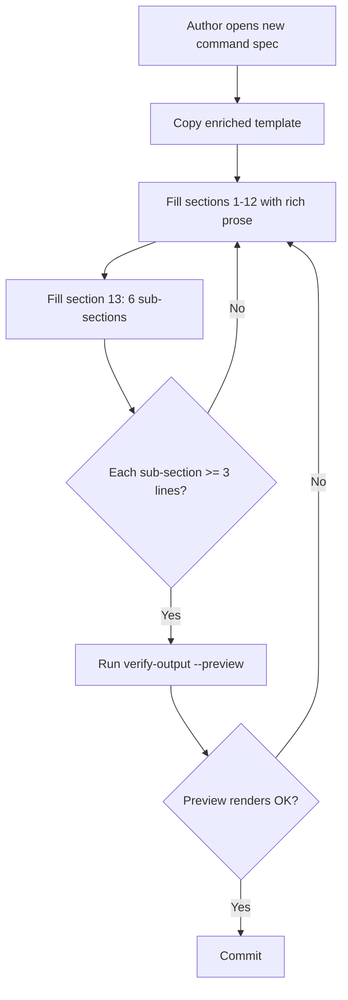
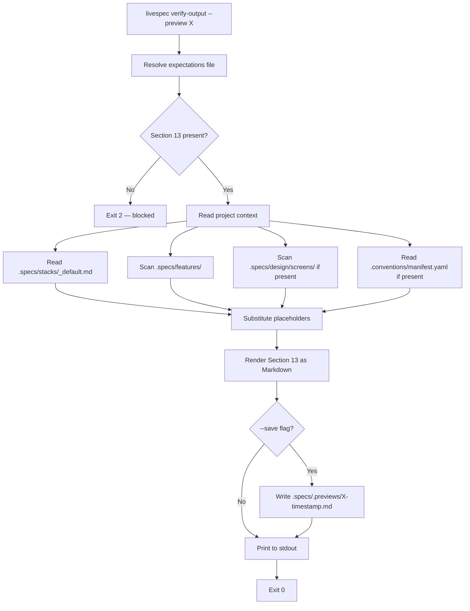
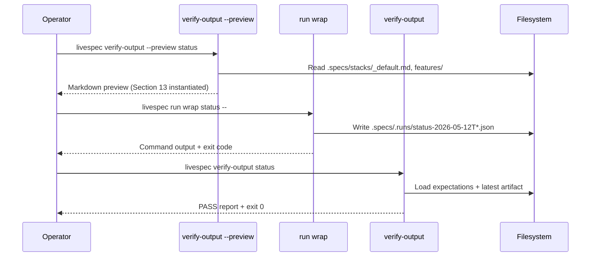
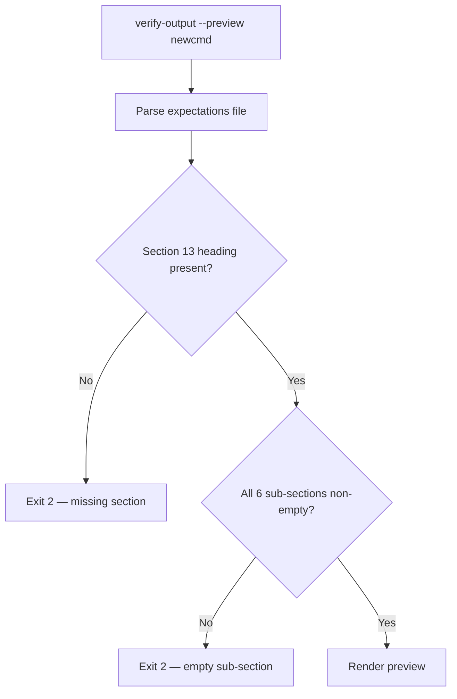

# Feature 040 — Rich Expectations Format & Project-Aware Preview

- **Feature Name:** Rich Expectations Format & `verify-output --preview`
- **Branch:** `feature/040-expectations-rich-and-verify-preview`
- **Date:** 2026-05-12
- **Status:** Draft
- **Depends on:** feature/039 (introduces `*.expectations.md` and `livespec verify-output`)

## Input

Feature 039 introduced per-command `*.expectations.md` files and a `livespec verify-output` command that compares a run artifact JSON to a YAML `verify:` block (section 12). The skeleton works, but two structural problems block adoption:

1. **Two contracts silently mixed.** Section 12 (verify YAML) is a MACHINE contract consumed by the verifier. Sections 1-11 are supposed to be the OPERATOR contract — what a human or a future LLM session should read to know what the command does, what files it produces, what console output looks like, what to do when it goes wrong. In practice these prose sections are drained: section 1 is one sentence, section 6 ("Produced Artifacts") is often empty, section 11 ("Troubleshooting") lists a single symptom, section 9 ("Runtime Profile") is an abstract range without scenario context.

2. **The files do not answer the questions a fresh operator asks.** Reading `commands/spec-test.expectations.md` today, a new Claude Code session cannot answer: *What does the console look like when I run `/spec.test --visual`? Which files appear, where, in what tree? What does success look like vs drift vs blocked? How long does it take, and what drives that? Which exit code triggers which next action?*

This feature transforms `*.expectations.md` from a passive machine descriptor into a **living operator contract** with two complementary modes:

- **Generic mode** — the file checked into the LiveSpec repo. Describes the command universally with placeholders (`<feature>`, `<screen>`, `platform_<X>`). Adds a mandatory **Section 13 — Demo Session** that contains live console output, produced-files ASCII tree, three explicit cases (Aligned / Drift / Missing), a scenario-keyed runtime profile table, edge cases, and post-run actions. Sections 1-11 are rewritten to pass a concrete test: *"Can a developer who has never run this command, after reading the file, say what to expect?"* If not, the section is still too poor.

- **Project-aware preview** — a report generated on demand by `livespec verify-output --preview <command>`. Same structure as the generic Demo Session, but with the REAL values of the current project substituted for placeholders. On project STRAPT, `livespec verify-output --preview test` returns "here are the 13 actual PNGs that will be generated, here are the 6 features that will get a markdown report, here are the 2 XCUITest surfaces that will be converged" — instantiated by reading the project's `.specs/` files.

The full operator workflow becomes a triad:

1. `livespec verify-output --preview <cmd>` — see in advance what will happen ON MY project
2. `livespec run wrap <cmd> -- <argv>` — run for real, capture JSON artifact (FR-006 of feature 039)
3. `livespec verify-output <cmd>` — verify the actual result matches expectations (verify block + optional comparison to the previously emitted preview)

Once this format is in place, every new LiveSpec command MUST ship its enriched expectations file (Section 13 mandatory), otherwise `livespec verify-output --preview` fails the contract. The format becomes a quality gate, not just a passive descriptor.

---

## User Scenarios & Testing

### Story 1 (P1) — Command author writes a rich expectations file

**Description:** A LiveSpec maintainer authoring a new slash-command or rewriting an existing one needs a canonical template that forces a richer operator contract: every section 1-11 must pass the "fresh-operator readability" test, and the new mandatory Section 13 ("Demo Session") with six sub-sections must be filled with concrete examples — live console output, produced-files tree, Aligned/Drift/Missing cases, scenario-keyed runtime table, edge cases, post-run actions.

**Priority reason:** Without the enriched template, every other story is blocked — the preview command (Story 2) cannot generate useful project-aware reports if generic files have nothing to instantiate.

**Independent test:** Copy `system/templates/command-expectations.template.md` (updated) into `commands/<foo>.expectations.md`, fill metadata + sections 1-13, run `livespec verify-output --preview foo` against any project; the preview must render Section 13 with all 6 sub-sections, each ≥ 3 non-empty content lines.

```gherkin
Feature: Author a rich expectations file
  Scenario: Happy path — author copies the enriched template and fills section 13
    Given the file `system/templates/command-expectations.template.md` exposes 13 sections
    When  the author copies it to `commands/foo.expectations.md` and fills sections 1-13
    Then  the parser accepts the file as a valid ExpectationsFile
    And   section 13 contains exactly 6 sub-sections: Live Console Output, Files Produced, Aligned / Drift / Missing, Runtime Profile (scenarios), Edge Cases, Post-run Actions
    And   each sub-section has at least 3 non-empty content lines

  Scenario: Edge case — section 13 missing entirely on a new file
    Given a draft `commands/foo.expectations.md` with only sections 1-12
    When  `livespec verify-output --preview foo` runs
    Then  it exits 2
    And   stderr contains "section 13 missing in commands/foo.expectations.md"

  Scenario: Edge case — section 13 present but sub-section "Files Produced" empty
    Given a draft `commands/foo.expectations.md` with section 13 sub-headings but blank "Files Produced"
    When  the parser validates the file
    Then  it raises ExpectationsInvalid("section 13 sub-section 'Files Produced' is empty")
```



---

### Story 2 (P1) — Operator runs `verify-output --preview` on their project

**Description:** An operator working on project STRAPT wants to know, BEFORE running `/spec.test --visual`, what the command will actually do on this codebase: which screenshots will be captured, which baselines compared, which features touched, how long it should take given the current stack. They invoke `livespec verify-output --preview test`. The command reads `.specs/stacks/_default.md`, `.specs/features/*/`, `.specs/design/screens/`, and `.conventions/manifest.yaml` from the current project and emits a Markdown report mirroring Section 13 of the generic expectations file — but with placeholders replaced by real values.

**Priority reason:** This is the user-facing payoff. Without `--preview`, the enriched expectations format remains a documentation effort. With `--preview`, it becomes an operational tool: you can review what a command will produce without running it.

**Independent test:** In the livespec repo itself (which has `.specs/features/`), run `livespec verify-output --preview verify-output` (or any other command). The output must reference at least one real feature slug from `.specs/features/` (e.g. `039-command-expectations-and-verify-output`), the actual stack name from `.specs/stacks/_default.md`, and must NOT contain any unresolved `<feature>` / `<screen>` / `<path>` placeholders for resolvable fields.

```gherkin
Feature: Project-aware preview of a command
  Scenario: Happy path — preview on a real project resolves placeholders
    Given the current cwd is a LiveSpec project with `.specs/features/039-foo/` and `.specs/stacks/_default.md`
    When  the operator runs `livespec verify-output --preview specify`
    Then  the report renders a Markdown document with Section 13 sub-sections instantiated
    And   the report mentions the real feature slug "039-foo" instead of "<feature>"
    And   the report mentions the real stack name read from `_default.md`
    And   exit code is 0

  Scenario: Happy path — --save writes the preview under .specs/.previews/
    Given the operator runs `livespec verify-output --preview test --save`
    When  the command completes successfully
    Then  a file `.specs/.previews/test-<ISO-timestamp>.md` exists
    And   the file content equals the stdout report

  Scenario: Edge case — no .specs/ directory in cwd
    Given the cwd has no `.specs/` directory
    When  the operator runs `livespec verify-output --preview specify`
    Then  the command exits 2
    And   stderr contains "preview requires a LiveSpec project (no .specs/ found)"

  Scenario: Edge case — section 13 missing in the expectations file
    Given `commands/foo.expectations.md` lacks section 13
    When  the operator runs `livespec verify-output --preview foo`
    Then  exit code is 2
    And   stderr contains "section 13 missing in commands/foo.expectations.md"
```



---

### Story 3 (P1) — Operator runs the full verify triad

**Description:** An operator wants to validate a complete cycle on the current project: preview the command, run it for real, verify the result. They invoke (1) `livespec verify-output --preview test` to see expected behavior, (2) `livespec run wrap test -- --visual` to capture an artifact, (3) `livespec verify-output test` to confirm reality matches the contract. The verifier in step (3) MAY consume the latest preview to flag deviations (e.g. preview said "5 screens will be captured" but the artifact records only 3).

**Priority reason:** This triad is the operational reason the feature exists. Without it, preview and verify-output remain two disconnected tools.

**Independent test:** On the livespec repo, run all three commands in sequence for `status` (a fast read-only command). Step 1 emits a preview, step 2 produces an artifact, step 3 emits a PASS report. All three exit 0.

```gherkin
Feature: Verify triad — preview, run, verify
  Scenario: Happy path — three commands compose
    Given a clean project with `.specs/` initialized
    When  the operator runs `livespec verify-output --preview status`
    Then  the preview report is printed and exit 0
    When  the operator runs `livespec run wrap status --`
    Then  a JSON artifact appears in `.specs/.runs/status-*.json`
    When  the operator runs `livespec verify-output status`
    Then  the report has all `must` rules PASS and exit 0
```



---

### Story 4 (P2) — A new command without Section 13 fails the preview gate

**Description:** A contributor adds a new command `commands/newcmd.md` and a stub `commands/newcmd.expectations.md` with sections 1-12 only. When CI (or a maintainer) runs `livespec verify-output --preview newcmd`, the command exits 2 with a clear message naming the missing section. This makes Section 13 a hard contract for every new command.

**Priority reason:** P2 because new-command authoring is infrequent; but enforcement is mandatory — otherwise the system rots.

**Independent test:** Create `commands/newcmd.expectations.md` with sections 1-12 only. Run `livespec verify-output --preview newcmd`. Exit 2, stderr names the missing section.

```gherkin
Feature: Section 13 is a hard contract
  Scenario: Edge case — Section 13 missing → preview blocked
    Given `commands/newcmd.expectations.md` exists with sections 1-12 only
    When  `livespec verify-output --preview newcmd` runs
    Then  the command exits 2
    And   stderr contains "section 13 missing in commands/newcmd.expectations.md"

  Scenario: Edge case — Section 13 present but a sub-section is blank
    Given `commands/newcmd.expectations.md` has section 13 with the "Files Produced" sub-heading but no content
    When  `livespec verify-output --preview newcmd` runs
    Then  the command exits 2
    And   stderr contains "section 13 sub-section 'Files Produced' is empty"
```



---

## Acceptance Criteria

- **AC-001** — The enriched template at `system/templates/command-expectations.template.md` defines **13 sections** (sections 1-12 from feature 039 stay structurally compatible; section 13 "Demo Session" is added) and documents the 6 sub-sections of Section 13: *Live Console Output*, *Files Produced*, *Aligned / Drift / Missing*, *Runtime Profile (scenarios)*, *Edge Cases*, *Post-run Actions*.
- **AC-002** — Sections 1-11 in the template are rewritten with richer structured sub-fields and example prose, so that filling them naïvely yields a file that answers the fresh-operator readability test (a developer who has never run the command can describe expected behavior after reading).
- **AC-003** — All 20 builtin expectations files (`commands/<X>.expectations.md` for the 19 slash-commands plus `commands/spec-verify-output.expectations.md`) are migrated to the enriched format: every Section 13 sub-section is filled with ≥ 3 non-empty content lines.
- **AC-004** — The schema validator in `validator/expectations.py` accepts the enriched format: Section 13 is a required section (alongside sections 1-12) and its 6 sub-sections must each have non-empty content. The parser emits `ExpectationsInvalid` with a precise reason when any sub-section is missing or empty.
- **AC-005** — `livespec verify-output --preview <command>` reads the expectations file, instantiates Section 13 placeholders against the current project's `.specs/` data, and prints a Markdown report to stdout. Exit 0 on success.
- **AC-006** — The preview command resolves placeholders from at least 4 project sources: (a) `.specs/stacks/_default.md` (stack name), (b) `.specs/features/` (feature slugs and count), (c) `.specs/design/screens/` (screen filenames, if the directory exists), (d) `.conventions/manifest.yaml` (convention sub-domains, if present).
- **AC-007** — `livespec verify-output --preview <command> --save` additionally writes the rendered preview to `.specs/.previews/<command>-<ISO-timestamp>.md`. The file content is byte-for-byte equal to stdout. Without `--save`, no file is created under `.specs/.previews/`.
- **AC-008** — `livespec verify-output --preview <command>` exits 2 with stderr message `"section 13 missing in commands/<X>.expectations.md"` when the expectations file has no Section 13. The exact substring `section 13 missing in commands/` MUST be present.
- **AC-009** — `livespec verify-output --preview <command>` exits 2 with stderr substring `"section 13 sub-section '<name>' is empty"` when any Section 13 sub-section is blank.
- **AC-010** — `livespec verify-output --preview <command>` exits 2 with stderr substring `"preview requires a LiveSpec project (no .specs/ found)"` when cwd has no `.specs/` directory.
- **AC-011** — Snapshot tests verify that **at least 3 expectations files** (`init`, `test`, `feature`) have a fully-populated Section 13: 6 sub-sections each with ≥ 3 non-empty content lines.
- **AC-012** — Running `livespec verify-output --preview <any-cmd>` from the livespec repo (which contains `.specs/features/`) produces a report that references real feature slugs (e.g. `039-command-expectations-and-verify-output`) — NOT the literal placeholder `<feature>`.
- **AC-013** — Section 12 (Verify Contract YAML) semantics are unchanged from feature 039. The existing test suite for the verify block (parsing, evaluation, when-branches, placeholders, outcome classification) continues to pass without modification of its assertions.

---

## Functional Requirements

- **FR-001** — Update `system/templates/command-expectations.template.md` to include Section 13 with 6 sub-sections (h3 headings: "Live Console Output", "Files Produced", "Aligned / Drift / Missing", "Runtime Profile (scenarios)", "Edge Cases", "Post-run Actions"). Each sub-section in the template is annotated with stub prose explaining its purpose. → AC-001
- **FR-002** — Enrich sections 1-11 of the template with structured sub-fields and richer example prose so a freshly-copied file passes the readability test (description of inputs/outputs/side-effects, examples, edge case notes). → AC-002
- **FR-003** — Extend `validator/expectations.py`: add `"13. Demo Session"` to `REQUIRED_SECTIONS`; add validation that Section 13 contains the 6 sub-sections and each has non-empty content. Emit `ExpectationsInvalid` with a precise reason on violation. → AC-004, AC-008, AC-009
- **FR-004** — Migrate all 20 builtin expectations files (`commands/<cmd>.expectations.md` × 19 + `verify-output.expectations.md`) to the enriched format. Each file MUST have a complete Section 13 with all sub-sections filled with ≥ 3 non-empty content lines. → AC-003
- **FR-005** — Add `--preview` flag to `validator/cli_commands/verify_output_cmd.py`. When set, the command skips artifact resolution and produces a project-aware preview report instead of an evaluation report. Mutually informative with existing flags: `--json` still emits JSON, `--scenario` is accepted (preview honors flag-conditional when-branches when computing produced artifacts). → AC-005
- **FR-006** — Implement a new `validator/preview.py` module: `render_preview(expectations, project_root) -> str`. The function reads `.specs/stacks/_default.md`, scans `.specs/features/`, scans `.specs/design/screens/` (if exists), reads `.conventions/manifest.yaml` (if exists), substitutes placeholders in Section 13's rendered Markdown, and returns the resulting Markdown string. → AC-005, AC-006, AC-012
- **FR-007** — Implement placeholder resolution for preview: `<feature>` → first feature slug found in `.specs/features/` (alphabetical) OR the latest feature slug if multiple; `<screen>` → list of screen PNG names from `.specs/design/screens/`; `<stack>` → stack identifier from `.specs/stacks/_default.md`; `<path>` → passthrough; unresolved placeholders for sources that are missing get a clear `[not configured]` annotation rather than being left raw. → AC-006, AC-012
- **FR-008** — Add `--save` flag to `verify-output --preview`. When `--save`, write the rendered Markdown to `.specs/.previews/<command>-<ISO-timestamp>.md` (create the directory if missing) AND print to stdout. Without `--save`, no filesystem write under `.specs/.previews/`. → AC-007
- **FR-009** — `verify-output --preview` exits 2 with the canonical error strings when (a) Section 13 missing, (b) sub-section empty, (c) no `.specs/` directory in cwd. Error strings MUST match the exact substrings declared in AC-008, AC-009, AC-010. → AC-008, AC-009, AC-010
- **FR-010** — Section 12 (verify YAML) parsing, evaluation, when-branches, placeholders, outcome classification semantics from feature 039 remain identical. No regression — existing test suite passes unchanged for those concerns. → AC-013
- **FR-011** — Add tests: (a) unit tests for `render_preview` covering placeholder substitution from each of the 4 sources; (b) CLI tests for `verify-output --preview` covering success, --save, missing section 13, empty sub-section, no .specs/; (c) snapshot tests asserting Section 13 completeness on `init`, `test`, `feature` expectations files (AC-011). → AC-011, AC-005, AC-007, AC-008, AC-009, AC-010
- **FR-012** — Update `commands/spec-verify-output.md` (the slash-command instructions) to document the `--preview` and `--save` flags, the triad workflow, and the Section 13 contract. → quality of life
- **FR-013** — Update `commands/spec-verify-output.expectations.md` to reflect the new `--preview` behavior in its own contract (adding `when: - flag: "--preview"` branches and a complete Section 13). → AC-003
- **FR-014** — Pre-commit hook semantics from feature 039 (last_reviewed bump) are unchanged. Files touched by this feature MUST have `last_reviewed: 2026-05-12`. → no regression

---

## Key Entities

- **EnrichedExpectationsFile** — `ExpectationsFile` extended: `prose_sections` now includes `"13. Demo Session"`, parsed into a `DemoSession` sub-structure with 6 named sub-sections (each a string of Markdown content).
- **DemoSession** — Dataclass holding the 6 sub-section bodies: `live_console_output`, `files_produced`, `aligned_drift_missing`, `runtime_profile`, `edge_cases`, `post_run_actions`. Empty strings are validation failures.
- **PreviewReport** — Markdown document rendered by `render_preview`. Mirrors Section 13's structure with placeholders replaced. Carries `command`, `project_root`, `timestamp`, `markdown` fields.
- **ProjectContext** — Snapshot of project-level data used for placeholder resolution: `stack_name`, `feature_slugs`, `screen_names`, `convention_subdomains`. Built from the 4 documented sources, each independently optional.

---

## Edge Cases

- **EC-001** — Section 13 heading present but no sub-headings (free-form prose only) → `ExpectationsInvalid("section 13 sub-section '<first missing>' is empty")` listing the first missing sub-section name.
- **EC-002** — Project has `.specs/` but no `features/` directory: preview renders with `[no features configured]` for the `<feature>` placeholder. No crash.
- **EC-003** — Project has `.specs/design/screens/` but the directory is empty: `<screen>` placeholder renders as `[no screens configured]`.
- **EC-004** — `.conventions/manifest.yaml` malformed YAML: preview emits `[conventions: malformed manifest]` annotation but continues rendering. Exit 0.
- **EC-005** — Multiple feature directories under `.specs/features/`: placeholder `<feature>` resolves to the LATEST feature slug (highest NNN). The preview's free-text mentions of all features (if any) cite them all.
- **EC-006** — `--preview --save` invoked twice within the same second: filename collision is avoided by appending a 3-letter random suffix to the timestamp (`<command>-<ISO>-abc.md`).
- **EC-007** — A pre-existing run artifact JSON for the command MUST NOT be loaded in preview mode. `--preview` ignores `.specs/.runs/` entirely.
- **EC-008** — Preview invoked with `--json` AND `--preview`: emits a JSON envelope `{command, project_root, timestamp, markdown}` where `markdown` is the rendered Section 13 string. Exit 0.
- **EC-009** — Sub-section detection regex MUST be tolerant of `### N.M` numbered sub-headings (e.g. `### 13.1 Live Console Output`) and of plain `### Live Console Output` — both forms accepted in the same parser run.

---

## Success Criteria

- **SC-001** — 20/20 builtin expectations files migrated to the enriched format with complete Section 13 (verified by snapshot tests).
- **SC-002** — `livespec verify-output --preview` on each of the 19 commands, run from the livespec repo, exits 0 and produces a report referencing real feature slugs.
- **SC-003** — A fresh Claude Code session given ONLY `commands/spec-test.expectations.md` (enriched) can describe, in its own words, the expected console output, the files produced, and the operator action for each of Aligned/Drift/Missing — without running the command. (Human evaluation — informal, but the prose must contain enough detail to enable this.)
- **SC-004** — Feature 039's full test suite continues to pass without modification (no Section 12 semantic regression).
- **SC-005** — The `last_reviewed` frontmatter on all 20 migrated files equals `2026-05-12` and the pre-commit hook does not block the commit of this feature.
