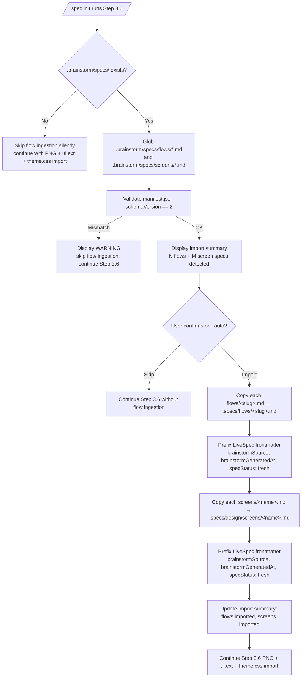
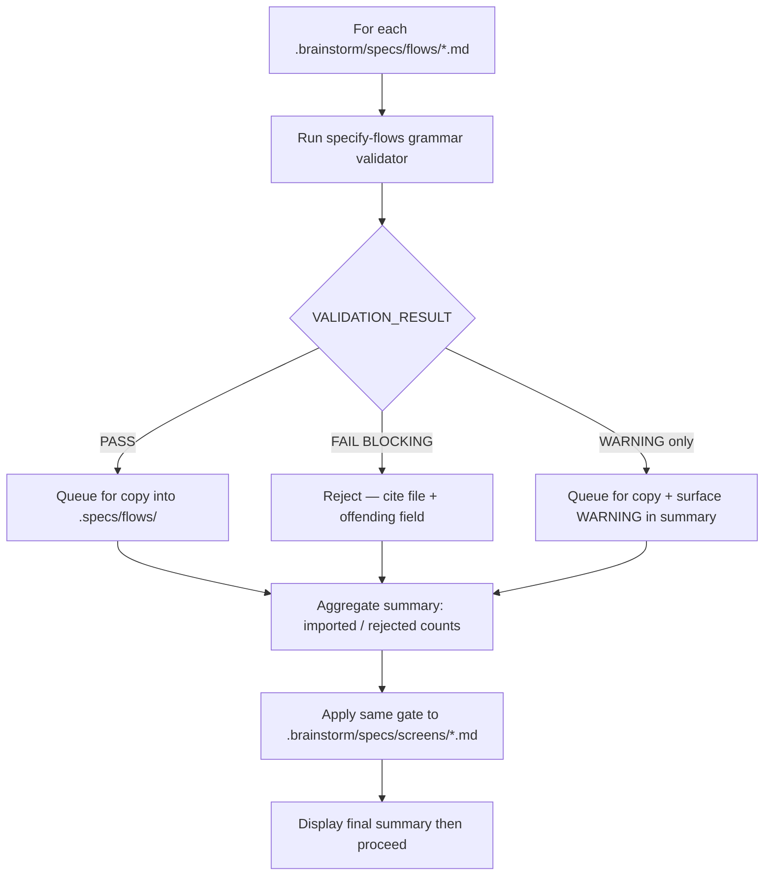

# Feature Spec: Brainstorm Flow & Screen Specs Ingestion

- **Feature:** Brainstorm Flow & Screen Specs Ingestion
- **Branch:** `feature/041-spec-init-flow-specs-ingestion`
- **Date:** 2026-05-13
- **Status:** Draft
- **Input:** Étendre `spec.init` Step 3.6 pour ingérer les artefacts `.brainstorm/specs/{flows,screens}/*.md` produits par le skill brainstorm `specify-flows` (manifest `schemaVersion: 2`). Aujourd'hui Step 3.6 importe uniquement les mockups PNG + `ui.<ext>` + `theme.css` ; toute la matière comportementale (acteurs, préconditions, règles métier, erreurs, side-effects, états UI) capturée par brainstorm est jetée. Cette feature ferme le pont en propulsant les flow/screen specs dans `.specs/`.
- **Feature Number:** 041

---

## User Scenarios & Testing

> Prioritize stories as P1 (critical — must ship), P2 (important — should ship), P3 (nice-to-have — can defer).

### Story 1 — `spec.init` détecte et ingère les flow specs brainstorm `P1`

**As a** founder qui vient de finir le pipeline brainstorm `specify-flows`,
**I want to** voir mes `flows/*.md` (et leurs `screens/*.md` associés) automatiquement détectés et importés au moment d'initialiser LiveSpec,
**so that** la matière comportementale (acteurs, préconditions, Gherkin, erreurs, états UI) ne soit pas perdue et serve de socle aux specs LiveSpec.

**Priority reason:** sans cette étape, chaque projet qui sort de brainstorm doit ré-écrire à la main les flows en spec.md — c'est le bug fonctionnel exact que cette feature corrige (Step 3.6 jette aujourd'hui ces fichiers).

**Independent test:** dans un projet vide qui contient `.brainstorm/specs/flows/booking.md` + `.brainstorm/specs/screens/web_dashboard.md` + `.brainstorm/mockups/manifest.json` (`schemaVersion: 2`), lancer `/spec.init` ; après confirmation, vérifier que `.specs/flows/booking.md` existe, commence par un frontmatter YAML LiveSpec contenant `brainstormSource: .brainstorm/specs/flows/booking.md` et `specStatus: fresh`, suivi des 8 sections grammar v1.0 préservées verbatim depuis le source ; vérifier que `.specs/design/screens/web_dashboard.md` existe avec le même contrat frontmatter LiveSpec.

#### Acceptance Scenarios (Gherkin — source of truth for tests)

```gherkin
Feature: Ingest brainstorm flow specs during spec.init Step 3.6

  Scenario: Happy path — flows + screens detected and imported
    Given a project with ".brainstorm/specs/flows/booking.md" valid against grammar v1.0
    And a project with ".brainstorm/specs/screens/web_dashboard.md" valid against grammar v1.0
    And ".brainstorm/mockups/manifest.json" exists with "schemaVersion: 2"
    When the user runs "/spec.init" and confirms the brainstorm import prompt
    Then ".specs/flows/booking.md" is created with the source 8 mandatory sections preserved verbatim in the body
    And ".specs/flows/booking.md" starts with a LiveSpec YAML frontmatter block containing "brainstormSource", "brainstormGeneratedAt", and "specStatus: fresh"
    And ".specs/design/screens/web_dashboard.md" is created alongside "web_dashboard.png" with the same LiveSpec frontmatter contract
    And the import summary lists 1 flow imported and 1 screen spec imported
    And ".specs/design/screens/index.md" contains a "Spec" column whose row for "web_dashboard" reads "fresh"

  Scenario: No brainstorm specs present
    Given a project with ".brainstorm/mockups/" but no ".brainstorm/specs/" directory
    When the user runs "/spec.init"
    Then Step 3.6 imports PNGs and source file as before
    And no ".specs/flows/" directory is created
    And no error or warning is emitted about missing flow specs
```

#### User Flow

> The Mermaid flowchart below visualizes the same flow defined in the Gherkin scenarios above.



---

### Story 2 — Validation par grammar contract avant import `P1`

**As a** mainteneur LiveSpec,
**I want to** que chaque flow/screen importé soit validé contre le grammar contract de `specify-flows` avant d'être copié dans `.specs/`,
**so that** aucune spec mal-formée (Gherkin manquant, sections absentes, status hors enum) ne contamine `.specs/`.

**Priority reason:** sans validation, un flow brainstorm modifié à la main (status non listé, frontmatter cassé) propagerait du bruit dans `.specs/flows/` et casserait les commandes downstream qui s'appuient sur la grammaire.

**Independent test:** ajouter un `.brainstorm/specs/flows/broken.md` avec un `status: foo` (hors enum brainstorm `draft|reviewed|promoted`) ; lancer `/spec.init` ; vérifier que `broken.md` n'est PAS copié dans `.specs/flows/`, qu'un `[BLOCKING]` apparaît dans le résumé, et que les flows valides sont quand même importés.

#### Acceptance Scenarios (Gherkin — source of truth for tests)

```gherkin
Feature: Grammar validation gate before flow ingestion

  Scenario: Invalid flow is skipped, valid flows still imported
    Given ".brainstorm/specs/flows/booking.md" is valid
    And ".brainstorm/specs/flows/broken.md" has frontmatter "status: foo"
    When the user runs "/spec.init" and confirms import
    Then ".specs/flows/booking.md" is created
    And ".specs/flows/broken.md" is NOT created
    And the import summary shows "1 imported, 1 rejected (BLOCKING)"
    And the rejection details cite the offending field and file path

  Scenario: All flows invalid — abort flow ingestion, keep other Step 3.6 imports
    Given every file under ".brainstorm/specs/flows/" fails grammar validation
    When the user runs "/spec.init" and confirms import
    Then no file is written to ".specs/flows/"
    And PNG + ui.ext + theme.css imports proceed normally
    And the summary states "0 flows imported (N rejected)"
```

#### User Flow

> The Mermaid flowchart below visualizes the same flow defined in the Gherkin scenarios above.



---

### Story 3 — Idempotence et collision avec un `.specs/flows/` pré-existant `P2`

**As a** utilisateur qui relance `/spec.init` sur un projet déjà initialisé partiellement,
**I want to** que l'import des flow specs soit idempotent et ne réécrase jamais silencieusement un fichier déjà présent dans `.specs/flows/`,
**so that** je ne perde pas des éditions manuelles faites côté LiveSpec.

**Priority reason:** `spec.init` peut être relancé (recovery, migration, `--from-code`) ; sans garde-fou, un re-run écraserait des flows édités manuellement par l'équipe.

**Independent test:** copier `booking.md` dans `.specs/flows/`, modifier une ligne, relancer `/spec.init` avec un `.brainstorm/specs/flows/booking.md` différent ; vérifier que l'édition manuelle est préservée et que le résumé liste `booking.md` comme `skipped (already present)`.

#### Acceptance Scenarios (Gherkin — source of truth for tests)

```gherkin
Feature: Idempotent flow ingestion on re-run

  Scenario: Existing target file is preserved
    Given ".specs/flows/booking.md" already exists with manual edits
    And ".brainstorm/specs/flows/booking.md" has different content
    When the user runs "/spec.init" and confirms import
    Then ".specs/flows/booking.md" is unchanged on disk
    And the summary lists "booking.md: skipped (already present)"
    And other not-yet-imported flows are imported normally

  Scenario: --force flag overwrites a non-manual target
    Given ".specs/flows/booking.md" already exists with frontmatter "specStatus: fresh"
    And ".brainstorm/specs/flows/booking.md" has different content
    When the user runs "/spec.init --force" and confirms import
    Then the body of ".specs/flows/booking.md" matches the brainstorm source verbatim
    And the LiveSpec frontmatter on ".specs/flows/booking.md" is rewritten with "specStatus: fresh" and refreshed "brainstormGeneratedAt"
    And the summary lists "booking.md: overwritten (--force)"

  Scenario: --force is refused on a manual target
    Given ".specs/flows/booking.md" already exists with frontmatter "specStatus: manual"
    And ".brainstorm/specs/flows/booking.md" has different content
    When the user runs "/spec.init --force" and confirms import
    Then ".specs/flows/booking.md" is unchanged on disk
    And the summary lists "booking.md: skipped (specStatus: manual — use --force-overwrite-manual)"

  Scenario: --force-overwrite-manual overrides the manual guard
    Given ".specs/flows/booking.md" already exists with frontmatter "specStatus: manual"
    When the user runs "/spec.init --force-overwrite-manual" and confirms import
    Then the body of ".specs/flows/booking.md" matches the brainstorm source verbatim
    And the summary lists "booking.md: overwritten (--force-overwrite-manual)"
```

#### User Flow

```mermaid
flowchart TD
    A[Validated flow ready to copy] --> B{Target .specs/flows/&lt;slug&gt;.md exists?}
    B -- No --> C[Copy file + prepend LiveSpec frontmatter<br/>specStatus: fresh → mark imported]
    B -- Yes --> M{Existing target frontmatter<br/>specStatus == manual?}
    M -- Yes --> N{--force-overwrite-manual<br/>flag set?}
    N -- No --> O[Skip → mark<br/>"skipped specStatus: manual"]
    N -- Yes --> P[Overwrite → mark<br/>"overwritten --force-overwrite-manual"]
    M -- No --> D{--force flag set?}
    D -- No --> E[Skip → mark "already present"]
    D -- Yes --> F[Overwrite + refresh LiveSpec frontmatter →<br/>mark "overwritten --force"]
    C --> G[Aggregate into summary]
    E --> G
    F --> G
    O --> G
    P --> G
```

---

## Acceptance Criteria

> Each AC must be specific, testable, and verifiable. Reference them from FR below.

| ID | Criterion | Priority | Story |
|---|---|---|---|
| AC-001 | When `.brainstorm/specs/flows/*.md` exists at `spec.init` time, Step 3.6 detects them and lists each file in the import summary BEFORE asking for confirmation | P1 | Story 1 |
| AC-002 | After confirmation, every valid `.brainstorm/specs/flows/<slug>.md` is written to `.specs/flows/<slug>.md` with the body preserved verbatim AND a LiveSpec YAML frontmatter prefix containing `brainstormSource`, `brainstormGeneratedAt`, `specStatus: fresh`; if the source has its own frontmatter, it is preserved as a separate YAML block below the LiveSpec one | P1 | Story 1 |
| AC-003 | When a brainstorm screen spec `.brainstorm/specs/screens/<name>.md` passes validation, `.specs/design/screens/<name>.md` is created from its content (prefixed with LiveSpec frontmatter). The matching `<name>.png` is referenced in the import summary if present in `.specs/design/screens/`, otherwise the screen spec is imported without a PNG reference and listed as 'orphan screen' in the summary. | P1 | Story 1 |
| AC-004 | Manifest `schemaVersion` is read from `.brainstorm/mockups/manifest.json`; if it is not exactly `2`, flow/screen ingestion is skipped with a single WARNING and PNG/source/theme imports continue | P1 | Story 1 |
| AC-005 | Each candidate flow file is run through the `specify-flows` grammar validator BEFORE copy; files with `[BLOCKING]` errors are not written to `.specs/flows/` | P1 | Story 2 |
| AC-006 | Validator failures are reported per file in the import summary with file path and the validator's `[BLOCKING]` message text | P1 | Story 2 |
| AC-007 | When a target file already exists in `.specs/flows/<slug>.md` (or `.specs/design/screens/<name>.md`), the default behavior is to skip and report `already present` — no overwrite | P2 | Story 3 |
| AC-008 | `--force` flag on `spec.init` causes existing targets whose `specStatus` is one of `fresh`, `stale`, or `orphaned` to be overwritten and reported as `overwritten (--force)` in the summary; `--force` alone has NO effect on `specStatus: manual` files | P2 | Story 3 |
| AC-009 | When `.brainstorm/specs/` is absent, Step 3.6 produces zero output related to flow/screen ingestion (no warning, no error, no empty `.specs/flows/` directory) | P1 | Story 1 |
| AC-010 | Final import summary reports four numeric counts: flows imported, flows rejected, screens imported, screens rejected | P2 | Story 2 |
| AC-011 | After import, reading the frontmatter of any imported `.specs/flows/<slug>.md` or `.specs/design/screens/<name>.md` yields three LiveSpec fields with valid values: `brainstormSource` equal to the source path, `brainstormGeneratedAt` equal to the manifest `specGeneratedAt`, `specStatus` equal to `fresh` | P1 | Story 1 |
| AC-012 | An existing target file whose LiveSpec frontmatter contains `specStatus: manual` is preserved unchanged by `/spec.init` and `/spec.init --force`; only `/spec.init --force-overwrite-manual` (or an equivalent explicit confirmation flag) overwrites it, and the summary reports `overwritten (--force-overwrite-manual)` | P1 | Story 3 |
| AC-013 | After screen import, `.specs/design/screens/index.md` contains a `Spec` column whose value for each imported screen matches the `specStatus` field of the corresponding `<name>.md` (or `—` if no spec file exists for that screen) | P2 | Story 1 |
| AC-014 | When `.brainstorm/specs/` exists but `.brainstorm/mockups/manifest.json` is missing, `spec.init` emits exactly one WARNING line `manifest.json missing — flow/screen ingestion skipped`, writes zero files into `.specs/flows/` or `.specs/design/screens/<name>.md`, and exits Step 3.6 non-blockingly | P1 | Story 1 |

### AC-001
**Criterion:** When `.brainstorm/specs/flows/*.md` exists at `spec.init` time, Step 3.6 detects them and lists each file in the import summary BEFORE asking for confirmation
**Priority:** P1 | **Story:** Story 1

### AC-002
**Criterion:** After confirmation, every valid `.brainstorm/specs/flows/<slug>.md` is written to `.specs/flows/<slug>.md` with the body preserved verbatim AND a LiveSpec YAML frontmatter prefix containing `brainstormSource`, `brainstormGeneratedAt`, `specStatus: fresh`; if the source has its own frontmatter, it is preserved as a separate YAML block below the LiveSpec one.
**Priority:** P1 | **Story:** Story 1

### AC-003
**Criterion:** When a brainstorm screen spec `.brainstorm/specs/screens/<name>.md` passes validation, `.specs/design/screens/<name>.md` is created from its content (prefixed with LiveSpec frontmatter). The matching `<name>.png` is referenced in the import summary if present in `.specs/design/screens/`, otherwise the screen spec is imported without a PNG reference and listed as 'orphan screen' in the summary.
**Priority:** P1 | **Story:** Story 1

### AC-004
**Criterion:** Manifest `schemaVersion` is read from `.brainstorm/mockups/manifest.json`; if it is not exactly `2`, flow/screen ingestion is skipped with a single WARNING and PNG/source/theme imports continue
**Priority:** P1 | **Story:** Story 1

### AC-005
**Criterion:** Each candidate flow file is run through the `specify-flows` grammar validator BEFORE copy; files with `[BLOCKING]` errors are not written to `.specs/flows/`
**Priority:** P1 | **Story:** Story 2

### AC-006
**Criterion:** Validator failures are reported per file in the import summary with file path and the validator's `[BLOCKING]` message text
**Priority:** P1 | **Story:** Story 2

### AC-007
**Criterion:** When a target file already exists in `.specs/flows/<slug>.md` (or `.specs/design/screens/<name>.md`), the default behavior is to skip and report `already present` — no overwrite
**Priority:** P2 | **Story:** Story 3

### AC-008
**Criterion:** `--force` flag on `spec.init` causes existing targets whose `specStatus` is one of `fresh`, `stale`, or `orphaned` to be overwritten and reported as `overwritten (--force)` in the summary; `--force` alone has NO effect on `specStatus: manual` files.
**Priority:** P2 | **Story:** Story 3

### AC-009
**Criterion:** When `.brainstorm/specs/` is absent, Step 3.6 produces zero output related to flow/screen ingestion (no warning, no error, no empty `.specs/flows/` directory)
**Priority:** P1 | **Story:** Story 1

### AC-010
**Criterion:** Final import summary reports four numeric counts: flows imported, flows rejected, screens imported, screens rejected
**Priority:** P2 | **Story:** Story 2

### AC-011
**Criterion:** After import, reading the frontmatter of any imported `.specs/flows/<slug>.md` or `.specs/design/screens/<name>.md` yields three LiveSpec fields with valid values: `brainstormSource` equal to the source path, `brainstormGeneratedAt` equal to the manifest `specGeneratedAt`, `specStatus` equal to `fresh`.
**Priority:** P1 | **Story:** Story 1

### AC-012
**Criterion:** An existing target file whose LiveSpec frontmatter contains `specStatus: manual` is preserved unchanged by `/spec.init` and `/spec.init --force`; only `/spec.init --force-overwrite-manual` (or an equivalent explicit confirmation flag) overwrites it, and the summary reports `overwritten (--force-overwrite-manual)`.
**Priority:** P1 | **Story:** Story 3

### AC-013
**Criterion:** After screen import, `.specs/design/screens/index.md` contains a `Spec` column whose value for each imported screen matches the `specStatus` field of the corresponding `<name>.md` (or `—` if no spec file exists for that screen).
**Priority:** P2 | **Story:** Story 1

### AC-014
**Criterion:** When `.brainstorm/specs/` exists but `.brainstorm/mockups/manifest.json` is missing, `spec.init` emits exactly one WARNING line `manifest.json missing — flow/screen ingestion skipped`, writes zero files into `.specs/flows/` or `.specs/design/screens/<name>.md`, and exits Step 3.6 non-blockingly.
**Priority:** P1 | **Story:** Story 1

---

## Functional Requirements

> Each FR must map to at least one AC. These become the rows in implementation.md.

| ID | Requirement | AC References |
|---|---|---|
| FR-001 | `spec.init` Step 3.6 must glob `.brainstorm/specs/flows/*.md` and `.brainstorm/specs/screens/*.md` during its detection phase, in addition to the existing PNG/source/theme detection | AC-001, AC-009 |
| FR-002 | `spec.init` must read `.brainstorm/mockups/manifest.json` and verify its `schemaVersion` field equals `2` before proceeding with flow/screen ingestion; any other value (including missing key) skips ingestion with a single WARNING line | AC-004 |
| FR-003 | Only files returning `VALIDATION_RESULT: PASS` or `VALIDATION_RESULT: WARNING` from the specify-flows grammar v1.0 validator are eligible for copy into `.specs/`. Files returning `VALIDATION_RESULT: FAIL` are rejected and listed in the import summary under `rejected_flows` or `rejected_screens` with the failure reason. | AC-005 |
| FR-004 | `spec.init` must copy each eligible flow file from `.brainstorm/specs/flows/<slug>.md` to `.specs/flows/<slug>.md` preserving the body verbatim, AND must prefix the target file with a LiveSpec YAML frontmatter block containing `brainstormSource`, `brainstormGeneratedAt`, and `specStatus: fresh`. If the brainstorm source file itself starts with its own YAML frontmatter, the LiveSpec frontmatter is prepended above it as a SEPARATE YAML block — the source frontmatter is preserved unchanged (no field merge, no overwrite) | AC-002, AC-011 |
| FR-005 | `spec.init` must copy each eligible screen file from `.brainstorm/specs/screens/<name>.md` to `.specs/design/screens/<name>.md` preserving the body verbatim, AND must prefix the target file with the same LiveSpec YAML frontmatter contract defined in FR-004 (`brainstormSource`, `brainstormGeneratedAt`, `specStatus: fresh`); source frontmatter is preserved unchanged | AC-003, AC-011 |
| FR-006 | `spec.init` must NOT overwrite an existing file under `.specs/flows/` or `.specs/design/screens/<name>.md` unless the `--force` flag is set; default behavior is to skip and label the entry `already present` in the summary. `--force` alone NEVER overwrites a file whose LiveSpec frontmatter declares `specStatus: manual`; overwriting a `manual` file requires the additional explicit flag `--force-overwrite-manual` | AC-007, AC-008, AC-012 |
| FR-007 | `spec.init` must include in the brainstorm import summary an aggregate report with four counts (flows imported, flows rejected, screens imported, screens rejected) plus a per-file detail line for every rejection citing the validator message | AC-006, AC-010 |
| FR-008 | When `.brainstorm/specs/` directory does not exist, `spec.init` must produce no output, no warning, and no empty target directory related to flow/screen ingestion — only existing PNG/source/theme behavior runs | AC-009 |
| FR-009 | `spec.init` must define and apply the LiveSpec `specStatus` enum with exactly four values, orthogonal to the brainstorm grammar `status` (draft\|reviewed\|promoted): `fresh` (just imported, content identical to source), `stale` (brainstorm source has evolved since import — detected by `brainstormGeneratedAt` mismatch), `orphaned` (brainstorm source has disappeared), `manual` (edited by a human on the LiveSpec side; treated as protected — do not touch without explicit confirmation). At import time, every imported file is set to `specStatus: fresh` | AC-011, AC-012 |
| FR-010 | After importing screen specs, `spec.init` must update `.specs/design/screens/index.md` by adding (or ensuring presence of) a `Spec` column whose value for each row is the current `specStatus` of the matching `<name>.md` (or `—` if no spec file exists); rows for newly imported screens are appended in alphabetical order if absent | AC-013 |
| FR-011 | `spec.init` must read the manifest field that records the brainstorm spec generation timestamp (`specGeneratedAt` in `.brainstorm/mockups/manifest.json` under `schemaVersion: 2`) and propagate it verbatim into the LiveSpec frontmatter field `brainstormGeneratedAt` for every imported flow and screen file | AC-011 |
| FR-012 | When `.brainstorm/specs/` exists but `.brainstorm/mockups/manifest.json` is absent, `spec.init` must emit a single WARNING line (`manifest.json missing — flow/screen ingestion skipped`), perform zero copies into `.specs/flows/` or `.specs/design/screens/<name>.md`, and exit Step 3.6 non-blockingly (exit code 0) | AC-014 |

### FR-001
**Requirement:** `spec.init` Step 3.6 must glob `.brainstorm/specs/flows/*.md` and `.brainstorm/specs/screens/*.md` during its detection phase, in addition to the existing PNG/source/theme detection
**AC References:** [AC-001](#ac-001), [AC-009](#ac-009)

### FR-002
**Requirement:** `spec.init` must read `.brainstorm/mockups/manifest.json` and verify its `schemaVersion` field equals `2` before proceeding with flow/screen ingestion; any other value (including missing key) skips ingestion with a single WARNING line
**AC References:** [AC-004](#ac-004)

### FR-003
**Requirement:** Only files returning `VALIDATION_RESULT: PASS` or `VALIDATION_RESULT: WARNING` from the specify-flows grammar v1.0 validator are eligible for copy into `.specs/`. Files returning `VALIDATION_RESULT: FAIL` are rejected and listed in the import summary under `rejected_flows` or `rejected_screens` with the failure reason. The validator is invoked on every candidate flow and screen file BEFORE copying it.
**AC References:** [AC-005](#ac-005)

### FR-004
**Requirement:** `spec.init` must copy each eligible flow file from `.brainstorm/specs/flows/<slug>.md` to `.specs/flows/<slug>.md` preserving the body verbatim, AND must prefix the target file with a LiveSpec YAML frontmatter block containing `brainstormSource`, `brainstormGeneratedAt`, and `specStatus: fresh`. If the brainstorm source file itself starts with its own YAML frontmatter, the LiveSpec frontmatter is prepended above it as a SEPARATE YAML block — the source frontmatter is preserved unchanged (no field merge, no overwrite).
**AC References:** [AC-002](#ac-002), [AC-011](#ac-011)

### FR-005
**Requirement:** `spec.init` must copy each eligible screen file from `.brainstorm/specs/screens/<name>.md` to `.specs/design/screens/<name>.md` preserving the body verbatim, AND must prefix the target file with the same LiveSpec YAML frontmatter contract defined in FR-004 (`brainstormSource`, `brainstormGeneratedAt`, `specStatus: fresh`); source frontmatter is preserved unchanged.
**AC References:** [AC-003](#ac-003), [AC-011](#ac-011)

### FR-006
**Requirement:** `spec.init` must NOT overwrite an existing file under `.specs/flows/` or `.specs/design/screens/<name>.md` unless the `--force` flag is set; default behavior is to skip and label the entry `already present` in the summary. `--force` alone NEVER overwrites a file whose LiveSpec frontmatter declares `specStatus: manual`; overwriting a `manual` file requires the additional explicit flag `--force-overwrite-manual`.
**AC References:** [AC-007](#ac-007), [AC-008](#ac-008), [AC-012](#ac-012)

### FR-007
**Requirement:** `spec.init` must include in the brainstorm import summary an aggregate report with four counts (flows imported, flows rejected, screens imported, screens rejected) plus a per-file detail line for every rejection citing the validator message
**AC References:** [AC-006](#ac-006), [AC-010](#ac-010)

### FR-008
**Requirement:** When `.brainstorm/specs/` directory does not exist, `spec.init` must produce no output, no warning, and no empty target directory related to flow/screen ingestion — only existing PNG/source/theme behavior runs
**AC References:** [AC-009](#ac-009)

### FR-009
**Requirement:** `spec.init` must define and apply the LiveSpec `specStatus` enum with exactly four values, orthogonal to the brainstorm grammar `status` (draft|reviewed|promoted): `fresh` (just imported, content identical to source), `stale` (brainstorm source has evolved since import — detected by `brainstormGeneratedAt` mismatch), `orphaned` (brainstorm source has disappeared), `manual` (edited by a human on the LiveSpec side; treated as protected — do not touch without explicit confirmation). At import time, every imported file is set to `specStatus: fresh`.
**AC References:** [AC-011](#ac-011), [AC-012](#ac-012)

### FR-010
**Requirement:** After importing screen specs, `spec.init` must update `.specs/design/screens/index.md` by adding (or ensuring presence of) a `Spec` column whose value for each row is the current `specStatus` of the matching `<name>.md` (or `—` if no spec file exists); rows for newly imported screens are appended in alphabetical order if absent.
**AC References:** [AC-013](#ac-013)

### FR-011
**Requirement:** `spec.init` must read the manifest field that records the brainstorm spec generation timestamp (`specGeneratedAt` in `.brainstorm/mockups/manifest.json` under `schemaVersion: 2`) and propagate it verbatim into the LiveSpec frontmatter field `brainstormGeneratedAt` for every imported flow and screen file.
**AC References:** [AC-011](#ac-011)

### FR-012
**Requirement:** When `.brainstorm/specs/` exists but `.brainstorm/mockups/manifest.json` is absent, `spec.init` must emit a single WARNING line (`manifest.json missing — flow/screen ingestion skipped`), perform zero copies into `.specs/flows/` or `.specs/design/screens/<name>.md`, and exit Step 3.6 non-blockingly (exit code 0).
**AC References:** [AC-014](#ac-014)

---

## Key Entities

| Entity | Description | Key Fields |
|---|---|---|
| FlowSpec | A behavioral spec produced by brainstorm `specify-flows` describing one canonical user flow (frontmatter + 8 mandatory sections). Once imported into LiveSpec, the file gains a LiveSpec frontmatter block prefixed above the source frontmatter | source frontmatter: flow (slug), title, status (brainstorm grammar: draft\|reviewed\|promoted), priority, mockups[], surfaces[], source[], generated_at — LiveSpec frontmatter (added at import): brainstormSource, brainstormGeneratedAt, specStatus |
| ScreenSpec | A per-screen behavioral spec describing actor, displayed data, actions, validations, UI states, errors, side effects. Same LiveSpec frontmatter prefix as FlowSpec upon import | source: screen, mockup, flow, sourceNodeId, sourceFile, generated_at — LiveSpec (added): brainstormSource, brainstormGeneratedAt, specStatus |
| LiveSpecFrontmatter | The YAML frontmatter block prepended by `spec.init` to every imported flow / screen file. Records origin and lifecycle. Orthogonal to the brainstorm grammar `status` field | `brainstormSource: <relative path to source file>`, `brainstormGeneratedAt: <ISO timestamp from manifest specGeneratedAt>`, `specStatus: <fresh \| stale \| orphaned \| manual>` |
| specStatus (enum) | LiveSpec lifecycle status for an imported flow / screen file. Exactly 4 values, mutually exclusive | `fresh` = just imported, body identical to source · `stale` = source has evolved since import (brainstormGeneratedAt mismatch) · `orphaned` = source has disappeared from `.brainstorm/specs/` · `manual` = human-edited on the LiveSpec side, protected from any overwrite without `--force-overwrite-manual` |
| BrainstormManifest | The `.brainstorm/mockups/manifest.json` file declaring the brainstorm export schema | schemaVersion (must equal `2`), specGeneratedAt (ISO timestamp consumed as `brainstormGeneratedAt`), exports[] |
| ImportSummaryEntry | One line in the post-import summary describing the fate of a single file | path, kind (flow / screen), outcome (`imported` / `rejected` / `already present` / `overwritten (--force)` / `skipped (specStatus: manual)` / `overwritten (--force-overwrite-manual)`), message |
| FeatureFlowLink | Relation N-to-N between flows and LiveSpec features. NOT created by this feature, but materialized in a downstream consumer: a LiveSpec feature spec (`.specs/features/<feature>/spec.md`) may reference one or more imported flows via a frontmatter array field `flows: [<slug1>, <slug2>]`. A single flow can be referenced by multiple features; a single feature can reference multiple flows. This feature only guarantees that imported flows live at stable paths (`.specs/flows/<slug>.md`) so that future `/spec.specify` invocations can wire the `flows: [...]` field | Consumer-side: `flows: [<slug>]` array in feature spec frontmatter |
| ScreenIndexRow | One row in `.specs/design/screens/index.md`, augmented by this feature with a `Spec` column | screen name, first added, last modified, source, Spec (= matching `<name>.md` specStatus, or `—` if no spec) |
| VALIDATION_RESULT (enum) | Outcome of the specify-flows grammar v1.0 validator on a single brainstorm flow or screen file. Drives copy eligibility per FR-003 | `PASS` (toutes sections mandatory présentes et bien formées) · `WARNING` (sections mandatory présentes et parseables, mais déviations non-fatales détectées : section optionnelle absente, référence cross-file malformée mais résolvable, frontmatter non-standard mais valide YAML) · `FAIL` (au moins une section mandatory absente ou non parseable) |

---

## Edge Cases

- **Manifest absent:** `.brainstorm/specs/` exists but `.brainstorm/mockups/manifest.json` is missing — emit exactly one WARNING `manifest.json missing — flow/screen ingestion skipped`, perform zero copies into `.specs/flows/` or `.specs/design/screens/<name>.md`, continue Step 3.6 with PNG/source/theme import; exit code 0 (covered by AC-014).
- **ScreenSpec references an unknown flow:** A screen spec frontmatter `flow: <slug>` points to a slug that has no matching `.brainstorm/specs/flows/<slug>.md` (or matched file was rejected by the validator). Emit a WARNING line in the import summary (`<name>.md: imported (orphan flow reference: <slug>)`), import the screen anyway, do not block; the `specStatus` of the screen file is still `fresh` since the screen body itself is valid.
- **schemaVersion downgrade (`1` or anything ≠ `2`):** Skip flow ingestion with WARNING `manifest schemaVersion is X, expected 2 — flow ingestion skipped`. PNG/source/theme imports proceed normally.
- **Flow file references a mockup PNG that was not imported:** The flow is still imported (validation is grammar-only, not cross-reference); cross-reference checking is out of scope for this feature.
- **Screen spec has no matching PNG in `.brainstorm/mockups/`:** Screen spec is imported anyway; the orphan is reported as INFO `<name>.md: imported (no matching PNG)` — does not block.
- **Flow slug collides with an unrelated existing file in `.specs/flows/`:** Treated identically to AC-007 — skip + `already present`. The user must remove the existing file or use `--force` to allow overwrite.
- **Empty `.brainstorm/specs/flows/` directory (folder exists, no `.md` inside):** No detection output, no summary line about flows; treated like AC-009.
- **Validator binary unavailable on the host:** `spec.init` aborts flow ingestion with a single BLOCKED line citing the missing tool, and continues PNG/source/theme imports. No partial copy.

---

## Success Criteria

| ID | Criterion | How to Measure |
|---|---|---|
| SC-001 | Zero behavioral data loss on a brainstorm → LiveSpec handoff | After `/spec.init` on a fixture project, each imported file in `.specs/flows/<slug>.md` and `.specs/design/screens/<name>.md` contains a LiveSpec YAML frontmatter block with `brainstormSource`, `brainstormGeneratedAt` and `specStatus`, followed by the original brainstorm body preserved verbatim |
| SC-002 | Backward compatibility | A project without `.brainstorm/specs/` shows identical Step 3.6 output before and after this feature (golden snapshot test) |
| SC-003 | Validator gate is effective | A purpose-built fixture with one valid + one invalid flow produces exactly 1 file in `.specs/flows/` and 1 line `rejected` in the summary |
| SC-004 | Idempotence | Running `/spec.init` twice in a row on the same project yields zero writes on the second run (default mode) and the summary lists every flow as `already present` |
