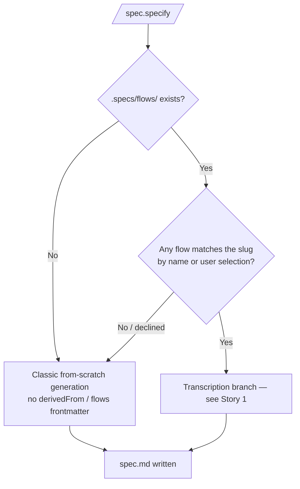
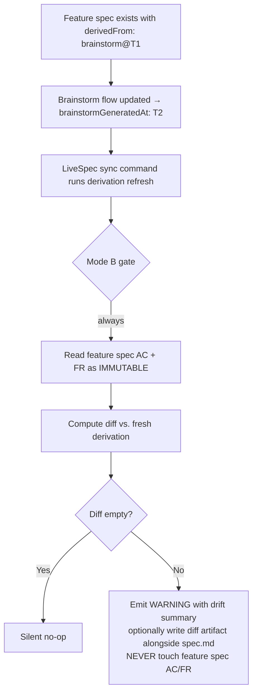

# Feature Spec: `/spec.specify` Derives from Imported Brainstorm Flows

- **Feature:** `/spec.specify` Derives from Imported Brainstorm Flows
- **Branch:** `feature/042-spec-specify-from-brainstorm`
- **Date:** 2026-05-13
- **Status:** Draft
- **Input:** Modifier `/spec.specify` pour transcrire la matière comportementale d'un flow brainstorm déjà importé (`.specs/flows/<slug>.md`, produit par Feature 041) au lieu de tout regénérer. Objectif chiffré : 80% de la spec comportementale déjà complète, plus de re-saisie manuelle. Si aucun flow ne correspond, le comportement classique de `/spec.specify` reste inchangé. Une fois dérivés, AC et FR deviennent propriété LiveSpec (Mode B verrouillé) — un re-pull brainstorm ultérieur ne peut JAMAIS les écraser.
- **Feature Number:** 042
- **Depends on:** Feature 041 (Brainstorm Flow & Screen Specs Ingestion) — fournit `.specs/flows/<slug>.md` + frontmatter LiveSpec (`brainstormSource`, `brainstormGeneratedAt`, `specStatus`)

---

## User Scenarios & Testing

> Prioritize stories as P1 (critical — must ship), P2 (important — should ship), P3 (nice-to-have — can defer).

### Story 1 — Dérivation automatique quand un flow brainstorm match `P1`

**As a** développeur lançant `/spec.specify` sur une feature LiveSpec dont le flow comportemental a déjà été capturé par brainstorm,
**I want to** voir Mermaid + AC + FR dérivés du flow brainstorm correspondant au lieu d'être regénérés depuis zéro,
**so that** ~80 % de la spec comportementale soit déjà complète, sans re-saisie manuelle, et cohérente avec la source brainstorm.

**Priority reason:** c'est l'objectif chiffré du brief brainstorm (80 % gagné). Sans cette dérivation, Feature 041 importe des flows que personne ne consomme — le pont est ouvert mais reste à sens unique.

**Independent test:** dans un projet où `.specs/flows/booking.md` a été importé par Feature 041 (frontmatter LiveSpec présent, `specStatus: fresh`, `brainstormGeneratedAt: 2026-05-10T08:30:00Z`), lancer `/spec.specify booking` ; après confirmation du match, vérifier que `.specs/features/NNN-booking/spec.md` :
1. commence par un frontmatter YAML LiveSpec contenant `derivedFrom: brainstorm@2026-05-10T08:30:00Z` et `flows: [booking]`
2. contient un Mermaid flowchart dérivé des steps du flow
3. contient des AC dérivés des `règles métier` + `erreurs` du flow
4. contient des FR dérivés des `préconditions` + `side-effects` + `états UI` du flow

#### Acceptance Scenarios (Gherkin — source of truth for tests)

```gherkin
Feature: /spec.specify derives spec from a matching imported brainstorm flow

  Scenario: Slug match — transcription branch is taken
    Given ".specs/flows/booking.md" exists with frontmatter "specStatus: fresh" and "brainstormGeneratedAt: 2026-05-10T08:30:00Z"
    And the user runs "/spec.specify booking"
    When the user confirms the proposed match
    Then ".specs/features/NNN-booking/spec.md" is created
    And its frontmatter contains "derivedFrom: brainstorm@2026-05-10T08:30:00Z"
    And its frontmatter contains "flows: [booking]"
    And its "## User Scenarios & Testing" section contains a Mermaid flowchart whose nodes are derived from the brainstorm flow steps
    And its "## Acceptance Criteria" section contains AC entries derived from the brainstorm flow "règles métier" and "erreurs" subsections
    And its "## Functional Requirements" section contains FR entries derived from the brainstorm flow "préconditions", "side-effects" and "états UI" subsections
    And no AC or FR is generated from scratch by the LLM in transcription mode

  Scenario: Multiple flows consumed by a single feature
    Given ".specs/flows/booking.md" and ".specs/flows/payment.md" both exist
    And the user runs "/spec.specify checkout" and selects both flows when prompted
    When the user confirms
    Then the feature spec frontmatter contains "flows: [booking, payment]"
    And for non-contradicting flows, AC are unionized; deduplication only applies to AC that are textually equivalent up to whitespace; no structural suffixing of AC IDs is performed
    And if any contradiction is detected across the consumed flows, the command exits with a CONFLICT REPORT per FR-015 and writes nothing
    And the "derivedFrom" field captures the most recent "brainstormGeneratedAt" timestamp among consumed flows
```

#### User Flow

> The Mermaid flowchart below visualizes the same flow defined in the Gherkin scenarios above.

```mermaid
flowchart TD
    A[/spec.specify <slug>/] --> B{".specs/flows/" contient<br/>un flow qui matche le slug<br/>ou un autre flow sélectionnable ?"}
    B -- No match --> CLASSIC[Branche classique :<br/>génération from-scratch via LLM<br/>comportement actuel inchangé]
    B -- Match candidat --> P[Présenter les flows candidats à l'utilisateur<br/>slug + title + brainstormGeneratedAt]
    P --> Q{User confirme<br/>un ou plusieurs flows ?}
    Q -- Non / annule --> CLASSIC
    Q -- Oui --> T1[Lire chaque flow sélectionné<br/>parser frontmatter + 8 sections grammar v1.0]
    T1 --> T2[Dériver Mermaid flowchart<br/>depuis steps du flow]
    T2 --> T3[Dériver AC<br/>depuis règles métier + erreurs]
    T3 --> T4[Dériver FR<br/>depuis préconditions + side-effects + états UI]
    T4 --> T5[Écrire spec.md avec frontmatter LiveSpec :<br/>derivedFrom: brainstorm@<max brainstormGeneratedAt><br/>flows: [<slug>, ...]]
    T5 --> DONE[Spec créée — Mode B verrouillé<br/>AC/FR propriété LiveSpec]
    CLASSIC --> DONE2[Spec créée — pas de frontmatter derivedFrom/flows]
```

---

### Story 2 — Fallback génération classique quand aucun flow ne matche `P1`

**As a** développeur lançant `/spec.specify` sur une feature qui n'a pas de flow brainstorm correspondant (projet sans brainstorm, ou feature ad-hoc, ou flow non importé),
**I want to** que `/spec.specify` continue à fonctionner exactement comme avant (génération from-scratch depuis user stories + fichiers brainstorm top-level si présents),
**so that** la nouvelle dérivation ne casse aucun usage existant et reste opt-in implicite (déclenchée uniquement par la présence d'un flow match).

**Priority reason:** régression silencieuse interdite ; tout projet sans `.specs/flows/` doit voir `/spec.specify` se comporter à l'identique d'avant.

**Independent test:** dans un projet vide sans `.specs/flows/`, lancer `/spec.specify nouvelle-feature` ; vérifier que le résultat est identique à l'output avant la feature 042 (golden snapshot test). Le frontmatter `derivedFrom` et `flows` ne doit PAS être présent dans `spec.md` ; aucune erreur, aucun warning.

#### Acceptance Scenarios (Gherkin — source of truth for tests)

```gherkin
Feature: /spec.specify falls back to classic generation when no flow matches

  Scenario: No .specs/flows/ directory
    Given the project has no ".specs/flows/" directory
    When the user runs "/spec.specify new-feature"
    Then ".specs/features/NNN-new-feature/spec.md" is created via the classic from-scratch generation
    And the feature spec frontmatter does NOT contain "derivedFrom"
    And the feature spec frontmatter does NOT contain "flows"
    And no warning or error related to brainstorm flow ingestion is emitted

  Scenario: .specs/flows/ exists but no flow matches and user does not select one
    Given ".specs/flows/booking.md" exists
    And the user runs "/spec.specify checkout"
    And the proposed match list is empty (no slug similarity) OR the user declines all proposed flows
    When generation proceeds
    Then ".specs/features/NNN-checkout/spec.md" is created via classic from-scratch generation
    And the feature spec frontmatter does NOT contain "derivedFrom" or "flows"
    And the summary states "no flow matched — classic generation used"
```

#### User Flow



---

### Story 3 — Mode B verrouillé : AC/FR jamais écrasés par re-pull `P1`

**As a** mainteneur LiveSpec,
**I want to** garantir qu'une fois AC et FR dérivés d'un flow brainstorm et inscrits dans une feature spec, aucun re-pull brainstorm ultérieur (future Feature 043 `/spec.sync-brainstorm`) ne puisse les écraser silencieusement,
**so that** la feature spec LiveSpec reste la source de vérité après la dérivation initiale, conformément au contrat Mode B.

**Priority reason:** la promesse Mode B est contractuelle. Si un re-pull brainstorm pouvait écraser AC/FR, toute édition humaine côté LiveSpec serait perdue silencieusement — le pont brainstorm deviendrait un mécanisme dangereux. Cette story verrouille la propriété AC/FR au moment de la dérivation.

**Independent test:** créer une feature spec avec `derivedFrom: brainstorm@2026-05-10T08:30:00Z` ; éditer manuellement une AC ; simuler un re-pull (modifier `.specs/flows/booking.md` puis relancer la dérivation via un outil de sync hypothétique respectant le contrat) ; vérifier que les AC/FR de la feature spec sont inchangées et qu'un mécanisme de diff/warning est exposé sans réécriture.

#### Acceptance Scenarios (Gherkin — source of truth for tests)

```gherkin
Feature: Mode B locking — AC/FR are LiveSpec property after initial derivation

  Scenario: Re-pull never overwrites AC or FR
    Given ".specs/features/NNN-booking/spec.md" exists with "derivedFrom: brainstorm@2026-05-10T08:30:00Z"
    And the user has manually edited AC-002 inside that spec
    And ".specs/flows/booking.md" has been updated by a brainstorm re-pull (new brainstormGeneratedAt)
    When any LiveSpec command performs a derivation refresh on the feature
    Then no AC or FR line in ".specs/features/NNN-booking/spec.md" is overwritten
    And the command emits a non-blocking WARNING citing the drift (e.g. "flow booking has drifted from derivedFrom timestamp")
    And the command optionally produces a side-by-side diff artifact, but never modifies the feature spec in place

  Scenario: Initial derivation is the only write moment
    Given a fresh feature spec is being created via "/spec.specify booking"
    When derivation runs for the first time
    Then AC and FR are written exactly once
    And the feature spec is closed for further automated AC/FR writes until the user explicitly re-runs "/spec.specify --redrive" (Out of scope for Feature 042. `--redrive` is not implemented by this feature; introducing a write-side mechanism would weaken Mode B and requires a separate feature with explicit user opt-in.)
```

#### User Flow



---

## Acceptance Criteria

> Each AC must be specific, testable, and verifiable. Reference them from FR below.

| ID | Criterion | Priority | Story |
|---|---|---|---|
| AC-001 | When `/spec.specify <slug>` is invoked and `.specs/flows/<slug>.md` exists (exact match), the command enters transcription mode without prompting. When `.specs/flows/<slug>.md` does not exist but exactly one file in `.specs/flows/` substring-matches `<slug>`, the command prompts for confirmation per AC-013. When zero or multiple substring matches exist, the command falls back to classical generation | P1 | Story 1 |
| AC-013 | When `/spec.specify` finds zero exact slug match but exactly one substring match in `.specs/flows/`, the command MUST prompt the user with the matched flow slug and require explicit confirmation (`yes/no`) before entering transcription mode. A `no` (or no response) routes to the classical generation fallback. There is no auto-acceptance of substring matches | P1 | Story 1 |
| AC-002 | On confirmation, the feature spec at `.specs/features/<NNN-slug>/spec.md` is prefixed with a LiveSpec YAML frontmatter block containing `derivedFrom: brainstorm@<ISO timestamp>` whose value equals the `brainstormGeneratedAt` of the consumed flow (or the most recent `brainstormGeneratedAt` if several flows are consumed) | P1 | Story 1 |
| AC-003 | The feature spec frontmatter also contains a `flows: [<slug1>, <slug2>, ...]` array listing every flow consumed by the derivation (1 entry minimum when transcription happens; multiple entries when several flows are merged) | P1 | Story 1 |
| AC-004 | The Mermaid flowchart inside `## User Scenarios & Testing` of the derived feature spec is built from the steps of the consumed flow(s) — nodes and edges correspond to the flow body, not to LLM-generated content | P1 | Story 1 |
| AC-005 | Acceptance Criteria in the derived feature spec are derived from the `règles métier` and `erreurs` subsections of the consumed flow(s); no AC is invented by the LLM in transcription mode | P1 | Story 1 |
| AC-006 | Functional Requirements in the derived feature spec are derived from the `préconditions`, `side-effects` and `états UI` subsections of the consumed flow(s); no FR is invented by the LLM in transcription mode | P1 | Story 1 |
| AC-007 | When no `.specs/flows/` directory exists, OR no flow matches the slug, OR the user declines every proposed match, the command falls back to the classic from-scratch generation and the resulting feature spec has neither `derivedFrom` nor `flows` in its frontmatter | P1 | Story 2 |
| AC-008 | In transcription mode (flow matched), the generated feature `spec.md` Mermaid block, AC table rows, and FR table rows are byte-equivalent (modulo whitespace normalization) to the deterministic transformation of the source flow content. Summary lines and frontmatter are excluded from this byte-equivalence check | P1 | Story 2 |
| AC-009 | After initial derivation, any subsequent automated derivation refresh (e.g. via future `/spec.sync-brainstorm`) is forbidden from modifying any AC or FR line in the existing feature spec — Mode B lock | P1 | Story 3 |
| AC-010 | A derivation refresh that detects drift (consumed flow `brainstormGeneratedAt` newer than the feature spec `derivedFrom` value) emits exactly one non-blocking WARNING line citing the drifted slug, and exits with code 0; it never edits the feature spec | P1 | Story 3 |
| AC-011 | When several flows are consumed in a single derivation, the resulting feature spec `derivedFrom` records the MAX `brainstormGeneratedAt` among the consumed flows, and `flows: [...]` lists them in alphabetical order | P2 | Story 1 |
| AC-012 | If any consumed flow has `specStatus` equal to `stale`, `orphaned`, or `manual` at derivation time, the command emits exactly one non-blocking WARNING per flow citing the status, then proceeds with derivation using the flow content currently on disk (read-only consumption — never modifies the flow file) | P2 | Story 1 |

### AC-001
**Criterion:** When `/spec.specify <slug>` is invoked and `.specs/flows/<slug>.md` exists (exact match), the command enters transcription mode without prompting. When `.specs/flows/<slug>.md` does not exist but exactly one file in `.specs/flows/` substring-matches `<slug>`, the command prompts for confirmation per AC-013. When zero or multiple substring matches exist, the command falls back to classical generation.
**Priority:** P1 | **Story:** Story 1

### AC-013
**Criterion:** When `/spec.specify` finds zero exact slug match but exactly one substring match in `.specs/flows/`, the command MUST prompt the user with the matched flow slug and require explicit confirmation (`yes/no`) before entering transcription mode. A `no` (or no response) routes to the classical generation fallback. There is no auto-acceptance of substring matches.
**Priority:** P1 | **Story:** Story 1

### AC-002
**Criterion:** On confirmation, the feature spec at `.specs/features/<NNN-slug>/spec.md` is prefixed with a LiveSpec YAML frontmatter block containing `derivedFrom: brainstorm@<ISO timestamp>` whose value equals the `brainstormGeneratedAt` of the consumed flow (or the most recent `brainstormGeneratedAt` if several flows are consumed).
**Priority:** P1 | **Story:** Story 1

### AC-003
**Criterion:** The feature spec frontmatter also contains a `flows: [<slug1>, <slug2>, ...]` array listing every flow consumed by the derivation (1 entry minimum when transcription happens; multiple entries when several flows are merged).
**Priority:** P1 | **Story:** Story 1

### AC-004
**Criterion:** The Mermaid flowchart inside `## User Scenarios & Testing` of the derived feature spec is built from the steps of the consumed flow(s) — nodes and edges correspond to the flow body, not to LLM-generated content.
**Priority:** P1 | **Story:** Story 1

### AC-005
**Criterion:** Acceptance Criteria in the derived feature spec are derived from the `règles métier` and `erreurs` subsections of the consumed flow(s); no AC is invented by the LLM in transcription mode.
**Priority:** P1 | **Story:** Story 1

### AC-006
**Criterion:** Functional Requirements in the derived feature spec are derived from the `préconditions`, `side-effects` and `états UI` subsections of the consumed flow(s); no FR is invented by the LLM in transcription mode.
**Priority:** P1 | **Story:** Story 1

### AC-007
**Criterion:** When no `.specs/flows/` directory exists, OR no flow matches the slug, OR the user declines every proposed match, the command falls back to the classic from-scratch generation and the resulting feature spec has neither `derivedFrom` nor `flows` in its frontmatter.
**Priority:** P1 | **Story:** Story 2

### AC-008
**Criterion:** In transcription mode (flow matched), the generated feature `spec.md` Mermaid block, AC table rows, and FR table rows are byte-equivalent (modulo whitespace normalization) to the deterministic transformation of the source flow content. Summary lines and frontmatter are excluded from this byte-equivalence check.
**Priority:** P1 | **Story:** Story 2

### AC-009
**Criterion:** After initial derivation, any subsequent automated derivation refresh (e.g. via future `/spec.sync-brainstorm`) is forbidden from modifying any AC or FR line in the existing feature spec — Mode B lock.
**Priority:** P1 | **Story:** Story 3

### AC-010
**Criterion:** A derivation refresh that detects drift (consumed flow `brainstormGeneratedAt` newer than the feature spec `derivedFrom` value) emits exactly one non-blocking WARNING line citing the drifted slug, and exits with code 0; it never edits the feature spec.
**Priority:** P1 | **Story:** Story 3

### AC-011
**Criterion:** When several flows are consumed in a single derivation, the resulting feature spec `derivedFrom` records the MAX `brainstormGeneratedAt` among the consumed flows, and `flows: [...]` lists them in alphabetical order.
**Priority:** P2 | **Story:** Story 1

### AC-012
**Criterion:** If any consumed flow has `specStatus` equal to `stale`, `orphaned`, or `manual` at derivation time, the command emits exactly one non-blocking WARNING per flow citing the status, then proceeds with derivation using the flow content currently on disk (read-only consumption — never modifies the flow file).
**Priority:** P2 | **Story:** Story 1

---

## Functional Requirements

> Each FR must map to at least one AC. These become the rows in implementation.md.

| ID | Requirement | AC References |
|---|---|---|
| FR-001 | `/spec.specify` must, before generating any spec body, scan `.specs/flows/*.md` and propose to the user every flow whose `flow:` slug matches the requested feature slug (exact or substring); the user must confirm or decline before any spec is written | AC-001, AC-007 |
| FR-002 | `/spec.specify` must support multi-flow selection: the user may pick zero, one, or several flows from the proposed list; selecting zero triggers the classic-fallback branch | AC-007, AC-011 |
| FR-003 | When at least one flow is selected, `/spec.specify` must prefix the generated feature spec with a LiveSpec YAML frontmatter block whose mandatory keys are `derivedFrom: brainstorm@<ISO timestamp>` and `flows: [<slug>, ...]` | AC-002, AC-003 |
| FR-004 | `derivedFrom` must take the value of the consumed flow's `brainstormGeneratedAt` (single flow), or the maximum `brainstormGeneratedAt` across all consumed flows (multi-flow merge) | AC-002, AC-011 |
| FR-005 | The Mermaid flowchart of every user story in the derived feature spec must be produced by transcription from the consumed flow's body sections (steps / scenarios), NOT by LLM generation in transcription mode | AC-004 |
| FR-006 | The `## Acceptance Criteria` section of the derived feature spec must be produced by transcription from the consumed flow's `règles métier` and `erreurs` subsections, one AC per business rule and one AC per documented error path; no AC is invented | AC-005 |
| FR-007 | The `## Functional Requirements` section of the derived feature spec must be produced by transcription from the consumed flow's `préconditions` (one FR per precondition), `side-effects` (one FR per side-effect), and `états UI` (one FR per UI state); no FR is invented | AC-006 |
| FR-008 | When no flow is selected (no match, user decline, or empty `.specs/flows/`), `/spec.specify` must execute the classic from-scratch generation unchanged; the resulting feature spec must not contain `derivedFrom` or `flows` in its frontmatter | AC-007, AC-008 |
| FR-009 | Once written, the AC and FR sections of a derived feature spec are LiveSpec property (Mode B). Any LiveSpec command performing a derivation refresh is forbidden from rewriting these sections; the only allowed actions are: emit a WARNING, write an out-of-band diff artifact, exit with code 0 | AC-009, AC-010 |
| FR-010 | When consuming a flow with `specStatus: manual`, `/spec.specify` proceeds with derivation read-only without modifying the flow file. The `manual` status is honored only by write-side commands (`spec.init --force-overwrite-manual`, future `spec.sync-brainstorm`) — read-side consumption is unrestricted. At derivation time, values `stale`, `orphaned`, and `manual` each produce one non-blocking WARNING per flow before transcription proceeds with the on-disk content | AC-012 |
| FR-011 | When multiple flows are consumed, `flows: [...]` must list the slugs in ascending alphabetical order (stable, deterministic output) | AC-011 |
| FR-014 | `/spec.specify` MUST require explicit user confirmation (`yes/no`) before entering transcription mode for any non-exact slug match. Exact slug match (file `.specs/flows/<slug>.md`) skips the prompt; one-substring-match prompts; zero or multiple substring matches route to classical generation without prompting | AC-001, AC-013 |
| FR-015 | `/spec.specify` MUST detect contradicting business rules across multiple flows listed in `flows: [...]`. Contradiction detection rule: two rules apply to the same scope identifier (entity name, action verb, state name) but assert opposite outcomes. On detection, the command exits with a `CONFLICT REPORT` listing each contradicting pair with file:line references, exits non-zero, and writes no AC/FR/Mermaid. No automatic merge, no AC/FR suffix generation, no classical-fallback substitution | AC-005, AC-006, AC-011 |

### FR-001
**Requirement:** `/spec.specify` must, before generating any spec body, scan `.specs/flows/*.md` and propose to the user every flow whose `flow:` slug matches the requested feature slug (exact or substring); the user must confirm or decline before any spec is written.
**AC References:** [AC-001](#ac-001), [AC-007](#ac-007)

### FR-002
**Requirement:** `/spec.specify` must support multi-flow selection: the user may pick zero, one, or several flows from the proposed list; selecting zero triggers the classic-fallback branch.
**AC References:** [AC-007](#ac-007), [AC-011](#ac-011)

### FR-003
**Requirement:** When at least one flow is selected, `/spec.specify` must prefix the generated feature spec with a LiveSpec YAML frontmatter block whose mandatory keys are `derivedFrom: brainstorm@<ISO timestamp>` and `flows: [<slug>, ...]`.
**AC References:** [AC-002](#ac-002), [AC-003](#ac-003)

### FR-004
**Requirement:** `derivedFrom` must take the value of the consumed flow's `brainstormGeneratedAt` (single flow), or the maximum `brainstormGeneratedAt` across all consumed flows (multi-flow merge).
**AC References:** [AC-002](#ac-002), [AC-011](#ac-011)

### FR-005
**Requirement:** The Mermaid flowchart of every user story in the derived feature spec must be produced by transcription from the consumed flow's body sections (steps / scenarios), NOT by LLM generation in transcription mode.
**AC References:** [AC-004](#ac-004)

### FR-006
**Requirement:** The `## Acceptance Criteria` section of the derived feature spec must be produced by transcription from the consumed flow's `règles métier` and `erreurs` subsections, one AC per business rule and one AC per documented error path; no AC is invented.
**AC References:** [AC-005](#ac-005)

### FR-007
**Requirement:** The `## Functional Requirements` section of the derived feature spec must be produced by transcription from the consumed flow's `préconditions` (one FR per precondition), `side-effects` (one FR per side-effect), and `états UI` (one FR per UI state); no FR is invented.
**AC References:** [AC-006](#ac-006)

### FR-008
**Requirement:** When no flow is selected (no match, user decline, or empty `.specs/flows/`), `/spec.specify` must execute the classic from-scratch generation unchanged; the resulting feature spec must not contain `derivedFrom` or `flows` in its frontmatter.
**AC References:** [AC-007](#ac-007), [AC-008](#ac-008)

### FR-009
**Requirement:** Once written, the AC and FR sections of a derived feature spec are LiveSpec property (Mode B). Any LiveSpec command performing a derivation refresh is forbidden from rewriting these sections; the only allowed actions are: emit a WARNING, write an out-of-band diff artifact, exit with code 0.
**AC References:** [AC-009](#ac-009), [AC-010](#ac-010)

### FR-010
**Requirement:** When consuming a flow with `specStatus: manual`, `/spec.specify` proceeds with derivation read-only without modifying the flow file. The `manual` status is honored only by write-side commands (`spec.init --force-overwrite-manual`, future `spec.sync-brainstorm`) — read-side consumption is unrestricted. At derivation time, values `stale`, `orphaned`, and `manual` each produce one non-blocking WARNING per flow before transcription proceeds with the on-disk content.
**AC References:** [AC-012](#ac-012)

### FR-011
**Requirement:** When multiple flows are consumed, `flows: [...]` must list the slugs in ascending alphabetical order (stable, deterministic output).
**AC References:** [AC-011](#ac-011)

### FR-014
**Requirement:** `/spec.specify` MUST require explicit user confirmation (`yes/no`) before entering transcription mode for any non-exact slug match. Exact slug match (file `.specs/flows/<slug>.md`) skips the prompt; one-substring-match prompts; zero or multiple substring matches route to classical generation without prompting.
**AC References:** [AC-001](#ac-001), [AC-013](#ac-013)

### FR-015
**Requirement:** `/spec.specify` MUST detect contradicting business rules across multiple flows listed in `flows: [...]`. Contradiction detection rule: two rules apply to the same scope identifier (entity name, action verb, state name) but assert opposite outcomes. On detection, the command exits with a `CONFLICT REPORT` listing each contradicting pair with file:line references, exits non-zero, and writes no AC/FR/Mermaid. No automatic merge, no AC/FR suffix generation, no classical-fallback substitution.
**AC References:** [AC-005](#ac-005), [AC-006](#ac-006), [AC-011](#ac-011)

---

## Key Entities

| Entity | Description | Key Fields |
|---|---|---|
| FlowSpec (consumer view) | A flow already imported by Feature 041 at `.specs/flows/<slug>.md`, read here in read-only mode. Frontmatter LiveSpec exposes `brainstormSource`, `brainstormGeneratedAt`, `specStatus` (see Feature 041 enum). Body follows brainstorm grammar v1.0 (8 mandatory sections) | flow (slug), brainstormGeneratedAt, specStatus, body sections (préconditions, règles métier, erreurs, side-effects, états UI, steps, etc.) |
| FeatureSpec frontmatter (LiveSpec layer) | The YAML block prepended to `.specs/features/<NNN-slug>/spec.md` when at least one flow is consumed. Defined by this feature | `derivedFrom: brainstorm@<ISO timestamp>` · `flows: [<slug1>, <slug2>, ...]` (alphabetical) |
| Derivation mode | Branch selector inside `/spec.specify` | `transcription` (≥1 flow selected) · `classic` (0 flow selected — fallback, behavior unchanged from pre-042) |
| Mode B lock | Contract attached to any feature spec that has been derived once. After initial write, AC and FR sections are LiveSpec property: no command may rewrite them automatically. Re-pull tools may emit WARNING + diff but never touch the file | scope: AC + FR sections only; frontmatter / Mermaid / prose may be re-written by the user manually |
| FlowFeatureLink (N-to-N) | Relation between flows and features materialized exclusively by the feature spec frontmatter `flows: [...]`. A flow may be referenced by 0..N features; a feature may reference 0..N flows | reverse lookup possible via grep on `flows:` across `.specs/features/*/spec.md` |

---

## Edge Cases

- **`.specs/flows/` exists but is empty:** treated identically to "no flows" — classic fallback, no WARNING, no error. Covered by AC-007.
- **Slug ambiguity:** when zero exact match exists in `.specs/flows/`, the substring-match outcome drives the behavior — exactly one substring match → confirmation prompt per AC-013/FR-014 (no auto-acceptance); zero or multiple substring matches → classical generation fallback without prompting (no auto-pick from an ambiguous candidate list).
- **User selects 0 flows from a non-empty proposal:** treated as decline → classic fallback (AC-007).
- **Consumed flow body is malformed despite valid LiveSpec frontmatter:** transcription aborts on that flow with `BLOCKED <slug> — flow body fails grammar v1.0 parse`; other selected flows proceed if valid; if all consumed flows fail, the command exits BLOCKED without writing the feature spec (no partial spec on disk).
- **`brainstormGeneratedAt` missing or unparseable in the flow frontmatter:** transcription aborts on that flow with `BLOCKED <slug> — brainstormGeneratedAt missing or invalid`; consistent with the Feature 041 contract that every imported flow has this field.
- **User runs `/spec.specify` a second time on an already-derived feature (same NNN-slug):** the command refuses to overwrite the existing `spec.md` and prints the usual collision message; re-derivation is out of scope of this feature (covered by future `--redrive` flag, not implemented here).
- **Multi-flow contradictory rules:** when two flows referenced in `flows: [...]` describe contradictory business rules on the same conceptual entity (e.g. flow A says payment is captured before booking, flow B says after), `/spec.specify` STOPS derivation, emits a `CONFLICT REPORT` listing each contradicting pair with file:line references, and exits non-zero. No AC, FR, or Mermaid is generated until the conflict is resolved in the brainstorm source. The classical fallback is NOT triggered (the user explicitly asked for transcription via existing flows; falling back would silently lose the captured behavioral data).
- **Multi-flow non-contradicting AC text:** when two flows produce textually-equivalent AC entries (modulo whitespace), deduplicate to a single AC; otherwise unionize without suffixing AC IDs (no `AC-NNN-booking` / `AC-NNN-payment` scheme — that conflict path is now governed by the CONFLICT REPORT above, not by silent merge).
- **`specStatus: manual` on a selected flow:** read-side consumption is unrestricted — derivation proceeds with the on-disk flow content; FR-010 emits exactly one non-blocking WARNING per such flow. The `manual` status is honored only by write-side commands (Feature 041 `--force-overwrite-manual`, future `spec.sync-brainstorm`), never by `/spec.specify` which is read-only against `.specs/flows/`.

---

## Success Criteria

| ID | Criterion | How to Measure |
|---|---|---|
| SC-001a | In transcription mode, 100% of generated AC rows and FR rows are traceable to a specific business rule, error path, precondition, side-effect, or UI state in a source flow. Zero AC/FR is generated without source attribution | On a fixture flow with N business rules + M preconditions + K side-effects, every AC and FR in the resulting `spec.md` carries a token-level link back to its origin in the source flow; assert count of unattributed AC/FR == 0 |
| SC-001b | In transcription mode, ≥80% of Mermaid flowchart nodes and ≥80% of prose paragraphs in the generated `spec.md` are traceable to flow content (the remaining ≤20% is template scaffolding and section headers) | Count Mermaid nodes and prose paragraphs in the resulting `spec.md`; verify ≥80% can be traced back token-wise to the flow body; the residual ≤20% is acceptable scaffolding |
| SC-002 | Zero regression on classic-fallback path | Golden snapshot test: `/spec.specify` on a project with no `.specs/flows/` produces byte-equivalent prose sections vs the pre-042 baseline |
| SC-003 | Frontmatter contract is always honored when transcription branch fires | After any `/spec.specify` run that consumes ≥ 1 flow, parse the resulting spec.md frontmatter and assert presence + format of `derivedFrom: brainstorm@<ISO>` and `flows: [...]` |
| SC-004 | Mode B lock is observable | After initial derivation, manually edit AC-002 in the feature spec, then run any LiveSpec command that performs a derivation refresh; assert AC-002 is byte-identical before and after, regardless of whether the source flow has drifted |
| SC-005 | Reverse lookup feature ← flows works | `grep -l "^flows:" .specs/features/*/spec.md` returns every feature derived from at least one flow; for each, `grep "^flows:"` lists slugs in alphabetical order |
