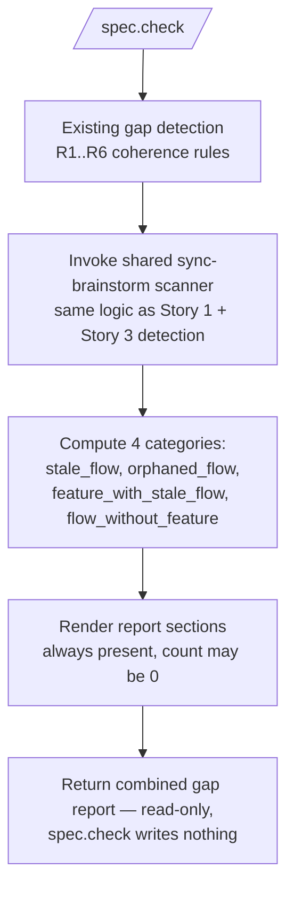

```mermaid
flowchart TD
    A[/spec.sync-brainstorm/] --> B[Scan .specs/flows/*.md<br/>read each frontmatter]
    B --> C[Read .brainstorm/mockups/manifest.json<br/>extract specGeneratedAt + flow source paths]
    C --> D{For each flow:<br/>compute status}
    D -- "brainstormGeneratedAt < specGeneratedAt" --> E[Mark stale_flow]
    D -- "source file disappeared" --> F[Mark orphaned_flow]
    D -- "specStatus == manual" --> G[Mark manual_flow informational]
    D -- "no divergence" --> H[Mark fresh — no entry in report]
    E --> I[Aggregate report]
    F --> I
    G --> I
    H --> I
    I --> J{--apply flag set?}
    J -- No (default) --> K[Print report, exit 0,<br/>NO writes]
    J -- Yes --> L[Branch into Story 2 — guided re-pull]
```

# Feature Spec: `/spec.sync-brainstorm` — Living Bridge to Brainstorm

- **Feature:** `/spec.sync-brainstorm` — Living Bridge to Brainstorm
- **Branch:** `feature/043-spec-sync-brainstorm`
- **Date:** 2026-05-13
- **Status:** Draft
- **Input:** Maintenir en vie le pont brainstorm ↔ LiveSpec après l'init. Nouvelle commande `/spec.sync-brainstorm` qui détecte les divergences (stale, orphaned, collision manual), propose un re-pull guidé en Mode A (flows) avec confirmation par fichier, et émet uniquement des warnings (jamais d'écrasement) en Mode B (AC/FR de features dérivées). Intégration `spec.check` : 4 nouvelles catégories de gap (`stale_flow`, `orphaned_flow`, `feature_with_stale_flow`, `flow_without_feature`).
- **Feature Number:** 043
- **Depends on:** Feature 041 (`.specs/flows/<slug>.md` + frontmatter LiveSpec `brainstormSource`, `brainstormGeneratedAt`, `specStatus`) ; Feature 042 (frontmatter feature `derivedFrom: brainstorm@<ts>` + `flows: [...]` + Mode B contract)

---

## User Scenarios & Testing

### Story 1 — Détection stale + orphaned + manual `P1`

**As a** développeur qui continue à itérer côté brainstorm après l'init LiveSpec,
**I want to** lancer `/spec.sync-brainstorm` (sans flag) et voir un rapport listant chaque flow LiveSpec dont le source brainstorm a évolué (`stale`), disparu (`orphaned`), ou qui a été édité manuellement côté LiveSpec (`manual`),
**so that** je sache exactement où la divergence existe avant de décider quoi re-puller.

**Priority reason:** sans cette commande, le pont brainstorm ↔ LiveSpec devient à sens unique (Feature 041 importe, Feature 042 dérive, mais rien ne signale la dérive ultérieure). Sans détection, l'équipe travaille sur des données silencieusement périmées.

**Independent test:** dans un projet où `.specs/flows/booking.md` a été importé avec `brainstormGeneratedAt: 2026-05-10T08:30:00Z` et `.brainstorm/mockups/manifest.json` a un `specGeneratedAt: 2026-05-12T14:00:00Z`, lancer `/spec.sync-brainstorm` (sans flag) ; vérifier que la sortie liste `booking.md` sous `stale_flow` avec les deux timestamps, n'écrit aucun fichier sur disque, et termine avec exit code 0.

#### Acceptance Scenarios (Gherkin — source of truth for tests)

```gherkin
Feature: /spec.sync-brainstorm detects divergences without writing

  Scenario: Stale detection by timestamp comparison
    Given ".specs/flows/booking.md" has frontmatter "brainstormGeneratedAt: 2026-05-10T08:30:00Z"
    And ".brainstorm/mockups/manifest.json" has "specGeneratedAt: 2026-05-12T14:00:00Z"
    When the user runs "/spec.sync-brainstorm"
    Then the report lists "booking.md" under "stale_flow"
    And the report includes both timestamps and the time delta
    And no file is written to disk
    And the exit code is 0

  Scenario: Orphaned detection
    Given ".specs/flows/booking.md" has frontmatter "brainstormSource: .brainstorm/specs/flows/booking.md"
    And ".brainstorm/specs/flows/booking.md" no longer exists on disk
    When the user runs "/spec.sync-brainstorm"
    Then the report lists "booking.md" under "orphaned_flow"
    And ".specs/flows/booking.md" is unchanged on disk
    And the LiveSpec frontmatter of ".specs/flows/booking.md" remains as-is (this command does NOT mutate specStatus)
    And the exit code is 0

  Scenario: Manual flow surfaced as informational
    Given ".specs/flows/booking.md" has frontmatter "specStatus: manual"
    When the user runs "/spec.sync-brainstorm"
    Then the report lists "booking.md" under a "manual_flow" informational section
    And the report cites that "manual" flows are protected from --apply re-pull unless --force-overwrite-manual is used
    And no file is written
    And the exit code is 0
```

#### User Flow



---

### Story 2 — Re-pull guidé en Mode A avec `--apply` et confirmation par fichier `P1`

**As a** développeur qui a vu le rapport de divergences et veut re-puller un sous-ensemble de flows stale,
**I want to** lancer `/spec.sync-brainstorm --apply` et confirmer fichier par fichier avant chaque re-pull,
**so that** je garde le contrôle granulaire et qu'aucun flow n'est ré-écrit silencieusement.

**Priority reason:** l'écrasement silencieux est la régression que tout le contrat brainstorm ↔ LiveSpec doit empêcher. Le re-pull doit être un choix explicite, jamais une action par défaut.

**Independent test:** sur un projet avec 3 flows stale (`booking.md`, `payment.md`, `refund.md`), lancer `/spec.sync-brainstorm --apply`, répondre `yes` au premier prompt, `no` au deuxième, `yes` au troisième ; vérifier que `booking.md` et `refund.md` ont leur body remplacé par la version brainstorm courante avec frontmatter LiveSpec rafraîchi (`brainstormGeneratedAt` mis à jour, `specStatus: fresh`), et que `payment.md` est inchangé sur disque.

#### Acceptance Scenarios (Gherkin — source of truth for tests)

```gherkin
Feature: /spec.sync-brainstorm --apply re-pulls flows with per-file confirmation

  Scenario: Per-file yes/no during --apply
    Given 3 stale flows exist: booking.md, payment.md, refund.md
    When the user runs "/spec.sync-brainstorm --apply"
    Then the command prompts once per stale flow with the slug and the diff summary
    When the user answers "yes", "no", "yes" in order
    Then ".specs/flows/booking.md" body is replaced by the current brainstorm source body
    And ".specs/flows/booking.md" frontmatter has refreshed "brainstormGeneratedAt" and "specStatus: fresh"
    And ".specs/flows/payment.md" is unchanged on disk
    And ".specs/flows/refund.md" body is replaced and frontmatter refreshed
    And the summary lists "2 re-pulled, 1 skipped, 0 failed"

  Scenario: Manual flow refuses re-pull without --force-overwrite-manual
    Given ".specs/flows/booking.md" has frontmatter "specStatus: manual"
    And the same flow is also stale (source brainstorm has evolved)
    When the user runs "/spec.sync-brainstorm --apply"
    Then the prompt for booking.md is replaced with a refusal line "skipped (specStatus: manual — use --force-overwrite-manual)"
    And ".specs/flows/booking.md" is unchanged
    And the summary lists "0 re-pulled, 1 skipped (manual), 0 failed"

  Scenario: Manual override with explicit double flag
    Given ".specs/flows/booking.md" has frontmatter "specStatus: manual" AND is stale
    When the user runs "/spec.sync-brainstorm --apply --force-overwrite-manual"
    Then the user is still prompted per-file (yes/no), even with the override flag
    When the user answers "yes"
    Then ".specs/flows/booking.md" body is replaced and frontmatter is rewritten with "specStatus: fresh"
    And the summary lists the entry as "overwritten (--force-overwrite-manual)"
```

#### User Flow

```mermaid
flowchart TD
    A[/spec.sync-brainstorm --apply/] --> B[Compute report — Story 1 logic]
    B --> C{For each stale_flow}
    C --> D{specStatus == manual?}
    D -- Yes --> E{--force-overwrite-manual<br/>flag set?}
    E -- No --> F[Skip with refusal line<br/>"specStatus: manual — use --force-overwrite-manual"]
    E -- Yes --> P[Prompt user yes/no with diff summary]
    D -- No --> P
    P -- "no" --> SKIP[Mark skipped, leave file unchanged]
    P -- "yes" --> R[Read brainstorm source body<br/>read manifest specGeneratedAt]
    R --> W[Write .specs/flows/&lt;slug&gt;.md:<br/>body = brainstorm source body verbatim<br/>frontmatter refreshed: brainstormGeneratedAt = manifest specGeneratedAt, specStatus: fresh]
    W --> S[Mark re-pulled]
    F --> AGG[Aggregate counters: re-pulled / skipped / failed]
    SKIP --> AGG
    S --> AGG
    AGG --> NEXT{More stale_flows?}
    NEXT -- Yes --> C
    NEXT -- No --> END[Print summary line, exit 0]
```

---

### Story 3 — Mode B : warning sur features dérivées, jamais d'écrasement `P1`

**As a** mainteneur LiveSpec,
**I want to** que `/spec.sync-brainstorm` détecte chaque feature dont le frontmatter `flows: [...]` référence un flow stale, et émette un WARNING (avec diff visuel optionnel) listant ces features et leurs AC/FR potentiellement désynchronisés, SANS jamais toucher au `spec.md` de la feature,
**so that** le contrat Mode B (Feature 042) reste inviolable et que toute re-dérivation reste un choix manuel humain (futur `--redrive`, hors-scope).

**Priority reason:** Mode B est le verrou central de Feature 042. Si `/spec.sync-brainstorm` pouvait modifier les AC/FR d'une feature dérivée, Mode B serait silencieusement contournable et toute édition humaine serait perdue. Cette story matérialise le verrou côté commande de sync.

**Independent test:** créer `.specs/features/NNN-booking/spec.md` avec frontmatter `derivedFrom: brainstorm@2026-05-10T08:30:00Z` et `flows: [booking]` ; éditer manuellement AC-002 ; modifier `.specs/flows/booking.md` (re-pull simulé avec timestamp postérieur) ; lancer `/spec.sync-brainstorm` puis `/spec.sync-brainstorm --apply` ; vérifier qu'à aucun moment AC-002 de la feature n'est modifié, et qu'un WARNING `feature_with_stale_flow` cite la feature et le flow concerné.

#### Acceptance Scenarios (Gherkin — source of truth for tests)

```gherkin
Feature: Mode B lock — feature spec AC/FR are never overwritten

  Scenario: Warning only, never write to feature spec
    Given ".specs/features/NNN-booking/spec.md" has frontmatter "derivedFrom: brainstorm@2026-05-10T08:30:00Z" and "flows: [booking]"
    And ".specs/flows/booking.md" has been updated by --apply (new brainstormGeneratedAt > derivedFrom)
    When the user runs "/spec.sync-brainstorm"
    Then the report lists the feature under "feature_with_stale_flow"
    And the WARNING cites: feature path, derivedFrom timestamp, current flow brainstormGeneratedAt, drifted flow slug(s)
    And ".specs/features/NNN-booking/spec.md" is byte-identical before and after the command
    And no AC or FR line in the feature spec is modified

  Scenario: --apply still never touches feature specs
    Given the same setup
    When the user runs "/spec.sync-brainstorm --apply" and confirms re-pull of booking.md
    Then ".specs/flows/booking.md" is re-pulled
    And ".specs/features/NNN-booking/spec.md" remains byte-identical
    And the summary cites "1 feature with stale flow detected — manual /spec.specify --redrive required (out of scope of Feature 043)"
```

#### User Flow

```mermaid
flowchart TD
    A[/spec.sync-brainstorm/ — any mode] --> B[Build flow status map<br/>from Story 1 logic]
    B --> C[Read .specs/features/*/spec.md<br/>parse frontmatter flows: [...]]
    C --> D{For each feature}
    D --> E{Any consumed flow has<br/>brainstormGeneratedAt > feature derivedFrom?}
    E -- No --> N[No entry — feature in sync]
    E -- Yes --> M[Add to report under feature_with_stale_flow<br/>cite feature path + drifted slugs]
    M --> G[Mode B gate]
    G --> H[NEVER write to feature spec.md<br/>Read frontmatter ONLY (derivedFrom + flows)<br/>Body (Mermaid/AC/FR/Stories) is not consumed]
    H --> I{User flag<br/>--apply requested?}
    I -- No --> RPT[Include in standard report only]
    I -- Yes --> RPT2[Include in --apply summary as informational only:<br/>"manual /spec.specify --redrive required<br/>(out of scope of Feature 043)"]
    N --> END
    RPT --> END
    RPT2 --> END
```

---

### Story 4 — Pruning explicite des orphaned avec `--prune-orphaned` `P2`

**As a** développeur qui veut nettoyer les flows LiveSpec dont le source brainstorm a définitivement disparu,
**I want to** lancer `/spec.sync-brainstorm --prune-orphaned` et confirmer fichier par fichier avant chaque suppression,
**so that** rien n'est jamais supprimé sans mon accord explicite, conforme à la décision « jamais sans flag ».

**Priority reason:** la suppression de fichiers est irréversible. Sans flag dédié + confirmation, un re-pull pourrait silencieusement vider `.specs/flows/`. P2 car la détection (Story 1) est P1 ; le pruning est un nettoyage optionnel qui peut être différé.

**Independent test:** créer 2 flows orphaned (`booking.md`, `payment.md`) ; lancer `/spec.sync-brainstorm --prune-orphaned` ; répondre `yes` puis `no` ; vérifier que `booking.md` est supprimé du disque, `payment.md` est conservé, et que la summary liste `1 pruned, 1 kept`.

#### Acceptance Scenarios (Gherkin — source of truth for tests)

```gherkin
Feature: /spec.sync-brainstorm --prune-orphaned with per-file confirmation

  Scenario: Per-file yes/no for orphaned pruning
    Given ".specs/flows/booking.md" and ".specs/flows/payment.md" are both orphaned (sources disappeared)
    When the user runs "/spec.sync-brainstorm --prune-orphaned"
    Then the command prompts once per orphaned flow
    When the user answers "yes" then "no"
    Then ".specs/flows/booking.md" is deleted from disk
    And ".specs/flows/payment.md" remains on disk
    And the summary lists "1 pruned, 1 kept"

  Scenario: --prune-orphaned is incompatible with running on non-orphaned flows
    Given ".specs/flows/booking.md" is fresh (not orphaned)
    When the user runs "/spec.sync-brainstorm --prune-orphaned"
    Then the command does NOT prompt for booking.md
    And the prune phase only iterates orphaned flows
    And the report still lists fresh / stale / manual flows informationally (Story 1 behavior preserved)

  Scenario: Pruning a flow consumed by a feature emits an explicit warning
    Given ".specs/flows/booking.md" is orphaned
    And ".specs/features/NNN-booking/spec.md" has frontmatter "flows: [booking]"
    When the user runs "/spec.sync-brainstorm --prune-orphaned" and answers "yes"
    Then ".specs/flows/booking.md" is deleted
    And the summary cites a WARNING "1 feature still references the pruned flow — feature spec preserved (Mode B), manual review required"
```

#### User Flow

```mermaid
flowchart TD
    A[/spec.sync-brainstorm --prune-orphaned/] --> B[Compute report — Story 1 logic]
    B --> C{For each orphaned_flow}
    C --> D[Prompt user yes/no<br/>cite slug + features still referencing it via flows: [...]]
    D -- "no" --> K[Mark kept]
    D -- "yes" --> X[Delete .specs/flows/&lt;slug&gt;.md]
    X --> Y{Any feature references this flow<br/>in flows: [...] frontmatter?}
    Y -- Yes --> W[Emit WARNING<br/>"feature spec preserved Mode B,<br/>manual review required"]
    Y -- No --> P[Mark pruned silently]
    K --> AGG[Aggregate: pruned / kept / warned]
    W --> AGG
    P --> AGG
    AGG --> NEXT{More orphaned_flows?}
    NEXT -- Yes --> C
    NEXT -- No --> END[Print summary, exit 0]
```

---

### Story 5 — Intégration `spec.check` : 4 nouvelles catégories de gap `P1`

**As a** mainteneur LiveSpec qui lance `/spec.check` régulièrement,
**I want to** que le rapport de gap inclue 4 nouvelles catégories pilotées par la même logique que `/spec.sync-brainstorm`,
**so that** les divergences brainstorm ↔ LiveSpec apparaissent au même endroit que les autres gaps de cohérence (sans devoir lancer une commande supplémentaire).

**Priority reason:** sans cette intégration, les développeurs qui n'utilisent que `/spec.check` resteraient aveugles aux dérives brainstorm. Le rapport unifié est la garantie qu'aucune divergence n'est masquée.

**Independent test:** sur un projet avec 1 flow stale, 1 flow orphaned, 1 feature dérivée pointant un flow stale, et 1 flow importé sans aucune feature qui le référence, lancer `/spec.check` ; vérifier que le rapport contient 4 sections nouvelles avec les counts attendus (1 / 1 / 1 / 1) et la liste des entrées correspondantes ; vérifier que `/spec.check` ne modifie aucun fichier.

#### Acceptance Scenarios (Gherkin — source of truth for tests)

```gherkin
Feature: /spec.check exposes 4 new gap categories sourced from sync-brainstorm logic

  Scenario: Four counts surfaced
    Given a project with:
      | 1 stale flow                                   |
      | 1 orphaned flow                                 |
      | 1 feature dérivée référençant le flow stale     |
      | 1 flow importé sans feature consommatrice       |
    When the user runs "/spec.check"
    Then the gap report contains a "stale_flow" section with count 1 and the slug listed
    And the gap report contains an "orphaned_flow" section with count 1 and the slug listed
    And the gap report contains a "feature_with_stale_flow" section with count 1, listing both feature path and the drifted flow slug
    And the gap report contains a "flow_without_feature" section with count 1, listing the orphan slug as a candidate for /spec.propose
    And no file is written by /spec.check

  Scenario: Zero divergences yields four zero-count sections
    Given every imported flow is fresh and every flow has at least one consuming feature
    When the user runs "/spec.check"
    Then the four new sections each report count 0
    And the sections still appear (consistent rendering, never silently omitted)
```

#### User Flow



---

## Acceptance Criteria

| ID | Criterion | Priority | Story |
|---|---|---|---|
| AC-001 | When run without flag, `/spec.sync-brainstorm` produces a report listing every flow in `.specs/flows/` whose `brainstormGeneratedAt` (LiveSpec frontmatter) is strictly less than `specGeneratedAt` from `.brainstorm/mockups/manifest.json` under the `stale_flow` category | P1 | Story 1 |
| AC-002 | When run without flag, the command lists every flow whose `brainstormSource` path no longer exists on disk under the `orphaned_flow` category | P1 | Story 1 |
| AC-003 | When run without flag, the command lists every flow whose `specStatus: manual` under a `manual_flow` informational section, citing that re-pull requires `--force-overwrite-manual` | P1 | Story 1 |
| AC-004 | Without `--apply`, `--prune-orphaned`, or any write flag, the command writes ZERO files to disk and exits 0 — pure read-only by default | P1 | Story 1 |
| AC-005 | With `--apply`, the command iterates each `stale_flow` and prompts the user `yes/no` per file before any write; `no` (or no response) skips; `yes` rewrites the target file with the brainstorm source body and refreshed LiveSpec frontmatter (`brainstormGeneratedAt = specGeneratedAt`, `specStatus: fresh`) | P1 | Story 2 |
| AC-006 | With `--apply` alone, any flow with `specStatus: manual` is skipped with the line `skipped (specStatus: manual — use --force-overwrite-manual)`; the file is not modified, the per-file prompt is not shown | P1 | Story 2 |
| AC-007 | With `--apply --force-overwrite-manual`, manual flows are still subject to the per-file `yes/no` prompt before being rewritten; `yes` rewrites the file (body + frontmatter), `no` skips | P1 | Story 2 |
| AC-008 | `/spec.sync-brainstorm` MAY read the YAML frontmatter of any `.specs/features/<NNN>/spec.md` to extract `derivedFrom` and `flows` for cross-reference detection (Mode B WARNING generation). The command NEVER modifies, rewrites, or appends to any `.specs/features/<NNN>/spec.md` under any flag combination, including `--apply`, `--force-overwrite-manual`, `--prune-orphaned`. Read-frontmatter is restricted to the YAML header; the body (Mermaid, AC, FR, Stories) is not consumed | P1 | Story 3 |
| AC-009 | When a feature spec has `derivedFrom: brainstorm@<ts>` and references a flow whose current `brainstormGeneratedAt` is strictly greater than `<ts>`, the command lists the feature under `feature_with_stale_flow` with feature path, derivedFrom timestamp, current brainstormGeneratedAt, and the drifted slug(s) | P1 | Story 3 |
| AC-010 | The `--apply` summary, when at least one `feature_with_stale_flow` exists, includes the literal informational line citing that `/spec.specify --redrive` is the manual remediation path and is out of scope of Feature 043 | P2 | Story 3 |
| AC-011 | With `--prune-orphaned`, the command iterates every `orphaned_flow` and prompts `yes/no` per file before any deletion; `yes` deletes `.specs/flows/<slug>.md` from disk; `no` keeps the file; non-orphaned flows are never prompted, never deleted | P2 | Story 4 |
| AC-012 | When pruning a flow that is still referenced by at least one feature spec via frontmatter `flows: [...]`, the command emits a WARNING citing each referencing feature and the literal text `feature spec preserved (Mode B), manual review required`; no feature spec is modified | P2 | Story 4 |
| AC-013 | `/spec.check` integrates the same scanner used by `/spec.sync-brainstorm` and produces 4 new gap sections (`stale_flow`, `orphaned_flow`, `feature_with_stale_flow`, `flow_without_feature`) — these sections are always present in the report (count may be 0), never silently omitted | P1 | Story 5 |
| AC-014 | The `flow_without_feature` section lists every imported flow in `.specs/flows/` that is referenced by zero feature spec frontmatter `flows: [...]`, presented as candidates for `/spec.propose` | P1 | Story 5 |
| AC-015 | `/spec.check` writes ZERO files when surfacing the 4 new categories — read-only contract preserved | P1 | Story 5 |
| AC-016 | Stale detection uses ISO-8601 timestamp comparison (lexicographic on normalized UTC strings); a flow with `brainstormGeneratedAt == specGeneratedAt` is `fresh`, with `brainstormGeneratedAt < specGeneratedAt` is `stale`. A flow with `brainstormGeneratedAt > specGeneratedAt` is treated as `fresh` and emits an INFO line `flow ahead of manifest — investigate manifest regeneration` | P2 | Story 1 |
| AC-017 | When `/spec.sync-brainstorm --apply` is invoked and a flow previously marked `specStatus: orphaned` has its source `.brainstorm/specs/flows/<slug>.md` reappeared (matching `brainstormSource` path), the command treats it as a fresh-or-stale candidate based on timestamp comparison (FR-002). If the user confirms re-pull, `specStatus` is rewritten to `fresh`. Without `--apply`, the report flags it as `un-orphaned (re-pull candidate)` without mutating the file | P1 | Story 1 |

### AC-001
**Criterion:** When run without flag, `/spec.sync-brainstorm` produces a report listing every flow in `.specs/flows/` whose `brainstormGeneratedAt` (LiveSpec frontmatter) is strictly less than `specGeneratedAt` from `.brainstorm/mockups/manifest.json` under the `stale_flow` category.
**Priority:** P1 | **Story:** Story 1

### AC-002
**Criterion:** When run without flag, the command lists every flow whose `brainstormSource` path no longer exists on disk under the `orphaned_flow` category.
**Priority:** P1 | **Story:** Story 1

### AC-003
**Criterion:** When run without flag, the command lists every flow whose `specStatus: manual` under a `manual_flow` informational section, citing that re-pull requires `--force-overwrite-manual`.
**Priority:** P1 | **Story:** Story 1

### AC-004
**Criterion:** Without `--apply`, `--prune-orphaned`, or any write flag, the command writes ZERO files to disk and exits 0 — pure read-only by default.
**Priority:** P1 | **Story:** Story 1

### AC-005
**Criterion:** With `--apply`, the command iterates each `stale_flow` and prompts the user `yes/no` per file before any write; `no` (or no response) skips; `yes` rewrites the target file with the brainstorm source body and refreshed LiveSpec frontmatter (`brainstormGeneratedAt = specGeneratedAt`, `specStatus: fresh`).
**Priority:** P1 | **Story:** Story 2

### AC-006
**Criterion:** With `--apply` alone, any flow with `specStatus: manual` is skipped with the line `skipped (specStatus: manual — use --force-overwrite-manual)`; the file is not modified, the per-file prompt is not shown.
**Priority:** P1 | **Story:** Story 2

### AC-007
**Criterion:** With `--apply --force-overwrite-manual`, manual flows are still subject to the per-file `yes/no` prompt before being rewritten; `yes` rewrites the file (body + frontmatter), `no` skips.
**Priority:** P1 | **Story:** Story 2

### AC-008
**Criterion:** `/spec.sync-brainstorm` MAY read the YAML frontmatter of any `.specs/features/<NNN>/spec.md` to extract `derivedFrom` and `flows` for cross-reference detection (Mode B WARNING generation). The command NEVER modifies, rewrites, or appends to any `.specs/features/<NNN>/spec.md` under any flag combination, including `--apply`, `--force-overwrite-manual`, `--prune-orphaned`. Read-frontmatter is restricted to the YAML header; the body (Mermaid, AC, FR, Stories) is not consumed.
**Priority:** P1 | **Story:** Story 3

### AC-009
**Criterion:** When a feature spec has `derivedFrom: brainstorm@<ts>` and references a flow whose current `brainstormGeneratedAt` is strictly greater than `<ts>`, the command lists the feature under `feature_with_stale_flow` with feature path, derivedFrom timestamp, current brainstormGeneratedAt, and the drifted slug(s).
**Priority:** P1 | **Story:** Story 3

### AC-010
**Criterion:** The `--apply` summary, when at least one `feature_with_stale_flow` exists, includes the literal informational line citing that `/spec.specify --redrive` is the manual remediation path and is out of scope of Feature 043.
**Priority:** P2 | **Story:** Story 3

### AC-011
**Criterion:** With `--prune-orphaned`, the command iterates every `orphaned_flow` and prompts `yes/no` per file before any deletion; `yes` deletes `.specs/flows/<slug>.md` from disk; `no` keeps the file; non-orphaned flows are never prompted, never deleted.
**Priority:** P2 | **Story:** Story 4

### AC-012
**Criterion:** When pruning a flow that is still referenced by at least one feature spec via frontmatter `flows: [...]`, the command emits a WARNING citing each referencing feature and the literal text `feature spec preserved (Mode B), manual review required`; no feature spec is modified.
**Priority:** P2 | **Story:** Story 4

### AC-013
**Criterion:** `/spec.check` integrates the same scanner used by `/spec.sync-brainstorm` and produces 4 new gap sections (`stale_flow`, `orphaned_flow`, `feature_with_stale_flow`, `flow_without_feature`) — these sections are always present in the report (count may be 0), never silently omitted.
**Priority:** P1 | **Story:** Story 5

### AC-014
**Criterion:** The `flow_without_feature` section lists every imported flow in `.specs/flows/` that is referenced by zero feature spec frontmatter `flows: [...]`, presented as candidates for `/spec.propose`.
**Priority:** P1 | **Story:** Story 5

### AC-015
**Criterion:** `/spec.check` writes ZERO files when surfacing the 4 new categories — read-only contract preserved.
**Priority:** P1 | **Story:** Story 5

### AC-016
**Criterion:** Stale detection uses ISO-8601 timestamp comparison (lexicographic on normalized UTC strings); a flow with `brainstormGeneratedAt == specGeneratedAt` is `fresh`, with `brainstormGeneratedAt < specGeneratedAt` is `stale`. A flow with `brainstormGeneratedAt > specGeneratedAt` is treated as `fresh` and emits an INFO line `flow ahead of manifest — investigate manifest regeneration`.
**Priority:** P2 | **Story:** Story 1

### AC-017
**Criterion:** When `/spec.sync-brainstorm --apply` is invoked and a flow previously marked `specStatus: orphaned` has its source `.brainstorm/specs/flows/<slug>.md` reappeared (matching `brainstormSource` path), the command treats it as a fresh-or-stale candidate based on timestamp comparison (FR-002). If the user confirms re-pull, `specStatus` is rewritten to `fresh`. Without `--apply`, the report flags it as `un-orphaned (re-pull candidate)` without mutating the file.
**Priority:** P1 | **Story:** Story 1

---

## Functional Requirements

| ID | Requirement | AC References |
|---|---|---|
| FR-001 | `/spec.sync-brainstorm` MUST scan `.specs/flows/*.md`, parse each LiveSpec frontmatter (`brainstormSource`, `brainstormGeneratedAt`, `specStatus`), and read `.brainstorm/mockups/manifest.json` (`specGeneratedAt`) to compute per-flow status | AC-001, AC-002, AC-003, AC-016 |
| FR-002 | A flow is `stale` iff its frontmatter `brainstormGeneratedAt` (ISO-8601) is strictly less than the manifest `specGeneratedAt` (ISO-8601), compared lexicographically on normalized UTC strings | AC-001, AC-016 |
| FR-003 | A flow is `orphaned` iff its frontmatter `brainstormSource` path does not exist on disk at scan time | AC-002 |
| FR-004 | The default (non-`--apply`) report emitted by `/spec.sync-brainstorm` MUST contain four sections, one per divergence category aligned with the `spec.check` gap categories introduced by this feature: `stale_flows`, `orphaned_flows`, `feature_with_stale_flow_warnings` (Mode B), `flow_without_feature` (advisory). An optional `info` header lines the run with run timestamp, total flows scanned, total features scanned (and surfaces ahead-of-manifest flows per FR-017, manual flows informational, and un-orphaned candidates per AC-017). Sections without entries are emitted with an explicit `(none)` marker for determinism. The command writes ZERO files and exits 0 | AC-001, AC-002, AC-003, AC-004, AC-013, AC-016, AC-017 |
| FR-005 | `--apply` triggers re-pull only for `stale_flow` entries; for each, the command prompts the user `yes/no` BEFORE any write; `yes` rewrites `.specs/flows/<slug>.md` with the brainstorm source body verbatim and refreshes the LiveSpec frontmatter (`brainstormGeneratedAt = specGeneratedAt`, `specStatus: fresh`); `no` (or empty answer) skips | AC-005 |
| FR-006 | Under `--apply` (without `--force-overwrite-manual`), any flow with `specStatus: manual` is skipped with a refusal line and is NOT prompted; the file remains untouched | AC-006 |
| FR-007 | `--apply --force-overwrite-manual` lifts the manual guard but still requires per-file `yes/no` confirmation before each write; the override never auto-accepts | AC-007 |
| FR-008 | The command NEVER opens any `.specs/features/<NNN>/spec.md` for writing under any flag combination; Mode B (Feature 042) is honored absolutely. Read access is permitted on the YAML frontmatter only (keys `derivedFrom` and `flows`) — body content (Mermaid, AC, FR, Stories) is not parsed for any purpose | AC-008 |
| FR-009 | Feature spec scanning is read-only for the sole purpose of building the `feature_with_stale_flow` and `flow_without_feature` cross-reference reports; parsing is limited to the YAML frontmatter `derivedFrom` and `flows` keys | AC-009, AC-014 |
| FR-010 | When at least one `feature_with_stale_flow` is detected during `--apply`, the command appends to its summary the literal informational line referencing `/spec.specify --redrive` as the manual remediation path, explicitly noted as out of scope of Feature 043 | AC-010 |
| FR-011 | `--prune-orphaned` iterates only `orphaned_flow` entries; for each, it prompts `yes/no` BEFORE any deletion; `yes` deletes `.specs/flows/<slug>.md`; `no` keeps the file; the command never deletes a non-orphaned flow under any flag | AC-011 |
| FR-012 | When pruning a flow referenced by ≥1 feature via frontmatter `flows: [...]`, the command emits a WARNING line with the referencing feature paths and the literal text `feature spec preserved (Mode B), manual review required`; the feature spec is not modified | AC-012 |
| FR-013 | `/spec.check` MUST invoke the same scanner used by `/spec.sync-brainstorm` (default mode) and surface 4 new gap sections in its report: `stale_flow`, `orphaned_flow`, `feature_with_stale_flow`, `flow_without_feature`; sections are always rendered, count may be 0 | AC-013 |
| FR-014 | The `flow_without_feature` section enumerates flows in `.specs/flows/` that are referenced by zero feature spec; this list is presented as candidates for `/spec.propose` | AC-014 |
| FR-015 | `/spec.check` is forbidden from writing any file when computing the 4 new categories; the read-only contract of `/spec.check` is preserved | AC-015 |
| FR-016 | A flow can carry combined statuses (e.g. `specStatus: manual` while its `brainstormSource` has disappeared). For pruning under `--prune-orphaned`, the command checks the source presence on disk, NOT the `specStatus` field. A manual+orphaned flow is therefore eligible for pruning under `--prune-orphaned`, BUT the per-file confirmation prompt MUST display both flags (`manual` AND `orphaned`) and require `--force-overwrite-manual` in addition to `--prune-orphaned` to actually delete it. Without both flags, the prompt downgrades to a WARNING-only entry in the report. Otherwise, `--apply` and `--prune-orphaned` remain independent and may be combined (`/spec.sync-brainstorm --apply --prune-orphaned`); each phase uses its own per-file confirmation | AC-005, AC-006, AC-007, AC-011 |
| FR-017 | A flow whose `brainstormGeneratedAt` is strictly greater than the manifest `specGeneratedAt` is treated as `fresh` (not stale) and produces an INFO line `flow ahead of manifest — investigate manifest regeneration`; this line is informational only and does not affect exit code | AC-016 |
| FR-018 | The divergence report emitted by `/spec.sync-brainstorm` MUST follow the same structural template as the CONFLICT REPORT defined in Feature 042 FR-015: each entry pairs a brainstorm source reference (`<.brainstorm/path>:<line>`) with the LiveSpec target reference (`<.specs/path>:<line>` or `<.specs/path>` if line-level not applicable). Sections: `stale_flows`, `orphaned_flows`, `manual_conflicts`, `feature_warnings`. Each entry: `source_ref → target_ref : <one-line diagnostic>`. Output format: structured YAML or plain text aligned columns, deterministic ordering by slug | AC-001, AC-002, AC-003, AC-009, AC-013 |

### FR-001
**Requirement:** `/spec.sync-brainstorm` MUST scan `.specs/flows/*.md`, parse each LiveSpec frontmatter (`brainstormSource`, `brainstormGeneratedAt`, `specStatus`), and read `.brainstorm/mockups/manifest.json` (`specGeneratedAt`) to compute per-flow status.
**AC References:** [AC-001](#ac-001), [AC-002](#ac-002), [AC-003](#ac-003), [AC-016](#ac-016)

### FR-002
**Requirement:** A flow is `stale` iff its frontmatter `brainstormGeneratedAt` (ISO-8601) is strictly less than the manifest `specGeneratedAt` (ISO-8601), compared lexicographically on normalized UTC strings.
**AC References:** [AC-001](#ac-001), [AC-016](#ac-016)

### FR-003
**Requirement:** A flow is `orphaned` iff its frontmatter `brainstormSource` path does not exist on disk at scan time.
**AC References:** [AC-002](#ac-002)

### FR-004
**Requirement:** The default (non-`--apply`) report emitted by `/spec.sync-brainstorm` MUST contain four sections, one per divergence category aligned with the `spec.check` gap categories introduced by this feature: `stale_flows`, `orphaned_flows`, `feature_with_stale_flow_warnings` (Mode B), `flow_without_feature` (advisory). An optional `info` header lines the run with run timestamp, total flows scanned, total features scanned (and surfaces ahead-of-manifest flows per FR-017, manual flows informational, and un-orphaned candidates per AC-017). Sections without entries are emitted with an explicit `(none)` marker for determinism. The command writes ZERO files and exits 0.
**AC References:** [AC-001](#ac-001), [AC-002](#ac-002), [AC-003](#ac-003), [AC-004](#ac-004), [AC-013](#ac-013), [AC-016](#ac-016), [AC-017](#ac-017)

### FR-005
**Requirement:** `--apply` triggers re-pull only for `stale_flow` entries; for each, the command prompts the user `yes/no` BEFORE any write; `yes` rewrites `.specs/flows/<slug>.md` with the brainstorm source body verbatim and refreshes the LiveSpec frontmatter (`brainstormGeneratedAt = specGeneratedAt`, `specStatus: fresh`); `no` (or empty answer) skips.
**AC References:** [AC-005](#ac-005)

### FR-006
**Requirement:** Under `--apply` (without `--force-overwrite-manual`), any flow with `specStatus: manual` is skipped with a refusal line and is NOT prompted; the file remains untouched.
**AC References:** [AC-006](#ac-006)

### FR-007
**Requirement:** `--apply --force-overwrite-manual` lifts the manual guard but still requires per-file `yes/no` confirmation before each write; the override never auto-accepts.
**AC References:** [AC-007](#ac-007)

### FR-008
**Requirement:** The command NEVER opens any `.specs/features/<NNN>/spec.md` for writing under any flag combination; Mode B (Feature 042) is honored absolutely. Read access is permitted on the YAML frontmatter only (keys `derivedFrom` and `flows`) — body content (Mermaid, AC, FR, Stories) is not parsed for any purpose.
**AC References:** [AC-008](#ac-008)

### FR-009
**Requirement:** Feature spec scanning is read-only for the sole purpose of building the `feature_with_stale_flow` and `flow_without_feature` cross-reference reports; parsing is limited to the YAML frontmatter `derivedFrom` and `flows` keys.
**AC References:** [AC-009](#ac-009), [AC-014](#ac-014)

### FR-010
**Requirement:** When at least one `feature_with_stale_flow` is detected during `--apply`, the command appends to its summary the literal informational line referencing `/spec.specify --redrive` as the manual remediation path, explicitly noted as out of scope of Feature 043.
**AC References:** [AC-010](#ac-010)

### FR-011
**Requirement:** `--prune-orphaned` iterates only `orphaned_flow` entries; for each, it prompts `yes/no` BEFORE any deletion; `yes` deletes `.specs/flows/<slug>.md`; `no` keeps the file; the command never deletes a non-orphaned flow under any flag.
**AC References:** [AC-011](#ac-011)

### FR-012
**Requirement:** When pruning a flow referenced by ≥1 feature via frontmatter `flows: [...]`, the command emits a WARNING line with the referencing feature paths and the literal text `feature spec preserved (Mode B), manual review required`; the feature spec is not modified.
**AC References:** [AC-012](#ac-012)

### FR-013
**Requirement:** `/spec.check` MUST invoke the same scanner used by `/spec.sync-brainstorm` (default mode) and surface 4 new gap sections in its report: `stale_flow`, `orphaned_flow`, `feature_with_stale_flow`, `flow_without_feature`; sections are always rendered, count may be 0.
**AC References:** [AC-013](#ac-013)

### FR-014
**Requirement:** The `flow_without_feature` section enumerates flows in `.specs/flows/` that are referenced by zero feature spec; this list is presented as candidates for `/spec.propose`.
**AC References:** [AC-014](#ac-014)

### FR-015
**Requirement:** `/spec.check` is forbidden from writing any file when computing the 4 new categories; the read-only contract of `/spec.check` is preserved.
**AC References:** [AC-015](#ac-015)

### FR-016
**Requirement:** A flow can carry combined statuses (e.g. `specStatus: manual` while its `brainstormSource` has disappeared). For pruning under `--prune-orphaned`, the command checks the source presence on disk, NOT the `specStatus` field. A manual+orphaned flow is therefore eligible for pruning under `--prune-orphaned`, BUT the per-file confirmation prompt MUST display both flags (`manual` AND `orphaned`) and require `--force-overwrite-manual` in addition to `--prune-orphaned` to actually delete it. Without both flags, the prompt downgrades to a WARNING-only entry in the report. Otherwise, `--apply` and `--prune-orphaned` remain independent and may be combined (`/spec.sync-brainstorm --apply --prune-orphaned`); each phase uses its own per-file confirmation.
**AC References:** [AC-005](#ac-005), [AC-006](#ac-006), [AC-007](#ac-007), [AC-011](#ac-011)

### FR-017
**Requirement:** A flow whose `brainstormGeneratedAt` is strictly greater than the manifest `specGeneratedAt` is treated as `fresh` (not stale) and produces an INFO line `flow ahead of manifest — investigate manifest regeneration`; this line is informational only and does not affect exit code.
**AC References:** [AC-016](#ac-016)

### FR-018
**Requirement:** The divergence report emitted by `/spec.sync-brainstorm` MUST follow the same structural template as the CONFLICT REPORT defined in Feature 042 FR-015: each entry pairs a brainstorm source reference (`<.brainstorm/path>:<line>`) with the LiveSpec target reference (`<.specs/path>:<line>` or `<.specs/path>` if line-level not applicable). Sections: `stale_flows`, `orphaned_flows`, `manual_conflicts`, `feature_warnings`. Each entry: `source_ref → target_ref : <one-line diagnostic>`. Output format: structured YAML or plain text aligned columns, deterministic ordering by slug.
**AC References:** [AC-001](#ac-001), [AC-002](#ac-002), [AC-003](#ac-003), [AC-009](#ac-009), [AC-013](#ac-013)

---

## Key Entities

| Entity | Description | Key Fields |
|---|---|---|
| FlowSyncStatus | Per-flow status computed by the scanner; orthogonal to brainstorm grammar `status` (draft/reviewed/promoted) and partially overlapping with Feature 041 `specStatus`. Used purely for reporting | one of: `fresh` (in sync), `stale` (brainstorm source newer), `orphaned` (source disappeared), `manual` (LiveSpec edited), `ahead` (LiveSpec ts > manifest ts — INFO only) |
| GapCategory | A section in the report (and in `/spec.check`) corresponding to one divergence class | `stale_flow`, `orphaned_flow`, `manual_flow` (info), `feature_with_stale_flow`, `flow_without_feature` |
| RePullOperation | A single per-file write applied during `--apply` | target path, brainstorm source body (verbatim), refreshed `brainstormGeneratedAt`, refreshed `specStatus: fresh` |
| PruneOperation | A single per-file deletion applied during `--prune-orphaned` | target path; precondition: status == `orphaned`; never applied to other statuses |
| FeatureFlowReference | Read-only view derived from `.specs/features/<NNN>/spec.md` frontmatter (Feature 042 contract): `derivedFrom: brainstorm@<ts>` + `flows: [<slug>, ...]`. Used to build `feature_with_stale_flow` and `flow_without_feature` reports without ever modifying the feature spec | feature path, derivedFrom timestamp, flows[] |
| ModeBLock | Invariant honored by every code path of this feature: no write to `.specs/features/<NNN>/spec.md` under any flag combination. Inherited from Feature 042 | scope: AC + FR + Mermaid sections of feature specs; applies to read-only commands too |

---

## Edge Cases

- **`.specs/flows/` absent or empty:** the report renders the 5 sections with count 0, exits 0, no error.
- **`.brainstorm/mockups/manifest.json` absent:** stale detection cannot run (no `specGeneratedAt` reference). The command emits a single WARNING `manifest.json missing — stale detection skipped` and proceeds with orphaned and manual detection only; `stale_flow` count is reported as `n/a`. Exit code 0.
- **Manifest `specGeneratedAt` missing or not ISO-8601:** same handling as missing manifest — WARNING + skip stale detection only.
- **Flow LiveSpec frontmatter missing `brainstormGeneratedAt`:** treat the flow as having an undefined timestamp; surface under a separate `malformed_flow` entry in the `info` block. Do NOT mark stale, do NOT auto-fix.
- **Un-orphan detection (disappeared → recreated → re-imported):** A flow previously marked `orphaned` (source disappeared) whose `brainstormSource` path reappears on disk between two scans is reported under a dedicated `un-orphaned (re-pull candidate)` entry in the default report. Under `--apply`, the per-file prompt offers a re-pull; on `yes` confirmation, the flow body is rewritten verbatim from the reappeared source and `specStatus` is set to `fresh`. Without confirmation the file is untouched and remains classified `orphaned` until the next scan. Covered by AC-017.
- **Combined flow status (e.g. `stale` AND `manual`):** the flow appears in BOTH `stale_flow` and `manual_flow` sections; under `--apply` without `--force-overwrite-manual` it is skipped per AC-006; under `--apply --force-overwrite-manual` it is prompted per AC-007. For `manual + orphaned` combinations, see FR-016: pruning under `--prune-orphaned` alone downgrades to WARNING-only; deletion requires `--prune-orphaned --force-overwrite-manual` together, with per-file prompt that explicitly displays both flags.
- **`--prune-orphaned` on a project with zero orphaned flows:** the prune phase is a no-op (no prompt, no deletion); the standard report is still printed.
- **`--apply` on a project with zero stale flows:** the apply phase is a no-op (no prompt, no write); the standard report is still printed.
- **User answers anything other than `yes` or `no` at a prompt:** treat as `no` (skip / keep). No partial / abort behavior.
- **Multiple features reference the same stale flow:** each affected feature appears once under `feature_with_stale_flow`; the listing groups by flow slug to surface fan-out clearly.
- **Same flow listed by `flows: [...]` of a feature AND not present on disk:** the feature is reported under both `feature_with_stale_flow` (with note `referenced flow missing`) AND the flow appears in `orphaned_flow` (or in the case where the flow was already deleted, only the feature side carries the dangling reference).
- **`/spec.specify --redrive` (out of scope of Feature 043):** mentioned in AC-010 / FR-010 as the manual remediation path; this feature does NOT implement it. Any future introduction of `--redrive` requires a separate feature spec with explicit user opt-in (consistent with Feature 042 Story 3).
- **`/spec.check` invocation with `.specs/flows/` absent:** the 4 new sections are still rendered, all with count 0; no error, no WARNING.

---

## Success Criteria

| ID | Criterion | How to Measure |
|---|---|---|
| SC-001 | Default invocation is non-destructive | After `/spec.sync-brainstorm` runs (no flag), `git status` shows zero changes inside `.specs/`, exit code is 0 |
| SC-002 | Mode B is inviolable across all flag combinations | For every combination of `--apply`, `--prune-orphaned`, `--force-overwrite-manual`, asserting that every `.specs/features/<NNN>/spec.md` is byte-identical before and after the command run (file hash check) |
| SC-003 | Stale detection is deterministic | On a fixture with N flows whose timestamps are all known relative to manifest `specGeneratedAt`, the scanner identifies exactly the expected K stale + L orphaned + M manual entries (zero false positives, zero false negatives) |
| SC-004 | Per-file confirmation is mandatory | Property test: under `--apply`, no write occurs on any file for which the user answered `no` or anything other than `yes`; the assertion is checked file-by-file across a fixture of mixed responses |
| SC-005 | `/spec.check` integration is observable | After `/spec.check` on a fixture with one of each divergence type, the 4 new sections appear with the expected counts and entries; no other gap section is regressed |
| SC-006 | `flow_without_feature` enables actionable follow-up | Every entry in `flow_without_feature` matches an existing `.specs/flows/<slug>.md` and is a valid candidate for `/spec.propose <slug>` (the slug is well-formed, the file body parses against grammar v1.0) |
