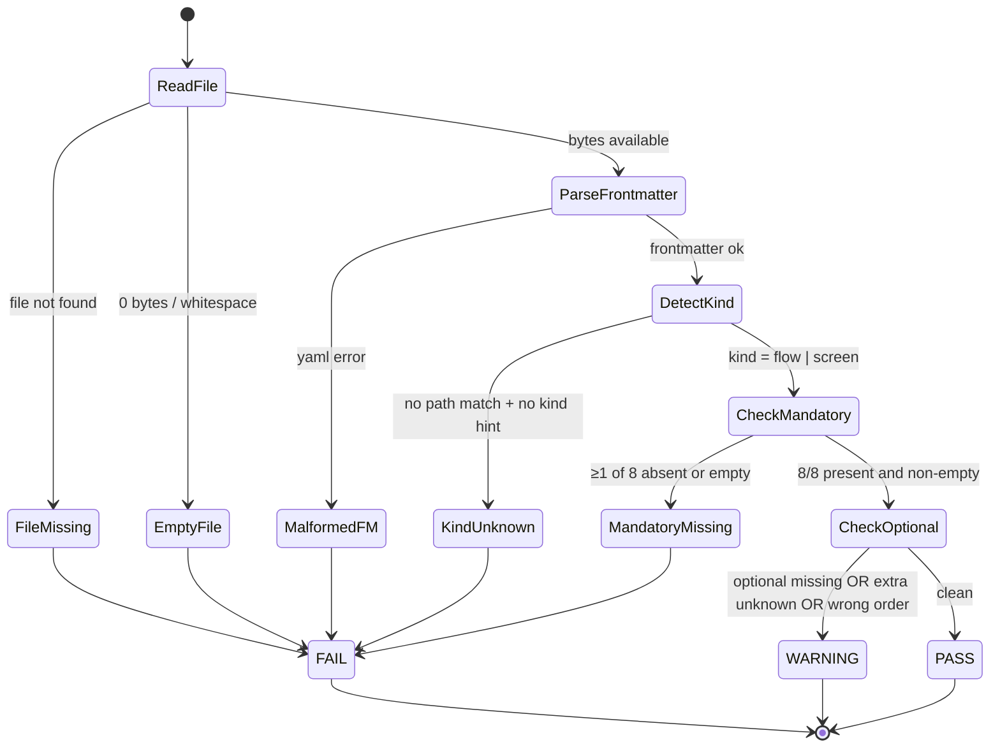
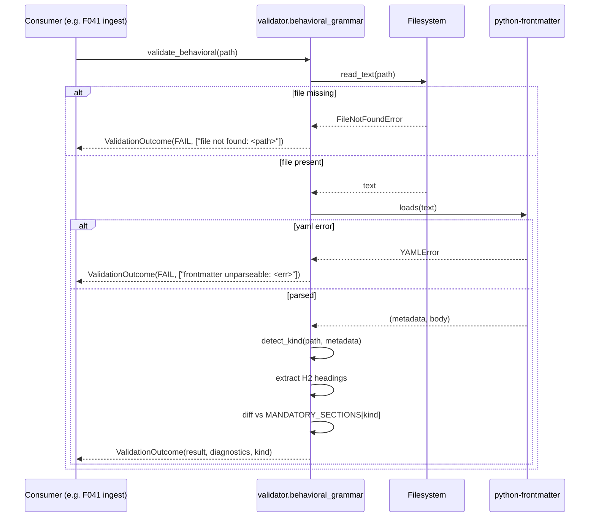

# Plan: Behavioral Grammar v1.0 — Shared Canonical Reference & Validator

- **Feature:** 044-behavioral-grammar-v1-shared
- **Spec:** [spec.md](./spec.md)
- **Branch:** `feature/044-behavioral-grammar-v1-shared`
- **Scope size:** **S** (3 user stories, 12 FR, 14 AC, 1 doc + 1 module + 1 test file)

---

## Summary

F044 is purely additive: ship one canonical Markdown reference (`system/grammar/behavioral-specs-v1.md`) documenting the behavioral grammar v1.0 (8 mandatory flow sections, 8 mandatory screen sections, LiveSpec frontmatter contract, `VALIDATION_RESULT` enum, minimal flow/screen fixtures, versioning policy), one Python validator module (`validator/behavioral_grammar.py`) exposing `validate_behavioral(path) -> ValidationOutcome` and the public `VALIDATION_RESULT` enum, and one test file (`tests/test_behavioral_grammar.py`) covering the 5 mandated cases. Zero modification of F041/042/043 spec.md files (verified by `git diff main`); zero new third-party dependency (only `python-frontmatter`, `pyyaml`, `mistune` already pinned). Versioning encoded both in the filename suffix (`-v1`) and an in-file `Grammar version: 1.0` declaration; future v2 ships sibling files leaving v1 intact for existing consumers (F041/042/043 + future F045).

---

## Technical Context

| Aspect | Choice | Reason |
|---|---|---|
| Language | Python 3.11+ | Matches `pyproject.toml` `requires-python = ">=3.11"` |
| Doc format | Markdown | LiveSpec convention; no doc generator in this repo |
| Validator package | `validator/` (top-level) | Co-located with `validator/coherence/`, `validator/locks.py` (FR-008) |
| Frontmatter parser | `python-frontmatter>=1.1` | Already pinned (FR-009) |
| YAML | `pyyaml>=6.0` (transitive via python-frontmatter) | Already pinned |
| Markdown sectioning | Stdlib regex scan | Keeps the validator dependency-light while still enforcing exact H2 section names |
| Test runner | `pytest>=8.0` (dev extra) | Existing convention (`tests/test_*.py`) |
| Type checking | `pyright` strict | Existing `pyproject.toml` config |
| Lint | `ruff` (`E,F,I,UP,RUF,B,SIM`) | Existing config |
| New 3rd-party deps | **NONE** | FR-009 / AC-013 — hard ban |

---

## Constitution Check

| Gate | Status | Note |
|---|---|---|
| Simplicity | ✅ | Single new module, single new doc, single new test file. Zero refactor of existing modules. |
| Separation | ✅ | `system/grammar/` (doc) ↔ `validator/behavioral_grammar.py` (logic) ↔ `tests/test_behavioral_grammar.py` (tests). |
| Testing | ✅ | All validator branches covered by 5 unit tests (AC-011). Pure functions, no I/O mocking needed beyond `tmp_path`. |
| Naming | ✅ | `behavioral_grammar.py` matches existing `validator/<domain>.py` convention (`commit_context.py`, `git_ops.py`, `pipeline.py`). Doc path `system/grammar/behavioral-specs-v1.md` matches `system/<topic>/<file>.md` convention (`system/testing/`, `system/contracts/`). |
| Out-of-Scope Guard | ✅ | F044 spec.md ships a dedicated `## Out-of-Scope Guard` section (FR-012); plan respects it — see "Anti-Scope Creep" below. |

---

## Anti-Scope Creep (mirror of spec.md `## Out-of-Scope Guard`)

The following are **explicitly NOT in this plan** and MUST NOT appear in any step below:

- ❌ Native generation of behavioral specs (interview / mockup-derivation / brainstorm scripts) — owned by F045
- ❌ Modification of `.specs/features/041-*/spec.md`, `042-*/spec.md`, `043-*/spec.md` (FR-011)
- ❌ Refactor of `validator/coherence/` or `validator/cli.py` core
- ❌ Wiring into `livespec validate` core dispatch
- ❌ Slash command surface (`/spec.validate-behavioral`) — deferred to a separate feature even if pursued later
- ❌ Adding any new third-party dependency (FR-009)
- ❌ Defining `specStatus` lifecycle transitions — owned by F041 / F043

A dedicated **Step 5 — Compatibility Verification** at the end of the plan asserts these guards.

---

## Key Diagrams

### State Diagram — `VALIDATION_RESULT` decision flow



### Sequence Diagram — Consumer (F041 ingest) calling the validator



### ER Diagram — Doc + module artefacts (logical, no DB)

```mermaid
erDiagram
    BehavioralGrammarDoc ||--|| GrammarVersion : declares
    BehavioralGrammarDoc ||--o{ MandatorySectionSet : lists
    BehavioralGrammarDoc ||--|| FrontmatterContract : documents
    BehavioralGrammarDoc ||--|| ValidationResultEnum : defines
    BehavioralGrammarDoc ||--o{ Fixture : embeds

    BehavioralGrammarValidator ||--|| ValidationResultEnum : returns
    BehavioralGrammarValidator ||--o{ MandatorySectionSet : enforces
    BehavioralGrammarValidator ||--|| FrontmatterContract : checks

    BehavioralGrammarDoc {
        path system/grammar/behavioral-specs-v1.md
        string grammar_version "1.0"
    }
    MandatorySectionSet {
        string kind "flow | screen"
        list sections "8 ordered"
    }
    ValidationResultEnum {
        string PASS
        string WARNING
        string FAIL
    }
    Fixture {
        string kind
        string body "minimal valid"
    }
```

---

## Resolved Test Commands

| Action | Command | Tool | Status |
|---|---|---|---|
| Unit tests | `pytest tests/test_behavioral_grammar.py -v` | pytest 8.x | Verified |
| Full suite | `pytest -v` | pytest 8.x | Verified |
| Type check | `pyright validator/behavioral_grammar.py` | pyright strict | Verified |
| Lint | `ruff check validator/behavioral_grammar.py tests/test_behavioral_grammar.py` | ruff | Verified |
| Compat guard | `git diff main -- .specs/features/041-*/spec.md .specs/features/042-*/spec.md .specs/features/043-*/spec.md` | git | Verified (must produce empty output) |
| Doc grep | `grep -c "Grammar version: 1.0" system/grammar/behavioral-specs-v1.md` | grep | Verified (must print ≥ 1) |

---

## Implementation Steps

> Order is sequential. Each step is atomic. No step modifies F041/042/043 spec.md.

### Step 1 — Author the canonical grammar doc

- **File (NEW):** `system/grammar/behavioral-specs-v1.md`
- **What:** Markdown reference document.
- **Required structure** (in order):
  1. Header: title `# Behavioral Specs Grammar v1.0` + line `Grammar version: 1.0` (within first 20 lines — AC-002).
  2. `## Mandatory Flow Sections` — exactly 8 named, ordered, one-line description each (AC-003). Names must match the brainstorm `specify-flows` skill convention referenced by F041 (e.g. `Acteur`, `Préconditions`, `Déclencheur`, `Étapes nominales`, `Règles métier`, `Erreurs & exceptions`, `Side-effects`, `Postconditions`). Final list resolved by reading the brainstorm skill source during implementation; any drift from F041's implicit list is a verifier finding.
  3. `## Mandatory Screen Sections` — exactly 8 named, ordered, one-line description each (AC-004). Must include `Acteur` (per Story 2 / FR-005 test).
  4. `## LiveSpec Frontmatter Contract` — exactly 3 fields with type + allowed values + one-line semantics: `brainstormSource`, `brainstormGeneratedAt`, `specStatus` (AC-005). Allowed `specStatus` values: `fresh | stale | orphaned | manual` (sourced verbatim from F041 Key Entities).
  5. `## VALIDATION_RESULT Enum` — exactly 3 values (PASS/WARNING/FAIL) with one-paragraph semantics each, **byte-compatible with F041 spec.md FR-003 + Key Entities `VALIDATION_RESULT` row** (AC-006, FR-002). Cross-check during implementation: `grep "VALIDATION_RESULT" .specs/features/041-spec-init-flow-specs-ingestion/spec.md`.
  6. `## Minimal Flow Fixture` — fenced as ` ```markdown ` block; full body, valid frontmatter, all 8 mandatory sections present, plus any documented optional sections needed to keep the fixture deviation-free (`PASS`) (AC-007).
  7. `## Minimal Screen Fixture` — same constraints (AC-007).
  8. `## Versioning Policy` — paragraph naming `v1.0` as current version + rule for breaking-change bumps. Decision (locked here): **mandatory section addition or removal → MAJOR bump (v2.0); optional section addition or wording clarification → MINOR bump (v1.1)**. Versioning is encoded **in the filename suffix** (`behavioral-specs-v1.md`, future `behavioral-specs-v2.md`); the in-file `Grammar version:` line is the runtime check. v1.x doc updates stay in the same file; v2 ships a sibling file. (AC-008).
- **FR covered:** FR-001.1: Doc skeleton + 8/8 sections + frontmatter + enum + fixtures + versioning policy. FR-002.1: Cross-check enum with F041.
- **Verification:** `grep -c "Grammar version: 1.0" system/grammar/behavioral-specs-v1.md` ≥ 1; manual visual check of 8/8 section counts; `diff` of enum semantics vs F041 spec.md FR-003 paragraph.

### Step 2 — Implement the validator module

- **File (NEW):** `validator/behavioral_grammar.py`
- **Module docstring:** Documents kind detection rule (FR-004): "kind is detected by (a) frontmatter `kind: flow|screen` if present, else (b) path convention: `.specs/flows/*.md` → flow, `.specs/design/screens/*.md` → screen; if neither matches → FAIL with diagnostic `cannot detect kind`."
- **Public API (FR-003, FR-008):**
  - `class VALIDATION_RESULT(str, Enum)` with members `PASS = "PASS"`, `WARNING = "WARNING"`, `FAIL = "FAIL"`.
  - `@dataclass(frozen=True) class ValidationOutcome` fields: `result: VALIDATION_RESULT`, `diagnostics: list[str]`, `path: Path`, `kind: Literal["flow", "screen"] | None`.
  - `def validate_behavioral(path: Path) -> ValidationOutcome`.
- **Frozen module-level constants:**
  - `MANDATORY_FLOW_SECTIONS: tuple[str, ...]` — 8 names, must match Step 1 doc.
  - `MANDATORY_SCREEN_SECTIONS: tuple[str, ...]` — 8 names.
  - `OPTIONAL_FLOW_SECTIONS: tuple[str, ...]` — at minimum `("Notes",)` so the WARNING test case has a target.
  - `OPTIONAL_SCREEN_SECTIONS: tuple[str, ...]` — at minimum `("Side effects locaux", "Notes")`.
  - `LIVESPEC_FRONTMATTER_FIELDS: tuple[str, ...]` = `("brainstormSource", "brainstormGeneratedAt", "specStatus")`.
- **Internal helpers (private):**
  - `_read_file(path) -> str | None` — returns None if missing/unreadable.
  - `_parse_frontmatter(text) -> tuple[dict, str] | str` — returns (metadata, body) or error string.
  - `_detect_kind(path, metadata) -> Literal["flow", "screen"] | None`.
  - `_extract_h2_headings(body) -> list[str]` — scans the Markdown body for H2 headings while ignoring fenced code blocks.
  - `_check_sections(headings, mandatory, optional) -> tuple[VALIDATION_RESULT, list[str]]` — implements the decision flow from the State Diagram above (FAIL on missing mandatory or empty body under heading; WARNING on missing optional, extra unknown, or wrong order; PASS otherwise).
- **Behavioural rules (FR-005, FR-006, FR-007):**
  - File missing/unreadable → FAIL `["file not found: <path>"]`.
  - Empty/whitespace-only file → FAIL `["file is empty"]`.
  - Malformed frontmatter YAML → FAIL `["frontmatter unparseable: <yaml error>"]`.
  - Kind undetectable → FAIL `["cannot detect kind: ..."]`.
  - ≥1 mandatory section absent OR present-but-empty → FAIL with one diagnostic per case, each prefixed by file path.
  - All mandatory present + non-empty, deviation detected (optional missing, unknown extra, wrong order) → WARNING with one diagnostic per deviation.
  - All mandatory present + non-empty + no deviation → PASS, `diagnostics=[]`.
- **Constraints:** stdlib + already-pinned dependencies only (FR-009 / AC-013). No new dep.
- **FR covered:** FR-003.1: Public API. FR-004.1: Kind detection + docstring. FR-005.1: FAIL paths. FR-006.1: WARNING paths. FR-007.1: PASS path. FR-008.1: Importable submodule. FR-009.1: No new deps.
- **Verification:** `python -c "from validator.behavioral_grammar import validate_behavioral, VALIDATION_RESULT, ValidationOutcome; print(VALIDATION_RESULT.PASS)"` prints `PASS`. `pyright validator/behavioral_grammar.py` clean. `ruff check validator/behavioral_grammar.py` clean.

### Step 3 — Write the 5 mandatory unit tests + fixtures

- **File (NEW):** `tests/test_behavioral_grammar.py`
- **Fixtures:** inlined as Python string literals (or `tests/fixtures/behavioral_grammar/*.md` if any exceed 30 lines). Each fixture written to `tmp_path` by the test.
- **Required test cases (AC-011, FR-010):**
  1. `test_flow_valid_returns_pass` — fixture has all 8 mandatory flow sections + valid frontmatter + no deviation. Asserts `result == VALIDATION_RESULT.PASS` and `diagnostics == []`.
  2. `test_flow_optional_section_absent_returns_warning` — fixture has all 8 mandatory but omits the documented optional `Notes` section. Asserts `result == VALIDATION_RESULT.WARNING` and `any("Notes" in d for d in diagnostics)`.
  3. `test_flow_mandatory_section_absent_returns_fail` — fixture omits `Règles métier`. Asserts `result == VALIDATION_RESULT.FAIL` and `any("Règles métier" in d for d in diagnostics)` and `any(str(path) in d for d in diagnostics)`.
  4. `test_screen_valid_returns_pass` — fixture has all 8 mandatory screen sections incl. `Acteur`. Asserts `result == VALIDATION_RESULT.PASS`.
  5. `test_screen_missing_actor_returns_fail` — fixture omits `Acteur`. Asserts `result == VALIDATION_RESULT.FAIL` and `any("Acteur" in d for d in diagnostics)`.
- **Layout:** mirrors `tests/test_coherence_rules.py` style — pure functions, `from __future__ import annotations`, `pytest` `tmp_path` fixture for file I/O.
- **FR covered:** FR-010.1: 5 unit tests covering 5 cases.
- **Verification:** `pytest tests/test_behavioral_grammar.py -v` → 5 passed, 0 failed, 0 skipped.

### Step 4 — Lint + typecheck pass

- **No new file.** Run on Steps 2 & 3 outputs.
- **Commands:**
  - `ruff check validator/behavioral_grammar.py tests/test_behavioral_grammar.py`
  - `pyright validator/behavioral_grammar.py tests/test_behavioral_grammar.py`
- **Pass criterion:** zero errors. Warnings acceptable only if pre-existing in the repo's baseline.
- **FR covered:** FR-003.2: Code-quality enforcement (no FR-specific sub-task; quality gate).

### Step 5 — Compatibility verification (BLOCKING gate)

- **No new file.** Pure verification.
- **Commands & expected output:**
  1. `git diff main -- .specs/features/041-spec-init-flow-specs-ingestion/spec.md .specs/features/042-spec-specify-from-brainstorm/spec.md .specs/features/043-spec-sync-brainstorm/spec.md` → **must be empty** (AC-012, FR-011).
  2. `git diff main -- pyproject.toml` → no addition under `dependencies = [...]` (SC-005, FR-009).
  3. `grep -c "VALIDATION_RESULT" system/grammar/behavioral-specs-v1.md` → ≥ 3 (the three enum values documented).
  4. Manual cross-read: F041 spec.md FR-003 paragraph vs F044 grammar doc `## VALIDATION_RESULT Enum` semantics → identical wording for the 3 values' triggers (FR-002 / AC-006).
  5. `python -c "from validator.behavioral_grammar import validate_behavioral, VALIDATION_RESULT; print(VALIDATION_RESULT.PASS)"` → prints `PASS` (SC-002).
- **If ANY check fails → STOP, do not mark Approved, escalate.**
- **FR covered:** FR-002.2: Cross-check verified. FR-011.1: Zero-diff guard executed.

---

## Testing Strategy

| Test Type | What | File | Command | FR/AC |
|---|---|---|---|---|
| Unit | `validate_behavioral` — flow valid | `tests/test_behavioral_grammar.py::test_flow_valid_returns_pass` | `pytest tests/test_behavioral_grammar.py::test_flow_valid_returns_pass -v` | FR-007, AC-011 |
| Unit | `validate_behavioral` — flow optional missing | `tests/test_behavioral_grammar.py::test_flow_optional_section_absent_returns_warning` | `pytest tests/test_behavioral_grammar.py::test_flow_optional_section_absent_returns_warning -v` | FR-006, AC-011 |
| Unit | `validate_behavioral` — flow mandatory missing | `tests/test_behavioral_grammar.py::test_flow_mandatory_section_absent_returns_fail` | `pytest tests/test_behavioral_grammar.py::test_flow_mandatory_section_absent_returns_fail -v` | FR-005, AC-011 |
| Unit | `validate_behavioral` — screen valid | `tests/test_behavioral_grammar.py::test_screen_valid_returns_pass` | `pytest tests/test_behavioral_grammar.py::test_screen_valid_returns_pass -v` | FR-007, AC-011 |
| Unit | `validate_behavioral` — screen missing actor | `tests/test_behavioral_grammar.py::test_screen_missing_actor_returns_fail` | `pytest tests/test_behavioral_grammar.py::test_screen_missing_actor_returns_fail -v` | FR-005, AC-011 |
| Static | Doc structure (`Grammar version: 1.0`, 8/8 sections, 3 enum values) | `system/grammar/behavioral-specs-v1.md` | `grep -c "Grammar version: 1.0" system/grammar/behavioral-specs-v1.md` | FR-001, AC-001/002/003/004/005/006/007/008 |
| Compat | F041/042/043 spec.md untouched | n/a | `git diff main -- .specs/features/041-*/spec.md .specs/features/042-*/spec.md .specs/features/043-*/spec.md` | FR-011, AC-012 |
| Compat | No new dep | n/a | `git diff main -- pyproject.toml` | FR-009, AC-013 |

**No integration test, no E2E test.** Scope S, no UI, no API surface, no slash command. Static doc + pure-function module + 5 unit tests is the complete test surface mandated by spec.md.

---

## Versioning Encoding (locked decision)

| Aspect | Choice |
|---|---|
| Filename | `system/grammar/behavioral-specs-v1.md` (suffix `-v1`) |
| In-file declaration | Line `Grammar version: 1.0` within first 20 lines (AC-002) |
| Validator coupling | Validator constants reference `MANDATORY_*_SECTIONS` for **v1.0**; future `v2` ships a sibling module `validator/behavioral_grammar_v2.py` and a sibling doc `system/grammar/behavioral-specs-v2.md` |
| Minor bump (v1.x) | Optional section addition / wording clarification → edit same file in place, bump `Grammar version: 1.x` line |
| Major bump (v2.0) | Mandatory section addition/removal → new sibling files, old v1 stays untouched for backward-compat consumers |
| Consumer migration | Each consumer pins the import (`from validator.behavioral_grammar import …`) and migrates explicitly to `behavioral_grammar_v2` when ready |

This guarantees F041/042/043 (which reference "grammar v1.0") stay valid forever even after a v2 lands.

---

## FR → Step Coverage Table

| FR | Description | Step(s) | Sub-task |
|---|---|---|---|
| FR-001 | Canonical grammar doc | Step 1 | FR-001.1 |
| FR-002 | Enum byte-compatibility with F041 | Step 1, Step 5 | FR-002.1, FR-002.2 |
| FR-003 | Validator module + public API | Step 2, Step 4 | FR-003.1, FR-003.2 |
| FR-004 | Kind detection + docstring | Step 2 | FR-004.1 |
| FR-005 | FAIL on missing/malformed mandatory | Step 2, Step 3 | FR-005.1 |
| FR-006 | WARNING on non-fatal deviation | Step 2, Step 3 | FR-006.1 |
| FR-007 | PASS on clean | Step 2, Step 3 | FR-007.1 |
| FR-008 | Canonical import path | Step 2 | FR-008.1 |
| FR-009 | No new third-party dep | Step 2, Step 5 | FR-009.1 |
| FR-010 | 5 unit tests in `tests/test_behavioral_grammar.py` | Step 3 | FR-010.1 |
| FR-011 | Zero modification of F041/042/043 spec.md | Step 5 | FR-011.1 |
| FR-012 | `## Out-of-Scope Guard` in spec.md | (already in spec.md, mirrored in this plan) | n/a (spec-side) |

**100% FR coverage.** Every FR maps to ≥1 step.

---

## Risks

| Risk | Likelihood | Impact | Mitigation |
|---|---|---|---|
| Section-name drift between Step 1 doc and Step 2 validator constants (e.g. doc says `Règles métier`, validator constant typed `Regles metier`) | Medium | High — every consumer FAILs on valid files | Single source of truth: Step 2 imports the names from a Python module-level tuple; Step 1 doc is hand-checked against that tuple by Step 5 verification (manual cross-read explicitly listed). |
| Enum semantics drift vs F041 spec.md FR-003 wording | Low | Critical — breaks the bridge before it ships | Explicit cross-check command in Step 5 (point 4); also AC-006 makes this a verifier-blocking gate. |
| Mandatory section names misaligned with brainstorm `specify-flows` skill source (the only existing reference) | Medium | High — F041 ingest would reject valid brainstorm outputs | During Step 1 implementation, read the brainstorm skill source once and copy the canonical 8+8 names verbatim. Any ambiguity → `[DECISION NEEDED]` blocker, not a silent guess. |
| Regex-based heading extraction drifts from actual Markdown heading intent | Low | Medium | `_extract_h2_headings` and `_extract_section_bodies` both ignore fenced code blocks and share the same H2 matcher, so unit tests catch parser drift immediately. |
| Empty-mandatory-section edge case (heading present, body empty) silently passes if implementation only checks heading existence | Medium | Medium | Spec.md Edge Case explicitly mandates FAIL; `_check_sections` evaluates both section presence and non-empty bodies. Step 3 still covers only the 5 mandated cases, so an explicit empty-body regression test can be added later without re-spec. |
| Future v2 grammar accidentally edits v1 file in place | Low | High — silent contract break for F041/042/043 | Versioning policy locks filename-suffix encoding (`-v1` / `-v2` siblings); reviewer / maintainer must reject any PR that edits `behavioral-specs-v1.md` once v2 lands. |

---

## Definition of Done (Plan-level)

- [x] All 12 FR mapped to ≥1 step
- [x] All 14 AC reachable via verification commands listed in Steps
- [x] State + Sequence + ER diagrams generated
- [x] Test commands resolved and verified
- [x] Compatibility guard step included with explicit `git diff` command
- [x] Versioning policy locked (filename suffix + in-file declaration)
- [x] Anti-Scope Creep section mirrors spec.md `## Out-of-Scope Guard`
- [x] Constitution check passed (all gates ✅)
- [ ] Plan reviewed (Phase 2.5)
- [ ] Status flipped to Approved after PASS review

---

## Next Action

Run `/spec.implement 044-behavioral-grammar-v1-shared`.

---

*Generated by `/spec.plan --auto` — LiveSpec v1.0*
