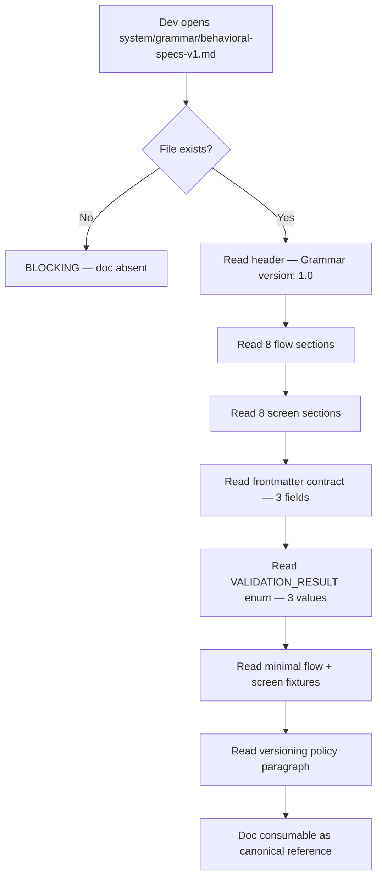
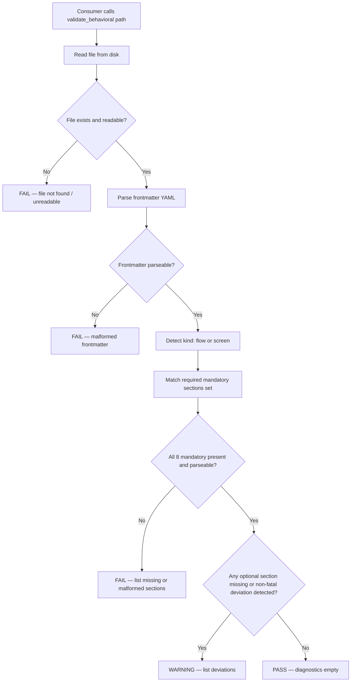
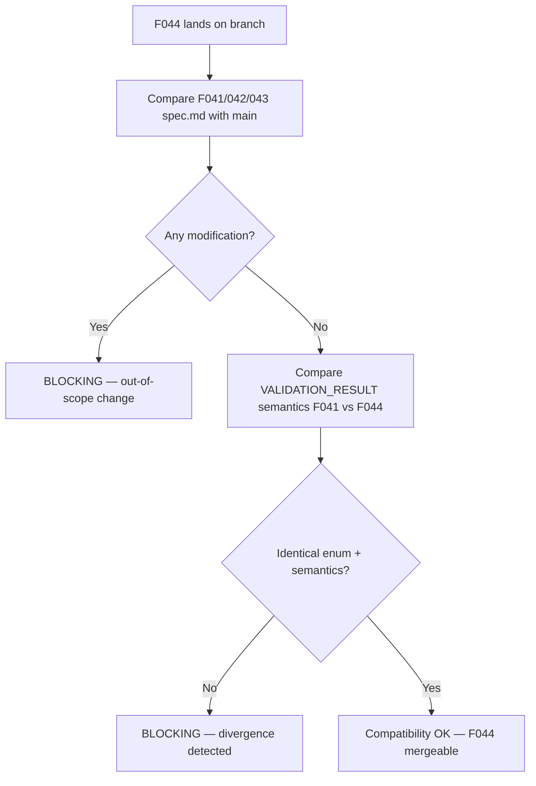

# Feature Spec: Behavioral Grammar v1.0 — Shared Canonical Reference & Validator

- **Feature:** Behavioral Grammar v1.0 — Shared Canonical Reference & Validator
- **Branch:** `feature/044-behavioral-grammar-v1-shared`
- **Date:** 2026-05-14
- **Status:** Draft
- **Input:** Re-document the behavioral specs grammar v1.0 (flow + screen) inside the LiveSpec repo as the canonical, versioned, auditable reference. Today, F041 (`spec.init` ingestion), F042 (`/spec.specify` derivation), and F043 (`/spec.sync-brainstorm`) all reference `VALIDATION_RESULT` and "specify-flows grammar v1.0" without a single canonical doc inside this repo and without a native validator — the grammar lives only in the brainstorm skill. This feature creates the doc + validator module so all three downstream features (and the future F045 native generation) share one source of truth.
- **Feature Number:** 044

---

## User Scenarios & Testing

> Prioritize stories as P1 (critical — must ship), P2 (important — should ship), P3 (nice-to-have — can defer).

### Story 1 — A LiveSpec dev reads the canonical grammar doc `P1`

**As a** LiveSpec developer who needs to ingest, derive, sync, or hand-write a behavioral spec (flow or screen),
**I want to** open one canonical, versioned grammar document inside the LiveSpec repo,
**so that** I no longer have to read the brainstorm skill to know which sections are mandatory, what frontmatter contract applies, and what `VALIDATION_RESULT` means.

**Priority reason:** F041, F042, and F043 already reference "grammar v1.0" and `VALIDATION_RESULT` without an in-repo source of truth. Without this doc, every consumer reinvents the spec — drift is guaranteed.

**Independent test:** open `system/grammar/behavioral-specs-v1.md` in the repo; verify it lists the 8 mandatory flow sections, the 8 mandatory screen sections, the LiveSpec frontmatter contract (3 fields), the `VALIDATION_RESULT` enum (3 values with semantics), at least one minimal valid flow fixture, at least one minimal valid screen fixture, and a versioning policy paragraph. No need to run any code.

#### Acceptance Scenarios (Gherkin — source of truth for tests)

```gherkin
Feature: Canonical behavioral grammar v1.0 reference document

  Scenario: Doc exists at the canonical path
    Given the LiveSpec repository is checked out at HEAD
    When  a developer opens "system/grammar/behavioral-specs-v1.md"
    Then  the file exists
    And   the file declares "Grammar version: 1.0"
    And   the file lists exactly 8 mandatory flow sections
    And   the file lists exactly 8 mandatory screen sections
    And   the file documents the LiveSpec frontmatter contract with three fields: "brainstormSource", "brainstormGeneratedAt", "specStatus"
    And   the file documents the "VALIDATION_RESULT" enum with exactly three values: "PASS", "WARNING", "FAIL"
    And   the file embeds at least one minimal valid flow fixture
    And   the file embeds at least one minimal valid screen fixture
    And   the file documents a versioning policy paragraph naming "v1.0" as the current version

  Scenario: Doc semantics align with F041
    Given F041 spec.md references "VALIDATION_RESULT: PASS", "VALIDATION_RESULT: WARNING", and "VALIDATION_RESULT: FAIL"
    When  a developer cross-reads the F044 grammar doc
    Then  the three enum values defined in F044 match F041 semantics verbatim
    And   no additional enum value is introduced by F044
```

#### User Flow

> The Mermaid flowchart below visualizes the same flow defined in the Gherkin scenarios above.



---

### Story 2 — A consumer module validates a flow or screen file natively `P1`

**As a** consumer of behavioral specs (F041 ingest, F042 derive, F043 sync, future F045 native gen),
**I want to** call a Python function `validate_behavioral(path)` that returns `VALIDATION_RESULT` plus the list of missing/malformed sections,
**so that** I no longer depend on the brainstorm skill at runtime to know whether a flow/screen file is well-formed.

**Priority reason:** F041 explicitly requires the validator (FR-003: "Each candidate flow file is run through the specify-flows grammar validator BEFORE copy"). Today there is no native module — F041 cannot be implemented honestly without this feature.

**Independent test:** import `validator.behavioral_grammar` (or repo-canonical equivalent) in a Python REPL, call it on a fixture flow with all 8 mandatory sections present → returns `PASS`; call it on a fixture flow missing the "Règles métier" section → returns `FAIL` with the missing section name in the diagnostic list.

#### Acceptance Scenarios (Gherkin — source of truth for tests)

```gherkin
Feature: Native behavioral grammar validator

  Scenario: Valid flow returns PASS
    Given a flow file with all 8 mandatory sections present and valid frontmatter
    When  validate_behavioral(path) is called
    Then  the result is VALIDATION_RESULT.PASS
    And   the diagnostics list is empty

  Scenario: Flow missing a mandatory section returns FAIL
    Given a flow file missing one of the 8 mandatory sections
    When  validate_behavioral(path) is called
    Then  the result is VALIDATION_RESULT.FAIL
    And   the diagnostics list contains the name of the missing section
    And   the diagnostics list cites the file path

  Scenario: Flow missing only an optional section returns WARNING
    Given a flow file with all 8 mandatory sections present
    And   a documented optional section (e.g. "Notes") is absent
    When  validate_behavioral(path) is called
    Then  the result is VALIDATION_RESULT.WARNING
    And   the diagnostics list cites the absent optional section as a non-fatal deviation

  Scenario: Valid screen returns PASS
    Given a screen file with all 8 mandatory sections present and valid frontmatter
    When  validate_behavioral(path) is called
    Then  the result is VALIDATION_RESULT.PASS

  Scenario: Screen missing the actor section returns FAIL
    Given a screen file missing the mandatory "Acteur" / actor section
    When  validate_behavioral(path) is called
    Then  the result is VALIDATION_RESULT.FAIL
    And   the diagnostics list names the missing actor section
```

#### User Flow

> The Mermaid flowchart below visualizes the same flow defined in the Gherkin scenarios above.



---

### Story 3 — Compatibility with F041/042/043 is preserved `P1`

**As a** maintainer of LiveSpec,
**I want to** be guaranteed that landing F044 does not modify the spec.md files of F041, F042, or F043 and does not contradict their existing references to `VALIDATION_RESULT` and "grammar v1.0",
**so that** features already merged on `main` keep their contract intact and downstream implementation work is never re-opened by this feature.

**Priority reason:** F041/042/043 are merged behavioral contracts. Any silent renaming, enum extension, or semantics drift would break the bridge before it is ever implemented.

**Independent test:** before merging F044, run `git diff main -- .specs/features/041-spec-init-flow-specs-ingestion/spec.md .specs/features/042-spec-specify-from-brainstorm/spec.md .specs/features/043-spec-sync-brainstorm/spec.md` → expect zero output (no modification).

#### Acceptance Scenarios (Gherkin — source of truth for tests)

```gherkin
Feature: Backward-compatible introduction of grammar v1.0 doc + validator

  Scenario: F041/042/043 spec.md files unchanged
    Given the F044 branch is checked out
    When  "git diff main -- .specs/features/041-*/spec.md .specs/features/042-*/spec.md .specs/features/043-*/spec.md" is executed
    Then  the output is empty

  Scenario: VALIDATION_RESULT enum is consistent with F041
    Given F041 spec.md uses values "PASS", "WARNING", "FAIL"
    When  the F044 grammar doc and validator are inspected
    Then  the three values appear with identical names
    And   no additional value is introduced
    And   the doc semantics for each value match the FR-003 / Edge Cases descriptions in F041
```

#### User Flow



---

## Acceptance Criteria

> Each AC must be specific, testable, and verifiable. Reference them from FR below.

| ID | Criterion | Priority | Story |
|---|---|---|---|
| AC-001 | The file `system/grammar/behavioral-specs-v1.md` exists at the LiveSpec repo root | P1 | Story 1 |
| AC-002 | The doc declares `Grammar version: 1.0` in its first 20 lines | P1 | Story 1 |
| AC-003 | The doc lists exactly 8 mandatory flow sections, named and ordered, each with a one-line description | P1 | Story 1 |
| AC-004 | The doc lists exactly 8 mandatory screen sections, named and ordered, each with a one-line description | P1 | Story 1 |
| AC-005 | The doc documents the LiveSpec frontmatter contract with exactly three fields: `brainstormSource`, `brainstormGeneratedAt`, `specStatus`, each with type, allowed values, and one-line semantics | P1 | Story 1 |
| AC-006 | The doc defines the `VALIDATION_RESULT` enum with exactly three values (`PASS`, `WARNING`, `FAIL`) and one-paragraph semantics per value, byte-compatible with the semantics already implied by F041 spec.md (FR-003 + Key Entities row `VALIDATION_RESULT`) | P1 | Story 1, Story 3 |
| AC-007 | The doc embeds at least one minimal valid flow fixture (full body, all 8 mandatory sections, valid frontmatter) and at least one minimal valid screen fixture, both fenced as ```` ```markdown ```` blocks so they parse as files when copy-pasted | P1 | Story 1 |
| AC-008 | The doc contains a "Versioning policy" paragraph naming the current version (`v1.0`) and stating the rule for breaking-change bumps (e.g. mandatory section addition/removal → minor or major bump, with the chosen rule documented) | P2 | Story 1 |
| AC-009 | A Python module exposing `validate_behavioral(path: Path) -> ValidationOutcome` exists at the canonical validator path (`validator/behavioral_grammar.py`, alongside `validator/coherence/` and `validator/locks.py`) | P1 | Story 2 |
| AC-010 | `validate_behavioral` returns an object whose `result` field is one of the three `VALIDATION_RESULT` enum values and whose `diagnostics` field is a list of strings naming missing/malformed sections (empty list on `PASS`) | P1 | Story 2 |
| AC-011 | Unit tests cover the five required cases: flow valid → PASS, flow with optional section absent → WARNING, flow with mandatory section absent → FAIL, screen valid → PASS, screen missing actor → FAIL | P1 | Story 2 |
| AC-012 | After F044 lands, `git diff main -- .specs/features/041-spec-init-flow-specs-ingestion/spec.md .specs/features/042-spec-specify-from-brainstorm/spec.md .specs/features/043-spec-sync-brainstorm/spec.md` produces zero output | P1 | Story 3 |
| AC-013 | The validator uses only stdlib + dependencies already pinned in `pyproject.toml` (notably `python-frontmatter`, `pyyaml`, `mistune`); no new third-party dependency is added | P2 | Story 2 |
| AC-014 | Out-of-scope guard is enforced: F044 does not introduce native generation, mockup-derivation, interview-based generation, modification of F041/042/043 spec.md files, or refactor of `validator/coherence/` core; the spec.md `## Out-of-Scope Guard` section lists each excluded item explicitly | P1 | Story 3 |

### AC-001
**Criterion:** The file `system/grammar/behavioral-specs-v1.md` exists at the LiveSpec repo root.
**Priority:** P1 | **Story:** Story 1

### AC-002
**Criterion:** The doc declares `Grammar version: 1.0` in its first 20 lines.
**Priority:** P1 | **Story:** Story 1

### AC-003
**Criterion:** The doc lists exactly 8 mandatory flow sections, named and ordered, each with a one-line description.
**Priority:** P1 | **Story:** Story 1

### AC-004
**Criterion:** The doc lists exactly 8 mandatory screen sections, named and ordered, each with a one-line description.
**Priority:** P1 | **Story:** Story 1

### AC-005
**Criterion:** The doc documents the LiveSpec frontmatter contract with exactly three fields: `brainstormSource`, `brainstormGeneratedAt`, `specStatus`, each with type, allowed values, and one-line semantics.
**Priority:** P1 | **Story:** Story 1

### AC-006
**Criterion:** The doc defines the `VALIDATION_RESULT` enum with exactly three values (`PASS`, `WARNING`, `FAIL`) and one-paragraph semantics per value, byte-compatible with the semantics already implied by F041 spec.md (FR-003 + Key Entities row `VALIDATION_RESULT`).
**Priority:** P1 | **Story:** Story 1, Story 3

### AC-007
**Criterion:** The doc embeds at least one minimal valid flow fixture (full body, all 8 mandatory sections, valid frontmatter) and at least one minimal valid screen fixture, both fenced as ```` ```markdown ```` blocks so they parse as files when copy-pasted.
**Priority:** P1 | **Story:** Story 1

### AC-008
**Criterion:** The doc contains a "Versioning policy" paragraph naming the current version (`v1.0`) and stating the rule for breaking-change bumps.
**Priority:** P2 | **Story:** Story 1

### AC-009
**Criterion:** A Python module exposing `validate_behavioral(path: Path) -> ValidationOutcome` exists at `validator/behavioral_grammar.py`.
**Priority:** P1 | **Story:** Story 2

### AC-010
**Criterion:** `validate_behavioral` returns an object whose `result` field is one of the three `VALIDATION_RESULT` enum values and whose `diagnostics` field is a list of strings (empty on `PASS`).
**Priority:** P1 | **Story:** Story 2

### AC-011
**Criterion:** Unit tests cover the five required cases: flow valid → PASS, flow with optional section absent → WARNING, flow with mandatory section absent → FAIL, screen valid → PASS, screen missing actor → FAIL.
**Priority:** P1 | **Story:** Story 2

### AC-012
**Criterion:** After F044 lands, `git diff main -- .specs/features/041-*/spec.md .specs/features/042-*/spec.md .specs/features/043-*/spec.md` produces zero output.
**Priority:** P1 | **Story:** Story 3

### AC-013
**Criterion:** The validator uses only stdlib + dependencies already pinned in `pyproject.toml`; no new third-party dependency is added.
**Priority:** P2 | **Story:** Story 2

### AC-014
**Criterion:** Out-of-scope guard is enforced: F044 does not introduce native generation, mockup-derivation, interview-based generation, modification of F041/042/043 spec.md files, or refactor of `validator/coherence/` core; the spec.md `## Out-of-Scope Guard` section lists each excluded item explicitly.
**Priority:** P1 | **Story:** Story 3

---

## Functional Requirements

> Each FR must map to at least one AC.

| ID | Requirement | AC References |
|---|---|---|
| FR-001 | Create the canonical grammar doc at `system/grammar/behavioral-specs-v1.md` containing: header (title + version), 8 mandatory flow sections (named + ordered + one-line description), 8 mandatory screen sections (same), LiveSpec frontmatter contract (3 fields), `VALIDATION_RESULT` enum (3 values + semantics), minimal valid flow fixture, minimal valid screen fixture, versioning policy paragraph | AC-001, AC-002, AC-003, AC-004, AC-005, AC-006, AC-007, AC-008 |
| FR-002 | The grammar doc's `VALIDATION_RESULT` enum semantics MUST be byte-compatible with F041's existing references (FR-003 wording + Key Entities row); semantics MUST be re-checked against F041 before publication | AC-006, AC-012 |
| FR-003 | Implement `validator/behavioral_grammar.py` exposing a public function `validate_behavioral(path: Path) -> ValidationOutcome` and a public `VALIDATION_RESULT` enum (PASS/WARNING/FAIL) | AC-009, AC-010 |
| FR-004 | The validator MUST detect file kind (flow vs screen) by reading the frontmatter or by path convention (`.specs/flows/*.md` vs `.specs/design/screens/*.md`); the detection rule MUST be documented in the module docstring | AC-009, AC-010 |
| FR-005 | The validator MUST return `FAIL` if any of the 8 mandatory sections (for the detected kind) is absent or unparseable; the diagnostics list MUST cite each missing/malformed section by name and the file path | AC-010, AC-011 |
| FR-006 | The validator MUST return `WARNING` if all 8 mandatory sections are present and parseable but a documented optional section is missing or a non-fatal deviation is detected (e.g. extra unknown section, wrong section order); the diagnostics list MUST cite each deviation | AC-010, AC-011 |
| FR-007 | The validator MUST return `PASS` with empty diagnostics if all 8 mandatory sections are present, parseable, and no documented deviation is detected | AC-010, AC-011 |
| FR-008 | The validator MUST be reachable at the canonical import path `from validator.behavioral_grammar import validate_behavioral, VALIDATION_RESULT, ValidationOutcome` and listed in the `validator` package `__init__.py` if other public modules are exported there (otherwise just importable as a submodule) | AC-009 |
| FR-009 | The validator MUST use only existing pinned dependencies (`python-frontmatter`, `pyyaml`, `mistune`, stdlib); adding a new third-party dependency requires a separate ADR and is out of scope for F044 | AC-013 |
| FR-010 | Unit tests MUST cover the five required cases (flow PASS / flow WARNING / flow FAIL / screen PASS / screen FAIL on missing actor) and live in `tests/test_behavioral_grammar.py` (matching existing `tests/` layout) | AC-011 |
| FR-011 | F044 MUST NOT modify any byte of `.specs/features/041-spec-init-flow-specs-ingestion/spec.md`, `.specs/features/042-spec-specify-from-brainstorm/spec.md`, or `.specs/features/043-spec-sync-brainstorm/spec.md`; CI / verifier MUST be able to assert this with a `git diff main` check | AC-012, AC-014 |
| FR-012 | F044 MUST include an explicit `## Out-of-Scope Guard` section in spec.md listing each item excluded from this feature: native generation (F045), mockup-derivation (F045), interview-based generation (F045), modification of F041/042/043 spec.md files, refactor of `validator/coherence/` core, slash command surface beyond the optional `/spec.validate-behavioral` (deferred to a separate feature if pursued) | AC-014 |

### FR-001
**Requirement:** Create the canonical grammar doc at `system/grammar/behavioral-specs-v1.md` containing all required parts (see table above).
**AC References:** [AC-001](#ac-001), [AC-002](#ac-002), [AC-003](#ac-003), [AC-004](#ac-004), [AC-005](#ac-005), [AC-006](#ac-006), [AC-007](#ac-007), [AC-008](#ac-008)

### FR-002
**Requirement:** The grammar doc's `VALIDATION_RESULT` enum semantics MUST be byte-compatible with F041's existing references; semantics MUST be re-checked against F041 before publication.
**AC References:** [AC-006](#ac-006), [AC-012](#ac-012)

### FR-003
**Requirement:** Implement `validator/behavioral_grammar.py` exposing `validate_behavioral(path) -> ValidationOutcome` and a public `VALIDATION_RESULT` enum (PASS/WARNING/FAIL).
**AC References:** [AC-009](#ac-009), [AC-010](#ac-010)

### FR-004
**Requirement:** The validator MUST detect file kind (flow vs screen) by frontmatter or path convention; rule MUST be documented in the module docstring.
**AC References:** [AC-009](#ac-009), [AC-010](#ac-010)

### FR-005
**Requirement:** The validator MUST return `FAIL` with named diagnostics on any mandatory section absence/malformation.
**AC References:** [AC-010](#ac-010), [AC-011](#ac-011)

### FR-006
**Requirement:** The validator MUST return `WARNING` with named diagnostics for non-fatal deviations (missing optional sections, extra unknown sections, wrong mandatory-section order).
**AC References:** [AC-010](#ac-010), [AC-011](#ac-011)

### FR-007
**Requirement:** The validator MUST return `PASS` with empty diagnostics when all 8 mandatory sections are present and parseable and no deviation is detected.
**AC References:** [AC-010](#ac-010), [AC-011](#ac-011)

### FR-008
**Requirement:** The validator MUST be importable as `from validator.behavioral_grammar import validate_behavioral, VALIDATION_RESULT, ValidationOutcome`.
**AC References:** [AC-009](#ac-009)

### FR-009
**Requirement:** The validator MUST use only existing pinned dependencies; no new third-party dependency.
**AC References:** [AC-013](#ac-013)

### FR-010
**Requirement:** Unit tests in `tests/test_behavioral_grammar.py` MUST cover the five required cases.
**AC References:** [AC-011](#ac-011)

### FR-011
**Requirement:** F044 MUST NOT modify any byte of F041/042/043 spec.md files; this is checked via `git diff main`.
**AC References:** [AC-012](#ac-012), [AC-014](#ac-014)

### FR-012
**Requirement:** F044 spec.md MUST include an explicit `## Out-of-Scope Guard` section listing every excluded item.
**AC References:** [AC-014](#ac-014)

---

## Key Entities

| Entity | Description | Key Fields |
|---|---|---|
| BehavioralGrammarDoc | The canonical Markdown reference at `system/grammar/behavioral-specs-v1.md`. Versioned at `1.0`, lists mandatory + optional sections for both flow and screen kinds, defines the LiveSpec frontmatter contract and the `VALIDATION_RESULT` enum, embeds minimal fixtures, defines the versioning policy. | path (fixed), grammar_version (`1.0`), mandatory_flow_sections (list of 8), mandatory_screen_sections (list of 8), livespec_frontmatter_fields (3), validation_result_values (3), flow_fixture, screen_fixture, versioning_policy |
| ValidationOutcome | Return value of `validate_behavioral(path)`. Carries the enum result and the list of diagnostics. | result: VALIDATION_RESULT, diagnostics: list[str], path: Path, kind: Literal["flow","screen"] |
| VALIDATION_RESULT (enum) | Outcome of running the grammar validator on a single flow or screen file. Three values, no extension allowed in v1.0. | `PASS` (all 8 mandatory sections present and parseable, no deviation) · `WARNING` (all 8 mandatory present and parseable, but documented non-fatal deviation: optional section missing, extra unknown section, wrong mandatory-section order) · `FAIL` (≥1 mandatory section absent or unparseable) |
| LiveSpecFrontmatterContract | The 3-field frontmatter block prepended to imported flow/screen files (defined by F041, re-documented here). | `brainstormSource: <relative path>` · `brainstormGeneratedAt: <ISO timestamp>` · `specStatus: fresh\|stale\|orphaned\|manual` |
| MandatorySectionSet | The ordered set of 8 mandatory section names per kind (flow vs screen), exposed by the validator as a frozen list for downstream introspection. | kind, sections (list[str], length 8) |

---

## Edge Cases

- **Malformed frontmatter:** the file starts with `---` but the YAML is unparseable → return `FAIL` with diagnostic `frontmatter unparseable: <yaml error>`; do NOT attempt section parsing on the body.
- **Empty file:** zero bytes or whitespace only → return `FAIL` with diagnostic `file is empty`; no further parsing.
- **Sections present but in wrong order:** decision = `WARNING` (not `FAIL`). The 8 mandatory sections must all be present and parseable, but their order is treated as a non-fatal deviation; the diagnostic lists the encountered order vs the expected order. Rationale: order matters for human readability, not for downstream consumption (consumers index by section name, not by position).
- **Screen with no sections at all (only frontmatter):** all 8 mandatory sections absent → return `FAIL` with one diagnostic per missing section (8 diagnostics total).
- **Flow with extra non-grammar sections:** decision = `WARNING`. The presence of unknown sections does not break consumers, but is reported as a non-fatal deviation so authors can clean up or expand the grammar in a future bump.
- **File path does not match any known kind convention AND frontmatter does not declare a kind:** return `FAIL` with diagnostic `cannot detect kind: file path is not under .specs/flows/ or .specs/design/screens/ and frontmatter has no kind hint`.
- **File missing on disk:** return `FAIL` with diagnostic `file not found: <path>`; never raise.
- **Mandatory section heading present but body empty (e.g. `## Règles métier` with no content below):** decision = `FAIL` with diagnostic `mandatory section "<name>" is present but empty`. Empty mandatory sections defeat the purpose of the grammar.

---

## Out-of-Scope Guard

> This section is BLOCKING for verification. Every item listed here is explicitly excluded from F044 and MUST NOT appear in plan.md, implementation, or tests.

- **Native generation of behavioral specs from interview / mockups / brainstorm-side scripts** — owned by F045.
- **Mockup-derivation logic** (extracting flows/screens from `.brainstorm/mockups/*.png` or design tool sources) — owned by F045.
- **Interview-based behavioral spec generation** (interactive Q&A flow) — owned by F045.
- **Modification of `.specs/features/041-spec-init-flow-specs-ingestion/spec.md`, `.specs/features/042-spec-specify-from-brainstorm/spec.md`, `.specs/features/043-spec-sync-brainstorm/spec.md`** — these are merged contracts; F044 is purely additive (new doc + new module + new tests).
- **Refactor of `validator/coherence/` or `validator/cli.py` core** — F044 adds a new module alongside; it does NOT touch the existing 4-layer validator pipeline.
- **Slash command surface beyond a possible thin `/spec.validate-behavioral <path>` wrapper** — even the optional slash command is deferred to a separate feature if pursued; F044 ships only the doc + the Python module + the unit tests.
- **Adding any new third-party dependency to `pyproject.toml`** — see FR-009.
- **Wiring the validator into `livespec validate` core dispatch** — out of scope; consumers (F041 etc.) call `validate_behavioral` directly.
- **Defining `specStatus` lifecycle transitions or detection logic** (`fresh` → `stale` → `orphaned`) — owned by F041 / F043; F044 only re-documents the enum values for the frontmatter contract.

---

## Success Criteria

| ID | Criterion | How to Measure |
|---|---|---|
| SC-001 | One canonical doc replaces every implicit reference to "grammar v1.0" across the repo | After F044 lands, `grep -rn "grammar v1.0" .specs/ system/` returns at least one hit pointing to `system/grammar/behavioral-specs-v1.md` and consumers can be linked back to it |
| SC-002 | F041's validator dependency is unblocked | `python -c "from validator.behavioral_grammar import validate_behavioral, VALIDATION_RESULT; print(VALIDATION_RESULT.PASS)"` succeeds and prints `PASS` |
| SC-003 | Validator behavior is locked by tests | `pytest tests/test_behavioral_grammar.py -v` reports 5/5 passed covering the five required cases |
| SC-004 | F041/042/043 are bit-for-bit untouched | `git diff main -- .specs/features/041-spec-init-flow-specs-ingestion/spec.md .specs/features/042-spec-specify-from-brainstorm/spec.md .specs/features/043-spec-sync-brainstorm/spec.md` produces zero output on the F044 branch |
| SC-005 | No new dependency creep | `git diff main -- pyproject.toml requirements*.txt` shows no addition under `dependencies = [...]` |

---

*Generated by `/spec.specify --auto` — LiveSpec v1.0*
